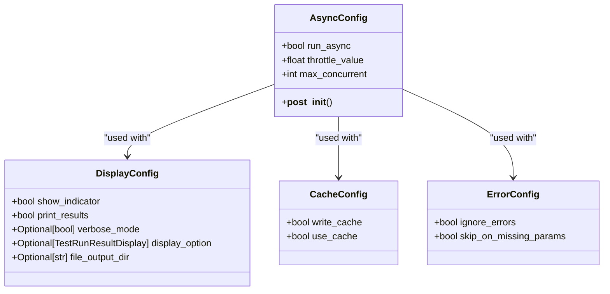
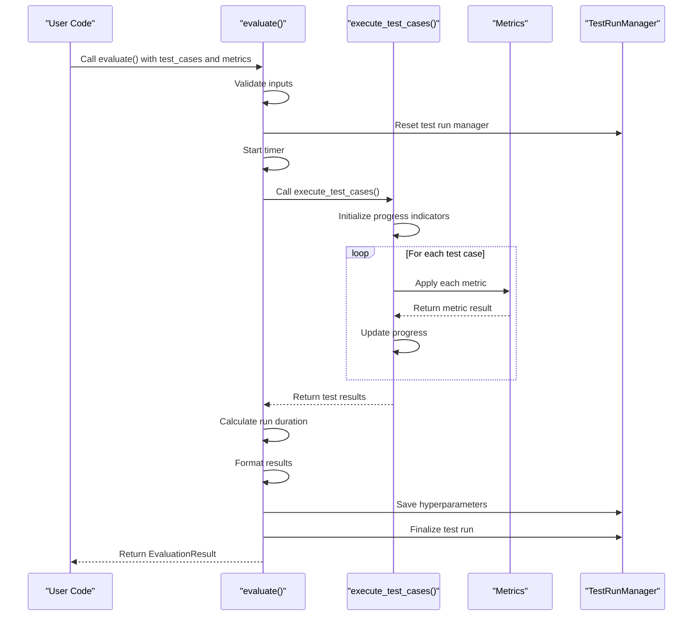

# API Reference

<cite>
**Referenced Files in This Document**   
- [deepeval/__init__.py](file://deepeval/__init__.py)
- [deepeval/evaluate/__init__.py](file://deepeval/evaluate/__init__.py)
- [deepeval/evaluate/evaluate.py](file://deepeval/evaluate/evaluate.py)
- [deepeval/evaluate/configs.py](file://deepeval/evaluate/configs.py)
- [deepeval/test_case/__init__.py](file://deepeval/test_case/__init__.py)
- [deepeval/test_run/test_run.py](file://deepeval/test_run/test_run.py)
- [deepeval/utils.py](file://deepeval/utils.py)
- [deepeval/metrics/api.py](file://deepeval/metrics/api.py)
</cite>

## Table of Contents
1. [Introduction](#introduction)
2. [Core API Functions](#core-api-functions)
3. [Configuration and Settings](#configuration-and-settings)
4. [Test Case Management](#test-case-management)
5. [Evaluation Execution](#evaluation-execution)
6. [Error Handling and Retry Logic](#error-handling-and-retry-logic)
7. [Performance Considerations](#performance-considerations)
8. [Common Issues and Solutions](#common-issues-and-solutions)

## Introduction

The DeepEval API provides a comprehensive interface for programmatic access to evaluation functionality, enabling developers to assess the quality of LLM outputs through various metrics and test scenarios. The public API is designed to be intuitive and flexible, supporting both simple evaluations and complex testing workflows.

The API architecture follows a modular design with clear separation of concerns. Core functionality is exposed through the main `deepeval` package, with specialized modules handling specific aspects like evaluation, test cases, and metrics. The API is built to support both synchronous and asynchronous execution patterns, making it suitable for integration into various development and testing environments.

Key components of the API include:
- **evaluate()**: The primary function for running evaluations on test cases
- **assert_test()**: A function for asserting test conditions and raising exceptions on failure
- **Test Case classes**: Data structures for defining input-output pairs and conversational scenarios
- **Metrics**: Various evaluation metrics that can be applied to test cases
- **Configuration options**: Settings for controlling evaluation behavior

The API is designed to work seamlessly with popular testing frameworks like pytest, allowing for integration into existing test suites. It also provides utilities for logging hyperparameters and managing test runs, making it suitable for both development and production environments.

**Section sources**
- [deepeval/__init__.py](file://deepeval/__init__.py#L1-L107)
- [deepeval/evaluate/__init__.py](file://deepeval/evaluate/__init__.py#L1-L15)

## Core API Functions

The DeepEval API exposes several core functions that serve as the primary interface for evaluation functionality. These functions are designed to be intuitive and flexible, supporting various evaluation scenarios from simple unit tests to comprehensive evaluation suites.

### evaluate()

The `evaluate()` function is the main entry point for running evaluations on a collection of test cases. It accepts a list of test cases and one or more metrics to apply to each test case. The function returns an `EvaluationResult` object containing detailed results for each test case, including pass/fail status, scores, and metadata.

```mermaid
flowchart TD
Start([evaluate() called]) --> ValidateInput["Validate inputs<br/>test_cases, metrics"]
ValidateInput --> CheckType["Check test case type<br/>LLMTestCase or ConversationalTestCase"]
CheckType --> ResetManager["Reset global test run manager"]
ResetManager --> StartTimer["Start evaluation timer"]
StartTimer --> ShowIndicator["Show metric indicators<br/>if display_config.show_indicator"]
ShowIndicator --> ExecuteEval["Execute evaluation<br/>synchronously or asynchronously"]
ExecuteEval --> CalculateDuration["Calculate run duration"]
CalculateDuration --> FormatResults["Format results for display"]
FormatResults --> SaveHyperparams["Save hyperparameters<br/>and prompts"]
SaveHyperparams --> Finalize["Finalize test run<br/>and generate report"]
Finalize --> ReturnResults["Return EvaluationResult"]
```

**Diagram sources**
- [deepeval/evaluate/evaluate.py](file://deepeval/evaluate/evaluate.py#L185-L323)

### assert_test()

The `assert_test()` function provides assertion-based testing capabilities, raising an `AssertionError` when evaluation metrics fail to meet their thresholds. This function is particularly useful in test-driven development scenarios where failing evaluations should cause test failures.

The function supports two primary use cases:
1. Evaluating a single test case against one or more metrics
2. Evaluating goldens with observed callbacks for agent testing

When metrics fail, the function raises a detailed `AssertionError` listing all failed metrics with their scores, thresholds, and reasons for failure.

**Section sources**
- [deepeval/evaluate/evaluate.py](file://deepeval/evaluate/evaluate.py#L71-L183)

### Configuration Classes

The API provides several configuration classes that control various aspects of the evaluation process:



**Diagram sources**
- [deepeval/evaluate/configs.py](file://deepeval/evaluate/configs.py#L1-L39)

## Configuration and Settings

The DeepEval API provides extensive configuration options through several configuration classes that control different aspects of the evaluation process. These configurations allow users to customize behavior based on their specific requirements and constraints.

### AsyncConfig

The `AsyncConfig` class controls asynchronous execution behavior:

- **run_async**: Boolean flag to enable or disable asynchronous execution (default: True)
- **throttle_value**: Time in seconds to wait between initiating test case evaluations (default: 0)
- **max_concurrent**: Maximum number of concurrent evaluations (default: 20)

This configuration is particularly useful when evaluating large test suites, as it allows for parallel execution while preventing resource exhaustion.

### DisplayConfig

The `DisplayConfig` class controls output and display behavior:

- **show_indicator**: Whether to show progress indicators during evaluation (default: True)
- **print_results**: Whether to print results to console (default: True)
- **verbose_mode**: Optional boolean to control verbose output
- **display_option**: Filter for which results to display (ALL, FAILING, PASSING)
- **file_output_dir**: Optional directory path to save results as files

### CacheConfig

The `CacheConfig` class manages caching behavior:

- **write_cache**: Whether to write evaluation results to cache (default: True)
- **use_cache**: Whether to use cached results when available (default: False)

Caching can significantly improve performance when running the same evaluations repeatedly, as it avoids recomputing metrics for identical test cases.

### ErrorConfig

The `ErrorConfig` class controls error handling behavior:

- **ignore_errors**: Whether to ignore errors and continue evaluation (default: False)
- **skip_on_missing_params**: Whether to skip metrics when required parameters are missing (default: False)

These configurations provide flexibility in handling edge cases and incomplete data during evaluation.

**Section sources**
- [deepeval/evaluate/configs.py](file://deepeval/evaluate/configs.py#L1-L39)
- [deepeval/utils.py](file://deepeval/utils.py#L226-L238)

## Test Case Management

The DeepEval API provides robust test case management capabilities through the `LLMTestCase` and `ConversationalTestCase` classes. These classes serve as the fundamental data structures for defining evaluation scenarios.

### LLMTestCase

The `LLMTestCase` class represents a single evaluation scenario with the following attributes:

- **input**: The input prompt or query
- **actual_output**: The actual output from the LLM
- **expected_output**: The expected or ideal output
- **retrieval_context**: Context retrieved from a knowledge base or vector store
- **context**: Additional context information
- **tools_called**: Tools or functions called by the LLM
- **expected_tools**: Expected tools that should be called
- **token_cost**: Cost in tokens for generating the output
- **completion_time**: Time taken to generate the output
- **additional_metadata**: Additional metadata for the test case
- **comments**: Comments or notes about the test case
- **tags**: Tags for categorizing test cases

### ConversationalTestCase

The `ConversationalTestCase` class extends the basic test case to support multi-turn conversations:

- **turns**: A list of `Turn` objects representing the conversation history
- **scenario**: Description of the conversation scenario
- **expected_outcome**: Expected outcome of the conversation
- **user_description**: Description of the user role
- **context**: Conversation context
- **retrieval_context**: Retrieved context for the conversation
- **additional_metadata**: Additional metadata
- **comments**: Comments about the conversation
- **tags**: Tags for categorization

Each `Turn` object contains:
- **role**: The speaker role (e.g., "user", "assistant")
- **content**: The message content
- **user_id**: Identifier for the user
- **retrieval_context**: Retrieved context for this turn
- **tools_called**: Tools called in this turn
- **additional_metadata**: Additional metadata for the turn
- **comments**: Comments about the turn

These test case classes provide a flexible framework for defining evaluation scenarios, from simple input-output pairs to complex multi-turn conversations with rich metadata.

**Section sources**
- [deepeval/test_case/__init__.py](file://deepeval/test_case/__init__.py#L1-L38)
- [deepeval/test_case/llm_test_case.py](file://deepeval/test_case/llm_test_case.py)
- [deepeval/test_case/conversational_test_case.py](file://deepeval/test_case/conversational_test_case.py)

## Evaluation Execution

The evaluation execution process in DeepEval follows a well-defined workflow that ensures consistent and reliable results. Understanding this process is crucial for effectively using the API and interpreting evaluation results.

### Execution Workflow

The evaluation process consists of several key stages:

1. **Input Validation**: The API validates all inputs, ensuring test cases and metrics are properly configured
2. **Configuration Setup**: Evaluation configurations are applied based on the provided settings
3. **Test Case Processing**: Each test case is processed individually, with metrics applied in sequence
4. **Result Aggregation**: Results from individual test cases are aggregated into a comprehensive report
5. **Output Generation**: Results are formatted and displayed according to the configuration



**Diagram sources**
- [deepeval/evaluate/evaluate.py](file://deepeval/evaluate/evaluate.py#L185-L323)
- [deepeval/evaluate/execute.py](file://deepeval/evaluate/execute.py#L263-L800)

### Synchronous vs Asynchronous Execution

The API supports both synchronous and asynchronous execution modes:

**Synchronous Execution**:
- Processes test cases sequentially
- Simpler to debug and understand
- Better for small test suites
- Uses `execute_test_cases()` internally

**Asynchronous Execution**:
- Processes test cases in parallel
- Configurable concurrency limits
- Better performance for large test suites
- Uses `a_execute_test_cases()` internally
- Controlled by `AsyncConfig` parameters

The choice between synchronous and asynchronous execution depends on the specific use case, available resources, and performance requirements.

**Section sources**
- [deepeval/evaluate/execute.py](file://deepeval/evaluate/execute.py#L263-L800)
- [deepeval/evaluate/evaluate.py](file://deepeval/evaluate/evaluate.py#L185-L323)

## Error Handling and Retry Logic

The DeepEval API includes comprehensive error handling mechanisms to ensure robust evaluation even in the presence of failures or edge cases.

### Error Configuration

The `ErrorConfig` class provides two primary error handling options:

- **ignore_errors**: When set to True, the evaluation will continue even if individual metrics fail or encounter errors. This is useful for exploratory testing where you want to see all results regardless of failures.
- **skip_on_missing_params**: When set to True, metrics will be skipped if required parameters are missing rather than failing. This prevents evaluation halting due to incomplete data.

### Timeout Handling

The API implements timeout protection to prevent evaluations from hanging indefinitely:

- **Per-task timeout**: Each metric evaluation has a configurable timeout
- **Gather timeout**: The overall evaluation has a timeout that encompasses all test cases
- **Graceful degradation**: When timeouts occur, the system attempts to salvage partial results

### Retry Mechanisms

While the core API doesn't implement automatic retries, it provides the foundation for implementing retry logic:

- **Idempotent operations**: Evaluation functions are designed to be idempotent, allowing safe retries
- **State management**: The test run manager maintains state that can be used to resume interrupted evaluations
- **Cache integration**: Results are cached, preventing redundant computations on retry

Users can implement custom retry logic by catching exceptions and re-calling evaluation functions with appropriate backoff strategies.

**Section sources**
- [deepeval/evaluate/configs.py](file://deepeval/evaluate/configs.py#L35-L39)
- [deepeval/evaluate/execute.py](file://deepeval/evaluate/execute.py#L220-L230)
- [deepeval/utils.py](file://deepeval/utils.py#L226-L238)

## Performance Considerations

When using the DeepEval API, several performance considerations should be taken into account to ensure efficient and effective evaluations.

### Parallel Execution

The API's asynchronous capabilities can significantly improve performance for large test suites:

- **Concurrency control**: Use the `max_concurrent` parameter to balance performance and resource usage
- **Throttling**: The `throttle_value` parameter can prevent overwhelming external services
- **Resource monitoring**: Monitor CPU, memory, and network usage when running parallel evaluations

### Caching Strategy

Effective use of caching can dramatically reduce evaluation time:

- **Enable caching**: Set `use_cache=True` in `CacheConfig` to leverage cached results
- **Cache invalidation**: Understand when caches are invalidated (e.g., when hyperparameters change)
- **Cache storage**: Consider the storage implications of caching, especially for large test suites

### Memory Management

Large evaluations can consume significant memory:

- **Batch processing**: Consider processing test cases in batches for very large suites
- **Memory monitoring**: Monitor memory usage during long-running evaluations
- **Resource cleanup**: Ensure proper cleanup of temporary files and cached data

### Network Optimization

When evaluations involve external services:

- **Connection pooling**: The API manages connections efficiently
- **Request batching**: Some operations support batching to reduce network overhead
- **Timeout configuration**: Adjust timeouts based on network conditions

**Section sources**
- [deepeval/evaluate/configs.py](file://deepeval/evaluate/configs.py#L1-L39)
- [deepeval/evaluate/execute.py](file://deepeval/evaluate/execute.py#L263-L800)
- [deepeval/metrics/api.py](file://deepeval/metrics/api.py#L1-L282)

## Common Issues and Solutions

This section addresses common issues encountered when using the DeepEval API and provides practical solutions.

### Configuration Issues

**Problem**: Evaluations not using expected configurations
**Solution**: Ensure configurations are properly passed to the evaluate() function and verify they are not being overridden by environment variables.

**Problem**: Cache not working as expected
**Solution**: Verify that both `write_cache` and `use_cache` are set to True in `CacheConfig`, and check that the cache directory is writable.

### Execution Problems

**Problem**: Evaluations hanging or timing out
**Solution**: Adjust timeout settings in the environment variables or implement proper error handling with `ErrorConfig`.

**Problem**: Memory errors with large test suites
**Solution**: Process test cases in smaller batches or increase available memory resources.

### Integration Challenges

**Problem**: Issues with pytest integration
**Solution**: Ensure the `deepeval` CLI is properly installed and configured, and verify that test files follow the expected structure.

**Problem**: Missing metrics or unexpected metric behavior
**Solution**: Verify that required metric dependencies are installed and check the metric documentation for proper usage patterns.

### Performance Bottlenecks

**Problem**: Slow evaluation times
**Solution**: Enable asynchronous execution, increase `max_concurrent`, and ensure caching is properly configured.

**Problem**: High resource utilization
**Solution**: Reduce `max_concurrent`, implement throttling with `throttle_value`, and monitor system resources during evaluation.

These common issues and their solutions help ensure smooth operation of the DeepEval API in various environments and use cases.

**Section sources**
- [deepeval/evaluate/evaluate.py](file://deepeval/evaluate/evaluate.py#L185-L323)
- [deepeval/evaluate/configs.py](file://deepeval/evaluate/configs.py#L1-L39)
- [deepeval/utils.py](file://deepeval/utils.py#L226-L238)