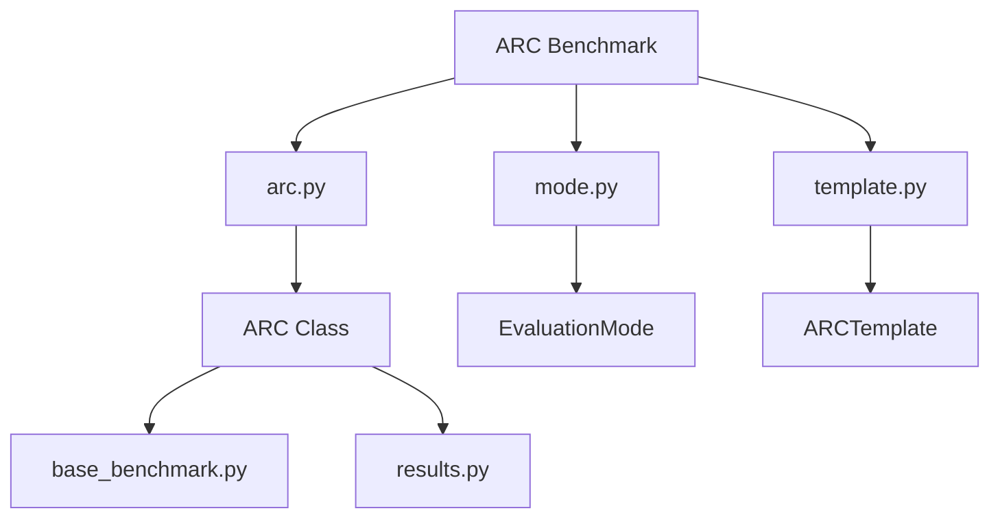
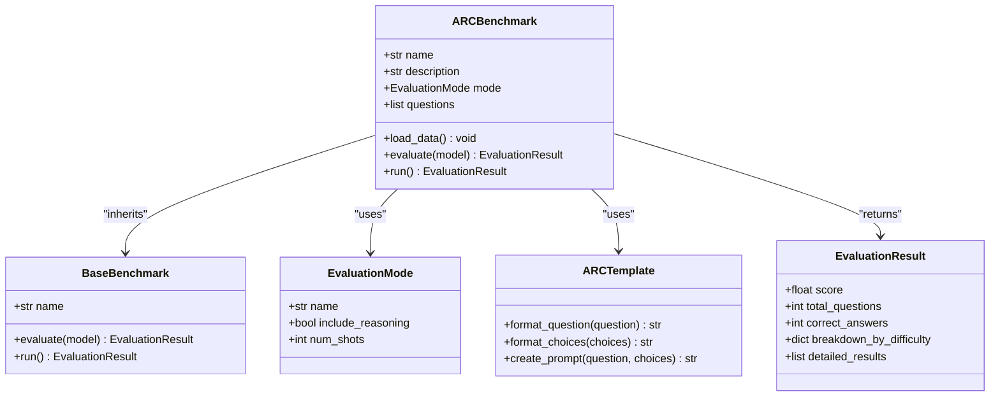
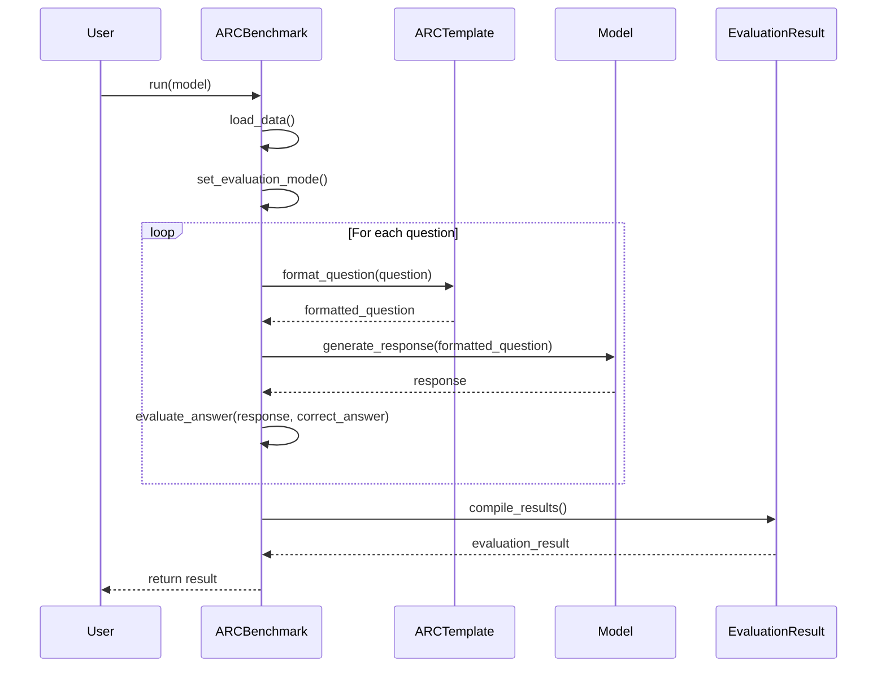
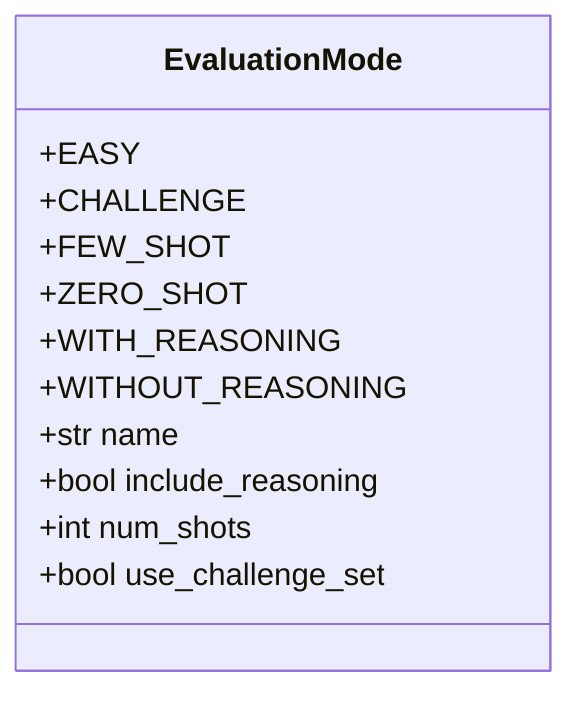
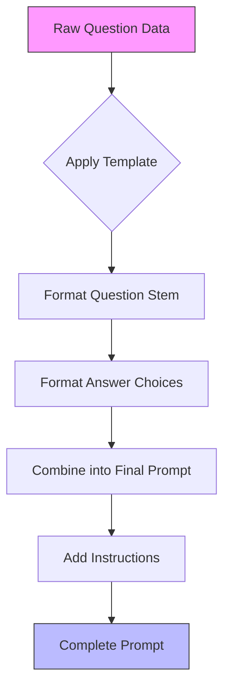
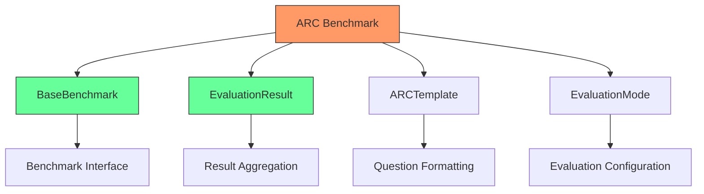

# ARC Benchmark

<cite>
**Referenced Files in This Document**   
- [arc.py](file://deepeval/benchmarks/arc/arc.py)
- [mode.py](file://deepeval/benchmarks/arc/mode.py)
- [template.py](file://deepeval/benchmarks/arc/template.py)
- [base_benchmark.py](file://deepeval/benchmarks/base_benchmark.py)
- [results.py](file://deepeval/benchmarks/results.py)
</cite>

## Table of Contents
1. [Introduction](#introduction)
2. [Project Structure](#project-structure)
3. [Core Components](#core-components)
4. [Architecture Overview](#architecture-overview)
5. [Detailed Component Analysis](#detailed-component-analysis)
6. [Dependency Analysis](#dependency-analysis)
7. [Performance Considerations](#performance-considerations)
8. [Troubleshooting Guide](#troubleshooting-guide)
9. [Conclusion](#conclusion)

## Introduction
The AI2 Reasoning Challenge (ARC) benchmark in DeepEval is designed to evaluate the scientific reasoning capabilities of language models using grade-school level multiple-choice science questions. This benchmark assesses a model's ability to perform true reasoning rather than simple pattern matching by testing its performance on questions that require understanding of scientific concepts and logical inference. The ARC benchmark is divided into two subsets: Easy and Challenge, enabling evaluation of models across different difficulty levels. It supports various evaluation modes and uses templated question formatting to standardize input presentation. This document details the implementation architecture, usage patterns, and best practices for interpreting results from ARC evaluations.

## Project Structure
The ARC benchmark is implemented within the `deepeval/benchmarks/arc` directory, following a modular structure that separates concerns into distinct components. The implementation leverages a base benchmark class for common functionality while providing specialized classes for ARC-specific features.

**Diagram sources**
- [arc.py](file://deepeval/benchmarks/arc/arc.py)
- [mode.py](file://deepeval/benchmarks/arc/mode.py)
- [template.py](file://deepeval/benchmarks/arc/template.py)

**Section sources**
- [arc.py](file://deepeval/benchmarks/arc/arc.py)
- [mode.py](file://deepeval/benchmarks/arc/mode.py)
- [template.py](file://deepeval/benchmarks/arc/template.py)

## Core Components
The ARC benchmark consists of three primary components: the main ARC class that orchestrates evaluation, the mode module that defines evaluation strategies, and the template module that handles question formatting. These components work together to load, format, and evaluate model responses on science questions. The system is designed to measure both factual knowledge and reasoning ability by analyzing performance across the Easy and Challenge subsets.

**Section sources**
- [arc.py](file://deepeval/benchmarks/arc/arc.py)
- [mode.py](file://deepeval/benchmarks/arc/mode.py)
- [template.py](file://deepeval/benchmarks/arc/template.py)

## Architecture Overview
The ARC benchmark architecture follows a clean separation of responsibilities, with distinct modules handling different aspects of the evaluation process. The system inherits from a base benchmark class that provides common evaluation infrastructure, while extending functionality to meet the specific requirements of scientific reasoning assessment.

**Diagram sources**
- [arc.py](file://deepeval/benchmarks/arc/arc.py)
- [base_benchmark.py](file://deepeval/benchmarks/base_benchmark.py)
- [results.py](file://deepeval/benchmarks/results.py)

## Detailed Component Analysis

### ARC Class Analysis
The ARC class serves as the main entry point for the benchmark, coordinating the loading of questions, application of templates, and execution of evaluations. It manages the distinction between Easy and Challenge question sets and provides methods for analyzing performance by difficulty level.

**Diagram sources**
- [arc.py](file://deepeval/benchmarks/arc/arc.py)
- [template.py](file://deepeval/benchmarks/arc/template.py)
- [results.py](file://deepeval/benchmarks/results.py)

**Section sources**
- [arc.py](file://deepeval/benchmarks/arc/arc.py)

### Mode Module Analysis
The mode module defines different evaluation strategies for the ARC benchmark, allowing users to configure aspects such as the number of shots and whether to include reasoning steps in the evaluation process. This flexibility enables testing of models under various conditions to better understand their reasoning capabilities.

**Diagram sources**
- [mode.py](file://deepeval/benchmarks/arc/mode.py)

**Section sources**
- [mode.py](file://deepeval/benchmarks/arc/mode.py)

### Template Module Analysis
The template module handles the formatting of ARC questions and answer choices, ensuring consistent presentation to the evaluated models. It implements the specific prompt structure required by the benchmark, including proper formatting of multiple-choice options and question text.

**Diagram sources**
- [template.py](file://deepeval/benchmarks/arc/template.py)

**Section sources**
- [template.py](file://deepeval/benchmarks/arc/template.py)

## Dependency Analysis
The ARC benchmark depends on several core components within the DeepEval framework, including the base benchmark class for shared functionality and the results module for reporting evaluation outcomes. It also relies on the template system for question formatting and the mode definitions for evaluation configuration.

**Diagram sources**
- [arc.py](file://deepeval/benchmarks/arc/arc.py)
- [base_benchmark.py](file://deepeval/benchmarks/base_benchmark.py)
- [results.py](file://deepeval/benchmarks/results.py)

**Section sources**
- [arc.py](file://deepeval/benchmarks/arc/arc.py)
- [base_benchmark.py](file://deepeval/benchmarks/base_benchmark.py)
- [results.py](file://deepeval/benchmarks/results.py)

## Performance Considerations
The ARC benchmark is designed to efficiently evaluate models on scientific reasoning tasks while providing detailed performance insights. The implementation minimizes overhead by loading question data once and reusing it across evaluations. The modular design allows for easy extension and customization of evaluation parameters without affecting core functionality.

## Troubleshooting Guide
Common issues when using the ARC benchmark include domain-specific knowledge gaps in models, ambiguous questions that may have multiple plausible answers, and model bias toward certain answer formats. To improve evaluation reliability, ensure that models are properly prompted and that evaluation modes are appropriately configured for the intended use case. When interpreting results, consider the context of the difficulty levels and analyze performance separately for Easy and Challenge questions to gain deeper insights into a model's reasoning capabilities.

**Section sources**
- [arc.py](file://deepeval/benchmarks/arc/arc.py)
- [mode.py](file://deepeval/benchmarks/arc/mode.py)
- [template.py](file://deepeval/benchmarks/arc/template.py)

## Conclusion
The ARC benchmark in DeepEval provides a robust framework for evaluating the scientific reasoning abilities of language models. By leveraging grade-school level multiple-choice science questions and separating them into Easy and Challenge sets, it offers a nuanced assessment of model capabilities beyond simple pattern matching. The modular architecture, with its clear separation of concerns between evaluation logic, mode configuration, and question templating, enables flexible and reliable testing of models under various conditions. This benchmark is particularly valuable for researchers and developers seeking to understand and improve the true reasoning capabilities of AI systems.