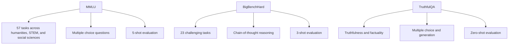
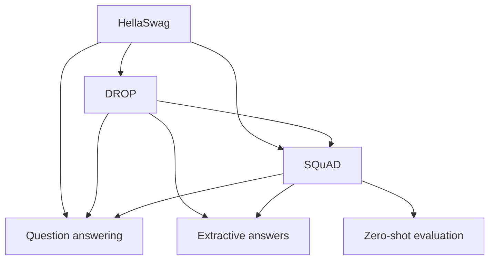
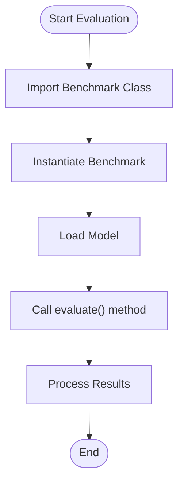
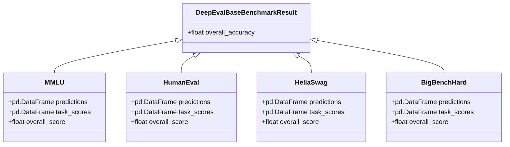
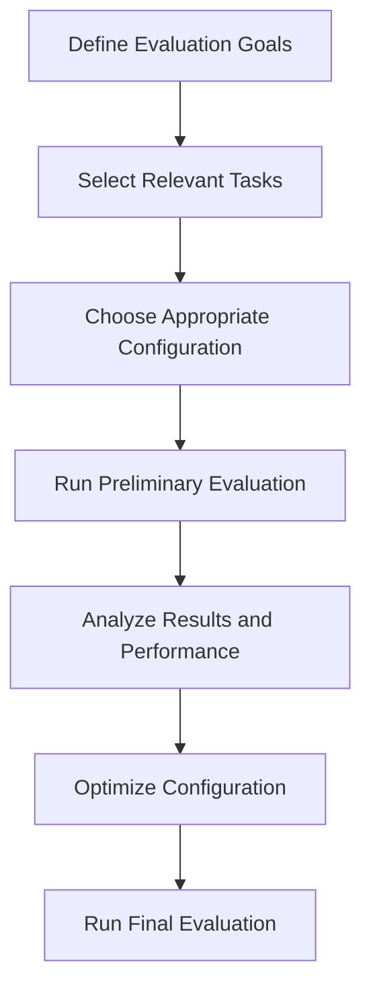

# Benchmarking

<cite>
**Referenced Files in This Document**   
- [__init__.py](file://deepeval/benchmarks/__init__.py)
- [base_benchmark.py](file://deepeval/benchmarks/base_benchmark.py)
- [mmlu.py](file://deepeval/benchmarks/mmlu/mmlu.py)
- [human_eval.py](file://deepeval/benchmarks/human_eval/human_eval.py)
- [hellaswag.py](file://deepeval/benchmarks/hellaswag/hellaswag.py)
- [big_bench_hard.py](file://deepeval/benchmarks/big_bench_hard/big_bench_hard.py)
- [task.py](file://deepeval/benchmarks/mmlu/task.py)
- [template.py](file://deepeval/benchmarks/mmlu/template.py)
- [schema.py](file://deepeval/benchmarks/schema.py)
- [execute.py](file://deepeval/evaluate/execute.py)
- [evaluate.py](file://deepeval/evaluate/evaluate.py)
</cite>

## Table of Contents
1. [Introduction](#introduction)
2. [Benchmarking Architecture](#benchmarking-architecture)
3. [Supported Benchmarks](#supported-benchmarks)
4. [Running Benchmark Evaluations](#running-benchmark-evaluations)
5. [Configuration Options](#configuration-options)
6. [Results Aggregation and Interpretation](#results-aggregation-and-interpretation)
7. [Performance Considerations](#performance-considerations)
8. [Common Issues and Solutions](#common-issues-and-solutions)
9. [Best Practices](#best-practices)

## Introduction

DeepEval provides a comprehensive benchmarking framework for evaluating Large Language Models (LLMs) against standardized datasets and industry benchmarks. The system enables developers and researchers to assess model performance across various domains and tasks, providing quantitative metrics for comparison and improvement. DeepEval's benchmarking capabilities support popular benchmarks such as MMLU, HellaSwag, HumanEval, and others, offering a unified interface for evaluation across different domains.

The benchmarking system in DeepEval is designed to be both accessible to beginners and powerful enough for experienced developers. It provides conceptual overviews for those new to LLM evaluation while offering detailed technical specifications for advanced users. The framework follows consistent terminology throughout the codebase, using terms like 'benchmark', 'task', 'mode', 'template', and 'results' to maintain clarity and consistency.

**Section sources**
- [__init__.py](file://deepeval/benchmarks/__init__.py#L1-L38)

## Benchmarking Architecture

DeepEval's benchmarking architecture is built around a modular and extensible design that allows for easy integration of new benchmarks while maintaining consistency across evaluations. The core of the architecture is the `DeepEvalBaseBenchmark` class, which serves as the foundation for all benchmark implementations.

```mermaid
classDiagram
class DeepEvalBaseBenchmark {
+List[T] tasks
+Dataset dataset
+__init__(dataset : Optional[Dataset])
+load_benchmark_dataset(*args, **kwargs) List[Golden]
+evaluate(model : DeepEvalBaseLLM, *args, **kwargs) DeepEvalBaseBenchmarkResult
}
class DeepEvalBaseBenchmarkResult {
+float overall_accuracy
}
class MMLU {
+List[MMLUTask] tasks
+int n_shots
+int n_problems_per_task
+Scorer scorer
+List[Dict] shots_dataset
+int n_shots
+pd.DataFrame predictions
+pd.DataFrame task_scores
+float overall_score
+bool verbose_mode
+str confinement_instructions
+evaluate(model : DeepEvalBaseLLM, *args, batch_size : Union[int, None], **kwargs) DeepEvalBaseBenchmarkResult
+predict(model : DeepEvalBaseLLM, task : MMLUTask, golden : Golden) Dict
+batch_predict(model : DeepEvalBaseLLM, task : MMLUTask, goldens : List[Golden]) List[Dict]
+load_benchmark_dataset(task : MMLUTask) List[Golden]
+print_verbose_logs(idx : int, task_value : str, input : str, expected_output : str, prediction : str, score : int) str
}
class HumanEval {
+List[HumanEvalTask] tasks
+Scorer scorer
+float temperature
+int n
+Dict c
+Dict functions
+pd.DataFrame predictions
+pd.DataFrame task_scores
+float overall_score
+bool verbose_mode
+evaluate(model : DeepEvalBaseLLM, *args, k : int, **kwargs) DeepEvalBaseBenchmarkResult
+predict(model : DeepEvalBaseLLM, task : HumanEvalTask, golden : Golden, k : int) Dict
+load_benchmark_dataset(task : HumanEvalTask) Golden
+print_verbose_logs(task_value : str, input : str, prediction : str, score : int) str
}
class HellaSwag {
+List[HellaSwagTask] tasks
+int n_shots
+int n_problems_per_task
+Scorer scorer
+List[Dict] shots_dataset
+pd.DataFrame predictions
+pd.DataFrame task_scores
+float overall_score
+bool verbose_mode
+str confinement_instructions
+evaluate(model : DeepEvalBaseLLM, *args, batch_size : Union[int, None], **kwargs) DeepEvalBaseBenchmarkResult
+predict(model : DeepEvalBaseLLM, task : HellaSwagTask, golden : Golden) Dict
+batch_predict(model : DeepEvalBaseLLM, task : HellaSwagTask, goldens : List[Golden]) List[Dict]
+load_benchmark_dataset(task : HellaSwagTask) List[Golden]
+print_verbose_logs(idx : int, task_value : str, input : str, expected_output : str, prediction : str, score : int) str
}
class BigBenchHard {
+List[BigBenchHardTask] tasks
+int n_shots
+bool enable_cot
+int n_problems_per_task
+Scorer scorer
+int n_shots
+bool enable_cot
+pd.DataFrame predictions
+pd.DataFrame task_scores
+float overall_score
+bool verbose_mode
+Dict[BigBenchHardTask, str] confinement_instructions_dict
+evaluate(model : DeepEvalBaseLLM, *args, batch_size : Optional[int], **kwargs) DeepEvalBaseBenchmarkResult
+predict(model : DeepEvalBaseLLM, task : BigBenchHardTask, golden : Golden) Dict
+batch_predict(model : DeepEvalBaseLLM, task : BigBenchHardTask, goldens : List[Golden]) List[Dict]
+load_benchmark_dataset(task : BigBenchHardTask) List[Golden]
+print_verbose_logs(idx : int, task_value : str, input : str, expected_output : str, prediction : str, score : int) str
}
DeepEvalBaseBenchmark <|-- MMLU : "extends"
DeepEvalBaseBenchmark <|-- HumanEval : "extends"
DeepEvalBaseBenchmark <|-- HellaSwag : "extends"
DeepEvalBaseBenchmark <|-- BigBenchHard : "extends"
DeepEvalBaseBenchmark --> DeepEvalBaseBenchmarkResult : "returns"
```



**Diagram sources **
- [base_benchmark.py](file://deepeval/benchmarks/base_benchmark.py#L1-L33)
- [mmlu.py](file://deepeval/benchmarks/mmlu/mmlu.py#L1-L316)
- [human_eval.py](file://deepeval/benchmarks/human_eval/human_eval.py#L1-L248)
- [hellaswag.py](file://deepeval/benchmarks/hellaswag/hellaswag.py#L1-L325)
- [big_bench_hard.py](file://deepeval/benchmarks/big_bench_hard/big_bench_hard.py#L1-L330)

The architecture follows a consistent pattern across all benchmarks:

1. **Base Class**: `DeepEvalBaseBenchmark` provides the foundational interface with abstract methods for loading datasets and evaluating models.
2. **Task Enumeration**: Each benchmark defines a set of tasks through an Enum class (e.g., `MMLUTask`, `HumanEvalTask`).
3. **Template System**: Templates format prompts according to benchmark requirements, ensuring consistency in input formatting.
4. **Schema Validation**: Pydantic models define the expected output format for each benchmark, enabling structured output parsing.
5. **Evaluation Pipeline**: The evaluation process follows a standardized flow: load dataset, generate predictions, calculate scores, and aggregate results.

The system supports both single and batch processing through the `predict` and `batch_predict` methods, with automatic detection of batch capabilities in the underlying model. Results are stored in pandas DataFrames for easy analysis and visualization.

**Section sources**
- [base_benchmark.py](file://deepeval/benchmarks/base_benchmark.py#L1-L33)
- [mmlu.py](file://deepeval/benchmarks/mmlu/mmlu.py#L1-L316)
- [schema.py](file://deepeval/benchmarks/schema.py#L1-L172)

## Supported Benchmarks

DeepEval supports a wide range of industry-standard benchmarks, each designed to evaluate different aspects of LLM capabilities. The supported benchmarks can be categorized into several domains:

### Knowledge and Reasoning Benchmarks



**Diagram sources **
- [__init__.py](file://deepeval/benchmarks/__init__.py#L1-L38)
- [mmlu.py](file://deepeval/benchmarks/mmlu/mmlu.py#L1-L316)
- [big_bench_hard.py](file://deepeval/benchmarks/big_bench_hard/big_bench_hard.py#L1-L330)
- [truthful_qa.py](file://deepeval/benchmarks/truthful_qa/truthful_qa.py)

### Language Understanding Benchmarks



**Diagram sources **
- [__init__.py](file://deepeval/benchmarks/__init__.py#L1-L38)
- [hellaswag.py](file://deepeval/benchmarks/hellaswag/hellaswag.py#L1-L325)
- [drop.py](file://deepeval/benchmarks/drop/drop.py)
- [squad.py](file://deepeval/benchmarks/squad/squad.py)

### Code and Mathematical Reasoning Benchmarks

```mermaid
graph TD
A[HumanEval] --> B[Code generation]
A --> C[Pass@k metric]
A --> D[200 samples per task]
B[GSM8K] --> C[Mathematical reasoning]
B --> D[Multistep arithmetic]
B --> E[Zero-shot evaluation]
C[MathQA] --> D[Mathematical problem solving]
C --> E[Multiple choice]
C --> F[Zero-shot evaluation]
```

**Diagram sources **
- [__init__.py](file://deepeval/benchmarks/__init__.py#L1-L38)
- [human_eval.py](file://deepeval/benchmarks/human_eval/human_eval.py#L1-L248)
- [gsm8k.py](file://deepeval/benchmarks/gsm8k/gsm8k.py)
- [math_qa.py](file://deepeval/benchmarks/math_qa/math_qa.py)

The benchmarks are implemented as separate modules within the `deepeval/benchmarks` directory, each following a consistent structure with dedicated files for tasks, templates, and main implementation. This modular design allows for easy extension and maintenance of benchmark implementations.

**Section sources**
- [__init__.py](file://deepeval/benchmarks/__init__.py#L1-L38)
- [mmlu.py](file://deepeval/benchmarks/mmlu/mmlu.py#L1-L316)
- [human_eval.py](file://deepeval/benchmarks/human_eval/human_eval.py#L1-L248)
- [hellaswag.py](file://deepeval/benchmarks/hellaswag/hellaswag.py#L1-L325)

## Running Benchmark Evaluations

Executing benchmark evaluations in DeepEval follows a consistent pattern across all supported benchmarks. The process involves importing the specific benchmark class, instantiating it with desired configuration options, and calling the evaluate method with a model instance.

### Basic Evaluation Example



**Diagram sources **
- [mmlu.py](file://deepeval/benchmarks/mmlu/mmlu.py#L48-L164)
- [evaluate.py](file://deepeval/evaluate/evaluate.py#L194-L231)

Here's a practical example of running an MMLU evaluation:

```python
from deepeval.benchmarks import MMLU
from deepeval.models import OpenAIModel

# Initialize the MMLU benchmark
mmlu = MMLU(
    tasks=["high_school_mathematics", "college_computer_science"],
    n_shots=5,
    verbose_mode=True
)

# Load your model
model = OpenAIModel(model="gpt-4")

# Run the evaluation
results = mmlu.evaluate(model, batch_size=4)

# Access results
print(f"Overall accuracy: {results.overall_accuracy}")
print(f"Task scores:\n{mmlu.task_scores}")
```

For HumanEval, the process is similar but with different configuration options:

```python
from deepeval.benchmarks import HumanEval
from deepeval.models import OpenAIModel

# Initialize the HumanEval benchmark
human_eval = HumanEval(
    tasks=["human_eval_task"],
    n=200,
    verbose_mode=True
)

# Load your model
model = OpenAIModel(model="gpt-4")

# Run the evaluation with k=1 for Pass@1 metric
results = human_eval.evaluate(model, k=1)

# Access results
print(f"Overall pass@1 rate: {results.overall_accuracy}")
```

The evaluation process automatically handles dataset loading, prompt formatting, prediction generation, and result aggregation. For benchmarks that support it, batch processing can significantly improve evaluation speed by processing multiple inputs simultaneously.

**Section sources**
- [mmlu.py](file://deepeval/benchmarks/mmlu/mmlu.py#L48-L164)
- [human_eval.py](file://deepeval/benchmarks/human_eval/human_eval.py#L98-L166)
- [evaluate.py](file://deepeval/evaluate/evaluate.py#L194-L231)

## Configuration Options

DeepEval provides extensive configuration options for customizing benchmark evaluations to meet specific requirements. These options are exposed through the constructor of each benchmark class and allow fine-tuning of various aspects of the evaluation process.

### Common Configuration Parameters

| Parameter | Type | Default | Description |
|---------|------|---------|-------------|
| tasks | List[Enum] | All tasks | Specific tasks to evaluate |
| verbose_mode | bool | False | Enable detailed logging |
| n_problems_per_task | int | None | Limit number of problems per task |
| batch_size | int | None | Batch size for parallel processing |

**Section sources**
- [mmlu.py](file://deepeval/benchmarks/mmlu/mmlu.py#L18-L47)
- [human_eval.py](file://deepeval/benchmarks/human_eval/human_eval.py#L73-L96)
- [hellaswag.py](file://deepeval/benchmarks/hellaswag/hellaswag.py#L18-L49)

### Benchmark-Specific Configuration

#### MMLU Configuration
- **n_shots** (int): Number of examples for few-shot learning (1-5)
- **confinement_instructions** (str): Instructions to constrain model output format

#### HumanEval Configuration
- **n** (int): Number of samples to generate for pass@k calculation
- **temperature** (float): Temperature parameter for generation diversity

#### BigBenchHard Configuration
- **enable_cot** (bool): Enable chain-of-thought reasoning
- **confinement_instructions_dict** (Dict): Custom instructions per task

#### HellaSwag Configuration
- **n_shots** (int): Number of examples for few-shot learning (1-15)

These configuration options allow users to adapt the evaluation process to their specific needs, whether it's running a quick assessment with a subset of tasks or conducting a comprehensive evaluation with detailed logging.

**Section sources**
- [mmlu.py](file://deepeval/benchmarks/mmlu/mmlu.py#L18-L47)
- [human_eval.py](file://deepeval/benchmarks/human_eval/human_eval.py#L73-L96)
- [big_bench_hard.py](file://deepeval/benchmarks/big_bench_hard/big_bench_hard.py#L48-L80)
- [hellaswag.py](file://deepeval/benchmarks/hellaswag/hellaswag.py#L18-L49)

## Results Aggregation and Interpretation

DeepEval provides comprehensive results aggregation and reporting capabilities to help users interpret benchmark evaluation outcomes. The results are structured to provide both high-level summaries and detailed insights into model performance.

### Results Structure



**Diagram sources **
- [base_benchmark.py](file://deepeval/benchmarks/base_benchmark.py#L9-L11)
- [mmlu.py](file://deepeval/benchmarks/mmlu/mmlu.py#L37-L41)
- [human_eval.py](file://deepeval/benchmarks/human_eval/human_eval.py#L92-L94)
- [hellaswag.py](file://deepeval/benchmarks/hellaswag/hellaswag.py#L39-L41)
- [big_bench_hard.py](file://deepeval/benchmarks/big_bench_hard/big_bench_hard.py#L72-L74)

The results include:

1. **Overall Accuracy**: A single metric representing the model's performance across all evaluated tasks.
2. **Task Scores**: Detailed performance metrics for each individual task, allowing identification of strengths and weaknesses.
3. **Predictions DataFrame**: Comprehensive record of all inputs, predictions, expected outputs, and correctness scores.

For MMLU and similar multiple-choice benchmarks, the overall accuracy represents the percentage of correctly answered questions. For HumanEval, the metric is the pass@k rate, which measures the probability that at least one of k generated solutions passes all test cases.

The results can be accessed programmatically for further analysis or exported for reporting purposes. The pandas DataFrame format enables easy integration with data analysis tools and visualization libraries.

**Section sources**
- [mmlu.py](file://deepeval/benchmarks/mmlu/mmlu.py#L140-L160)
- [human_eval.py](file://deepeval/benchmarks/human_eval/human_eval.py#L141-L162)
- [hellaswag.py](file://deepeval/benchmarks/hellaswag/hellaswag.py#L144-L164)
- [big_bench_hard.py](file://deepeval/benchmarks/big_bench_hard/big_bench_hard.py#L173-L193)

## Performance Considerations

Running benchmark evaluations, especially with large models and extensive datasets, can be computationally intensive. DeepEval provides several features to optimize performance and manage resource usage effectively.

### Batch Processing

```mermaid
flowchart TD
A[Single Processing] --> |One input at a time| B[Slower execution]
C[Batch Processing] --> |Multiple inputs simultaneously| D[Faster execution]
E[Model Capability Check] --> F[should_use_batch()]
F --> |Supports batch| G[Use batch_predict()]
F --> |No batch support| H[Use predict()]
```

**Diagram sources **
- [utils.py](file://deepeval/benchmarks/utils.py#L6-L13)
- [mmlu.py](file://deepeval/benchmarks/mmlu/mmlu.py#L50-L54)
- [hellaswag.py](file://deepeval/benchmarks/hellaswag/hellaswag.py#L50-L54)

The system automatically detects whether the model supports batch processing through the `should_use_batch()` utility function. When batch processing is available, it can significantly reduce evaluation time by processing multiple inputs in parallel.

### Memory Management

For large benchmarks like MMLU with 57 tasks, memory usage can become a concern. DeepEval implements several optimizations:

1. **Dataset Caching**: Benchmark datasets are loaded once and cached in memory to avoid repeated downloads.
2. **Incremental Processing**: Results are aggregated incrementally rather than storing all intermediate data in memory.
3. **Garbage Collection**: Unused objects are explicitly cleaned up to minimize memory footprint.

### Time Optimization

The evaluation process includes progress tracking with tqdm, providing real-time feedback on evaluation progress. For long-running evaluations, users can:

- Limit the number of problems per task using `n_problems_per_task`
- Select specific tasks of interest rather than evaluating all tasks
- Use smaller batch sizes to balance memory usage and speed

These performance considerations ensure that benchmark evaluations can be conducted efficiently, even with limited computational resources.

**Section sources**
- [utils.py](file://deepeval/benchmarks/utils.py#L6-L13)
- [mmlu.py](file://deepeval/benchmarks/mmlu/mmlu.py#L62-L64)
- [hellaswag.py](file://deepeval/benchmarks/hellaswag/hellaswag.py#L64-L65)

## Common Issues and Solutions

When running benchmark evaluations in DeepEval, users may encounter various issues. This section addresses common problems and their solutions.

### Model Output Format Issues

**Problem**: Model generates responses that don't match the expected format, leading to parsing errors.

**Solution**: The system automatically falls back to text-based confinement instructions when structured output parsing fails. Users can also provide custom confinement instructions:

```python
mmlu = MMLU(
    confinement_instructions="Output only 'A', 'B', 'C', or 'D' without any explanation."
)
```

### Dataset Loading Problems

**Problem**: Network issues or authentication problems prevent dataset loading from Hugging Face.

**Solution**: Ensure internet connectivity and Hugging Face authentication. For offline use, consider pre-downloading datasets.

### Performance Bottlenecks

**Problem**: Evaluations run slowly, especially with large models or many tasks.

**Solutions**:
- Use batch processing when supported by the model
- Limit the number of tasks or problems per task
- Use smaller models for preliminary evaluations
- Increase batch size (within memory constraints)

### Memory Exhaustion

**Problem**: Running out of memory during evaluation, especially with large benchmarks.

**Solutions**:
- Process tasks sequentially rather than loading all at once
- Use smaller batch sizes
- Monitor memory usage and adjust configuration accordingly
- Consider using models with smaller memory footprints

### Timeout Errors

**Problem**: Individual predictions time out, causing evaluation to fail.

**Solution**: Adjust timeout settings through environment variables or configuration parameters, and ensure the model is responsive.

These common issues and their solutions help ensure smooth benchmark evaluation execution across different environments and use cases.

**Section sources**
- [mmlu.py](file://deepeval/benchmarks/mmlu/mmlu.py#L181-L192)
- [hellaswag.py](file://deepeval/benchmarks/hellaswag/hellaswag.py#L185-L192)
- [big_bench_hard.py](file://deepeval/benchmarks/big_bench_hard/big_bench_hard.py#L210-L215)

## Best Practices

To get the most value from DeepEval's benchmarking capabilities, follow these best practices for effective LLM evaluation.

### Evaluation Strategy

1. **Start Small**: Begin with a subset of tasks to validate the evaluation setup before running comprehensive assessments.
2. **Iterative Evaluation**: Use benchmark results to identify weaknesses and guide model improvement, then re-evaluate to measure progress.
3. **Multiple Metrics**: Combine benchmark results with other evaluation methods for a comprehensive assessment.

### Configuration Optimization



**Diagram sources **
- [mmlu.py](file://deepeval/benchmarks/mmlu/mmlu.py#L18-L47)
- [human_eval.py](file://deepeval/benchmarks/human_eval/human_eval.py#L73-L96)

### Result Interpretation

- **Contextual Analysis**: Consider the difficulty level and domain relevance of tasks when interpreting scores.
- **Trend Identification**: Look for patterns across related tasks to identify specific strengths and weaknesses.
- **Comparative Assessment**: Use benchmark results to compare different models or model versions.

### Performance Optimization

- **Batch Processing**: Always use batch processing when available to maximize efficiency.
- **Resource Monitoring**: Monitor memory and CPU usage during evaluations to avoid system overload.
- **Caching Strategy**: Leverage dataset caching to reduce download times for repeated evaluations.

### Integration with Development Workflow

- **Regular Benchmarking**: Incorporate benchmark evaluations into regular development cycles.
- **Version Comparison**: Use benchmarks to compare model performance across different versions.
- **Documentation**: Record benchmark results and configurations for reproducibility and tracking progress.

Following these best practices ensures that benchmark evaluations provide meaningful insights for model development and improvement.

**Section sources**
- [mmlu.py](file://deepeval/benchmarks/mmlu/mmlu.py)
- [human_eval.py](file://deepeval/benchmarks/human_eval/human_eval.py)
- [hellaswag.py](file://deepeval/benchmarks/hellaswag/hellaswag.py)
- [big_bench_hard.py](file://deepeval/benchmarks/big_bench_hard/big_bench_hard.py)