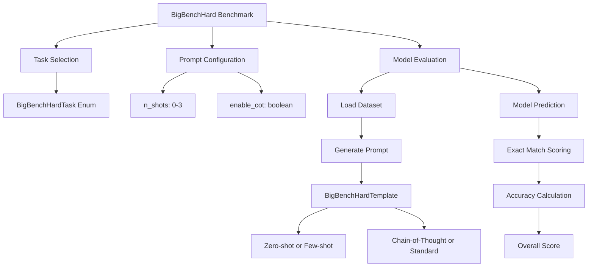
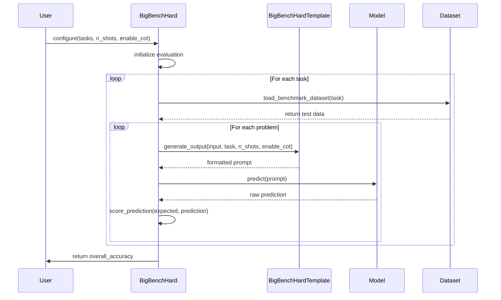

# Big Bench Hard Benchmark

<cite>
**Referenced Files in This Document**  
- [big_bench_hard.py](file://deepeval/benchmarks/big_bench_hard/big_bench_hard.py)
- [task.py](file://deepeval/benchmarks/big_bench_hard/task.py)
- [template.py](file://deepeval/benchmarks/big_bench_hard/template.py)
- [benchmarks-big-bench-hard.mdx](file://docs/docs/benchmarks-big-bench-hard.mdx)
</cite>

## Table of Contents
1. [Introduction](#introduction)
2. [Core Components](#core-components)
3. [Architecture Overview](#architecture-overview)
4. [Detailed Component Analysis](#detailed-component-analysis)
5. [Configuration and Usage](#configuration-and-usage)
6. [Reasoning Task Management](#reasoning-task-management)
7. [Prompt Template Structure](#prompt-template-structure)
8. [Common Pitfalls and Error Analysis](#common-pitfalls-and-error-analysis)
9. [Optimization Strategies](#optimization-strategies)
10. [Conclusion](#conclusion)

## Introduction

The Big Bench Hard (BBH) benchmark in DeepEval is designed to evaluate large language models on 23 particularly challenging tasks drawn from the broader BIG-Bench suite. These tasks were specifically selected because they remain difficult even for state-of-the-art models, often requiring multi-step reasoning, logical deduction, or nuanced understanding of temporal, spatial, or linguistic relationships. The benchmark emphasizes chain-of-thought (CoT) reasoning, where models are prompted to articulate their intermediate reasoning steps before arriving at a final answer. This approach helps assess not just the correctness of the final output but also the quality and coherence of the model's reasoning process.

BBH supports both zero-shot and few-shot evaluation modes, with configurable shot counts (0-3) and optional CoT prompting. The benchmark leverages the Hugging Face `datasets` library to load task data from the `lukaemon/bbh` repository and uses exact match scoring to determine prediction accuracy. It is particularly valuable for identifying model weaknesses in complex reasoning domains such as date understanding, object tracking, and logical deduction.

**Section sources**
- [benchmarks-big-bench-hard.mdx](file://docs/docs/benchmarks-big-bench-hard.mdx#L14-L54)

## Core Components

The BBH benchmark is implemented as a modular system with three primary components: the main benchmark class (`BigBenchHard`), the task enumeration (`BigBenchHardTask`), and the prompt templating system (`BigBenchHardTemplate`). These components work together to load datasets, generate appropriate prompts, execute model predictions, and compute performance metrics. The system is designed to be extensible, allowing for easy addition of new tasks or modifications to prompting strategies.

The benchmark evaluates models across diverse reasoning domains, including arithmetic, temporal reasoning, object manipulation, and linguistic analysis. Each task is treated as an independent evaluation unit, and overall performance is calculated as the average accuracy across all selected tasks. The system supports batch processing for improved evaluation efficiency and includes verbose logging capabilities for detailed analysis of individual predictions.

**Section sources**
- [big_bench_hard.py](file://deepeval/benchmarks/big_bench_hard/big_bench_hard.py#L85-L197)
- [task.py](file://deepeval/benchmarks/big_bench_hard/task.py)

## Architecture Overview



**Diagram sources**
- [big_bench_hard.py](file://deepeval/benchmarks/big_bench_hard/big_bench_hard.py)
- [task.py](file://deepeval/benchmarks/big_bench_hard/task.py)
- [template.py](file://deepeval/benchmarks/big_bench_hard/template.py)

## Detailed Component Analysis

### BigBenchHard Class Analysis

The `BigBenchHard` class serves as the central orchestrator for the benchmark evaluation process. It manages task selection, dataset loading, prompt generation, model inference, and result aggregation. The class implements a flexible evaluation loop that can process tasks individually or in batches, depending on the model's capabilities and the specified batch size.

The evaluation workflow begins with task initialization, where the user can specify a subset of the 23 available tasks. For each task, the system loads the corresponding test dataset from the Hugging Face hub, applies any specified limits on the number of problems to evaluate, and generates prompts using the configured settings (shot count and CoT enablement). The model's predictions are then compared against the expected outputs using exact match scoring, and results are aggregated at both the task and overall levels.



**Diagram sources**
- [big_bench_hard.py](file://deepeval/benchmarks/big_bench_hard/big_bench_hard.py#L90-L197)
- [template.py](file://deepeval/benchmarks/big_bench_hard/template.py)

**Section sources**
- [big_bench_hard.py](file://deepeval/benchmarks/big_bench_hard/big_bench_hard.py)

### Task Management System

The BBH benchmark organizes its 23 challenging tasks through a structured enumeration system. Each task represents a distinct reasoning challenge, ranging from logical deduction with multiple objects to understanding temporal sequences and navigating complex linguistic structures. The task system allows users to evaluate models on specific domains of interest or across the full spectrum of challenges.

```mermaid
flowchart TD
Tasks[BBH Tasks] --> Logical[Logical Deduction]
Tasks --> Temporal[Temporal Reasoning]
Tasks --> Arithmetic[Arithmetic]
Tasks --> Linguistic[Linguistic Analysis]
Tasks --> Spatial[Spatial Reasoning]
Logical --> Logical3["LOGICAL_DEDUCTION_THREE_OBJECTS"]
Logical --> Logical5["LOGICAL_DEDUCTION_FIVE_OBJECTS"]
Logical --> Logical7["LOGICAL_DEDUCTION_SEVEN_OBJECTS"]
Temporal --> Date["DATE_UNDERSTANDING"]
Temporal --> Sequences["TEMPORAL_SEQUENCES"]
Arithmetic --> Multistep["MULTISTEP_ARITHMETIC_TWO"]
Linguistic --> Boolean["BOOLEAN_EXPRESSIONS"]
Linguistic --> Hyperbaton["HYPERBATON"]
Linguistic --> WordSort["WORD_SORTING"]
Spatial --> Navigate["NAVIGATE"]
Spatial --> ObjectCount["OBJECT_COUNTING"]
Spatial --> Penguins["PENGUINS_IN_A_TABLE"]
```



**Diagram sources**
- [task.py](file://deepeval/benchmarks/big_bench_hard/task.py)

**Section sources**
- [task.py](file://deepeval/benchmarks/big_bench_hard/task.py)
- [benchmarks-big-bench-hard.mdx](file://docs/docs/benchmarks-big-bench-hard.mdx#L68-L94)

## Configuration and Usage

The BBH benchmark provides three primary configuration parameters that control the evaluation process: `tasks`, `n_shots`, and `enable_cot`. The `tasks` parameter accepts a list of `BigBenchHardTask` enum values, allowing selective evaluation on specific reasoning domains. By default, all 23 tasks are evaluated. The `n_shots` parameter controls the number of few-shot examples included in the prompt, with a default value of 3 and a valid range of 0-3. The `enable_cot` parameter is a boolean flag that determines whether chain-of-thought reasoning prompts are used, with a default value of `True`.

```python
from deepeval.benchmarks import BigBenchHard
from deepeval.benchmarks.tasks import BigBenchHardTask

# Example: Evaluate on logical deduction tasks with 3-shot CoT
benchmark = BigBenchHard(
    tasks=[
        BigBenchHardTask.LOGICAL_DEDUCTION_THREE_OBJECTS,
        BigBenchHardTask.LOGICAL_DEDUCTION_FIVE_OBJECTS
    ],
    n_shots=3,
    enable_cot=True
)

# Run evaluation
benchmark.evaluate(model=your_model)
print(f"Overall Score: {benchmark.overall_score}")
```

**Section sources**
- [benchmarks-big-bench-hard.mdx](file://docs/docs/benchmarks-big-bench-hard.mdx#L30-L46)

## Reasoning Task Management

The BBH benchmark systematically manages multiple reasoning task types, each requiring different cognitive skills. Logical deduction tasks involve tracking relationships between objects and applying formal logic rules. Date understanding and temporal sequence tasks require comprehension of calendar systems and chronological ordering. Object counting and tracking tasks test spatial reasoning and working memory. Arithmetic tasks demand multi-step mathematical computation. Linguistic tasks assess understanding of grammar, semantics, and word relationships.

The system handles these diverse task types through a unified interface, abstracting away the differences in input format and expected output. Each task's dataset is loaded from the same source (`lukaemon/bbh`) but processed according to its specific requirements. The prompt template system ensures that each task receives appropriately formatted examples and instructions, whether in zero-shot, few-shot, or chain-of-thought mode.

**Section sources**
- [big_bench_hard.py](file://deepeval/benchmarks/big_bench_hard/big_bench_hard.py#L278-L297)
- [task.py](file://deepeval/benchmarks/big_bench_hard/task.py)

## Prompt Template Structure

The `BigBenchHardTemplate` class is responsible for generating the prompts used in model evaluation. It supports both standard few-shot prompting and chain-of-thought prompting through a flexible template system. The template structure varies based on the `n_shots` and `enable_cot` parameters, dynamically constructing prompts that guide the model through the reasoning process.

For chain-of-thought prompting, the template includes intermediate reasoning steps in the few-shot examples, encouraging the model to articulate its thought process. The template also handles the formatting of input-output pairs and ensures consistency across different tasks. This structured approach to prompt engineering is critical for obtaining reliable and comparable evaluation results across the diverse set of BBH tasks.

**Section sources**
- [template.py](file://deepeval/benchmarks/big_bench_hard/template.py)
- [big_bench_hard.py](file://deepeval/benchmarks/big_bench_hard/big_bench_hard.py#L203-L208)

## Common Pitfalls and Error Analysis

When evaluating models with the BBH benchmark, several common pitfalls can affect results. Incomplete reasoning chains are a frequent issue in chain-of-thought mode, where models may skip intermediate steps or fail to fully articulate their logic. Incorrect intermediate steps can lead to correct final answers by coincidence or incorrect answers despite sound overall reasoning. Model hallucinations during multi-step inference are particularly problematic, as models may invent facts or relationships not present in the input.

Other common issues include format mismatch between predicted and expected outputs, failure to follow few-shot examples precisely, and over-reliance on surface-level pattern matching rather than genuine understanding. The verbose logging feature in the benchmark helps identify these issues by providing detailed output for each prediction, enabling fine-grained error analysis and model debugging.

**Section sources**
- [big_bench_hard.py](file://deepeval/benchmarks/big_bench_hard/big_bench_hard.py#L299-L315)

## Optimization Strategies

To improve evaluation accuracy and consistency in the BBH benchmark, several optimization strategies can be employed. Increasing the number of few-shot examples (up to the maximum of 3) often improves performance by providing clearer examples of the expected reasoning process and output format. Careful selection of high-quality, representative examples for few-shot prompting can have a significant impact on model performance.

For chain-of-thought evaluations, ensuring that the intermediate reasoning steps in the few-shot examples are clear, logical, and comprehensive helps guide the model toward better reasoning patterns. Batch processing can improve evaluation efficiency without sacrificing accuracy. Monitoring verbose logs allows for identification of systematic errors that can inform prompt engineering improvements or model fine-tuning strategies.

**Section sources**
- [benchmarks-big-bench-hard.mdx](file://docs/docs/benchmarks-big-bench-hard.mdx#L52-L54)
- [big_bench_hard.py](file://deepeval/benchmarks/big_bench_hard/big_bench_hard.py#L154-L162)

## Conclusion

The Big Bench Hard benchmark in DeepEval provides a comprehensive framework for evaluating large language models on 23 challenging reasoning tasks. By supporting both zero-shot and chain-of-thought prompting modes, it enables detailed assessment of model capabilities across diverse cognitive domains. The modular architecture, with its clear separation of concerns between task management, prompt templating, and evaluation logic, makes the system both robust and extensible. Through careful configuration and analysis of results, researchers and developers can gain valuable insights into model strengths and weaknesses, guiding improvements in reasoning capabilities and overall performance.