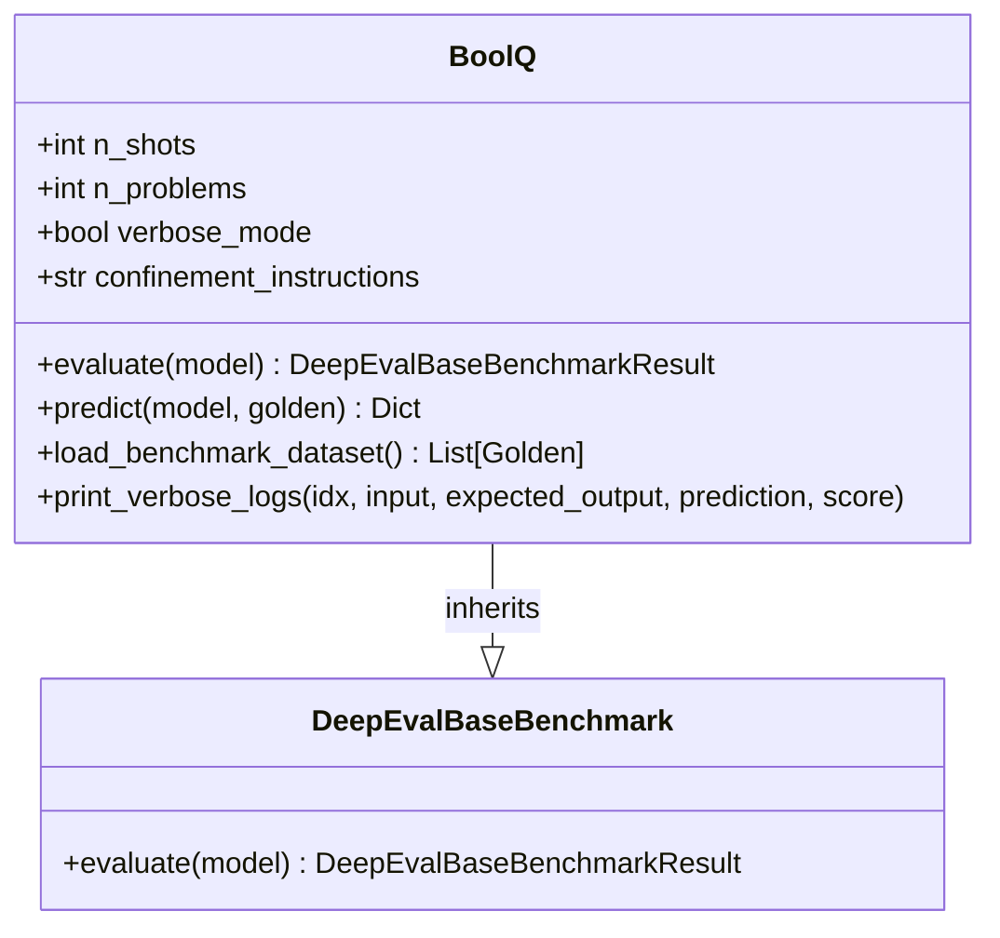
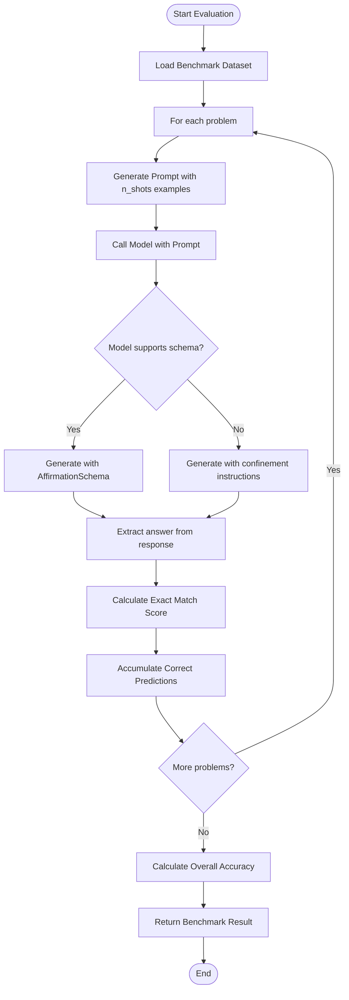

# Bool-Q Benchmark

<cite>
**Referenced Files in This Document**   
- [bool_q.py](file://deepeval/benchmarks/bool_q/bool_q.py)
- [template.py](file://deepeval/benchmarks/bool_q/template.py)
- [base_benchmark.py](file://deepeval/benchmarks/base_benchmark.py)
- [benchmarks-bool-q.mdx](file://docs/docs/benchmarks-bool-q.mdx)
</cite>

## Table of Contents
1. [Introduction](#introduction)
2. [Purpose and Design](#purpose-and-design)
3. [Implementation Details](#implementation-details)
4. [Data Loading and Processing](#data-loading-and-processing)
5. [Prompt Construction](#prompt-construction)
6. [Evaluation Logic](#evaluation-logic)
7. [Usage Examples](#usage-examples)
8. [Performance Interpretation](#performance-interpretation)
9. [Common Challenges](#common-challenges)
10. [Integration with Evaluation Suites](#integration-with-evaluation-suites)

## Introduction

The Bool-Q benchmark in DeepEval is designed to evaluate binary question answering capabilities of language models. It assesses a model's ability to determine whether a given statement is supported or refuted by a passage, requiring basic reading comprehension and logical inference skills. This benchmark uses the BoolQ dataset, which contains naturally occurring yes/no questions paired with passages from which the answers can be derived.

**Section sources**
- [benchmarks-bool-q.mdx](file://docs/docs/benchmarks-bool-q.mdx#L1-L47)

## Purpose and Design

Bool-Q serves as a fundamental assessment tool for evaluating a model's binary classification performance in reading comprehension tasks. The benchmark evaluates whether models can correctly identify if a statement is supported ("Yes") or refuted ("No") by a given passage. With 16,000 questions in the full dataset (3,300 in the validation set), Bool-Q provides a substantial test bed for assessing model performance on naturally occurring questions rather than artificially constructed ones.

The design emphasizes exact matching for scoring, where models must produce precisely "Yes" or "No" to receive credit. This strict evaluation approach ensures that models are assessed not only on their reasoning capabilities but also on their ability to follow output formatting instructions.

**Section sources**
- [bool_q.py](file://deepeval/benchmarks/bool_q/bool_q.py#L1-L23)
- [benchmarks-bool-q.mdx](file://docs/docs/benchmarks-bool-q.mdx#L11-L15)

## Implementation Details

The Bool-Q benchmark implementation follows a structured approach inherited from the DeepEvalBaseBenchmark class, providing standardized evaluation functionality across different benchmarks. The implementation includes configurable parameters for controlling evaluation scale and few-shot learning settings.

Key implementation features include:
- Configurable number of problems (n_problems) with a maximum of 3270
- Configurable few-shot examples (n_shots) with a maximum of 5
- Support for custom LLM integration
- Verbose mode for detailed logging
- Confinement instructions to ensure proper output formatting

The system handles both structured and unstructured model outputs, attempting schema-based generation first and falling back to standard generation with explicit formatting instructions when necessary.



**Diagram sources**
- [bool_q.py](file://deepeval/benchmarks/bool_q/bool_q.py#L15-L147)

**Section sources**
- [bool_q.py](file://deepeval/benchmarks/bool_q/bool_q.py#L15-L42)

## Data Loading and Processing

The Bool-Q benchmark loads data from the Hugging Face datasets library using the official "boolq" dataset. The implementation specifically uses the validation split of the dataset, which contains approximately 3,270 examples. Data loading is optimized to prevent redundant downloads by caching the dataset after the first load.

Each data instance is transformed into a Golden object containing:
- Input: Formatted question based on passage and query
- Expected Output: Ground truth answer ("Yes" or "No")

The data processing pipeline ensures consistent formatting across all examples and handles the conversion of raw dataset entries into the standardized format required by the evaluation framework.

**Section sources**
- [bool_q.py](file://deepeval/benchmarks/bool_q/bool_q.py#L116-L134)

## Prompt Construction

The Bool-Q benchmark employs template-based prompt construction to facilitate effective model evaluation. The prompt generation process incorporates few-shot learning examples to guide the model's output format and reasoning approach. The number of few-shot examples is configurable through the n_shots parameter, with a maximum limit of 5 examples.

The template system formats each question by combining the passage context with the binary question, creating a clear input for the model. When structured output is supported, the system uses a schema (AffirmationSchema) to enforce "Yes"/"No" responses. For models that don't support structured output, the system appends explicit instructions to output only "Yes" or "No".

This dual approach to prompt construction ensures compatibility with various model types while maintaining consistent evaluation standards.

**Section sources**
- [bool_q.py](file://deepeval/benchmarks/bool_q/bool_q.py#L91-L94)
- [template.py](file://deepeval/benchmarks/bool_q/template.py)

## Evaluation Logic

The evaluation logic in Bool-Q follows a systematic process to assess model performance:

1. **Problem Processing**: Iterates through the specified number of problems (up to 3,270)
2. **Prediction Generation**: For each problem, generates a prediction using the provided model
3. **Scoring**: Uses exact match scoring to compare the model's output with the expected answer
4. **Accuracy Calculation**: Computes overall accuracy as the ratio of correct predictions to total problems

The scoring mechanism relies on the exact_match_score function from the Scorer class, which requires precise string matching between the model's output and the expected "Yes" or "No" answer. This strict evaluation approach prevents partial credit and ensures consistent scoring across different models.



**Diagram sources**
- [bool_q.py](file://deepeval/benchmarks/bool_q/bool_q.py#L43-L87)

**Section sources**
- [bool_q.py](file://deepeval/benchmarks/bool_q/bool_q.py#L43-L87)

## Usage Examples

The Bool-Q benchmark can be easily integrated into evaluation workflows with minimal setup. The following example demonstrates how to evaluate a custom model on the Bool-Q dataset:

```python
from deepeval.benchmarks import BoolQ

# Define benchmark with custom parameters
benchmark = BoolQ(
    n_problems=10,
    n_shots=3,
)

# Evaluate a custom model
benchmark.evaluate(model=mistral_7b)
print(benchmark.overall_score)
```

In this example:
- `n_problems=10` specifies evaluating on 10 randomly selected problems from the validation set
- `n_shots=3` configures the prompt to include 3 few-shot examples to guide the model
- The model output is scored using exact matching, with the overall accuracy reported as a value between 0 and 1

The benchmark automatically handles data loading, prompt construction, model invocation, and result aggregation, providing a streamlined evaluation experience.

**Section sources**
- [benchmarks-bool-q.mdx](file://docs/docs/benchmarks-bool-q.mdx#L26-L40)

## Performance Interpretation

The overall_score in Bool-Q ranges from 0 to 1, where 1 represents perfect performance and 0 indicates no correct answers. This score represents the proportion of questions for which the model produced the exact correct answer ("Yes" or "No") compared to the total number of questions evaluated.

Higher scores indicate better performance in both comprehension and output formatting. The use of few-shot examples (n_shots) can significantly improve performance by:
- Demonstrating the expected output format
- Providing examples of reasoning patterns
- Reducing model uncertainty in ambiguous cases

When interpreting results, it's important to consider that the score reflects both the model's understanding of the passage-question relationship and its ability to follow output instructions precisely.

**Section sources**
- [benchmarks-bool-q.mdx](file://docs/docs/benchmarks-bool-q.mdx#L42-L46)

## Common Challenges

Several challenges commonly arise when evaluating models with the Bool-Q benchmark:

**Ambiguity in Passages**: Some passages may contain ambiguous information that makes definitive "Yes"/"No" determination difficult. Models may struggle with passages that contain conflicting information or subtle nuances.

**Negation Handling**: Questions involving negation (e.g., "Is it true that the author does not believe X?") can be particularly challenging, requiring careful logical reasoning to avoid double-negative errors.

**Model Overconfidence**: Models may exhibit overconfidence in uncertain cases, providing definitive "Yes" or "No" answers even when the passage doesn't contain sufficient information to make a determination.

**Output Formatting**: The exact match scoring system means that responses like "yes", "YES", or "yes." will be scored as incorrect if they don't exactly match the expected "Yes" or "No" format.

These challenges highlight the importance of using few-shot examples to guide both reasoning patterns and output formatting, as well as the value of examining the detailed prediction logs to understand specific failure modes.

**Section sources**
- [bool_q.py](file://deepeval/benchmarks/bool_q/bool_q.py#L102-L105)
- [benchmarks-bool-q.mdx](file://docs/docs/benchmarks-bool-q.mdx#L45-L46)

## Integration with Evaluation Suites

The Bool-Q benchmark is designed to be part of broader evaluation suites within the DeepEval framework. Its implementation follows the same interface as other benchmarks, allowing for easy comparison across different tasks and metrics. The benchmark can be combined with other assessments to provide a comprehensive evaluation of model capabilities.

As a binary classification task, Bool-Q serves as a foundational component in evaluating basic reading comprehension skills. When used alongside more complex benchmarks like MMLU, GSM8K, or TruthfulQA, it helps create a multi-dimensional assessment of model performance, from simple factual reasoning to complex multi-step problem solving.

The standardized result format (DeepEvalBaseBenchmarkResult) enables easy aggregation and comparison with other benchmarks, supporting the creation of comprehensive evaluation reports and performance dashboards.

**Section sources**
- [bool_q.py](file://deepeval/benchmarks/bool_q/bool_q.py#L85-L87)
- [base_benchmark.py](file://deepeval/benchmarks/base_benchmark.py)