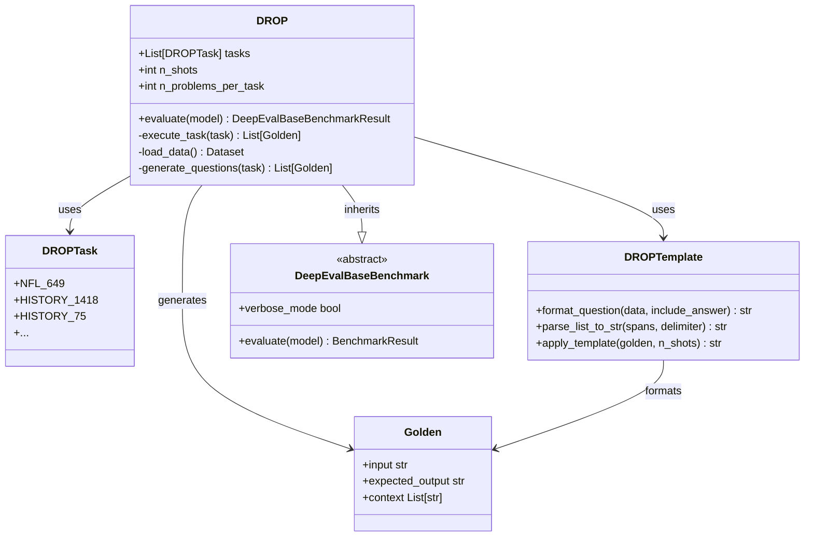
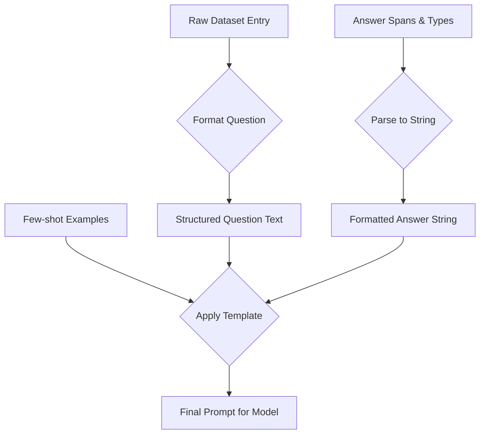
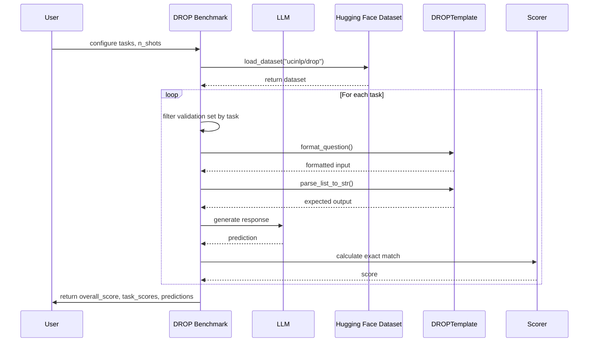

# DROP Benchmark

<cite>
**Referenced Files in This Document**   
- [drop.py](file://deepeval/benchmarks/drop/drop.py)
- [task.py](file://deepeval/benchmarks/drop/task.py)
- [template.py](file://deepeval/benchmarks/drop/template.py)
- [benchmarks-drop.mdx](file://docs/docs/benchmarks-drop.mdx)
</cite>

## Table of Contents
1. [Introduction](#introduction)
2. [Core Functionality](#core-functionality)
3. [Implementation Architecture](#implementation-architecture)
4. [Template System](#template-system)
5. [Evaluation Workflow](#evaluation-workflow)
6. [Result Interpretation](#result-interpretation)
7. [Challenges in Discrete Reasoning](#challenges-in-discrete-reasoning)
8. [Common Issues and Solutions](#common-issues-and-solutions)
9. [Best Practices](#best-practices)
10. [Conclusion](#conclusion)

## Introduction

The **DROP (Discrete Reasoning Over Paragraphs)** benchmark in DeepEval is designed to evaluate language models' ability to perform complex reasoning operations over text passages. Unlike standard question-answering benchmarks, DROP specifically targets discrete reasoning tasks that require numerical operations such as counting, sorting, arithmetic calculations, and span extraction from textual data. The benchmark contains over 9,500 questions focused primarily on domains like NFL statistics and historical events, demanding both deep comprehension and computational reasoning capabilities from models.

DROP evaluates models on their capacity to understand textual context, identify relevant information spans, and perform precise numerical reasoning without relying on chain-of-thought prompting. This makes it particularly challenging for models that struggle with implicit reasoning steps or require explicit step-by-step guidance.

**Section sources**
- [benchmarks-drop.mdx](file://docs/docs/benchmarks-drop.mdx#L1-L50)

## Core Functionality

DROP assesses models through a structured evaluation framework that tests discrete reasoning abilities across multiple dimensions:

- **Numerical Reasoning**: Performing arithmetic operations (addition, subtraction, etc.) based on information extracted from text
- **Counting Operations**: Determining quantities mentioned or implied in passages
- **Temporal Reasoning**: Understanding and manipulating dates and time sequences
- **Span Extraction**: Identifying exact text spans that answer questions
- **Multi-hop Inference**: Combining information from multiple sentences to derive answers

The evaluation score is calculated using exact matching between the model's output and the ground truth answer, which can be a number (e.g., "3"), a date, or a text span. The overall score ranges from 0 to 1, representing the proportion of correctly answered questions.

Models can be evaluated on specific task subsets using the `DROPTask` enum, which includes over 500 distinct tasks categorized by domain and complexity. By default, evaluations use 5-shot prompting, though this can be adjusted down to fewer examples (but not exceeding 5 shots).

**Section sources**
- [drop.py](file://deepeval/benchmarks/drop/drop.py#L30-L45)
- [task.py](file://deepeval/benchmarks/drop/task.py#L4-L47)
- [benchmarks-drop.mdx](file://docs/docs/benchmarks-drop.mdx#L11-L50)

## Implementation Architecture

The DROP benchmark follows a modular architecture built on DeepEval's base benchmark framework, with specialized components for handling discrete reasoning tasks.

**Diagram sources**
- [drop.py](file://deepeval/benchmarks/drop/drop.py#L29-L336)
- [task.py](file://deepeval/benchmarks/drop/task.py#L4-L47)
- [template.py](file://deepeval/benchmarks/drop/template.py)

**Section sources**
- [drop.py](file://deepeval/benchmarks/drop/drop.py#L29-L336)
- [task.py](file://deepeval/benchmarks/drop/task.py#L4-L47)

## Template System

The template system in DROP plays a crucial role in formatting input contexts and questions to elicit precise responses from language models. It ensures consistent presentation of few-shot examples and proper structuring of prompts for discrete reasoning tasks.

The `DROPTemplate` class handles three key functions:
1. **Question Formatting**: Converts raw dataset entries into properly structured questions
2. **Answer Parsing**: Transforms answer spans and types into standardized string representations
3. **Prompt Assembly**: Combines context, question, and few-shot examples into final model inputs

Templates are designed to present questions in a way that emphasizes the need for numerical precision and exact answer formatting. The system uses delimiters to separate multiple possible answers and maintains strict formatting requirements to ensure reliable evaluation through exact matching.

**Diagram sources**
- [template.py](file://deepeval/benchmarks/drop/template.py)
- [drop.py](file://deepeval/benchmarks/drop/drop.py#L318-L328)

**Section sources**
- [template.py](file://deepeval/benchmarks/drop/template.py)
- [drop.py](file://deepeval/benchmarks/drop/drop.py#L318-L328)

## Evaluation Workflow

The evaluation workflow in DROP follows a systematic process to assess model performance on discrete reasoning tasks:

The workflow begins with configuration of the benchmark parameters, including selection of specific tasks and number of few-shot examples. The system then loads the DROP dataset from Hugging Face, constructs few-shot examples from the training set, and generates test questions from the validation set filtered by the specified tasks.

For each question, the system formats the input using templates, obtains a prediction from the model, and scores it using exact matching against the ground truth. Results are aggregated to produce overall and task-specific scores.

**Diagram sources**
- [drop.py](file://deepeval/benchmarks/drop/drop.py#L296-L328)
- [template.py](file://deepeval/benchmarks/drop/template.py)

**Section sources**
- [drop.py](file://deepeval/benchmarks/drop/drop.py#L296-L336)

## Result Interpretation

DROP provides comprehensive results through three main attributes after evaluation:

- **`overall_score`**: A float between 0 and 1 indicating the model's overall accuracy across all evaluated tasks
- **`task_scores`**: A pandas DataFrame containing individual scores for each task, allowing for granular performance analysis
- **`predictions`**: Detailed breakdown of each prediction, including inputs, expected outputs, actual predictions, and scoring details

The scoring methodology relies on exact string matching between the model's output and the expected answer. This means that even semantically equivalent responses (e.g., "3" vs "three") will be marked incorrect if they don't match exactly. The context field in the Golden objects includes the expected output type (number, date, or span), which helps in understanding the nature of each question.

Users can analyze results to identify patterns in model performance across different types of reasoning tasks, such as arithmetic operations versus temporal reasoning or span extraction.

**Section sources**
- [drop.py](file://deepeval/benchmarks/drop/drop.py#L270-L289)
- [benchmarks-drop.mdx](file://docs/docs/benchmarks-drop.mdx#L47-L50)

## Challenges in Discrete Reasoning

DROP poses significant challenges to language models due to its requirement for both comprehension and computational reasoning:

1. **Multi-hop Reasoning**: Many questions require combining information from multiple sentences or paragraphs
2. **Implicit Operations**: The need for arithmetic operations is often implied rather than explicitly stated
3. **Precise Formatting**: Answers must match exactly in format and type
4. **Numerical Precision**: Small errors in counting or calculation lead to completely wrong answers
5. **Contextual Understanding**: Models must distinguish between similar entities and track relationships

These challenges make DROP particularly effective at identifying weaknesses in models' reasoning capabilities, especially in scenarios where precise numerical answers are required rather than general comprehension.

The absence of chain-of-thought prompting in DROP (unlike benchmarks such as BIG-Bench Hard) further increases the difficulty, as models must perform reasoning internally without external guidance.

**Section sources**
- [benchmarks-drop.mdx](file://docs/docs/benchmarks-drop.mdx#L14-L26)

## Common Issues and Solutions

Several common issues arise when evaluating models on the DROP benchmark:

### Incorrect Number Formatting
Models often produce numbers in word form when digits are expected (or vice versa), leading to failed exact matches. This can be mitigated by:
- Using consistent few-shot examples with proper formatting
- Including formatting instructions in system prompts
- Post-processing model outputs to standardize number representation

### Failure to Identify Relevant Spans
Models may extract incorrect text spans due to:
- Misunderstanding question requirements
- Focusing on irrelevant details
- Inability to perform multi-sentence inference

Solutions include improving context window utilization and providing clearer few-shot examples that demonstrate proper span selection.

### Difficulties with Multi-hop Reasoning
Complex questions requiring information integration across multiple sentences often challenge models. Effective strategies include:
- Increasing few-shot examples that demonstrate multi-step reasoning
- Using models with larger context windows
- Implementing retrieval-augmented approaches

### Arithmetic Errors
Simple calculation mistakes can occur even when models understand the operation needed. Ensuring models have access to reliable calculation capabilities (either internal or through tools) can help address this.

**Section sources**
- [drop.py](file://deepeval/benchmarks/drop/drop.py)
- [benchmarks-drop.mdx](file://docs/docs/benchmarks-drop.mdx)

## Best Practices

To optimize model performance and evaluation accuracy on the DROP benchmark, consider the following best practices:

1. **Use Maximum Few-shot Examples**: Utilize the full 5-shot capacity to demonstrate proper answer formatting and reasoning patterns
2. **Standardize Output Formatting**: Implement post-processing to ensure consistent number and date formatting
3. **Analyze Task-specific Performance**: Examine `task_scores` to identify weaknesses in particular reasoning domains
4. **Validate Answer Types**: Ensure models understand whether a question requires a number, date, or text span
5. **Iterative Evaluation**: Run multiple evaluations with different configurations to identify optimal settings
6. **Combine with Other Metrics**: Use DROP alongside other benchmarks to get a comprehensive view of model capabilities

When implementing custom models, ensure they can handle the specific input formatting used by DROP templates and produce outputs that can be reliably compared through exact matching.

**Section sources**
- [drop.py](file://deepeval/benchmarks/drop/drop.py)
- [benchmarks-drop.mdx](file://docs/docs/benchmarks-drop.mdx)

## Conclusion

The DROP benchmark in DeepEval provides a rigorous evaluation framework for assessing language models' discrete reasoning capabilities. By focusing on numerical operations, counting, and span extraction from text passages, it challenges models to demonstrate both comprehension and computational skills without relying on chain-of-thought prompting.

The modular architecture, with its specialized task enumeration, template system, and exact matching evaluation, enables precise measurement of model performance across diverse reasoning tasks. While challenging, DROP offers valuable insights into a model's ability to perform the kind of precise, detail-oriented reasoning required in many real-world applications.

By understanding the implementation architecture, template system, and common challenges, developers can better optimize their models for discrete reasoning tasks and use DROP results to guide improvement efforts.

**Section sources**
- [drop.py](file://deepeval/benchmarks/drop/drop.py)
- [task.py](file://deepeval/benchmarks/drop/task.py)
- [template.py](file://deepeval/benchmarks/drop/template.py)
- [benchmarks-drop.mdx](file://docs/docs/benchmarks-drop.mdx)