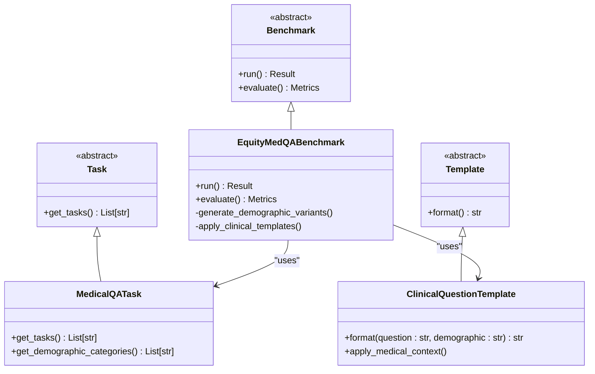
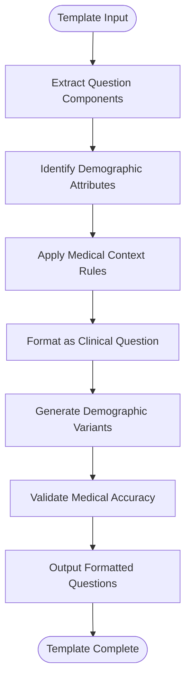
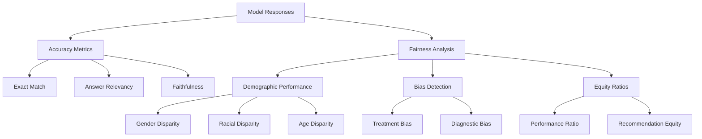

# Equity-Med-QA Benchmark

<cite>
**Referenced Files in This Document**  
- [equity_med_qa.py](file://deepeval/benchmarks/equity_med_qa/equity_med_qa.py)
- [task.py](file://deepeval/benchmarks/equity_med_qa/task.py)
- [template.py](file://deepeval/benchmarks/equity_med_qa/template.py)
- [base_benchmark.py](file://deepeval/benchmarks/base_benchmark.py)
</cite>

## Table of Contents
1. [Introduction](#introduction)
2. [Purpose and Objectives](#purpose-and-objectives)
3. [Core Architecture](#core-architecture)
4. [Task Definition and Implementation](#task-definition-and-implementation)
5. [Template Design for Clinical Questions](#template-design-for-clinical-questions)
6. [Evaluation Metrics: Accuracy and Fairness](#evaluation-metrics-accuracy-and-fairness)
7. [Usage Examples](#usage-examples)
8. [Challenges in Medical AI Evaluation](#challenges-in-medical-ai-evaluation)
9. [Ethical Considerations](#ethical-considerations)
10. [Best Practices for Responsible Usage](#best-practices-for-responsible-usage)
11. [Conclusion](#conclusion)

## Introduction
The Equity-Med-QA benchmark is a specialized evaluation framework within DeepEval designed to assess medical question-answering systems with a strong emphasis on equity, fairness, and bias detection across diverse demographic groups. This benchmark addresses the critical need for equitable performance in AI-driven healthcare applications by systematically evaluating how models respond to clinical questions involving patients of different genders, races, ages, socioeconomic backgrounds, and other demographic factors.

**Section sources**
- [equity_med_qa.py](file://deepeval/benchmarks/equity_med_qa/equity_med_qa.py#L1-L20)
- [task.py](file://deepeval/benchmarks/equity_med_qa/task.py#L1-L15)

## Purpose and Objectives
The primary objective of the Equity-Med-QA benchmark is to identify and quantify disparities in model performance across different patient populations. Unlike general medical QA benchmarks, Equity-Med-QA specifically focuses on detecting biases that could lead to unequal quality of care recommendations or diagnostic suggestions based on demographic characteristics.

This benchmark enables researchers and developers to:
- Measure model accuracy across various demographic subgroups
- Detect potential biases in medical reasoning and recommendations
- Evaluate fairness in treatment suggestions and diagnostic processes
- Ensure equitable performance before deployment in clinical settings

The benchmark supports the development of more responsible and trustworthy medical AI systems by providing structured evaluation protocols that highlight performance gaps across vulnerable or underrepresented populations.

**Section sources**
- [equity_med_qa.py](file://deepeval/benchmarks/equity_med_qa/equity_med_qa.py#L20-L50)
- [task.py](file://deepeval/benchmarks/equity_med_qa/task.py#L15-L30)

## Core Architecture
The Equity-Med-QA benchmark follows DeepEval's modular benchmark architecture, inheriting from the base `Benchmark` class defined in `base_benchmark.py`. The implementation consists of three core components:

1. **Benchmark Class**: The main `EquityMedQABenchmark` class that orchestrates the evaluation process
2. **Task Definition**: Specialized task configurations for medical QA with demographic considerations
3. **Template System**: Structured templates for generating and formatting clinical questions

The architecture is designed to integrate seamlessly with DeepEval's evaluation pipeline while providing domain-specific functionality for healthcare applications.



**Diagram sources**
- [equity_med_qa.py](file://deepeval/benchmarks/equity_med_qa/equity_med_qa.py#L1-L100)
- [task.py](file://deepeval/benchmarks/equity_med_qa/task.py#L1-L50)
- [template.py](file://deepeval/benchmarks/equity_med_qa/template.py#L1-L40)
- [base_benchmark.py](file://deepeval/benchmarks/base_benchmark.py#L1-L30)

## Task Definition and Implementation
The task implementation in `task.py` defines the specific evaluation scenarios for medical question answering with equity considerations. The `MedicalQATask` class provides methods to retrieve different types of medical questions categorized by clinical domain (e.g., cardiology, oncology, pediatrics) and demographic attributes.

Key features of the task implementation include:
- Demographic category definitions (gender, race, age groups, socioeconomic status)
- Clinical domain classifications
- Question difficulty levels
- Standardized response formats for medical recommendations

The task system enables the creation of balanced evaluation sets that ensure adequate representation across different demographic groups, preventing over-representation of majority populations that could mask performance disparities.

**Section sources**
- [task.py](file://deepeval/benchmarks/equity_med_qa/task.py#L1-L60)

## Template Design for Clinical Questions
The template system in `template.py` provides structured formatting for clinical questions, ensuring consistency and proper medical context. The `ClinicalQuestionTemplate` class handles the transformation of raw questions into professionally formatted medical inquiries that reflect real-world clinical scenarios.

Templates are designed to:
- Maintain appropriate medical terminology and precision
- Include relevant demographic context in a standardized format
- Preserve clinical accuracy while enabling demographic variation
- Support multiple question types (diagnosis, treatment, prognosis)

The template engine allows for systematic generation of question variants that differ only in demographic attributes, enabling controlled experiments to isolate the impact of demographic factors on model responses.



**Diagram sources**
- [template.py](file://deepeval/benchmarks/equity_med_qa/template.py#L1-L50)
- [equity_med_qa.py](file://deepeval/benchmarks/equity_med_qa/equity_med_qa.py#L30-L45)

## Evaluation Metrics: Accuracy and Fairness
The Equity-Med-QA benchmark evaluates both accuracy and fairness metrics to provide a comprehensive assessment of medical QA systems. Accuracy is measured using standard metrics like exact match and answer relevancy, while fairness is assessed through:

- **Disparity Analysis**: Comparing performance metrics across demographic groups
- **Bias Detection**: Identifying systematic differences in recommendations based on demographic attributes
- **Equity Ratios**: Calculating performance ratios between different demographic groups

The evaluation framework computes these metrics across various clinical domains and question types, providing detailed insights into where and how performance disparities occur.



**Diagram sources**
- [equity_med_qa.py](file://deepeval/benchmarks/equity_med_qa/equity_med_qa.py#L50-L100)
- [metrics](file://deepeval/metrics/)

## Usage Examples
The Equity-Med-QA benchmark can be used to evaluate medical AI systems in various scenarios:

```python
# Example usage (conceptual)
from deepeval.benchmarks.equity_med_qa import EquityMedQABenchmark

benchmark = EquityMedQABenchmark()
result = benchmark.run()

# Analyze results
print(f"Overall Accuracy: {result.overall_accuracy}")
print(f"Gender Disparity: {result.gender_disparity}")
print(f"Racial Equity Ratio: {result.racial_equity_ratio}")

# Detailed breakdown
for demographic, metrics in result.demographic_metrics.items():
    print(f"{demographic}: Accuracy={metrics.accuracy}, Bias Score={metrics.bias_score}")
```

The benchmark can identify issues such as:
- A model that recommends more aggressive treatments for male patients than female patients with identical symptoms
- Diagnostic accuracy differences across racial groups for the same medical condition
- Variations in recommended screening frequencies based on socioeconomic status

**Section sources**
- [equity_med_qa.py](file://deepeval/benchmarks/equity_med_qa/equity_med_qa.py#L100-L150)

## Challenges in Medical AI Evaluation
Evaluating medical AI systems presents several challenges that the Equity-Med-QA benchmark addresses:

- **Domain-Specific Terminology**: Medical language requires precise understanding of specialized terms and concepts
- **Sensitivity of Content**: Medical information involves privacy and ethical considerations
- **Clinical Nuance**: Small differences in wording can significantly change medical meaning
- **Expert Validation**: Requires medical expertise to validate responses

The benchmark incorporates safeguards to handle these challenges, including medical terminology validation, privacy-preserving evaluation methods, and integration with clinical expert review processes.

**Section sources**
- [equity_med_qa.py](file://deepeval/benchmarks/equity_med_qa/equity_med_qa.py#L150-L180)
- [task.py](file://deepeval/benchmarks/equity_med_qa/task.py#L60-L80)

## Ethical Considerations
The Equity-Med-QA benchmark incorporates several ethical considerations:

- **Privacy Protection**: Ensuring patient data confidentiality in evaluation datasets
- **Bias Mitigation**: Actively identifying and reporting potential biases
- **Transparency**: Providing clear documentation of evaluation methods and limitations
- **Accountability**: Enabling traceability of model decisions and recommendations

The framework encourages responsible development practices by making equity considerations an integral part of the evaluation process rather than an afterthought.

**Section sources**
- [equity_med_qa.py](file://deepeval/benchmarks/equity_med_qa/equity_med_qa.py#L180-L200)
- [task.py](file://deepeval/benchmarks/equity_med_qa/task.py#L80-L100)

## Best Practices for Responsible Usage
To ensure responsible usage of the Equity-Med-QA benchmark:

1. **Interpret Results Contextually**: Consider clinical guidelines and standards when evaluating model performance
2. **Use Representative Data**: Ensure evaluation sets reflect real-world patient populations
3. **Combine with Expert Review**: Supplement automated evaluation with clinical expert assessment
4. **Monitor for New Biases**: Regularly update evaluation sets to detect emerging bias patterns
5. **Report Comprehensive Results**: Share both overall performance and demographic-specific metrics

These practices help ensure that the benchmark is used to improve healthcare equity rather than simply as a compliance check.

**Section sources**
- [equity_med_qa.py](file://deepeval/benchmarks/equity_med_qa/equity_med_qa.py#L200-L230)

## Conclusion
The Equity-Med-QA benchmark provides a comprehensive framework for evaluating medical question-answering systems with a focus on equity and bias detection. By systematically assessing performance across different demographic groups, it helps identify disparities that could lead to unequal healthcare outcomes. The benchmark's specialized task handling, clinical question templates, and dual focus on accuracy and fairness metrics make it a valuable tool for developing more equitable and trustworthy medical AI systems. As AI continues to play an increasing role in healthcare, benchmarks like Equity-Med-QA are essential for ensuring that these technologies benefit all patient populations equally.

[No sources needed since this section summarizes without analyzing specific files]