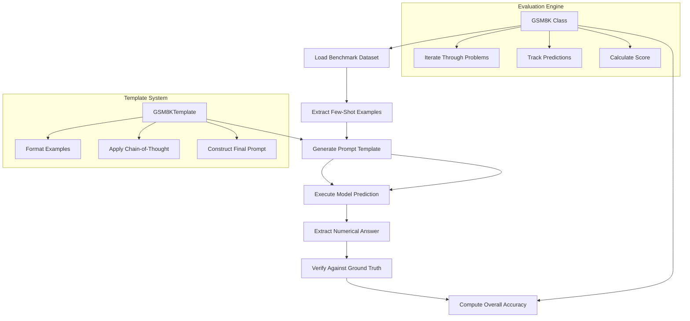
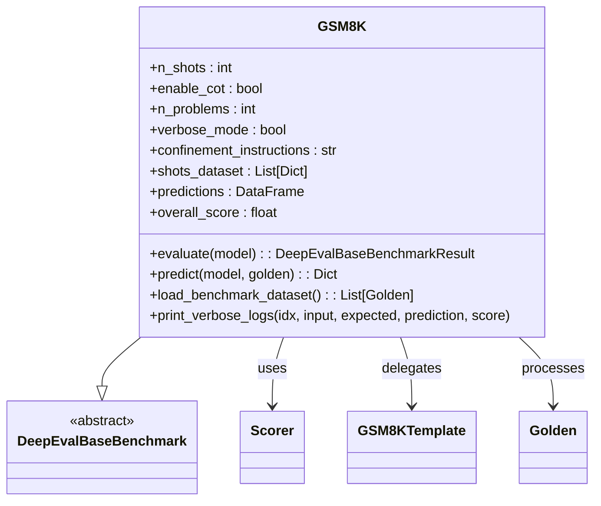
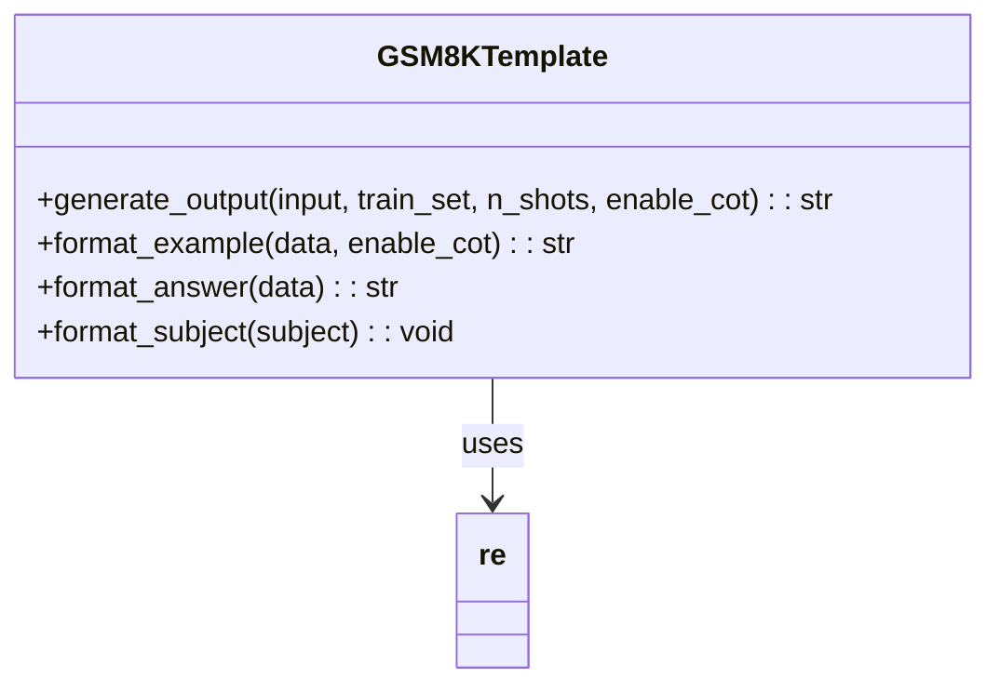
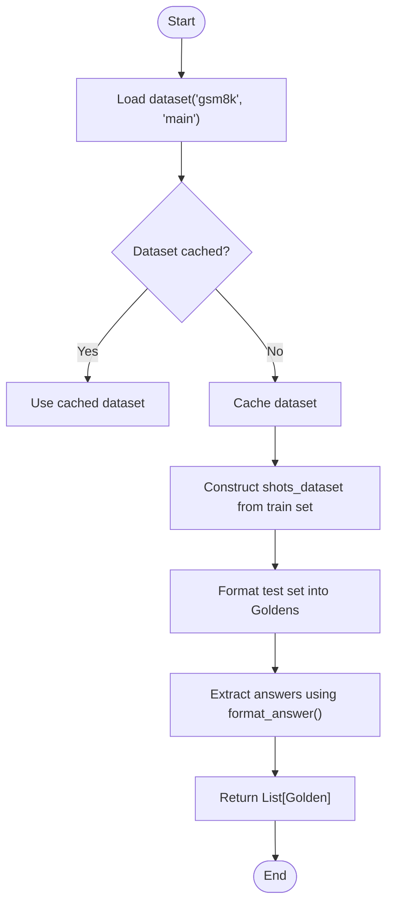
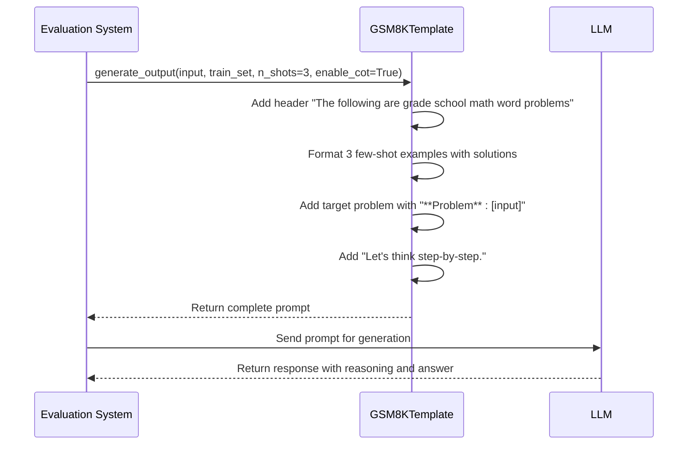
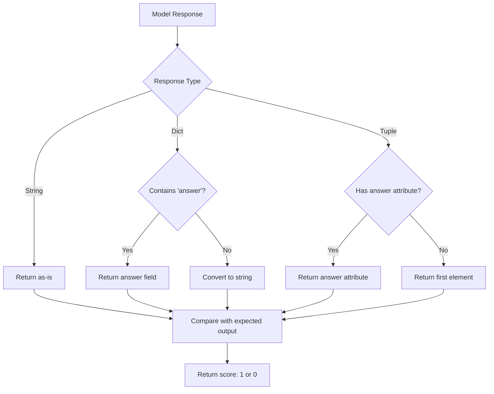
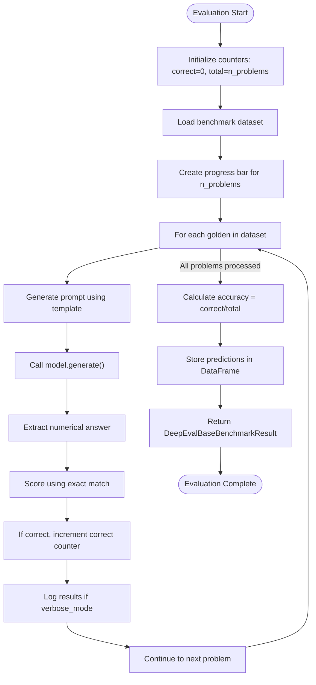
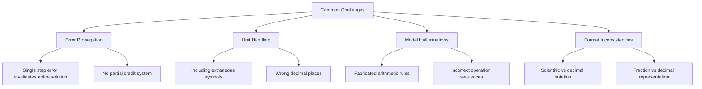
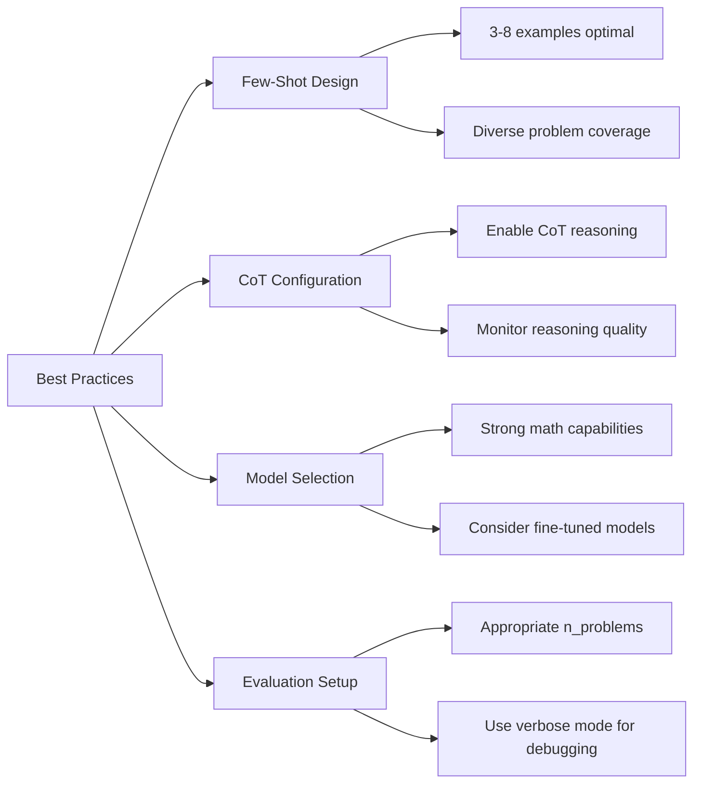

# GSM8K Benchmark

<cite>
**Referenced Files in This Document**   
- [gsm8k.py](file://deepeval/benchmarks/gsm8k/gsm8k.py)
- [template.py](file://deepeval/benchmarks/gsm8k/template.py)
- [base_benchmark.py](file://deepeval/benchmarks/base_benchmark.py)
- [schema.py](file://deepeval/benchmarks/schema.py)
- [benchmarks-gsm8k.mdx](file://docs/docs/benchmarks-gsm8k.mdx)
</cite>

## Table of Contents
1. [Introduction](#introduction)
2. [Core Components](#core-components)
3. [Architecture Overview](#architecture-overview)
4. [Detailed Component Analysis](#detailed-component-analysis)
5. [Problem Loading and Dataset Management](#problem-loading-and-dataset-management)
6. [Prompt Templating for Step-by-Step Reasoning](#prompt-templating-for-step-by-step-reasoning)
7. [Answer Extraction and Verification](#answer-extraction-and-verification)
8. [Evaluation Execution and Accuracy Computation](#evaluation-execution-and-accuracy-computation)
9. [Common Challenges in Multi-Step Arithmetic Evaluation](#common-challenges-in-multi-step-arithmetic-evaluation)
10. [Best Practices for Chain-of-Thought Configuration](#best-practices-for-chain-of-thought-configuration)
11. [Practical Example Implementation](#practical-example-implementation)

## Introduction
The **GSM8K** benchmark comprises 1,319 grade school math word problems, each crafted by expert human problem writers. These problems involve elementary arithmetic operations (+ − ×÷) and require between 2 to 8 steps to solve. The dataset is designed to evaluate an LLM’s ability to perform multi-step mathematical reasoning. For more information, you can [read the original GSM8K paper here](https://arxiv.org/abs/2110.14168).

The GSM8K implementation in DeepEval provides a structured framework for assessing language models on their mathematical reasoning capabilities through multi-step problem solving. This document details the implementation architecture, workflow, and best practices for configuring and executing evaluations on this benchmark.

**Section sources**
- [benchmarks-gsm8k.mdx](file://docs/docs/benchmarks-gsm8k.mdx#L1-L10)

## Core Components
The GSM8K benchmark in DeepEval consists of two primary components: the main benchmark class (`GSM8K`) and the template handler (`GSM8KTemplate`). The `GSM8K` class inherits from `DeepEvalBaseBenchmark` and orchestrates the evaluation process, while `GSM8KTemplate` manages prompt construction and answer formatting.

Key parameters include:
- `n_shots`: Number of few-shot examples (maximum 15)
- `enable_cot`: Boolean flag to enable chain-of-thought reasoning
- `n_problems`: Number of problems to evaluate (default: 1319)
- `verbose_mode`: Flag to enable detailed logging during evaluation

**Section sources**
- [gsm8k.py](file://deepeval/benchmarks/gsm8k/gsm8k.py#L15-L44)
- [template.py](file://deepeval/benchmarks/gsm8k/template.py#L4-L13)

## Architecture Overview
The GSM8K evaluation system follows a modular architecture with clear separation of concerns between problem loading, prompt generation, model execution, and result verification.



**Diagram sources**
- [gsm8k.py](file://deepeval/benchmarks/gsm8k/gsm8k.py#L15-L183)
- [template.py](file://deepeval/benchmarks/gsm8k/template.py#L4-L56)

## Detailed Component Analysis

### GSM8K Class Implementation
The `GSM8K` class serves as the main orchestrator for the benchmark evaluation process. It manages the lifecycle from dataset loading to final accuracy computation.



**Diagram sources**
- [gsm8k.py](file://deepeval/benchmarks/gsm8k/gsm8k.py#L15-L183)

### Template System Analysis
The `GSM8KTemplate` class handles all aspects of prompt construction and answer formatting for the benchmark.



**Diagram sources**
- [template.py](file://deepeval/benchmarks/gsm8k/template.py#L4-L56)

## Problem Loading and Dataset Management
The GSM8K benchmark loads its dataset from the Hugging Face datasets library using `load_dataset("gsm8k", "main")`. The dataset is divided into training and test sets, with the training set used for few-shot examples and the test set for evaluation.

The `load_benchmark_dataset()` method performs several key functions:
1. Loads the GSM8K dataset from Hugging Face
2. Constructs the few-shot example set from the training portion
3. Formats test problems into `Golden` objects with input and expected output
4. Extracts answers using regex pattern matching on the "####" delimiter



**Diagram sources**
- [gsm8k.py](file://deepeval/benchmarks/gsm8k/gsm8k.py#L153-L179)

**Section sources**
- [gsm8k.py](file://deepeval/benchmarks/gsm8k/gsm8k.py#L153-L179)

## Prompt Templating for Step-by-Step Reasoning
The prompt templating system is central to the GSM8K benchmark's ability to evaluate chain-of-thought reasoning. The `GSM8KTemplate.generate_output()` method constructs prompts that guide the model through multi-step problem solving.

Key features of the templating system:
- Few-shot prompting with configurable number of examples (n_shots)
- Chain-of-thought activation via "Let's think step-by-step" instruction
- Clear problem and answer formatting using markdown-style headers
- Support for both CoT and direct answer modes



**Diagram sources**
- [template.py](file://deepeval/benchmarks/gsm8k/template.py#L10-L32)
- [gsm8k.py](file://deepeval/benchmarks/gsm8k/gsm8k.py#L94-L104)

**Section sources**
- [template.py](file://deepeval/benchmarks/gsm8k/template.py#L10-L32)

## Answer Extraction and Verification
The answer extraction system ensures that only the final numerical answer is evaluated, regardless of the length of the reasoning process. This is achieved through several mechanisms:

1. **Structured Output Schema**: Uses `NumberSchema` to constrain model output
2. **Regex-Based Extraction**: Extracts answers following the "####" pattern
3. **Multiple Response Type Handling**: Processes strings, dictionaries, tuples, and objects
4. **Error Resilience**: Implements try-except blocks to handle generation failures

The verification process uses exact match scoring to determine if the predicted answer matches the expected output.



**Diagram sources**
- [gsm8k.py](file://deepeval/benchmarks/gsm8k/gsm8k.py#L106-L143)

**Section sources**
- [gsm8k.py](file://deepeval/benchmarks/gsm8k/gsm8k.py#L106-L143)

## Evaluation Execution and Accuracy Computation
The evaluation process follows a systematic workflow to assess model performance across all test problems:



The final accuracy score is computed as the ratio of correctly answered problems to the total number of problems evaluated.

**Diagram sources**
- [gsm8k.py](file://deepeval/benchmarks/gsm8k/gsm8k.py#L45-L92)

**Section sources**
- [gsm8k.py](file://deepeval/benchmarks/gsm8k/gsm8k.py#L45-L92)

## Common Challenges in Multi-Step Arithmetic Evaluation
The GSM8K benchmark faces several common challenges in evaluating multi-step arithmetic reasoning:

### Error Propagation in Multi-Step Calculations
Small errors in intermediate steps can cascade and lead to incorrect final answers. The current implementation does not provide partial credit for correct reasoning with minor calculation errors.

### Incorrect Unit Handling
Models may produce numerically correct answers but with incorrect units or formatting (e.g., including currency symbols when only the number is expected).

### Model Hallucinations in Arithmetic Operations
Large language models may fabricate arithmetic steps or invent mathematical operations that don't follow standard rules.

### Answer Format Inconsistencies
Variations in decimal precision, fraction representation, or scientific notation can cause valid answers to be marked as incorrect.



**Section sources**
- [gsm8k.py](file://deepeval/benchmarks/gsm8k/gsm8k.py#L106-L143)
- [template.py](file://deepeval/benchmarks/gsm8k/template.py#L50-L53)

## Best Practices for Chain-of-Thought Configuration
To maximize the effectiveness of GSM8K evaluations, consider the following best practices:

### Optimal Few-Shot Configuration
- Use 3-8 shot examples for optimal performance
- Ensure few-shot examples cover diverse problem types
- Balance between providing sufficient examples and avoiding prompt overload

### Chain-of-Thought Optimization
- Always enable CoT (`enable_cot=True`) for multi-step problems
- Consider using higher temperature settings to encourage exploration of solution paths
- Monitor for excessive verbosity in reasoning steps

### Model Configuration
- Use models with strong arithmetic capabilities
- Consider models specifically fine-tuned on mathematical reasoning
- Ensure sufficient context window to handle long reasoning chains

### Evaluation Parameters
- Set `n_problems` based on computational resources and required statistical significance
- Use `verbose_mode=True` during development to debug issues
- Validate results with a small subset before full evaluation



**Section sources**
- [gsm8k.py](file://deepeval/benchmarks/gsm8k/gsm8k.py#L18-L43)

## Practical Example Implementation
Here is a practical example demonstrating how to evaluate a model on the GSM8K benchmark:

```python
from deepeval.benchmarks import GSM8K
from deepeval.models import DeepEvalBaseLLM

# Define a custom model wrapper
class Mistral7B(DeepEvalBaseLLM):
    def __init__(self):
        # Initialize your model here
        pass
        
    def generate(self, prompt: str) -> str:
        # Implement generation logic
        return "42"  # Example response
        
    def get_model_name(self):
        return "Mistral-7B"

# Configure and run GSM8K evaluation
benchmark = GSM8K(
    n_shots=3,
    enable_cot=True,
    n_problems=100,  # Evaluate on 100 problems
    verbose_mode=True
)

# Run evaluation
model = Mistral7B()
result = benchmark.evaluate(model)

# Access results
print(f"Accuracy: {result.overall_accuracy}")
print(f"Predictions: {benchmark.predictions}")
```

This example demonstrates the complete workflow from model definition to evaluation execution and result retrieval.

**Section sources**
- [gsm8k.py](file://deepeval/benchmarks/gsm8k/gsm8k.py#L15-L92)
- [benchmarks-gsm8k.mdx](file://docs/docs/benchmarks-gsm8k.mdx#L26-L32)