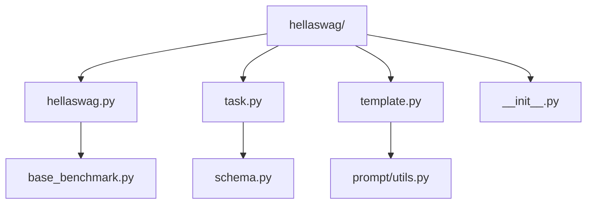
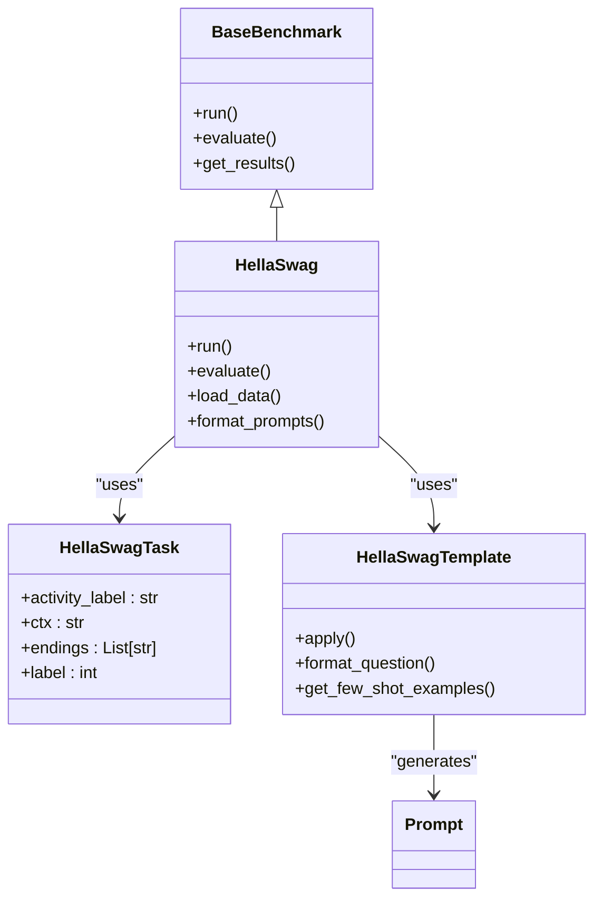
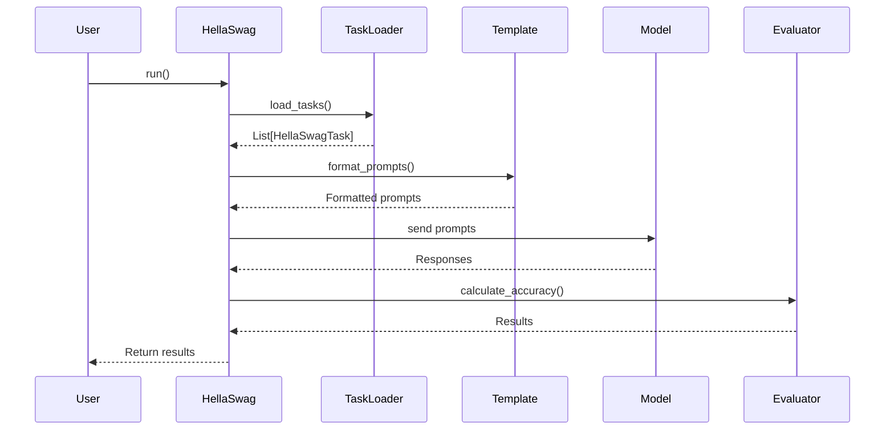
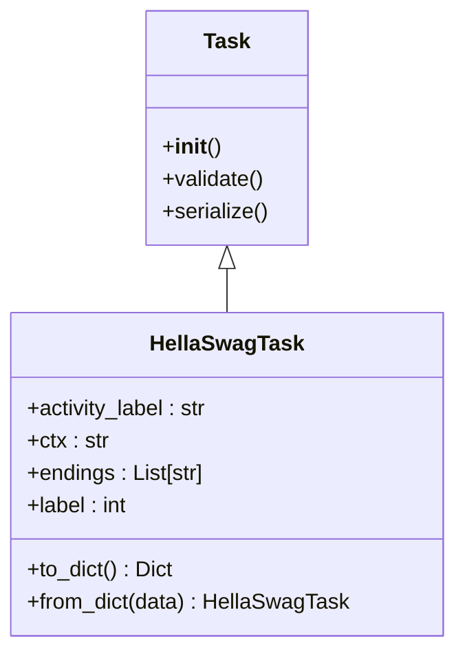
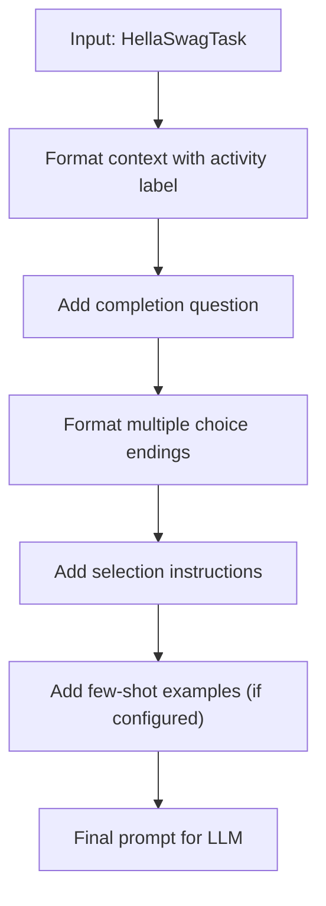

# HellaSwag Benchmark

<cite>
**Referenced Files in This Document**   
- [hellaswag.py](file://deepeval/benchmarks/hellaswag/hellaswag.py)
- [task.py](file://deepeval/benchmarks/hellaswag/task.py)
- [template.py](file://deepeval/benchmarks/hellaswag/template.py)
- [base_benchmark.py](file://deepeval/benchmarks/base_benchmark.py)
- [benchmarks-hellaswag.mdx](file://docs/docs/benchmarks-hellaswag.mdx)
</cite>

## Table of Contents
1. [Introduction](#introduction)
2. [Project Structure](#project-structure)
3. [Core Components](#core-components)
4. [Architecture Overview](#architecture-overview)
5. [Detailed Component Analysis](#detailed-component-analysis)
6. [Dependency Analysis](#dependency-analysis)
7. [Performance Considerations](#performance-considerations)
8. [Troubleshooting Guide](#troubleshooting-guide)
9. [Conclusion](#conclusion)

## Introduction
The HellaSwag benchmark in DeepEval is designed to evaluate large language models' commonsense reasoning capabilities through sentence completion tasks that require understanding of physical and social contexts. This benchmark assesses a model's ability to predict the most plausible continuation of a given scenario from multiple choices, testing its grasp of everyday situations and implicit knowledge about how the world works. The implementation follows a structured approach with specialized components for task handling, prompt templating, and evaluation metrics.

## Project Structure
The HellaSwag benchmark is organized within the DeepEval framework as a dedicated module under the benchmarks directory. It follows a consistent pattern with other benchmarks, containing specialized files for the benchmark logic, task definitions, and template management.



**Diagram sources**
- [hellaswag.py](file://deepeval/benchmarks/hellaswag/hellaswag.py)
- [task.py](file://deepeval/benchmarks/hellaswag/task.py)
- [template.py](file://deepeval/benchmarks/hellaswag/template.py)

**Section sources**
- [hellaswag.py](file://deepeval/benchmarks/hellaswag/hellaswag.py)
- [task.py](file://deepeval/benchmarks/hellaswag/task.py)

## Core Components
The HellaSwag benchmark implementation consists of three primary components: the main benchmark class, the task definition, and the template system. These components work together to load, format, and evaluate commonsense reasoning tasks. The benchmark evaluates models using top-1 accuracy, measuring the percentage of times the model selects the correct continuation from the provided options.

**Section sources**
- [hellaswag.py](file://deepeval/benchmarks/hellaswag/hellaswag.py)
- [task.py](file://deepeval/benchmarks/hellaswag/task.py)
- [template.py](file://deepeval/benchmarks/hellaswag/template.py)

## Architecture Overview
The HellaSwag benchmark architecture follows the DeepEval framework's standardized pattern for evaluation benchmarks. It extends the base benchmark functionality while implementing specific logic for commonsense reasoning tasks.



**Diagram sources**
- [hellaswag.py](file://deepeval/benchmarks/hellaswag/hellaswag.py)
- [base_benchmark.py](file://deepeval/benchmarks/base_benchmark.py)
- [task.py](file://deepeval/benchmarks/hellaswag/task.py)
- [template.py](file://deepeval/benchmarks/hellaswag/template.py)

## Detailed Component Analysis

### HellaSwag Class Analysis
The HellaSwag class serves as the main entry point for the benchmark, orchestrating the evaluation process from data loading to result computation. It implements the standardized interface expected by the DeepEval framework while providing HellaSwag-specific functionality.



**Diagram sources**
- [hellaswag.py](file://deepeval/benchmarks/hellaswag/hellaswag.py)
- [task.py](file://deepeval/benchmarks/hellaswag/task.py)
- [template.py](file://deepeval/benchmarks/hellaswag/template.py)

**Section sources**
- [hellaswag.py](file://deepeval/benchmarks/hellaswag/hellaswag.py)

### Task Structure Analysis
The HellaSwag task structure represents individual commonsense reasoning problems, each consisting of a context and multiple possible endings. The task abstraction enables consistent handling of multiple-choice completions across different models and evaluation scenarios.



**Diagram sources**
- [task.py](file://deepeval/benchmarks/hellaswag/task.py)

**Section sources**
- [task.py](file://deepeval/benchmarks/hellaswag/task.py)

### Template System Analysis
The template system handles the formatting of HellaSwag tasks into prompts suitable for language models. It implements the prompt templating strategy that structures the input to maximize the model's ability to demonstrate commonsense reasoning.



**Diagram sources**
- [template.py](file://deepeval/benchmarks/hellaswag/template.py)

**Section sources**
- [template.py](file://deepeval/benchmarks/hellaswag/template.py)

## Dependency Analysis
The HellaSwag benchmark depends on several core components of the DeepEval framework, integrating with the task loading mechanisms and evaluation infrastructure.

```mermaid
graph TD
HellaSwag --> BaseBenchmark : "inherits"
HellaSwag --> Task : "uses"
HellaSwag --> Template : "uses"
HellaSwag --> Model : "evaluates"
BaseBenchmark --> Results : "produces"
Template --> Prompt : "generates"
Task --> Schema : "follows"
```

**Diagram sources**
- [hellaswag.py](file://deepeval/benchmarks/hellaswag/hellaswag.py)
- [base_benchmark.py](file://deepeval/benchmarks/base_benchmark.py)

**Section sources**
- [hellaswag.py](file://deepeval/benchmarks/hellaswag/hellaswag.py)
- [base_benchmark.py](file://deepeval/benchmarks/base_benchmark.py)

## Performance Considerations
When executing the HellaSwag benchmark, several performance factors should be considered. The evaluation speed is primarily influenced by the model's inference time and the number of test instances. For reliable results, it's recommended to use the full test set rather than sampling, as HellaSwag contains challenging cases specifically designed to differentiate between models with varying levels of commonsense understanding.

## Troubleshooting Guide
Common challenges when using the HellaSwag benchmark include ambiguous scenarios where multiple endings seem plausible, model overconfidence in incorrect predictions, and performance variability across different domains. To address these issues, ensure that the model is properly calibrated and consider analyzing performance by category to identify specific areas of weakness. For optimal evaluation runs, verify that the task data is correctly loaded and that the prompt templates are properly formatted for the target model.

## Conclusion
The HellaSwag benchmark in DeepEval provides a robust framework for evaluating commonsense reasoning in language models. By implementing a structured approach to task handling, prompt templating, and evaluation, it enables reliable assessment of a model's ability to understand physical and social contexts. The integration with DeepEval's task abstraction system allows for consistent evaluation of multiple-choice completions, while the flexible template system ensures compatibility with various language models. Following best practices for evaluation runs and interpreting the top-1 accuracy metric can provide valuable insights into model performance on challenging commonsense reasoning tasks.