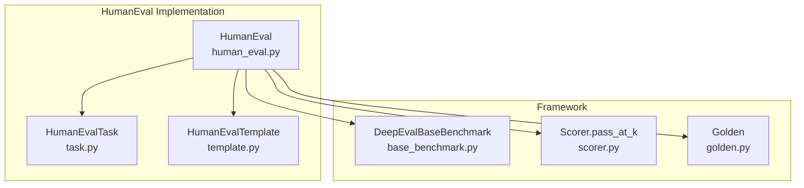
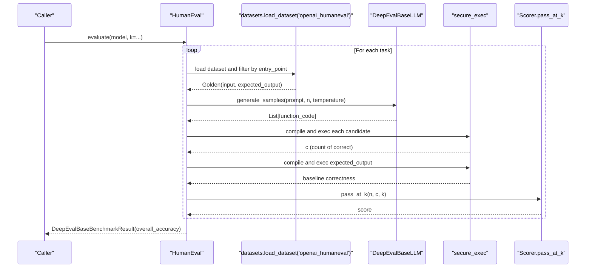
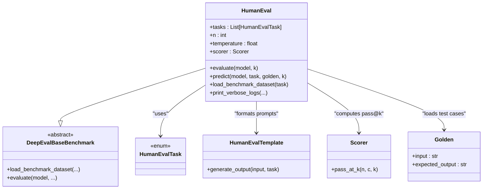
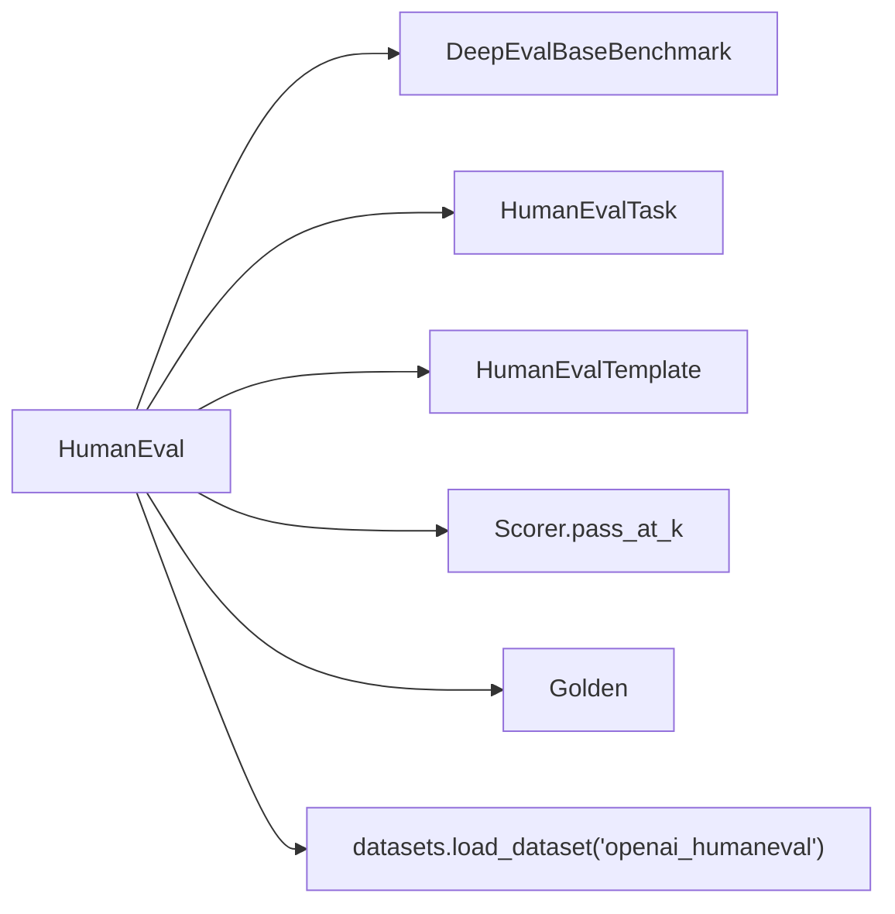

# HumanEval Benchmark

<cite>
**Referenced Files in This Document**
- [human_eval.py](file://deepeval/benchmarks/human_eval/human_eval.py)
- [task.py](file://deepeval/benchmarks/human_eval/task.py)
- [template.py](file://deepeval/benchmarks/human_eval/template.py)
- [base_benchmark.py](file://deepeval/benchmarks/base_benchmark.py)
- [scorer.py](file://deepeval/scorer/scorer.py)
- [golden.py](file://deepeval/dataset/golden.py)
- [benchmarks-HumanEval.mdx](file://docs/docs/benchmarks-HumanEval.mdx)
- [benchmarks-introduction.mdx](file://docs/docs/benchmarks-introduction.mdx)
</cite>

## Table of Contents
1. [Introduction](#introduction)
2. [Project Structure](#project-structure)
3. [Core Components](#core-components)
4. [Architecture Overview](#architecture-overview)
5. [Detailed Component Analysis](#detailed-component-analysis)
6. [Dependency Analysis](#dependency-analysis)
7. [Performance Considerations](#performance-considerations)
8. [Troubleshooting Guide](#troubleshooting-guide)
9. [Conclusion](#conclusion)
10. [Appendices](#appendices)

## Introduction
HumanEval is a benchmark that evaluates an LLM’s code generation capabilities through function completion tasks. Instead of relying on textual similarity to a reference solution, it focuses on functional correctness by validating whether generated code passes a suite of unit tests. The benchmark uses the OpenAI HumanEval dataset and applies the pass@k metric to estimate the probability that at least one of the top k generated solutions passes all tests for a given task.

This document explains how DeepEval implements HumanEval, how it extends the base benchmark interface, how code-specific templates are used for prompt formatting, how to run evaluations, how pass@k is computed, and how to integrate with Python execution environments safely. It also covers practical examples, performance tips, and common issues such as syntax errors, timeouts, and test dependencies.

## Project Structure
The HumanEval benchmark resides under the benchmarks module and integrates with the broader evaluation framework. The key files are:
- HumanEval implementation and execution logic
- HumanEvalTask enumeration of problems
- HumanEvalTemplate for prompt construction
- Base benchmark interface
- Scorer utilities for pass@k computation
- Golden data model for test cases

**Diagram sources**
- [human_eval.py](file://deepeval/benchmarks/human_eval/human_eval.py#L72-L248)
- [task.py](file://deepeval/benchmarks/human_eval/task.py#L1-L162)
- [template.py](file://deepeval/benchmarks/human_eval/template.py#L1-L20)
- [base_benchmark.py](file://deepeval/benchmarks/base_benchmark.py#L1-L33)
- [scorer.py](file://deepeval/scorer/scorer.py#L423-L434)
- [golden.py](file://deepeval/dataset/golden.py#L1-L198)

**Section sources**
- [human_eval.py](file://deepeval/benchmarks/human_eval/human_eval.py#L72-L248)
- [task.py](file://deepeval/benchmarks/human_eval/task.py#L1-L162)
- [template.py](file://deepeval/benchmarks/human_eval/template.py#L1-L20)
- [base_benchmark.py](file://deepeval/benchmarks/base_benchmark.py#L1-L33)
- [scorer.py](file://deepeval/scorer/scorer.py#L423-L434)
- [golden.py](file://deepeval/dataset/golden.py#L1-L198)

## Core Components
- HumanEval: Orchestrates loading the HumanEval dataset, generating multiple candidate solutions per task, validating them, and computing pass@k scores.
- HumanEvalTask: Enumerates all 164 tasks included in the benchmark.
- HumanEvalTemplate: Formats prompts to request function completion with a specific entry point.
- Scorer.pass_at_k: Computes the pass@k metric from n samples and c correct samples.
- Golden: Represents a test case with input prompt and expected test code.

Key responsibilities:
- Prompt formatting and generation via HumanEvalTemplate
- Sampling and validation via model.generate_samples and secure_exec
- Functional correctness assessment by compiling and executing generated and expected code
- pass@k computation and aggregation across tasks

**Section sources**
- [human_eval.py](file://deepeval/benchmarks/human_eval/human_eval.py#L72-L248)
- [task.py](file://deepeval/benchmarks/human_eval/task.py#L1-L162)
- [template.py](file://deepeval/benchmarks/human_eval/template.py#L1-L20)
- [scorer.py](file://deepeval/scorer/scorer.py#L423-L434)
- [golden.py](file://deepeval/dataset/golden.py#L1-L198)

## Architecture Overview
The HumanEval benchmark follows a clear pipeline:
1. Load dataset (OpenAI HumanEval) and select a task by entry point.
2. Generate n candidate solutions using the model’s generate_samples method.
3. Validate each candidate by compiling and executing it in a restricted environment.
4. Validate the expected solution similarly to establish baseline correctness.
5. Compute pass@k using the number of correct candidates and k.
6. Aggregate per-task and overall scores.

**Diagram sources**
- [human_eval.py](file://deepeval/benchmarks/human_eval/human_eval.py#L97-L202)
- [scorer.py](file://deepeval/scorer/scorer.py#L423-L434)

## Detailed Component Analysis

### HumanEval Class
Responsibilities:
- Extend DeepEvalBaseBenchmark to implement evaluate and load_benchmark_dataset.
- Manage sampling parameters (n, temperature) and caching of per-task results.
- Generate prompts, collect samples, validate functional correctness, and compute pass@k.

Key behaviors:
- Prompt generation via HumanEvalTemplate.generate_output.
- Sampling via model.generate_samples with n and temperature.
- Validation using secure_exec to compile and execute code in a restricted environment.
- pass@k computation via Scorer.pass_at_k.

**Diagram sources**
- [human_eval.py](file://deepeval/benchmarks/human_eval/human_eval.py#L72-L248)
- [base_benchmark.py](file://deepeval/benchmarks/base_benchmark.py#L16-L33)
- [task.py](file://deepeval/benchmarks/human_eval/task.py#L1-L162)
- [template.py](file://deepeval/benchmarks/human_eval/template.py#L1-L20)
- [scorer.py](file://deepeval/scorer/scorer.py#L423-L434)
- [golden.py](file://deepeval/dataset/golden.py#L1-L198)

**Section sources**
- [human_eval.py](file://deepeval/benchmarks/human_eval/human_eval.py#L72-L248)

### HumanEvalTask Enumeration
Defines all 164 tasks in the HumanEval benchmark. Each task corresponds to a specific function entry point used to filter the dataset and construct the Golden test case.

Practical usage:
- Select a subset of tasks for targeted evaluation.
- Iterate over all tasks to run comprehensive evaluation.

**Section sources**
- [task.py](file://deepeval/benchmarks/human_eval/task.py#L1-L162)

### HumanEvalTemplate
Formats prompts to request function completion with a specific entry point. The template instructs the model to output only the function body and to avoid markdown formatting.

Prompt characteristics:
- Requests completion of a function.
- Requires output to include the function signature indicated by the entry point.
- Disallows markdown formatting.

**Section sources**
- [template.py](file://deepeval/benchmarks/human_eval/template.py#L1-L20)

### Secure Execution Environment
To validate functional correctness safely, DeepEval compiles and executes generated code in a restricted environment:
- Restricted globals include a curated set of built-ins and exceptions.
- Compilation occurs first to catch syntax errors early.
- Exceptions during execution are surfaced to the caller.

Security considerations:
- Only whitelisted built-ins are available.
- No file system, network, or shell access is permitted.
- Errors are raised to prevent silent failures.

Common issues:
- Syntax errors cause immediate exceptions during compile/exec.
- Runtime errors (e.g., assertion failures) are treated as incorrect solutions.

**Section sources**
- [human_eval.py](file://deepeval/benchmarks/human_eval/human_eval.py#L14-L70)

### Pass@k Metric
Pass@k estimates the probability that at least one of the top k solutions passes all tests. It is computed from n total samples and c correct samples.

Formula:
- pass@k = 1 − C(n − c, k) / C(n, k)

Where:
- n: total number of samples
- c: number of correct samples
- k: top samples considered

Behavior:
- If n − c < k, pass@k is set to 1.0 (no remaining incorrect samples).
- Otherwise, it computes the complement of the probability that all k chosen samples are incorrect.

**Section sources**
- [scorer.py](file://deepeval/scorer/scorer.py#L423-L434)
- [benchmarks-HumanEval.mdx](file://docs/docs/benchmarks-HumanEval.mdx#L75-L84)

### Practical Usage Examples
Running HumanEval with a custom model:
- Instantiate HumanEval with desired tasks and n.
- Call evaluate with a model that implements generate_samples and specify k.
- Access overall_score, task_scores, and predictions for analysis.

Notes:
- The documentation emphasizes that each task is evaluated n times by default.
- The model must implement generate_samples to return a list of candidate solutions.

**Section sources**
- [benchmarks-HumanEval.mdx](file://docs/docs/benchmarks-HumanEval.mdx#L33-L74)
- [benchmarks-introduction.mdx](file://docs/docs/benchmarks-introduction.mdx#L142-L184)

## Dependency Analysis
HumanEval depends on:
- DeepEvalBaseBenchmark for the benchmark interface and result structure.
- HumanEvalTask for selecting tasks.
- HumanEvalTemplate for prompt formatting.
- Scorer.pass_at_k for metric computation.
- Golden for representing test cases.
- datasets library for loading the HumanEval dataset.

**Diagram sources**
- [human_eval.py](file://deepeval/benchmarks/human_eval/human_eval.py#L72-L248)
- [base_benchmark.py](file://deepeval/benchmarks/base_benchmark.py#L16-L33)
- [task.py](file://deepeval/benchmarks/human_eval/task.py#L1-L162)
- [template.py](file://deepeval/benchmarks/human_eval/template.py#L1-L20)
- [scorer.py](file://deepeval/scorer/scorer.py#L423-L434)
- [golden.py](file://deepeval/dataset/golden.py#L1-L198)

**Section sources**
- [human_eval.py](file://deepeval/benchmarks/human_eval/human_eval.py#L72-L248)
- [base_benchmark.py](file://deepeval/benchmarks/base_benchmark.py#L16-L33)
- [scorer.py](file://deepeval/scorer/scorer.py#L423-L434)

## Performance Considerations
- Batch generation: While HumanEval does not expose a batch_size parameter, you can reduce latency by batching model.generate_samples calls at the model level (outside HumanEval) if supported by your LLM client.
- Parallel evaluation: Evaluate multiple tasks concurrently by running separate HumanEval instances or by parallelizing across tasks externally. Ensure thread safety and resource limits.
- Sampling strategy: Adjust n and temperature to balance coverage and cost. Higher n improves robustness but increases runtime.
- Caching: The implementation caches per-task functions and counts to avoid recomputation across runs.

[No sources needed since this section provides general guidance]

## Troubleshooting Guide
Common issues and resolutions:
- Syntax errors in generated code:
  - Cause: Generated code fails compilation.
  - Effect: secure_exec raises an exception; candidate is not counted as correct.
  - Resolution: Improve prompt clarity, adjust temperature, or refine model instructions.
- Assertion failures or runtime errors:
  - Cause: Generated code executes but fails tests.
  - Effect: Candidate is not counted as correct.
  - Resolution: Provide clearer constraints in prompts, add examples, or increase n.
- Timeout handling:
  - Observation: The HumanEval implementation does not include explicit timeouts around model.generate_samples or secure_exec.
  - Recommendation: Wrap model.generate_samples and secure_exec with timeouts at the model or application level.
- Dependencies in test execution:
  - Observation: The restricted execution environment limits imports and external libraries.
  - Recommendation: Ensure all required functionality is available in the restricted built-ins or predefine helper functions in the prompt.
- Large n costs:
  - Observation: Default n is high, increasing API calls and execution time.
  - Recommendation: Start with smaller n for pilot runs; scale up for final evaluation.

**Section sources**
- [human_eval.py](file://deepeval/benchmarks/human_eval/human_eval.py#L14-L70)
- [benchmarks-HumanEval.mdx](file://docs/docs/benchmarks-HumanEval.mdx#L29-L34)

## Conclusion
HumanEval in DeepEval provides a robust, functional correctness-focused evaluation of code generation. By combining a curated prompt template, controlled sampling, and a secure execution environment, it computes reliable pass@k scores across 164 programming tasks. Proper model integration, careful prompt engineering, and attention to execution safety enable meaningful comparisons of LLMs on function completion benchmarks.

[No sources needed since this section summarizes without analyzing specific files]

## Appendices

### How pass@k is computed
- Inputs: n (total samples), c (correct samples), k (top samples).
- Logic: If n − c < k, return 1.0; otherwise compute 1 − C(n − c, k)/C(n, k).
- Output: Probability that at least one of the top k samples passes all tests.

**Section sources**
- [scorer.py](file://deepeval/scorer/scorer.py#L423-L434)

### Example workflow outline
- Prepare a custom model implementing generate_samples.
- Instantiate HumanEval with selected tasks and n.
- Run evaluate with k for pass@k.
- Inspect overall_score, task_scores, and predictions.

**Section sources**
- [benchmarks-HumanEval.mdx](file://docs/docs/benchmarks-HumanEval.mdx#L33-L74)