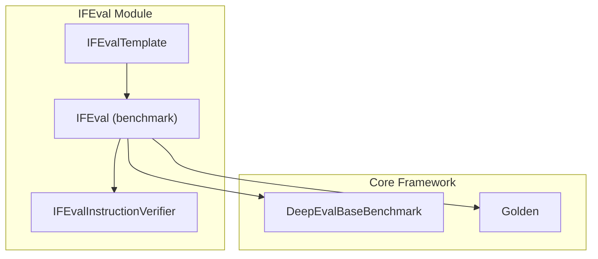
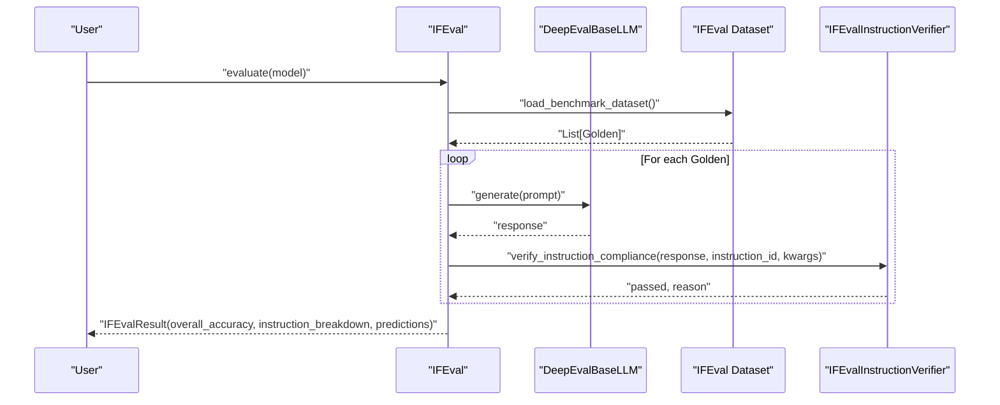
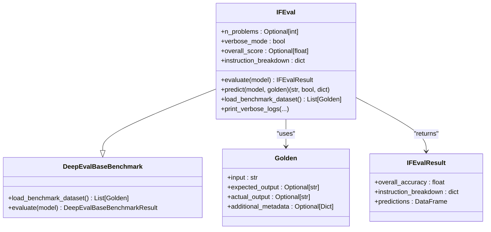
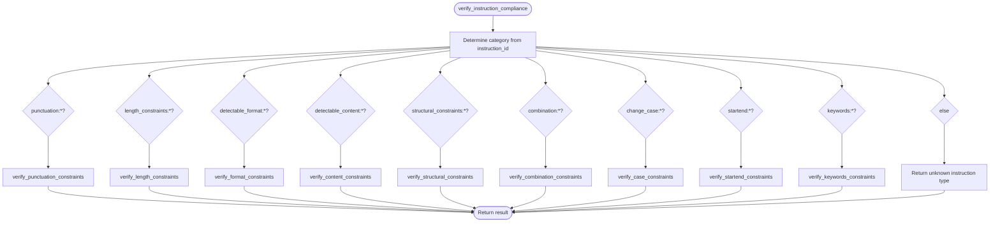
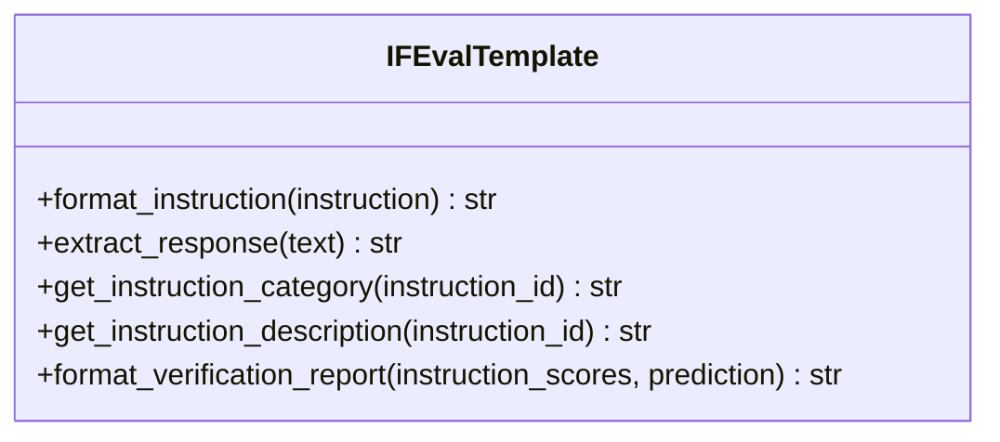
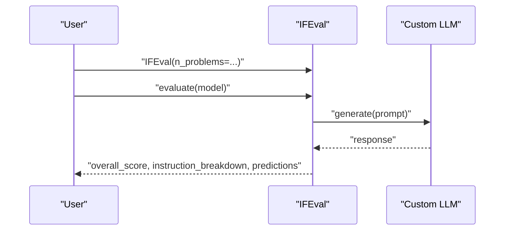
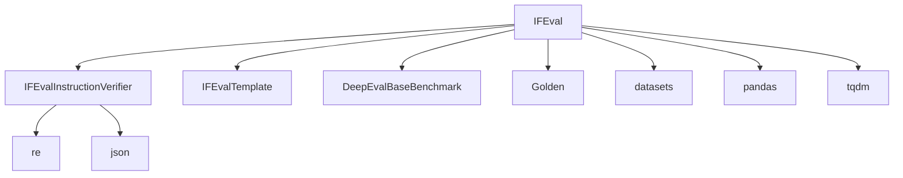

# IFEval Benchmark

<cite>
**Referenced Files in This Document**
- [ifeval.py](file://deepeval/benchmarks/ifeval/ifeval.py)
- [template.py](file://deepeval/benchmarks/ifeval/template.py)
- [base_benchmark.py](file://deepeval/benchmarks/base_benchmark.py)
- [golden.py](file://deepeval/dataset/golden.py)
- [benchmarks-ifeval.mdx](file://docs/docs/benchmarks-ifeval.mdx)
- [benchmarks-introduction.mdx](file://docs/docs/benchmarks-introduction.mdx)
</cite>

## Table of Contents
1. [Introduction](#introduction)
2. [Project Structure](#project-structure)
3. [Core Components](#core-components)
4. [Architecture Overview](#architecture-overview)
5. [Detailed Component Analysis](#detailed-component-analysis)
6. [Dependency Analysis](#dependency-analysis)
7. [Performance Considerations](#performance-considerations)
8. [Troubleshooting Guide](#troubleshooting-guide)
9. [Conclusion](#conclusion)
10. [Appendices](#appendices)

## Introduction
IFEval (Instruction Following Evaluation) is a benchmark for evaluating how accurately language models follow instructions across a wide variety of constraints and requirements. It measures adherence to formatting rules, content restrictions, structural guidelines, and procedural instructions. In DeepEval, the IFEval benchmark loads the official dataset, generates model responses, and verifies compliance using a rule-based verifier. The benchmark reports an overall accuracy and a per-instruction breakdown to help diagnose strengths and weaknesses in instruction-following behavior.

IFEval is grounded in the original research and implementation referenced in the codebase, and it integrates seamlessly with DeepEval’s benchmarking framework.

**Section sources**
- [ifeval.py](file://deepeval/benchmarks/ifeval/ifeval.py#L392-L402)
- [benchmarks-ifeval.mdx](file://docs/docs/benchmarks-ifeval.mdx#L1-L37)

## Project Structure
The IFEval benchmark resides under the benchmarks module and is composed of:
- A benchmark class that orchestrates loading the dataset, generating predictions, and computing scores.
- An instruction verifier that checks model outputs against instruction IDs and associated parameters.
- A template utility that formats instructions and extracts responses for consistent evaluation.

**Diagram sources**
- [ifeval.py](file://deepeval/benchmarks/ifeval/ifeval.py#L392-L620)
- [template.py](file://deepeval/benchmarks/ifeval/template.py#L1-L132)
- [base_benchmark.py](file://deepeval/benchmarks/base_benchmark.py#L1-L33)
- [golden.py](file://deepeval/dataset/golden.py#L1-L120)

**Section sources**
- [ifeval.py](file://deepeval/benchmarks/ifeval/ifeval.py#L392-L620)
- [template.py](file://deepeval/benchmarks/ifeval/template.py#L1-L132)
- [base_benchmark.py](file://deepeval/benchmarks/base_benchmark.py#L1-L33)
- [golden.py](file://deepeval/dataset/golden.py#L1-L120)

## Core Components
- IFEval: Loads the IFEval dataset from the official source, iterates over test cases, generates predictions, and computes overall and per-instruction accuracy.
- IFEvalInstructionVerifier: Implements rule-based checks for instruction categories such as punctuation, length, format, content, structure, combinations, case, start/end, and keywords.
- IFEvalTemplate: Provides utilities to format instructions and extract responses consistently, plus helpers to categorize and describe instructions for reporting.

Key responsibilities:
- Dataset ingestion: Reads prompt, instruction_id_list, and kwargs from the dataset and wraps them into Golden objects with additional metadata.
- Prediction generation: Uses the model’s generate method with optional schema support, falling back to a basic generate call if needed.
- Compliance verification: Applies category-specific checks to each instruction ID and aggregates results.
- Reporting: Computes overall accuracy and instruction-level breakdown, and optionally prints verbose logs.

**Section sources**
- [ifeval.py](file://deepeval/benchmarks/ifeval/ifeval.py#L421-L620)
- [template.py](file://deepeval/benchmarks/ifeval/template.py#L1-L132)

## Architecture Overview
IFEval integrates with DeepEval’s benchmarking infrastructure. The benchmark inherits from the base benchmark class, uses Golden objects to represent test cases, and applies the instruction verifier to compute compliance scores.

**Diagram sources**
- [ifeval.py](file://deepeval/benchmarks/ifeval/ifeval.py#L421-L536)
- [base_benchmark.py](file://deepeval/benchmarks/base_benchmark.py#L16-L33)
- [golden.py](file://deepeval/dataset/golden.py#L1-L120)

## Detailed Component Analysis

### IFEval Benchmark Class
Responsibilities:
- Initialization: Sets up internal state, optional verbosity, and a scorer.
- Evaluation: Iterates over the dataset, collects predictions, computes overall accuracy, and aggregates instruction-level counts.
- Prediction: Generates a response from the model and verifies compliance against all instruction IDs attached to the Golden.
- Dataset loading: Loads the IFEval dataset and constructs Golden objects with instruction metadata.

**Diagram sources**
- [ifeval.py](file://deepeval/benchmarks/ifeval/ifeval.py#L392-L620)
- [base_benchmark.py](file://deepeval/benchmarks/base_benchmark.py#L16-L33)
- [golden.py](file://deepeval/dataset/golden.py#L1-L120)

**Section sources**
- [ifeval.py](file://deepeval/benchmarks/ifeval/ifeval.py#L421-L620)
- [base_benchmark.py](file://deepeval/benchmarks/base_benchmark.py#L16-L33)
- [golden.py](file://deepeval/dataset/golden.py#L1-L120)

### Instruction Verifier
The verifier implements category-specific checks for instruction compliance. Each instruction ID is prefixed by a category (e.g., punctuation:, length_constraints:, detectable_format:, detectable_content:, structural_constraints:, combination:, change_case:, startend:, keywords:). The verifier routes verification to the appropriate method and returns a pass/fail outcome along with a reason.

Categories covered:
- Punctuation constraints: disallowing specific punctuation marks.
- Length constraints: word, character, and sentence counts with relational operators.
- Detectable format: JSON validity, list format, bullet counts, highlighted sections, title markers.
- Change case: enforcing lowercase, uppercase, or title case.
- Start/end constraints: requiring specific prefixes or suffixes.
- Keywords: requiring or forbidding specific keywords.
- Detectable content: keyword frequency, forbidden words, placeholder counts, postscript presence, first-word requirement.
- Structural constraints: paragraph and section counts.
- Combination constraints: repeating a specified prompt.

**Diagram sources**
- [ifeval.py](file://deepeval/benchmarks/ifeval/ifeval.py#L27-L390)

**Section sources**
- [ifeval.py](file://deepeval/benchmarks/ifeval/ifeval.py#L27-L390)

### Prompt Templating and Response Extraction
IFEvalTemplate provides:
- Formatting instructions to ensure consistent prompt structure.
- Response extraction to isolate the model’s output portion.
- Instruction categorization and human-readable descriptions for reporting.
- A formatted verification report grouped by instruction categories.

**Diagram sources**
- [template.py](file://deepeval/benchmarks/ifeval/template.py#L1-L132)

**Section sources**
- [template.py](file://deepeval/benchmarks/ifeval/template.py#L1-L132)

### Practical Usage Example
To evaluate a custom model on IFEval:
- Instantiate the benchmark with optional parameters (e.g., limiting the number of problems).
- Call evaluate with your model.
- Access overall_score, instruction_breakdown, and predictions attributes.

**Diagram sources**
- [benchmarks-ifeval.mdx](file://docs/docs/benchmarks-ifeval.mdx#L1-L37)
- [ifeval.py](file://deepeval/benchmarks/ifeval/ifeval.py#L421-L493)

**Section sources**
- [benchmarks-ifeval.mdx](file://docs/docs/benchmarks-ifeval.mdx#L1-L37)
- [benchmarks-introduction.mdx](file://docs/docs/benchmarks-introduction.mdx#L1-L140)
- [ifeval.py](file://deepeval/benchmarks/ifeval/ifeval.py#L421-L493)

## Dependency Analysis
- IFEval depends on:
  - DeepEvalBaseBenchmark for the benchmarking interface.
  - Golden for representing test cases and carrying instruction metadata.
  - datasets library to load the IFEval dataset.
  - pandas for storing predictions.
  - tqdm for progress indication.
  - re for regex-based parsing and counting.

- Instruction verifier is self-contained and relies on built-in string operations and JSON parsing.

**Diagram sources**
- [ifeval.py](file://deepeval/benchmarks/ifeval/ifeval.py#L1-L620)
- [template.py](file://deepeval/benchmarks/ifeval/template.py#L1-L132)

**Section sources**
- [ifeval.py](file://deepeval/benchmarks/ifeval/ifeval.py#L1-L620)
- [template.py](file://deepeval/benchmarks/ifeval/template.py#L1-L132)

## Performance Considerations
- Dataset size: Use the n_problems parameter to limit evaluation for faster iteration during development.
- Batch generation: While IFEval does not expose a batch_size parameter in its evaluate method, ensure your model implementation supports efficient batch generation if you plan to integrate it elsewhere in DeepEval.
- Regex operations: Some verifications rely on regex and string operations; keep instruction kwargs minimal to reduce overhead.
- Verbosity: verbose_mode enables detailed logs per problem, which can slow down evaluation and increase output volume.

[No sources needed since this section provides general guidance]

## Troubleshooting Guide
Common issues and resolutions:
- Partial compliance: If an instruction fails, inspect the instruction_id and associated kwargs to adjust expectations. The verifier returns reasons for failures, aiding targeted fixes.
- Over-interpretation: Ensure instructions are precise and unambiguous. For example, specify exact punctuation removal or exact counts rather than vague constraints.
- Ambiguous constraints: Prefer explicit relational operators (exactly, at least, less than, more than) and clearly defined markers (e.g., bullet patterns, title delimiters).
- Output formatting: If responses are not in the expected format, consider adding explicit formatting instructions in the prompt or adjusting detectable_format checks.
- Response extraction: If the model adds extra content before the response, ensure the prompt includes a clear directive and use the template’s extraction logic to isolate the response.

**Section sources**
- [ifeval.py](file://deepeval/benchmarks/ifeval/ifeval.py#L27-L390)
- [template.py](file://deepeval/benchmarks/ifeval/template.py#L1-L132)

## Conclusion
IFEval in DeepEval provides a robust, rule-based evaluation of instruction-following capabilities across diverse constraints. By leveraging a structured dataset, consistent prompt formatting, and a comprehensive verifier, it quantifies model adherence to formatting rules, content restrictions, and procedural guidelines. The benchmark’s per-instruction breakdown helps pinpoint areas for improvement, while its integration with DeepEval’s framework simplifies deployment and analysis.

[No sources needed since this section summarizes without analyzing specific files]

## Appendices

### Instruction Categories and Examples
- Punctuation: Disallow specific punctuation marks.
- Length constraints: Enforce exact or relational word/character/sentence counts.
- Detectable format: Require valid JSON, list format, bullet counts, highlighted sections, or title markers.
- Change case: Enforce lowercase, uppercase, or title case.
- Start/end: Require specific prefixes or suffixes.
- Keywords: Require or forbid specific keywords.
- Detectable content: Enforce keyword frequency, forbidden words, placeholder counts, postscript presence, or first-word requirement.
- Structural constraints: Enforce paragraph and section counts.
- Combination constraints: Require repeating a specified prompt.

**Section sources**
- [ifeval.py](file://deepeval/benchmarks/ifeval/ifeval.py#L27-L390)
- [template.py](file://deepeval/benchmarks/ifeval/template.py#L71-L96)