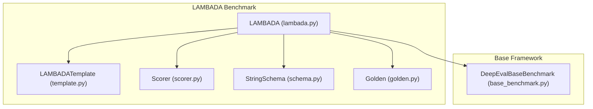
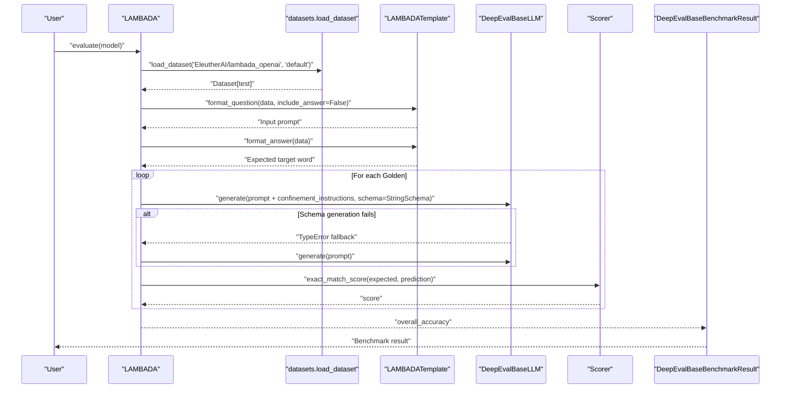
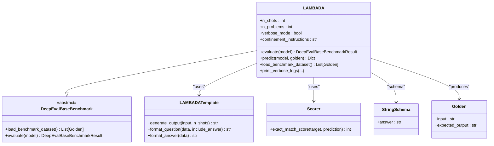
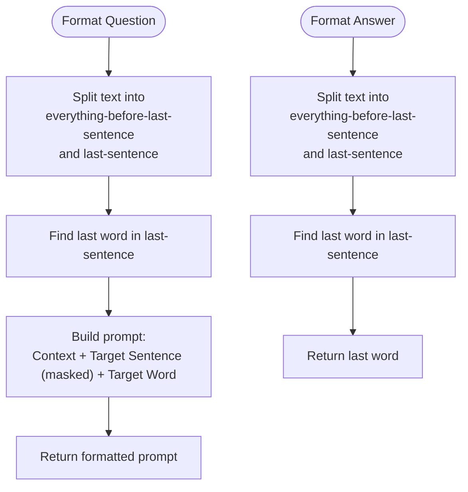
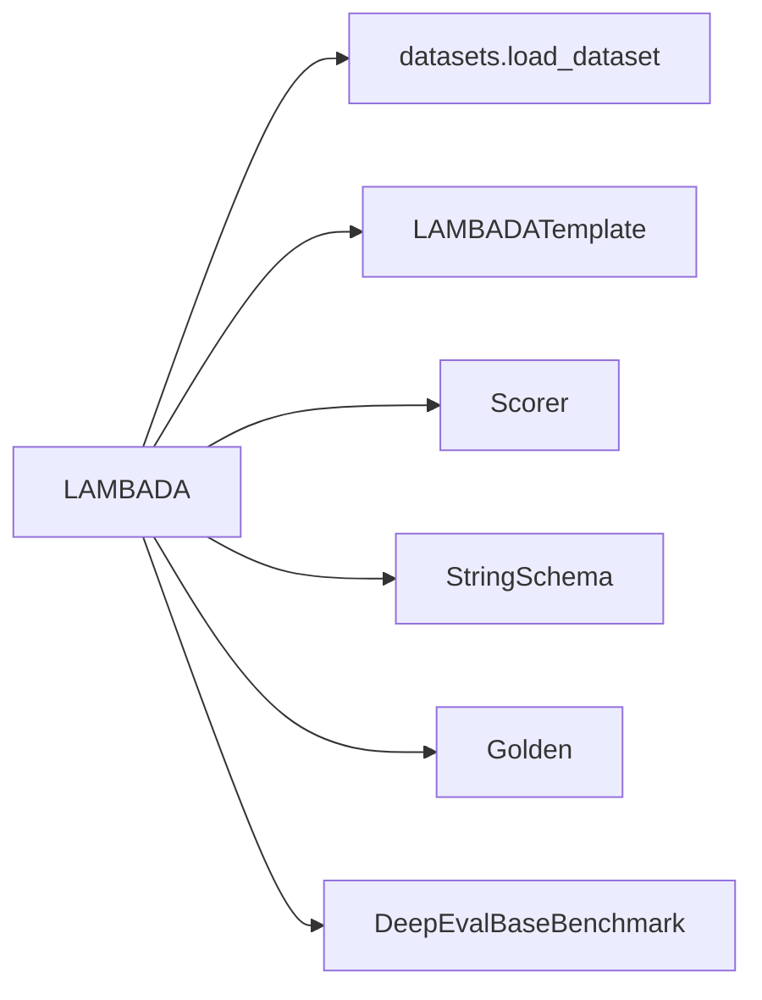

# LAMBADA Benchmark

<cite>
**Referenced Files in This Document**
- [lambada.py](file://deepeval/benchmarks/lambada/lambada.py)
- [template.py](file://deepeval/benchmarks/lambada/template.py)
- [base_benchmark.py](file://deepeval/benchmarks/base_benchmark.py)
- [schema.py](file://deepeval/benchmarks/schema.py)
- [scorer.py](file://deepeval/scorer/scorer.py)
- [golden.py](file://deepeval/dataset/golden.py)
- [benchmarks-lambada.mdx](file://docs/docs/benchmarks-lambada.mdx)
</cite>

## Table of Contents
1. [Introduction](#introduction)
2. [Project Structure](#project-structure)
3. [Core Components](#core-components)
4. [Architecture Overview](#architecture-overview)
5. [Detailed Component Analysis](#detailed-component-analysis)
6. [Dependency Analysis](#dependency-analysis)
7. [Performance Considerations](#performance-considerations)
8. [Troubleshooting Guide](#troubleshooting-guide)
9. [Conclusion](#conclusion)
10. [Appendices](#appendices)

## Introduction
The LAMBADA benchmark evaluates a model’s ability to predict the last word of a sentence given strong contextual dependencies and discourse context. It is derived from the LAMBADA dataset, which consists of 10,000 passages from BooksCorpus, each requiring prediction of the final word of the last sentence. The benchmark emphasizes long-range dependencies and coherence across sentences, making it a challenging test of language modeling and contextual understanding.

This document explains how DeepEval implements the LAMBADA benchmark, including text processing, prompt construction, evaluation methodology, and usage patterns. It also highlights how to interpret results, address common issues, and optimize performance.

## Project Structure
The LAMBADA benchmark resides under the benchmarks module and integrates with the broader DeepEval framework for dataset loading, scoring, and evaluation orchestration.

**Diagram sources**
- [lambada.py](file://deepeval/benchmarks/lambada/lambada.py#L1-L166)
- [template.py](file://deepeval/benchmarks/lambada/template.py#L1-L65)
- [scorer.py](file://deepeval/scorer/scorer.py#L98-L112)
- [schema.py](file://deepeval/benchmarks/schema.py#L21-L23)
- [golden.py](file://deepeval/dataset/golden.py#L8-L24)
- [base_benchmark.py](file://deepeval/benchmarks/base_benchmark.py#L15-L33)

**Section sources**
- [lambada.py](file://deepeval/benchmarks/lambada/lambada.py#L1-L166)
- [template.py](file://deepeval/benchmarks/lambada/template.py#L1-L65)
- [base_benchmark.py](file://deepeval/benchmarks/base_benchmark.py#L15-L33)

## Core Components
- LAMBADA: Orchestrates dataset loading, prompt construction, model generation, scoring, and accuracy aggregation.
- LAMBADATemplate: Builds few-shot prompts and extracts the target word from the dataset.
- Scorer: Provides exact match scoring for word prediction.
- StringSchema: Defines the structured output schema for model generation.
- Golden: Represents a single benchmark item with input and expected output.

Key responsibilities:
- Dataset loading from EleutherAI/lambada_openai and test split conversion to Golden instances.
- Few-shot prompt construction with enforced confinement instructions.
- Exact match scoring and accuracy computation.
- Optional verbose logging for inspection.

**Section sources**
- [lambada.py](file://deepeval/benchmarks/lambada/lambada.py#L15-L166)
- [template.py](file://deepeval/benchmarks/lambada/template.py#L24-L65)
- [scorer.py](file://deepeval/scorer/scorer.py#L98-L112)
- [schema.py](file://deepeval/benchmarks/schema.py#L21-L23)
- [golden.py](file://deepeval/dataset/golden.py#L8-L24)

## Architecture Overview
The evaluation pipeline follows a clear sequence: load dataset, construct prompts, generate predictions, score, and compute accuracy.

**Diagram sources**
- [lambada.py](file://deepeval/benchmarks/lambada/lambada.py#L43-L114)
- [template.py](file://deepeval/benchmarks/lambada/template.py#L24-L65)
- [scorer.py](file://deepeval/scorer/scorer.py#L98-L112)
- [schema.py](file://deepeval/benchmarks/schema.py#L21-L23)

## Detailed Component Analysis

### LAMBADA Class
Responsibilities:
- Initialize benchmark with configurable shots and problem count.
- Load the test split from the EleutherAI lambada_openai dataset.
- Build prompts using LAMBADATemplate and enforce confinement instructions.
- Generate predictions and compute exact match scores.
- Aggregate accuracy and produce a benchmark result.

Implementation highlights:
- Few-shot support limited to 5 examples.
- Confinement instructions enforce output format and remove punctuation.
- Verbose mode prints detailed logs per problem.
- Uses telemetry to capture benchmark runs.

**Diagram sources**
- [lambada.py](file://deepeval/benchmarks/lambada/lambada.py#L15-L166)
- [template.py](file://deepeval/benchmarks/lambada/template.py#L24-L65)
- [scorer.py](file://deepeval/scorer/scorer.py#L98-L112)
- [schema.py](file://deepeval/benchmarks/schema.py#L21-L23)
- [golden.py](file://deepeval/dataset/golden.py#L8-L24)
- [base_benchmark.py](file://deepeval/benchmarks/base_benchmark.py#L15-L33)

**Section sources**
- [lambada.py](file://deepeval/benchmarks/lambada/lambada.py#L15-L166)
- [base_benchmark.py](file://deepeval/benchmarks/base_benchmark.py#L15-L33)

### LAMBADATemplate
Purpose:
- Extract the last sentence and last word from each passage.
- Construct few-shot prompts and a target word prompt.
- Provide the expected target word for scoring.

Processing logic:
- Split text into everything-before-last-sentence and last-sentence.
- Extract the final word from the last sentence.
- Build a prompt with few-shot examples and the masked target sentence.

**Diagram sources**
- [template.py](file://deepeval/benchmarks/lambada/template.py#L24-L65)

**Section sources**
- [template.py](file://deepeval/benchmarks/lambada/template.py#L24-L65)

### Scoring and Evaluation Methodology
- Exact match scoring: Case-sensitive, whitespace-sensitive match between predicted and expected target word.
- Accuracy: Number of correct predictions divided by total number of problems.
- Perplexity: Not computed by this benchmark; the repository does not expose perplexity metrics for LAMBADA.

Interpretation:
- Scores range from 0 to 1; higher is better.
- The documentation emphasizes exact matching and the impact of few-shot examples.

**Section sources**
- [scorer.py](file://deepeval/scorer/scorer.py#L98-L112)
- [benchmarks-lambada.mdx](file://docs/docs/benchmarks-lambada.mdx#L27-L46)

### Usage Examples
- Instantiate the benchmark with desired number of problems and shots.
- Call evaluate with a model implementing DeepEvalBaseLLM.
- Access overall_score for accuracy.

Example paths:
- [Usage example](file://docs/docs/benchmarks-lambada.mdx#L27-L40)

**Section sources**
- [benchmarks-lambada.mdx](file://docs/docs/benchmarks-lambada.mdx#L27-L46)

## Dependency Analysis
- LAMBADA depends on:
  - datasets for loading the lambada_openai dataset.
  - LAMBADATemplate for prompt construction.
  - Scorer for exact match scoring.
  - StringSchema to constrain model output.
  - Golden for representing benchmark items.

**Diagram sources**
- [lambada.py](file://deepeval/benchmarks/lambada/lambada.py#L116-L134)
- [template.py](file://deepeval/benchmarks/lambada/template.py#L24-L65)
- [scorer.py](file://deepeval/scorer/scorer.py#L98-L112)
- [schema.py](file://deepeval/benchmarks/schema.py#L21-L23)
- [golden.py](file://deepeval/dataset/golden.py#L8-L24)
- [base_benchmark.py](file://deepeval/benchmarks/base_benchmark.py#L15-L33)

**Section sources**
- [lambada.py](file://deepeval/benchmarks/lambada/lambada.py#L116-L134)
- [base_benchmark.py](file://deepeval/benchmarks/base_benchmark.py#L15-L33)

## Performance Considerations
- Few-shot examples: Up to 5 examples are supported; increasing shots often improves robustness of output format and accuracy.
- Confinement instructions: Enforcing “Output the target word! Do not include punctuations.” reduces variability in model output and improves exact match.
- Tokenization and vocabulary:
  - The benchmark relies on exact string match; tokenization differences or subword segmentation can cause mismatches.
  - Models with inconsistent tokenization or punctuation handling may reduce accuracy.
- Long-range dependencies: The task requires models to retain and leverage context across multiple sentences, which can be sensitive to model architecture and training objectives.

[No sources needed since this section provides general guidance]

## Troubleshooting Guide
Common issues and mitigations:
- Tokenization inconsistencies:
  - Ensure the model output is normalized consistently. The benchmark performs exact match; minor differences in casing or spacing can cause failures.
- Out-of-vocabulary words:
  - Some target words may be rare or unseen during training. Consider adjusting confinement instructions to minimize ambiguity.
- Subword prediction challenges:
  - If models output partial tokens or splits, rely on confinement instructions and schema-based generation to constrain output.
- Schema generation fallback:
  - The benchmark attempts schema-based generation and falls back to plain generation if a TypeError occurs. Verify model compatibility with schema-based generation.

Operational tips:
- Enable verbose mode to inspect inputs, predictions, and expected outputs for problematic cases.
- Limit n_problems for quick iterations during tuning.
- Increase n_shots to stabilize output format and improve accuracy.

**Section sources**
- [lambada.py](file://deepeval/benchmarks/lambada/lambada.py#L88-L114)
- [benchmarks-lambada.mdx](file://docs/docs/benchmarks-lambada.mdx#L27-L46)

## Conclusion
The LAMBADA benchmark in DeepEval provides a focused evaluation of a model’s ability to predict the final word of a sentence under strong contextual dependencies. It leverages few-shot examples, enforced output constraints, and exact match scoring to yield a clear, interpretable accuracy metric. While perplexity is not computed by this benchmark, the implementation offers a robust foundation for measuring long-range contextual understanding and discourse coherence.

[No sources needed since this section summarizes without analyzing specific files]

## Appendices

### Implementation Notes and Best Practices
- Prompt construction:
  - Few-shot examples are prepended to the input prompt to prime the model’s response format.
  - Confinement instructions are appended to enforce strict output formatting.
- Scoring:
  - Exact match is used; normalization is not applied automatically.
- Dataset:
  - The test split is loaded from EleutherAI/lambada_openai and transformed into Golden instances for evaluation.

Recommendations:
- Tune confinement instructions to align with your model’s output style.
- Experiment with n_shots to balance context priming and accuracy.
- Use verbose mode to diagnose frequent failure modes (e.g., punctuation inclusion, extra words).

**Section sources**
- [lambada.py](file://deepeval/benchmarks/lambada/lambada.py#L88-L114)
- [template.py](file://deepeval/benchmarks/lambada/template.py#L24-L65)
- [scorer.py](file://deepeval/scorer/scorer.py#L98-L112)
- [benchmarks-lambada.mdx](file://docs/docs/benchmarks-lambada.mdx#L27-L46)