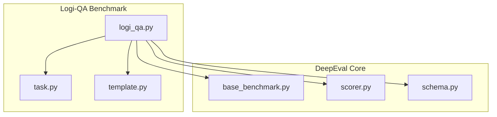
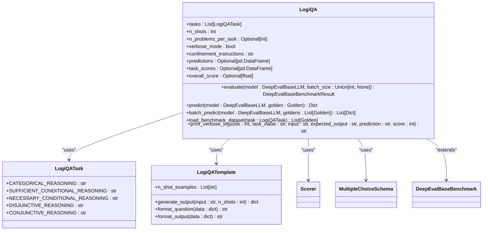
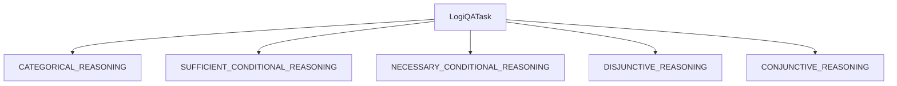
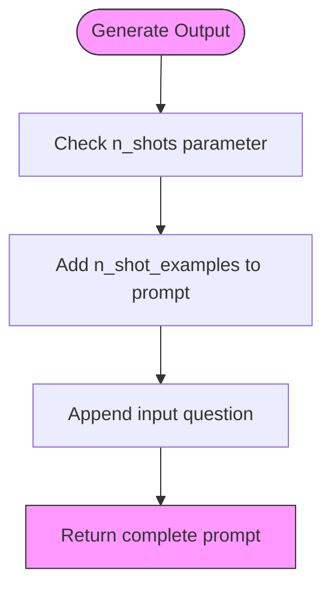
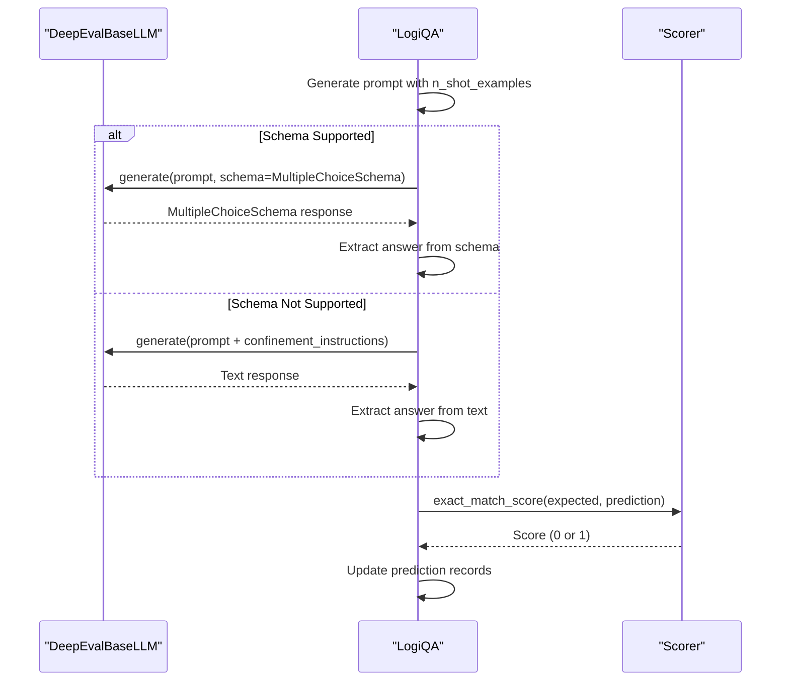
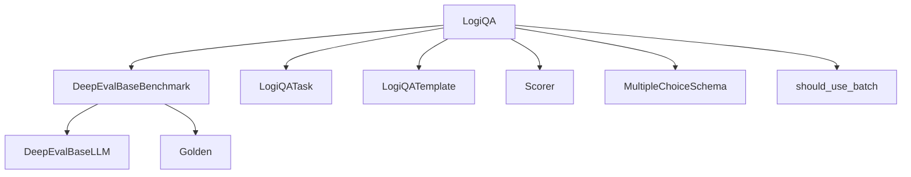

# Logi-QA Benchmark

<cite>
**Referenced Files in This Document**   
- [logi_qa.py](file://deepeval/benchmarks/logi_qa/logi_qa.py)
- [task.py](file://deepeval/benchmarks/logi_qa/task.py)
- [template.py](file://deepeval/benchmarks/logi_qa/template.py)
- [schema.py](file://deepeval/benchmarks/schema.py)
- [scorer.py](file://deepeval/scorer/scorer.py)
- [base_benchmark.py](file://deepeval/benchmarks/base_benchmark.py)
- [benchmarks-logi-qa.mdx](file://docs/docs/benchmarks-logi-qa.mdx)
</cite>

## Table of Contents
1. [Introduction](#introduction)
2. [Project Structure](#project-structure)
3. [Core Components](#core-components)
4. [Architecture Overview](#architecture-overview)
5. [Detailed Component Analysis](#detailed-component-analysis)
6. [Dependency Analysis](#dependency-analysis)
7. [Performance Considerations](#performance-considerations)
8. [Troubleshooting Guide](#troubleshooting-guide)
9. [Conclusion](#conclusion)

## Introduction
The Logi-QA benchmark in DeepEval is designed to assess logical reasoning abilities through multiple-choice questions derived from standardized logic tests. The benchmark evaluates models on various types of deductive reasoning, including categorical, conditional, disjunctive, and conjunctive reasoning. It is based on logical comprehension questions from China's National Civil Servants Examination, which are specifically designed to evaluate critical thinking and problem-solving skills.

The benchmark consists of 8,678 multiple-choice questions, each paired with a reading passage. The evaluation focuses on the model's ability to perform structured reasoning beyond general knowledge, making it particularly valuable for assessing logical consistency, syllogisms, and deductive reasoning capabilities. The scoring is based on exact matching, where the model must produce the precise correct multiple-choice answer (e.g., 'A' or 'C') to be considered correct.

**Section sources**
- [benchmarks-logi-qa.mdx](file://docs/docs/benchmarks-logi-qa.mdx#L11-L15)

## Project Structure
The Logi-QA benchmark is organized within the DeepEval framework as a specialized module under the benchmarks directory. The implementation follows a modular structure with distinct components for task definition, prompt templating, and evaluation logic. The core files are located in the `deepeval/benchmarks/logi_qa/` directory, which contains three primary files: `logi_qa.py` (main benchmark implementation), `task.py` (task enumeration), and `template.py` (prompt templating).

The benchmark integrates with the broader DeepEval architecture through inheritance from the `DeepEvalBaseBenchmark` class and utilizes shared components such as the scorer and schema validation systems. This structure enables consistent evaluation across different benchmark types while allowing for specialized logic specific to logical reasoning assessment.

**Diagram sources**
- [logi_qa.py](file://deepeval/benchmarks/logi_qa/logi_qa.py#L19-L33)
- [task.py](file://deepeval/benchmarks/logi_qa/task.py#L4-L9)
- [template.py](file://deepeval/benchmarks/logi_qa/template.py#L1-L11)
- [base_benchmark.py](file://deepeval/benchmarks/base_benchmark.py#L16-L32)

**Section sources**
- [logi_qa.py](file://deepeval/benchmarks/logi_qa/logi_qa.py#L1-L33)
- [task.py](file://deepeval/benchmarks/logi_qa/task.py#L1-L10)
- [template.py](file://deepeval/benchmarks/logi_qa/template.py#L1-L43)

## Core Components
The Logi-QA benchmark comprises several core components that work together to evaluate logical reasoning capabilities. The main class `LogiQA` inherits from `DeepEvalBaseBenchmark` and implements specialized evaluation logic for logical reasoning tasks. The benchmark supports configurable parameters including task selection and few-shot prompting (with a maximum of 5 shots).

The evaluation process involves loading benchmark datasets, generating prompts with appropriate few-shot examples, executing model predictions, and calculating scores based on exact match criteria. The system maintains detailed records of predictions, task-specific scores, and overall performance metrics, which are accessible through the benchmark object after evaluation.

**Section sources**
- [logi_qa.py](file://deepeval/benchmarks/logi_qa/logi_qa.py#L19-L163)
- [scorer.py](file://deepeval/scorer/scorer.py#L109-L111)

## Architecture Overview
The Logi-QA benchmark architecture follows a clean separation of concerns, with distinct components handling task definition, prompt generation, model evaluation, and score calculation. The system is designed to be extensible while maintaining consistency with the broader DeepEval framework.

**Diagram sources**
- [logi_qa.py](file://deepeval/benchmarks/logi_qa/logi_qa.py#L19-L33)
- [task.py](file://deepeval/benchmarks/logi_qa/task.py#L4-L9)
- [template.py](file://deepeval/benchmarks/logi_qa/template.py#L1-L11)
- [scorer.py](file://deepeval/scorer/scorer.py#L11-L475)
- [schema.py](file://deepeval/benchmarks/schema.py#L5-L6)

## Detailed Component Analysis

### Task Categorization
The Logi-QA benchmark categorizes logical reasoning tasks into five distinct types, each focusing on a specific aspect of deductive reasoning. These categories enable targeted evaluation of different logical reasoning capabilities and provide insights into model performance across various reasoning domains.

**Diagram sources**
- [task.py](file://deepeval/benchmarks/logi_qa/task.py#L4-L9)

**Section sources**
- [task.py](file://deepeval/benchmarks/logi_qa/task.py#L1-L10)

### Prompt Templating for Logical Scenarios
The prompt templating system in Logi-QA is designed to facilitate few-shot learning by providing examples of logical reasoning problems. The template includes five pre-defined examples that demonstrate different types of logical reasoning scenarios, which are used to guide the model's response format and reasoning approach.

**Diagram sources**
- [template.py](file://deepeval/benchmarks/logi_qa/template.py#L11-L17)

**Section sources**
- [template.py](file://deepeval/benchmarks/logi_qa/template.py#L1-L43)

### Evaluation Logic for Answer Selection
The evaluation logic in Logi-QA follows a systematic process to assess model performance on logical reasoning tasks. The system first attempts to use schema-based generation to enforce the correct output format, falling back to standard generation with explicit instructions if schema enforcement is not supported by the model.

**Diagram sources**
- [logi_qa.py](file://deepeval/benchmarks/logi_qa/logi_qa.py#L167-L192)
- [scorer.py](file://deepeval/scorer/scorer.py#L109-L111)

**Section sources**
- [logi_qa.py](file://deepeval/benchmarks/logi_qa/logi_qa.py#L167-L234)
- [scorer.py](file://deepeval/scorer/scorer.py#L109-L111)

## Dependency Analysis
The Logi-QA benchmark has well-defined dependencies on core DeepEval components, ensuring consistency across different benchmark types while allowing for specialized functionality. The primary dependencies include the base benchmark class, scoring utilities, and schema validation systems.

**Diagram sources**
- [logi_qa.py](file://deepeval/benchmarks/logi_qa/logi_qa.py#L7-L15)
- [base_benchmark.py](file://deepeval/benchmarks/base_benchmark.py#L1-L33)

**Section sources**
- [logi_qa.py](file://deepeval/benchmarks/logi_qa/logi_qa.py#L1-L33)
- [base_benchmark.py](file://deepeval/benchmarks/base_benchmark.py#L1-L33)

## Performance Considerations
The Logi-QA benchmark includes performance optimizations such as batch processing support for models that implement the `batch_generate` method. The system automatically detects whether batch processing is available and uses it when appropriate to improve evaluation efficiency.

The benchmark also includes verbose logging capabilities that can be enabled for detailed analysis of individual predictions, though this may impact performance due to increased output operations. The system is designed to handle large datasets efficiently by processing tasks sequentially and maintaining results in memory for subsequent analysis.

**Section sources**
- [logi_qa.py](file://deepeval/benchmarks/logi_qa/logi_qa.py#L51-L163)
- [utils.py](file://deepeval/benchmarks/utils.py#L6-L13)

## Troubleshooting Guide
When configuring and running the Logi-QA benchmark, several common issues may arise. The most frequent challenges include handling models that don't support schema-based generation, managing few-shot examples, and interpreting evaluation results.

For models that don't support schema enforcement, the system automatically falls back to using explicit confinement instructions to guide the output format. Users should ensure that their models can handle the instruction "Output 'A', 'B', 'C', or 'D'. Full answer not needed." to maintain consistent evaluation results.

When selecting tasks, users should be aware that the default configuration evaluates all five reasoning types, but specific tasks can be targeted by providing a list of `LogiQATask` enums. The number of few-shot examples is limited to 5, as specified in the benchmark design.

**Section sources**
- [logi_qa.py](file://deepeval/benchmarks/logi_qa/logi_qa.py#L32-L36)
- [logi_qa.py](file://deepeval/benchmarks/logi_qa/logi_qa.py#L44-L49)

## Conclusion
The Logi-QA benchmark provides a comprehensive framework for evaluating logical reasoning capabilities in language models. By focusing on multiple-choice questions derived from standardized logic tests, it offers a structured approach to assessing deductive reasoning, syllogisms, and logical consistency.

The benchmark's modular design, with separate components for task categorization, prompt templating, and evaluation logic, enables flexible configuration and targeted assessment of specific reasoning abilities. The use of exact match scoring ensures objective evaluation, while the support for few-shot learning helps guide models toward the correct response format.

This benchmark is particularly valuable for measuring structured reasoning capabilities beyond general knowledge, making it an essential tool for developers and researchers working on logical reasoning applications. The integration with the broader DeepEval framework ensures consistency with other evaluation methodologies while providing specialized functionality for logical reasoning assessment.