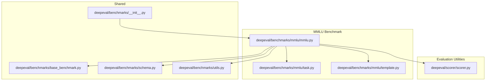
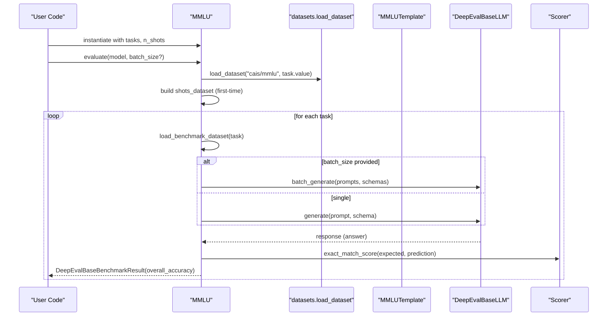
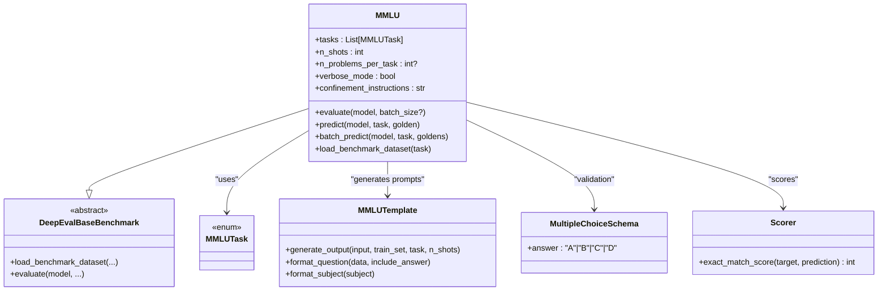
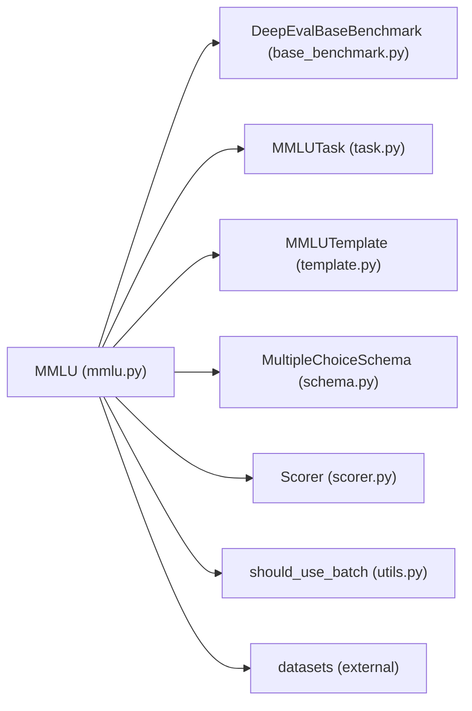

# MMLU Benchmark

<cite>
**Referenced Files in This Document**
- [mmlu.py](file://deepeval/benchmarks/mmlu/mmlu.py)
- [task.py](file://deepeval/benchmarks/mmlu/task.py)
- [template.py](file://deepeval/benchmarks/mmlu/template.py)
- [base_benchmark.py](file://deepeval/benchmarks/base_benchmark.py)
- [schema.py](file://deepeval/benchmarks/schema.py)
- [utils.py](file://deepeval/benchmarks/utils.py)
- [benchmarks/__init__.py](file://deepeval/benchmarks/__init__.py)
- [benchmarks-MMLU.mdx](file://docs/docs/benchmarks-MMLU.mdx)
- [scorer.py](file://deepeval/scorer/scorer.py)
</cite>

## Table of Contents
1. [Introduction](#introduction)
2. [Project Structure](#project-structure)
3. [Core Components](#core-components)
4. [Architecture Overview](#architecture-overview)
5. [Detailed Component Analysis](#detailed-component-analysis)
6. [Dependency Analysis](#dependency-analysis)
7. [Performance Considerations](#performance-considerations)
8. [Troubleshooting Guide](#troubleshooting-guide)
9. [Conclusion](#conclusion)
10. [Appendices](#appendices)

## Introduction
The MMLU (Massive Multitask Language Understanding) benchmark evaluates language models across 57 diverse subjects spanning STEM, humanities, and social sciences. In DeepEval, the MMLU benchmark is implemented as a specialized benchmark that loads the official MMLU dataset, constructs few-shot prompts using a template, and evaluates model performance via exact match scoring. The benchmark inherits from a common base class and integrates with DeepEval’s model abstraction and dataset utilities.

Key goals:
- Provide a standardized evaluation pipeline for MMLU within DeepEval.
- Support configurable few-shot prompting and batched inference.
- Report per-task and overall accuracy with detailed predictions.

## Project Structure
The MMLU benchmark resides under the benchmarks module and consists of:
- A benchmark class that orchestrates evaluation.
- An enumeration of tasks (subjects).
- A prompt template generator.
- Shared benchmark base class and schema for structured outputs.
- Utility for batch inference decisions.

**Diagram sources**
- [mmlu.py](file://deepeval/benchmarks/mmlu/mmlu.py#L1-L316)
- [task.py](file://deepeval/benchmarks/mmlu/task.py#L1-L62)
- [template.py](file://deepeval/benchmarks/mmlu/template.py#L1-L40)
- [base_benchmark.py](file://deepeval/benchmarks/base_benchmark.py#L1-L33)
- [schema.py](file://deepeval/benchmarks/schema.py#L1-L172)
- [utils.py](file://deepeval/benchmarks/utils.py#L1-L14)
- [benchmarks/__init__.py](file://deepeval/benchmarks/__init__.py#L1-L38)
- [scorer.py](file://deepeval/scorer/scorer.py#L1-L120)

**Section sources**
- [mmlu.py](file://deepeval/benchmarks/mmlu/mmlu.py#L1-L316)
- [task.py](file://deepeval/benchmarks/mmlu/task.py#L1-L62)
- [template.py](file://deepeval/benchmarks/mmlu/template.py#L1-L40)
- [base_benchmark.py](file://deepeval/benchmarks/base_benchmark.py#L1-L33)
- [schema.py](file://deepeval/benchmarks/schema.py#L1-L172)
- [utils.py](file://deepeval/benchmarks/utils.py#L1-L14)
- [benchmarks/__init__.py](file://deepeval/benchmarks/__init__.py#L1-L38)

## Core Components
- MMLU class: Implements the evaluation loop, prompt construction, model generation, and scoring.
- MMLUTask enum: Defines the 57 subjects used by the benchmark.
- MMLUTemplate: Generates few-shot prompts and formats questions.
- Base benchmark: Provides the abstract interface and shared result type.
- Schema: Defines the expected output structure for model generation.
- Utils: Determines whether to use batch inference.
- Scorer: Provides exact match scoring used by MMLU.

Key responsibilities:
- MMLU.__init__: Validates few-shot configuration, initializes scoring, and sets confinement instructions.
- MMLU.evaluate: Iterates tasks, loads dataset, builds prompts, runs inference, aggregates results, and returns a benchmark result.
- MMLU.predict/batch_predict: Constructs prompts via template, calls model.generate or model.batch_generate, extracts predictions, and scores them.
- MMLU.load_benchmark_dataset: Loads the MMLU dataset from the datasets library, prepares shots, and constructs Golden instances for testing.

**Section sources**
- [mmlu.py](file://deepeval/benchmarks/mmlu/mmlu.py#L17-L316)
- [task.py](file://deepeval/benchmarks/mmlu/task.py#L1-L62)
- [template.py](file://deepeval/benchmarks/mmlu/template.py#L1-L40)
- [base_benchmark.py](file://deepeval/benchmarks/base_benchmark.py#L1-L33)
- [schema.py](file://deepeval/benchmarks/schema.py#L1-L12)
- [utils.py](file://deepeval/benchmarks/utils.py#L1-L14)
- [scorer.py](file://deepeval/scorer/scorer.py#L98-L112)

## Architecture Overview
The MMLU benchmark follows a modular architecture:
- Inheritance: MMLU inherits from DeepEvalBaseBenchmark, ensuring a consistent interface for benchmarking.
- Data loading: Uses the datasets library to fetch MMLU splits and convert them into Golden objects.
- Prompting: Uses MMLUTemplate to build few-shot prompts with subject-specific formatting.
- Generation: Calls model.generate or model.batch_generate with a schema to constrain outputs.
- Scoring: Uses Scorer.exact_match_score to compute correctness.
- Results: Aggregates per-task and overall accuracy and stores detailed predictions.

**Diagram sources**
- [mmlu.py](file://deepeval/benchmarks/mmlu/mmlu.py#L48-L165)
- [template.py](file://deepeval/benchmarks/mmlu/template.py#L10-L31)
- [schema.py](file://deepeval/benchmarks/schema.py#L1-L12)
- [utils.py](file://deepeval/benchmarks/utils.py#L1-L14)
- [scorer.py](file://deepeval/scorer/scorer.py#L98-L112)

## Detailed Component Analysis

### MMLU Class
The MMLU class encapsulates the end-to-end evaluation process:
- Initialization validates n_shots and sets confinement instructions.
- evaluate orchestrates dataset loading, batching, inference, scoring, and result aggregation.
- predict and batch_predict construct prompts, call the model, and compute exact match scores.
- load_benchmark_dataset downloads the MMLU dataset, caches shots, and creates Golden objects for testing.

**Diagram sources**
- [mmlu.py](file://deepeval/benchmarks/mmlu/mmlu.py#L17-L316)
- [task.py](file://deepeval/benchmarks/mmlu/task.py#L1-L62)
- [template.py](file://deepeval/benchmarks/mmlu/template.py#L1-L40)
- [schema.py](file://deepeval/benchmarks/schema.py#L1-L12)
- [base_benchmark.py](file://deepeval/benchmarks/base_benchmark.py#L16-L33)
- [scorer.py](file://deepeval/scorer/scorer.py#L98-L112)

**Section sources**
- [mmlu.py](file://deepeval/benchmarks/mmlu/mmlu.py#L17-L316)
- [base_benchmark.py](file://deepeval/benchmarks/base_benchmark.py#L16-L33)

### Prompt Template and Question Formatting
MMLUTemplate builds few-shot prompts by:
- Prefixing with a subject-aware instruction.
- Repeating n_shots examples from the training/dev split.
- Appending the test question with choices and answer marker.

Question formatting ensures consistent structure across subjects, including choices and answer inclusion when constructing training examples.

**Section sources**
- [template.py](file://deepeval/benchmarks/mmlu/template.py#L10-L31)

### Task Enumeration
MMLUTask enumerates all 57 subjects used by the benchmark. Users can select a subset of tasks or rely on the default full set.

**Section sources**
- [task.py](file://deepeval/benchmarks/mmlu/task.py#L1-L62)

### Scoring and Validation
- MultipleChoiceSchema constrains model outputs to single-letter answers.
- Scorer.exact_match_score enforces strict equality between expected and predicted answers.
- The benchmark records per-instance predictions and correctness for later inspection.

**Section sources**
- [schema.py](file://deepeval/benchmarks/schema.py#L1-L12)
- [scorer.py](file://deepeval/scorer/scorer.py#L98-L112)
- [mmlu.py](file://deepeval/benchmarks/mmlu/mmlu.py#L166-L203)

### Example Usage
The documentation demonstrates how to instantiate MMLU with specific tasks and few-shot settings, then evaluate a model and inspect the overall score.

- Instantiate MMLU with selected tasks and n_shots.
- Call evaluate with a model.
- Access overall_score for the aggregated accuracy.

For concrete instantiation and evaluation examples, refer to the documentation page.

**Section sources**
- [benchmarks-MMLU.mdx](file://docs/docs/benchmarks-MMLU.mdx#L26-L48)

## Dependency Analysis
- MMLU depends on:
  - DeepEvalBaseBenchmark for the abstract interface.
  - MMLUTask and MMLUTemplate for task selection and prompt construction.
  - MultipleChoiceSchema for constrained generation.
  - Scorer for exact match scoring.
  - should_use_batch for batch inference decisions.
  - datasets library for downloading MMLU splits.

**Diagram sources**
- [mmlu.py](file://deepeval/benchmarks/mmlu/mmlu.py#L1-L35)
- [base_benchmark.py](file://deepeval/benchmarks/base_benchmark.py#L16-L33)
- [task.py](file://deepeval/benchmarks/mmlu/task.py#L1-L62)
- [template.py](file://deepeval/benchmarks/mmlu/template.py#L1-L40)
- [schema.py](file://deepeval/benchmarks/schema.py#L1-L12)
- [utils.py](file://deepeval/benchmarks/utils.py#L1-L14)
- [scorer.py](file://deepeval/scorer/scorer.py#L98-L112)

**Section sources**
- [mmlu.py](file://deepeval/benchmarks/mmlu/mmlu.py#L1-L35)
- [benchmarks/__init__.py](file://deepeval/benchmarks/__init__.py#L1-L38)

## Performance Considerations
- Few-shot prompting: The benchmark supports up to five shots. Increasing shots can improve output formatting and accuracy but increases prompt length and cost.
- Batch inference: Use batch_size to enable batched generation when the model supports batch_generate. The utility function determines eligibility based on the presence of the method.
- Dataset caching: The first-time loading caches the dev set as shots to avoid repeated network calls.
- Verbosity: verbose_mode prints detailed logs per problem; disable for production runs to reduce overhead.

Practical tips:
- Prefer batch_size when supported by the model to maximize throughput.
- Limit n_problems_per_task for quick iterations during development.
- Use confinement instructions to enforce single-letter answers when models return free-form text.

**Section sources**
- [mmlu.py](file://deepeval/benchmarks/mmlu/mmlu.py#L29-L31)
- [mmlu.py](file://deepeval/benchmarks/mmlu/mmlu.py#L62-L63)
- [mmlu.py](file://deepeval/benchmarks/mmlu/mmlu.py#L256-L283)
- [utils.py](file://deepeval/benchmarks/utils.py#L1-L14)

## Troubleshooting Guide
Common issues and resolutions:
- Model compatibility:
  - If model.generate does not support schema, the benchmark appends confinement instructions and falls back to plain generation.
  - If model.batch_generate is missing or returns a different number of responses, the benchmark raises a ValueError.
- Few-shot limits:
  - n_shots must not exceed five; assertions will fail otherwise.
- Output formatting:
  - Confinement instructions enforce single-letter answers to align with expected scoring.
- Dataset availability:
  - Ensure the datasets library is installed and accessible; MMLU relies on cais/mmlu.

Interpretation:
- overall_score is the proportion of correct answers among all evaluated problems.
- Per-task accuracy helps identify strengths and weaknesses across domains.

**Section sources**
- [mmlu.py](file://deepeval/benchmarks/mmlu/mmlu.py#L29-L31)
- [mmlu.py](file://deepeval/benchmarks/mmlu/mmlu.py#L180-L203)
- [mmlu.py](file://deepeval/benchmarks/mmlu/mmlu.py#L223-L242)
- [mmlu.py](file://deepeval/benchmarks/mmlu/mmlu.py#L131-L143)
- [benchmarks-MMLU.mdx](file://docs/docs/benchmarks-MMLU.mdx#L45-L48)

## Conclusion
The MMLU benchmark in DeepEval provides a robust, extensible framework for evaluating language models across 57 subjects. Its design emphasizes:
- Clear separation of concerns: dataset loading, prompt construction, generation, and scoring.
- Flexibility: configurable tasks, few-shot examples, and batch inference.
- Reliability: schema-constrained generation and exact match scoring.

By leveraging this benchmark, users can systematically compare models across disciplines and interpret results with confidence.

## Appendices

### How to Run MMLU with Different Configurations
- Select tasks: Pass a list of MMLUTask values to restrict evaluation to specific subjects.
- Adjust few-shot examples: Set n_shots to a value between 0 and 5.
- Enable batching: Provide batch_size to leverage batch_generate when available.
- Inspect results: Use overall_score for aggregate accuracy and review detailed predictions stored by the benchmark.

Refer to the documentation for usage examples and task lists.

**Section sources**
- [benchmarks-MMLU.mdx](file://docs/docs/benchmarks-MMLU.mdx#L26-L48)
- [task.py](file://deepeval/benchmarks/mmlu/task.py#L1-L62)