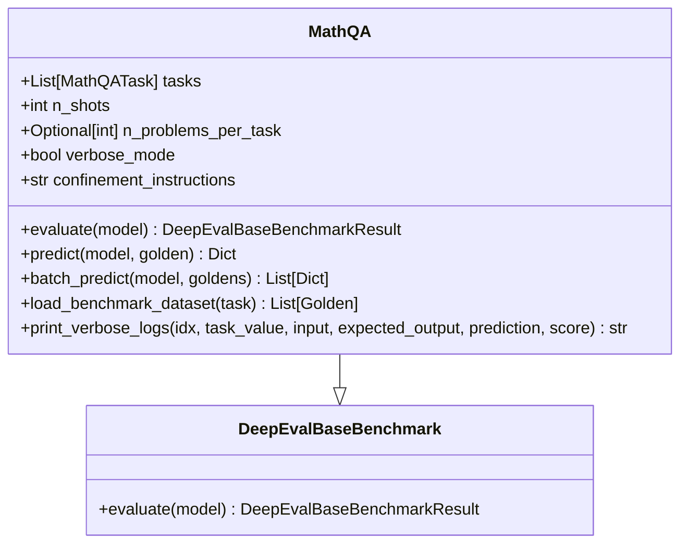
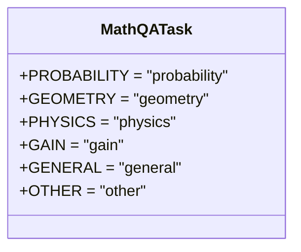
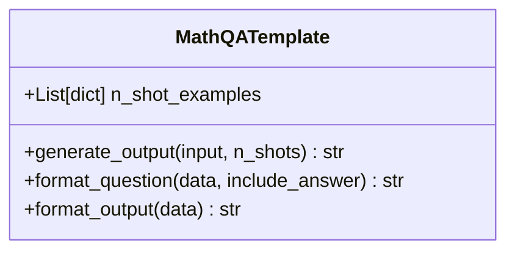
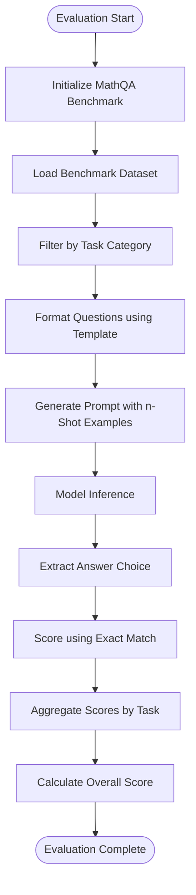
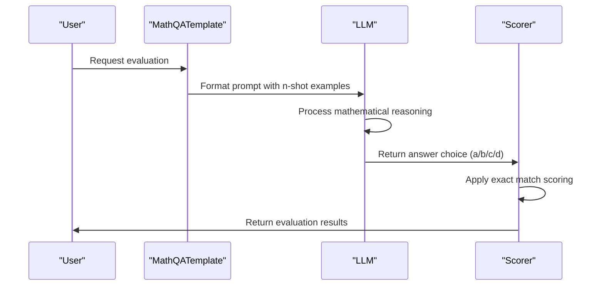
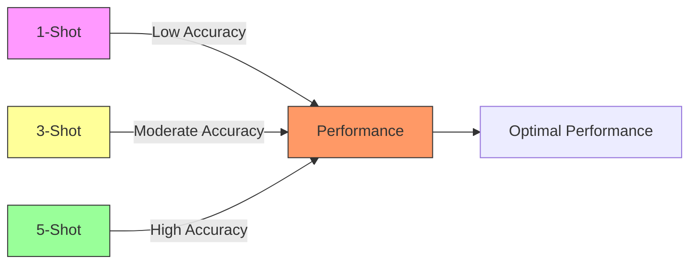

# Math-QA Benchmark

<cite>
**Referenced Files in This Document**   
- [math_qa.py](file://deepeval/benchmarks/math_qa/math_qa.py)
- [task.py](file://deepeval/benchmarks/math_qa/task.py)
- [template.py](file://deepeval/benchmarks/math_qa/template.py)
- [benchmarks-math-qa.mdx](file://docs/docs/benchmarks-math-qa.mdx)
</cite>

## Table of Contents
1. [Introduction](#introduction)
2. [Core Components](#core-components)
3. [Architecture Overview](#architecture-overview)
4. [Detailed Component Analysis](#detailed-component-analysis)
5. [Evaluation Methodology](#evaluation-methodology)
6. [Practical Usage Examples](#practical-usage-examples)
7. [Common Challenges and Solutions](#common-challenges-and-solutions)
8. [Performance Optimization](#performance-optimization)
9. [Conclusion](#conclusion)

## Introduction

The Math-QA benchmark is a comprehensive evaluation framework designed to assess the mathematical problem-solving capabilities of large language models through multiple-choice questions spanning various mathematical domains. Built upon the AQuA dataset containing over 100,000 GRE- and GMAT-level math word problems, Math-QA provides a rigorous test of multi-step mathematical reasoning abilities. The benchmark evaluates models across diverse categories including probability, geometry, physics, gain calculations, and general mathematics, offering a holistic assessment of quantitative reasoning skills.

**Section sources**
- [benchmarks-math-qa.mdx](file://docs/docs/benchmarks-math-qa.mdx#L11-L15)

## Core Components

The Math-QA benchmark consists of three primary components that work together to evaluate mathematical reasoning: the main benchmark class, task enumeration, and template system. These components enable structured evaluation of mathematical problem-solving across various domains with consistent formatting and assessment methodology.

**Section sources**
- [math_qa.py](file://deepeval/benchmarks/math_qa/math_qa.py#L17-L272)
- [task.py](file://deepeval/benchmarks/math_qa/task.py#L1-L10)
- [template.py](file://deepeval/benchmarks/math_qa/template.py#L1-L65)

## Architecture Overview

```mermaid
graph TB
subgraph "Math-QA Components"
MathQA[MathQA Class]
Task[MathQATask Enum]
Template[MathQATemplate]
end
subgraph "External Dependencies"
Dataset[Dataset Loader]
Scorer[Scorer]
Model[DeepEvalBaseLLM]
end
MathQA --> Task
MathQA --> Template
MathQA --> Dataset
MathQA --> Scorer
MathQA --> Model
Template --> Dataset
MathQA --> Evaluation[MathQA.evaluate()]
Evaluation --> Predict[MathQA.predict()]
Predict --> Template
Predict --> Model
Predict --> Scorer
```

**Diagram sources**
- [math_qa.py](file://deepeval/benchmarks/math_qa/math_qa.py#L17-L272)
- [task.py](file://deepeval/benchmarks/math_qa/task.py#L1-L10)
- [template.py](file://deepeval/benchmarks/math_qa/template.py#L1-L65)

## Detailed Component Analysis

### MathQA Class Analysis

The MathQA class serves as the primary interface for evaluating mathematical reasoning capabilities. It inherits from DeepEvalBaseBenchmark and implements specialized functionality for mathematical problem assessment.



**Diagram sources**
- [math_qa.py](file://deepeval/benchmarks/math_qa/math_qa.py#L17-L272)

**Section sources**
- [math_qa.py](file://deepeval/benchmarks/math_qa/math_qa.py#L17-L272)

### MathQATask Enum Analysis

The MathQATask enumeration defines the various mathematical domains covered by the benchmark, allowing for targeted evaluation of specific mathematical competencies.



**Diagram sources**
- [task.py](file://deepeval/benchmarks/math_qa/task.py#L4-L10)

**Section sources**
- [task.py](file://deepeval/benchmarks/math_qa/task.py#L1-L10)

### MathQATemplate Analysis

The MathQATemplate class handles the formatting and presentation of mathematical problems, ensuring consistent input formatting and answer extraction across all evaluations.



**Diagram sources**
- [template.py](file://deepeval/benchmarks/math_qa/template.py#L1-L65)

**Section sources**
- [template.py](file://deepeval/benchmarks/math_qa/template.py#L1-L65)

## Evaluation Methodology

The Math-QA benchmark employs a systematic evaluation methodology that combines few-shot learning with exact match scoring to assess mathematical reasoning capabilities. The evaluation process follows a structured workflow from dataset loading to score calculation.



**Diagram sources**
- [math_qa.py](file://deepeval/benchmarks/math_qa/math_qa.py#L49-L163)
- [template.py](file://deepeval/benchmarks/math_qa/template.py#L51-L65)

**Section sources**
- [math_qa.py](file://deepeval/benchmarks/math_qa/math_qa.py#L49-L163)

## Practical Usage Examples

### Basic Usage Example

The following example demonstrates how to evaluate a custom model on specific mathematical domains using the Math-QA benchmark:

```python
from deepeval.benchmarks import MathQA
from deepeval.benchmarks.tasks import MathQATask

# Define benchmark with specific tasks and shots
benchmark = MathQA(
    tasks=[MathQATask.PROBABILITY, MathQATask.GEOMETRY],
    n_shots=3
)

# Evaluate model
benchmark.evaluate(model=mistral_7b)
print(benchmark.overall_score)
```

**Section sources**
- [benchmarks-math-qa.mdx](file://docs/docs/benchmarks-math-qa.mdx#L29-L40)

### Advanced Configuration

The Math-QA benchmark supports various configuration options for specialized evaluation scenarios:

```python
# Custom configuration with verbose output
benchmark = MathQA(
    tasks=[MathQATask.PHYSICS],
    n_shots=5,
    verbose_mode=True,
    confinement_instructions="Respond with only the letter of the correct answer."
)

# Limit problems per task for faster evaluation
benchmark = MathQA(
    tasks=[MathQATask.GAIN],
    n_shots=3,
    n_problems_per_task=50
)
```

**Section sources**
- [math_qa.py](file://deepeval/benchmarks/math_qa/math_qa.py#L18-L48)

## Common Challenges and Solutions

### Mathematical Notation Interpretation

One common challenge is the misinterpretation of mathematical notation, particularly in complex expressions. The benchmark addresses this through standardized formatting in the template system.

### Order of Operations Errors

Models may struggle with proper order of operations in multi-step calculations. The few-shot examples in the template help reinforce correct computational sequencing.

### Word Problem Comprehension

Mathematical word problems require both linguistic understanding and mathematical reasoning. The benchmark's diverse problem set tests this dual capability.

### Answer Format Consistency

To ensure consistent evaluation, the benchmark enforces strict answer formatting:



**Diagram sources**
- [math_qa.py](file://deepeval/benchmarks/math_qa/math_qa.py#L167-L189)
- [template.py](file://deepeval/benchmarks/math_qa/template.py#L51-L65)

**Section sources**
- [math_qa.py](file://deepeval/benchmarks/math_qa/math_qa.py#L165-L194)

## Performance Optimization

### Few-Shot Learning Impact

The number of few-shot examples significantly impacts performance:



**Section sources**
- [benchmarks-math-qa.mdx](file://docs/docs/benchmarks-math-qa.mdx#L43-L47)

### Prompt Engineering Best Practices

Effective prompt engineering can significantly improve model performance on mathematical problems:

1. **Clear Instructions**: Specify exact answer format requirements
2. **Relevant Examples**: Include diverse problem types in few-shot examples
3. **Step-by-Step Reasoning**: Encourage models to show their work
4. **Domain-Specific Prompts**: Tailor prompts to specific mathematical domains

**Section sources**
- [math_qa.py](file://deepeval/benchmarks/math_qa/math_qa.py#L42-L47)

## Conclusion

The Math-QA benchmark provides a comprehensive framework for evaluating mathematical reasoning capabilities in large language models. By combining a diverse set of mathematical problems across multiple domains with a structured evaluation methodology, it offers valuable insights into model performance on quantitative reasoning tasks. The integration with DeepEval's template system ensures consistent prompt formatting and reliable evaluation results. Through careful configuration of tasks and few-shot examples, researchers and developers can effectively assess and improve their models' mathematical problem-solving abilities.