# SQuAD Benchmark

<cite>
**Referenced Files in This Document**   
- [squad.py](file://deepeval/benchmarks/squad/squad.py)
- [task.py](file://deepeval/benchmarks/squad/task.py)
- [template.py](file://deepeval/benchmarks/squad/template.py)
- [base_benchmark.py](file://deepeval/benchmarks/base_benchmark.py)
- [DEEPEVAL_SCORER_GUIDE.md](file://ai_docs/DEEPEVAL_SCORER_GUIDE.md)
</cite>

## Table of Contents
1. [Introduction](#introduction)
2. [SQuAD Benchmark Overview](#squad-benchmark-overview)
3. [Implementation Details](#implementation-details)
4. [Data Loading and Processing](#data-loading-and-processing)
5. [Context-Question Formatting](#context-question-formatting)
6. [Evaluation Metrics](#evaluation-metrics)
7. [Usage Examples](#usage-examples)
8. [Result Interpretation](#result-interpretation)
9. [Reading Comprehension Evaluation](#reading-comprehension-evaluation)
10. [Common Challenges](#common-challenges)
11. [Best Practices](#best-practices)
12. [Conclusion](#conclusion)

## Introduction
The SQuAD (Stanford Question Answering Dataset) benchmark in DeepEval provides a comprehensive framework for evaluating extractive question answering systems. This document details the implementation and usage of the SQuAD benchmark within the DeepEval framework, focusing on its role in assessing models' ability to identify answer spans within provided passages. The benchmark is designed to measure reading comprehension and information retrieval capabilities through standardized evaluation protocols.

**Section sources**
- [DEEPEVAL_SCORER_GUIDE.md](file://ai_docs/DEEPEVAL_SCORER_GUIDE.md#L702-L709)

## SQuAD Benchmark Overview
The SQuAD benchmark in DeepEval implements a structured evaluation framework for extractive QA systems based on the Stanford Question Answering Dataset. It inherits from the DeepEvalBaseBenchmark class and provides specialized functionality for evaluating models on reading comprehension tasks where answers are spans of text within provided contexts. The benchmark supports few-shot evaluation with a maximum of 5 shots, aligning with standard practices in the field.

The implementation follows a modular design with separate components for tasks, templates, and scoring mechanisms. It evaluates model performance by comparing predicted answer spans against ground truth annotations, using established metrics like F1 score and exact match to quantify accuracy. The benchmark is particularly valuable for assessing a model's ability to understand natural language passages and precisely locate relevant information.


**Diagram sources**
- [squad.py](file://deepeval/benchmarks/squad/squad.py#L16-L135)
- [task.py](file://deepeval/benchmarks/squad/task.py)
- [template.py](file://deepeval/benchmarks/squad/template.py)

**Section sources**
- [squad.py](file://deepeval/benchmarks/squad/squad.py#L16-L30)

## Implementation Details
The SQuAD benchmark implementation in DeepEval follows an object-oriented design pattern with clear separation of concerns. The core class, SQuAD, extends DeepEvalBaseBenchmark and implements the specific evaluation logic for the SQuAD dataset. The implementation includes validation checks, such as ensuring n_shots does not exceed 5, which aligns with standard few-shot learning constraints.

The evaluation process involves generating prompts using the SQuADTemplate, executing the model on these prompts, and then scoring the results using the squad_score method from the scorer. The benchmark supports multiple SQuAD tasks through the SQuADTask enumeration, allowing for comprehensive evaluation across different aspects of question answering. The implementation leverages Python's type hints and assertion mechanisms to ensure code correctness and maintainability.

```mermaid
sequenceDiagram
participant User
participant SQuAD as SQuAD Benchmark
participant Template as SQuADTemplate
participant Scorer as Scorer
participant Model as LLM Model
User->>SQuAD : Initialize with n_shots
SQuAD->>SQuAD : Validate n_shots ≤ 5
User->>SQuAD : Call evaluate()
SQuAD->>Template : generate_output() for each task
Template-->>SQuAD : Formatted prompt
SQuAD->>Model : Execute prompt
Model-->>SQuAD : Prediction
SQuAD->>Scorer : squad_score(input, prediction, expected)
Scorer-->>SQuAD : F1 and Exact Match scores
SQuAD->>User : Return evaluation results
```



**Diagram sources**
- [squad.py](file://deepeval/benchmarks/squad/squad.py#L55-L156)
- [template.py](file://deepeval/benchmarks/squad/template.py)
- [DEEPEVAL_SCORER_GUIDE.md](file://ai_docs/DEEPEVAL_SCORER_GUIDE.md#L528-L566)

**Section sources**
- [squad.py](file://deepeval/benchmarks/squad/squad.py#L16-L156)

## Data Loading and Processing
The SQuAD benchmark handles data loading and processing through its integrated template and task system. While the specific data loading mechanisms are abstracted within the framework, the benchmark is designed to work with the standard SQuAD dataset format, which includes passages (contexts), questions, and answer spans with their corresponding offsets.

The processing pipeline begins with the SQuADTemplate class, which is responsible for formatting the input data into appropriate prompts for the model. This includes combining the context passage with the question in a format that elicits span extraction. The template system ensures consistency in input formatting across different evaluation runs and supports the few-shot learning paradigm by incorporating example demonstrations when n_shots > 0.

During evaluation, the benchmark iterates through the tasks and processes each instance by generating the appropriate prompt, executing the model, and collecting the predictions for scoring. The data processing flow is designed to minimize memory overhead while maintaining the integrity of the evaluation protocol.

**Section sources**
- [squad.py](file://deepeval/benchmarks/squad/squad.py#L135-L156)
- [template.py](file://deepeval/benchmarks/squad/template.py)

## Context-Question Formatting
The context-question formatting in the SQuAD benchmark is implemented through the SQuADTemplate class, which defines the structure of the input prompts presented to the model. The template system is responsible for creating coherent and effective prompts that guide the model to extract answer spans from the provided context.

The formatting strategy follows established patterns in the literature, typically presenting the context passage first, followed by the question, and sometimes including few-shot examples to demonstrate the expected response format. The template ensures that the context and question are clearly delineated, often using separators or formatting cues that help the model understand the task structure.

For few-shot evaluation, the template incorporates demonstration examples that show the model how to respond to similar questions with their corresponding contexts and answers. This in-context learning approach helps the model adapt to the specific format and expectations of the SQuAD task, potentially improving performance on the target instances.

**Section sources**
- [template.py](file://deepeval/benchmarks/squad/template.py)
- [squad.py](file://deepeval/benchmarks/squad/squad.py#L135-L136)

## Evaluation Metrics
The SQuAD benchmark employs two primary evaluation metrics to assess model performance: F1 score and exact match. These metrics are implemented through the squad_score method in the scorer module, which is called during the evaluation process to quantify the accuracy of model predictions.

The F1 score measures the overlap between the predicted answer span and the ground truth answer at the token level, providing a nuanced assessment of partial correctness. It is calculated as the harmonic mean of precision and recall, where precision measures the proportion of predicted tokens that appear in the reference answer, and recall measures the proportion of reference answer tokens that appear in the prediction.

Exact match is a stricter metric that evaluates whether the predicted answer span exactly matches the ground truth answer. This binary metric provides a clear indication of whether the model has perfectly identified the correct answer span, without any token-level discrepancies.

These metrics are complementary, with F1 score providing a more forgiving assessment that accounts for partial correctness, while exact match offers a stringent evaluation of perfect performance. Together, they provide a comprehensive view of a model's extractive QA capabilities.


**Diagram sources**
- [squad.py](file://deepeval/benchmarks/squad/squad.py#L156-L156)
- [DEEPEVAL_SCORER_GUIDE.md](file://ai_docs/DEEPEVAL_SCORER_GUIDE.md#L528-L532)

**Section sources**
- [squad.py](file://deepeval/benchmarks/squad/squad.py#L156-L156)
- [DEEPEVAL_SCORER_GUIDE.md](file://ai_docs/DEEPEVAL_SCORER_GUIDE.md#L528-L566)

## Usage Examples
The SQuAD benchmark can be used in DeepEval with a straightforward API that allows for easy integration into evaluation workflows. The following example demonstrates the basic usage pattern:

```python
from deepeval.benchmarks import SQuAD

# Initialize the SQuAD benchmark with 5-shot evaluation
benchmark = SQuAD(n_shots=5)

# Run the evaluation
benchmark.evaluate()
```

The benchmark can also be configured with specific tasks if a more targeted evaluation is desired:

```python
from deepeval.benchmarks import SQuAD
from deepeval.benchmarks.tasks import SQuADTask

# Initialize with specific tasks
benchmark = SQuAD(
    n_shots=3,
    tasks=[SQuADTask.READING_COMPREHENSION]
)

# Run the evaluation
results = benchmark.evaluate()
```

For custom evaluation models, the scorer can be configured accordingly:

```python
from deepeval.benchmarks import SQuAD
from deepeval.models import DeepEvalBaseLLM

# Custom model configuration
class CustomModel(DeepEvalBaseLLM):
    def __init__(self):
        pass
        
    def generate(self, prompt: str) -> str:
        # Custom generation logic
        pass
        
    def get_model_name(self):
        return "Custom Model"

# Use custom model
custom_model = CustomModel()
benchmark = SQuAD(n_shots=5)
benchmark.model = custom_model
results = benchmark.evaluate()
```

These examples illustrate the flexibility of the SQuAD benchmark implementation, allowing users to customize the evaluation parameters while maintaining a simple and consistent interface.

**Section sources**
- [squad.py](file://deepeval/benchmarks/squad/squad.py)
- [DEEPEVAL_SCORER_GUIDE.md](file://ai_docs/DEEPEVAL_SCORER_GUIDE.md#L706-L709)

## Result Interpretation
Interpreting the results from the SQuAD benchmark involves analyzing both the overall performance metrics and the task-specific accuracy scores. The benchmark provides detailed output that includes the overall SQuAD accuracy as well as individual task accuracies, allowing for granular analysis of model performance.

The primary metrics to consider are the F1 score and exact match rate. The F1 score provides insight into the model's ability to partially identify correct answer spans, while the exact match rate indicates perfect prediction accuracy. A high F1 score with a lower exact match rate suggests that the model often identifies the general vicinity of the correct answer but may have issues with precise span boundaries.

The benchmark also reports task-specific accuracy, which can help identify strengths and weaknesses in different aspects of reading comprehension. For example, if a model performs well on literal comprehension tasks but poorly on inferential questions, this indicates a need for improvement in reasoning capabilities.

When comparing models, it's important to consider both metrics together. A model with a slightly lower F1 score but higher exact match rate might be preferable in applications where precise answers are critical, while a model with a higher F1 score might be better for applications where partial information is still valuable.

The evaluation results can also be used to identify systematic errors, such as consistent difficulties with certain question types or answer formats. This information can guide model improvement efforts and inform decisions about model deployment in specific use cases.

**Section sources**
- [squad.py](file://deepeval/benchmarks/squad/squad.py#L102-L110)

## Reading Comprehension Evaluation
The SQuAD benchmark plays a crucial role in evaluating reading comprehension capabilities by testing a model's ability to understand and extract information from natural language passages. This evaluation goes beyond simple keyword matching, requiring models to demonstrate genuine understanding of text semantics and context.

The benchmark assesses several key aspects of reading comprehension, including literal comprehension (directly stated information), inferential comprehension (information that requires reasoning), and referential comprehension (understanding pronouns and references). By evaluating performance across these dimensions, the SQuAD benchmark provides a comprehensive assessment of a model's language understanding capabilities.

One of the strengths of the SQuAD evaluation is its focus on span extraction, which requires models to not only identify relevant information but also precisely locate it within the text. This tests both the model's comprehension abilities and its ability to align its understanding with the original text structure.

The few-shot evaluation capability further enhances the benchmark's utility by testing how well models can adapt to the task format with limited examples. This simulates real-world scenarios where models may need to perform tasks with minimal instruction or demonstration.

The results from SQuAD evaluation can inform decisions about model suitability for applications that require strong reading comprehension, such as document analysis, customer support systems, and research assistance tools. Models that perform well on SQuAD are likely to have robust language understanding capabilities that can be leveraged in various NLP applications.

**Section sources**
- [squad.py](file://deepeval/benchmarks/squad/squad.py)
- [DEEPEVAL_SCORER_GUIDE.md](file://ai_docs/DEEPEVAL_SCORER_GUIDE.md)

## Common Challenges
Evaluating extractive question answering systems with the SQuAD benchmark presents several common challenges that can affect both the evaluation process and model performance. Understanding these challenges is essential for accurate result interpretation and effective model improvement.

Span boundary detection is a significant challenge, as models often struggle to precisely identify the start and end of answer spans. This can lead to high F1 scores but lower exact match rates, indicating that models can identify relevant content but have difficulty with precise extraction. This challenge is particularly pronounced when answers are at the boundaries of sentences or when multiple plausible spans exist in close proximity.

Handling paraphrased answers presents another challenge, as the SQuAD evaluation is based on exact text matching. When models generate semantically equivalent but lexically different answers, they may be penalized despite providing correct information. This limitation highlights the need to complement SQuAD evaluation with other metrics that can assess semantic equivalence.

Out-of-context predictions are a critical issue in extractive QA, where models generate answers that are not present in the provided context. While SQuAD is designed to prevent this by requiring span extraction, some implementations may still allow hallucinated answers, particularly when models are not properly constrained. This can lead to inflated performance metrics that do not reflect true reading comprehension abilities.

Other challenges include handling ambiguous questions, dealing with multiple valid answers, and managing the impact of context length on performance. These challenges require careful consideration when designing evaluation protocols and interpreting results, as they can significantly affect the reliability and validity of the assessment.

**Section sources**
- [squad.py](file://deepeval/benchmarks/squad/squad.py)
- [DEEPEVAL_SCORER_GUIDE.md](file://ai_docs/DEEPEVAL_SCORER_GUIDE.md)

## Best Practices
To optimize evaluation accuracy and effectively compare model performance using the SQuAD benchmark, several best practices should be followed:

1. **Consistent Evaluation Settings**: Ensure that all models are evaluated under identical conditions, including the same n_shots value, random seed, and evaluation data split. This ensures fair comparisons and reproducible results.

2. **Multiple Evaluation Runs**: Perform multiple evaluation runs with different few-shot examples or data ordering to account for variability in in-context learning effects. This provides a more robust estimate of model performance.

3. **Comprehensive Metric Analysis**: Consider both F1 score and exact match rate when interpreting results, as they provide complementary insights into model performance. Additionally, analyze performance across different task types to identify specific strengths and weaknesses.

4. **Error Analysis**: Conduct thorough error analysis by examining specific instances where models perform poorly. This can reveal systematic issues that are not apparent from aggregate metrics alone.

5. **Context Length Management**: Be mindful of context length limitations when evaluating models, as performance may degrade with longer passages. Consider evaluating on different context length ranges to understand this relationship.

6. **Model Calibration**: Ensure that models are properly calibrated to the SQuAD task format before evaluation. This may involve fine-tuning or prompt engineering to optimize performance.

7. **Cross-Validation**: When possible, use cross-validation or multiple data splits to ensure that results are not dependent on a particular data partition.

8. **Baseline Comparisons**: Compare model performance against established baselines to provide context for the results. This helps in understanding whether improvements are significant.

9. **Documentation**: Thoroughly document all evaluation parameters and procedures to ensure reproducibility and facilitate comparison with future work.

10. **Holistic Assessment**: Combine SQuAD evaluation with other metrics and qualitative assessments to obtain a comprehensive understanding of model capabilities.

Following these best practices ensures that SQuAD evaluations provide reliable, meaningful insights into model performance and support effective model development and selection.

**Section sources**
- [squad.py](file://deepeval/benchmarks/squad/squad.py)
- [DEEPEVAL_SCORER_GUIDE.md](file://ai_docs/DEEPEVAL_SCORER_GUIDE.md)

## Conclusion
The SQuAD benchmark in DeepEval provides a robust framework for evaluating extractive question answering systems, offering standardized metrics and methodologies for assessing reading comprehension and information retrieval capabilities. By implementing the established SQuAD evaluation protocol with F1 score and exact match metrics, DeepEval enables reliable comparison of model performance across different architectures and training approaches.

The modular design of the benchmark, with separate components for tasks, templates, and scoring, allows for flexibility while maintaining consistency with the standard evaluation methodology. The support for few-shot evaluation enables assessment of in-context learning capabilities, which is increasingly important in the era of large language models.

While the SQuAD benchmark has limitations, particularly in its handling of paraphrased answers and its focus on extractive rather than generative QA, it remains a valuable tool for assessing fundamental language understanding capabilities. When used in conjunction with other evaluation methods and with awareness of its limitations, the SQuAD benchmark provides meaningful insights into model performance.

The implementation in DeepEval makes it accessible and easy to integrate into model development workflows, supporting both rapid prototyping and rigorous evaluation. As language models continue to evolve, benchmarks like SQuAD will remain essential for tracking progress and ensuring that models develop genuine language understanding capabilities rather than simply memorizing patterns.

**Section sources**
- [squad.py](file://deepeval/benchmarks/squad/squad.py)
- [DEEPEVAL_SCORER_GUIDE.md](file://ai_docs/DEEPEVAL_SCORER_GUIDE.md)