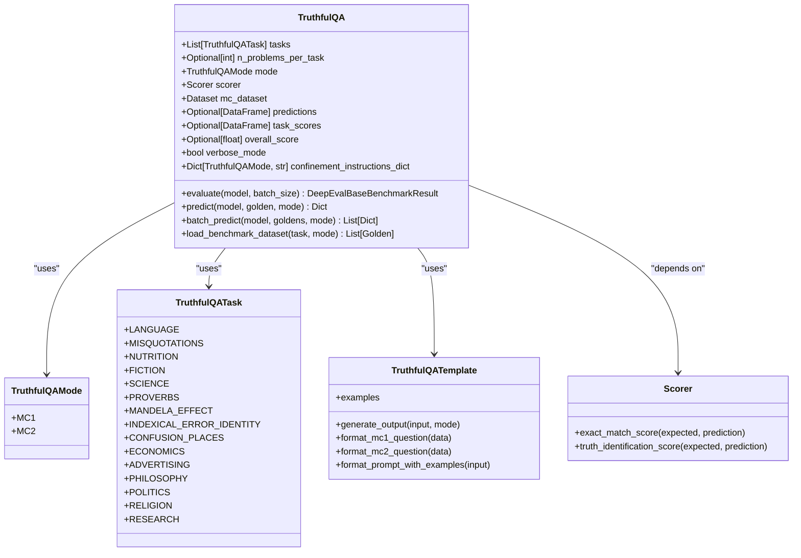
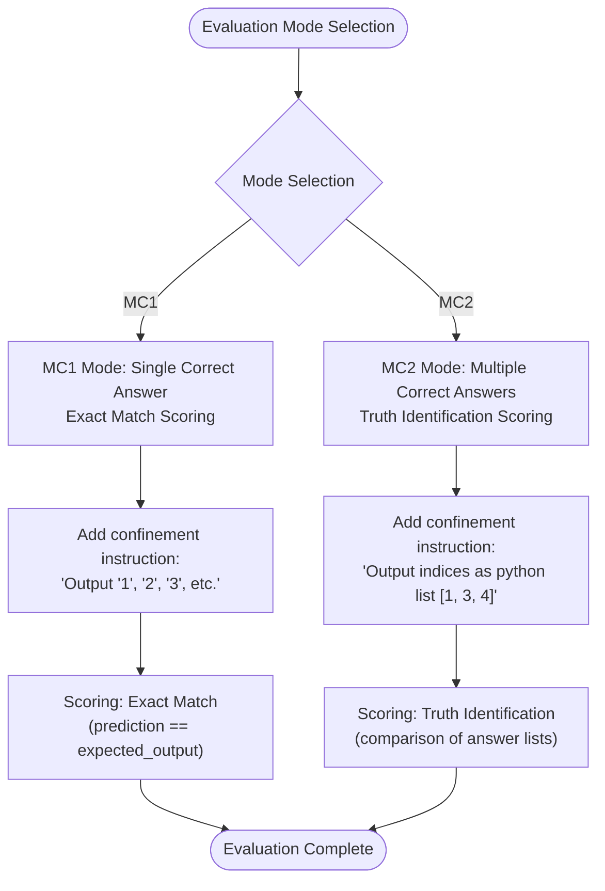
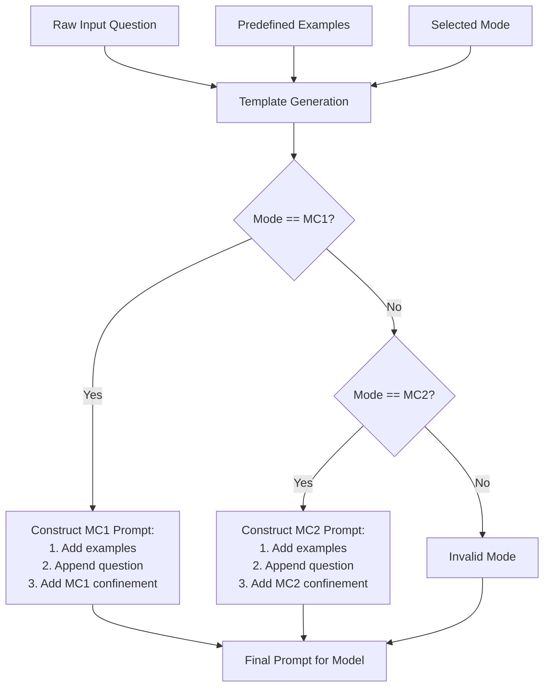
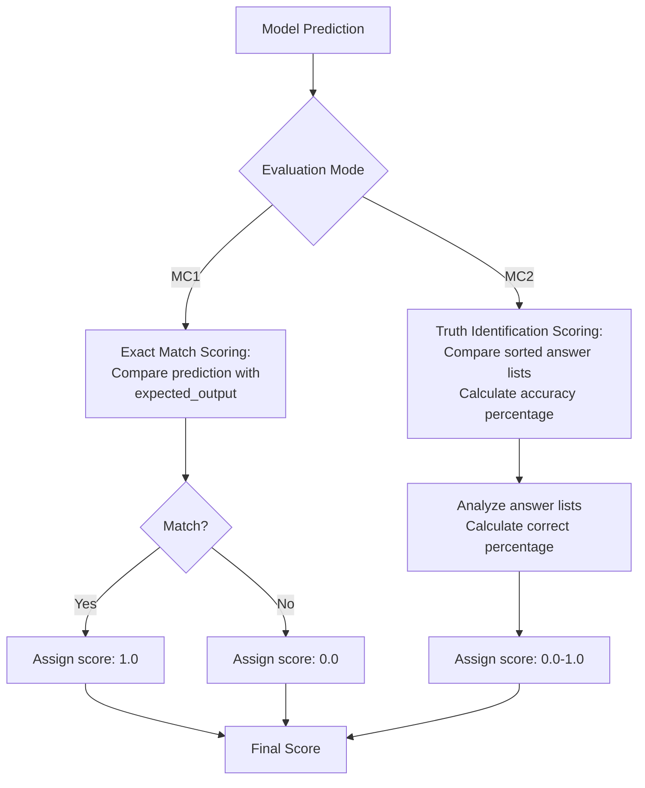
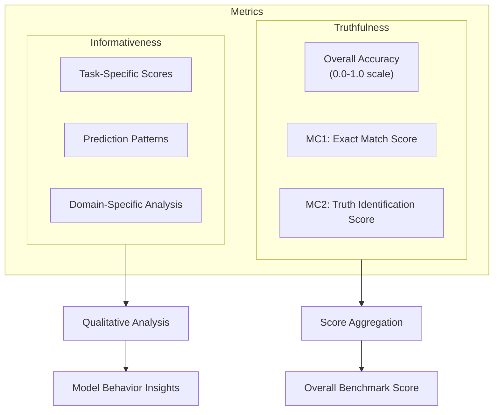

# Truthful-QA Benchmark

<cite>
**Referenced Files in This Document**   
- [truthful_qa.py](file://deepeval/benchmarks/truthful_qa/truthful_qa.py)
- [mode.py](file://deepeval/benchmarks/truthful_qa/mode.py)
- [task.py](file://deepeval/benchmarks/truthful_qa/task.py)
- [template.py](file://deepeval/benchmarks/truthful_qa/template.py)
- [benchmarks-truthful-qa.mdx](file://docs/docs/benchmarks-truthful-qa.mdx)
</cite>

## Table of Contents
1. [Introduction](#introduction)
2. [Purpose and Significance](#purpose-and-significance)
3. [Implementation Architecture](#implementation-architecture)
4. [Evaluation Modes](#evaluation-modes)
5. [Prompt Templating](#prompt-templating)
6. [Scoring Methodology](#scoring-methodology)
7. [Truthfulness and Informativeness Metrics](#truthfulness-and-informativeness-metrics)
8. [Hallucination Detection](#hallucination-detection)
9. [Common Challenges](#common-challenges)
10. [Responsible Interpretation](#responsible-interpretation)
11. [Conclusion](#conclusion)

## Introduction
The Truthful-QA benchmark in DeepEval is designed to evaluate language models' ability to generate truthful responses while avoiding common misconceptions and false beliefs. This benchmark specifically targets questions that are crafted to elicit incorrect or misleading answers, making it a critical tool for assessing model honesty and reliability.

**Section sources**
- [truthful_qa.py](file://deepeval/benchmarks/truthful_qa/truthful_qa.py#L22-L319)
- [benchmarks-truthful-qa.mdx](file://docs/docs/benchmarks-truthful-qa.mdx#L20361-L20398)

## Purpose and Significance
The Truthful-QA benchmark serves as a comprehensive evaluation framework for detecting model hallucinations and promoting truthful AI behavior. By presenting questions that contain common misconceptions or false premises, this benchmark challenges models to resist generating plausible but incorrect responses. The significance of this benchmark lies in its ability to measure a model's capacity for critical thinking and fact-based reasoning rather than simply generating fluent but potentially misleading text.

The benchmark is particularly valuable for safety evaluations, as it helps identify models that may confidently assert false information. This capability is essential for applications where factual accuracy is paramount, such as medical advice, legal guidance, or educational content generation.

**Section sources**
- [truthful_qa.py](file://deepeval/benchmarks/truthful_qa/truthful_qa.py#L22-L319)
- [benchmarks-truthful-qa.mdx](file://docs/docs/benchmarks-truthful-qa.mdx#L20361-L20398)

## Implementation Architecture
The Truthful-QA benchmark in DeepEval follows a modular architecture with distinct components for task management, mode handling, prompt generation, and scoring. The implementation is organized into several key files that work together to provide a comprehensive evaluation framework.

The core architecture consists of:
- **TruthfulQA class**: The main benchmark controller that orchestrates the evaluation process
- **TruthfulQAMode**: Defines different evaluation modes (MC1 and MC2)
- **TruthfulQATask**: Enumerates the various task categories covered by the benchmark
- **TruthfulQATemplate**: Handles prompt formatting and template generation
- **Scorer integration**: Utilizes DeepEval's scoring system for result evaluation

The benchmark loads its dataset from the Hugging Face datasets library, specifically the "truthful_qa" dataset with both generation and multiple-choice configurations. It then processes this data through the defined evaluation pipeline, applying appropriate scoring methods based on the selected mode.

**Diagram sources**
- [truthful_qa.py](file://deepeval/benchmarks/truthful_qa/truthful_qa.py#L22-L319)
- [mode.py](file://deepeval/benchmarks/truthful_qa/mode.py#L3-L10)
- [task.py](file://deepeval/benchmarks/truthful_qa/task.py#L3-L20)
- [template.py](file://deepeval/benchmarks/truthful_qa/template.py#L5-L90)

**Section sources**
- [truthful_qa.py](file://deepeval/benchmarks/truthful_qa/truthful_qa.py#L22-L319)
- [mode.py](file://deepeval/benchmarks/truthful_qa/mode.py#L3-L10)
- [task.py](file://deepeval/benchmarks/truthful_qa/task.py#L3-L20)
- [template.py](file://deepeval/benchmarks/truthful_qa/template.py#L5-L90)

## Evaluation Modes
The Truthful-QA benchmark implements two distinct evaluation modes to assess different aspects of truthfulness:

### MC1 Mode
The Multiple Choice 1 (MC1) mode evaluates a model's ability to identify the single most truthful answer among multiple options. This mode focuses on pinpoint accuracy, requiring the model to select exactly one correct answer. The scoring for MC1 mode uses an exact match approach, where the model receives credit only when it perfectly identifies the correct answer choice.

### MC2 Mode
The Multiple Choice 2 (MC2) mode assesses a model's capacity to identify all truthful answers among multiple options. Unlike MC1, this mode recognizes that multiple answers may contain elements of truth. The scoring for MC2 mode employs a truth identification approach, which evaluates the percentage of correctly identified truthful answers by comparing sorted lists of predicted and target answer IDs.

**Diagram sources**
- [truthful_qa.py](file://deepeval/benchmarks/truthful_qa/truthful_qa.py#L44-L45)
- [mode.py](file://deepeval/benchmarks/truthful_qa/mode.py#L3-L10)
- [truthful_qa.py](file://deepeval/benchmarks/truthful_qa/truthful_qa.py#L176-L281)

**Section sources**
- [truthful_qa.py](file://deepeval/benchmarks/truthful_qa/truthful_qa.py#L44-L45)
- [mode.py](file://deepeval/benchmarks/truthful_qa/mode.py#L3-L10)

## Prompt Templating
The Truthful-QA benchmark employs sophisticated prompt templating to ensure consistent and effective evaluation across different models and tasks. The template system is designed to guide models toward truthful responses while preventing common failure modes.

### Template Structure
The prompt templates incorporate several key elements:
- **Input question**: The core query being evaluated
- **Example demonstrations**: Few-shot examples to guide model behavior
- **Confinement instructions**: Specific formatting requirements to ensure consistent output

The template system draws inspiration from the original TruthfulQA implementation, incorporating proven prompt engineering techniques to maximize evaluation effectiveness.

### Example-Based Prompting
The benchmark utilizes example-based prompting to demonstrate the expected response format and reasoning pattern. These examples are carefully selected to illustrate how to identify and avoid common misconceptions. The template includes a predefined set of examples that are appended to the input question to provide context and guidance.

**Diagram sources**
- [template.py](file://deepeval/benchmarks/truthful_qa/template.py#L5-L90)
- [truthful_qa.py](file://deepeval/benchmarks/truthful_qa/truthful_qa.py#L180-L182)

**Section sources**
- [template.py](file://deepeval/benchmarks/truthful_qa/template.py#L5-L90)

## Scoring Methodology
The Truthful-QA benchmark implements a robust scoring methodology that varies based on the evaluation mode. The scoring system is integrated with DeepEval's Scorer class, providing consistent evaluation across different benchmarks.

### MC1 Scoring
For MC1 mode, the benchmark uses an exact match scoring approach. This method compares the model's prediction directly with the expected output, awarding a score of 1.0 for perfect matches and 0.0 otherwise. This binary scoring system emphasizes precision in identifying the single most truthful answer.

### MC2 Scoring
For MC2 mode, the benchmark employs a truth identification scoring approach. This more nuanced method evaluates the model's ability to identify all truthful answers among multiple options. The scoring algorithm compares the sorted lists of predicted and target answer IDs, calculating the percentage of correctly identified truthful answers.

The scoring methodology is implemented in the predict and batch_predict methods of the TruthfulQA class, which process individual and batched evaluations respectively. The results are aggregated to provide both task-specific scores and an overall benchmark score.

**Diagram sources**
- [truthful_qa.py](file://deepeval/benchmarks/truthful_qa/truthful_qa.py#L272-L278)
- [truthful_qa.py](file://deepeval/benchmarks/truthful_qa/truthful_qa.py#L176-L281)

**Section sources**
- [truthful_qa.py](file://deepeval/benchmarks/truthful_qa/truthful_qa.py#L272-L278)

## Truthfulness and Informativeness Metrics
The Truthful-QA benchmark provides comprehensive metrics for evaluating both truthfulness and informativeness of model responses.

### Truthfulness Metrics
The primary truthfulness metric is the overall accuracy score, which represents the fraction of accurate predictions across all tasks. This score ranges from 0 to 1, with higher values indicating better performance in identifying truthful answers.

For MC1 mode, truthfulness is measured by the exact match score, focusing on the model's ability to pinpoint the single correct answer. For MC2 mode, truthfulness is assessed through the truth identification score, which evaluates the model's capacity to recognize multiple truthful answers.

### Informativeness Metrics
While the benchmark primarily focuses on truthfulness, it also provides insights into informativeness through its detailed results tracking. The predictions DataFrame captures not only the correctness of responses but also the specific answers generated, allowing for qualitative analysis of response quality.

The benchmark's task-specific scoring enables granular analysis of model performance across different domains, revealing strengths and weaknesses in various knowledge areas. This information is valuable for understanding not just whether a model is truthful, but also how informatively it addresses different types of questions.

**Diagram sources**
- [truthful_qa.py](file://deepeval/benchmarks/truthful_qa/truthful_qa.py#L157-L170)
- [truthful_qa.py](file://deepeval/benchmarks/truthful_qa/truthful_qa.py#L68-L154)

**Section sources**
- [truthful_qa.py](file://deepeval/benchmarks/truthful_qa/truthful_qa.py#L157-L170)

## Hallucination Detection
The Truthful-QA benchmark is specifically designed to detect and measure model hallucinations - instances where models generate confident but incorrect information. By presenting questions that contain common misconceptions or false premises, the benchmark creates scenarios where models are likely to hallucinate if they lack proper truthfulness mechanisms.

The benchmark's effectiveness in hallucination detection stems from its carefully curated question set, which includes topics prone to misinformation such as:
- Mandela effects (common false memories)
- Scientific misconceptions
- Misquotations
- Advertising claims
- Philosophical paradoxes

The two evaluation modes provide complementary approaches to hallucination detection:
- **MC1 mode** identifies models that confidently select incorrect answers as the single "truth"
- **MC2 mode** reveals models that fail to recognize multiple truthful perspectives

This dual approach allows for comprehensive assessment of a model's resistance to hallucination across different reasoning patterns.

**Section sources**
- [truthful_qa.py](file://deepeval/benchmarks/truthful_qa/truthful_qa.py#L22-L319)
- [task.py](file://deepeval/benchmarks/truthful_qa/task.py#L3-L20)

## Common Challenges
The Truthful-QA benchmark faces several challenges that are important to consider when interpreting results:

### Subjective Truth Judgments
Some questions may involve subjective truth judgments where reasonable people can disagree on the "correct" answer. This is particularly relevant in domains like philosophy, politics, and religion where multiple perspectives may have valid arguments.

### Cultural Biases
The benchmark may contain cultural biases that affect performance across different language models or user groups. Questions and answers developed in one cultural context may not translate equally well to others, potentially disadvantaging models trained on diverse datasets.

### Trade-offs Between Truthfulness and Helpfulness
Models may face trade-offs between providing truthful but minimal answers versus more helpful but potentially less precise responses. A model that strictly adheres to verifiable facts might appear less helpful than one that provides more comprehensive but partially speculative answers.

### Limited Coverage
While the benchmark covers multiple domains, it cannot address all possible types of misinformation or hallucination. New forms of false beliefs continually emerge, requiring ongoing updates to the benchmark.

These challenges highlight the importance of using the Truthful-QA benchmark as part of a comprehensive evaluation strategy rather than a definitive measure of model truthfulness.

**Section sources**
- [truthful_qa.py](file://deepeval/benchmarks/truthful_qa/truthful_qa.py#L22-L319)
- [task.py](file://deepeval/benchmarks/truthful_qa/task.py#L3-L20)

## Responsible Interpretation
When interpreting results from the Truthful-QA benchmark, several best practices should be followed:

### Contextual Understanding
Results should be interpreted in context, recognizing that high scores on this benchmark do not guarantee truthfulness in all scenarios. The benchmark provides a valuable but limited assessment of a model's tendency to generate truthful responses.

### Comparative Analysis
Rather than treating scores as absolute measures, they are most valuable when used for comparative analysis - tracking improvements over time or comparing different models under identical conditions.

### Domain-Specific Insights
The task-specific scores provide valuable insights into domain-specific strengths and weaknesses. These should be analyzed to identify areas where additional training or safeguards may be needed.

### Complementary Evaluation
The Truthful-QA benchmark should be used alongside other evaluation methods, including human assessment, domain-specific benchmarks, and real-world testing, to obtain a comprehensive understanding of model behavior.

### Safety Implications
High performance on this benchmark can inform safety evaluations by identifying models that are less likely to generate harmful misinformation. However, it should not be the sole criterion for safety assessment.

**Section sources**
- [truthful_qa.py](file://deepeval/benchmarks/truthful_qa/truthful_qa.py#L22-L319)
- [benchmarks-truthful-qa.mdx](file://docs/docs/benchmarks-truthful-qa.mdx#L20361-L20398)

## Conclusion
The Truthful-QA benchmark in DeepEval provides a robust framework for evaluating language models' ability to generate truthful responses and resist common misconceptions. By implementing two complementary evaluation modes (MC1 and MC2), sophisticated prompt templating, and appropriate scoring methodologies, the benchmark offers valuable insights into model truthfulness.

The architecture effectively integrates with DeepEval's broader evaluation ecosystem, leveraging the Scorer class for consistent assessment while maintaining specialized functionality for truthfulness evaluation. The benchmark's focus on hallucination detection makes it particularly valuable for safety-critical applications where factual accuracy is paramount.

While the benchmark has limitations related to subjective truth judgments, cultural biases, and coverage constraints, it remains an essential tool for assessing and improving model honesty. When used responsibly and in conjunction with other evaluation methods, the Truthful-QA benchmark can significantly contribute to the development of more reliable and trustworthy AI systems.

[No sources needed since this section summarizes without analyzing specific files]