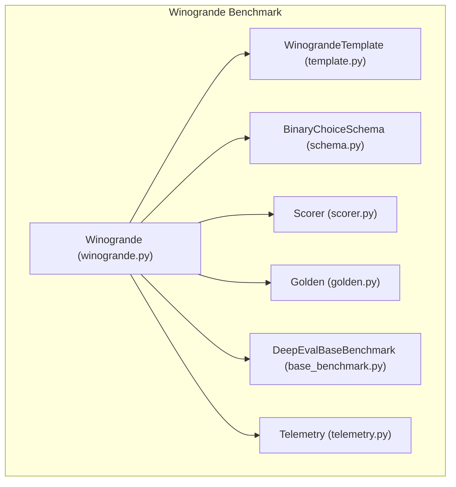
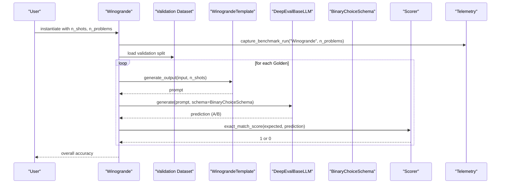
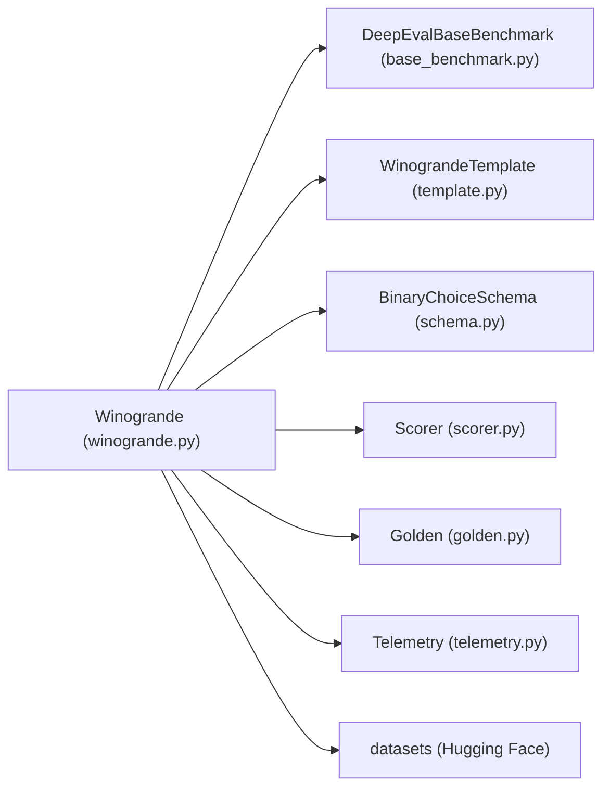

# Winogrande Benchmark

<cite>
**Referenced Files in This Document**
- [winogrande.py](file://deepeval/benchmarks/winogrande/winogrande.py)
- [template.py](file://deepeval/benchmarks/winogrande/template.py)
- [schema.py](file://deepeval/benchmarks/schema.py)
- [base_benchmark.py](file://deepeval/benchmarks/base_benchmark.py)
- [__init__.py](file://deepeval/benchmarks/__init__.py)
- [scorer.py](file://deepeval/scorer/scorer.py)
- [golden.py](file://deepeval/dataset/golden.py)
- [benchmarks-winogrande.mdx](file://docs/docs/benchmarks-winogrande.mdx)
- [telemetry.py](file://deepeval/telemetry.py)
</cite>

## Table of Contents
1. [Introduction](#introduction)
2. [Project Structure](#project-structure)
3. [Core Components](#core-components)
4. [Architecture Overview](#architecture-overview)
5. [Detailed Component Analysis](#detailed-component-analysis)
6. [Dependency Analysis](#dependency-analysis)
7. [Performance Considerations](#performance-considerations)
8. [Troubleshooting Guide](#troubleshooting-guide)
9. [Conclusion](#conclusion)
10. [Appendices](#appendices)

## Introduction
The Winogrande benchmark in DeepEval evaluates a model’s ability to resolve coreference and apply commonsense reasoning through binary-choice sentence completion tasks. It focuses on gender-neutral pronouns and ambiguous referents, requiring models to select the correct antecedent based on contextual and world knowledge rather than surface-level cues. The benchmark uses a few-shot prompt format and enforces exact matching of answer choices to measure performance on challenging linguistic ambiguities.

This document explains the implementation details, including prompt construction, answer candidate generation, and evaluation logic. It also provides usage examples, discusses the importance of this task for deeper language understanding, highlights common challenges, and offers best practices for fair evaluation and improved reasoning.

## Project Structure
The Winogrande benchmark is implemented as a dedicated benchmark module under the benchmarks package. It integrates with the base benchmark interface, uses a prompt template, applies a schema for constrained generation, and relies on a scorer for exact matching.

**Diagram sources**
- [winogrande.py](file://deepeval/benchmarks/winogrande/winogrande.py#L1-L168)
- [template.py](file://deepeval/benchmarks/winogrande/template.py#L1-L64)
- [schema.py](file://deepeval/benchmarks/schema.py#L25-L31)
- [scorer.py](file://deepeval/scorer/scorer.py#L98-L112)
- [golden.py](file://deepeval/dataset/golden.py#L8-L24)
- [base_benchmark.py](file://deepeval/benchmarks/base_benchmark.py#L1-L33)
- [telemetry.py](file://deepeval/telemetry.py#L370-L400)

**Section sources**
- [winogrande.py](file://deepeval/benchmarks/winogrande/winogrande.py#L1-L168)
- [template.py](file://deepeval/benchmarks/winogrande/template.py#L1-L64)
- [schema.py](file://deepeval/benchmarks/schema.py#L25-L31)
- [scorer.py](file://deepeval/scorer/scorer.py#L98-L112)
- [golden.py](file://deepeval/dataset/golden.py#L8-L24)
- [base_benchmark.py](file://deepeval/benchmarks/base_benchmark.py#L1-L33)
- [telemetry.py](file://deepeval/telemetry.py#L370-L400)

## Core Components
- Winogrande class: orchestrates loading the dataset, constructing prompts, generating answers, scoring, and computing overall accuracy.
- WinograndeTemplate: builds few-shot prompts and formats questions and answers consistently.
- BinaryChoiceSchema: constrains model output to “A” or “B” for exact matching.
- Scorer.exact_match_score: computes correctness by exact string match.
- Golden: encapsulates input and expected output for each test case.
- DeepEvalBaseBenchmark: defines the benchmark interface contract.
- Telemetry: captures benchmark run metadata for observability.

**Section sources**
- [winogrande.py](file://deepeval/benchmarks/winogrande/winogrande.py#L15-L115)
- [template.py](file://deepeval/benchmarks/winogrande/template.py#L40-L64)
- [schema.py](file://deepeval/benchmarks/schema.py#L25-L31)
- [scorer.py](file://deepeval/scorer/scorer.py#L98-L112)
- [golden.py](file://deepeval/dataset/golden.py#L8-L24)
- [base_benchmark.py](file://deepeval/benchmarks/base_benchmark.py#L16-L33)
- [telemetry.py](file://deepeval/telemetry.py#L370-L400)

## Architecture Overview
The benchmark follows a standard pipeline:
- Load dataset from the Hugging Face Hub (validation split).
- Build a prompt by concatenating few-shot examples and the target question.
- Generate a constrained answer using the model with BinaryChoiceSchema.
- Score the prediction against the expected output using exact matching.
- Aggregate accuracy across all problems.

**Diagram sources**
- [winogrande.py](file://deepeval/benchmarks/winogrande/winogrande.py#L43-L115)
- [template.py](file://deepeval/benchmarks/winogrande/template.py#L40-L58)
- [schema.py](file://deepeval/benchmarks/schema.py#L25-L31)
- [scorer.py](file://deepeval/scorer/scorer.py#L98-L112)
- [telemetry.py](file://deepeval/telemetry.py#L370-L400)

## Detailed Component Analysis

### Prompt Construction and Few-Shot Examples
- Few-shot examples are embedded at the beginning of the prompt to prime the model with patterns.
- The template formats each example as a sentence with two candidates and the correct answer label.
- The target question is appended after the few-shot examples to form the final prompt.

Implementation highlights:
- Few-shot examples are defined statically and reused across runs.
- The prompt composition iterates over n_shots and appends the target input.

**Section sources**
- [template.py](file://deepeval/benchmarks/winogrande/template.py#L6-L38)
- [template.py](file://deepeval/benchmarks/winogrande/template.py#L40-L58)

### Answer Candidate Generation and Constrained Output
- The model is asked to generate a constrained answer using BinaryChoiceSchema.
- The schema restricts the output to “A” or “B”, enabling exact matching.
- If the model fails to conform to the schema, a fallback instruction is appended to enforce a short-form answer.

Key behaviors:
- Uses model.generate with schema for structured output.
- Falls back to unconstrained generation with a confinement instruction when schema parsing fails.
- Handles tuple outputs gracefully by taking the first element.

**Section sources**
- [schema.py](file://deepeval/benchmarks/schema.py#L25-L31)
- [winogrande.py](file://deepeval/benchmarks/winogrande/winogrande.py#L96-L115)

### Evaluation Logic and Exact Matching
- Predictions are scored using exact_match_score, which compares stripped strings.
- The benchmark aggregates counts of correct predictions and divides by total problems to compute accuracy.
- Verbose mode prints per-instance logs for inspection.

Scoring specifics:
- exact_match_score returns 1 for a perfect match, 0 otherwise.
- The result is a proportion of correct answers out of n_problems.

**Section sources**
- [scorer.py](file://deepeval/scorer/scorer.py#L98-L112)
- [winogrande.py](file://deepeval/benchmarks/winogrande/winogrande.py#L73-L87)
- [winogrande.py](file://deepeval/benchmarks/winogrande/winogrande.py#L138-L168)

### Dataset Loading and Golden Construction
- Loads the validation split from the Hugging Face dataset “allenai/winogrande” with the “winogrande_xs” configuration.
- Formats each row into a Golden object with input and expected_output.
- Input is constructed without the answer, while expected_output is the correct choice label.

**Section sources**
- [winogrande.py](file://deepeval/benchmarks/winogrande/winogrande.py#L116-L137)
- [golden.py](file://deepeval/dataset/golden.py#L8-L24)

### Benchmark Interface Compliance
- Inherits from DeepEvalBaseBenchmark and implements load_benchmark_dataset and evaluate.
- Uses DeepEvalBaseBenchmarkResult to return overall accuracy.

**Section sources**
- [base_benchmark.py](file://deepeval/benchmarks/base_benchmark.py#L16-L33)
- [winogrande.py](file://deepeval/benchmarks/winogrande/winogrande.py#L43-L88)

### Telemetry Integration
- Wraps evaluation in a telemetry context manager to capture benchmark run metadata.
- Sends properties including benchmark name, number of tasks, environment, and feature status.

**Section sources**
- [telemetry.py](file://deepeval/telemetry.py#L370-L400)
- [winogrande.py](file://deepeval/benchmarks/winogrande/winogrande.py#L48-L51)

## Dependency Analysis
The Winogrande benchmark depends on several core modules:

**Diagram sources**
- [winogrande.py](file://deepeval/benchmarks/winogrande/winogrande.py#L116-L137)
- [base_benchmark.py](file://deepeval/benchmarks/base_benchmark.py#L16-L33)
- [template.py](file://deepeval/benchmarks/winogrande/template.py#L40-L58)
- [schema.py](file://deepeval/benchmarks/schema.py#L25-L31)
- [scorer.py](file://deepeval/scorer/scorer.py#L98-L112)
- [golden.py](file://deepeval/dataset/golden.py#L8-L24)
- [telemetry.py](file://deepeval/telemetry.py#L370-L400)

**Section sources**
- [winogrande.py](file://deepeval/benchmarks/winogrande/winogrande.py#L116-L137)
- [__init__.py](file://deepeval/benchmarks/__init__.py#L1-L38)

## Performance Considerations
- Few-shot examples: Increasing n_shots can improve answer formatting consistency and overall accuracy by providing more exemplars.
- Constrained generation: Using BinaryChoiceSchema reduces variability in output format and improves exact match reliability.
- Dataset size: Limiting n_problems allows quick iterations during development and testing.
- Telemetry overhead: Telemetry is enabled by default; disabling it can reduce runtime overhead if not needed.

[No sources needed since this section provides general guidance]

## Troubleshooting Guide
Common issues and resolutions:
- Model output format mismatch: If the model returns an unexpected type or tuple, the benchmark appends a confinement instruction to enforce short-form answers.
- No dataset installed: Ensure the datasets library is available and the Hugging Face Hub is reachable.
- Verbose logging: Enable verbose_mode to inspect per-instance inputs, predictions, and expected outputs for debugging.

**Section sources**
- [winogrande.py](file://deepeval/benchmarks/winogrande/winogrande.py#L96-L115)
- [winogrande.py](file://deepeval/benchmarks/winogrande/winogrande.py#L138-L168)

## Conclusion
The Winogrande benchmark in DeepEval provides a focused assessment of coreference resolution and commonsense reasoning through binary-choice sentence completion. Its few-shot prompt design, constrained generation, and exact matching evaluation enable robust measurement of deeper language understanding beyond surface patterns. Proper use of few-shot examples, enforced output formatting, and careful interpretation of results help ensure fair and meaningful evaluations.

[No sources needed since this section summarizes without analyzing specific files]

## Appendices

### Usage Example
To run the benchmark on a subset of problems with a chosen number of few-shot examples:

- Instantiate the benchmark with desired n_problems and n_shots.
- Call evaluate with a model implementing DeepEvalBaseLLM.
- Access overall_score for accuracy.

Reference usage and arguments:
- See the official documentation page for usage and argument details.

**Section sources**
- [benchmarks-winogrande.mdx](file://docs/docs/benchmarks-winogrande.mdx#L20-L50)
- [winogrande.py](file://deepeval/benchmarks/winogrande/winogrande.py#L15-L42)

### Implementation Notes
- Prompt construction: Few-shot examples are concatenated with the target input to form the prompt.
- Answer selection: The model predicts “A” or “B”; the benchmark enforces this format via schema and fallback instructions.
- Evaluation: Exact matching is used to compute correctness; accuracy is the proportion of correct answers.

**Section sources**
- [template.py](file://deepeval/benchmarks/winogrande/template.py#L40-L58)
- [schema.py](file://deepeval/benchmarks/schema.py#L25-L31)
- [scorer.py](file://deepeval/scorer/scorer.py#L98-L112)
- [winogrande.py](file://deepeval/benchmarks/winogrande/winogrande.py#L73-L87)

### Best Practices for Fair Evaluation
- Use sufficient few-shot examples to stabilize answer formatting.
- Prefer constrained generation with BinaryChoiceSchema to minimize variability.
- Limit n_problems for iterative tuning; increase for final reporting.
- Enable verbose_mode during debugging to inspect predictions and expected outputs.
- Consider model biases and ensure balanced examples across domains to avoid skewed performance.

[No sources needed since this section provides general guidance]