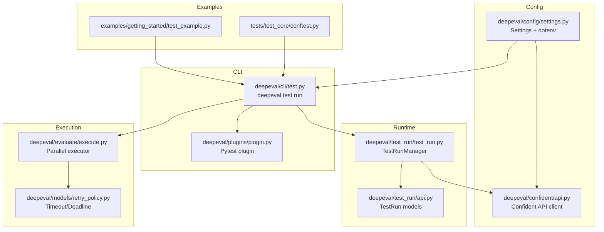
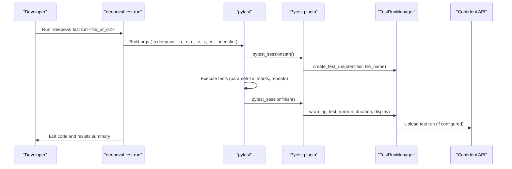
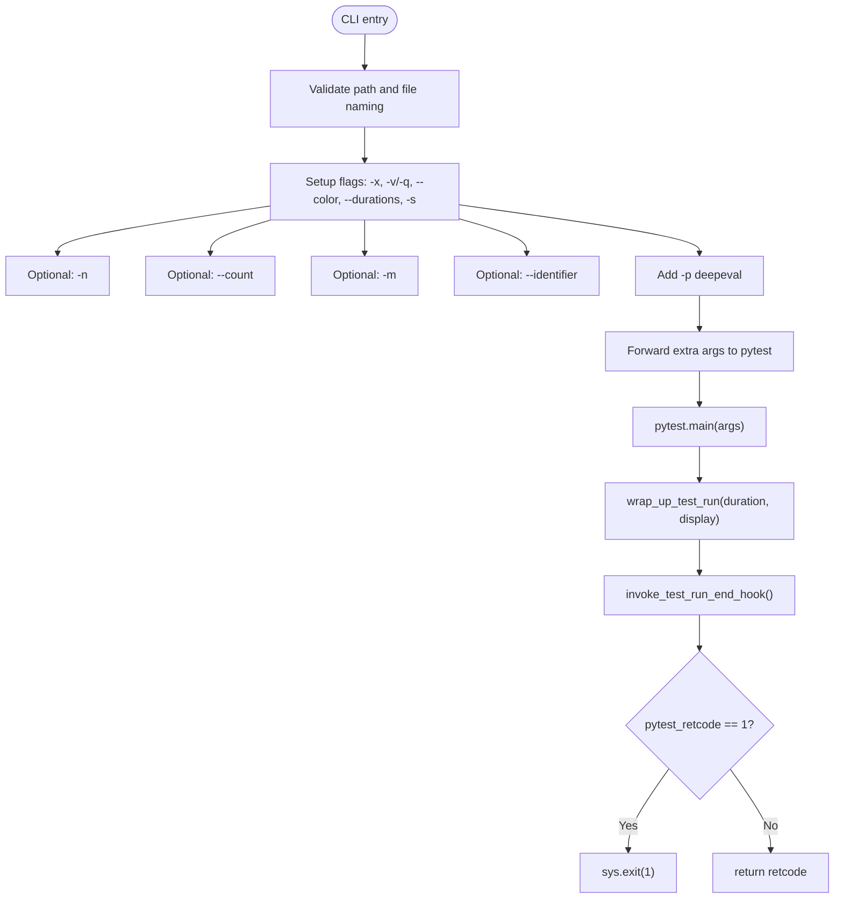
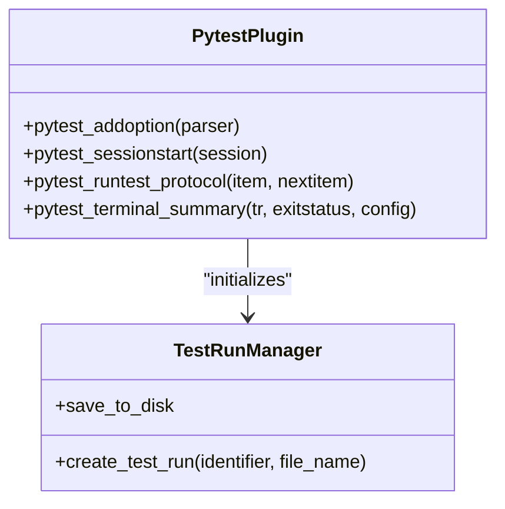
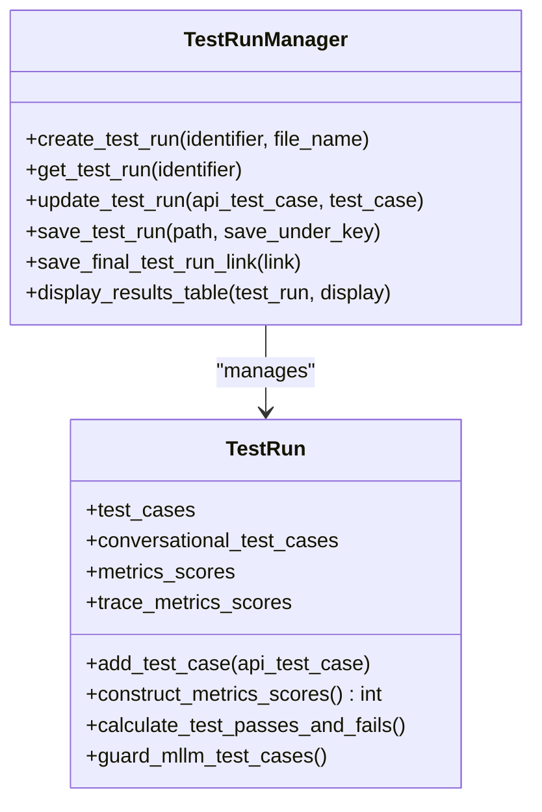
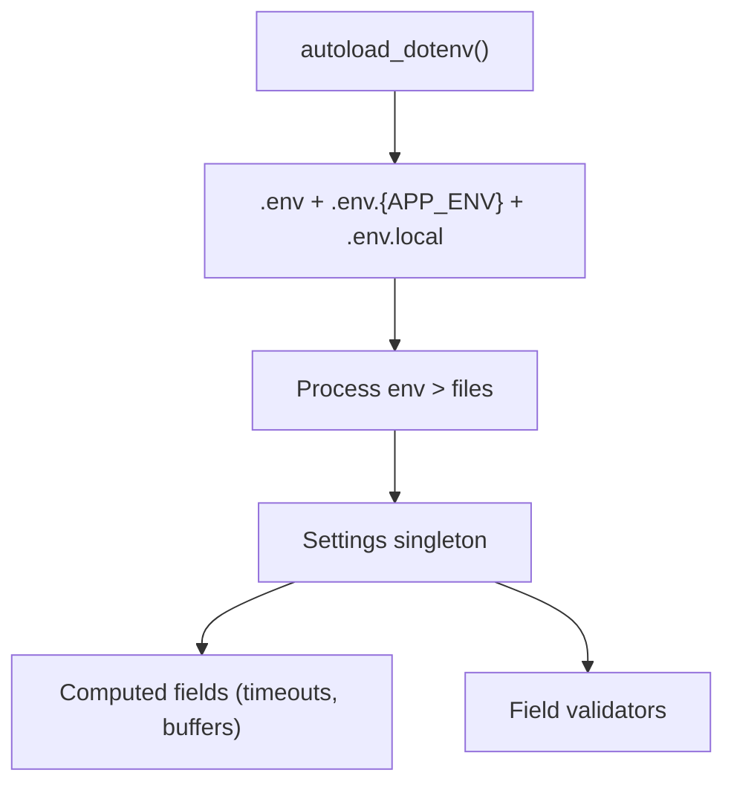
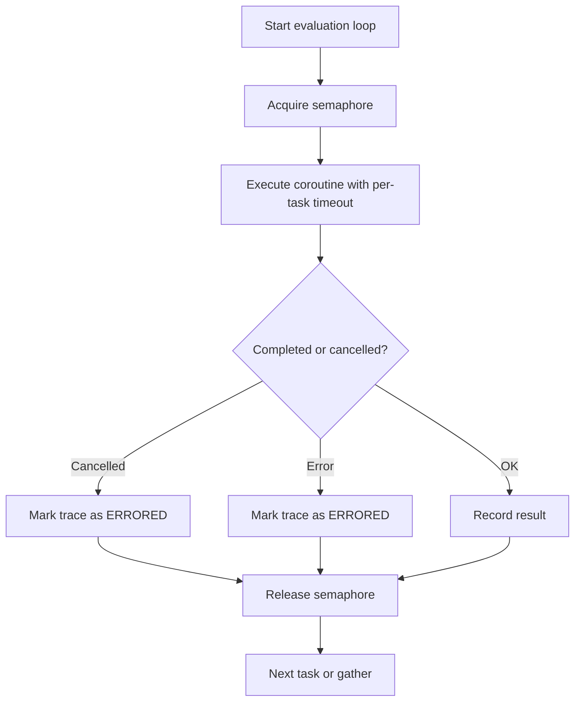
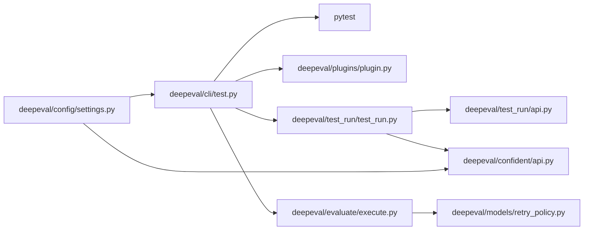

# CI/CD Integration

<cite>
**Referenced Files in This Document**
- [deepeval/cli/test.py](file://deepeval/cli/test.py)
- [deepeval/plugins/plugin.py](file://deepeval/plugins/plugin.py)
- [deepeval/test_run/test_run.py](file://deepeval/test_run/test_run.py)
- [deepeval/test_run/api.py](file://deepeval/test_run/api.py)
- [deepeval/config/settings.py](file://deepeval/config/settings.py)
- [deepeval/confident/api.py](file://deepeval/confident/api.py)
- [deepeval/evaluate/execute.py](file://deepeval/evaluate/execute.py)
- [deepeval/models/retry_policy.py](file://deepeval/models/retry_policy.py)
- [examples/getting_started/test_example.py](file://examples/getting_started/test_example.py)
- [tests/test_core/conftest.py](file://tests/test_core/conftest.py)
- [docs/guides/guides-regression-testing-in-cicd.mdx](file://docs/guides/guides-regression-testing-in-cicd.mdx)
- [docs/guides/guides-rag-evaluation.mdx](file://docs/guides/guides-rag-evaluation.mdx)
</cite>

## Table of Contents
1. [Introduction](#introduction)
2. [Project Structure](#project-structure)
3. [Core Components](#core-components)
4. [Architecture Overview](#architecture-overview)
5. [Detailed Component Analysis](#detailed-component-analysis)
6. [Dependency Analysis](#dependency-analysis)
7. [Performance Considerations](#performance-considerations)
8. [Troubleshooting Guide](#troubleshooting-guide)
9. [Conclusion](#conclusion)
10. [Appendices](#appendices)

## Introduction
This section explains how DeepEval integrates with CI/CD systems to automate LLM application evaluation. It focuses on enabling test runs via the CLI, integrating with pytest, leveraging parallel execution, and reporting results to Confident AI. The content is structured for both beginners and experienced developers, covering conceptual overviews, public interfaces, configuration management, and practical CI/CD setup examples.

## Project Structure
DeepEval’s CI/CD integration centers around:
- A CLI subcommand that wraps pytest and orchestrates test runs
- A pytest plugin that hooks into pytest lifecycle to track and report results
- A test run manager that aggregates results and optionally uploads to Confident AI
- Configuration and environment management for secrets and settings
- Parallel execution primitives for scaling evaluations

**Diagram sources**
- [deepeval/cli/test.py](file://deepeval/cli/test.py#L1-L182)
- [deepeval/plugins/plugin.py](file://deepeval/plugins/plugin.py#L1-L50)
- [deepeval/test_run/test_run.py](file://deepeval/test_run/test_run.py#L1-L200)
- [deepeval/test_run/api.py](file://deepeval/test_run/api.py#L1-L158)
- [deepeval/config/settings.py](file://deepeval/config/settings.py#L1-L200)
- [deepeval/confident/api.py](file://deepeval/confident/api.py#L1-L120)
- [deepeval/evaluate/execute.py](file://deepeval/evaluate/execute.py#L2450-L2649)
- [deepeval/models/retry_policy.py](file://deepeval/models/retry_policy.py#L69-L107)
- [examples/getting_started/test_example.py](file://examples/getting_started/test_example.py#L1-L40)
- [tests/test_core/conftest.py](file://tests/test_core/conftest.py#L1-L198)

**Section sources**
- [deepeval/cli/test.py](file://deepeval/cli/test.py#L1-L182)
- [deepeval/plugins/plugin.py](file://deepeval/plugins/plugin.py#L1-L50)
- [deepeval/test_run/test_run.py](file://deepeval/test_run/test_run.py#L1-L200)
- [deepeval/config/settings.py](file://deepeval/config/settings.py#L1-L200)

## Core Components
- CLI test runner: Provides the “deepeval test run” command that delegates to pytest with DeepEval-specific flags and options. It sets up caching, error handling, verbosity, and parallelism.
- Pytest plugin: Hooks into pytest to initialize a test run, track identifiers, and handle teardown/reporting.
- Test run manager: Aggregates test cases, metrics, and traces; optionally saves to disk and uploads to Confident AI.
- Configuration and secrets: Centralized settings with dotenv support, environment precedence, and secure handling of secrets.
- Parallel execution: Async executor with semaphores and throttling; timeout/deadline management for predictable CI performance.

**Section sources**
- [deepeval/cli/test.py](file://deepeval/cli/test.py#L1-L182)
- [deepeval/plugins/plugin.py](file://deepeval/plugins/plugin.py#L1-L50)
- [deepeval/test_run/test_run.py](file://deepeval/test_run/test_run.py#L1-L200)
- [deepeval/config/settings.py](file://deepeval/config/settings.py#L1-L200)
- [deepeval/evaluate/execute.py](file://deepeval/evaluate/execute.py#L2450-L2649)

## Architecture Overview
The CI/CD flow begins with the CLI invoking pytest with DeepEval’s plugin. The plugin initializes a test run, and the CLI coordinates execution, caching, and result reporting. Results can be uploaded to Confident AI for centralized reporting.

**Diagram sources**
- [deepeval/cli/test.py](file://deepeval/cli/test.py#L44-L181)
- [deepeval/plugins/plugin.py](file://deepeval/plugins/plugin.py#L1-L50)
- [deepeval/test_run/test_run.py](file://deepeval/test_run/test_run.py#L435-L620)
- [deepeval/confident/api.py](file://deepeval/confident/api.py#L110-L215)

## Detailed Component Analysis

### CLI Test Runner
The CLI composes pytest arguments, applies flags for parallelism, repeats, verbosity, and filtering, and then executes pytest. It captures timing, invokes the test run end hook, and exits with the appropriate code.

Key behaviors:
- Validates file or directory targets and enforces test file naming conventions.
- Supports parallel execution via pytest-xdist (-n) and repeated runs via pytest-count (--count).
- Configures caching, error handling, and verbosity flags.
- Adds the DeepEval pytest plugin (-p deepeval) and forwards extra arguments.

**Diagram sources**
- [deepeval/cli/test.py](file://deepeval/cli/test.py#L27-L181)

**Section sources**
- [deepeval/cli/test.py](file://deepeval/cli/test.py#L1-L182)

### Pytest Plugin
The plugin integrates with pytest lifecycle:
- Adds an identifier option
- Initializes a test run on session start
- Tracks the current test name during protocol hooks
- Prints skipped reasons during terminal summary

**Diagram sources**
- [deepeval/plugins/plugin.py](file://deepeval/plugins/plugin.py#L1-L50)
- [deepeval/test_run/test_run.py](file://deepeval/test_run/test_run.py#L435-L520)

**Section sources**
- [deepeval/plugins/plugin.py](file://deepeval/plugins/plugin.py#L1-L50)

### Test Run Manager and Reporting
The test run manager aggregates test cases, metrics, and traces, computes pass/fail counts, and can save to disk or upload to Confident AI. It supports filtering display modes and formats results for terminal output.

Highlights:
- Creates and updates test runs, merges from disk when available
- Computes aggregated metric scores and success rates
- Guards against unsupported multimodal test cases for Confident AI
- Saves temporary files and final links for latest test runs

**Diagram sources**
- [deepeval/test_run/test_run.py](file://deepeval/test_run/test_run.py#L142-L213)
- [deepeval/test_run/test_run.py](file://deepeval/test_run/test_run.py#L384-L480)
- [deepeval/test_run/test_run.py](file://deepeval/test_run/test_run.py#L520-L620)

**Section sources**
- [deepeval/test_run/test_run.py](file://deepeval/test_run/test_run.py#L1-L200)
- [deepeval/test_run/api.py](file://deepeval/test_run/api.py#L1-L158)

### Configuration Management
DeepEval loads environment variables from dotenv files with controlled precedence and exposes a Settings model with computed fields and validators. It supports:
- Dotenv autoload with APP_ENV-aware precedence
- Secret handling and persistence via dotenv or runtime-only
- Computed timeouts and concurrency budgets
- Flags for tracing, metrics logging, and debug behavior

**Diagram sources**
- [deepeval/config/settings.py](file://deepeval/config/settings.py#L193-L237)
- [deepeval/config/settings.py](file://deepeval/config/settings.py#L531-L616)

**Section sources**
- [deepeval/config/settings.py](file://deepeval/config/settings.py#L1-L200)
- [deepeval/config/settings.py](file://deepeval/config/settings.py#L531-L616)

### Parallel Execution and Throttling
DeepEval’s evaluator uses asyncio with a semaphore to cap concurrency and a throttle to pace tasks. It also manages outer deadlines and timeouts to prevent runaway CI jobs.

**Diagram sources**
- [deepeval/evaluate/execute.py](file://deepeval/evaluate/execute.py#L2450-L2649)
- [deepeval/models/retry_policy.py](file://deepeval/models/retry_policy.py#L69-L107)

**Section sources**
- [deepeval/evaluate/execute.py](file://deepeval/evaluate/execute.py#L2450-L2649)
- [deepeval/models/retry_policy.py](file://deepeval/models/reetry_policy.py#L69-L107)

### Public Interfaces for CI/CD
- CLI command: “deepeval test run”
  - Options include parallelism (-n), repeats (-r), verbosity (-v), exit on first failure (-x), warnings control, marks (-m), identifier (--identifier), and cache usage.
  - The command forwards extra arguments to pytest, enabling full pytest flexibility.
- Pytest plugin:
  - Adds an identifier option and initializes a test run at session start.
- Test run reporting:
  - TestRunManager wraps up the run and can upload results to Confident AI when configured.
- Configuration:
  - Settings model and dotenv autoload provide a consistent interface for CI environments.

Practical examples:
- Running a single test file or a directory of tests
- Using pytest-xdist for parallelism
- Using pytest marks to filter subsets
- Using repeats for robustness
- Using identifiers to group runs

**Section sources**
- [deepeval/cli/test.py](file://deepeval/cli/test.py#L44-L181)
- [deepeval/plugins/plugin.py](file://deepeval/plugins/plugin.py#L1-L50)
- [deepeval/test_run/test_run.py](file://deepeval/test_run/test_run.py#L435-L620)
- [deepeval/config/settings.py](file://deepeval/config/settings.py#L193-L237)

### Practical CI/CD Setup Examples
- GitHub Actions workflow:
  - Use the CLI to run tests in CI, optionally setting environment variables for providers and secrets.
  - The documentation includes a minimal workflow example that runs a test file and prints results.

- Example test file:
  - Demonstrates parametrized tests, metrics, and hyperparameter logging.

- Test fixtures and isolation:
  - Tests use a conftest fixture to sandbox environment variables and settings, ensuring CI stability.

**Section sources**
- [docs/guides/guides-rag-evaluation.mdx](file://docs/guides/guides-rag-evaluation.mdx#L325-L348)
- [examples/getting_started/test_example.py](file://examples/getting_started/test_example.py#L1-L40)
- [tests/test_core/conftest.py](file://tests/test_core/conftest.py#L1-L198)

## Dependency Analysis
The CI/CD integration relies on tight coupling between the CLI, pytest plugin, and test run manager. Configuration and secrets are managed centrally to ensure consistent behavior across environments.

**Diagram sources**
- [deepeval/cli/test.py](file://deepeval/cli/test.py#L1-L182)
- [deepeval/plugins/plugin.py](file://deepeval/plugins/plugin.py#L1-L50)
- [deepeval/test_run/test_run.py](file://deepeval/test_run/test_run.py#L1-L200)
- [deepeval/test_run/api.py](file://deepeval/test_run/api.py#L1-L158)
- [deepeval/confident/api.py](file://deepeval/confident/api.py#L1-L120)
- [deepeval/evaluate/execute.py](file://deepeval/evaluate/execute.py#L2450-L2649)
- [deepeval/models/retry_policy.py](file://deepeval/models/retry_policy.py#L69-L107)
- [deepeval/config/settings.py](file://deepeval/config/settings.py#L1-L200)

**Section sources**
- [deepeval/cli/test.py](file://deepeval/cli/test.py#L1-L182)
- [deepeval/plugins/plugin.py](file://deepeval/plugins/plugin.py#L1-L50)
- [deepeval/test_run/test_run.py](file://deepeval/test_run/test_run.py#L1-L200)
- [deepeval/confident/api.py](file://deepeval/confident/api.py#L1-L120)
- [deepeval/evaluate/execute.py](file://deepeval/evaluate/execute.py#L2450-L2649)
- [deepeval/config/settings.py](file://deepeval/config/settings.py#L1-L200)

## Performance Considerations
- Parallelism:
  - Use pytest-xdist (-n) to parallelize tests across processes. Tune the number of workers based on CI resources.
- Concurrency limits:
  - The evaluator uses a semaphore to cap concurrent tasks. Adjust max_concurrent to balance throughput and resource usage.
- Timeouts and deadlines:
  - Per-task and per-attempt timeouts are computed from settings. Configure outer and per-attempt budgets to prevent CI job timeouts.
- Throttling:
  - A throttle delay is applied between task creation to avoid bursty API calls.
- Caching:
  - Enable caching to reduce redundant evaluations when appropriate; disable repeats when using cache to avoid invalidating it.

[No sources needed since this section provides general guidance]

## Troubleshooting Guide
Common CI pipeline issues and resolutions:
- Missing test file prefix:
  - Ensure test files start with “test_” to be accepted by the CLI validator.
- Pytest argument errors:
  - The CLI forwards extra arguments to pytest; invalid arguments will surface from pytest itself.
- Parallel execution failures:
  - Reduce -n or adjust per-task timeouts if CI runners are constrained.
- Flaky tests:
  - Use repeats (-r) to rerun test cases and stabilize results.
  - Configure retry policy and timeouts to mitigate transient failures.
- Secrets and environment:
  - Store secrets in CI secrets and expose them via environment variables. Use dotenv autoload to mirror local behavior in CI.
- Confident AI upload:
  - Ensure the Confident API key is configured. The CLI provides a login command and environment variable support.

**Section sources**
- [deepeval/cli/test.py](file://deepeval/cli/test.py#L27-L41)
- [deepeval/config/settings.py](file://deepeval/config/settings.py#L193-L237)
- [deepeval/confident/api.py](file://deepeval/confident/api.py#L110-L170)

## Conclusion
DeepEval’s CI/CD integration provides a robust, configurable pipeline for evaluating LLM applications in automated workflows. By combining a CLI-driven test runner, a pytest plugin, parallel execution, and centralized configuration, teams can reliably run regression tests, scale evaluations, and report results to Confident AI. The documented interfaces and examples enable both beginners and experienced developers to adopt CI/CD practices for LLM evaluation.

## Appendices

### A. CLI Command Reference
- Command: “deepeval test run”
- Key options:
  - Parallelism: -n <num_processes>
  - Repeats: -r <count>
  - Verbosity: -v / --quiet
  - Exit on first failure: -x / -X
  - Warnings: -w / -W
  - Marks: -m <mark>
  - Identifier: --identifier <id>
  - Cache: --use-cache
  - Ignore errors: --ignore-errors
  - Skip missing params: --skip-on-missing-params
  - Display mode: -d <all|passing|failing>

**Section sources**
- [deepeval/cli/test.py](file://deepeval/cli/test.py#L44-L181)

### B. Example Test File
- Demonstrates parametrized tests, metrics, and hyperparameter logging.
- Can be executed via “deepeval test run <file>”.

**Section sources**
- [examples/getting_started/test_example.py](file://examples/getting_started/test_example.py#L1-L40)

### C. CI/CD Workflow Example
- Minimal GitHub Actions workflow that runs DeepEval tests and prints results.

**Section sources**
- [docs/guides/guides-rag-evaluation.mdx](file://docs/guides/guides-rag-evaluation.mdx#L325-L348)