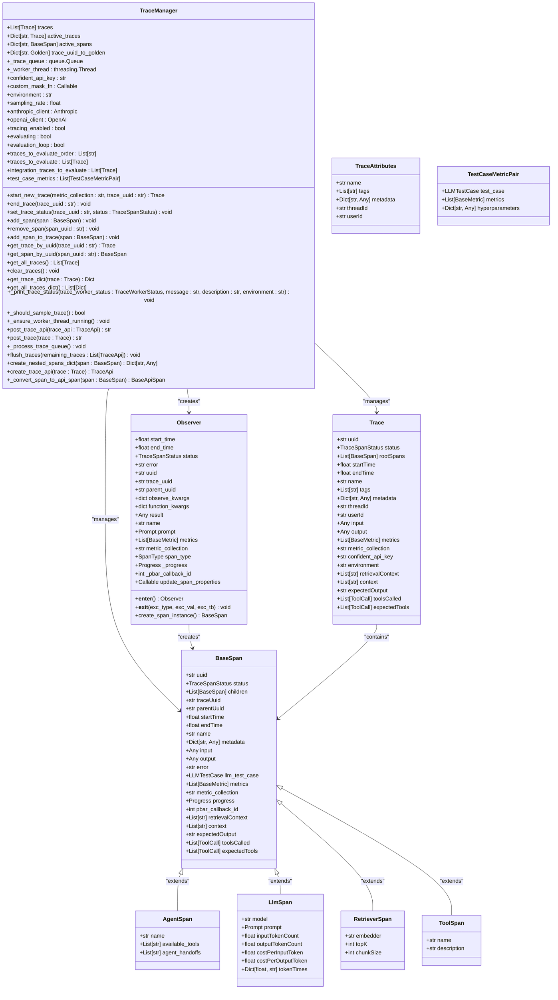
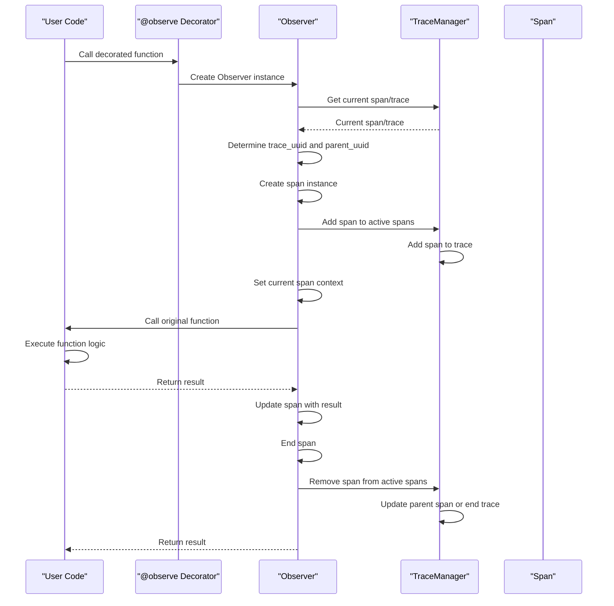
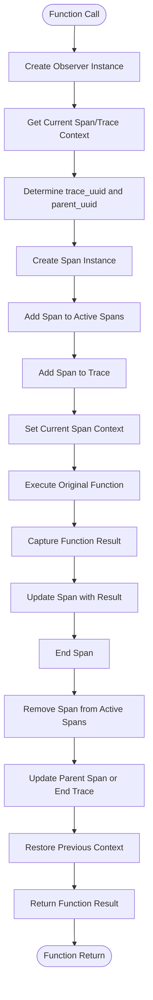
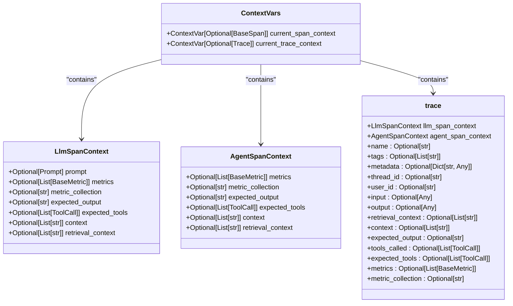
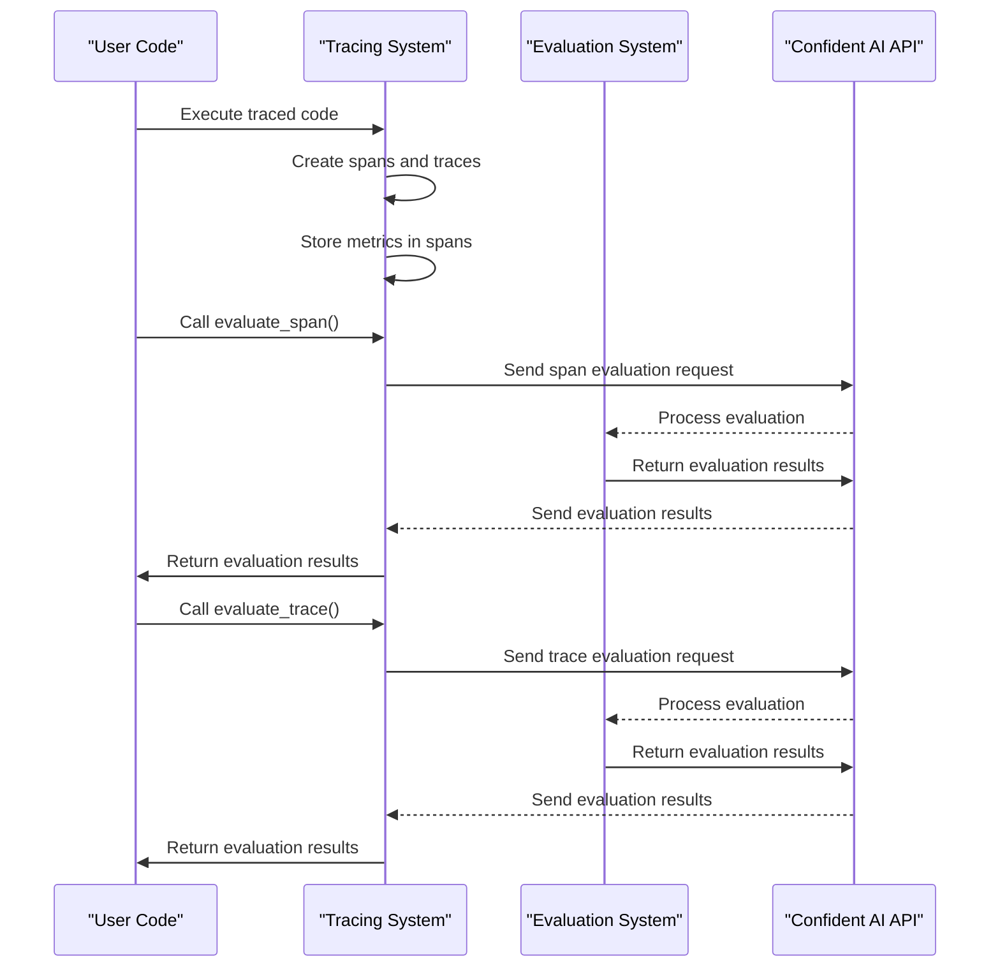
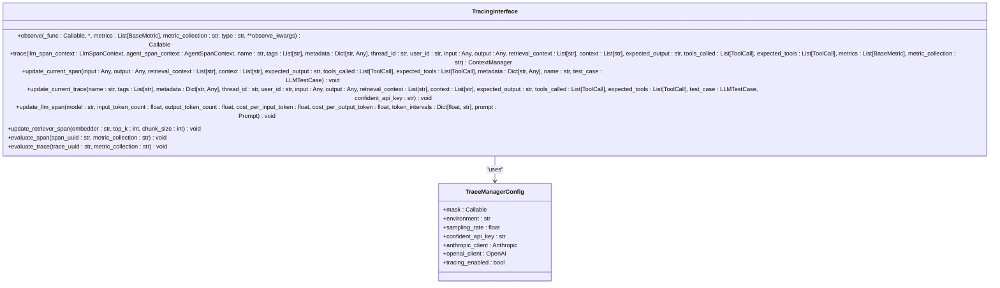

# Component Tracing

<cite>
**Referenced Files in This Document**   
- [tracing.py](file://deepeval/tracing/tracing.py)
- [context.py](file://deepeval/tracing/context.py)
- [types.py](file://deepeval/tracing/types.py)
- [trace_context.py](file://deepeval/tracing/trace_context.py)
- [api.py](file://deepeval/tracing/api.py)
- [utils.py](file://deepeval/tracing/utils.py)
- [patchers.py](file://deepeval/tracing/patchers.py)
- [offline_evals/span.py](file://deepeval/tracing/offline_evals/span.py)
- [offline_evals/trace.py](file://deepeval/tracing/offline_evals/trace.py)
</cite>

## Table of Contents
1. [Introduction](#introduction)
2. [Architecture Overview](#architecture-overview)
3. [The @observe Decorator](#the-observe-decorator)
4. [Span Management](#span-management)
5. [Tracing Context and Propagation](#tracing-context-and-propagation)
6. [Integration with Evaluation Workflows](#integration-with-evaluation-workflows)
7. [Public Interfaces and Configuration](#public-interfaces-and-configuration)
8. [Practical Examples](#practical-examples)
9. [Common Issues and Solutions](#common-issues-and-solutions)
10. [Performance Considerations](#performance-considerations)
11. [Best Practices](#best-practices)

## Introduction

Component tracing in DeepEval provides a comprehensive system for granular evaluation of individual components within LLM applications. This capability enables developers and evaluators to monitor, analyze, and optimize the performance of specific components such as LLM calls, retrievers, tools, and agents. The tracing system captures detailed information about each component's execution, including inputs, outputs, metadata, and performance metrics, allowing for precise evaluation and debugging.

The primary purpose of component tracing is to enable component-level evaluation, which is essential for understanding the behavior and performance of complex LLM applications. By instrumenting individual components with the `@observe` decorator, developers can create spans that represent the execution of these components. These spans are organized into traces, which represent the complete execution flow of an application or a specific workflow.

The tracing system in DeepEval is designed to be non-intrusive and easy to use, allowing developers to add tracing to their existing code with minimal changes. The system supports both synchronous and asynchronous code, making it suitable for a wide range of applications. Additionally, the tracing system integrates seamlessly with DeepEval's evaluation workflows, enabling automatic evaluation of traced components against predefined metrics.

**Section sources**
- [tracing.py](file://deepeval/tracing/tracing.py#L1044-L1231)
- [types.py](file://deepeval/tracing/types.py#L59-L194)

## Architecture Overview

The component tracing system in DeepEval is built around several key components that work together to provide a comprehensive tracing solution. At the core of the system is the `TraceManager`, which is responsible for managing traces and spans throughout their lifecycle. The `TraceManager` maintains a collection of active traces and spans, handles the creation and completion of traces, and manages the posting of traces to the Confident AI server.



**Diagram sources **
- [tracing.py](file://deepeval/tracing/tracing.py#L81-L794)
- [types.py](file://deepeval/tracing/types.py#L59-L194)

The architecture of the tracing system is designed to be modular and extensible, allowing for easy integration with different components and workflows. The `TraceManager` acts as the central coordinator, managing the lifecycle of traces and spans. The `Observer` class is responsible for creating and managing individual spans, while the various span types (`AgentSpan`, `LlmSpan`, `RetrieverSpan`, `ToolSpan`) provide specialized functionality for different types of components.

The tracing system uses context variables to propagate tracing context across different parts of the application. This allows spans to be automatically linked to their parent spans and traces, creating a hierarchical structure that reflects the execution flow of the application. The system also supports asynchronous code, ensuring that tracing context is properly propagated across await points.

**Section sources**
- [tracing.py](file://deepeval/tracing/tracing.py#L81-L794)
- [types.py](file://deepeval/tracing/types.py#L59-L194)
- [context.py](file://deepeval/tracing/context.py#L9-L159)

## The @observe Decorator

The `@observe` decorator is the primary mechanism for instrumenting code with component tracing in DeepEval. This decorator can be applied to any function or method to create a span that represents its execution. The decorator automatically handles the creation and management of spans, making it easy to add tracing to existing code with minimal changes.



**Diagram sources **
- [tracing.py](file://deepeval/tracing/tracing.py#L1044-L1231)
- [context.py](file://deepeval/tracing/context.py#L9-L159)

The `@observe` decorator supports several parameters that allow developers to customize the behavior of the created span:

- `type`: Specifies the type of span to create (e.g., "agent", "llm", "retriever", "tool"). This parameter determines the specific span class that will be instantiated.
- `metrics`: A list of metrics to evaluate the component against. These metrics will be automatically applied to the span during evaluation.
- `metric_collection`: A string identifier for a collection of metrics to apply to the span.
- Additional keyword arguments can be passed through `**observe_kwargs` to provide type-specific configuration (e.g., `model` for LLM spans, `embedder` for retriever spans).

The decorator handles both synchronous and asynchronous functions, as well as generator functions, ensuring that tracing works seamlessly across different coding patterns. When applied to a function, the decorator wraps the function in a context manager that creates a span when the function is called and closes the span when the function returns or raises an exception.

**Section sources**
- [tracing.py](file://deepeval/tracing/tracing.py#L1044-L1231)
- [types.py](file://deepeval/tracing/types.py#L59-L194)

## Span Management

Span management in DeepEval involves the creation, updating, and lifecycle management of spans throughout the execution of an application. Spans are the fundamental units of tracing, representing individual operations or components within an LLM application. Each span contains metadata about the operation it represents, including its name, type, start and end times, input and output data, and any associated metrics.

The `Observer` class is responsible for managing the lifecycle of spans. When a function decorated with `@observe` is called, an `Observer` instance is created and enters its context. During this process, the observer creates a span instance based on the specified span type and adds it to the active spans collection in the `TraceManager`. The span is then linked to its parent span (if any) and added to the appropriate trace.



**Diagram sources **
- [tracing.py](file://deepeval/tracing/tracing.py#L801-L987)
- [context.py](file://deepeval/tracing/context.py#L9-L159)

Spans can be updated during their lifetime using various utility functions provided by the tracing system. For example, the `update_current_span` function can be used to update the input, output, and metadata of the current span. Similarly, `update_llm_span` and `update_retriever_span` provide specialized functionality for updating LLM and retriever spans with model-specific information such as token counts and embedding details.

The tracing system also supports hierarchical span relationships, where child spans are linked to their parent spans. This allows for the creation of complex execution trees that reflect the actual flow of an application. When a span is closed, the system automatically updates the parent span or completes the trace if the span was a root span.

**Section sources**
- [tracing.py](file://deepeval/tracing/tracing.py#L801-L987)
- [context.py](file://deepeval/tracing/context.py#L18-L159)

## Tracing Context and Propagation

Tracing context propagation is a critical aspect of the component tracing system in DeepEval, ensuring that spans are properly linked and organized into meaningful traces. The system uses Python's `contextvars` module to maintain tracing context across different parts of an application, including across await points in asynchronous code.

The tracing context consists of two main components: the current span context and the current trace context. These are implemented as `ContextVar` instances that store the currently active span and trace, respectively. When a new span is created, it becomes the current span, and when it is closed, the previous span (or None if it was a root span) is restored.



**Diagram sources **
- [context.py](file://deepeval/tracing/context.py#L9-L159)
- [trace_context.py](file://deepeval/tracing/trace_context.py#L1-L108)

The `trace` context manager provides a convenient way to manage tracing context for a block of code. When used, it ensures that a trace is active for the duration of the block, creating a new trace if necessary and properly closing it when the block exits. The context manager also supports passing additional context information, such as LLM-specific parameters or agent-specific configuration, which can be used to enrich the created spans.

For asynchronous code, the system automatically detects the async context and ensures that tracing context is properly propagated across await points. This is achieved through the use of `contextvars`, which are automatically preserved across await points in Python's asyncio event loop.

**Section sources**
- [context.py](file://deepeval/tracing/context.py#L9-L159)
- [trace_context.py](file://deepeval/tracing/trace_context.py#L45-L108)

## Integration with Evaluation Workflows

The component tracing system in DeepEval is tightly integrated with the evaluation workflows, enabling automatic evaluation of traced components against predefined metrics. This integration allows developers to assess the quality and performance of individual components within their LLM applications, providing valuable insights for optimization and improvement.

The integration is achieved through several mechanisms. First, spans can be configured with metrics or metric collections that should be applied during evaluation. These metrics are stored as part of the span's metadata and are automatically applied when the span is evaluated. Second, the tracing system provides functions for explicitly triggering evaluation of spans and traces, allowing for on-demand evaluation at specific points in the application.



**Diagram sources **
- [offline_evals/span.py](file://deepeval/tracing/offline_evals/span.py#L6-L32)
- [offline_evals/trace.py](file://deepeval/tracing/offline_evals/trace.py#L6-L33)
- [api.py](file://deepeval/tracing/api.py#L105-L147)

The evaluation integration supports both synchronous and asynchronous evaluation, allowing for flexible use in different application contexts. The `evaluate_span` and `evaluate_trace` functions can be used to trigger evaluation of individual spans or entire traces, respectively. These functions send the relevant data to the Confident AI API, which processes the evaluation and returns the results.

During evaluation, the system extracts the necessary information from the spans and traces, including inputs, outputs, context, and any other relevant metadata. This information is then used to compute the specified metrics, providing a comprehensive assessment of the component's performance.

**Section sources**
- [offline_evals/span.py](file://deepeval/tracing/offline_evals/span.py#L6-L60)
- [offline_evals/trace.py](file://deepeval/tracing/offline_evals/trace.py#L6-L64)
- [api.py](file://deepeval/tracing/api.py#L105-L147)

## Public Interfaces and Configuration

The component tracing system in DeepEval provides several public interfaces for configuration and interaction. These interfaces allow developers to customize the behavior of the tracing system, access tracing data, and integrate tracing with their applications.

The primary public interfaces are exposed through the `deepeval.tracing` module, which provides access to the main tracing functionality. The key components of this interface include:

- `observe`: The decorator for instrumenting functions with tracing
- `trace`: The context manager for managing tracing context
- `update_current_span`: Function for updating the current span's properties
- `update_current_trace`: Function for updating the current trace's properties
- `update_llm_span`: Function for updating LLM-specific span properties
- `update_retriever_span`: Function for updating retriever-specific span properties
- `evaluate_span`: Function for evaluating a span against metrics
- `evaluate_trace`: Function for evaluating a trace against metrics



**Diagram sources **
- [__init__.py](file://deepeval/tracing/__init__.py#L1-L27)
- [tracing.py](file://deepeval/tracing/tracing.py#L151-L179)
- [context.py](file://deepeval/tracing/context.py#L18-L159)

The tracing system can be configured through the `TraceManager`'s `configure` method, which allows setting various parameters such as the environment, sampling rate, API key, and custom masking function. These configuration options provide fine-grained control over the behavior of the tracing system, allowing it to be tailored to specific use cases and requirements.

Additionally, the system supports environment variables for configuration, making it easy to adjust settings without modifying code. For example, the `CONFIDENT_TRACING_ENABLED` environment variable can be used to enable or disable tracing globally, while `CONFIDENT_TRACE_SAMPLE_RATE` can be used to control the sampling rate for trace posting.

**Section sources**
- [__init__.py](file://deepeval/tracing/__init__.py#L1-L27)
- [tracing.py](file://deepeval/tracing/tracing.py#L151-L179)
- [context.py](file://deepeval/tracing/context.py#L18-L159)
- [utils.py](file://deepeval/tracing/utils.py#L24-L41)

## Practical Examples

This section provides practical examples demonstrating how to use the component tracing system in DeepEval. These examples illustrate common use cases and patterns for instrumenting code with the `@observe` decorator and analyzing component-level performance.

### Basic Tracing Example

The following example shows how to use the `@observe` decorator to trace a simple LLM call:

```python
from deepeval.tracing import observe
from openai import OpenAI

client = OpenAI()

@observe(type="llm", name="OpenAI", model="gpt-4")
def llm_call(input):
    response = client.chat.completions.create(
        model="gpt-4",
        messages=[
            {"role": "system", "content": "You are a helpful assistant."},
            {"role": "user", "content": input},
        ],
    )
    return response.choices[0].message.content
```

**Section sources**
- [tracing.py](file://deepeval/tracing/tracing.py#L1044-L1231)

### Complex Application Example

The following example demonstrates how to trace a more complex application with multiple components:

```python
from deepeval.tracing import observe, trace
from openai import OpenAI

client = OpenAI()

class Chatbot:
    def __init__(self):
        pass

    @observe(type="llm", name="OpenAI", model="gpt-4")
    def llm(self, input):
        response = client.chat.completions.create(
            model="gpt-4",
            messages=[
                {"role": "system", "content": "You are a helpful assistant."},
                {"role": "user", "content": input},
            ],
        )
        return response.choices[0].message.content

    @observe(type="embedding", name="Embedding", model="text-embedding-ada-002")
    def get_embedding(self, input):
        response = (
            client.embeddings.create(
                input=input, model="text-embedding-ada-002"
            )
            .data[0]
            .embedding
        )
        return response

    @observe(type="retriever", name="Retriever")
    def retriever(self, input):
        embedding = self.get_embedding(input)
        # Replace this with an actual vector search that uses embedding
        list_of_retrieved_nodes = ["Retrieval Node 1", "Retrieval Node 2"]
        return list_of_retrieved_nodes

    @observe(type="tool", name="Search")
    def search(self, input):
        # Replace this with an actual function that searches the web
        title_of_the_top_search_results = "Search Result: " + input
        return title_of_the_top_search_results

    @observe(type="tool", name="Format")
    def format(self, retrieval_nodes, input):
        prompt = "You are a helpful assistant, based on the following information: \n"
        for node in retrieval_nodes:
            prompt += node + "\n"
        prompt += "Generate an unbiased response for " + input + "."
        return prompt

    @observe(type="agent", name="Chatbot")
    def query(self, user_input):
        top_result_title = self.search(user_input)
        retrieval_results = self.retriever(top_result_title)
        prompt = self.format(retrieval_results, top_result_title)
        return self.llm(prompt)
```

**Section sources**
- [tracing.py](file://deepeval/tracing/tracing.py#L1044-L1231)
- [context.py](file://deepeval/tracing/context.py#L18-L159)

### Evaluation Integration Example

The following example shows how to integrate tracing with evaluation workflows:

```python
import pytest
from deepeval import assert_test
from deepeval.test_case import LLMTestCase
from deepeval.metrics import HallucinationMetric

chatbot = Chatbot()

def test_hallucination():
    context = [
        "Be a natural-born citizen of the United States.",
        "Be at least 35 years old.",
        "Have been a resident of the United States for 14 years.",
    ]
    input = "What are the requirements to be president?"

    metric = HallucinationMetric(threshold=0.8)
    test_case = LLMTestCase(
        input=input,
        actual_output=chatbot.query(user_input=input),
        context=context,
    )
    assert_test(test_case, [metric])
```

**Section sources**
- [tracing.py](file://deepeval/tracing/tracing.py#L1044-L1231)
- [offline_evals/span.py](file://deepeval/tracing/offline_evals/span.py#L6-L60)

## Common Issues and Solutions

This section addresses common issues that developers may encounter when implementing component tracing in DeepEval and provides solutions for each issue.

### Issue 1: Missing or Incorrect Span Hierarchy

One common issue is when spans are not properly linked in a hierarchical structure, resulting in a flat trace with no parent-child relationships. This can occur when the tracing context is not properly propagated across function calls.

**Solution**: Ensure that all functions that should be part of the same trace are properly decorated with the `@observe` decorator. The tracing system automatically handles parent-child relationships when functions are called within the same execution context.

```python
# Correct usage
@observe(type="agent", name="MainAgent")
def main_agent(input):
    # This span will be a child of the main_agent span
    result = helper_function(input)
    return result

@observe(type="tool", name="Helper")
def helper_function(input):
    # Implementation
    pass
```

**Section sources**
- [tracing.py](file://deepeval/tracing/tracing.py#L837-L987)
- [context.py](file://deepeval/tracing/context.py#L9-L159)

### Issue 2: Performance Overhead

Tracing can introduce performance overhead, especially when tracing a large number of components or when the tracing system is configured to post all traces to the server.

**Solution**: Use sampling to reduce the number of traces that are posted to the server. The `CONFIDENT_TRACE_SAMPLE_RATE` environment variable can be used to set the sampling rate (a value between 0 and 1). Additionally, consider disabling tracing in production environments or using it selectively for specific components.

```python
# Configure sampling rate
trace_manager.configure(sampling_rate=0.1)  # Only post 10% of traces
```

**Section sources**
- [tracing.py](file://deepeval/tracing/tracing.py#L116-L117)
- [utils.py](file://deepeval/tracing/utils.py#L36-L41)

### Issue 3: Memory Leaks

In long-running applications, the accumulation of active traces and spans can lead to memory leaks.

**Solution**: Ensure that all traces are properly closed by using the `@observe` decorator or the `trace` context manager. The tracing system automatically cleans up completed traces, but incomplete traces will remain in memory.

```python
# Use context manager to ensure trace is properly closed
with trace(name="MyTrace"):
    # Traced code
    pass
# Trace is automatically closed when exiting the context
```

**Section sources**
- [tracing.py](file://deepeval/tracing/tracing.py#L216-L269)
- [trace_context.py](file://deepeval/tracing/trace_context.py#L45-L108)

## Performance Considerations

When implementing component tracing in DeepEval, several performance considerations should be taken into account to ensure that the tracing system does not negatively impact the performance of the application.

### Tracing Overhead

The primary performance consideration is the overhead introduced by tracing itself. Each span creation and update operation requires CPU and memory resources, and posting traces to the server involves network I/O. The overhead can be minimized by:

- Using selective instrumentation: Only trace components that are critical for evaluation or debugging.
- Configuring appropriate sampling rates: Use the `sampling_rate` parameter to control the percentage of traces that are posted to the server.
- Disabling tracing in production: Use environment variables to disable tracing in production environments where it is not needed.

### Memory Usage

The tracing system maintains in-memory collections of active traces and spans, which can consume significant memory in applications with high concurrency or long-running traces. To manage memory usage:

- Ensure that traces are properly closed: Use the `@observe` decorator or `trace` context manager to ensure that traces are automatically closed.
- Monitor memory usage: Regularly monitor the memory usage of the application and adjust tracing configuration as needed.
- Use streaming evaluation: For long-running applications, consider using streaming evaluation to process traces in batches rather than keeping them all in memory.

### Network Latency

Posting traces to the Confident AI server involves network communication, which can introduce latency. To minimize the impact of network latency:

- Use asynchronous posting: The tracing system uses a background worker thread to post traces asynchronously, preventing blocking of the main application thread.
- Configure appropriate flush behavior: Use the `CONFIDENT_TRACE_FLUSH` environment variable to control whether remaining traces are flushed when the application exits.
- Implement retry logic: The system automatically handles retry logic for failed trace postings, but developers should be aware of potential delays.

**Section sources**
- [tracing.py](file://deepeval/tracing/tracing.py#L95-L104)
- [utils.py](file://deepeval/tracing/utils.py#L24-L41)

## Best Practices

This section outlines best practices for using component tracing in DeepEval to maximize its effectiveness while minimizing potential issues.

### Selective Instrumentation

Instrument only the components that are critical for evaluation or debugging. Over-instrumentation can lead to excessive overhead and make it difficult to identify important information in the traces.

```python
# Good: Instrument only key components
@observe(type="agent", name="MainAgent")
def main_agent(input):
    pass

@observe(type="llm", name="ResponseGenerator")
def generate_response(input):
    pass
```

### Meaningful Naming

Use descriptive names for spans and traces to make them easily identifiable in the tracing interface.

```python
# Good: Descriptive names
@observe(type="llm", name="UserQueryResponse")
def handle_user_query(input):
    pass

# Avoid: Generic names
@observe(type="llm", name="Function1")
def handle_user_query(input):
    pass
```

### Proper Error Handling

Ensure that errors in traced components are properly captured and reported in the spans.

```python
@observe(type="llm", name="ResponseGenerator")
def generate_response(input):
    try:
        # Implementation
        pass
    except Exception as e:
        # The @observe decorator automatically captures exceptions
        raise
```

### Environment-Specific Configuration

Use different tracing configurations for different environments (development, staging, production).

```python
# Development: Full tracing for debugging
trace_manager.configure(environment="development", sampling_rate=1.0)

# Production: Minimal tracing for performance
trace_manager.configure(environment="production", sampling_rate=0.1)
```

### Regular Monitoring

Regularly monitor the tracing system's performance and adjust configuration as needed.

```python
# Monitor trace queue size
queue_size = trace_manager._trace_queue.qsize()
if queue_size > 1000:
    print(f"Warning: Large number of unprocessed traces: {queue_size}")
```

**Section sources**
- [tracing.py](file://deepeval/tracing/tracing.py#L151-L179)
- [utils.py](file://deepeval/tracing/utils.py#L24-L41)