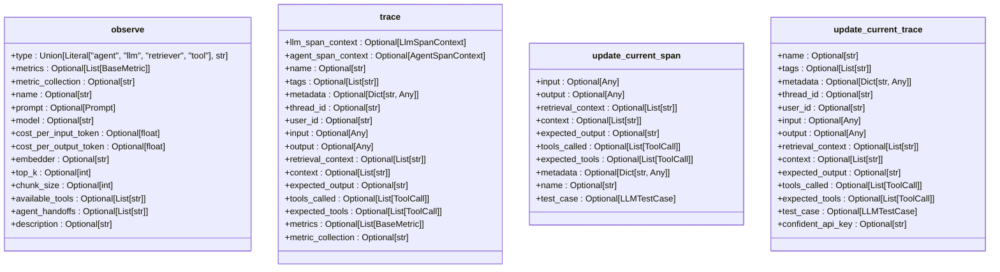
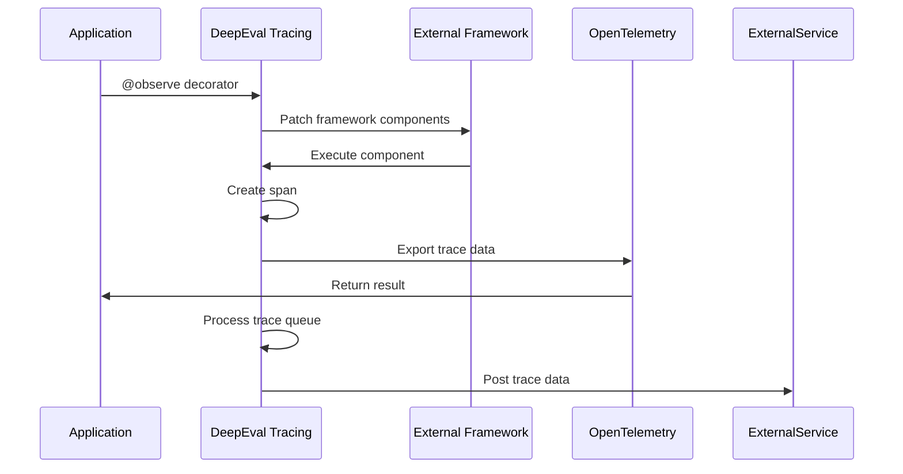

# Component Tracing

<cite>
**Referenced Files in This Document**   
- [tracing.py](file://deepeval/tracing/tracing.py)
- [context.py](file://deepeval/tracing/context.py)
- [types.py](file://deepeval/tracing/types.py)
- [api.py](file://deepeval/tracing/api.py)
- [utils.py](file://deepeval/tracing/utils.py)
- [trace_context.py](file://deepeval/tracing/trace_context.py)
- [integrations/pydantic_ai/otel.py](file://deepeval/integrations/pydantic_ai/otel.py)
- [examples/tracing/test_chatbot.py](file://examples/tracing/test_chatbot.py)
- [examples/tracing/crewai_tracing.ipynb](file://examples/tracing/crewai_tracing.ipynb)
</cite>

## Table of Contents
1. [Introduction](#introduction)
2. [Architecture Overview](#architecture-overview)
3. [Implementation Details](#implementation-details)
4. [Public Interfaces](#public-interfaces)
5. [Integration with External Frameworks](#integration-with-external-frameworks)
6. [Performance Considerations](#performance-considerations)
7. [Best Practices](#best-practices)

## Introduction
Component Tracing in DeepEval provides a comprehensive system for granular evaluation of individual components within LLM applications. The system enables detailed monitoring and analysis of application components through the @observe decorator, which captures execution data including inputs, outputs, and metadata. This tracing capability is essential for understanding component behavior, identifying performance bottlenecks, and evaluating the effectiveness of different parts of an LLM application. The tracing system integrates with OpenTelemetry for standardized observability and supports various component types such as agents, LLMs, retrievers, and tools, allowing for structured analysis of complex LLM workflows.

**Section sources**
- [tracing.py](file://deepeval/tracing/tracing.py#L1-L1231)
- [context.py](file://deepeval/tracing/context.py#L1-L159)

## Architecture Overview
The Component Tracing architecture in DeepEval is built around a hierarchical span-based model that captures the execution flow of LLM applications. At the core of the system is the TraceManager class, which maintains active traces and spans, manages their lifecycle, and handles the posting of trace data to external services. The architecture uses context variables to maintain the current trace and span context across asynchronous operations, ensuring that trace data is correctly associated even in complex execution scenarios.

The system implements a worker thread pattern for trace processing, where completed traces are added to a queue and processed asynchronously to avoid blocking the main application thread. This design includes rate limiting and sampling capabilities to control the volume of trace data sent to external services. The architecture also supports trace testing mode, where traces are stored locally instead of being posted to external services, facilitating development and testing workflows.

```mermaid
graph TD
A[Application Code] --> B[@observe Decorator]
B --> C[Observer Context Manager]
C --> D[TraceManager]
D --> E[Active Traces]
D --> F[Active Spans]
D --> G[Trace Queue]
G --> H[Worker Thread]
H --> I[Confident AI API]
H --> J[OpenTelemetry Exporter]
K[Context Variables] --> C
K --> D
L[External Frameworks] --> B
M[LLM Providers] --> B
```

**Diagram sources**
- [tracing.py](file://deepeval/tracing/tracing.py#L81-L794)
- [context.py](file://deepeval/tracing/context.py#L9-L15)
- [utils.py](file://deepeval/tracing/utils.py#L1-L203)

## Implementation Details
The tracing system captures component execution data through the Observer context manager, which is instantiated by the @observe decorator. When a decorated function is called, the Observer creates a new span with a unique identifier and establishes parent-child relationships with existing spans in the call hierarchy. The system captures function inputs through signature binding, which preserves parameter names and values, and captures outputs after function execution.

For asynchronous functions, the system uses asyncio task bindings to maintain trace context across await points, ensuring that trace data remains consistent even when execution is suspended and resumed. The implementation includes special handling for generator functions, both synchronous and asynchronous, to capture streaming outputs while maintaining proper span lifecycle management.

Span data is serialized using a custom JSON serializer that handles circular references and non-serializable objects by replacing them with placeholder values. This ensures that trace data can be reliably transmitted to external services without serialization errors. The system also implements a sampling mechanism that randomly selects traces for reporting based on a configurable sampling rate, helping to manage data volume in production environments.

**Section sources**
- [tracing.py](file://deepeval/tracing/tracing.py#L800-L1231)
- [utils.py](file://deepeval/tracing/utils.py#L43-L94)

## Public Interfaces
The primary public interface for Component Tracing is the @observe decorator, which accepts several parameters to customize tracing behavior. The decorator supports a type parameter to specify the component type (agent, llm, retriever, or tool), allowing for specialized data collection based on component category. Additional parameters include metrics for associating evaluation metrics with the component, metric_collection for grouping related metrics, and various observe_kwargs for component-specific configuration.

The trace context manager provides an alternative interface for more complex tracing scenarios, allowing developers to explicitly manage trace boundaries and associate contextual data with traces. This interface supports parameters for trace naming, tagging, metadata, and user identification, enabling rich contextual information to be captured alongside execution data.

The system also exposes utility functions for updating span and trace properties during execution, such as update_current_span and update_current_trace, which allow for dynamic modification of trace data based on runtime conditions. These functions enable developers to add contextual information to traces as it becomes available during component execution.



**Diagram sources**
- [tracing.py](file://deepeval/tracing/tracing.py#L1045-L1231)
- [trace_context.py](file://deepeval/tracing/trace_context.py#L45-L108)
- [context.py](file://deepeval/tracing/context.py#L18-L115)

## Integration with External Frameworks
DeepEval's Component Tracing system provides seamless integration with popular LLM frameworks such as LangChain, LlamaIndex, and CrewAI through specialized patchers and handlers. These integrations automatically instrument framework components to capture execution data without requiring manual decoration of individual functions. For example, the LangChain integration uses callback handlers to capture chain, LLM, and tool execution data, while the LlamaIndex integration uses event handlers to monitor retriever and agent operations.

The system also supports integration with OpenTelemetry through the pydantic_ai.otel module, which enables tracing data to be exported to OpenTelemetry-compatible backends. This integration allows DeepEval trace data to be combined with other observability data in existing monitoring systems, providing a comprehensive view of application performance and behavior.

For frameworks that support OpenTelemetry natively, DeepEval can leverage existing instrumentation while adding its specialized LLM evaluation capabilities. This hybrid approach ensures that trace data is consistent across different parts of an application, whether they are instrumented by DeepEval directly or through other means.



**Diagram sources**
- [integrations/pydantic_ai/otel.py](file://deepeval/integrations/pydantic_ai/otel.py#L1-L61)
- [integrations/langchain/callback.py](file://deepeval/integrations/langchain/callback.py#L82-L124)
- [integrations/llama_index/handler.py](file://deepeval/integrations/llama_index/handler.py#L275-L301)

## Performance Considerations
The Component Tracing system includes several performance optimizations to minimize overhead in production environments. The asynchronous worker thread pattern ensures that trace processing does not block the main application thread, while rate limiting prevents excessive API calls to external services. The sampling mechanism allows developers to control the volume of trace data collected, reducing both network bandwidth and storage costs.

In high-throughput scenarios, developers can disable tracing entirely by setting the CONFIDENT_TRACING_ENABLED environment variable to "NO", or configure a low sampling rate to collect representative data without overwhelming system resources. The system also includes a flush mechanism that ensures trace data is not lost when the application terminates, with configurable behavior for handling unprocessed traces.

For applications with strict performance requirements, the tracing system can be configured to collect only essential data, reducing the overhead of data serialization and transmission. The context variable-based design minimizes memory usage by avoiding the creation of redundant context objects, and the weak reference-based task binding system prevents memory leaks in long-running applications.

**Section sources**
- [tracing.py](file://deepeval/tracing/tracing.py#L95-L104)
- [utils.py](file://deepeval/tracing/utils.py#L36-L41)

## Best Practices
When using Component Tracing in development environments, it is recommended to enable verbose logging and disable sampling to capture comprehensive data for debugging and optimization. Developers should use meaningful names for traces and spans to facilitate analysis, and leverage the tagging and metadata features to add contextual information that can be used for filtering and grouping in the analysis interface.

In production environments, best practices include configuring an appropriate sampling rate based on traffic volume and budget constraints, and using the flush mechanism to ensure trace data is not lost during application restarts. Developers should also monitor the trace queue size and worker thread performance to identify potential bottlenecks in the tracing system.

For applications with multiple components, it is recommended to use consistent naming conventions and tagging strategies to enable effective cross-component analysis. When integrating with external frameworks, developers should review the automatic instrumentation to ensure it captures the necessary data, and supplement it with manual @observe decorators where needed for specialized components.

**Section sources**
- [tracing.py](file://deepeval/tracing/tracing.py#L130-L143)
- [examples/tracing/test_chatbot.py](file://examples/tracing/test_chatbot.py#L1-L93)
- [examples/tracing/crewai_tracing.ipynb](file://examples/tracing/crewai_tracing.ipynb#L1-L155)