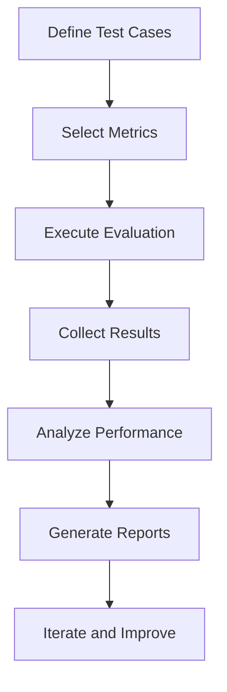
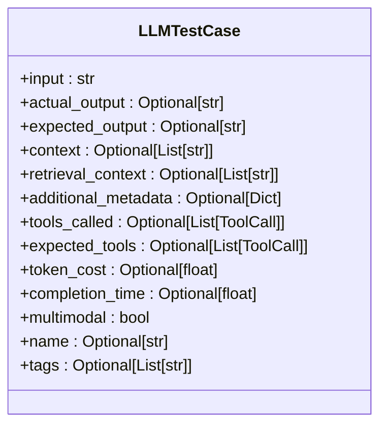
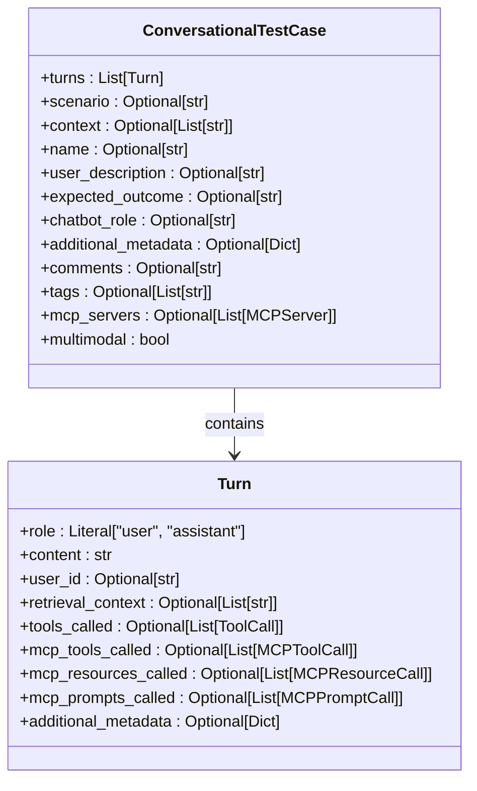
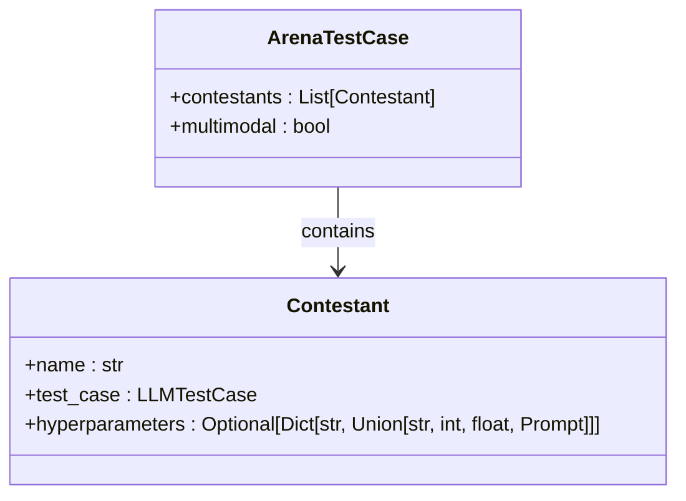
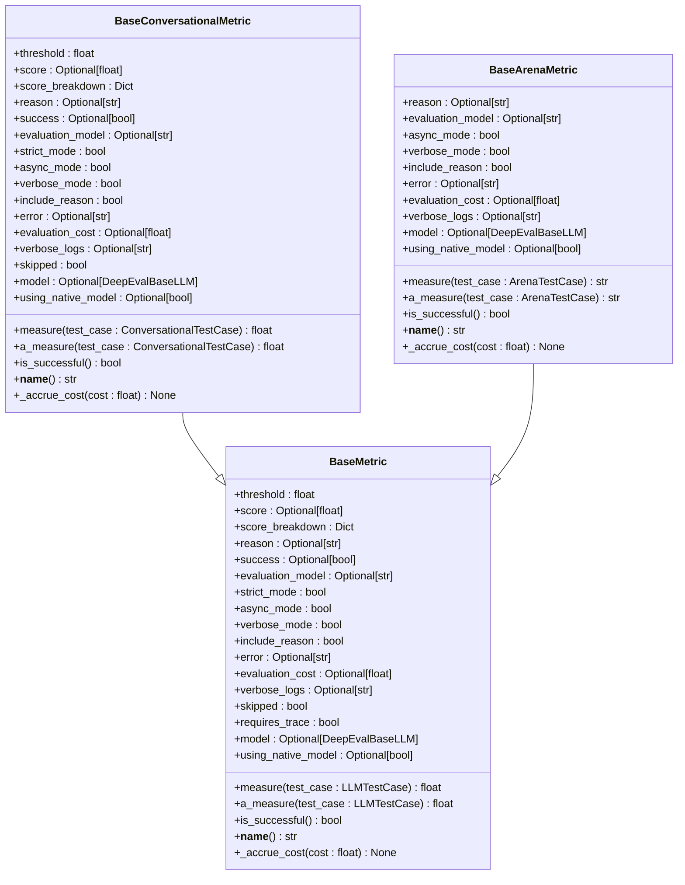
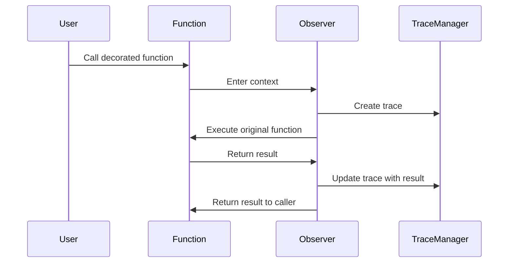

# Core Concepts

<cite>
**Referenced Files in This Document**   
- [llm_test_case.py](file://deepeval/test_case/llm_test_case.py)
- [base_metric.py](file://deepeval/metrics/base_metric.py)
- [tracing.py](file://deepeval/tracing/tracing.py)
- [golden.py](file://deepeval/dataset/golden.py)
- [conversational_test_case.py](file://deepeval/test_case/conversational_test_case.py)
- [arena_test_case.py](file://deepeval/test_case/arena_test_case.py)
- [evaluate.py](file://deepeval/evaluate/evaluate.py)
- [types.py](file://deepeval/evaluate/types.py)
</cite>

## Table of Contents
1. [Introduction](#introduction)
2. [LLM Evaluation Methodology](#llm-evaluation-methodology)
3. [Test Case Types](#test-case-types)
4. [Metrics System](#metrics-system)
5. [Core Abstractions](#core-abstractions)
6. [Implementation Details](#implementation-details)
7. [Practical Examples](#practical-examples)
8. [Performance Considerations](#performance-considerations)
9. [Best Practices](#best-practices)
10. [Common Issues and Solutions](#common-issues-and-solutions)

## Introduction

The DeepEval framework provides a comprehensive system for evaluating large language models (LLMs) through structured test cases, metrics, and tracing capabilities. This document explains the fundamental concepts of the framework, focusing on the architecture and implementation of key components that enable robust LLM evaluation. The framework is designed to support various evaluation scenarios, from simple single-turn interactions to complex multi-turn conversations and competitive arena evaluations.

## LLM Evaluation Methodology

DeepEval's evaluation methodology is built around the concept of structured test cases that capture the inputs, outputs, and context of LLM interactions. The framework supports multiple evaluation paradigms, including unit testing of individual LLM responses, conversational evaluation across multiple turns, and competitive evaluation in an arena setting where multiple models are compared on the same inputs.

The evaluation process follows a systematic approach:
1. **Test Case Creation**: Define test cases with inputs, expected outputs, and relevant context
2. **Metric Selection**: Choose appropriate metrics based on the evaluation goals
3. **Execution**: Run the evaluation against the LLM application
4. **Analysis**: Collect and analyze results, including scores, reasons, and costs
5. **Reporting**: Generate comprehensive reports and visualizations

The framework supports both synchronous and asynchronous evaluation modes, allowing for efficient processing of large test datasets. It also provides integration with Confident AI for cloud-based evaluation and analysis.



**Diagram sources**
- [evaluate.py](file://deepeval/evaluate/evaluate.py#L185-L323)
- [types.py](file://deepeval/evaluate/types.py#L1-L38)

## Test Case Types

DeepEval supports several types of test cases to accommodate different evaluation scenarios. The primary test case types are LLMTestCase, ConversationalTestCase, and ArenaTestCase, each designed for specific use cases.

### LLMTestCase

The LLMTestCase is the fundamental building block for evaluating single-turn LLM interactions. It captures the essential components of an LLM evaluation scenario, including input, actual output, expected output, context, and retrieval context. This test case type is ideal for unit testing specific aspects of LLM behavior.

Key parameters of LLMTestCase include:
- **input**: The prompt or query provided to the LLM
- **actual_output**: The response generated by the LLM
- **expected_output**: The desired or reference response
- **context**: Additional context provided to the LLM
- **retrieval_context**: Retrieved documents or information used in RAG scenarios
- **tools_called**: Tools invoked by the LLM during execution
- **expected_tools**: Tools expected to be called



**Diagram sources**
- [llm_test_case.py](file://deepeval/test_case/llm_test_case.py#L301-L373)

### ConversationalTestCase

The ConversationalTestCase extends the basic test case model to support multi-turn conversations. It consists of a series of Turn objects, each representing a single exchange in the conversation. This test case type is essential for evaluating chatbots and conversational agents where context accumulates across multiple interactions.

Key components of ConversationalTestCase include:
- **turns**: A list of Turn objects representing the conversation history
- **scenario**: The overall scenario or goal of the conversation
- **context**: Global context applicable to the entire conversation
- **expected_outcome**: The desired outcome of the conversation
- **chatbot_role**: The role the chatbot should assume

Each Turn contains:
- **role**: The participant (user or assistant)
- **content**: The message content
- **retrieval_context**: Context retrieved for this turn
- **tools_called**: Tools called during this turn



**Diagram sources**
- [conversational_test_case.py](file://deepeval/test_case/conversational_test_case.py#L131-L267)

### ArenaTestCase

The ArenaTestCase enables competitive evaluation by comparing multiple LLMs or configurations on the same inputs. This test case type is particularly valuable for A/B testing, model selection, and hyperparameter optimization. It allows for head-to-head comparisons in a controlled environment.

Key components of ArenaTestCase include:
- **contestants**: A list of Contestant objects, each representing a different model or configuration
- **multimodal**: Flag indicating if the test case involves multimodal inputs

Each Contestant contains:
- **name**: Identifier for the contestant
- **test_case**: The LLMTestCase representing this contestant's performance
- **hyperparameters**: Configuration parameters for this contestant

The arena evaluation ensures that all contestants receive the same input and expected output, providing a fair comparison. This approach is particularly effective for identifying subtle differences in model behavior and performance.



**Diagram sources**
- [arena_test_case.py](file://deepeval/test_case/arena_test_case.py#L19-L48)

## Metrics System

DeepEval's metrics system provides a comprehensive framework for evaluating various aspects of LLM performance. The system is built around a hierarchy of base metric classes that define the interface and common functionality for all metrics.

### Base Metric Classes

The metrics system is organized around three primary base classes:

- **BaseMetric**: The foundation for all non-conversational metrics
- **BaseConversationalMetric**: Extends BaseMetric for conversational evaluation
- **BaseArenaMetric**: Specialized for arena-style competitive evaluations

These base classes define the essential properties and methods that all metrics must implement, ensuring consistency across the framework.

### Metric Properties

All metrics in DeepEval share a common set of properties that provide detailed evaluation results:

- **threshold**: The minimum score required for a test to pass
- **score**: The calculated evaluation score (0.0 to 1.0)
- **score_breakdown**: Detailed breakdown of the score components
- **reason**: Explanation of the evaluation result
- **success**: Boolean indicating if the test passed
- **evaluation_model**: The model used for evaluation
- **strict_mode**: Whether strict evaluation criteria are applied
- **async_mode**: Whether asynchronous evaluation is enabled
- **verbose_mode**: Whether detailed output is enabled
- **include_reason**: Whether to include reasoning in results
- **error**: Any error encountered during evaluation
- **evaluation_cost**: Computational cost of the evaluation
- **verbose_logs**: Detailed logs for debugging
- **skipped**: Whether the metric was skipped
- **requires_trace**: Whether tracing is required



**Diagram sources**
- [base_metric.py](file://deepeval/metrics/base_metric.py#L13-L134)

### Available Metrics

DeepEval provides a wide range of built-in metrics categorized by their evaluation focus:

**Core Metrics**
- GEval: General evaluation using custom criteria
- AnswerRelevancyMetric: Measures relevance of answers to questions
- FaithfulnessMetric: Evaluates factual consistency with source documents
- ContextualRecallMetric: Measures how well the response covers relevant context
- ContextualRelevancyMetric: Assesses relevance of retrieved context to the query

**Content Quality Metrics**
- HallucinationMetric: Detects factual inaccuracies and fabrications
- BiasMetric: Identifies biased language and perspectives
- ToxicityMetric: Detects toxic or harmful content
- SummarizationMetric: Evaluates quality of text summarization

**Safety and Compliance Metrics**
- PIILeakageMetric: Detects personally identifiable information leakage
- NonAdviceMetric: Identifies inappropriate advice
- MisuseMetric: Detects potential misuse of the system
- RoleViolationMetric: Checks for violations of assigned roles

**Task-Specific Metrics**
- ToolCorrectnessMetric: Validates correct tool usage
- JsonCorrectnessMetric: Verifies JSON output correctness
- PromptAlignmentMetric: Measures alignment with prompt instructions
- TaskCompletionMetric: Evaluates task completion success

**Agentic Metrics**
- TopicAdherenceMetric: Assesses adherence to conversation topics
- StepEfficiencyMetric: Measures efficiency of task execution steps
- PlanAdherenceMetric: Evaluates adherence to planned actions
- PlanQualityMetric: Assesses quality of planning
- ToolUseMetric: Evaluates appropriate tool usage
- GoalAccuracyMetric: Measures accuracy in achieving goals

**Conversational Metrics**
- TurnRelevancyMetric: Evaluates relevance of individual conversation turns
- ConversationCompletenessMetric: Assesses overall conversation completeness
- TurnFaithfulnessMetric: Measures factual consistency in conversation turns
- TurnContextualPrecisionMetric: Evaluates precision of context usage in turns

## Core Abstractions

### LLMTestCase

The LLMTestCase class is the fundamental abstraction for representing a single LLM evaluation scenario. It extends Pydantic's BaseModel to provide type safety and validation. The class is designed to capture all relevant information about an LLM interaction in a structured format.

Key features of LLMTestCase include:
- **Flexible parameter naming**: Supports both snake_case and camelCase parameter names through Pydantic's AliasChoices
- **Automatic multimodal detection**: Detects multimodal content (images) in inputs and outputs
- **Validation**: Comprehensive validation of input parameters
- **Extensibility**: Support for additional metadata and custom fields

The class handles various data types and structures, including text, tool calls, and multimodal content. It also provides private attributes for internal tracking and management, such as _trace_dict for tracing information and _identifier for unique identification.

### BaseMetric

The BaseMetric class serves as the foundation for all evaluation metrics in DeepEval. It defines the contract that all metrics must follow, ensuring consistency in implementation and usage. The abstract base class requires concrete implementations to provide measure and a_measure methods for synchronous and asynchronous evaluation, respectively.

Key aspects of BaseMetric include:
- **Abstract methods**: measure and a_measure must be implemented by concrete metrics
- **Common properties**: Standardized properties for scores, reasons, and status
- **Cost tracking**: Built-in support for tracking evaluation costs
- **Configuration**: Support for various evaluation modes and settings

The class hierarchy allows for specialization while maintaining a consistent interface. For example, BaseConversationalMetric extends BaseMetric with additional capabilities for evaluating multi-turn conversations.

### @observe Decorator

The @observe decorator is a key component of DeepEval's tracing system. It enables automatic collection of execution traces for decorated functions, providing valuable insights into LLM application behavior. The decorator works by wrapping the target function and creating a trace context that captures inputs, outputs, and execution metadata.

Key features of the @observe decorator include:
- **Automatic tracing**: Creates traces without requiring manual instrumentation
- **Context preservation**: Maintains trace context across function calls
- **Metadata collection**: Captures function parameters and return values
- **Integration with evaluation**: Connects traces to test cases for comprehensive analysis

The decorator supports both synchronous and asynchronous functions, making it versatile for different application architectures. It also provides configuration options for customizing trace collection behavior.



**Diagram sources**
- [tracing.py](file://deepeval/tracing/tracing.py#L1180-L1231)

## Implementation Details

### LLMTestCase Implementation

The LLMTestCase implementation leverages Pydantic's validation system to ensure data integrity. The class uses model_validator decorators to perform both pre-validation (before model creation) and post-validation (after model creation) checks.

The pre-validation validator (validate_input) ensures that all parameters meet type requirements and structural constraints. For example, it verifies that context and retrieval_context are lists of strings, and that tools_called and expected_tools are lists of ToolCall objects.

The post-validation validator (set_is_multimodal) automatically detects multimodal content by searching for image placeholders in the input, output, and context fields. This automatic detection simplifies the process of working with multimodal test cases.

The class also implements custom equality and hashing methods for ToolCall objects, which are used within LLMTestCase. These methods handle complex data structures by converting them to hashable representations, enabling proper comparison and storage in sets and dictionaries.

### BaseMetric Implementation

The BaseMetric implementation follows the template method pattern, where the base class defines the overall structure and concrete subclasses implement specific evaluation logic. The abstract measure and a_measure methods define the interface for synchronous and asynchronous evaluation.

The implementation includes several utility methods:
- **_accrue_cost**: Updates the total evaluation cost
- **is_successful**: Determines if the evaluation passed based on the score and threshold
- **__name__**: Provides a human-readable name for the metric

The class supports both strict and non-strict evaluation modes. In strict mode, the evaluation must meet the threshold exactly, while in non-strict mode, close results may be considered successful.

### Tracing Implementation

The tracing system is implemented using Python's context managers and decorators. The @observe decorator creates an Observer context manager that handles the trace lifecycle. When a decorated function is called, the observer:

1. Creates a new trace or continues an existing one
2. Captures function inputs and metadata
3. Executes the original function
4. Captures the function result
5. Updates the trace with execution details
6. Cleans up the trace context

The implementation uses Python's inspect module to capture function arguments and their values, even when passed as *args or **kwargs. This ensures comprehensive trace data collection.

## Practical Examples

### Basic Evaluation Workflow

```python
from deepeval import evaluate
from deepeval.metrics import GEval
from deepeval.test_case import LLMTestCase

# Create a test case
test_case = LLMTestCase(
    input="What is the capital of France?",
    actual_output="The capital of France is Paris.",
    expected_output="Paris"
)

# Define metrics
metrics = [
    GEval(
        name="Factuality",
        criteria="The response should contain accurate factual information.",
        evaluation_params=[LLMTestCaseParams.INPUT, LLMTestCaseParams.ACTUAL_OUTPUT]
    )
]

# Run evaluation
results = evaluate([test_case], metrics)
```

### Conversational Evaluation

```python
from deepeval.test_case import ConversationalTestCase, Turn

# Create a multi-turn conversation
conversation = ConversationalTestCase(
    turns=[
        Turn(role="user", content="Hello, how are you?"),
        Turn(role="assistant", content="I'm doing well, thank you! How can I help you today?"),
        Turn(role="user", content="Can you tell me about renewable energy?"),
        Turn(role="assistant", content="Renewable energy comes from natural sources that are constantly replenished...")
    ],
    scenario="Customer service chatbot interaction",
    expected_outcome="Provide accurate information about renewable energy"
)

# Evaluate with conversational metrics
from deepeval.metrics import ConversationCompletenessMetric

results = evaluate([conversation], [ConversationCompletenessMetric(threshold=0.7)])
```

### Arena Evaluation

```python
from deepeval.test_case import ArenaTestCase, Contestant
from deepeval.metrics import ArenaGEval

# Create contestants
contestant1 = Contestant(
    name="Model A",
    test_case=LLMTestCase(
        input="Explain quantum computing",
        actual_output="Quantum computing uses quantum bits or qubits..."
    )
)

contestant2 = Contestant(
    name="Model B",
    test_case=LLMTestCase(
        input="Explain quantum computing",
        actual_output="Quantum computers leverage quantum mechanics to process information..."
    )
)

# Create arena test case
arena_test = ArenaTestCase(contestants=[contestant1, contestant2])

# Evaluate in arena
results = evaluate([arena_test], [ArenaGEval(criteria="Clarity and accuracy")])
```

### Tracing with @observe

```python
from deepeval import observe

@observe()
def chatbot_response(user_input: str) -> str:
    # Simulate LLM call
    response = f"Thank you for asking about {user_input}. Here's what I know..."
    return response

# The function call will be automatically traced
response = chatbot_response("climate change")
```

## Performance Considerations

When working with large test datasets, several performance considerations should be addressed:

### Batch Processing

For large datasets, process test cases in batches to optimize memory usage and execution time. The framework supports asynchronous evaluation, which can significantly improve throughput when evaluating multiple test cases.

```python
# Process in batches
batch_size = 100
for i in range(0, len(large_dataset), batch_size):
    batch = large_dataset[i:i + batch_size]
    results = evaluate(batch, metrics)
    # Process results
```

### Caching

Enable caching to avoid redundant evaluations, especially when running the same tests repeatedly during development. The framework provides built-in caching mechanisms that can be configured through the CacheConfig.

### Asynchronous Evaluation

Leverage asynchronous evaluation for improved performance when evaluating multiple test cases. This allows concurrent execution of independent evaluations, reducing overall execution time.

```python
from deepeval.evaluate.configs import AsyncConfig

results = evaluate(
    test_cases,
    metrics,
    async_config=AsyncConfig(run_async=True, max_concurrent=50)
)
```

### Resource Management

Monitor and manage computational resources, especially when using external LLM APIs. The framework provides cost tracking through the evaluation_cost property, which can help identify expensive evaluations.

## Best Practices

### Structuring Evaluations

Organize evaluations by purpose and complexity:
- **Unit tests**: Focus on specific aspects of LLM behavior
- **Integration tests**: Evaluate end-to-end workflows
- **Regression tests**: Ensure consistent behavior over time
- **Performance tests**: Measure response times and resource usage

### Metric Selection

Choose metrics based on your specific evaluation goals:
- Use GEval for custom evaluation criteria
- Combine multiple metrics for comprehensive assessment
- Select domain-specific metrics for specialized applications
- Balance thoroughness with evaluation cost

### Test Case Design

Create effective test cases by:
- Including diverse examples that cover edge cases
- Using realistic inputs and scenarios
- Providing clear expected outputs
- Documenting test case purpose and rationale

### Continuous Evaluation

Integrate evaluation into your development workflow:
- Run evaluations in CI/CD pipelines
- Track performance over time
- Set up alerts for significant changes
- Regularly update test cases to reflect changing requirements

## Common Issues and Solutions

### Missing Parameters

When a metric requires parameters that are not present in the test case, the evaluation may fail or produce unexpected results.

**Solution**: Use the ErrorConfig to control behavior when parameters are missing:

```python
from deepeval.evaluate.configs import ErrorConfig

results = evaluate(
    test_cases,
    metrics,
    error_config=ErrorConfig(skip_on_missing_params=True)
)
```

### Type Validation Errors

Incorrect data types can cause validation errors during test case creation.

**Solution**: Ensure all parameters have the correct types and structure:

```python
# Correct
test_case = LLMTestCase(
    input="What is AI?",
    context=["Artificial intelligence is..."],  # List of strings
    tools_called=[ToolCall(name="search", input_parameters={"query": "AI"})]  # List of ToolCall objects
)

# Incorrect
test_case = LLMTestCase(
    input="What is AI?",
    context="Artificial intelligence is...",  # String instead of list
    tools_called={"name": "search"}  # Dict instead of ToolCall object
)
```

### Tracing Issues

Traces may not be captured correctly in complex application architectures.

**Solution**: Ensure proper context propagation and use the @observe decorator consistently:

```python
# Ensure traces are properly nested
@observe()
def parent_function():
    @observe()
    def child_function():
        return "result"
    
    return child_function()
```

### Performance Bottlenecks

Large test datasets or complex metrics can lead to slow evaluation times.

**Solution**: Optimize performance through batching, caching, and asynchronous evaluation:

```python
from deepeval.evaluate.configs import AsyncConfig, CacheConfig

results = evaluate(
    large_test_set,
    complex_metrics,
    async_config=AsyncConfig(run_async=True, max_concurrent=20),
    cache_config=CacheConfig(use_cache=True)
)
```