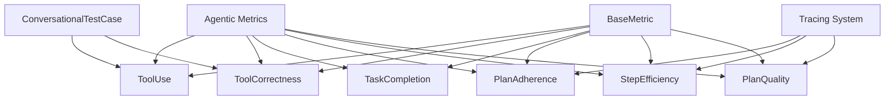
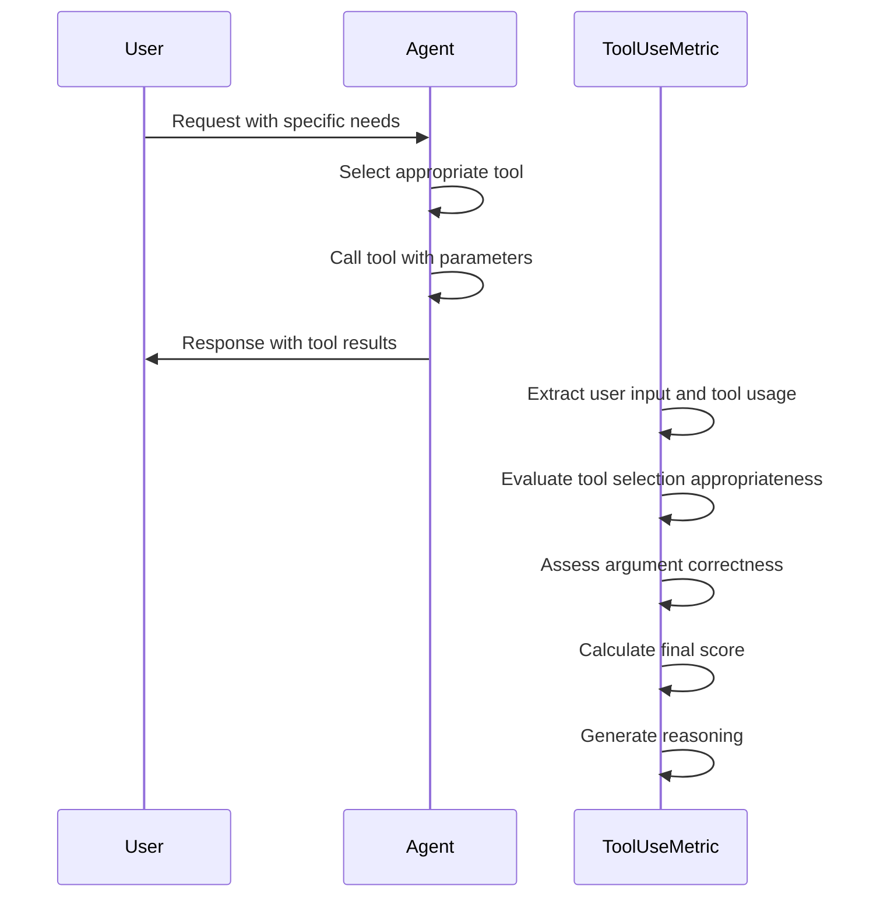
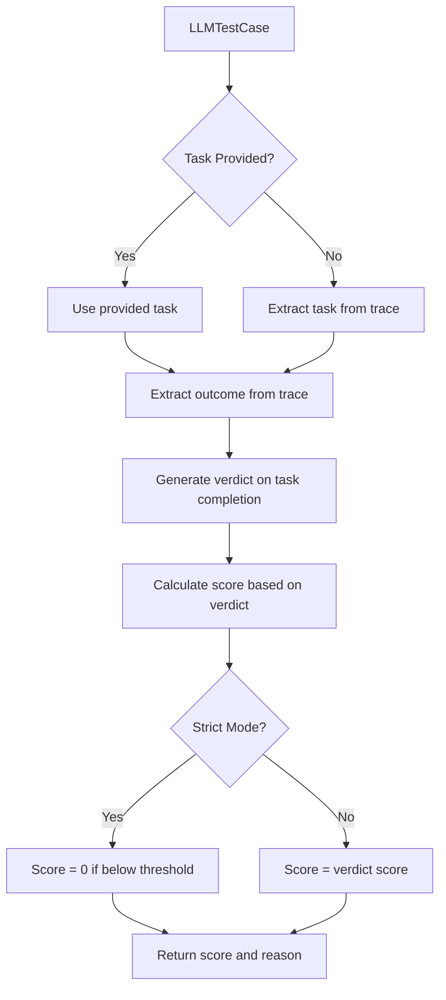
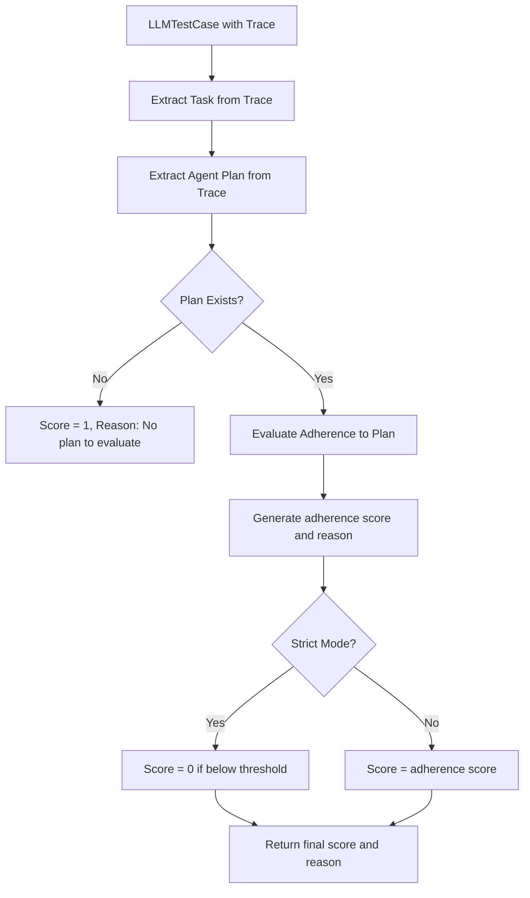
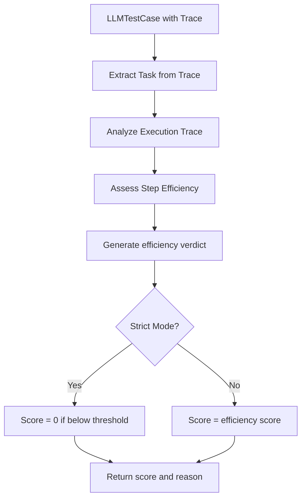
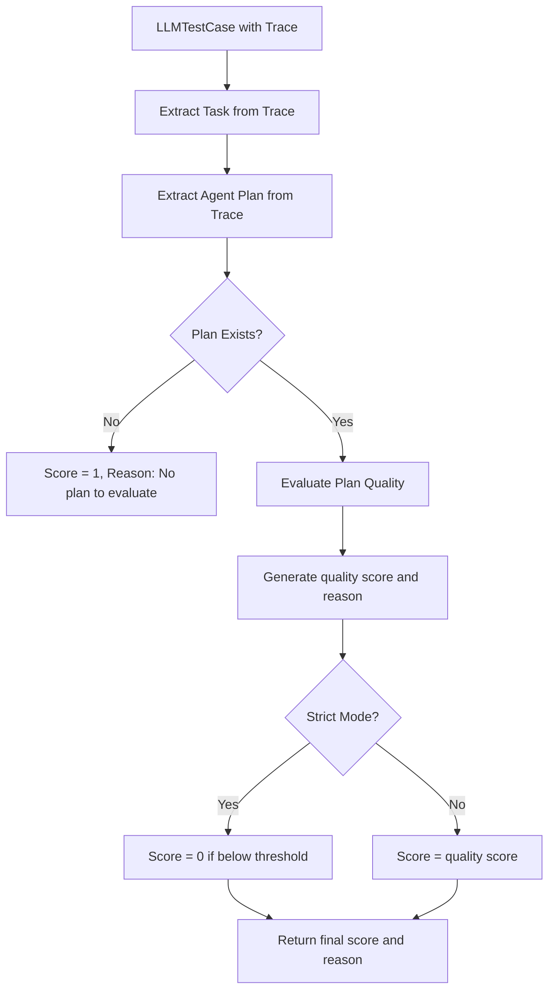
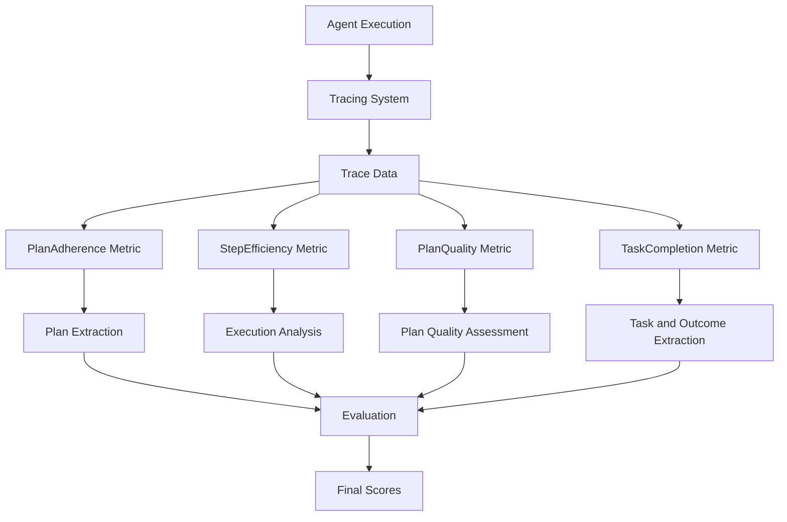
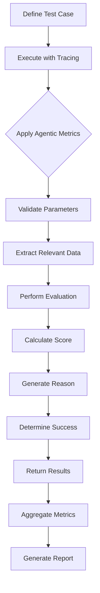
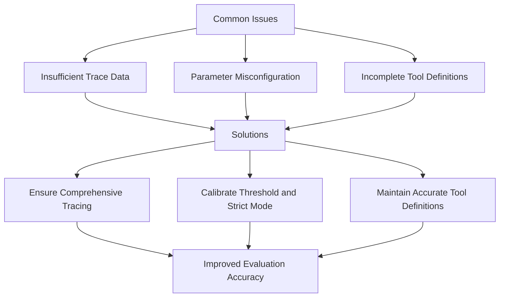

# Agentic Metrics

<cite>
**Referenced Files in This Document**   
- [tool_use.py](file://deepeval/metrics/tool_use/tool_use.py)
- [tool_correctness.py](file://deepeval/metrics/tool_correctness/tool_correctness.py)
- [task_completion.py](file://deepeval/metrics/task_completion/task_completion.py)
- [plan_adherence.py](file://deepeval/metrics/plan_adherence/plan_adherence.py)
- [step_efficiency.py](file://deepeval/metrics/step_efficiency/step_efficiency.py)
- [plan_quality.py](file://deepeval/metrics/plan_quality/plan_quality.py)
- [llm_test_case.py](file://deepeval/test_case/llm_test_case.py)
- [conversational_test_case.py](file://deepeval/test_case/conversational_test_case.py)
- [base_metric.py](file://deepeval/metrics/base_metric.py)
</cite>

## Table of Contents
1. [Introduction](#introduction)
2. [Core Agentic Metrics](#core-agentic-metrics)
3. [ToolUse Metric](#tooluse-metric)
4. [ToolCorrectness Metric](#toolcorrectness-metric)
5. [TaskCompletion Metric](#taskcompletion-metric)
6. [PlanAdherence Metric](#planadherence-metric)
7. [StepEfficiency Metric](#stepefficiency-metric)
8. [PlanQuality Metric](#planquality-metric)
9. [Integration with Tracing System](#integration-with-tracing-system)
10. [Evaluation Workflow](#evaluation-workflow)
11. [Common Issues and Solutions](#common-issues-and-solutions)
12. [Conclusion](#conclusion)

## Introduction

Agentic Metrics in DeepEval are specialized evaluation tools designed to assess the behavior and capabilities of AI agents that perform complex, multi-step tasks. These metrics go beyond traditional single-response evaluation by analyzing an agent's ability to use tools correctly, complete tasks effectively, adhere to plans, and execute efficiently. The agentic evaluation framework is particularly important for assessing AI systems that operate as autonomous agents, making decisions and taking actions across multiple steps to achieve goals.

The agentic metrics suite includes several key components: ToolUse, ToolCorrectness, TaskCompletion, PlanAdherence, StepEfficiency, and PlanQuality. Each metric addresses a specific aspect of agent behavior, providing a comprehensive assessment framework. These metrics work in conjunction with DeepEval's tracing system, which captures the execution flow of agents, enabling detailed analysis of multi-step workflows.

The implementation of these metrics follows a consistent pattern, inheriting from base metric classes and implementing standardized interfaces. They leverage large language models to evaluate agent performance, generating scores and detailed reasoning for each assessment. The metrics are designed to be flexible, with configurable thresholds and evaluation parameters, while providing clear success/failure determinations based on the threshold.

**Section sources**
- [tool_use.py](file://deepeval/metrics/tool_use/tool_use.py#L1-L435)
- [tool_correctness.py](file://deepeval/metrics/tool_correctness/tool_correctness.py#L1-L526)

## Core Agentic Metrics

The agentic metrics in DeepEval form a comprehensive framework for evaluating AI agent behaviors across multiple dimensions. These metrics are specifically designed to assess complex agent capabilities that go beyond simple response quality evaluation. The core agentic metrics include ToolUse, ToolCorrectness, TaskCompletion, PlanAdherence, StepEfficiency, and PlanQuality, each addressing a critical aspect of agent performance.

These metrics are implemented as specialized classes that inherit from DeepEval's base metric classes, following a consistent interface and pattern. They are designed to work with both single-turn and multi-turn evaluation scenarios, leveraging the conversational test case structure for multi-step workflows. The metrics integrate with DeepEval's tracing system, which captures the execution flow of agents, enabling detailed analysis of planning, tool usage, and task execution patterns.

The agentic metrics share common parameters such as threshold, model, include_reason, async_mode, strict_mode, and verbose_mode, providing a consistent interface across different metric types. The threshold parameter determines the minimum score required for a successful evaluation, while the model parameter specifies the LLM used for evaluation. The include_reason parameter controls whether detailed reasoning is generated, and async_mode enables asynchronous evaluation for improved performance.



**Diagram sources**
- [tool_use.py](file://deepeval/metrics/tool_use/tool_use.py#L30-L435)
- [tool_correctness.py](file://deepeval/metrics/tool_correctness/tool_correctness.py#L26-L526)
- [task_completion.py](file://deepeval/metrics/task_completion/task_completion.py#L26-L254)
- [plan_adherence.py](file://deepeval/metrics/plan_adherence/plan_adherence.py#L29-L267)
- [step_efficiency.py](file://deepeval/metrics/step_efficiency/step_efficiency.py#L22-L225)
- [plan_quality.py](file://deepeval/metrics/plan_quality/plan_quality.py#L32-L269)
- [base_metric.py](file://deepeval/metrics/base_metric.py#L13-L134)

**Section sources**
- [tool_use.py](file://deepeval/metrics/tool_use/tool_use.py#L1-L435)
- [tool_correctness.py](file://deepeval/metrics/tool_correctness/tool_correctness.py#L1-L526)
- [task_completion.py](file://deepeval/metrics/task_completion/task_completion.py#L1-L254)

## ToolUse Metric

The ToolUse metric evaluates an agent's ability to select appropriate tools and use them correctly in response to user inputs. This metric assesses both tool selection appropriateness and argument correctness when tools are invoked. It is particularly valuable for evaluating agents that have access to multiple tools and must decide which ones to use in different contexts.

The ToolUseMetric class implements this evaluation by analyzing conversational test cases, examining the sequence of user inputs and agent responses that include tool calls. The metric takes several parameters: available_tools (a list of ToolCall objects representing the tools available to the agent), threshold (the minimum score required for success), model (the LLM used for evaluation), include_reason (whether to generate detailed reasoning), async_mode (whether to evaluate asynchronously), strict_mode (whether to enforce strict evaluation), and verbose_mode (whether to generate detailed logs).

The evaluation process involves several steps. First, the metric extracts user inputs and corresponding tool usages from the conversational turns. Then, it evaluates tool selection by determining whether the chosen tools are appropriate for the given user input. Next, it assesses argument correctness by verifying that the parameters passed to the tools are correct and relevant. The final score is the minimum of the tool selection score and argument correctness score, ensuring that both aspects must be satisfactory for a high overall score.



**Diagram sources**
- [tool_use.py](file://deepeval/metrics/tool_use/tool_use.py#L30-L435)

**Section sources**
- [tool_use.py](file://deepeval/metrics/tool_use/tool_use.py#L1-L435)

## ToolCorrectness Metric

The ToolCorrectness metric evaluates whether an AI agent correctly uses specified tools with appropriate parameters and expected outcomes. This metric is essential for verifying that agents not only select the right tools but also invoke them with correct arguments and handle their outputs appropriately. It provides a detailed assessment of tool usage accuracy, which is critical for reliable agent behavior.

The ToolCorrectnessMetric class implements this evaluation by comparing the tools actually called by the agent against the expected tools for a given input. The metric accepts several parameters: available_tools (optional list of tools available to the agent), threshold (minimum score for success), evaluation_params (specific aspects to evaluate such as input parameters or output), model (LLM for evaluation), include_reason (whether to generate reasoning), async_mode (asynchronous evaluation), strict_mode (strict evaluation enforcement), verbose_mode (detailed logging), should_exact_match (whether to require exact matches), and should_consider_ordering (whether tool call order matters).

The evaluation process involves multiple comparison strategies. When should_exact_match is true, the metric requires identical tool names, parameters, and outputs in the same order. When should_consider_ordering is true, it uses a weighted longest common subsequence algorithm to account for tool call order. Otherwise, it performs a non-exact match evaluation that considers tool names and parameters without regard to order. The final score is determined by the minimum of the tool calling score and tool selection score, ensuring comprehensive evaluation.

```mermaid
flowchart TD
A[Input and Tools] --> B{Exact Match?}
B --> |Yes| C[Compare tool names, parameters, and outputs exactly]
B --> |No| D{Consider Ordering?}
D --> |Yes| E[Use weighted LCS algorithm for ordered comparison]
D --> |No| F[Compare tools without regard to order]
C --> G[Calculate tool calling score]
E --> G
F --> G
G --> H[Evaluate tool selection against available tools]
H --> I[Final Score = min(tool calling score, tool selection score)]
```

**Diagram sources**
- [tool_correctness.py](file://deepeval/metrics/tool_correctness/tool_correctness.py#L26-L526)

**Section sources**
- [tool_correctness.py](file://deepeval/metrics/tool_correctness/tool_correctness.py#L1-L526)

## TaskCompletion Metric

The TaskCompletion metric evaluates whether an AI agent successfully completes the tasks it is assigned. This metric focuses on the agent's ability to achieve the desired outcome based on the initial task or goal. It is particularly useful for assessing goal-oriented agents that need to accomplish specific objectives rather than just providing informative responses.

The TaskCompletionMetric class implements this evaluation by extracting the task and outcome from the agent's interaction, then assessing whether the outcome satisfies the task requirements. The metric accepts parameters including threshold (minimum score for success), task (optional explicit task description), model (LLM for evaluation), include_reason (whether to generate reasoning), async_mode (asynchronous evaluation), strict_mode (strict evaluation enforcement), and verbose_mode (detailed logging).

The evaluation process begins by extracting the task and outcome from the test case. If a task is not explicitly provided, the metric attempts to infer it from the input and trace data. The metric then generates a verdict on whether the outcome completes the task, producing both a score and a reason. The score is determined by the verdict, with the final result adjusted based on the strict_mode setting. This metric requires trace data to properly analyze the agent's execution flow and outcomes.



**Diagram sources**
- [task_completion.py](file://deepeval/metrics/task_completion/task_completion.py#L26-L254)

**Section sources**
- [task_completion.py](file://deepeval/metrics/task_completion/task_completion.py#L1-L254)

## PlanAdherence Metric

The PlanAdherence metric evaluates how well an AI agent follows a predefined plan during its execution. This metric is crucial for assessing agents that are expected to follow specific workflows or reasoning patterns to accomplish tasks. It measures the degree to which the agent's actual execution aligns with the intended plan, providing insights into the agent's reliability and predictability.

The PlanAdherenceMetric class implements this evaluation by extracting the agent's plan from the trace data and comparing it to the actual execution flow. The metric accepts parameters including threshold (minimum score for success), model (LLM for evaluation), include_reason (whether to generate reasoning), async_mode (asynchronous evaluation), strict_mode (strict evaluation enforcement), and verbose_mode (detailed logging). This metric requires trace data to access the agent's planning and execution information.

The evaluation process involves several steps. First, the metric extracts the task from the trace data using the StepEfficiencyTemplate. Then, it extracts the agent's plan from the trace using the PlanAdherenceTemplate. If no plan is found in the trace, the metric returns a score of 1 with an explanatory reason. Otherwise, it evaluates the adherence of the actual execution to the extracted plan by analyzing the trace data in relation to the task and plan. The final score reflects the degree of adherence, with lower scores indicating significant deviations from the planned approach.



**Diagram sources**
- [plan_adherence.py](file://deepeval/metrics/plan_adherence/plan_adherence.py#L29-L267)

**Section sources**
- [plan_adherence.py](file://deepeval/metrics/plan_adherence/plan_adherence.py#L1-L267)

## StepEfficiency Metric

The StepEfficiency metric evaluates the efficiency of an AI agent's execution by assessing whether it accomplishes tasks with an optimal number of steps. This metric is important for identifying agents that may be taking unnecessarily long or convoluted paths to achieve their goals, which can impact performance and resource usage. It measures the agent's ability to execute tasks concisely and effectively.

The StepEfficiencyMetric class implements this evaluation by analyzing the agent's trace data to determine the efficiency of its execution. The metric accepts parameters including threshold (minimum score for success), model (LLM for evaluation), include_reason (whether to generate reasoning), async_mode (asynchronous evaluation), strict_mode (strict evaluation enforcement), and verbose_mode (detailed logging). Like other agentic metrics that analyze execution flow, this metric requires trace data to access the agent's step-by-step execution.

The evaluation process begins by extracting the task from the trace data using the StepEfficiencyTemplate. Then, it analyzes the entire execution trace to assess the efficiency of the steps taken. The metric evaluates whether the agent used a reasonable number of steps to accomplish the task, identifying any redundant or unnecessary actions. The final score reflects the efficiency of the execution, with higher scores indicating more efficient task completion. The metric also generates a detailed reason explaining the efficiency assessment.



**Diagram sources**
- [step_efficiency.py](file://deepeval/metrics/step_efficiency/step_efficiency.py#L22-L225)

**Section sources**
- [step_efficiency.py](file://deepeval/metrics/step_efficiency/step_efficiency.py#L1-L225)

## PlanQuality Metric

The PlanQuality metric evaluates the quality of an AI agent's planning process, assessing whether the agent develops effective and coherent plans to accomplish tasks. Unlike PlanAdherence, which measures how well an agent follows a plan, PlanQuality focuses on the inherent quality of the plan itself, regardless of whether it was followed perfectly. This metric is essential for assessing an agent's strategic thinking and planning capabilities.

The PlanQualityMetric class implements this evaluation by extracting the agent's plan from the trace data and assessing its quality in relation to the task. The metric accepts parameters including threshold (minimum score for success), model (LLM for evaluation), include_reason (whether to generate reasoning), async_mode (asynchronous evaluation), strict_mode (strict evaluation enforcement), and verbose_mode (detailed logging). This metric requires trace data to access the agent's planning information, as the plan is typically generated during the agent's reasoning process.

The evaluation process involves extracting both the task and the agent's plan from the trace data. The task is extracted using the StepEfficiencyTemplate, while the plan is extracted using the PlanAdherenceTemplate. If no plan is found in the trace, the metric returns a score of 1 with an explanatory reason. Otherwise, it evaluates the quality of the plan by analyzing how well it addresses the task requirements, considering factors such as completeness, logical flow, and appropriateness of the planned steps. The final score reflects the overall quality of the plan.



**Diagram sources**
- [plan_quality.py](file://deepeval/metrics/plan_quality/plan_quality.py#L32-L269)

**Section sources**
- [plan_quality.py](file://deepeval/metrics/plan_quality/plan_quality.py#L1-L269)

## Integration with Tracing System

The agentic metrics in DeepEval are tightly integrated with the tracing system, which captures detailed information about an agent's execution flow. This integration is essential for evaluating multi-step workflows and complex agent behaviors that cannot be assessed from isolated responses. The tracing system records the sequence of operations, tool calls, planning steps, and reasoning processes, providing the comprehensive context needed for agentic evaluation.

The integration works through the _trace_dict private attribute in the LLMTestCase class, which stores the trace data for an agent's execution. Metrics like PlanAdherence, StepEfficiency, and PlanQuality directly access this trace data to extract information about the agent's planning and execution. The tracing system captures various types of information, including LLM spans, retriever spans, and custom spans that represent different stages of agent processing.

This integration enables the evaluation of complex agent behaviors by providing a complete picture of the agent's decision-making process. For example, the PlanAdherence metric can analyze whether an agent followed its intended plan by examining the trace data, while the StepEfficiency metric can assess the conciseness of the agent's execution path. The trace data also supports the extraction of tasks and outcomes for the TaskCompletion metric, allowing for comprehensive evaluation of goal achievement.



**Diagram sources**
- [llm_test_case.py](file://deepeval/test_case/llm_test_case.py#L367-L373)
- [plan_adherence.py](file://deepeval/metrics/plan_adherence/plan_adherence.py#L86-L94)
- [step_efficiency.py](file://deepeval/metrics/step_efficiency/step_efficiency.py#L79-L80)
- [plan_quality.py](file://deepeval/metrics/plan_quality/plan_quality.py#L89-L90)
- [task_completion.py](file://deepeval/metrics/task_completion/task_completion.py#L90-L93)

**Section sources**
- [llm_test_case.py](file://deepeval/test_case/llm_test_case.py#L1-L543)
- [conversational_test_case.py](file://deepeval/test_case/conversational_test_case.py#L1-L267)

## Evaluation Workflow

The evaluation workflow for agentic metrics in DeepEval follows a standardized pattern that ensures consistent and reliable assessment of agent behaviors. This workflow begins with the creation of test cases that represent specific scenarios for agent evaluation, followed by the execution of these test cases and the application of relevant metrics to assess performance.

The workflow starts with defining the test case, which can be either an LLMTestCase for single-turn evaluation or a ConversationalTestCase for multi-turn scenarios. The test case includes the necessary inputs, expected outputs, tools, and other parameters required for evaluation. When evaluating agents with complex behaviors, the test case is executed with tracing enabled to capture the detailed execution flow.

Once the test case execution is complete, the agentic metrics are applied to assess different aspects of agent performance. The metrics follow a common evaluation pattern: they first validate the required parameters, then extract relevant information from the test case and trace data, perform the specific evaluation logic, calculate a score, and generate a reason for the assessment. The final score is compared against the threshold to determine success, with the strict_mode parameter influencing this determination.



**Diagram sources**
- [tool_use.py](file://deepeval/metrics/tool_use/tool_use.py#L56-L134)
- [tool_correctness.py](file://deepeval/metrics/tool_correctness/tool_correctness.py#L58-L167)
- [task_completion.py](file://deepeval/metrics/task_completion/task_completion.py#L58-L110)
- [plan_adherence.py](file://deepeval/metrics/plan_adherence/plan_adherence.py#L54-L118)
- [step_efficiency.py](file://deepeval/metrics/step_efficiency/step_efficiency.py#L47-L103)
- [plan_quality.py](file://deepeval/metrics/plan_quality/plan_quality.py#L57-L121)

**Section sources**
- [tool_use.py](file://deepeval/metrics/tool_use/tool_use.py#L1-L435)
- [tool_correctness.py](file://deepeval/metrics/tool_correctness/tool_correctness.py#L1-L526)
- [task_completion.py](file://deepeval/metrics/task_completion/task_completion.py#L1-L254)

## Common Issues and Solutions

When working with agentic metrics in DeepEval, several common issues may arise, particularly related to trace data availability, parameter configuration, and evaluation accuracy. Understanding these issues and their solutions is essential for effective agent evaluation.

One common issue is insufficient trace data, which can prevent metrics like PlanAdherence, StepEfficiency, and PlanQuality from functioning properly. These metrics require detailed execution traces to analyze agent behavior, but some agent frameworks may not provide comprehensive tracing by default. The solution is to ensure that the agent implementation includes proper tracing instrumentation and that all relevant steps, including planning and tool usage, are captured in the trace.

Another issue is misconfiguration of evaluation parameters, particularly the threshold and strict_mode settings. Setting the threshold too high may result in overly strict evaluations that fail good agents, while setting it too low may allow poor performance to pass. The strict_mode parameter can also significantly impact results, as it forces scores below the threshold to zero. The solution is to carefully calibrate these parameters based on the specific use case and to test with a variety of scenarios to ensure appropriate sensitivity.

A third common issue is incomplete tool definitions, which can affect the accuracy of ToolUse and ToolCorrectness metrics. If the available_tools parameter does not accurately reflect the tools accessible to the agent, the evaluation may produce misleading results. The solution is to maintain up-to-date tool definitions that match the agent's actual capabilities and to validate these definitions regularly.



**Diagram sources**
- [plan_adherence.py](file://deepeval/metrics/plan_adherence/plan_adherence.py#L88-L90)
- [tool_use.py](file://deepeval/metrics/tool_use/tool_use.py#L38-L45)
- [tool_correctness.py](file://deepeval/metrics/tool_correctness/tool_correctness.py#L37-L46)

**Section sources**
- [plan_adherence.py](file://deepeval/metrics/plan_adherence/plan_adherence.py#L1-L267)
- [tool_use.py](file://deepeval/metrics/tool_use/tool_use.py#L1-L435)
- [tool_correctness.py](file://deepeval/metrics/tool_correctness/tool_correctness.py#L1-L526)

## Conclusion

The agentic metrics in DeepEval provide a comprehensive framework for evaluating the complex behaviors and capabilities of AI agents. These metrics—ToolUse, ToolCorrectness, TaskCompletion, PlanAdherence, StepEfficiency, and PlanQuality—address different aspects of agent performance, enabling thorough assessment of multi-step workflows and autonomous decision-making processes.

The implementation of these metrics follows a consistent pattern, inheriting from base metric classes and providing standardized interfaces for evaluation. They leverage large language models to generate scores and detailed reasoning, offering both quantitative assessment and qualitative insights into agent behavior. The metrics are designed to be flexible, with configurable parameters that allow adaptation to different evaluation scenarios and requirements.

The integration with DeepEval's tracing system is a key strength of the agentic metrics, enabling the analysis of complete execution flows rather than isolated responses. This integration allows for the evaluation of planning, tool usage, and task completion in the context of the agent's overall behavior, providing a more accurate and comprehensive assessment of agent capabilities.

By using these agentic metrics, developers and researchers can gain valuable insights into the strengths and weaknesses of AI agents, identify areas for improvement, and ensure that agents perform reliably and effectively in complex, real-world scenarios. The metrics support both development and production use cases, helping to build more capable, trustworthy, and efficient AI systems.

**Section sources**
- [tool_use.py](file://deepeval/metrics/tool_use/tool_use.py#L1-L435)
- [tool_correctness.py](file://deepeval/metrics/tool_correctness/tool_correctness.py#L1-L526)
- [task_completion.py](file://deepeval/metrics/task_completion/task_completion.py#L1-L254)