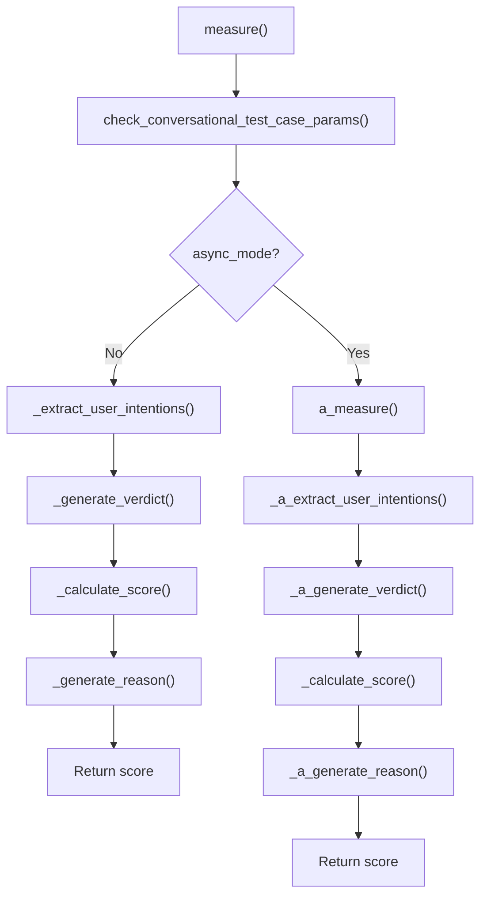
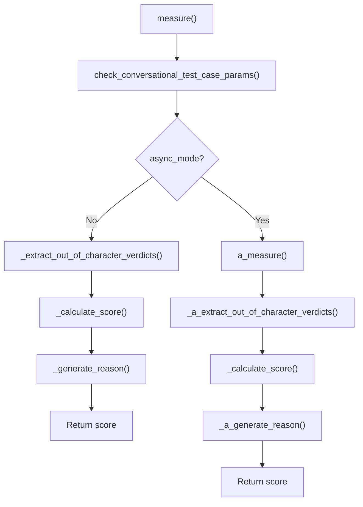
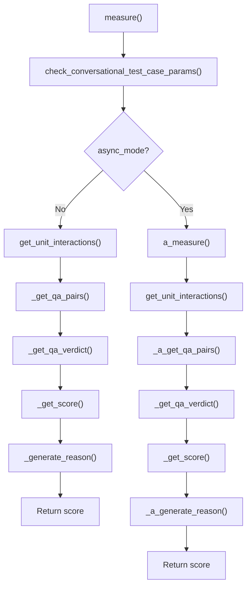
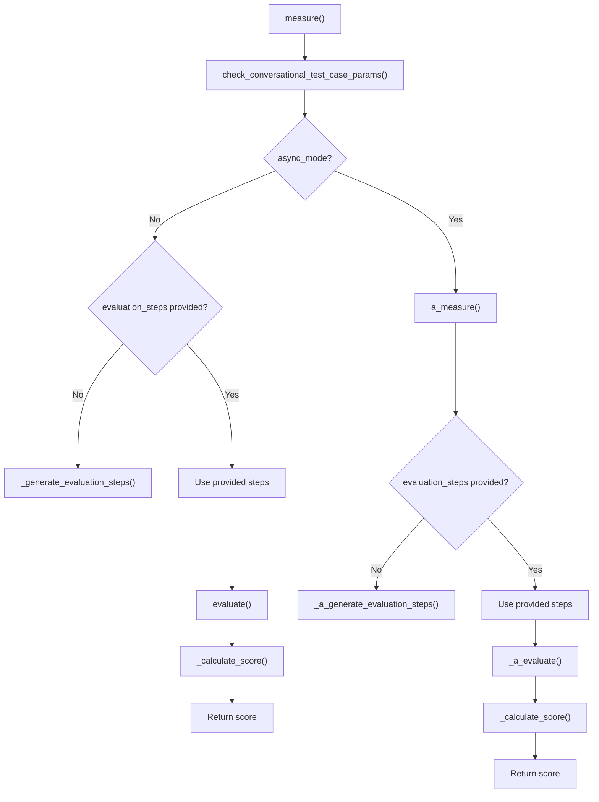
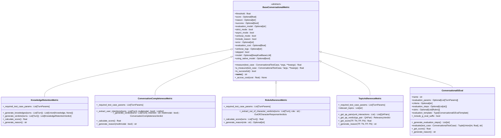
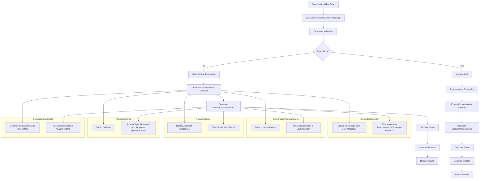
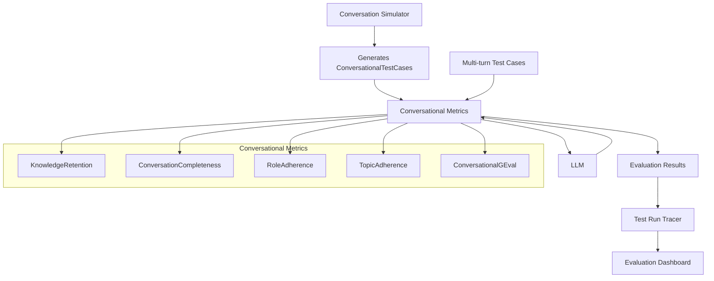

# Conversational Metrics

<cite>
**Referenced Files in This Document**   
- [knowledge_retention.py](file://deepeval/metrics/knowledge_retention/knowledge_retention.py)
- [conversation_completeness.py](file://deepeval/metrics/conversation_completeness/conversation_completeness.py)
- [role_adherence.py](file://deepeval/metrics/role_adherence/role_adherence.py)
- [topic_adherence.py](file://deepeval/metrics/topic_adherence/topic_adherence.py)
- [conversational_g_eval.py](file://deepeval/metrics/conversational_g_eval/conversational_g_eval.py)
- [template.py](file://deepeval/metrics/knowledge_retention/template.py)
- [template.py](file://deepeval/metrics/conversation_completeness/template.py)
- [template.py](file://deepeval/metrics/role_adherence/template.py)
- [template.py](file://deepeval/metrics/topic_adherence/template.py)
- [template.py](file://deepeval/metrics/conversational_g_eval/template.py)
- [schema.py](file://deepeval/metrics/knowledge_retention/schema.py)
- [schema.py](file://deepeval/metrics/conversation_completeness/schema.py)
- [schema.py](file://deepeval/metrics/role_adherence/schema.py)
- [schema.py](file://deepeval/metrics/topic_adherence/schema.py)
- [schema.py](file://deepeval/metrics/conversational_g_eval/schema.py)
- [conversational_test_case.py](file://deepeval/test_case/conversational_test_case.py)
- [base_metric.py](file://deepeval/metrics/base_metric.py)
- [utils.py](file://deepeval/metrics/utils.py)
</cite>

## Table of Contents
1. [Introduction](#introduction)
2. [Core Metrics Overview](#core-metrics-overview)
3. [Knowledge Retention Metric](#knowledge-retention-metric)
4. [Conversation Completeness Metric](#conversation-completeness-metric)
5. [Role Adherence Metric](#role-adherence-metric)
6. [Topic Adherence Metric](#topic-adherence-metric)
7. [Conversational GEval Metric](#conversational-geval-metric)
8. [Architecture and Relationships](#architecture-and-relationships)
9. [Common Issues and Solutions](#common-issues-and-solutions)
10. [Conclusion](#conclusion)

## Introduction

Conversational metrics in DeepEval are specialized evaluation tools designed to assess multi-turn dialogue systems across various dimensions of conversation quality. These metrics go beyond single-turn evaluation by analyzing the context, coherence, and consistency of interactions across multiple exchanges between users and AI systems.

The conversational metrics framework in DeepEval is built around the `BaseConversationalMetric` class, which provides a foundation for evaluating dialogue systems that maintain state across multiple turns. These metrics are particularly important for assessing chatbots, virtual assistants, and other conversational AI systems where context retention and conversation flow are critical to user experience.

This document provides a comprehensive analysis of five key conversational metrics: KnowledgeRetention, ConversationCompleteness, RoleAdherence, TopicAdherence, and ConversationalGEval. Each metric addresses a specific aspect of conversational quality, from maintaining consistent knowledge across turns to adhering to assigned roles and staying on topic throughout extended dialogues.

The metrics leverage large language models (LLMs) as evaluators, using carefully crafted prompts and structured output formats to ensure reliable and consistent scoring. They are designed to work with the `ConversationalTestCase` class, which structures multi-turn conversations with metadata about roles, context, and expected outcomes.

These metrics are essential for identifying common issues in conversational AI, such as context drift, role inconsistency, and topic divergence, particularly in long conversations where maintaining coherence becomes increasingly challenging.

**Section sources**
- [base_metric.py](file://deepeval/metrics/base_metric.py#L56-L73)
- [conversational_test_case.py](file://deepeval/test_case/conversational_test_case.py#L131-L162)

## Core Metrics Overview

DeepEval's conversational metrics framework provides a comprehensive suite of tools for evaluating multi-turn dialogue systems. These metrics share a common architecture based on the `BaseConversationalMetric` class, which defines the core interface and functionality for all conversational evaluations.

The metrics operate by analyzing sequences of turns in a conversation, where each turn contains a role (user or assistant) and content (the message text). They use LLMs as evaluators to assess various aspects of conversation quality, returning standardized results including a score, success status, and reason for the evaluation outcome.

All conversational metrics follow a consistent parameter structure:
- **threshold**: A float value (default 0.5) that determines the minimum score for a successful evaluation
- **model**: Optional LLM specification for the evaluation (defaults to native model)
- **include_reason**: Boolean flag to include explanatory reasons in results
- **async_mode**: Boolean flag to enable asynchronous evaluation
- **strict_mode**: Boolean flag that sets threshold to 1 when enabled
- **verbose_mode**: Boolean flag to enable detailed logging

The metrics return three primary values:
- **score**: A float between 0 and 1 representing the quality assessment
- **success**: A boolean indicating whether the score meets the threshold
- **reason**: An optional string explaining the evaluation outcome

These metrics are designed to work with the `ConversationalTestCase` class, which organizes dialogue into a sequence of turns with associated metadata. The metrics can be applied to various conversational scenarios, from customer service chatbots to role-playing agents, providing targeted evaluation of specific conversational qualities.

The framework supports both synchronous and asynchronous evaluation modes, allowing for efficient batch processing of multiple conversations. The metrics also include cost tracking when using commercial LLMs, providing transparency into evaluation expenses.

**Section sources**
- [base_metric.py](file://deepeval/metrics/base_metric.py#L56-L73)
- [knowledge_retention.py](file://deepeval/metrics/knowledge_retention/knowledge_retention.py#L30-L45)
- [conversation_completeness.py](file://deepeval/metrics/conversation_completeness/conversation_completeness.py#L33-L50)
- [role_adherence.py](file://deepeval/metrics/role_adherence/role_adherence.py#L27-L42)
- [topic_adherence.py](file://deepeval/metrics/topic_adherence/topic_adherence.py#L32-L50)
- [conversational_g_eval.py](file://deepeval/metrics/conversational_g_eval/conversational_g_eval.py#L39-L85)

## Knowledge Retention Metric

The KnowledgeRetention metric evaluates a conversational AI system's ability to remember and utilize information provided by users across multiple turns. This metric is crucial for assessing the coherence and consistency of long conversations, where forgetting previously established facts can significantly degrade user experience.

### Implementation Details

The KnowledgeRetention metric operates through a three-phase process:

1. **Knowledge Extraction**: For each user message, the metric extracts factual information using the `extract_data` template. This creates a knowledge base that accumulates throughout the conversation.

2. **Verdict Generation**: For each assistant response, the metric checks whether the response contradicts or forgets previously established knowledge using the `generate_verdict` template.

3. **Score Calculation**: The final score is calculated as the percentage of assistant responses that correctly retain knowledge, with a score of 1 indicating perfect retention.

### Parameters and Return Values

**Parameters:**
- **threshold**: Minimum score for success (default 0.5)
- **model**: LLM used for evaluation
- **include_reason**: Whether to generate explanatory reasons
- **async_mode**: Whether to evaluate asynchronously
- **strict_mode**: Whether to require perfect retention (score = 1)
- **verbose_mode**: Whether to include detailed logs

**Return Values:**
- **score**: Float between 0 and 1 representing knowledge retention quality
- **success**: Boolean indicating if score meets threshold
- **reason**: Explanation of the evaluation outcome
- **verdicts**: List of individual retention assessments for each turn

### Domain Model

The metric uses several domain models defined in its schema:
- **Knowledge**: Represents extracted facts from user messages as key-value pairs
- **KnowledgeRetentionVerdict**: Contains a verdict ("yes" or "no") and reason for each retention check
- **KnowledgeRetentionScoreReason**: Provides the final explanation for the overall score

### Invocation Relationships

The metric's invocation flow follows this pattern:

**Diagram sources**
- [knowledge_retention.py](file://deepeval/metrics/knowledge_retention/knowledge_retention.py#L47-L100)

**Section sources**
- [knowledge_retention.py](file://deepeval/metrics/knowledge_retention/knowledge_retention.py#L27-L335)
- [template.py](file://deepeval/metrics/knowledge_retention/template.py#L4-L198)
- [schema.py](file://deepeval/metrics/knowledge_retention/schema.py#L1-L22)

## Conversation Completeness Metric

The ConversationCompleteness metric evaluates whether a conversational AI system adequately addresses all user intentions expressed throughout a dialogue. This metric is essential for assessing whether the AI provides complete and satisfactory responses to user needs.

### Implementation Details

The metric operates through a structured evaluation process:

1. **Intention Extraction**: The metric first identifies all user intentions in the conversation using the `extract_user_intentions` template.

2. **Satisfaction Assessment**: For each identified intention, the metric evaluates whether the conversation satisfies that intention using the `generate_verdicts` template.

3. **Score Calculation**: The final score is calculated as the percentage of satisfied intentions, with higher scores indicating more complete conversations.

### Parameters and Return Values

**Parameters:**
- **threshold**: Minimum score for success (default 0.5)
- **model**: LLM used for evaluation
- **include_reason**: Whether to generate explanatory reasons
- **async_mode**: Whether to evaluate asynchronously
- **strict_mode**: Whether to require perfect completeness (score = 1)
- **verbose_mode**: Whether to include detailed logs
- **window_size**: Number of turns to consider for context (default 3)

**Return Values:**
- **score**: Float between 0 and 1 representing conversation completeness
- **success**: Boolean indicating if score meets threshold
- **reason**: Explanation of the evaluation outcome
- **user_intentions**: List of identified user intentions
- **verdicts**: List of satisfaction assessments for each intention

### Domain Model

The metric uses several domain models defined in its schema:
- **UserIntentions**: Contains a list of strings representing identified user intentions
- **ConversationCompletenessVerdict**: Contains a verdict ("yes" or "no") and optional reason for each intention assessment
- **ConversationCompletenessScoreReason**: Provides the final explanation for the overall score

### Invocation Relationships

The metric's invocation flow follows this pattern:

**Diagram sources**
- [conversation_completeness.py](file://deepeval/metrics/conversation_completeness/conversation_completeness.py#L52-L113)

**Section sources**
- [conversation_completeness.py](file://deepeval/metrics/conversation_completeness/conversation_completeness.py#L30-L305)
- [template.py](file://deepeval/metrics/conversation_completeness/template.py#L4-L158)
- [schema.py](file://deepeval/metrics/conversation_completeness/schema.py#L1-L16)

## Role Adherence Metric

The RoleAdherence metric evaluates whether a conversational AI system maintains consistency with its assigned character or role throughout a dialogue. This metric is critical for role-playing applications, customer service avatars, and any system where consistent personality or expertise is important.

### Implementation Details

The metric operates by analyzing the assistant's responses against a specified role description:

1. **Out-of-Character Detection**: The metric identifies responses that deviate from the specified role using the `extract_out_of_character_response_verdicts` template.

2. **Score Calculation**: The final score is calculated based on the proportion of assistant turns that adhere to the role, with penalties for out-of-character responses.

3. **Reason Generation**: The metric provides explanations for any role violations, citing specific responses and their deviations.

### Parameters and Return Values

**Parameters:**
- **threshold**: Minimum score for success (default 0.5)
- **model**: LLM used for evaluation
- **include_reason**: Whether to generate explanatory reasons
- **async_mode**: Whether to evaluate asynchronously
- **strict_mode**: Whether to require perfect role adherence (score = 1)
- **verbose_mode**: Whether to include detailed logs

**Return Values:**
- **score**: Float between 0 and 1 representing role adherence quality
- **success**: Boolean indicating if score meets threshold
- **reason**: Explanation of the evaluation outcome
- **out_of_character_verdicts**: List of identified role violations with reasons

### Domain Model

The metric uses several domain models defined in its schema:
- **OutOfCharacterResponseVerdict**: Contains the index of the violating turn, reason for violation, and the violating message
- **OutOfCharacterResponseVerdicts**: Contains a list of out-of-character verdicts
- **RoleAdherenceScoreReason**: Provides the final explanation for the overall score

### Invocation Relationships

The metric's invocation flow follows this pattern:

**Diagram sources**
- [role_adherence.py](file://deepeval/metrics/role_adherence/role_adherence.py#L44-L95)

**Section sources**
- [role_adherence.py](file://deepeval/metrics/role_adherence/role_adherence.py#L24-L266)
- [template.py](file://deepeval/metrics/role_adherence/template.py#L4-L113)
- [schema.py](file://deepeval/metrics/role_adherence/schema.py#L1-L17)

## Topic Adherence Metric

The TopicAdherence metric evaluates whether a conversational AI system stays on topic and properly addresses relevant questions while appropriately declining to answer off-topic inquiries. This metric is essential for assessing focus and relevance in domain-specific conversations.

### Implementation Details

The metric operates through a multi-step evaluation process:

1. **QA Pair Extraction**: The metric identifies question-answer pairs in the conversation using the `get_qa_pairs` template.

2. **Relevance Assessment**: For each QA pair, the metric evaluates whether the question is relevant to the specified topics and whether the answer is appropriate using the `get_qa_pair_verdict` template.

3. **Truth Table Analysis**: The metric categorizes each QA pair as True Positive, True Negative, False Positive, or False Negative based on relevance and response appropriateness.

4. **Score Calculation**: The final score is calculated as the proportion of correctly handled QA pairs (TP + TN) out of the total.

### Parameters and Return Values

**Parameters:**
- **relevant_topics**: List of strings defining the acceptable topics
- **threshold**: Minimum score for success (default 0.5)
- **model**: LLM used for evaluation
- **include_reason**: Whether to generate explanatory reasons
- **async_mode**: Whether to evaluate asynchronously
- **strict_mode**: Whether to require perfect topic adherence (score = 1)
- **verbose_mode**: Whether to include detailed logs

**Return Values:**
- **score**: Float between 0 and 1 representing topic adherence quality
- **success**: Boolean indicating if score meets threshold
- **reason**: Explanation of the evaluation outcome
- **interaction_pairs**: Extracted QA pairs from the conversation
- **truth_table**: Counts and reasons for TP, TN, FP, and FN classifications

### Domain Model

The metric uses several domain models defined in its schema:
- **QAPair**: Contains a question and its corresponding response
- **QAPairs**: Contains a list of QA pairs
- **RelevancyVerdict**: Contains a verdict (TP, TN, FP, FN) and reason for each QA pair
- **TopicAdherenceScoreReason**: Provides the final explanation for the overall score

### Invocation Relationships

The metric's invocation flow follows this pattern:

**Diagram sources**
- [topic_adherence.py](file://deepeval/metrics/topic_adherence/topic_adherence.py#L51-L142)

**Section sources**
- [topic_adherence.py](file://deepeval/metrics/topic_adherence/topic_adherence.py#L25-L342)
- [template.py](file://deepeval/metrics/topic_adherence/template.py#L5-L176)
- [schema.py](file://deepeval/metrics/topic_adherence/schema.py#L1-L17)

## Conversational GEval Metric

The ConversationalGEval metric is a flexible, criteria-based evaluation framework for assessing conversational quality according to custom-defined standards. Based on the GEval framework, this metric allows for tailored assessment of specific conversational dimensions.

### Implementation Details

The metric operates through a structured evaluation process:

1. **Evaluation Step Generation**: If not provided, the metric generates evaluation steps from the criteria using the `generate_evaluation_steps` template.

2. **Conversation Assessment**: The metric evaluates the conversation against the criteria and steps using the `generate_evaluation_results` template.

3. **Score Normalization**: The raw score (0-10) is normalized to a 0-1 scale for consistency with other metrics.

4. **Weighted Scoring**: In non-strict mode, the metric can use token probabilities to generate a weighted score for more nuanced evaluation.

### Parameters and Return Values

**Parameters:**
- **name**: Name of the evaluation
- **evaluation_params**: List of turn parameters to consider (default: content, role)
- **criteria**: Description of what to evaluate
- **evaluation_steps**: Optional predefined evaluation steps
- **model**: LLM used for evaluation
- **threshold**: Minimum score for success (default 0.5)
- **rubric**: Optional scoring rubric
- **async_mode**: Whether to evaluate asynchronously
- **strict_mode**: Whether to use raw scores without weighting
- **verbose_mode**: Whether to include detailed logs
- **evaluation_template**: Custom template class (optional)

**Return Values:**
- **score**: Float between 0 and 1 representing conversational quality
- **success**: Boolean indicating if score meets threshold
- **reason**: Explanation of the evaluation outcome
- **evaluation_steps**: The steps used for evaluation
- **rubric**: The rubric used for evaluation (if provided)

### Domain Model

The metric uses several domain models defined in its schema:
- **ReasonScore**: Contains a reason and score from the evaluation
- **Steps**: Contains a list of evaluation steps
- **Rubric**: Contains scoring criteria (imported from g_eval.utils)

### Invocation Relationships

The metric's invocation flow follows this pattern:

**Diagram sources**
- [conversational_g_eval.py](file://deepeval/metrics/conversational_g_eval/conversational_g_eval.py#L87-L145)

**Section sources**
- [conversational_g_eval.py](file://deepeval/metrics/conversational_g_eval/conversational_g_eval.py#L38-L421)
- [template.py](file://deepeval/metrics/conversational_g_eval/template.py#L4-L78)
- [schema.py](file://deepeval/metrics/conversational_g_eval/schema.py#L1-L12)

## Architecture and Relationships

The conversational metrics in DeepEval share a common architecture built on the `BaseConversationalMetric` class, which provides a standardized interface and functionality for all conversational evaluations.

### Class Hierarchy

**Diagram sources**
- [base_metric.py](file://deepeval/metrics/base_metric.py#L56-L94)
- [knowledge_retention.py](file://deepeval/metrics/knowledge_retention/knowledge_retention.py#L27-L335)
- [conversation_completeness.py](file://deepeval/metrics/conversation_completeness/conversation_completeness.py#L30-L305)
- [role_adherence.py](file://deepeval/metrics/role_adherence/role_adherence.py#L24-L266)
- [topic_adherence.py](file://deepeval/metrics/topic_adherence/topic_adherence.py#L25-L342)
- [conversational_g_eval.py](file://deepeval/metrics/conversational_g_eval/conversational_g_eval.py#L38-L421)

### Data Flow

The conversational metrics follow a consistent data flow pattern when evaluating multi-turn dialogues:

**Diagram sources**
- [base_metric.py](file://deepeval/metrics/base_metric.py#L56-L94)
- [knowledge_retention.py](file://deepeval/metrics/knowledge_retention/knowledge_retention.py#L47-L100)
- [conversation_completeness.py](file://deepeval/metrics/conversation_completeness/conversation_completeness.py#L52-L113)
- [role_adherence.py](file://deepeval/metrics/role_adherence/role_adherence.py#L44-L95)
- [topic_adherence.py](file://deepeval/metrics/topic_adherence/topic_adherence.py#L51-L142)
- [conversational_g_eval.py](file://deepeval/metrics/conversational_g_eval/conversational_g_eval.py#L87-L145)

### Integration with Other Components

The conversational metrics integrate with several key components in the DeepEval ecosystem:

**Diagram sources**
- [simulator.py](file://deepeval/simulator/conversation_simulator.py)
- [test_case.py](file://deepeval/test_case/conversational_test_case.py)
- [evaluate.py](file://deepeval/evaluate/evaluate.py)
- [test_run.py](file://deepeval/test_run/test_run.py)

**Section sources**
- [base_metric.py](file://deepeval/metrics/base_metric.py#L56-L94)
- [conversational_test_case.py](file://deepeval/test_case/conversational_test_case.py#L131-L162)
- [utils.py](file://deepeval/metrics/utils.py#L1-L618)

## Common Issues and Solutions

### Context Drift in Long Conversations

Context drift occurs when a conversational AI system gradually deviates from the original conversation topic or forgets previously established information. This is a common issue in long dialogues and can significantly impact user experience.

**Solutions:**
1. **Regular Knowledge Validation**: Use the KnowledgeRetention metric to systematically check for information loss across turns.
2. **Conversation Summarization**: Implement periodic summarization to refresh the AI's context.
3. **Explicit Context Management**: Design the system to explicitly acknowledge and confirm important information.

### Role Inconsistency

Role inconsistency happens when a conversational agent deviates from its assigned character or expertise, breaking immersion and reducing trust.

**Solutions:**
1. **Role Adherence Monitoring**: Use the RoleAdherence metric to detect and quantify role violations.
2. **Character Guidelines**: Provide clear, detailed guidelines for the agent's personality and behavior.
3. **Consistency Prompts**: Include role reminders in the system prompt at regular intervals.

### Topic Divergence

Topic divergence occurs when a conversation strays from its intended subject, either due to user exploration or AI misdirection.

**Solutions:**
1. **Topic Boundary Enforcement**: Use the TopicAdherence metric to monitor and maintain focus.
2. **Graceful Topic Transitions**: Design the system to acknowledge topic changes and confirm user intent.
3. **Relevance Filtering**: Implement mechanisms to decline or redirect off-topic inquiries appropriately.

### Incomplete Responses

Incomplete responses fail to fully address user intentions, leaving questions unanswered or tasks unfinished.

**Solutions:**
1. **Completeness Assessment**: Use the ConversationCompleteness metric to evaluate response adequacy.
2. **Intent Tracking**: Implement explicit tracking of user intentions throughout the conversation.
3. **Follow-up Mechanisms**: Design the system to confirm when intentions have been satisfied.

### Evaluation Consistency

Ensuring consistent evaluation results across different LLM evaluators and conversation lengths.

**Solutions:**
1. **Standardized Prompts**: Use the well-defined templates in each metric to ensure consistent evaluation criteria.
2. **Multiple Evaluation Runs**: Perform multiple evaluations and average results for more reliable scoring.
3. **Threshold Calibration**: Adjust thresholds based on observed performance patterns and requirements.

**Section sources**
- [knowledge_retention.py](file://deepeval/metrics/knowledge_retention/knowledge_retention.py#L27-L335)
- [conversation_completeness.py](file://deepeval/metrics/conversation_completeness/conversation_completeness.py#L30-L305)
- [role_adherence.py](file://deepeval/metrics/role_adherence/role_adherence.py#L24-L266)
- [topic_adherence.py](file://deepeval/metrics/topic_adherence/topic_adherence.py#L25-L342)
- [conversational_g_eval.py](file://deepeval/metrics/conversational_g_eval/conversational_g_eval.py#L38-L421)

## Conclusion

The conversational metrics in DeepEval provide a comprehensive framework for evaluating multi-turn dialogue systems across multiple dimensions of quality. These metrics—KnowledgeRetention, ConversationCompleteness, RoleAdherence, TopicAdherence, and ConversationalGEval—address critical aspects of conversational AI performance, from maintaining context and consistency to staying on topic and fulfilling user intentions.

The metrics share a common architecture based on the `BaseConversationalMetric` class, ensuring consistency in interface and behavior while allowing for specialized evaluation logic. Each metric uses carefully crafted prompts and structured output formats to leverage LLMs as reliable evaluators, providing standardized results with scores, success indicators, and explanatory reasons.

These metrics are essential tools for identifying and addressing common issues in conversational AI, such as context drift, role inconsistency, and topic divergence. By systematically applying these metrics, developers can gain valuable insights into their conversational systems' strengths and weaknesses, enabling targeted improvements.

The integration of these metrics with the conversation simulator and multi-turn test cases creates a powerful evaluation ecosystem that supports both automated testing and manual analysis. This comprehensive approach to conversational evaluation helps ensure that AI systems provide coherent, consistent, and high-quality interactions across extended dialogues.

For developers, understanding these metrics provides both practical evaluation tools and deeper insights into the challenges of building effective conversational AI. The metrics serve as both assessment instruments and design guides, highlighting the key qualities that successful conversational systems must embody.