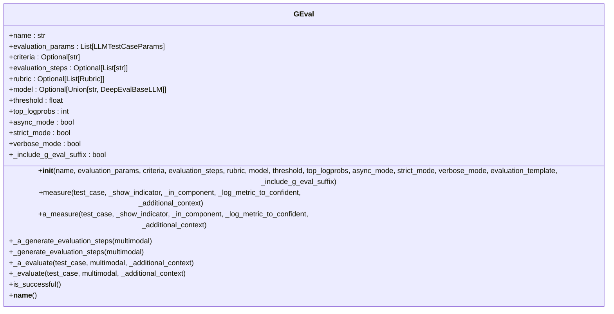
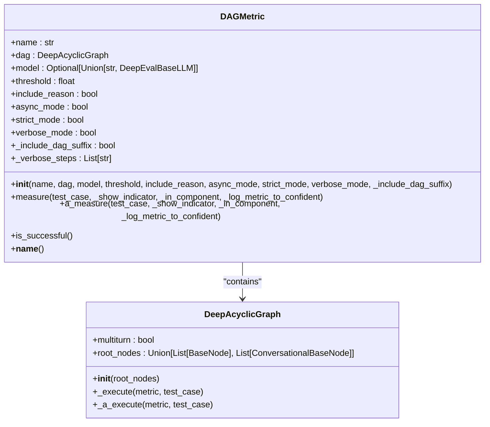
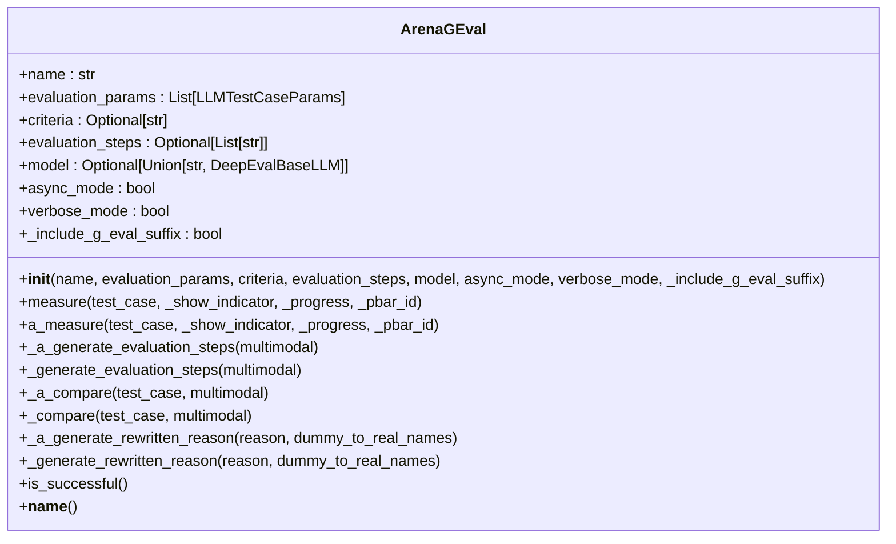
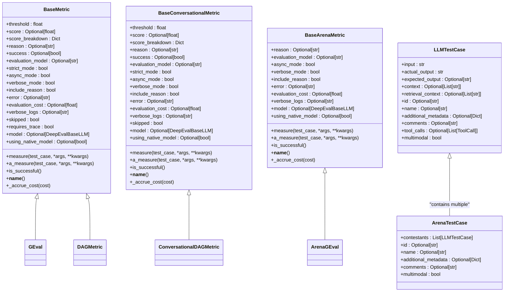
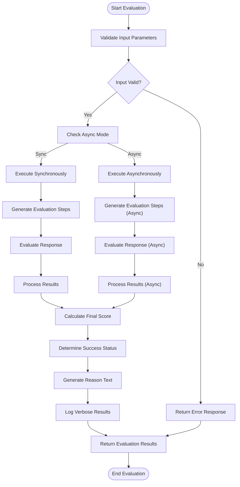

# Custom Metrics

<cite>
**Referenced Files in This Document**   
- [g_eval.py](file://deepeval/metrics/g_eval/g_eval.py)
- [g_eval/template.py](file://deepeval/metrics/g_eval/template.py)
- [g_eval/schema.py](file://deepeval/metrics/g_eval/schema.py)
- [dag/dag.py](file://deepeval/metrics/dag/dag.py)
- [dag/graph.py](file://deepeval/metrics/dag/graph.py)
- [dag/nodes.py](file://deepeval/metrics/dag/nodes.py)
- [conversational_dag/conversational_dag.py](file://deepeval/metrics/conversational_dag/conversational_dag.py)
- [conversational_dag/nodes.py](file://deepeval/metrics/conversational_dag/nodes.py)
- [arena_g_eval/arena_g_eval.py](file://deepeval/metrics/arena_g_eval/arena_g_eval.py)
- [arena_g_eval/template.py](file://deepeval/metrics/arena_g_eval/template.py)
- [base_metric.py](file://deepeval/metrics/base_metric.py)
- [test_case.py](file://deepeval/test_case.py)
</cite>

## Table of Contents
1. [Introduction](#introduction)
2. [Core Custom Metrics](#core-custom-metrics)
3. [GEval Implementation](#geval-implementation)
4. [DAG Metric Architecture](#dag-metric-architecture)
5. [Conversational DAG](#conversational-dag)
6. [Arena GEval](#arena-geval)
7. [Domain Models and Interfaces](#domain-models-and-interfaces)
8. [Evaluation Process Flow](#evaluation-process-flow)
9. [Common Issues and Solutions](#common-issues-and-solutions)
10. [Conclusion](#conclusion)

## Introduction

Custom metrics in DeepEval provide a flexible framework for evaluating LLM outputs based on user-defined criteria. These metrics leverage LLM evaluators to assess responses against specific evaluation criteria, enabling sophisticated evaluation beyond simple string matching or predefined metrics. The framework supports various metric types including GEval, DAG, ConversationalDAG, and ArenaGEval, each designed for different evaluation scenarios and complexity levels.

The custom metrics system allows users to define evaluation criteria using natural language prompts, which are then used by an LLM evaluator to judge the quality of responses. This approach enables nuanced evaluation that can capture subtle aspects of response quality, relevance, and correctness. The metrics are designed to be extensible and composable, allowing complex evaluation workflows to be constructed from simpler components.

**Section sources**
- [g_eval.py](file://deepeval/metrics/g_eval/g_eval.py#L1-L412)
- [arena_g_eval.py](file://deepeval/metrics/arena_g_eval/arena_g_eval.py#L1-L317)

## Core Custom Metrics

DeepEval provides several core custom metrics that enable flexible evaluation of LLM outputs. These metrics are built on a common foundation but serve different purposes and use cases.

The GEval metric is the foundational custom metric that evaluates responses based on user-defined criteria. It uses an LLM evaluator to assess how well a response meets specified criteria, returning a score, success status, and reason for the evaluation. This metric is ideal for single-response evaluation against specific quality criteria.

The DAG (Directed Acyclic Graph) metric extends the GEval concept by allowing the construction of complex evaluation workflows as a graph of interconnected nodes. Each node in the graph represents a specific evaluation step, and the overall evaluation proceeds through the graph according to defined relationships between nodes. This enables sophisticated, multi-step evaluation processes.

For conversational AI systems, the ConversationalDAG metric provides specialized evaluation capabilities that consider the multi-turn nature of conversations. It evaluates entire conversation flows rather than individual responses, making it suitable for chatbots and dialogue systems.

Finally, the ArenaGEval metric is designed for comparative evaluation, where multiple responses are evaluated against each other to determine a winner based on specified criteria. This is particularly useful for A/B testing of different LLM configurations or prompt strategies.

**Section sources**
- [g_eval.py](file://deepeval/metrics/g_eval/g_eval.py#L40-L412)
- [dag/dag.py](file://deepeval/metrics/dag/dag.py#L24-L162)
- [conversational_dag/conversational_dag.py](file://deepeval/metrics/conversational_dag/conversational_dag.py#L23-L156)
- [arena_g_eval.py](file://deepeval/metrics/arena_g_eval/arena_g_eval.py#L36-L317)

## GEval Implementation

The GEval metric is implemented as a class that inherits from BaseMetric and provides a comprehensive framework for custom evaluation. The implementation follows a structured approach that includes initialization, evaluation, and result processing.

**Diagram sources**
- [g_eval.py](file://deepeval/metrics/g_eval/g_eval.py#L40-L412)

The GEval class constructor accepts several key parameters that define the evaluation behavior. The `name` parameter identifies the metric, while `evaluation_params` specifies which fields from the test case should be included in the evaluation. The `criteria` parameter contains the natural language description of what should be evaluated, and `evaluation_steps` can be provided to specify exactly how the evaluation should be conducted.

The evaluation process follows a two-step approach: first, evaluation steps are generated based on the criteria (unless explicitly provided), and then these steps are used to evaluate the response. When no evaluation steps are provided, the system automatically generates them by prompting the LLM evaluator with the criteria. This allows for flexible evaluation that can adapt to different criteria without requiring manual specification of evaluation steps.

The metric supports both synchronous and asynchronous execution modes, with the latter being the default. It also provides options for strict mode (where scores are binary) and verbose mode (which provides detailed logs of the evaluation process). The implementation handles error cases gracefully and provides detailed reasons for evaluation results.

**Section sources**
- [g_eval.py](file://deepeval/metrics/g_eval/g_eval.py#L40-L412)
- [g_eval/template.py](file://deepeval/metrics/g_eval/template.py#L1-L142)

## DAG Metric Architecture

The DAG metric provides a powerful framework for constructing complex evaluation workflows as directed acyclic graphs. This architecture enables the creation of sophisticated evaluation processes that can incorporate multiple evaluation steps, conditional logic, and data transformations.

**Diagram sources**
- [dag/dag.py](file://deepeval/metrics/dag/dag.py#L24-L162)
- [dag/graph.py](file://deepeval/metrics/dag/graph.py#L27-L78)

The DAG architecture is built around several key components: nodes, edges, and the graph structure itself. Nodes represent individual evaluation steps or operations, while edges define the relationships and data flow between nodes. The graph structure ensures that evaluations proceed in a logical order without cycles, preventing infinite loops and ensuring deterministic results.

The implementation supports several types of nodes:
- **TaskNode**: Performs a specific task or transformation on data
- **BinaryJudgementNode**: Makes a binary decision based on criteria
- **NonBinaryJudgementNode**: Makes a decision among multiple options
- **VerdictNode**: Represents a final evaluation result or score

Each node type has specific responsibilities and interfaces that define how it interacts with other nodes and the overall evaluation process. The graph execution engine handles the traversal of the graph, ensuring that nodes are executed in the correct order and that data flows appropriately between connected nodes.

The DAG metric is particularly powerful because it allows for conditional evaluation paths. For example, a BinaryJudgementNode can direct the evaluation to different branches of the graph based on its verdict, enabling complex decision trees and adaptive evaluation strategies.

**Section sources**
- [dag/dag.py](file://deepeval/metrics/dag/dag.py#L24-L162)
- [dag/graph.py](file://deepeval/metrics/dag/graph.py#L27-L78)
- [dag/nodes.py](file://deepeval/metrics/dag/nodes.py#L1-L715)

## Conversational DAG

The ConversationalDAG metric extends the DAG framework to support multi-turn conversation evaluation. This specialized implementation addresses the unique challenges of evaluating conversational AI systems, where context and dialogue flow are critical factors in assessment.

```mermaid
classDiagram
class ConversationalDAGMetric {
+name : str
+dag : DeepAcyclicGraph
+model : Optional[Union[str, DeepEvalBaseLLM]]
+threshold : float
+include_reason : bool
+async_mode : bool
+strict_mode : bool
+verbose_mode : bool
+_include_dag_suffix : bool
+_verbose_steps : List[str]
+__init__(name, dag, model, threshold, include_reason, async_mode, strict_mode, verbose_mode, _include_dag_suffix)
+measure(test_case, _show_indicator, _in_component, _log_metric_to_confident)
+a_measure(test_case, _show_indicator, _in_component, _log_metric_to_confident)
+is_successful()
+__name__()
}
class ConversationalBaseNode {
+_indegree : int
+_depth : int
+set_parent(parent)
+_execute(metric, test_case, depth)
+_a_execute(metric, test_case, depth)
}
class ConversationalTaskNode {
+instructions : str
+output_label : str
+children : List[ConversationalBaseNode]
+evaluation_params : List[TurnParams]
+turn_window : Tuple[int, int]
+label : Optional[str]
+_verbose_logs : Optional[str]
+_output : Optional[str]
+_parents : Optional[List[ConversationalBaseNode]]
+__hash__()
+__post_init__()
+_execute(metric, test_case, depth)
+_a_execute(metric, test_case, depth)
}
class ConversationalBinaryJudgementNode {
+criteria : str
+children : List[ConversationalVerdictNode]
+evaluation_params : Optional[List[TurnParams]]
+turn_window : Tuple[int, int]
+label : Optional[str]
+_verbose_logs : Optional[str]
+_verdict : Optional[BinaryJudgementVerdict]
+_parents : Optional[List[ConversationalBaseNode]]
+__hash__()
+__post_init__()
+_execute(metric, test_case, depth)
+_a_execute(metric, test_case, depth)
}
class ConversationalNonBinaryJudgementNode {
+criteria : str
+children : List[ConversationalVerdictNode]
+evaluation_params : Optional[List[TurnParams]]
+turn_window : Tuple[int, int]
+label : Optional[str]
+_verbose_logs : Optional[str]
+_verdict : Optional[NonBinaryJudgementVerdict]
+_parents : Optional[List[ConversationalBaseNode]]
+__hash__()
+__post_init__()
+_execute(metric, test_case, depth)
+_a_execute(metric, test_case, depth)
}
class ConversationalVerdictNode {
+verdict : Union[str, bool]
+score : Optional[int]
+child : Optional[Union[ConversationalBaseNode, ConversationalGEval, BaseConversationalMetric]]
+_parent : Optional[ConversationalBaseNode]
+__hash__()
+__post_init__()
+_execute(metric, test_case, depth)
+_a_execute(metric, test_case, depth)
+_generate_reason(metric)
+_a_generate_reason(metric)
}
ConversationalDAGMetric --> ConversationalBaseNode : "uses"
ConversationalTaskNode --> ConversationalBaseNode : "extends"
ConversationalBinaryJudgementNode --> ConversationalBaseNode : "extends"
ConversationalNonBinaryJudgementNode --> ConversationalBaseNode : "extends"
ConversationalVerdictNode --> ConversationalBaseNode : "extends"
```

**Diagram sources**
- [conversational_dag/conversational_dag.py](file://deepeval/metrics/conversational_dag/conversational_dag.py#L23-L156)
- [conversational_dag/nodes.py](file://deepeval/metrics/conversational_dag/nodes.py#L38-L800)

The ConversationalDAG implementation introduces several key enhancements over the basic DAG metric. Most notably, it supports the concept of turn windows, which allows evaluation nodes to focus on specific portions of a conversation rather than the entire dialogue. This is particularly useful for evaluating specific aspects of a conversation, such as the quality of responses to particular user queries.

The metric also provides specialized node types that are optimized for conversational evaluation. For example, the ConversationalTaskNode can extract specific information from conversation turns, while the ConversationalBinaryJudgementNode can make decisions based on dialogue patterns and context.

One of the key features of the ConversationalDAG is its ability to maintain context across multiple turns. This allows for evaluations that consider the entire conversation history, such as assessing consistency, coherence, and progression of the dialogue. The implementation handles the complexities of multi-turn evaluation, including managing state and context between evaluation steps.

The metric supports both synchronous and asynchronous execution, with the latter being particularly useful for complex evaluation workflows that may take significant time to complete. It also provides detailed logging and debugging information to help users understand how evaluations are being performed and identify potential issues.

**Section sources**
- [conversational_dag/conversational_dag.py](file://deepeval/metrics/conversational_dag/conversational_dag.py#L23-L156)
- [conversational_dag/nodes.py](file://deepeval/metrics/conversational_dag/nodes.py#L1-L883)

## Arena GEval

The ArenaGEval metric is designed for comparative evaluation of multiple responses, making it ideal for A/B testing and model comparison scenarios. This metric evaluates several responses against each other based on specified criteria and determines a winner.

**Diagram sources**
- [arena_g_eval/arena_g_eval.py](file://deepeval/metrics/arena_g_eval/arena_g_eval.py#L36-L317)

The ArenaGEval implementation follows a three-step process for comparative evaluation. First, it generates evaluation steps based on the provided criteria, similar to the GEval metric. Then, it compares all responses against these criteria to determine a winner. Finally, it rewrites the reason for the decision to use the actual names of the contestants rather than internal identifiers.

The metric is designed to handle the complexities of comparative evaluation, including ensuring fair comparison and providing clear justification for the outcome. It uses a masking system to anonymize contestant names during the evaluation process, preventing bias, and then unmasks the results in the final output.

One of the key features of ArenaGEval is its ability to handle multiple evaluation parameters and provide detailed reasoning for its decisions. The implementation ensures that the comparison is based on the specified criteria and that the reasoning references specific aspects of each response.

The metric supports both synchronous and asynchronous execution modes and provides progress tracking for long-running evaluations. It also includes comprehensive error handling to ensure reliable operation even in complex evaluation scenarios.

**Section sources**
- [arena_g_eval/arena_g_eval.py](file://deepeval/metrics/arena_g_eval/arena_g_eval.py#L36-L317)
- [arena_g_eval/template.py](file://deepeval/metrics/arena_g_eval/template.py#L1-L134)

## Domain Models and Interfaces

The custom metrics system in DeepEval is built on a well-defined set of domain models and interfaces that ensure consistency and extensibility across different metric types.

**Diagram sources**
- [base_metric.py](file://deepeval/metrics/base_metric.py#L13-L134)
- [test_case.py](file://deepeval/test_case.py#L1-L100)

The core interface for all metrics is the BaseMetric class, which defines the common properties and methods that all metrics must implement. Key properties include:
- **score**: The numerical evaluation result (typically between 0 and 1)
- **reason**: A textual explanation for the evaluation result
- **success**: A boolean indicating whether the evaluation passed the threshold
- **threshold**: The minimum score required for a successful evaluation

All metrics must implement the measure() and a_measure() methods for synchronous and asynchronous evaluation, respectively, as well as the is_successful() method to determine if the evaluation passed.

The LLMTestCase class represents the input data for evaluation, containing fields such as input, actual_output, expected_output, and context. The ArenaTestCase extends this concept to support multiple contestants for comparative evaluation.

The interface design follows the principle of least surprise, with consistent parameter names and behaviors across different metric types. This makes it easier for users to understand and use the various metrics, as they can rely on familiar patterns and conventions.

**Section sources**
- [base_metric.py](file://deepeval/metrics/base_metric.py#L13-L134)
- [test_case.py](file://deepeval/test_case.py#L1-L100)
- [g_eval.py](file://deepeval/metrics/g_eval/g_eval.py#L40-L412)

## Evaluation Process Flow

The evaluation process in DeepEval's custom metrics follows a consistent pattern across different metric types, with variations to accommodate specific requirements.

**Diagram sources**
- [g_eval.py](file://deepeval/metrics/g_eval/g_eval.py#L79-L412)
- [dag/dag.py](file://deepeval/metrics/dag/dag.py#L58-L162)

The evaluation process begins with input validation, where the system checks that all required parameters are present and valid. This includes verifying that the test case contains the necessary fields for evaluation and that the metric configuration is correct.

Next, the system determines whether to execute synchronously or asynchronously based on the async_mode parameter. The asynchronous path is the default and allows for better resource utilization and progress tracking.

For metrics that require evaluation steps (like GEval and ArenaGEval), the system first generates these steps based on the provided criteria. This is done by prompting the LLM evaluator with the criteria and asking it to generate appropriate evaluation steps. If evaluation steps are provided explicitly, this step is skipped.

The core evaluation then takes place, where the response is assessed against the criteria or evaluation steps. This involves constructing a prompt that includes the evaluation criteria, the response to be evaluated, and any additional context, and then sending this to the LLM evaluator.

The results are processed to extract the score and reason, which are then used to calculate the final score (normalized to the 0-1 range) and determine the success status based on the threshold. A detailed reason text is generated to explain the evaluation outcome, and verbose logs are created for debugging and analysis.

Finally, the results are returned, including the score, success status, reason, and any additional metadata. The entire process is designed to be transparent and reproducible, with detailed logging to support debugging and improvement of evaluation criteria.

**Section sources**
- [g_eval.py](file://deepeval/metrics/g_eval/g_eval.py#L79-L412)
- [dag/dag.py](file://deepeval/metrics/dag/dag.py#L58-L162)
- [arena_g_eval.py](file://deepeval/metrics/arena_g_eval/arena_g_eval.py#L63-L317)

## Common Issues and Solutions

When working with custom metrics in DeepEval, users may encounter several common issues. Understanding these issues and their solutions can help ensure successful implementation and reliable evaluation results.

One common issue is poorly defined evaluation criteria. When criteria are vague or ambiguous, the LLM evaluator may produce inconsistent or unreliable results. The solution is to use clear, specific criteria that unambiguously define what should be evaluated. For example, instead of "good response," use "response that provides accurate information about the topic and addresses all parts of the user's question."

Another issue is the generation of inappropriate evaluation steps. When the automatic generation of evaluation steps produces steps that don't align with the intended evaluation, users can provide explicit evaluation steps instead of relying on automatic generation. This gives more control over the evaluation process and ensures consistency.

Performance can be a concern with complex evaluation workflows, particularly when using asynchronous execution. To address this, users can optimize their evaluation graphs by minimizing unnecessary nodes and ensuring efficient data flow. They can also adjust the timeout settings if evaluations are taking longer than expected.

Integration with existing systems can sometimes be challenging. The solution is to ensure that test cases are properly formatted and contain all required fields. Users should also verify that their LLM evaluator is correctly configured and accessible.

For conversational evaluations, maintaining context across turns can be difficult. The ConversationalDAG metric addresses this with its turn window feature, but users should carefully design their evaluation workflows to ensure that the necessary context is available at each evaluation step.

Finally, interpreting evaluation results can sometimes be challenging. The verbose logging feature can help by providing detailed information about the evaluation process, including the criteria, evaluation steps, and reasoning behind scores. Users should review these logs to understand how evaluations are being performed and identify areas for improvement.

**Section sources**
- [g_eval.py](file://deepeval/metrics/g_eval/g_eval.py#L57-L412)
- [dag/nodes.py](file://deepeval/metrics/dag/nodes.py#L1-L715)
- [conversational_dag/nodes.py](file://deepeval/metrics/conversational_dag/nodes.py#L1-L883)

## Conclusion

Custom metrics in DeepEval provide a powerful and flexible framework for evaluating LLM outputs based on user-defined criteria. The system supports various metric types, including GEval, DAG, ConversationalDAG, and ArenaGEval, each designed for different evaluation scenarios and complexity levels.

The implementation is built on a solid foundation of domain models and interfaces that ensure consistency and extensibility. The metrics leverage LLM evaluators to assess responses against natural language criteria, enabling sophisticated evaluation that goes beyond simple string matching.

The DAG architecture is particularly powerful, allowing the construction of complex evaluation workflows as directed acyclic graphs. This enables conditional evaluation paths, data transformations, and multi-step evaluation processes. The ConversationalDAG extends this capability to support multi-turn conversation evaluation, while ArenaGEval provides comparative evaluation for A/B testing scenarios.

The system is designed to be user-friendly while providing sufficient technical depth for experienced developers. It handles the complexities of LLM orchestration and prompt templating behind the scenes, allowing users to focus on defining their evaluation criteria.

By understanding the implementation details and best practices outlined in this document, users can effectively leverage DeepEval's custom metrics to evaluate and improve their LLM applications.

[No sources needed since this section summarizes without analyzing specific files]