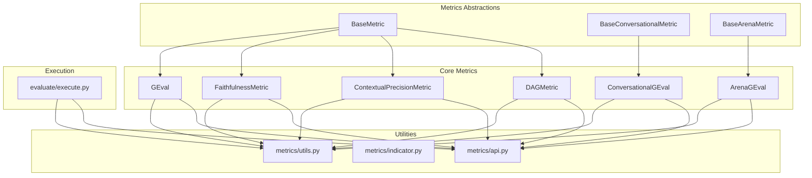
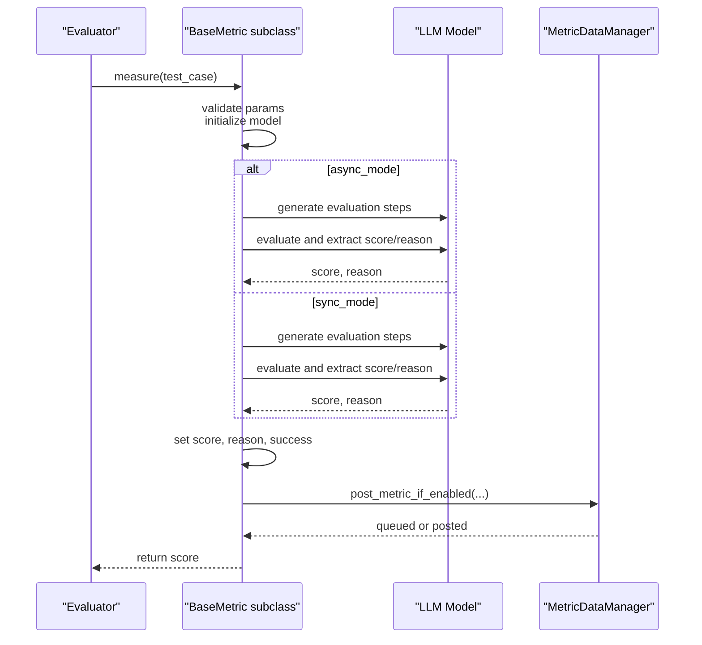
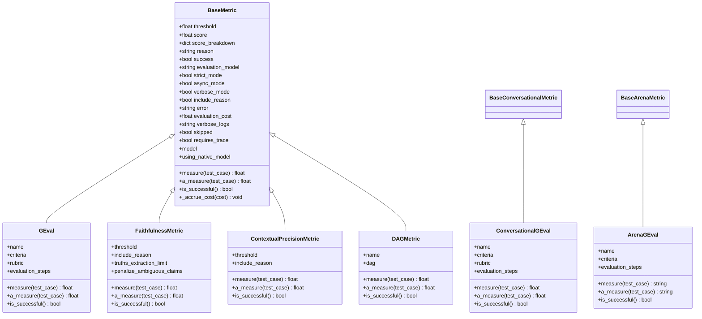
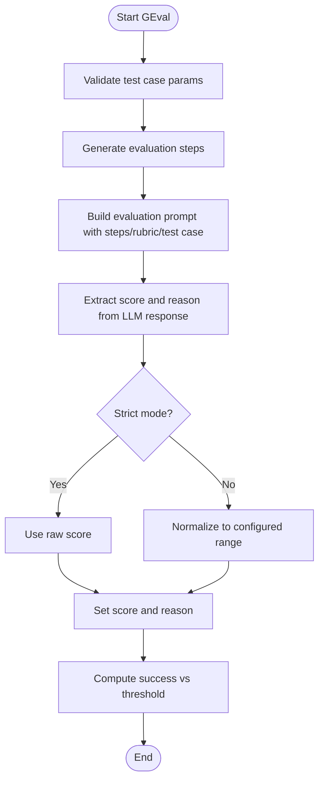
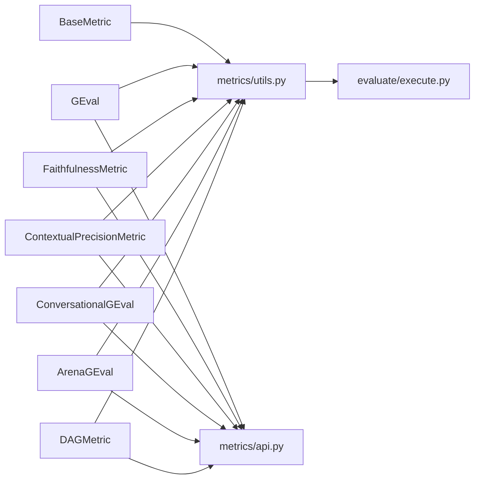

# Metrics System

<cite>
**Referenced Files in This Document**
- [base_metric.py](file://deepeval/metrics/base_metric.py)
- [__init__.py](file://deepeval/metrics/__init__.py)
- [api.py](file://deepeval/metrics/api.py)
- [utils.py](file://deepeval/metrics/utils.py)
- [execute.py](file://deepeval/evaluate/execute.py)
- [g_eval.py](file://deepeval/metrics/g_eval/g_eval.py)
- [faithfulness.py](file://deepeval/metrics/faithfulness/faithfulness.py)
- [contextual_precision.py](file://deepeval/metrics/contextual_precision/contextual_precision.py)
- [arena_g_eval.py](file://deepeval/metrics/arena_g_eval/arena_g_eval.py)
- [conversational_g_eval.py](file://deepeval/metrics/conversational_g_eval/conversational_g_eval.py)
- [dag.py](file://deepeval/metrics/dag/dag.py)
- [ragas.py](file://deepeval/metrics/ragas.py)
- [template.py](file://deepeval/metrics/g_eval/template.py)
- [DEEPEVAL_METRICS_GUIDE.md](file://ai_docs/DEEPEVAL_METRICS_GUIDE.md)
</cite>

## Table of Contents
1. [Introduction](#introduction)
2. [Project Structure](#project-structure)
3. [Core Components](#core-components)
4. [Architecture Overview](#architecture-overview)
5. [Detailed Component Analysis](#detailed-component-analysis)
6. [Dependency Analysis](#dependency-analysis)
7. [Performance Considerations](#performance-considerations)
8. [Troubleshooting Guide](#troubleshooting-guide)
9. [Conclusion](#conclusion)
10. [Appendices](#appendices)

## Introduction
DeepEval’s Metrics System is the core evaluation engine that assesses Large Language Model (LLM) outputs using quantitative measures. It provides a unified abstraction for metrics, enabling both rule-based and LLM-as-a-judge evaluations. The system centers around the BaseMetric abstract class and its specialized implementations, covering categories such as Retrieval-Augmented Generation (RAG), Safety, Agentic, and Conversational evaluation. Metrics compute a numeric score, a pass/fail outcome, and optionally a reason explaining the judgment. They support synchronous and asynchronous execution, configurable thresholds, and optional verbose logging. Advanced capabilities include DAG-based composite metrics, arena-style pairwise comparisons, and optional integration with Confident AI for metric data logging.

## Project Structure
The metrics subsystem is organized by feature domains:
- Base abstractions: BaseMetric, BaseConversationalMetric, BaseArenaMetric
- Metric implementations: RAG, Safety, Agentic, Conversational, and auxiliary metrics
- Utilities: shared evaluation utilities, progress indicators, and metric data logging
- Execution orchestration: evaluation pipeline integration and caching

**Diagram sources**
- [base_metric.py](file://deepeval/metrics/base_metric.py#L1-L134)
- [g_eval.py](file://deepeval/metrics/g_eval/g_eval.py#L1-L200)
- [faithfulness.py](file://deepeval/metrics/faithfulness/faithfulness.py#L1-L200)
- [contextual_precision.py](file://deepeval/metrics/contextual_precision/contextual_precision.py#L1-L200)
- [arena_g_eval.py](file://deepeval/metrics/arena_g_eval/arena_g_eval.py#L1-L200)
- [conversational_g_eval.py](file://deepeval/metrics/conversational_g_eval/conversational_g_eval.py#L1-L200)
- [dag.py](file://deepeval/metrics/dag/dag.py#L1-L162)
- [utils.py](file://deepeval/metrics/utils.py#L1-L200)
- [api.py](file://deepeval/metrics/api.py#L1-L282)
- [execute.py](file://deepeval/evaluate/execute.py#L1-L200)

**Section sources**
- [__init__.py](file://deepeval/metrics/__init__.py#L1-L134)
- [base_metric.py](file://deepeval/metrics/base_metric.py#L1-L134)
- [utils.py](file://deepeval/metrics/utils.py#L1-L200)
- [api.py](file://deepeval/metrics/api.py#L1-L282)
- [execute.py](file://deepeval/evaluate/execute.py#L1-L200)

## Core Components
- BaseMetric: Defines the contract for all metrics, including measure(), a_measure(), is_successful(), and shared state fields such as score, threshold, reason, success, evaluation_model, strict_mode, async_mode, verbose_mode, include_reason, error, evaluation_cost, verbose_logs, skipped, requires_trace, model, using_native_model, and accrue_cost().
- BaseConversationalMetric: Similar contract for conversational test cases.
- BaseArenaMetric: Contract for arena-style pairwise comparisons.
- Public state fields: score, threshold, reason, success, evaluation_model, strict_mode, async_mode, verbose_mode, include_reason, error, evaluation_cost, verbose_logs, skipped, model, using_native_model.

Key behaviors:
- Both measure() and a_measure() must set metric.score and metric.success; a_measure() runs concurrently when async_mode is enabled.
- is_successful() computes pass/fail based on score and threshold, with special handling for strict_mode and error conditions.
- Metrics track evaluation_cost and can optionally include a reason string.

**Section sources**
- [base_metric.py](file://deepeval/metrics/base_metric.py#L1-L134)

## Architecture Overview
The Metrics System integrates tightly with the evaluation pipeline:
- Metrics are instantiated with parameters (model, threshold, strict_mode, async_mode, verbose_mode, include_reason).
- During evaluation, metrics validate required test case parameters, optionally generate evaluation steps, query an LLM (or external service), compute a score, derive a reason, and set success.
- Asynchronous execution is supported via a_measure(), with concurrent internal operations when applicable.
- Optional metric data logging posts evaluation results to Confident AI via a background worker.

**Diagram sources**
- [g_eval.py](file://deepeval/metrics/g_eval/g_eval.py#L80-L152)
- [faithfulness.py](file://deepeval/metrics/faithfulness/faithfulness.py#L63-L122)
- [contextual_precision.py](file://deepeval/metrics/contextual_precision/contextual_precision.py#L56-L117)
- [api.py](file://deepeval/metrics/api.py#L59-L110)

## Detailed Component Analysis

### BaseMetric and Specialized Metrics
- BaseMetric defines the core interface and shared state. Subclasses implement measure() and a_measure() to compute scores and reasons, and is_successful() to derive pass/fail outcomes.
- GEval implements LLM-as-a-judge evaluation using structured prompts and schemas, supporting strict_mode and rubrics.
- FaithfulnessMetric evaluates whether generated output aligns with retrieved context, extracting truths and claims, computing verdicts, and generating a reason.
- ContextualPrecisionMetric evaluates whether relevant context is ranked highly, generating verdicts and a reason.
- ConversationalGEval adapts GEval for conversational test cases, aggregating scores across turns.
- ArenaGEval performs pairwise comparison between two model outputs, returning a winner and a rewritten reason.
- DAGMetric composes multiple metrics into a directed acyclic graph, aggregating results according to node logic.

**Diagram sources**
- [base_metric.py](file://deepeval/metrics/base_metric.py#L1-L134)
- [g_eval.py](file://deepeval/metrics/g_eval/g_eval.py#L40-L153)
- [faithfulness.py](file://deepeval/metrics/faithfulness/faithfulness.py#L30-L122)
- [contextual_precision.py](file://deepeval/metrics/contextual_precision/contextual_precision.py#L28-L117)
- [conversational_g_eval.py](file://deepeval/metrics/conversational_g_eval/conversational_g_eval.py#L38-L145)
- [arena_g_eval.py](file://deepeval/metrics/arena_g_eval/arena_g_eval.py#L36-L116)
- [dag.py](file://deepeval/metrics/dag/dag.py#L24-L104)

**Section sources**
- [base_metric.py](file://deepeval/metrics/base_metric.py#L1-L134)
- [g_eval.py](file://deepeval/metrics/g_eval/g_eval.py#L1-L200)
- [faithfulness.py](file://deepeval/metrics/faithfulness/faithfulness.py#L1-L200)
- [contextual_precision.py](file://deepeval/metrics/contextual_precision/contextual_precision.py#L1-L200)
- [conversational_g_eval.py](file://deepeval/metrics/conversational_g_eval/conversational_g_eval.py#L1-L200)
- [arena_g_eval.py](file://deepeval/metrics/arena_g_eval/arena_g_eval.py#L1-L200)
- [dag.py](file://deepeval/metrics/dag/dag.py#L1-L162)

### LLM-as-a-Judge Methodology
Many metrics use a structured LLM-as-a-judge approach:
- Generate evaluation steps from criteria and parameters.
- Construct a prompt that includes evaluation steps, rubric (optional), and test case content.
- Extract a structured JSON containing score and reason.
- Normalize score (when applicable) and derive success based on threshold and strict_mode.

**Diagram sources**
- [g_eval.py](file://deepeval/metrics/g_eval/g_eval.py#L80-L152)
- [template.py](file://deepeval/metrics/g_eval/template.py#L1-L142)

**Section sources**
- [g_eval.py](file://deepeval/metrics/g_eval/g_eval.py#L1-L200)
- [template.py](file://deepeval/metrics/g_eval/template.py#L1-L142)

### Metric Categories for Beginners
- RAG: Measures retrieval quality and alignment between input, context, and output.
  - AnswerRelevancyMetric, FaithfulnessMetric, ContextualPrecisionMetric, ContextualRecallMetric, ContextualRelevancyMetric
- Safety: Detects harmful or unsafe content and policy violations.
  - HallucinationMetric, BiasMetric, ToxicityMetric, PIILeakageMetric
- Agentic: Evaluates agent behavior and task completion.
  - ToolCorrectnessMetric, TaskCompletionMetric, PlanAdherenceMetric, StepEfficiencyMetric
- Conversational: Assesses dialogue quality and adherence.
  - KnowledgeRetentionMetric, ConversationCompletenessMetric, RoleAdherenceMetric

**Section sources**
- [DEEPEVAL_METRICS_GUIDE.md](file://ai_docs/DEEPEVAL_METRICS_GUIDE.md#L449-L485)

### Metric Execution, Scoring, and Reasoning
- Execution flow:
  - Validate required test case parameters.
  - Optionally generate evaluation steps and rubrics.
  - Query model to produce structured output (score and reason).
  - Compute normalized score and success flag.
  - Optionally log verbose steps and post metric data.
- Scoring algorithms vary by metric:
  - FaithfulnessMetric: extracts truths and claims, computes verdicts, aggregates score.
  - ContextualPrecisionMetric: generates verdicts per context, aggregates score.
  - GEval: normalizes score to configured range; strict_mode yields binary outcomes.
  - DAGMetric: traverses nodes, aggregates child scores according to graph logic.
- Reasoning:
  - Many metrics conditionally generate a reason string when include_reason is enabled.
  - Reasons are constructed from extracted verdicts or LLM-generated explanations.

**Section sources**
- [faithfulness.py](file://deepeval/metrics/faithfulness/faithfulness.py#L63-L122)
- [contextual_precision.py](file://deepeval/metrics/contextual_precision/contextual_precision.py#L56-L117)
- [g_eval.py](file://deepeval/metrics/g_eval/g_eval.py#L120-L152)
- [dag.py](file://deepeval/metrics/dag/dag.py#L58-L104)

### Practical Examples: Implementing and Customizing Metrics
- Implement a custom metric by subclassing BaseMetric and implementing measure() and a_measure(). Ensure both set metric.score and metric.success, and optionally set metric.reason. Use async_mode to enable concurrent internal operations.
- Use GEval to define custom evaluation criteria and rubrics; configure threshold, strict_mode, and include_reason as needed.
- Compose metrics using DAGMetric to build complex evaluation workflows.

References to implementation patterns:
- Measure and a_measure contract, plus recommended error handling and reason generation.
- GEval initialization and evaluation flow.
- FaithfulnessMetric and ContextualPrecisionMetric execution patterns.

**Section sources**
- [g_eval.py](file://deepeval/metrics/g_eval/g_eval.py#L40-L153)
- [faithfulness.py](file://deepeval/metrics/faithfulness/faithfulness.py#L63-L122)
- [contextual_precision.py](file://deepeval/metrics/contextual_precision/contextual_precision.py#L56-L117)

### Public Interfaces and State
- score: Numeric evaluation result.
- threshold: Threshold for pass/fail.
- reason: Optional textual explanation for the score.
- success: Boolean pass/fail outcome computed from score and threshold.
- evaluation_model: Identifier of the model used for evaluation.
- strict_mode: When true, enforces stricter scoring semantics (e.g., binary outcomes).
- async_mode: Enables asynchronous execution of a_measure().
- verbose_mode: Controls verbosity of logs.
- include_reason: Controls whether a reason is generated.
- error: Captures any error encountered during evaluation.
- evaluation_cost: Tracks cumulative evaluation cost.
- verbose_logs: Aggregated verbose logs for debugging.
- model and using_native_model: Model instance and native model flag.

**Section sources**
- [base_metric.py](file://deepeval/metrics/base_metric.py#L1-L134)

## Dependency Analysis
The metrics system depends on:
- Shared utilities for parameter validation, model initialization, and verbose logging.
- Evaluation orchestration for progress indication and caching.
- Optional integration with Confident AI for metric data logging.

**Diagram sources**
- [utils.py](file://deepeval/metrics/utils.py#L1-L200)
- [execute.py](file://deepeval/evaluate/execute.py#L1-L200)
- [api.py](file://deepeval/metrics/api.py#L1-L282)

**Section sources**
- [utils.py](file://deepeval/metrics/utils.py#L1-L200)
- [execute.py](file://deepeval/evaluate/execute.py#L1-L200)
- [api.py](file://deepeval/metrics/api.py#L1-L282)

## Performance Considerations
- LLM calls: Each metric that uses an LLM incurs latency and cost. Use async_mode to overlap I/O-bound operations; however, measure() itself blocks the main thread even when async_mode is true.
- Cost tracking: evaluation_cost accumulates when using non-native models; native models may report zero cost.
- Caching: The evaluation pipeline supports caching of metric data to avoid recomputation across test cases.
- Logging overhead: Verbose logs and metric data posting add overhead; disable verbose_mode and include_reason when not needed.
- Batch and concurrency: Running multiple metrics concurrently via a_measure() improves throughput; ensure adequate rate limiting and resource limits.

Best practices:
- Prefer strict_mode for deterministic outcomes when appropriate.
- Limit include_reason to cases where interpretability is required.
- Use async_mode for metrics that perform multiple independent LLM calls.
- Monitor evaluation_cost and adjust model selection or thresholds to balance quality and cost.

**Section sources**
- [g_eval.py](file://deepeval/metrics/g_eval/g_eval.py#L120-L152)
- [faithfulness.py](file://deepeval/metrics/faithfulness/faithfulness.py#L63-L122)
- [contextual_precision.py](file://deepeval/metrics/contextual_precision/contextual_precision.py#L56-L117)
- [execute.py](file://deepeval/evaluate/execute.py#L1-L200)

## Troubleshooting Guide
Common issues and solutions:
- Missing test case parameters: Ensure required parameters are present for the chosen metric. Validation utilities raise explicit errors when parameters are missing.
- Async execution not supported: Some metrics do not implement a_measure(); set async_mode to False or use measure().
- Unexpected success values: Verify threshold and strict_mode settings; strict_mode can alter normalization and pass/fail logic.
- Excessive LLM calls: Reduce include_reason, disable verbose_mode, or switch to native models where applicable.
- Metric data logging failures: The background worker handles retries and prints warnings; ensure environment variables for metric logging are configured correctly.

**Section sources**
- [utils.py](file://deepeval/metrics/utils.py#L1-L200)
- [base_metric.py](file://deepeval/metrics/base_metric.py#L33-L41)
- [api.py](file://deepeval/metrics/api.py#L138-L244)

## Conclusion
DeepEval’s Metrics System provides a robust, extensible foundation for evaluating LLM outputs. Its abstraction layer ensures consistent evaluation semantics across diverse metric families, while LLM-as-a-judge methodologies enable customizable and interpretable assessments. By leveraging asynchronous execution, cost tracking, and optional logging, teams can optimize evaluation workflows for accuracy, speed, and observability.

## Appendices

### Metric Categories Reference
- RAG: AnswerRelevancyMetric, FaithfulnessMetric, ContextualPrecisionMetric, ContextualRecallMetric, ContextualRelevancyMetric
- Safety: HallucinationMetric, BiasMetric, ToxicityMetric, PIILeakageMetric
- Agentic: ToolCorrectnessMetric, TaskCompletionMetric, PlanAdherenceMetric, StepEfficiencyMetric
- Conversational: KnowledgeRetentionMetric, ConversationCompletenessMetric, RoleAdherenceMetric
- Custom: GEval, DAGMetric, ConversationalGEval, ArenaGEval

**Section sources**
- [DEEPEVAL_METRICS_GUIDE.md](file://ai_docs/DEEPEVAL_METRICS_GUIDE.md#L449-L485)