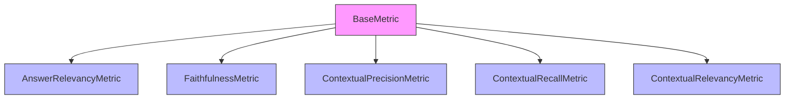
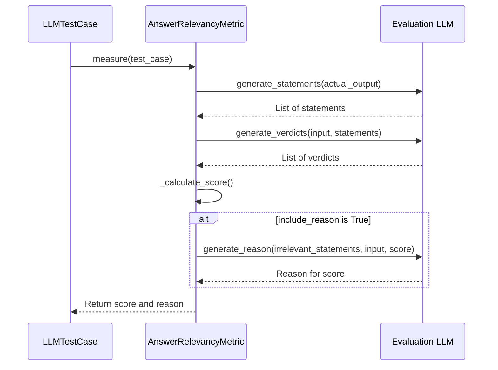
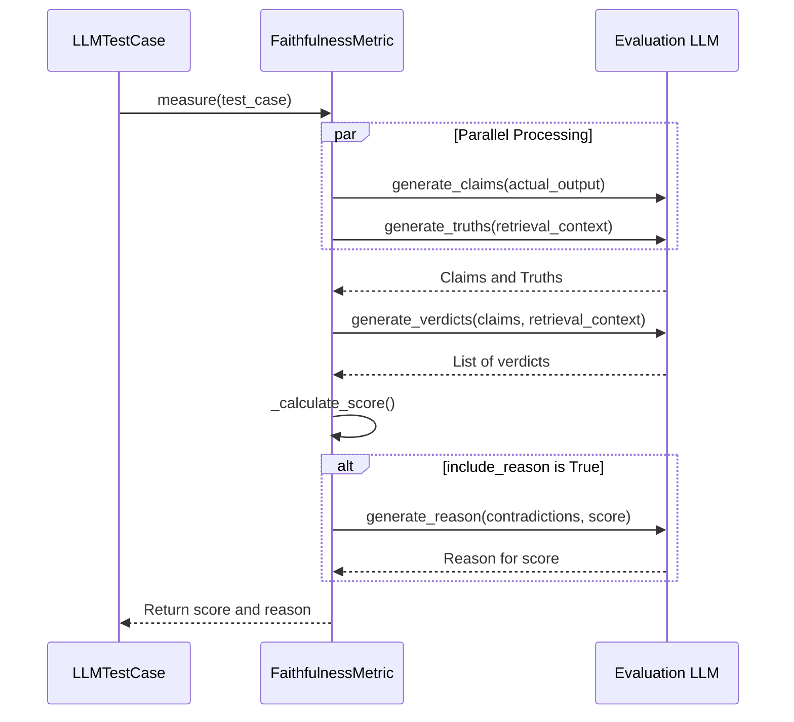
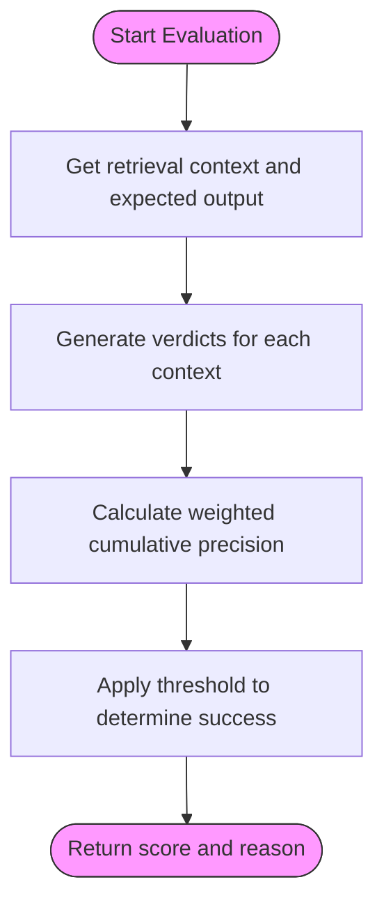
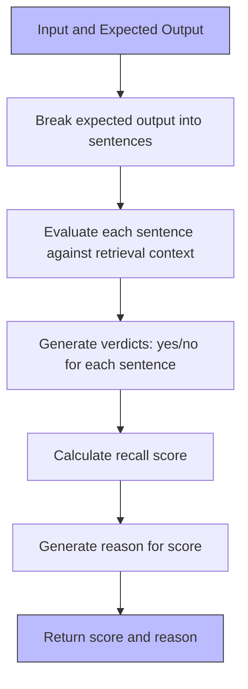
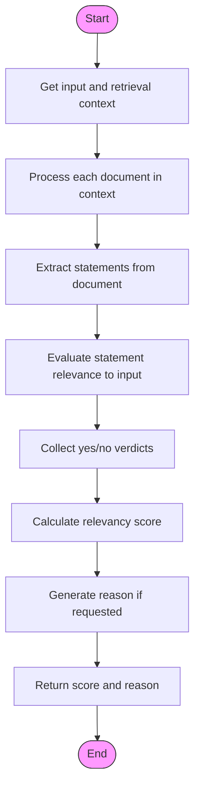
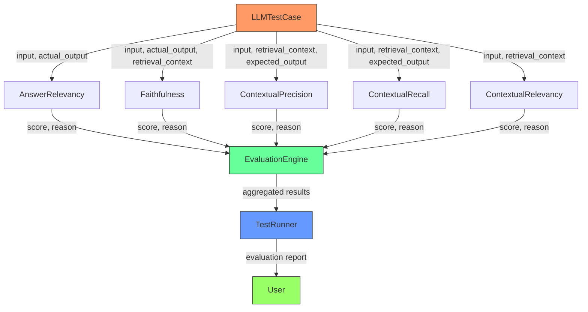
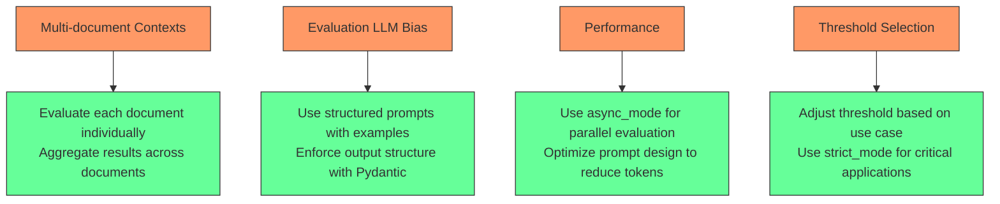

# RAG Metrics

<cite>
**Referenced Files in This Document**   
- [answer_relevancy.py](file://deepeval/metrics/answer_relevancy/answer_relevancy.py)
- [faithfulness.py](file://deepeval/metrics/faithfulness/faithfulness.py)
- [contextual_precision.py](file://deepeval/metrics/contextual_precision/contextual_precision.py)
- [contextual_recall.py](file://deepeval/metrics/contextual_recall/contextual_recall.py)
- [contextual_relevancy.py](file://deepeval/metrics/contextual_relevancy/contextual_relevancy.py)
- [schema.py](file://deepeval/metrics/answer_relevancy/schema.py)
- [schema.py](file://deepeval/metrics/faithfulness/schema.py)
- [schema.py](file://deepeval/metrics/contextual_precision/schema.py)
- [schema.py](file://deepeval/metrics/contextual_recall/schema.py)
- [schema.py](file://deepeval/metrics/contextual_relevancy/schema.py)
- [template.py](file://deepeval/metrics/answer_relevancy/template.py)
- [template.py](file://deepeval/metrics/faithfulness/template.py)
- [template.py](file://deepeval/metrics/contextual_precision/template.py)
- [template.py](file://deepeval/metrics/contextual_recall/template.py)
- [template.py](file://deepeval/metrics/contextual_relevancy/template.py)
</cite>

## Table of Contents
1. [Introduction](#introduction)
2. [Core RAG Metrics Overview](#core-rag-metrics-overview)
3. [Answer Relevancy Metric](#answer-relevancy-metric)
4. [Faithfulness Metric](#faithfulness-metric)
5. [Contextual Precision Metric](#contextual-precision-metric)
6. [Contextual Recall Metric](#contextual-recall-metric)
7. [Contextual Relevancy Metric](#contextual-relevancy-metric)
8. [Metric Relationships and Invocation Flow](#metric-relationships-and-invocation-flow)
9. [Domain Models and Data Structures](#domain-models-and-data-structures)
10. [Common Issues and Solutions](#common-issues-and-solutions)
11. [Conclusion](#conclusion)

## Introduction

Retrieval-Augmented Generation (RAG) systems combine information retrieval with language generation to produce more accurate and contextually relevant responses. DeepEval provides a comprehensive suite of metrics specifically designed to evaluate the quality of RAG systems. These metrics assess various dimensions of RAG performance, including the relevance of generated answers, the faithfulness of responses to retrieved context, and the quality of retrieved context itself.

The RAG metrics in DeepEval leverage the LLM-as-a-judge methodology, where a large language model is used to evaluate the quality of another model's outputs. This approach allows for nuanced assessment of complex language patterns and relationships between inputs, retrieved context, and generated responses. Each metric follows a consistent pattern of evaluation, using specialized prompts to guide the evaluation model in making judgments about different aspects of RAG system performance.

These metrics are essential for developers and researchers working with RAG systems, as they provide quantitative measures for identifying strengths and weaknesses in their implementations. By using these metrics, practitioners can iteratively improve their RAG systems, ensuring higher quality outputs and better alignment with user needs.

**Section sources**
- [answer_relevancy.py](file://deepeval/metrics/answer_relevancy/answer_relevancy.py#L1-L320)
- [faithfulness.py](file://deepeval/metrics/faithfulness/faithfulness.py#L1-L356)
- [contextual_precision.py](file://deepeval/metrics/contextual_precision/contextual_precision.py#L1-L306)

## Core RAG Metrics Overview

DeepEval provides five core metrics for evaluating Retrieval-Augmented Generation systems: Answer Relevancy, Faithfulness, Contextual Precision, Contextual Recall, and Contextual Relevancy. These metrics assess different aspects of RAG system performance, from the quality of the generated response to the relevance of the retrieved context.

Each metric inherits from the `BaseMetric` class and follows a consistent interface pattern. They all accept similar parameters including `threshold`, `model`, `include_reason`, `async_mode`, and `strict_mode`. The metrics use LLM-as-a-judge methodology to evaluate RAG components, generating verdicts based on specialized prompts and calculating scores from these verdicts.

The metrics are designed to work with `LLMTestCase` objects that contain the necessary components for evaluation: input, actual output, expected output, and retrieval context. Depending on the specific metric, different combinations of these components are required. For example, Answer Relevancy requires input and actual output, while Faithfulness additionally requires retrieval context.

All metrics support both synchronous and asynchronous evaluation modes, allowing for flexible integration into different testing workflows. They also provide detailed reasoning for their scores when the `include_reason` parameter is set to true, helping users understand the basis for each evaluation.

**Diagram sources**
- [answer_relevancy.py](file://deepeval/metrics/answer_relevancy/answer_relevancy.py#L28-L320)
- [faithfulness.py](file://deepeval/metrics/faithfulness/faithfulness.py#L30-L356)
- [contextual_precision.py](file://deepeval/metrics/contextual_precision/contextual_precision.py#L28-L306)
- [contextual_recall.py](file://deepeval/metrics/contextual_recall/contextual_recall.py#L30-L294)
- [contextual_relevancy.py](file://deepeval/metrics/contextual_relevancy/contextual_relevancy.py#L32-L289)

**Section sources**
- [answer_relevancy.py](file://deepeval/metrics/answer_relevancy/answer_relevancy.py#L28-L320)
- [faithfulness.py](file://deepeval/metrics/faithfulness/faithfulness.py#L30-L356)
- [contextual_precision.py](file://deepeval/metrics/contextual_precision/contextual_precision.py#L28-L306)

## Answer Relevancy Metric

The Answer Relevancy metric evaluates whether the generated response is relevant to the input question or prompt. This metric assesses if the actual output addresses what was asked in the input, filtering out responses that contain irrelevant information or go off-topic.

The metric works by first breaking down the actual output into individual statements using the `generate_statements` method from the `AnswerRelevancyTemplate`. Then, for each statement, it determines whether the statement is relevant to the input using the `generate_verdicts` method. Statements are classified as "yes" (relevant), "no" (irrelevant), or "idk" (ambiguous or potentially supporting information).

The final score is calculated as the ratio of relevant statements to total statements. A threshold parameter controls the minimum score required for the metric to be considered successful. When `include_reason` is enabled, the metric provides a concise explanation of the score, highlighting why irrelevant statements lowered the score or providing positive feedback when all statements are relevant.

**Diagram sources**
- [answer_relevancy.py](file://deepeval/metrics/answer_relevancy/answer_relevancy.py#L55-L320)
- [template.py](file://deepeval/metrics/answer_relevancy/template.py#L5-L130)

**Section sources**
- [answer_relevancy.py](file://deepeval/metrics/answer_relevancy/answer_relevancy.py#L28-L320)
- [schema.py](file://deepeval/metrics/answer_relevancy/schema.py#L1-L20)
- [template.py](file://deepeval/metrics/answer_relevancy/template.py#L5-L130)

## Faithfulness Metric

The Faithfulness metric evaluates whether the generated response is factually consistent with the retrieved context. This metric checks for hallucinations or contradictions between the actual output and the information provided in the retrieval context.

The evaluation process involves three main steps: extracting claims from the actual output, extracting truths from the retrieval context, and comparing claims against truths to identify contradictions. The metric first uses the `generate_claims` method to extract factual statements from the actual output, then uses `generate_truths` to extract factual statements from the retrieval context.

The core of the evaluation is the `generate_verdicts` method, which compares each claim against the retrieval context to determine if it contradicts any facts. Claims are classified as "yes" (consistent with context), "no" (contradicts context), or "idk" (not supported by context). The final score is the ratio of non-contradictory claims to total claims.

The metric includes a `penalize_ambiguous_claims` parameter that can reduce the score for claims marked as "idk", encouraging models to only make statements they can support with retrieved information. This helps prevent models from making speculative or unsupported claims.

**Diagram sources**
- [faithfulness.py](file://deepeval/metrics/faithfulness/faithfulness.py#L63-L356)
- [template.py](file://deepeval/metrics/faithfulness/template.py#L5-L226)

**Section sources**
- [faithfulness.py](file://deepeval/metrics/faithfulness/faithfulness.py#L30-L356)
- [schema.py](file://deepeval/metrics/faithfulness/schema.py#L1-L24)
- [template.py](file://deepeval/metrics/faithfulness/template.py#L5-L226)

## Contextual Precision Metric

The Contextual Precision metric evaluates whether the retrieved context contains information that is relevant to answering the input question. Unlike Faithfulness, which focuses on the consistency between output and context, Contextual Precision assesses the quality of the retrieval process itself.

This metric determines if the retrieved documents contain information that could be used to generate the expected output. It works by analyzing each document in the retrieval context and determining whether it contains information relevant to the input and expected output. Documents are classified as "yes" (relevant) or "no" (irrelevant).

A key feature of Contextual Precision is that it considers the ranking of retrieved documents. The metric uses a weighted cumulative precision calculation that gives higher weight to relevant documents that appear earlier in the retrieval results. This encourages retrieval systems to not only find relevant information but to rank it highly.

The evaluation process involves generating verdicts for each document in the retrieval context, then calculating a weighted score based on the position and relevance of each document. Documents that contain information directly supporting the expected output receive a "yes" verdict, while those with irrelevant information receive a "no" verdict.

**Diagram sources**
- [contextual_precision.py](file://deepeval/metrics/contextual_precision/contextual_precision.py#L56-L306)
- [template.py](file://deepeval/metrics/contextual_precision/template.py#L7-L134)

**Section sources**
- [contextual_precision.py](file://deepeval/metrics/contextual_precision/contextual_precision.py#L28-L306)
- [schema.py](file://deepeval/metrics/contextual_precision/schema.py#L1-L16)
- [template.py](file://deepeval/metrics/contextual_precision/template.py#L7-L134)

## Contextual Recall Metric

The Contextual Recall metric evaluates the comprehensiveness of the retrieved context in covering the information needed to generate the expected output. While Contextual Precision focuses on the relevance of retrieved information, Contextual Recall assesses whether all necessary information has been retrieved.

This metric works by breaking down the expected output into individual sentences or components and determining whether each component can be attributed to information in the retrieval context. For each sentence in the expected output, the metric generates a verdict of "yes" (supported by context) or "no" (not supported by context).

The final score is calculated as the ratio of sentences in the expected output that are supported by the retrieval context to the total number of sentences. A high Contextual Recall score indicates that the retrieval system has captured most or all of the information needed to generate the expected response.

The metric provides detailed reasoning by identifying which parts of the expected output are supported by specific nodes in the retrieval context. This helps users understand gaps in retrieval coverage and identify areas for improvement in their retrieval systems.

**Diagram sources**
- [contextual_recall.py](file://deepeval/metrics/contextual_recall/contextual_recall.py#L59-L294)
- [template.py](file://deepeval/metrics/contextual_recall/template.py#L7-L127)

**Section sources**
- [contextual_recall.py](file://deepeval/metrics/contextual_recall/contextual_recall.py#L30-L294)
- [schema.py](file://deepeval/metrics/contextual_recall/schema.py#L1-L16)
- [template.py](file://deepeval/metrics/contextual_recall/template.py#L7-L127)

## Contextual Relevancy Metric

The Contextual Relevancy metric evaluates whether the retrieved context is relevant to the input question. This metric assesses the quality of the retrieval process by determining if the retrieved documents contain information that is pertinent to the user's query.

Unlike Contextual Precision and Recall, which focus on the relationship between retrieved context and expected output, Contextual Relevancy directly evaluates the relationship between retrieved context and input. This makes it particularly useful for assessing whether a retrieval system is fetching information that actually addresses the user's question.

The metric works by analyzing each document in the retrieval context and determining whether its content is relevant to the input. For each document, it extracts statements and evaluates their relevance to the input. Statements are classified as "yes" (relevant) or "no" (irrelevant), with reasons provided for irrelevant statements.

The final score is calculated as the ratio of relevant statements across all retrieved documents to the total number of statements. This provides a comprehensive assessment of retrieval quality, penalizing both irrelevant documents and irrelevant portions of otherwise relevant documents.

**Diagram sources**
- [contextual_relevancy.py](file://deepeval/metrics/contextual_relevancy/contextual_relevancy.py#L59-L289)
- [template.py](file://deepeval/metrics/contextual_relevancy/template.py#L5-L107)

**Section sources**
- [contextual_relevancy.py](file://deepeval/metrics/contextual_relevancy/contextual_relevancy.py#L32-L289)
- [schema.py](file://deepeval/metrics/contextual_relevancy/schema.py#L1-L17)
- [template.py](file://deepeval/metrics/contextual_relevancy/template.py#L5-L107)

## Metric Relationships and Invocation Flow

The RAG metrics in DeepEval are designed to work together as part of a comprehensive evaluation framework. They share a common architecture and invocation pattern, inheriting from the `BaseMetric` class and implementing a consistent interface.

All metrics follow a similar invocation flow: they receive an `LLMTestCase` object, validate the required parameters, generate intermediate results through LLM calls, calculate a score, and return the results. The `measure` method serves as the primary entry point, with an asynchronous counterpart `a_measure` for non-blocking evaluation.

The metrics are interconnected through their shared dependencies on the evaluation framework, including the `generate_with_schema_and_extract` function for structured LLM output, the `construct_verbose_logs` function for detailed logging, and the `metric_progress_indicator` for user feedback during evaluation.

**Diagram sources**
- [answer_relevancy.py](file://deepeval/metrics/answer_relevancy/answer_relevancy.py#L55-L320)
- [faithfulness.py](file://deepeval/metrics/faithfulness/faithfulness.py#L63-L356)
- [contextual_precision.py](file://deepeval/metrics/contextual_precision/contextual_precision.py#L56-L306)
- [contextual_recall.py](file://deepeval/metrics/contextual_recall/contextual_recall.py#L59-L294)
- [contextual_relevancy.py](file://deepeval/metrics/contextual_relevancy/contextual_relevancy.py#L59-L289)

**Section sources**
- [answer_relevancy.py](file://deepeval/metrics/answer_relevancy/answer_relevancy.py#L55-L320)
- [faithfulness.py](file://deepeval/metrics/faithfulness/faithfulness.py#L63-L356)
- [contextual_precision.py](file://deepeval/metrics/contextual_precision/contextual_precision.py#L56-L306)

## Domain Models and Data Structures

The RAG metrics in DeepEval use a consistent set of domain models and data structures to represent evaluation results. These models are defined using Pydantic for type safety and validation.

Each metric uses specialized verdict models that capture the evaluation results. For example, `AnswerRelevancyVerdict` contains a verdict ("yes", "no", or "idk") and an optional reason for non-positive verdicts. Similarly, `FaithfulnessVerdict` captures whether a claim contradicts the retrieval context.

The metrics also use container models like `Verdicts` that hold lists of individual verdicts, and score reason models like `AnswerRelevancyScoreReason` that provide explanations for the final score. These models ensure consistent data representation across different metrics.

The evaluation framework uses `LLMTestCase` objects to encapsulate the inputs and outputs being evaluated. These objects contain fields like `input`, `actual_output`, `expected_output`, and `retrieval_context`, which are used by different metrics depending on their requirements.

```mermaid
classDiagram
class LLMTestCase {
+str input
+str actual_output
+str expected_output
+List[str] retrieval_context
+bool multimodal
}
class BaseMetric {
+float threshold
+DeepEvalBaseLLM model
+bool include_reason
+bool async_mode
+bool strict_mode
+float score
+bool success
+str reason
+measure(test_case) float
+a_measure(test_case) float
}
class AnswerRelevancyVerdict {
+Literal["yes","no","idk"] verdict
+Optional[str] reason
}
class FaithfulnessVerdict {
+Literal["yes","no","idk"] verdict
+Optional[str] reason
}
class ContextualPrecisionVerdict {
+str verdict
+str reason
}
class ContextualRecallVerdict {
+str verdict
+str reason
}
class ContextualRelevancyVerdict {
+str statement
+str verdict
+Optional[str] reason
}
class Verdicts {
+List[AnswerRelevancyVerdict] verdicts
}
class AnswerRelevancyScoreReason {
+str reason
}
BaseMetric <|-- AnswerRelevancyMetric
BaseMetric <|-- FaithfulnessMetric
BaseMetric <|-- ContextualPrecisionMetric
BaseMetric <|-- ContextualRecallMetric
BaseMetric <|-- ContextualRelevancyMetric
AnswerRelevancyMetric --> AnswerRelevancyVerdict
AnswerRelevancyMetric --> Verdicts
AnswerRelevancyMetric --> AnswerRelevancyScoreReason
FaithfulnessMetric --> FaithfulnessVerdict
FaithfulnessMetric --> Verdicts
FaithfulnessMetric --> FaithfulnessScoreReason
ContextualPrecisionMetric --> ContextualPrecisionVerdict
ContextualPrecisionMetric --> Verdicts
ContextualPrecisionMetric --> ContextualPrecisionScoreReason
ContextualRecallMetric --> ContextualRecallVerdict
ContextualRecallMetric --> Verdicts
ContextualRecallMetric --> ContextualRecallScoreReason
ContextualRelevancyMetric --> ContextualRelevancyVerdict
ContextualRelevancyMetric --> ContextualRelevancyVerdicts
ContextualRelevancyMetric --> ContextualRelevancyScoreReason
style LLMTestCase fill : #f96,stroke : #333
style BaseMetric fill : #f9f,stroke : #333
style AnswerRelevancyVerdict fill : #bbf,stroke : #333
style FaithfulnessVerdict fill : #bbf,stroke : #333
style ContextualPrecisionVerdict fill : #bbf,stroke : #333
style ContextualRecallVerdict fill : #bbf,stroke : #333
style ContextualRelevancyVerdict fill : #bbf,stroke : #333
```

**Diagram sources**
- [schema.py](file://deepeval/metrics/answer_relevancy/schema.py#L1-L20)
- [schema.py](file://deepeval/metrics/faithfulness/schema.py#L1-L24)
- [schema.py](file://deepeval/metrics/contextual_precision/schema.py#L1-L16)
- [schema.py](file://deepeval/metrics/contextual_recall/schema.py#L1-L16)
- [schema.py](file://deepeval/metrics/contextual_relevancy/schema.py#L1-L17)
- [answer_relevancy.py](file://deepeval/metrics/answer_relevancy/answer_relevancy.py#L28-L320)

**Section sources**
- [schema.py](file://deepeval/metrics/answer_relevancy/schema.py#L1-L20)
- [schema.py](file://deepeval/metrics/faithfulness/schema.py#L1-L24)
- [schema.py](file://deepeval/metrics/contextual_precision/schema.py#L1-L16)
- [schema.py](file://deepeval/metrics/contextual_recall/schema.py#L1-L16)
- [schema.py](file://deepeval/metrics/contextual_relevancy/schema.py#L1-L17)

## Common Issues and Solutions

When working with RAG metrics in DeepEval, several common issues may arise. Understanding these issues and their solutions is crucial for effective evaluation of RAG systems.

One common issue is handling multi-document contexts, where the retrieval system returns multiple documents. The Contextual Relevancy and Contextual Precision metrics handle this by evaluating each document individually and aggregating the results. For Contextual Relevancy, verdicts are generated for each document, while Contextual Precision considers the ranking of documents in its weighted calculation.

Another issue is the potential for evaluation LLMs to introduce bias or inconsistency in their judgments. DeepEval addresses this by using structured prompts with clear instructions and examples, and by extracting structured outputs using Pydantic models to ensure consistency.

Performance can be a concern when evaluating large numbers of test cases. DeepEval provides asynchronous evaluation modes (`async_mode=True`) to improve throughput, and the metrics are designed to minimize unnecessary LLM calls through efficient processing pipelines.

Threshold selection is another important consideration. The default threshold of 0.5 may not be appropriate for all use cases. For critical applications, a higher threshold in strict mode (where the threshold is set to 1) may be appropriate to ensure only perfect scores are considered successful.

**Diagram sources**
- [contextual_relevancy.py](file://deepeval/metrics/contextual_relevancy/contextual_relevancy.py#L98-L101)
- [contextual_precision.py](file://deepeval/metrics/contextual_precision/contextual_precision.py#L95-L102)
- [answer_relevancy.py](file://deepeval/metrics/answer_relevancy/answer_relevancy.py#L46-L52)

**Section sources**
- [answer_relevancy.py](file://deepeval/metrics/answer_relevancy/answer_relevancy.py#L36-L52)
- [faithfulness.py](file://deepeval/metrics/faithfulness/faithfulness.py#L39-L47)
- [contextual_precision.py](file://deepeval/metrics/contextual_precision/contextual_precision.py#L37-L46)

## Conclusion

The RAG metrics in DeepEval provide a comprehensive framework for evaluating Retrieval-Augmented Generation systems. These metrics—Answer Relevancy, Faithfulness, Contextual Precision, Contextual Recall, and Contextual Relevancy—assess different dimensions of RAG performance, from the quality of generated responses to the effectiveness of the retrieval process.

Each metric leverages the LLM-as-a-judge methodology, using specialized prompts to guide evaluation models in making consistent and reliable judgments. The metrics share a common architecture and interface, making them easy to integrate and use together in comprehensive evaluation workflows.

The domain models and data structures are designed for type safety and consistency, using Pydantic for validation and structured output. The metrics provide detailed reasoning for their scores, helping users understand the basis for each evaluation and identify areas for improvement.

By using these metrics, developers and researchers can systematically evaluate and improve their RAG systems, ensuring higher quality outputs and better alignment with user needs. The metrics support both synchronous and asynchronous evaluation, and provide mechanisms to handle common issues like multi-document contexts and evaluation LLM bias.

These RAG metrics represent a significant advancement in the evaluation of retrieval-augmented systems, providing the tools needed to build more reliable, accurate, and trustworthy AI applications.

**Section sources**
- [answer_relevancy.py](file://deepeval/metrics/answer_relevancy/answer_relevancy.py#L28-L320)
- [faithfulness.py](file://deepeval/metrics/faithfulness/faithfulness.py#L30-L356)
- [contextual_precision.py](file://deepeval/metrics/contextual_precision/contextual_precision.py#L28-L306)