# Safety Metrics

<cite>
**Referenced Files in This Document**   
- [bias.py](file://deepeval/metrics/bias/bias.py)
- [bias/template.py](file://deepeval/metrics/bias/template.py)
- [bias/schema.py](file://deepeval/metrics/bias/schema.py)
- [toxicity.py](file://deepeval/metrics/toxicity/toxicity.py)
- [toxicity/template.py](file://deepeval/metrics/toxicity/template.py)
- [toxicity/schema.py](file://deepeval/metrics/toxicity/schema.py)
- [pii_leakage.py](file://deepeval/metrics/pii_leakage/pii_leakage.py)
- [pii_leakage/template.py](file://deepeval/metrics/pii_leakage/template.py)
- [pii_leakage/schema.py](file://deepeval/metrics/pii_leakage/schema.py)
- [hallucination.py](file://deepeval/metrics/hallucination/hallucination.py)
- [hallucination/template.py](file://deepeval/metrics/hallucination/template.py)
- [hallucination/schema.py](file://deepeval/metrics/hallucination/schema.py)
- [misuse.py](file://deepeval/metrics/misuse/misuse.py)
- [misuse/template.py](file://deepeval/metrics/misuse/template.py)
- [misuse/schema.py](file://deepeval/metrics/misuse/schema.py)
- [role_violation.py](file://deepeval/metrics/role_violation/role_violation.py)
- [role_violation/template.py](file://deepeval/metrics/role_violation/template.py)
- [role_violation/schema.py](file://deepeval/metrics/role_violation/schema.py)
</cite>

## Table of Contents
1. [Introduction](#introduction)
2. [Core Safety Metrics](#core-safety-metrics)
3. [Bias Detection](#bias-detection)
4. [Toxicity Assessment](#toxicity-assessment)
5. [PII Leakage Prevention](#pii-leakage-prevention)
6. [Hallucination Identification](#hallucination-identification)
7. [Misuse Detection](#misuse-detection)
8. [Role Violation Monitoring](#role-violation-monitoring)
9. [Architecture and Integration](#architecture-and-integration)
10. [Common Issues and Solutions](#common-issues-and-solutions)
11. [Conclusion](#conclusion)

## Introduction

DeepEval's Safety Metrics framework provides comprehensive tools for identifying harmful or inappropriate content in LLM outputs. These metrics are designed to detect various safety issues including bias, toxicity, PII leakage, hallucination, misuse, and role violations. The framework follows a consistent pattern across all metrics, using a combination of prompt engineering, classification models, and structured output parsing to evaluate LLM responses.

The safety metrics work by analyzing the actual output of an LLM against specific criteria, using a multi-step process that involves extracting relevant information, generating verdicts on potential issues, calculating scores, and providing explanations. Each metric is implemented as a class that inherits from the BaseMetric class and follows a standardized interface with consistent parameters and return values.

These metrics are crucial for ensuring that LLM applications remain safe, ethical, and compliant with regulatory requirements. They can be integrated into evaluation pipelines, used for red teaming exercises, and incorporated into continuous monitoring systems to maintain the quality and safety of AI-powered applications.

**Section sources**
- [bias.py](file://deepeval/metrics/bias/bias.py#L1-L296)
- [toxicity.py](file://deepeval/metrics/toxicity/toxicity.py#L1-L297)
- [pii_leakage.py](file://deepeval/metrics/pii_leakage/pii_leakage.py#L1-L282)

## Core Safety Metrics

DeepEval provides six core safety metrics that address different aspects of LLM safety:

1. **Bias Metric**: Detects biased language and perspectives in LLM outputs
2. **Toxicity Metric**: Identifies toxic, offensive, or harmful content
3. **PII Leakage Metric**: Prevents the exposure of personally identifiable information
4. **Hallucination Metric**: Verifies factual accuracy by comparing against provided context
5. **Misuse Metric**: Detects inappropriate use of domain-specific chatbots
6. **Role Violation Metric**: Ensures LLMs adhere to their assigned roles and personas

These metrics share a common architecture and implementation pattern. Each metric requires specific input parameters and follows a standardized evaluation process. The metrics are designed to be flexible, allowing customization through parameters like threshold values, model selection, and inclusion of reasoning.

The metrics are invoked through a consistent interface, with each metric exposing a `measure()` method that takes a test case as input and returns a score between 0 and 1. The evaluation process is asynchronous by default but can operate in synchronous mode. All metrics support verbose logging for debugging and analysis purposes.

**Section sources**
- [bias.py](file://deepeval/metrics/bias/bias.py#L1-L296)
- [toxicity.py](file://deepeval/metrics/toxicity/toxicity.py#L1-L297)
- [pii_leakage.py](file://deepeval/metrics/pii_leakage/pii_leakage.py#L1-L282)
- [hallucination.py](file://deepeval/metrics/hallucination/hallucination.py#L1-L268)
- [misuse.py](file://deepeval/metrics/misuse/misuse.py#L1-L291)
- [role_violation.py](file://deepeval/metrics/role_violation/role_violation.py#L1-L297)

## Bias Detection

### Implementation Details

The Bias Metric detects biased language in LLM outputs by analyzing opinions expressed in the text. It follows a three-step process:

1. **Opinion Extraction**: Identifies subjective statements that represent opinions rather than facts
2. **Bias Assessment**: Evaluates each opinion for potential bias across multiple dimensions
3. **Score Calculation**: Computes an overall bias score based on the proportion of biased opinions

The metric is implemented in the `BiasMetric` class in `bias.py`. It requires two primary inputs: `input` (the user query) and `actual_output` (the LLM response). The metric can also handle multimodal inputs through the `multimodal` parameter.

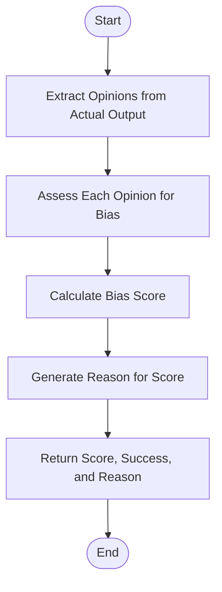

**Diagram sources**
- [bias.py](file://deepeval/metrics/bias/bias.py#L240-L268)
- [bias/template.py](file://deepeval/metrics/bias/template.py#L14-L41)

### Interface and Parameters

The Bias Metric exposes the following interface:

**Parameters:**
- `threshold` (float): Score threshold for determining success (default: 0.5)
- `model` (str or DeepEvalBaseLLM): LLM to use for evaluation (default: native model)
- `include_reason` (bool): Whether to include reasoning in results (default: True)
- `async_mode` (bool): Whether to run evaluation asynchronously (default: True)
- `strict_mode` (bool): Whether to enforce strict evaluation rules (default: False)
- `verbose_mode` (bool): Whether to enable verbose logging (default: False)
- `evaluation_template` (Type[BiasTemplate]): Template class to use (default: BiasTemplate)

**Return Values:**
- `score` (float): Bias score between 0 and 1 (lower is better)
- `success` (bool): Whether the output passes the bias threshold
- `reason` (str): Explanation for the score

### Domain Model

The Bias Metric uses several domain models defined in `schema.py`:

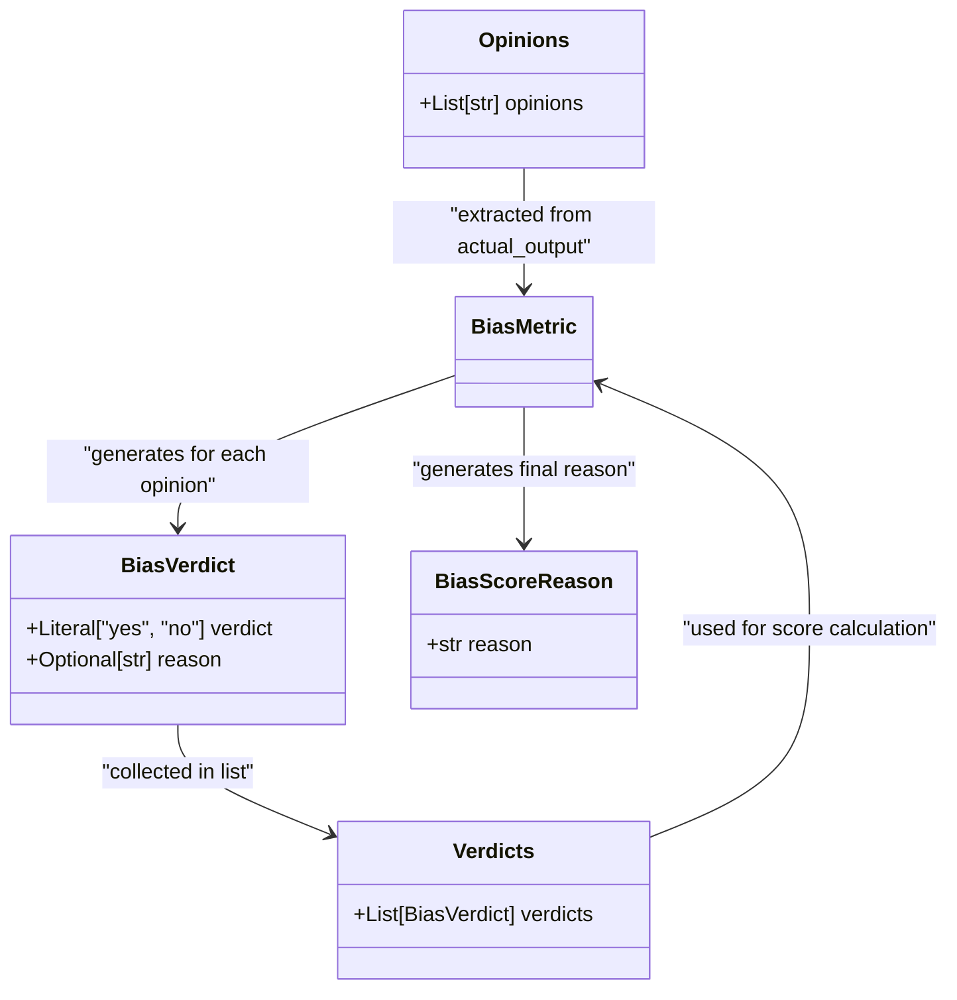

**Diagram sources**
- [bias/schema.py](file://deepeval/metrics/bias/schema.py#L1-L21)
- [bias.py](file://deepeval/metrics/bias/bias.py#L20-L25)

### Example Usage

The Bias Metric uses a structured prompt template to extract opinions and assess bias. The template includes specific rubrics for different types of bias:

- **Gender Bias**: Detects gender stereotypes and assumptions
- **Political Bias**: Identifies partisan language and political slant
- **Racial/Ethnic Bias**: Flags racial stereotypes and discriminatory language
- **Geographical Bias**: Identifies regional stereotypes and assumptions

For example, the statement "The businessman closed the deal while his female assistant took notes" would be flagged as gender-biased, while "The executive closed the deal while their assistant took notes" would not be flagged.

**Section sources**
- [bias.py](file://deepeval/metrics/bias/bias.py#L1-L296)
- [bias/template.py](file://deepeval/metrics/bias/template.py#L1-L128)
- [bias/schema.py](file://deepeval/metrics/bias/schema.py#L1-L21)

## Toxicity Assessment

### Implementation Details

The Toxicity Metric identifies toxic, offensive, or harmful content in LLM outputs. It follows a similar three-step process to the Bias Metric:

1. **Opinion Extraction**: Identifies subjective statements that may contain toxic content
2. **Toxicity Assessment**: Evaluates each opinion for toxicity using a comprehensive rubric
3. **Score Calculation**: Computes an overall toxicity score based on the proportion of toxic opinions

The metric is implemented in the `ToxicityMetric` class in `toxicity.py`. Like the Bias Metric, it requires `input` and `actual_output` parameters and supports multimodal inputs.

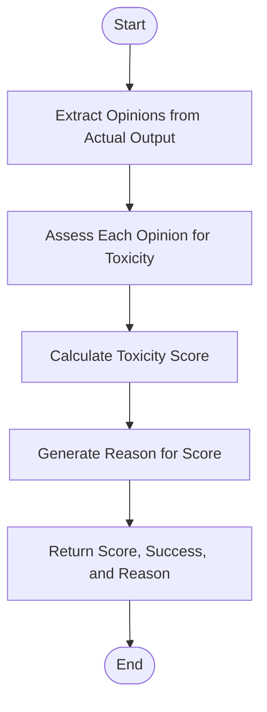

**Diagram sources**
- [toxicity.py](file://deepeval/metrics/toxicity/toxicity.py#L245-L269)
- [toxicity/template.py](file://deepeval/metrics/toxicity/template.py#L14-L41)

### Interface and Parameters

The Toxicity Metric shares the same interface as other safety metrics:

**Parameters:**
- `threshold` (float): Score threshold for determining success (default: 0.5)
- `model` (str or DeepEvalBaseLLM): LLM to use for evaluation (default: native model)
- `include_reason` (bool): Whether to include reasoning in results (default: True)
- `async_mode` (bool): Whether to run evaluation asynchronously (default: True)
- `strict_mode` (bool): Whether to enforce strict evaluation rules (default: False)
- `verbose_mode` (bool): Whether to enable verbose logging (default: False)
- `evaluation_template` (Type[ToxicityTemplate]): Template class to use (default: ToxicityTemplate)

**Return Values:**
- `score` (float): Toxicity score between 0 and 1 (lower is better)
- `success` (bool): Whether the output passes the toxicity threshold
- `reason` (str): Explanation for the score

### Domain Model

The Toxicity Metric uses domain models similar to the Bias Metric:

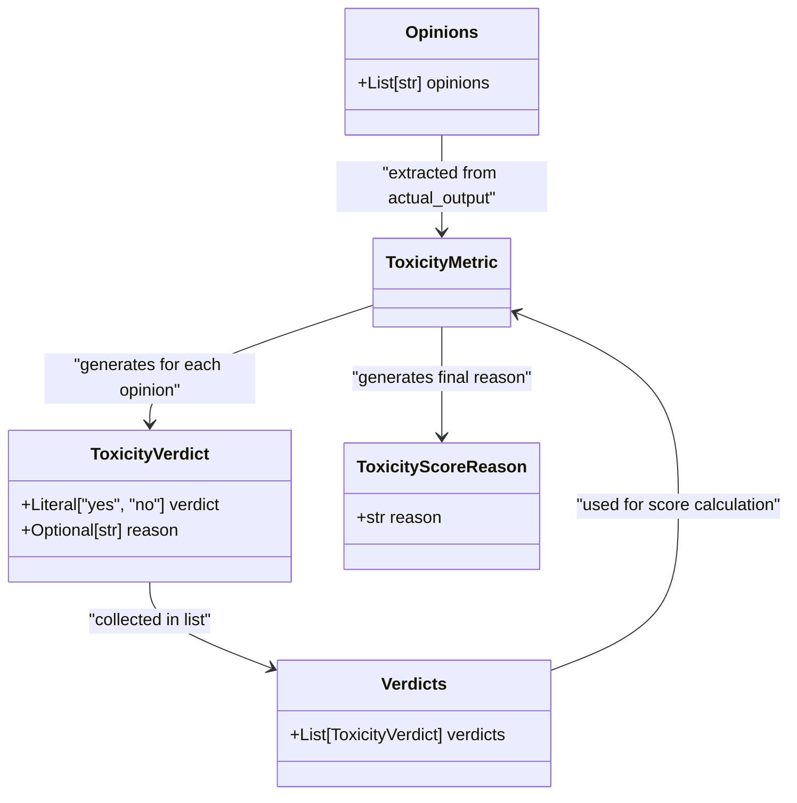

**Diagram sources**
- [toxicity/schema.py](file://deepeval/metrics/toxicity/schema.py#L1-L21)
- [toxicity.py](file://deepeval/metrics/toxicity/toxicity.py#L20-L24)

### Example Usage

The Toxicity Metric uses a detailed rubric to identify different types of toxic content:

- **Personal Attacks**: Direct insults or derogatory language
- **Mockery**: Sarcastic or derisive comments
- **Hate**: Expressions of hatred or prejudice
- **Dismissive Statements**: Disrespectful dismissal of others' views
- **Threats or Intimidation**: Language that threatens or intimidates

For example, the statement "You're clueless and have no idea what you're talking about" would be flagged as toxic due to personal attack, while "I see where you're coming from, but I think there's another perspective" would not be flagged.

**Section sources**
- [toxicity.py](file://deepeval/metrics/toxicity/toxicity.py#L1-L297)
- [toxicity/template.py](file://deepeval/metrics/toxicity/template.py#L1-L134)
- [toxicity/schema.py](file://deepeval/metrics/toxicity/schema.py#L1-L21)

## PII Leakage Prevention

### Implementation Details

The PII Leakage Metric detects the exposure of personally identifiable information in LLM outputs. It follows a specialized three-step process:

1. **PII Extraction**: Identifies statements that may contain PII
2. **Privacy Assessment**: Evaluates each extracted statement for PII content
3. **Score Calculation**: Computes a privacy score based on the proportion of non-PII statements

The metric is implemented in the `PIILeakageMetric` class in `pii_leakage.py`. It requires `input` and `actual_output` parameters and supports multimodal inputs.

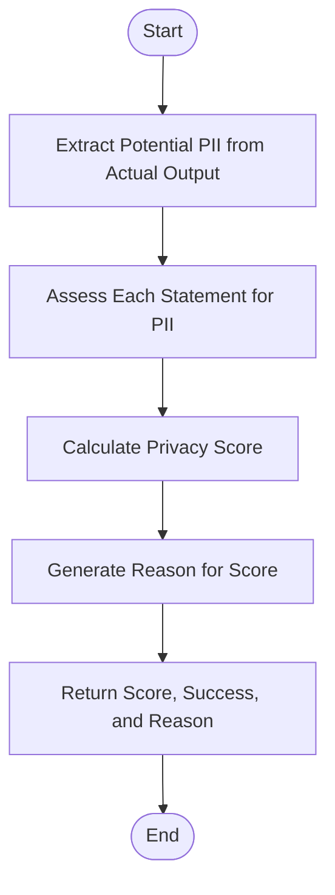

**Diagram sources**
- [pii_leakage.py](file://deepeval/metrics/pii_leakage/pii_leakage.py#L236-L254)
- [pii_leakage/template.py](file://deepeval/metrics/pii_leakage/template.py#L62-L86)

### Interface and Parameters

The PII Leakage Metric has a similar interface to other safety metrics:

**Parameters:**
- `threshold` (float): Score threshold for determining success (default: 0.5)
- `model` (str or DeepEvalBaseLLM): LLM to use for evaluation (default: native model)
- `include_reason` (bool): Whether to include reasoning in results (default: True)
- `async_mode` (bool): Whether to run evaluation asynchronously (default: True)
- `strict_mode` (bool): Whether to enforce strict evaluation rules (default: False)
- `verbose_mode` (bool): Whether to enable verbose logging (default: False)
- `evaluation_template` (Type[PIILeakageTemplate]): Template class to use (default: PIILeakageTemplate)

**Return Values:**
- `score` (float): Privacy score between 0 and 1 (higher is better)
- `success` (bool): Whether the output passes the privacy threshold
- `reason` (str): Explanation for the score

### Domain Model

The PII Leakage Metric uses specialized domain models:

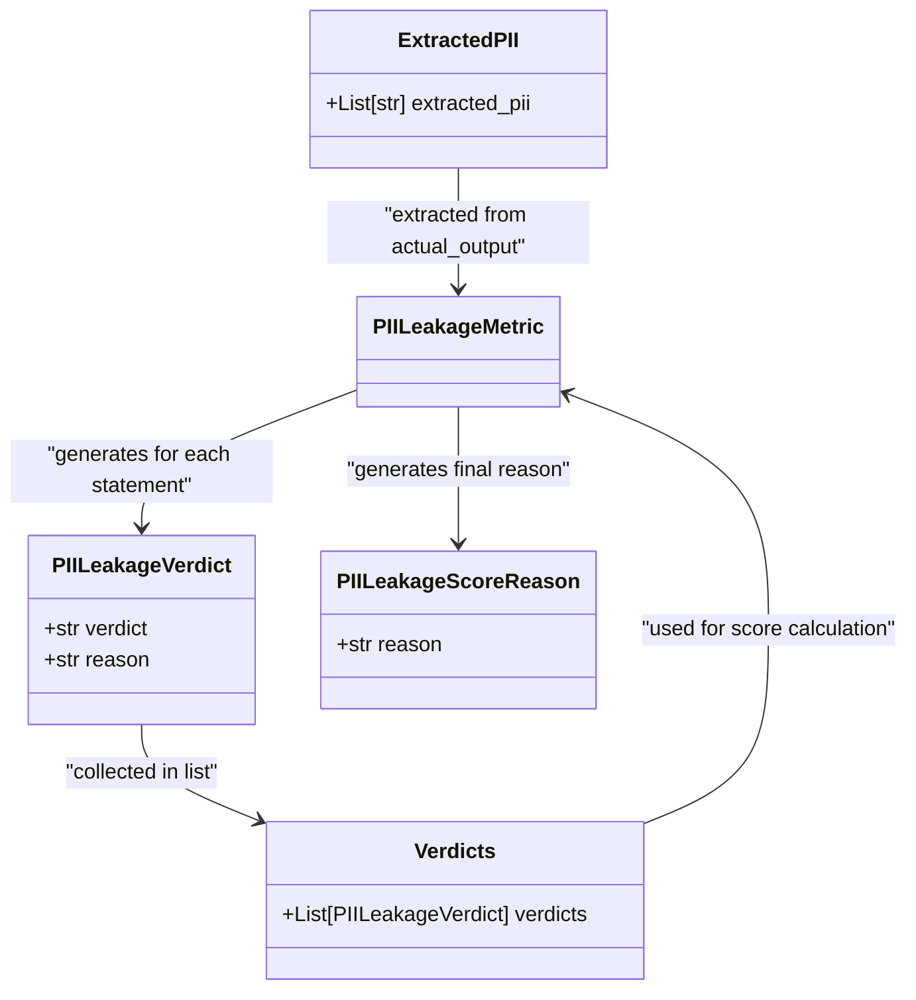

**Diagram sources**
- [pii_leakage/schema.py](file://deepeval/metrics/pii_leakage/schema.py#L1-L20)
- [pii_leakage.py](file://deepeval/metrics/pii_leakage/pii_leakage.py#L20-L24)

### Example Usage

The PII Leakage Metric looks for various types of personally identifiable information:

- **Personal Identifiers**: Names, addresses, contact information
- **Financial Information**: Credit card numbers, bank details
- **Medical Information**: Health records, medical conditions
- **Government IDs**: Social security numbers, passport numbers
- **Private Details**: Family relationships, confidential information

For example, a statement containing "My phone number is 555-1234" would be flagged as containing PII, while a statement without personal information would not be flagged.

**Section sources**
- [pii_leakage.py](file://deepeval/metrics/pii_leakage/pii_leakage.py#L1-L282)
- [pii_leakage/template.py](file://deepeval/metrics/pii_leakage/template.py#L1-L87)
- [pii_leakage/schema.py](file://deepeval/metrics/pii_leakage/schema.py#L1-L20)

## Hallucination Identification

### Implementation Details

The Hallucination Metric verifies the factual accuracy of LLM outputs by comparing them against provided context. It follows a specialized process:

1. **Verdict Generation**: Evaluates whether the actual output agrees with each context statement
2. **Score Calculation**: Computes a hallucination score based on contradictions
3. **Reason Generation**: Provides an explanation for the score

The metric is implemented in the `HallucinationMetric` class in `hallucination.py`. It requires three primary inputs: `input`, `actual_output`, and `context` (a list of reference statements).

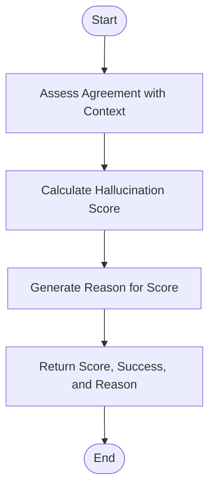

**Diagram sources**
- [hallucination.py](file://deepeval/metrics/hallucination/hallucination.py#L210-L240)
- [hallucination/template.py](file://deepeval/metrics/hallucination/template.py#L14-L51)

### Interface and Parameters

The Hallucination Metric has a similar interface to other safety metrics:

**Parameters:**
- `threshold` (float): Score threshold for determining success (default: 0.5)
- `model` (str or DeepEvalBaseLLM): LLM to use for evaluation (default: native model)
- `include_reason` (bool): Whether to include reasoning in results (default: True)
- `async_mode` (bool): Whether to run evaluation asynchronously (default: True)
- `strict_mode` (bool): Whether to enforce strict evaluation rules (default: False)
- `verbose_mode` (bool): Whether to enable verbose logging (default: False)
- `evaluation_template` (Type[HallucinationTemplate]): Template class to use (default: HallucinationTemplate)

**Return Values:**
- `score` (float): Hallucination score between 0 and 1 (lower is better)
- `success` (bool): Whether the output passes the hallucination threshold
- `reason` (str): Explanation for the score

### Domain Model

The Hallucination Metric uses specialized domain models:

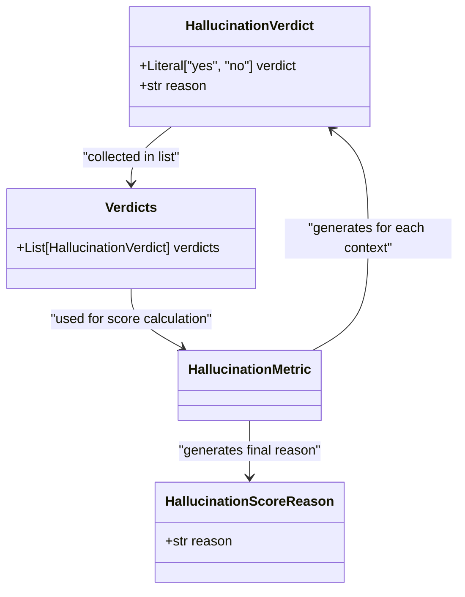

**Diagram sources**
- [hallucination/schema.py](file://deepeval/metrics/hallucination/schema.py#L1-L16)
- [hallucination.py](file://deepeval/metrics/hallucination/hallucination.py#L20-L23)

### Example Usage

The Hallucination Metric compares the actual output against multiple context statements. For example:

- **Context**: "Einstein won the Nobel Prize for his discovery of the photoelectric effect."
- **Context**: "Einstein won the Nobel Prize in 1968."
- **Actual Output**: "Einstein won the Nobel Prize in 1969 for his discovery of the photoelectric effect."

The metric would generate:
- Verdict "yes" for the first context (agreement on the reason for the prize)
- Verdict "no" for the second context (contradiction on the year)

The hallucination score would be 0.5 (one contradiction out of two contexts).

**Section sources**
- [hallucination.py](file://deepeval/metrics/hallucination/hallucination.py#L1-L268)
- [hallucination/template.py](file://deepeval/metrics/hallucination/template.py#L1-L81)
- [hallucination/schema.py](file://deepeval/metrics/hallucination/schema.py#L1-L16)

## Misuse Detection

### Implementation Details

The Misuse Metric detects inappropriate use of domain-specific chatbots. It follows a three-step process:

1. **Misuse Extraction**: Identifies statements that may represent misuse
2. **Misuse Assessment**: Evaluates each statement for domain appropriateness
3. **Score Calculation**: Computes a misuse score based on the proportion of misuse statements

The metric is implemented in the `MisuseMetric` class in `misuse.py`. It requires `input`, `actual_output`, and a `domain` parameter specifying the expected domain of the chatbot.

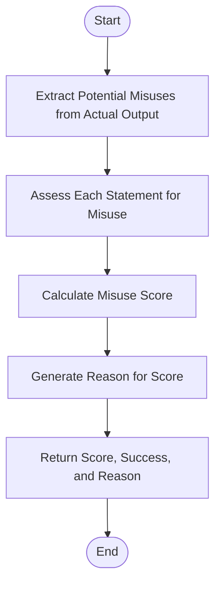

**Diagram sources**
- [misuse.py](file://deepeval/metrics/misuse/misuse.py#L241-L263)
- [misuse/template.py](file://deepeval/metrics/misuse/template.py#L66-L94)

### Interface and Parameters

The Misuse Metric has a similar interface to other safety metrics with one key difference:

**Parameters:**
- `domain` (str): Required parameter specifying the expected domain (e.g., "medical", "legal", "customer service")
- `threshold` (float): Score threshold for determining success (default: 0.5)
- `model` (str or DeepEvalBaseLLM): LLM to use for evaluation (default: native model)
- `include_reason` (bool): Whether to include reasoning in results (default: True)
- `async_mode` (bool): Whether to run evaluation asynchronously (default: True)
- `strict_mode` (bool): Whether to enforce strict evaluation rules (default: False)
- `verbose_mode` (bool): Whether to enable verbose logging (default: False)
- `evaluation_template` (Type[MisuseTemplate]): Template class to use (default: MisuseTemplate)

**Return Values:**
- `score` (float): Misuse score between 0 and 1 (lower is better)
- `success` (bool): Whether the output passes the misuse threshold
- `reason` (str): Explanation for the score

### Domain Model

The Misuse Metric uses specialized domain models:

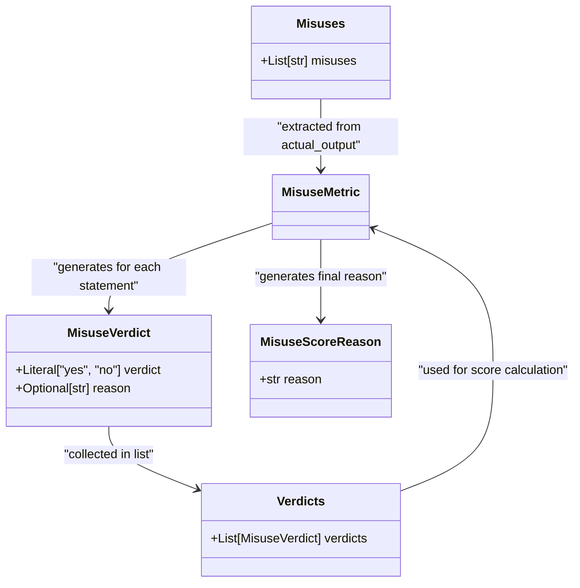

**Diagram sources**
- [misuse/schema.py](file://deepeval/metrics/misuse/schema.py#L1-L20)
- [misuse.py](file://deepeval/metrics/misuse/misuse.py#L20-L24)

### Example Usage

The Misuse Metric evaluates whether a chatbot stays within its domain. For example, in a medical domain:

- A statement like "What's the best treatment for diabetes?" would not be flagged as misuse
- A statement like "How do I file my taxes?" would be flagged as misuse since it falls outside the medical domain

The metric uses the domain parameter to contextualize what constitutes appropriate versus inappropriate use.

**Section sources**
- [misuse.py](file://deepeval/metrics/misuse/misuse.py#L1-L291)
- [misuse/template.py](file://deepeval/metrics/misuse/template.py#L1-L95)
- [misuse/schema.py](file://deepeval/metrics/misuse/schema.py#L1-L20)

## Role Violation Monitoring

### Implementation Details

The Role Violation Metric ensures that LLMs adhere to their assigned roles and personas. It follows a three-step process:

1. **Role Violation Detection**: Identifies statements that may represent role violations
2. **Violation Assessment**: Evaluates each statement for role adherence
3. **Score Calculation**: Computes a role violation score (binary: 0 or 1)

The metric is implemented in the `RoleViolationMetric` class in `role_violation.py`. It requires `input`, `actual_output`, and a `role` parameter specifying the expected role of the LLM.

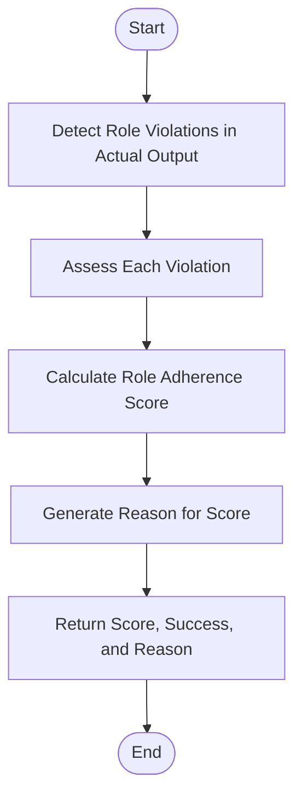

**Diagram sources**
- [role_violation.py](file://deepeval/metrics/role_violation/role_violation.py#L248-L269)
- [role_violation/template.py](file://deepeval/metrics/role_violation/template.py#L60-L86)

### Interface and Parameters

The Role Violation Metric has a similar interface to other safety metrics:

**Parameters:**
- `role` (str): Required parameter specifying the expected role (e.g., "helpful assistant", "customer service agent")
- `threshold` (float): Score threshold for determining success (default: 0.5)
- `model` (str or DeepEvalBaseLLM): LLM to use for evaluation (default: native model)
- `include_reason` (bool): Whether to include reasoning in results (default: True)
- `async_mode` (bool): Whether to run evaluation asynchronously (default: True)
- `strict_mode` (bool): Whether to enforce strict evaluation rules (default: False)
- `verbose_mode` (bool): Whether to enable verbose logging (default: False)
- `evaluation_template` (Type[RoleViolationTemplate]): Template class to use (default: RoleViolationTemplate)

**Return Values:**
- `score` (float): Role adherence score (0 or 1, where 1 indicates full adherence)
- `success` (bool): Whether the output passes the role adherence threshold
- `reason` (str): Explanation for the score

### Domain Model

The Role Violation Metric uses specialized domain models:

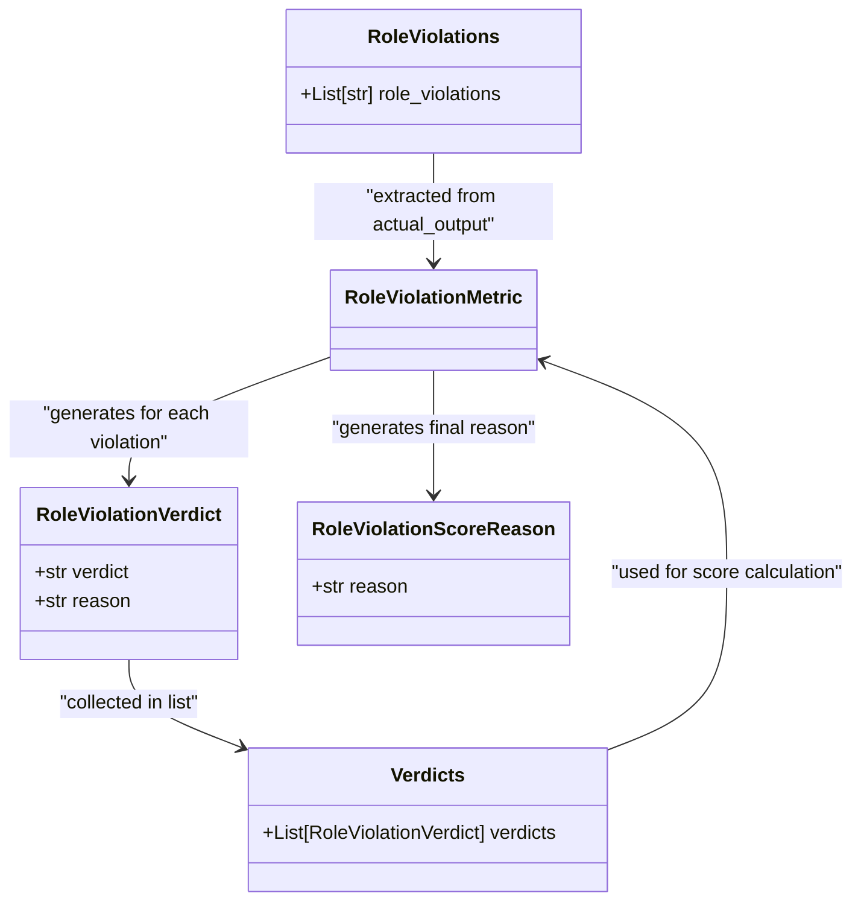

**Diagram sources**
- [role_violation/schema.py](file://deepeval/metrics/role_violation/schema.py#L1-L20)
- [role_violation.py](file://deepeval/metrics/role_violation/role_violation.py#L20-L24)

### Example Usage

The Role Violation Metric checks whether an LLM stays in character. For example, if the expected role is "helpful assistant":

- A statement like "As an AI assistant, I can help you with that" would not be flagged
- A statement like "I'm a human doctor and I can prescribe medication" would be flagged as a role violation

The metric detects various types of role violations:
- Pretending to be human
- Claiming capabilities beyond the defined role
- Breaking character or persona
- Ignoring safety guidelines

**Section sources**
- [role_violation.py](file://deepeval/metrics/role_violation/role_violation.py#L1-L297)
- [role_violation/template.py](file://deepeval/metrics/role_violation/template.py#L1-L87)
- [role_violation/schema.py](file://deepeval/metrics/role_violation/schema.py#L1-L20)

## Architecture and Integration

### Evaluation Engine Integration

The safety metrics are tightly integrated with DeepEval's evaluation engine. All metrics inherit from the `BaseMetric` class and implement a consistent interface. The evaluation engine handles the orchestration of metric execution, including:

- Parameter validation
- Asynchronous execution management
- Cost tracking
- Result aggregation
- Logging and progress indication

The metrics use the `metric_progress_indicator` context manager to provide visual feedback during evaluation. They also integrate with the `metric_data_manager` to log results when enabled.

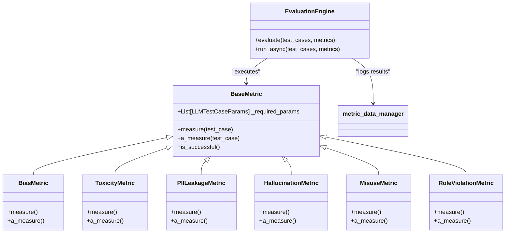

**Diagram sources**
- [bias.py](file://deepeval/metrics/bias/bias.py#L28-L296)
- [toxicity.py](file://deepeval/metrics/toxicity/toxicity.py#L28-L297)
- [pii_leakage.py](file://deepeval/metrics/pii_leakage/pii_leakage.py#L28-L282)
- [hallucination.py](file://deepeval/metrics/hallucination/hallucination.py#L27-L268)
- [misuse.py](file://deepeval/metrics/misuse/misuse.py#L28-L291)
- [role_violation.py](file://deepeval/metrics/role_violation/role_violation.py#L28-L297)

### Red Teaming Framework

The safety metrics are designed to work seamlessly with DeepEval's red teaming framework. Red teaming exercises can use these metrics to systematically test LLMs for safety vulnerabilities. The metrics can be configured with different thresholds and models to simulate various attack scenarios.

The red teaming framework can:
- Generate adversarial prompts designed to trigger safety issues
- Use the safety metrics to quantify the severity of responses
- Identify patterns in LLM failures
- Track improvements over time

The metrics' ability to provide detailed reasons for their scores is particularly valuable for red teaming, as it helps identify the specific language patterns that trigger safety concerns.

### Classification Models and Prompt Engineering

The safety metrics rely on a combination of classification models and sophisticated prompt engineering. Each metric uses a specialized template that provides clear instructions, examples, and rubrics for the evaluation LLM.

Key aspects of the prompt engineering approach include:
- **Structured Output**: Requiring JSON format for reliable parsing
- **Clear Instructions**: Explicit guidelines for the evaluation process
- **Comprehensive Examples**: Multiple examples to illustrate the expected behavior
- **Detailed Rubrics**: Specific criteria for different types of issues
- **Multimodal Support**: Special rules for handling image content

The metrics use the `generate_with_schema_and_extract` utility function to ensure that the evaluation LLM's output conforms to the expected schema. This function handles the prompt execution, response parsing, and error handling.

**Section sources**
- [bias.py](file://deepeval/metrics/bias/bias.py#L1-L296)
- [toxicity.py](file://deepeval/metrics/toxicity/toxicity.py#L1-L297)
- [pii_leakage.py](file://deepeval/metrics/pii_leakage/pii_leakage.py#L1-L282)
- [hallucination.py](file://deepeval/metrics/hallucination/hallucination.py#L1-L268)
- [misuse.py](file://deepeval/metrics/misuse/misuse.py#L1-L291)
- [role_violation.py](file://deepeval/metrics/role_violation/role_violation.py#L1-L297)
- [bias/template.py](file://deepeval/metrics/bias/template.py#L1-L128)
- [toxicity/template.py](file://deepeval/metrics/toxicity/template.py#L1-L134)
- [pii_leakage/template.py](file://deepeval/metrics/pii_leakage/template.py#L1-L87)
- [hallucination/template.py](file://deepeval/metrics/hallucination/template.py#L1-L81)
- [misuse/template.py](file://deepeval/metrics/misuse/template.py#L1-L95)
- [role_violation/template.py](file://deepeval/metrics/role_violation/template.py#L1-L87)

## Common Issues and Solutions

### False Positives in Bias Detection

One common issue with bias detection is false positives, where neutral statements are incorrectly flagged as biased. This can occur when:

- The evaluation LLM over-interprets subtle language nuances
- Cultural or contextual factors are not properly considered
- The rubric is applied too strictly

**Solutions:**
- **Adjust Threshold**: Increase the threshold parameter to make the metric less sensitive
- **Use Strict Mode**: Enable strict_mode to apply more conservative evaluation rules
- **Custom Templates**: Create custom evaluation templates with more nuanced rubrics
- **Model Selection**: Use a more sophisticated evaluation model better at understanding context

### Handling Edge Cases

The safety metrics may encounter various edge cases:

- **Empty Outputs**: When the LLM returns an empty or minimal response
- **Multilingual Content**: When the output contains multiple languages
- **Code or Technical Content**: When the output includes code snippets or technical terminology
- **Ambiguous Statements**: When the meaning is unclear or open to interpretation

**Solutions:**
- **Input Validation**: Ensure proper input validation before evaluation
- **Multimodal Rules**: Use the built-in multimodal rules for handling complex content
- **Contextual Awareness**: Provide additional context when available
- **Human Review**: Combine automated metrics with human review for ambiguous cases

### Performance Optimization

The safety metrics can be resource-intensive, especially when running multiple metrics on large datasets.

**Optimization Strategies:**
- **Asynchronous Mode**: Use async_mode=True for parallel execution
- **Model Caching**: Cache evaluation model instances to avoid repeated initialization
- **Batch Processing**: Process multiple test cases in batches
- **Selective Evaluation**: Only run metrics that are relevant to the specific use case

### Integration Best Practices

When integrating safety metrics into applications:

- **Set Appropriate Thresholds**: Calibrate thresholds based on your specific requirements
- **Monitor Over Time**: Track metric scores over time to identify trends
- **Combine Metrics**: Use multiple metrics together for comprehensive safety assessment
- **Regular Updates**: Keep the evaluation templates and models up to date
- **Documentation**: Maintain clear documentation of your safety evaluation process

**Section sources**
- [bias.py](file://deepeval/metrics/bias/bias.py#L1-L296)
- [toxicity.py](file://deepeval/metrics/toxicity/toxicity.py#L1-L297)
- [pii_leakage.py](file://deepeval/metrics/pii_leakage/pii_leakage.py#L1-L282)
- [hallucination.py](file://deepeval/metrics/hallucination/hallucination.py#L1-L268)
- [misuse.py](file://deepeval/metrics/misuse/misuse.py#L1-L291)
- [role_violation.py](file://deepeval/metrics/role_violation/role_violation.py#L1-L297)

## Conclusion

DeepEval's Safety Metrics provide a comprehensive framework for identifying harmful or inappropriate content in LLM outputs. The six core metrics—Bias, Toxicity, PII Leakage, Hallucination, Misuse, and Role Violation—address different aspects of LLM safety through a consistent and extensible architecture.

These metrics use a combination of advanced prompt engineering, classification models, and structured output parsing to evaluate LLM responses. They follow a standardized interface with consistent parameters and return values, making them easy to integrate into evaluation pipelines and monitoring systems.

The metrics are designed to be flexible and configurable, allowing users to adjust thresholds, select evaluation models, and customize templates to meet their specific needs. They integrate seamlessly with DeepEval's evaluation engine and red teaming framework, providing a powerful toolkit for ensuring the safety and reliability of LLM applications.

By using these safety metrics, developers and organizations can proactively identify and address potential safety issues in their LLM applications, helping to build more trustworthy and responsible AI systems.

**Section sources**
- [bias.py](file://deepeval/metrics/bias/bias.py#L1-L296)
- [toxicity.py](file://deepeval/metrics/toxicity/toxicity.py#L1-L297)
- [pii_leakage.py](file://deepeval/metrics/pii_leakage/pii_leakage.py#L1-L282)
- [hallucination.py](file://deepeval/metrics/hallucination/hallucination.py#L1-L268)
- [misuse.py](file://deepeval/metrics/misuse/misuse.py#L1-L291)
- [role_violation.py](file://deepeval/metrics/role_violation/role_violation.py#L1-L297)