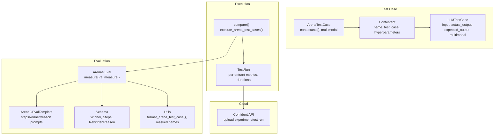
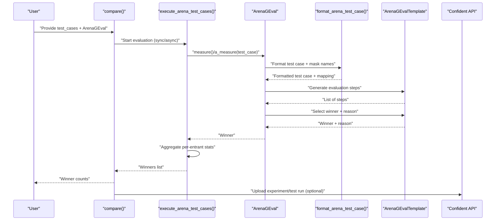
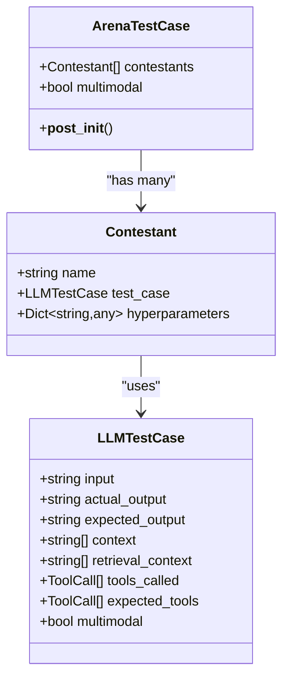
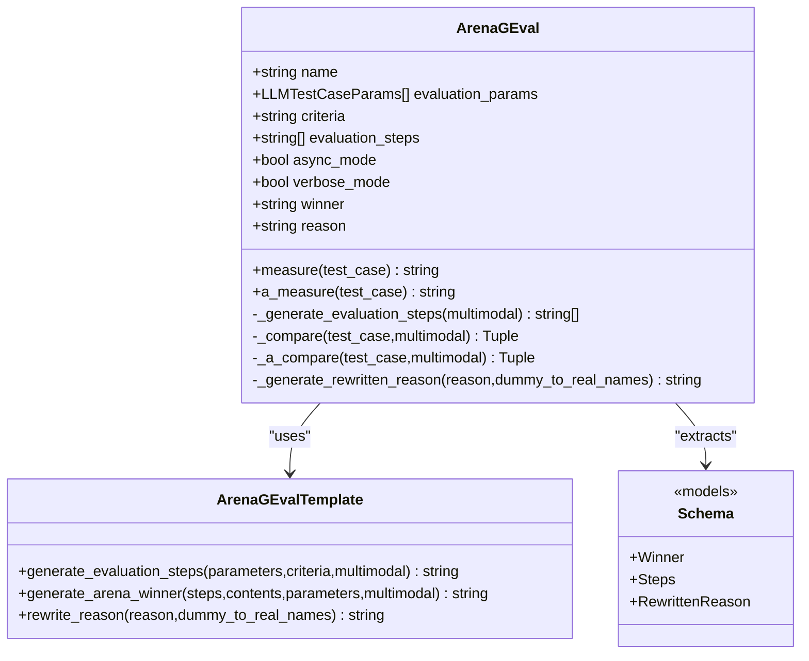
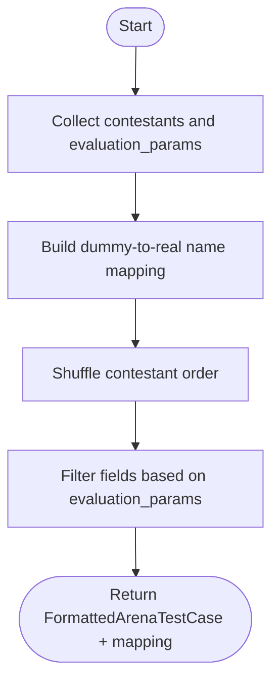
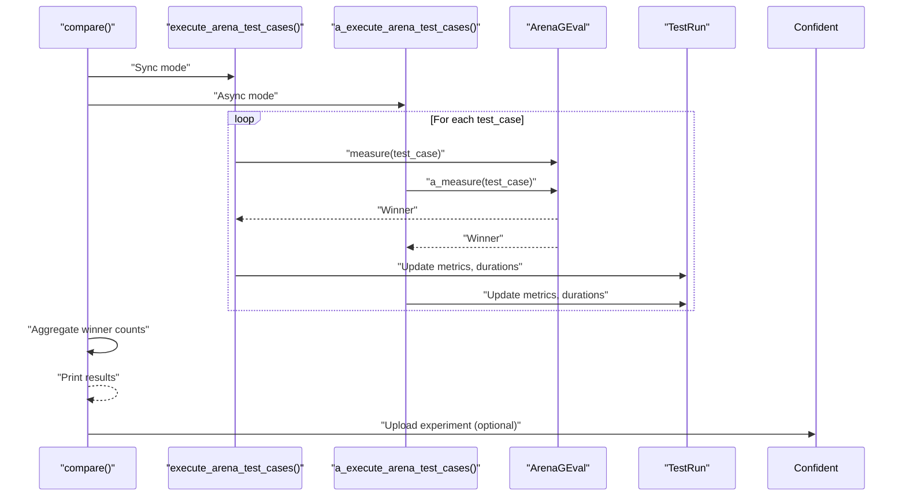
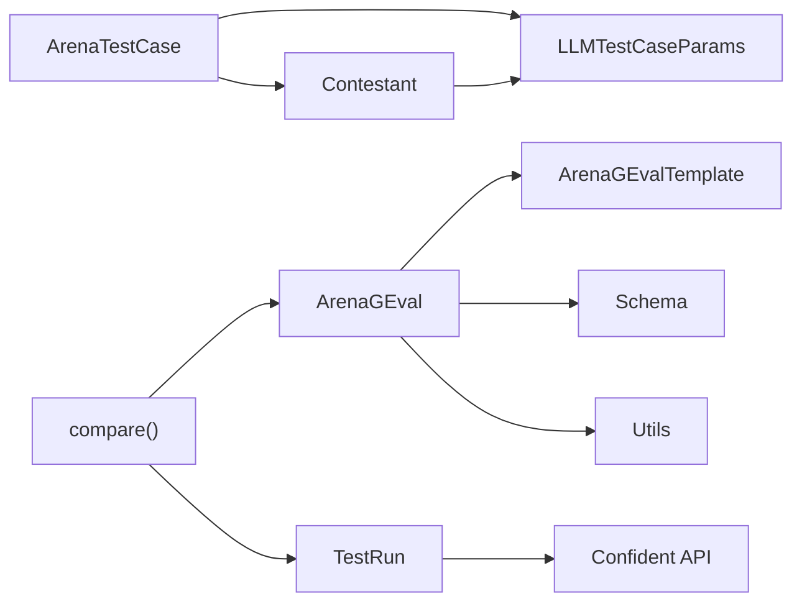

# Arena Testing

<cite>
**Referenced Files in This Document**
- [arena_test_case.py](file://deepeval/test_case/arena_test_case.py)
- [llm_test_case.py](file://deepeval/test_case/llm_test_case.py)
- [__init__.py](file://deepeval/test_case/__init__.py)
- [arena_g_eval.py](file://deepeval/metrics/arena_g_eval/arena_g_eval.py)
- [schema.py](file://deepeval/metrics/arena_g_eval/schema.py)
- [utils.py](file://deepeval/metrics/arena_g_eval/utils.py)
- [template.py](file://deepeval/metrics/arena_g_eval/template.py)
- [compare.py](file://deepeval/evaluate/compare.py)
- [api.py](file://deepeval/confident/api.py)
- [test_run.py](file://deepeval/test_run/test_run.py)
- [evaluation-arena-test-cases.mdx](file://docs/docs/evaluation-arena-test-cases.mdx)
- [test_arena_geval_metric.py](file://tests/test_metrics/test_arena_geval_metric.py)
- [test_compare.py](file://tests/test_confident/test_compare.py)
</cite>

## Table of Contents
1. [Introduction](#introduction)
2. [Project Structure](#project-structure)
3. [Core Components](#core-components)
4. [Architecture Overview](#architecture-overview)
5. [Detailed Component Analysis](#detailed-component-analysis)
6. [Dependency Analysis](#dependency-analysis)
7. [Performance Considerations](#performance-considerations)
8. [Troubleshooting Guide](#troubleshooting-guide)
9. [Conclusion](#conclusion)
10. [Appendices](#appendices)

## Introduction
Arena Testing enables side-by-side comparison of multiple LLM versions or prompt variants using a structured, human-in-the-loop assessment workflow. In DeepEval, ArenaTestCase defines the comparison blueprint, ArenaGEval performs the evaluation, and the compare orchestrator executes the tests and aggregates results. Optional integration with Confident AI uploads results for cloud-based reporting and visualization.

Key capabilities:
- Side-by-side model comparison across identical inputs and expected outputs
- Blind evaluation via masked contestant names and randomized presentation order
- Human-in-the-loop assessment with explicit evaluation criteria and steps
- Result aggregation and winner counting across test cases
- Optional cloud reporting via Confident AI

## Project Structure
Arena testing spans several modules:
- Test case definition: ArenaTestCase, Contestant, and LLMTestCase
- Evaluation metric: ArenaGEval with templating and schema extraction
- Execution orchestration: compare() and async runners
- Data formatting: utils for masked names and randomized ordering
- Cloud integration: Confident API client and test run upload

**Diagram sources**
- [arena_test_case.py](file://deepeval/test_case/arena_test_case.py#L1-L49)
- [llm_test_case.py](file://deepeval/test_case/llm_test_case.py#L166-L178)
- [arena_g_eval.py](file://deepeval/metrics/arena_g_eval/arena_g_eval.py#L36-L317)
- [template.py](file://deepeval/metrics/arena_g_eval/template.py#L1-L134)
- [schema.py](file://deepeval/metrics/arena_g_eval/schema.py#L1-L21)
- [utils.py](file://deepeval/metrics/arena_g_eval/utils.py#L1-L162)
- [compare.py](file://deepeval/evaluate/compare.py#L43-L531)
- [test_run.py](file://deepeval/test_run/test_run.py#L812-L850)
- [api.py](file://deepeval/confident/api.py#L1-L259)

**Section sources**
- [arena_test_case.py](file://deepeval/test_case/arena_test_case.py#L1-L49)
- [llm_test_case.py](file://deepeval/test_case/llm_test_case.py#L166-L178)
- [__init__.py](file://deepeval/test_case/__init__.py#L1-L38)
- [arena_g_eval.py](file://deepeval/metrics/arena_g_eval/arena_g_eval.py#L36-L317)
- [template.py](file://deepeval/metrics/arena_g_eval/template.py#L1-L134)
- [schema.py](file://deepeval/metrics/arena_g_eval/schema.py#L1-L21)
- [utils.py](file://deepeval/metrics/arena_g_eval/utils.py#L1-L162)
- [compare.py](file://deepeval/evaluate/compare.py#L43-L531)
- [test_run.py](file://deepeval/test_run/test_run.py#L812-L850)
- [api.py](file://deepeval/confident/api.py#L1-L259)

## Core Components
- ArenaTestCase: Holds a list of Contestant entries and enforces shared input/expected_output across all contestants. Automatically detects multimodal when any contestant’s LLMTestCase is multimodal.
- Contestant: Represents a single model/prompt variant with a unique name, an LLMTestCase, and optional hyperparameters.
- LLMTestCaseParams: Defines which fields to include in evaluation (e.g., input, actual_output, expected_output, context, retrieval_context, tools_called, expected_tools).
- ArenaGEval: The metric that generates evaluation steps, compares contestants, selects a winner, and rewrites reasons with real names.
- compare(): Orchestrates evaluation runs, manages concurrency, collects results, and aggregates winner counts. Optionally uploads to Confident AI.

Practical example references:
- Arena test case creation and usage: [evaluation-arena-test-cases.mdx](file://docs/docs/evaluation-arena-test-cases.mdx#L1-L231)
- Metric usage and compare(): [test_arena_geval_metric.py](file://tests/test_metrics/test_arena_geval_metric.py#L1-L200)
- Hyperparameter and compare() usage: [test_compare.py](file://tests/test_confident/test_compare.py#L42-L120)

**Section sources**
- [arena_test_case.py](file://deepeval/test_case/arena_test_case.py#L1-L49)
- [llm_test_case.py](file://deepeval/test_case/llm_test_case.py#L166-L178)
- [__init__.py](file://deepeval/test_case/__init__.py#L1-L38)
- [arena_g_eval.py](file://deepeval/metrics/arena_g_eval/arena_g_eval.py#L36-L317)
- [compare.py](file://deepeval/evaluate/compare.py#L43-L531)
- [evaluation-arena-test-cases.mdx](file://docs/docs/evaluation-arena-test-cases.mdx#L1-L231)
- [test_arena_geval_metric.py](file://tests/test_metrics/test_arena_geval_metric.py#L1-L200)
- [test_compare.py](file://tests/test_confident/test_compare.py#L42-L120)

## Architecture Overview
Arena evaluation follows a deterministic pipeline:
1. Define ArenaTestCase with multiple Contestant entries sharing identical input and expected_output.
2. Configure ArenaGEval with evaluation criteria and parameters.
3. compare() executes tests, optionally in async mode, and records per-entrant metrics and durations.
4. ArenaGEval generates evaluation steps, masks contestant names, and selects a winner.
5. Winner counts are aggregated; optional upload to Confident AI for visualization.

**Diagram sources**
- [compare.py](file://deepeval/evaluate/compare.py#L43-L531)
- [arena_g_eval.py](file://deepeval/metrics/arena_g_eval/arena_g_eval.py#L36-L317)
- [utils.py](file://deepeval/metrics/arena_g_eval/utils.py#L89-L162)
- [template.py](file://deepeval/metrics/arena_g_eval/template.py#L1-L134)
- [test_run.py](file://deepeval/test_run/test_run.py#L812-L850)
- [api.py](file://deepeval/confident/api.py#L1-L259)

## Detailed Component Analysis

### ArenaTestCase and Contestant
- ArenaTestCase enforces uniqueness of contestant names and equality of input and expected_output across all contestants. It also sets multimodal flag if any contestant’s LLMTestCase is multimodal.
- Contestant encapsulates a model/prompt variant with optional hyperparameters for tracking.

**Diagram sources**
- [arena_test_case.py](file://deepeval/test_case/arena_test_case.py#L1-L49)
- [llm_test_case.py](file://deepeval/test_case/llm_test_case.py#L166-L178)

**Section sources**
- [arena_test_case.py](file://deepeval/test_case/arena_test_case.py#L1-L49)
- [llm_test_case.py](file://deepeval/test_case/llm_test_case.py#L166-L178)

### ArenaGEval Metric
ArenaGEval implements:
- Evaluation steps generation via templated prompts
- Masked comparison and winner selection
- Reason rewriting to replace dummy names with real names
- Async and sync measurement modes
- Verbose logs and success tracking

**Diagram sources**
- [arena_g_eval.py](file://deepeval/metrics/arena_g_eval/arena_g_eval.py#L36-L317)
- [template.py](file://deepeval/metrics/arena_g_eval/template.py#L1-L134)
- [schema.py](file://deepeval/metrics/arena_g_eval/schema.py#L1-L21)

**Section sources**
- [arena_g_eval.py](file://deepeval/metrics/arena_g_eval/arena_g_eval.py#L36-L317)
- [template.py](file://deepeval/metrics/arena_g_eval/template.py#L1-L134)
- [schema.py](file://deepeval/metrics/arena_g_eval/schema.py#L1-L21)

### Data Formatting and Blind Evaluation
- format_arena_test_case constructs a masked test case with randomized contestant order and a mapping from dummy names to real names.
- Dummy names are generated and shuffled to prevent bias.
- The formatted test case includes only requested fields based on evaluation_params.

**Diagram sources**
- [utils.py](file://deepeval/metrics/arena_g_eval/utils.py#L89-L162)

**Section sources**
- [utils.py](file://deepeval/metrics/arena_g_eval/utils.py#L1-L162)

### Execution Orchestration and Result Aggregation
- compare() builds per-entrant metrics, tracks durations, and aggregates winner counts.
- It supports async and sync modes, throttling, and error handling.
- After completion, it prints results and optionally uploads to Confident AI.

**Diagram sources**
- [compare.py](file://deepeval/evaluate/compare.py#L43-L531)
- [test_run.py](file://deepeval/test_run/test_run.py#L812-L850)
- [api.py](file://deepeval/confident/api.py#L1-L259)

**Section sources**
- [compare.py](file://deepeval/evaluate/compare.py#L43-L531)
- [test_run.py](file://deepeval/test_run/test_run.py#L812-L850)
- [api.py](file://deepeval/confident/api.py#L1-L259)

### Practical Examples
- Creating Arena test cases and running compare(): [evaluation-arena-test-cases.mdx](file://docs/docs/evaluation-arena-test-cases.mdx#L1-L231)
- Metric usage and multimodal support: [test_arena_geval_metric.py](file://tests/test_metrics/test_arena_geval_metric.py#L1-L200)
- Hyperparameter tracking and compare(): [test_compare.py](file://tests/test_confident/test_compare.py#L42-L120)

**Section sources**
- [evaluation-arena-test-cases.mdx](file://docs/docs/evaluation-arena-test-cases.mdx#L1-L231)
- [test_arena_geval_metric.py](file://tests/test_metrics/test_arena_geval_metric.py#L1-L200)
- [test_compare.py](file://tests/test_confident/test_compare.py#L42-L120)

## Dependency Analysis
Arena testing components depend on:
- Test case modules for defining ArenaTestCase and Contestant
- Metrics modules for ArenaGEval and templating
- Execution modules for orchestration and result aggregation
- Cloud modules for optional upload

**Diagram sources**
- [arena_test_case.py](file://deepeval/test_case/arena_test_case.py#L1-L49)
- [llm_test_case.py](file://deepeval/test_case/llm_test_case.py#L166-L178)
- [arena_g_eval.py](file://deepeval/metrics/arena_g_eval/arena_g_eval.py#L36-L317)
- [template.py](file://deepeval/metrics/arena_g_eval/template.py#L1-L134)
- [schema.py](file://deepeval/metrics/arena_g_eval/schema.py#L1-L21)
- [utils.py](file://deepeval/metrics/arena_g_eval/utils.py#L1-L162)
- [compare.py](file://deepeval/evaluate/compare.py#L43-L531)
- [test_run.py](file://deepeval/test_run/test_run.py#L812-L850)
- [api.py](file://deepeval/confident/api.py#L1-L259)

**Section sources**
- [arena_test_case.py](file://deepeval/test_case/arena_test_case.py#L1-L49)
- [llm_test_case.py](file://deepeval/test_case/llm_test_case.py#L166-L178)
- [arena_g_eval.py](file://deepeval/metrics/arena_g_eval/arena_g_eval.py#L36-L317)
- [compare.py](file://deepeval/evaluate/compare.py#L43-L531)
- [api.py](file://deepeval/confident/api.py#L1-L259)

## Performance Considerations
- Concurrency: compare() supports async execution with throttling and a semaphore to limit concurrent tasks.
- Cost tracking: Native model usage disables cost calculation; otherwise, cost is tracked per run.
- Multimodal handling: Multimodal inputs increase token usage; consider batching and limiting concurrent multimodal runs.
- Logging and verbosity: Verbose logs provide insight but can add overhead; disable for production runs.

[No sources needed since this section provides general guidance]

## Troubleshooting Guide
Common issues and resolutions:
- Mismatched input or expected_output across contestants: ArenaTestCase validates equality and raises an error if violated.
- Missing API keys for Confident AI: Upload attempts will fail; ensure CONFIDENT_API_KEY is configured.
- Missing evaluation parameters: MissingTestCaseParamsError is raised; configure evaluation_params accordingly.
- Asynchronous vs synchronous measurement: If a TypeError occurs during measure(), the runner retries with the correct signature.

**Section sources**
- [arena_test_case.py](file://deepeval/test_case/arena_test_case.py#L24-L45)
- [compare.py](file://deepeval/evaluate/compare.py#L309-L405)
- [api.py](file://deepeval/confident/api.py#L110-L140)

## Conclusion
Arena Testing in DeepEval provides a robust, repeatable framework for side-by-side model comparisons with human-in-the-loop assessment. By enforcing consistent inputs/expected outputs, masking contestant identities, and aggregating results, it minimizes bias and simplifies interpretation. Optional integration with Confident AI enables cloud-based reporting and visualization for team collaboration and continuous monitoring.

[No sources needed since this section summarizes without analyzing specific files]

## Appendices

### Use Cases and Guidance
- Model selection: Compare multiple LLM versions on identical prompts to pick the best performer.
- Prompt optimization validation: Compare baseline vs. optimized prompts under the same criteria.
- Red teaming comparisons: Evaluate adversarial prompts against defensive strategies using explicit evaluation steps.

[No sources needed since this section provides general guidance]

### Statistical Significance and Bias Mitigation
- Randomized presentation order and masked names reduce order and identity bias.
- Explicit evaluation steps ensure consistent judgment criteria across comparisons.
- Increase N (number of test cases) to improve confidence in winner counts.
- Consider stratified sampling across domains to generalize results.

[No sources needed since this section provides general guidance]