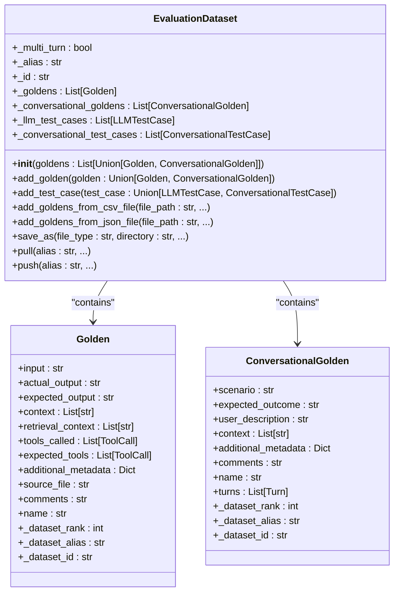
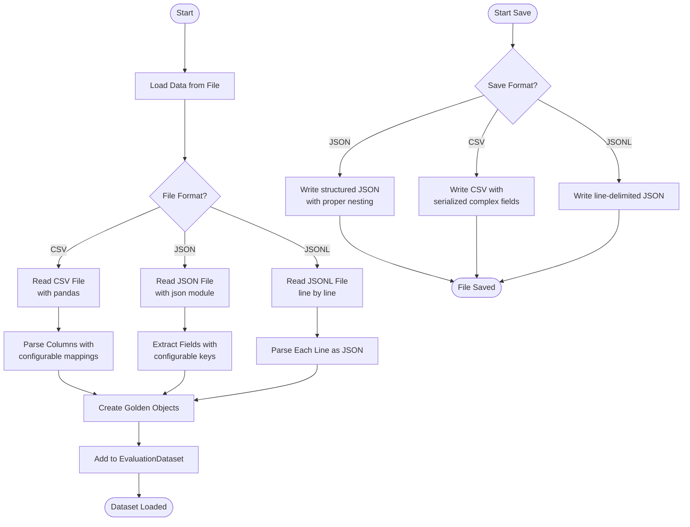
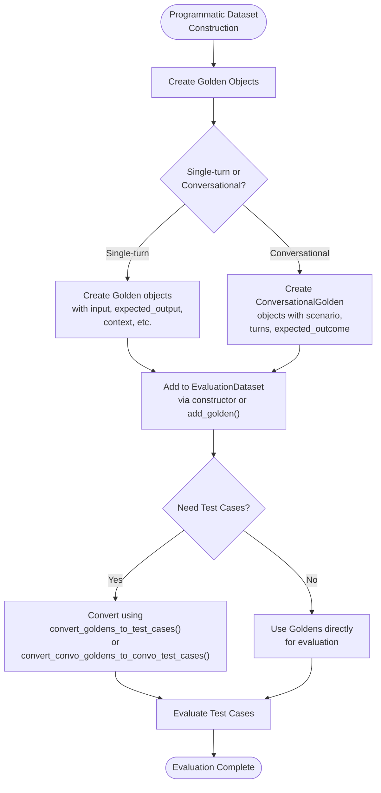
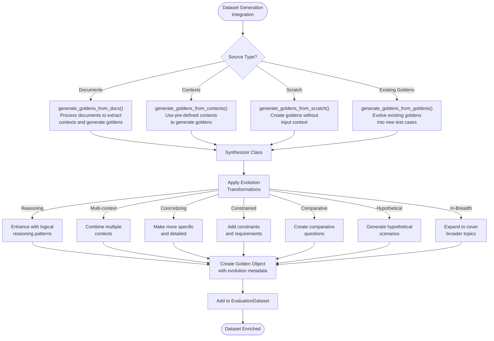

# Dataset Management

<cite>
**Referenced Files in This Document**   
- [dataset.py](file://deepeval/dataset/dataset.py)
- [golden.py](file://deepeval/dataset/golden.py)
- [utils.py](file://deepeval/dataset/utils.py)
- [api.py](file://deepeval/dataset/api.py)
- [synthesizer.py](file://deepeval/synthesizer/synthesizer.py)
</cite>

## Table of Contents
1. [Introduction](#introduction)
2. [Core Components](#core-components)
3. [Dataset Loading and Saving](#dataset-loading-and-saving)
4. [Programmatic Dataset Construction](#programmatic-dataset-construction)
5. [Integration with Synthesizer Module](#integration-with-synthesizer-module)
6. [Best Practices for Dataset Curation](#best-practices-for-dataset-curation)
7. [Troubleshooting](#troubleshooting)
8. [Conclusion](#conclusion)

## Introduction
The DeepEval framework provides a comprehensive dataset management system for organizing and scaling LLM evaluation test cases. At the core of this system is the `EvaluationDataset` class, which serves as a container for `Golden` records that represent high-quality test cases. These datasets enable systematic evaluation of LLM applications by providing structured inputs, expected outputs, context information, and metadata necessary for comprehensive testing.

The dataset management system supports both single-turn and multi-turn (conversational) evaluation scenarios, allowing for flexible test case organization. Datasets can be loaded from various formats including JSON, CSV, and JSONL, or programmatically constructed and generated. The system also integrates with the synthesizer module to enable automated generation of test cases from documents, contexts, or scratch, facilitating scalable test suite creation.

This documentation provides a detailed explanation of the dataset management implementation, covering the `EvaluationDataset` class, `Golden` records, data loading and saving functionality, programmatic dataset construction, integration with the synthesizer module, best practices for dataset curation, and troubleshooting guidance.

## Core Components

The dataset management system in DeepEval is built around several key components that work together to organize and manage evaluation test cases at scale. The primary components are the `EvaluationDataset` class, which serves as the container for test cases, and the `Golden` and `ConversationalGolden` classes, which represent individual test cases in single-turn and multi-turn scenarios respectively.

The `EvaluationDataset` class is implemented as a dataclass that maintains separate collections for single-turn and multi-turn test cases. It provides methods for adding, retrieving, and managing test cases, as well as functionality for loading and saving datasets from various file formats. The class automatically detects whether a dataset is single-turn or multi-turn based on the type of golden records it contains, ensuring type safety and preventing mixing of different test case types within the same dataset.

The `Golden` class represents a single-turn test case with properties for input, actual output, expected output, context, retrieval context, tools called, expected tools, and additional metadata. For conversational scenarios, the `ConversationalGolden` class extends this concept with a scenario description, user description, expected outcome, and a sequence of turns that represent the conversation flow. Both golden types include private attributes for tracking dataset association, enabling proper attribution when test cases are evaluated.

**Diagram sources**
- [dataset.py](file://deepeval/dataset/dataset.py#L68-L803)
- [golden.py](file://deepeval/dataset/golden.py#L8-L132)

**Section sources**
- [dataset.py](file://deepeval/dataset/dataset.py#L68-L803)
- [golden.py](file://deepeval/dataset/golden.py#L8-L132)

## Dataset Loading and Saving

The DeepEval dataset management system provides robust functionality for loading and saving datasets in multiple formats, supporting JSON, CSV, and JSONL file types. This enables seamless integration with existing data workflows and facilitates sharing and versioning of evaluation datasets.

The `EvaluationDataset` class offers several methods for loading data from external sources. The `add_goldens_from_csv_file` method allows loading test cases from CSV files with configurable column mappings. Users can specify custom column names for input, expected output, actual output, context, retrieval context, tools called, and other fields. The method supports configurable delimiters for list-type fields like context and retrieval context, with default delimiters of "|" for context fields and ";" for tools. Similarly, the `add_goldens_from_json_file` method provides JSON file loading with configurable key names for the same fields, enabling flexibility in data schema.

For saving datasets, the `save_as` method supports all three file formats (JSON, CSV, JSONL) and provides options for custom file naming and directory specification. When saving as JSON, the method preserves the full structure of golden records, including nested objects and arrays. For CSV output, complex fields like tools called and expected tools are serialized as JSON strings, while list fields like context are joined with "|" delimiters. The JSONL format provides a line-delimited JSON output, which is particularly useful for large datasets that need to be processed incrementally.

The system also supports dataset versioning through integration with the Confident AI platform. The `push` method uploads datasets to Confident AI with a specified alias, creating a versioned record that can be shared and accessed by team members. Conversely, the `pull` method retrieves datasets from Confident AI using an alias, enabling collaboration and consistent test suite management across teams. Datasets can be marked as finalized when pushed, indicating they are ready for production evaluation.

**Diagram sources**
- [dataset.py](file://deepeval/dataset/dataset.py#L240-L631)
- [dataset.py](file://deepeval/dataset/dataset.py#L956-L1296)

**Section sources**
- [dataset.py](file://deepeval/dataset/dataset.py#L240-L631)
- [dataset.py](file://deepeval/dataset/dataset.py#L956-L1296)

## Programmatic Dataset Construction

DeepEval provides multiple approaches for programmatically constructing datasets, enabling flexible test case creation for various evaluation scenarios. The `EvaluationDataset` class supports direct instantiation with a list of golden records, allowing developers to create datasets programmatically in code. This approach is particularly useful for generating test cases based on specific criteria or for creating synthetic test suites.

The dataset construction process begins with creating individual `Golden` or `ConversationalGolden` objects. For single-turn test cases, the `Golden` class accepts parameters for input, expected output, actual output, context, retrieval context, tools called, expected tools, and additional metadata. For conversational scenarios, the `ConversationalGolden` class requires a scenario description, user description, expected outcome, and a sequence of turns representing the conversation flow. Each turn includes the role (user or assistant), content, retrieval context, and tool calls if applicable.

Once golden records are created, they can be added to an `EvaluationDataset` instance using the `add_golden` method or by passing them to the dataset constructor. The dataset automatically handles type checking, ensuring that only compatible golden types are added to the same dataset (single-turn with single-turn, multi-turn with multi-turn). This prevents mixing of different test case types within the same evaluation suite.

For bulk operations, the dataset class provides methods to convert between different representations. The `convert_goldens_to_test_cases` utility function transforms golden records into `LLMTestCase` objects, which can then be used for evaluation. Similarly, `convert_convo_goldens_to_convo_test_cases` handles the conversion for conversational scenarios. These conversions preserve all relevant information from the golden records, including metadata and context, ensuring that the evaluation process has access to all necessary data.

**Diagram sources**
- [dataset.py](file://deepeval/dataset/dataset.py#L84-L238)
- [utils.py](file://deepeval/dataset/utils.py#L14-L56)
- [utils.py](file://deepeval/dataset/utils.py#L58-L100)

**Section sources**
- [dataset.py](file://deepeval/dataset/dataset.py#L84-L238)
- [utils.py](file://deepeval/dataset/utils.py#L14-L100)

## Integration with Synthesizer Module

The DeepEval dataset management system integrates seamlessly with the synthesizer module, enabling automated generation of golden records for comprehensive test suite creation. This integration allows for the evolution of test cases from various sources, including documents, existing contexts, and scratch generation, significantly enhancing the scalability and diversity of evaluation datasets.

The integration is facilitated through several methods in the `EvaluationDataset` class that delegate to the `Synthesizer` class. The `generate_goldens_from_docs` method processes documents (such as PDFs, text files, or web pages) to extract relevant contexts and generate golden records based on the content. This process involves chunking the documents, evaluating context quality, and synthesizing test cases that reflect the information in the documents. The method supports configuration of parameters like maximum goldens per context and whether to include expected outputs.

Similarly, the `generate_goldens_from_contexts` method takes a list of pre-defined contexts and generates golden records based on these contexts. This is particularly useful when specific knowledge domains or scenarios need to be tested. The method leverages the synthesizer's capabilities to create diverse and challenging test cases from the provided contexts, ensuring comprehensive coverage of the target domain.

For scenarios where no specific content is available, the `generate_goldens_from_scratch` method creates golden records without any input context. This approach uses the synthesizer's evolution capabilities to generate diverse and complex test cases by applying various transformations to seed inputs. The evolution process includes techniques like reasoning enhancement, multi-context integration, concretization, constraint application, comparative questioning, hypothetical scenario creation, and breadth expansion.

The integration also supports test case evolution, where existing golden records can be used as a basis for generating new, more complex test cases. This is achieved through the synthesizer's evolution configuration, which applies a series of transformations to inputs to create more challenging evaluation scenarios. The evolution process is tracked in the additional metadata of generated goldens, providing transparency into how test cases were created.

**Diagram sources**
- [dataset.py](file://deepeval/dataset/dataset.py#L883-L954)
- [synthesizer.py](file://deepeval/synthesizer/synthesizer.py#L158-L1103)

**Section sources**
- [dataset.py](file://deepeval/dataset/dataset.py#L883-L954)
- [synthesizer.py](file://deepeval/synthesizer/synthesizer.py#L158-L1103)

## Best Practices for Dataset Curation

Effective dataset curation is essential for creating meaningful and reliable LLM evaluations. The DeepEval framework provides several best practices and guidelines for organizing and managing evaluation datasets at scale. These practices ensure comprehensive test coverage, maintain data quality, and support efficient evaluation workflows.

One key practice is ensuring comprehensive test coverage by including diverse real-world inputs, varying complexity levels, and edge cases. This approach properly challenges the LLM and reveals potential weaknesses in its performance. Datasets should include a mix of simple and complex queries, covering different domains and use cases relevant to the target application. Including edge cases and adversarial examples helps identify failure modes and improve model robustness.

For large-scale evaluation suites, implementing proper splitting strategies is crucial. While DeepEval does not provide built-in train/test splitting functionality, users can manually partition their datasets based on criteria such as domain, complexity, or temporal factors. This allows for validation of model performance on unseen data and helps prevent overfitting to specific test cases. When curating datasets, it's recommended to maintain separate datasets for different evaluation purposes, such as regression testing, performance monitoring, and feature validation.

Versioning and documentation are critical aspects of dataset management. Each dataset should have a clear purpose and scope documented, along with information about its creation process, source data, and intended use cases. When using the `push` method to upload datasets to Confident AI, providing descriptive aliases helps with organization and retrieval. Regularly updating datasets to reflect changes in the application or domain ensures that evaluations remain relevant and effective.

When working with conversational datasets, special attention should be paid to the quality and realism of conversation flows. Conversational goldens should represent natural dialogue patterns, with appropriate turn-taking, context preservation, and progression toward a goal. The scenario descriptions should be clear and specific, helping evaluators understand the intended context and objectives of each conversation.

```mermaid
flowchart TD
Start([Dataset Curation\nBest Practices]) --> Coverage["Ensure Comprehensive\nTest Coverage"]
Coverage --> Diversity["Include diverse inputs\nacross domains and\ncomplexity levels"]
Coverage --> EdgeCases["Add edge cases and\nadversarial examples"]
Coverage --> Realism["Use realistic scenarios\nand natural language"]
Start --> Organization["Organize Large-Scale\nEvaluation Suites"]
Organization --> Splitting["Implement train/test\nsplitting strategies"]
Organization --> Partitioning["Partition by domain,\ncomplexity, or use case"]
Organization --> Separation["Maintain separate datasets\nfor different purposes"]
Start --> Versioning["Implement Versioning\nand Documentation"]
Versioning --> Documentation["Document dataset purpose,\nscope, and creation process"]
Versioning --> Aliasing["Use descriptive aliases\nwhen pushing to Confident AI"]
Versioning --> Updates["Regularly update datasets\nto reflect application changes"]
Start --> Conversational["Curate High-Quality\nConversational Data"]
Conversational --> NaturalFlow["Ensure natural dialogue\npatterns and turn-taking"]
Conversational --> Context["Maintain context\nthroughout conversations"]
Conversational --> ClearScenarios["Use clear, specific\nscenario descriptions"]
Diversity --> End([Effective Dataset])
EdgeCases --> End
Realism --> End
Splitting --> End
Partitioning --> End
Separation --> End
Documentation --> End
Aliasing --> End
Updates --> End
NaturalFlow --> End
Context --> End
ClearScenarios --> End
```

**Diagram sources**
- [dataset.py](file://deepeval/dataset/dataset.py#L715-L749)
- [dataset.py](file://deepeval/dataset/dataset.py#L751-L798)

**Section sources**
- [dataset.py](file://deepeval/dataset/dataset.py#L715-L798)

## Troubleshooting

When working with DeepEval's dataset management system, several common issues may arise related to data loading, schema validation, and format compatibility. Understanding these issues and their solutions can help ensure smooth operation and reliable evaluations.

One common issue is schema validation errors when loading data from CSV or JSON files. These errors typically occur when required columns or keys are missing, or when the data types do not match expectations. For CSV files, ensure that the column names specified in the loading methods match those in the file, and that list-type fields use the correct delimiter (default "|" for context fields, ";" for tools). For JSON files, verify that the key names match the expected schema and that nested objects are properly structured.

Data loading issues may also arise from file format problems. When loading JSON files, ensure they are valid JSON and not JSONL (newline-delimited JSON), as these require different parsing approaches. For CSV files, check that the file is properly formatted with consistent delimiters and that there are no unexpected characters or encoding issues. Using the UTF-8 encoding parameter when loading JSON files can help resolve encoding-related problems.

Type compatibility issues can occur when mixing single-turn and multi-turn test cases within the same dataset. The `EvaluationDataset` class enforces type safety, preventing the addition of `LLMTestCase` objects to a multi-turn dataset or `ConversationalTestCase` objects to a single-turn dataset. If you encounter type errors, ensure that all test cases in a dataset are of the same type, or create separate datasets for different evaluation scenarios.

When pushing datasets to Confident AI, ensure that the dataset contains at least one golden record, as empty datasets cannot be pushed. If you receive authentication or connection errors, verify that your API key is correctly configured and that you have network connectivity to the Confident AI service.

```mermaid
flowchart TD
Start([Troubleshooting]) --> IssueIdentification{"Issue Type?"}
IssueIdentification --> |Schema Validation| SchemaErrors["Schema Validation Errors"]
SchemaErrors --> MissingColumns["Missing required columns/keys"]
SchemaErrors --> DataTypeMismatch["Data type mismatches"]
SchemaErrors --> ListDelimiter["Incorrect list delimiters"]
IssueIdentification --> |File Format| FormatErrors["File Format Issues"]
FormatErrors --> InvalidJSON["Invalid JSON syntax"]
FormatErrors --> JSONvsJSONL["Confusing JSON with JSONL"]
FormatErrors --> CSVFormatting["CSV formatting issues"]
FormatErrors --> Encoding["Encoding problems"]
IssueIdentification --> |Type Compatibility| TypeErrors["Type Compatibility Issues"]
TypeErrors --> MixedTypes["Mixing single-turn and\nmulti-turn test cases"]
TypeErrors --> WrongTestCase["Adding wrong test case\ntype to dataset"]
IssueIdentification --> |Push Errors| PushErrors["Push to Confident AI Errors"]
PushErrors --> EmptyDataset["Empty dataset cannot be pushed"]
PushErrors --> AuthFailure["Authentication failure"]
PushErrors --> Connection["Connection issues"]
MissingColumns --> Solution1["Verify column/key names\nmatch file content"]
DataTypeMismatch --> Solution2["Ensure data types match\nexpected schema"]
ListDelimiter --> Solution3["Use correct delimiters:\n'|' for context, ';' for tools"]
InvalidJSON --> Solution4["Validate JSON syntax\nusing online tools"]
JSONvsJSONL --> Solution5["Use appropriate method:\nJSON for arrays, JSONL for lines"]
CSVFormatting --> Solution6["Check CSV structure\nand delimiters"]
Encoding --> Solution7["Specify encoding (e.g., UTF-8)\nwhen loading files"]
MixedTypes --> Solution8["Use separate datasets for\nsingle-turn and multi-turn cases"]
WrongTestCase --> Solution9["Ensure test case type\nmatches dataset type"]
EmptyDataset --> Solution10["Add at least one golden\nbefore pushing"]
AuthFailure --> Solution11["Verify API key configuration"]
Connection --> Solution12["Check network connectivity\nand service availability"]
Solution1 --> End([Resolved])
Solution2 --> End
Solution3 --> End
Solution4 --> End
Solution5 --> End
Solution6 --> End
Solution7 --> End
Solution8 --> End
Solution9 --> End
Solution10 --> End
Solution11 --> End
Solution12 --> End
```

**Diagram sources**
- [dataset.py](file://deepeval/dataset/dataset.py#L255-L279)
- [dataset.py](file://deepeval/dataset/dataset.py#L419-L422)
- [dataset.py](file://deepeval/dataset/dataset.py#L720-L723)
- [dataset.py](file://deepeval/dataset/dataset.py#L758-L779)

**Section sources**
- [dataset.py](file://deepeval/dataset/dataset.py#L255-L279)
- [dataset.py](file://deepeval/dataset/dataset.py#L419-L422)
- [dataset.py](file://deepeval/dataset/dataset.py#L720-L723)
- [dataset.py](file://deepeval/dataset/dataset.py#L758-L779)

## Conclusion

The dataset management system in DeepEval provides a comprehensive framework for organizing, creating, and maintaining evaluation test cases at scale. The `EvaluationDataset` class serves as a robust container for golden records, supporting both single-turn and multi-turn evaluation scenarios with type safety and flexible data handling.

Key features of the system include support for multiple data formats (JSON, CSV, JSONL), seamless integration with the synthesizer module for automated test case generation, and collaboration features through Confident AI integration. The ability to programmatically construct datasets and evolve test cases from various sources enables scalable and diverse evaluation suites that can adapt to changing application requirements.

By following best practices for dataset curation, including comprehensive test coverage, proper organization, versioning, and documentation, teams can create effective evaluation workflows that provide meaningful insights into LLM performance. The troubleshooting guidance helps address common issues related to data loading, schema validation, and format compatibility, ensuring smooth operation of the evaluation process.

Overall, DeepEval's dataset management system provides the tools and flexibility needed to create high-quality, scalable evaluation suites that support reliable and comprehensive LLM testing across various domains and use cases.