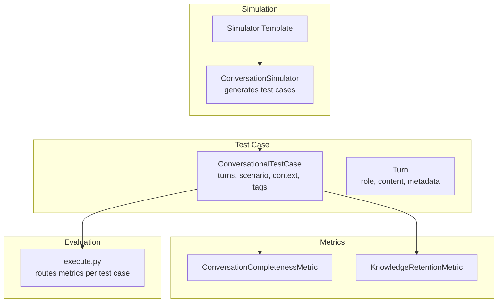
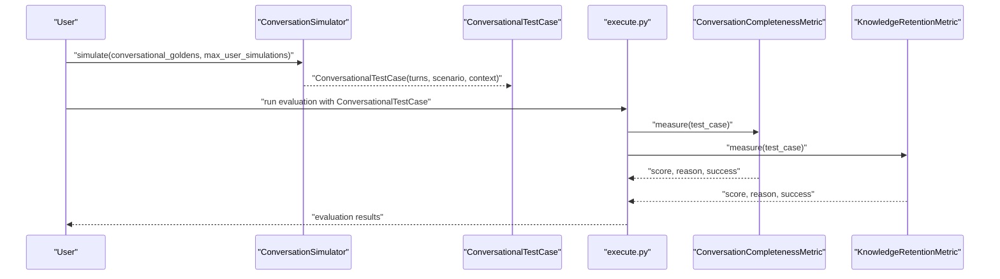
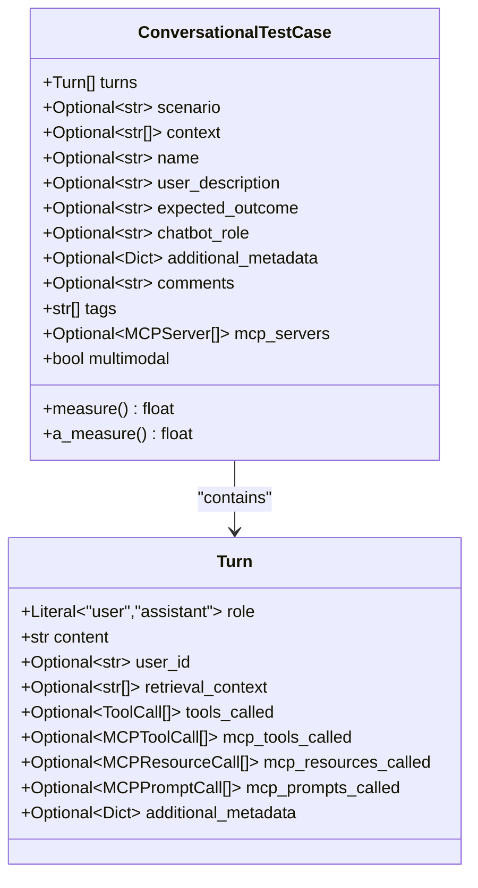
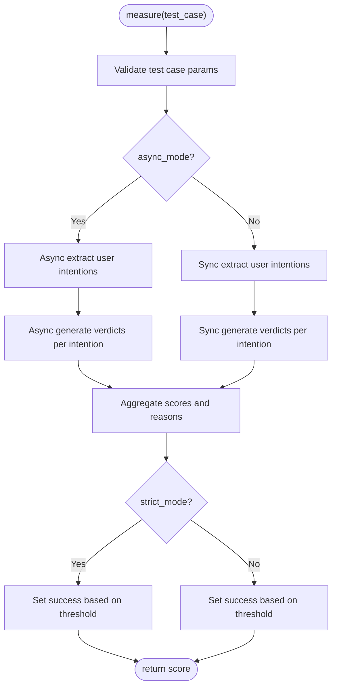
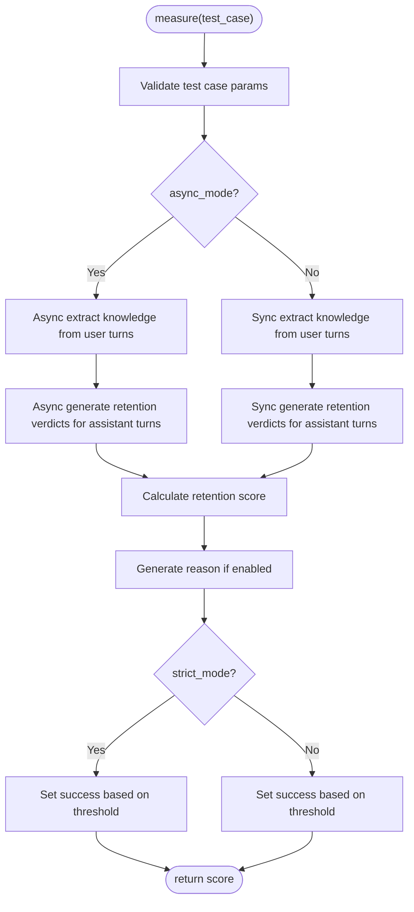
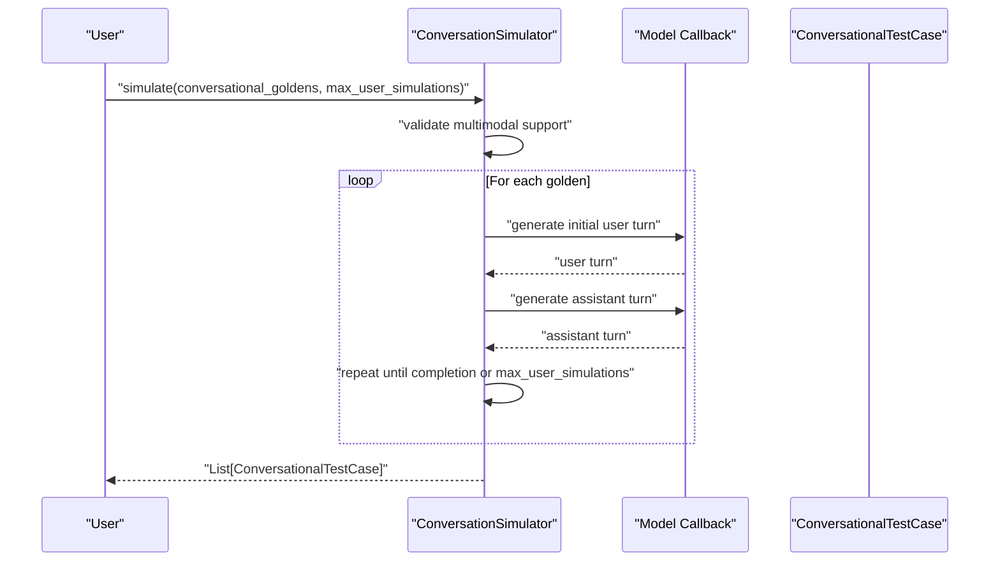
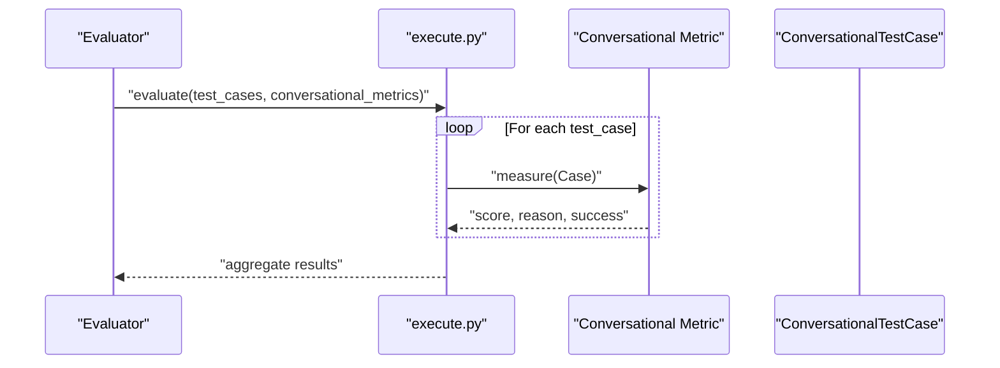
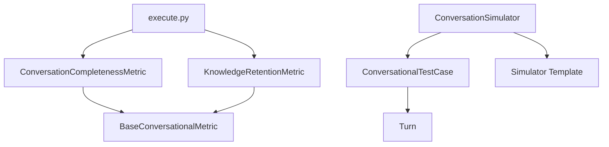

# Multi-Turn Conversational Tests

<cite>
**Referenced Files in This Document**
- [conversational_test_case.py](file://deepeval/test_case/conversational_test_case.py)
- [llm_test_case.py](file://deepeval/test_case/llm_test_case.py)
- [conversation_completeness.py](file://deepeval/metrics/conversation_completeness/conversation_completeness.py)
- [knowledge_retention.py](file://deepeval/metrics/knowledge_retention/knowledge_retention.py)
- [execute.py](file://deepeval/evaluate/execute.py)
- [conversation_simulator.py](file://deepeval/simulator/conversation_simulator.py)
- [template.py](file://deepeval/simulator/template.py)
- [base_metric.py](file://deepeval/metrics/base_metric.py)
- [test_conversational_test_case.py](file://tests/test_core/test_test_case/test_multi_turn/test_conversational_test_case.py)
- [test_turn.py](file://tests/test_core/test_test_case/test_multi_turn/test_turn.py)
- [metrics-conversational-dag.mdx](file://docs/docs/metrics-conversational-dag.mdx)
- [conversation-simulator.mdx](file://docs/docs/conversation-simulator.mdx)
- [metrics-conversation-completeness.mdx](file://docs/docs/metrics-conversation-completeness.mdx)
- [metrics-knowledge-retention.mdx](file://docs/docs/metrics-knowledge-retention.mdx)
</cite>

## Table of Contents
1. [Introduction](#introduction)
2. [Project Structure](#project-structure)
3. [Core Components](#core-components)
4. [Architecture Overview](#architecture-overview)
5. [Detailed Component Analysis](#detailed-component-analysis)
6. [Dependency Analysis](#dependency-analysis)
7. [Performance Considerations](#performance-considerations)
8. [Troubleshooting Guide](#troubleshooting-guide)
9. [Conclusion](#conclusion)
10. [Appendices](#appendices)

## Introduction
This document explains how to design and execute Multi-Turn Conversational Tests using the ConversationalTestCase in DeepEval. It covers conversational state management, turn-based evaluation, and context persistence across interactions. It also documents how to integrate conversational metrics such as KnowledgeRetention and ConversationCompleteness, and provides best practices for realistic dialogue scenarios and performance optimization.

## Project Structure
DeepEval organizes conversational testing around a core test case model and a suite of conversational metrics. The evaluation pipeline routes ConversationalTestCase instances to conversational metrics, while the simulator generates realistic multi-turn conversations for testing.

**Diagram sources**
- [conversational_test_case.py](file://deepeval/test_case/conversational_test_case.py#L131-L267)
- [conversation_completeness.py](file://deepeval/metrics/conversation_completeness/conversation_completeness.py#L30-L171)
- [knowledge_retention.py](file://deepeval/metrics/knowledge_retention/knowledge_retention.py#L27-L147)
- [execute.py](file://deepeval/evaluate/execute.py#L321-L420)
- [conversation_simulator.py](file://deepeval/simulator/conversation_simulator.py#L34-L136)
- [template.py](file://deepeval/simulator/template.py#L107-L140)

**Section sources**
- [conversational_test_case.py](file://deepeval/test_case/conversational_test_case.py#L131-L267)
- [execute.py](file://deepeval/evaluate/execute.py#L321-L420)
- [conversation_simulator.py](file://deepeval/simulator/conversation_simulator.py#L34-L136)

## Core Components
- ConversationalTestCase: Encapsulates a multi-turn conversation with optional scenario, context, and metadata. It validates and normalizes turns and supports multimodal detection.
- Turn: Represents a single speaker turn with role, content, optional user_id, retrieval_context, tool calls, and additional_metadata.
- Metrics: ConversationCompletenessMetric and KnowledgeRetentionMetric operate on ConversationalTestCase to assess completeness and knowledge retention respectively.
- Simulator: ConversationSimulator generates multi-turn conversations from golden scenarios and converts them into ConversationalTestCase instances.

Key responsibilities:
- ConversationalTestCase: Validates turns, enforces non-empty turns, ensures context is a list of strings, and detects multimodal content.
- Turn: Supports structured metadata and tool-call annotations for assistant turns.
- Metrics: Extract required fields from turns, compute scores asynchronously or synchronously, and optionally include reasons.
- Simulator: Orchestrates conversation generation, respects concurrency limits, and validates multimodal support.

**Section sources**
- [conversational_test_case.py](file://deepeval/test_case/conversational_test_case.py#L131-L267)
- [conversation_completeness.py](file://deepeval/metrics/conversation_completeness/conversation_completeness.py#L30-L171)
- [knowledge_retention.py](file://deepeval/metrics/knowledge_retention/knowledge_retention.py#L27-L147)
- [conversation_simulator.py](file://deepeval/simulator/conversation_simulator.py#L34-L136)

## Architecture Overview
The evaluation pipeline routes each ConversationalTestCase to conversational metrics. Metrics validate required parameters and compute scores using either synchronous or asynchronous LLM calls. The simulator can generate test cases for repeated evaluation across scenarios.

**Diagram sources**
- [conversation_simulator.py](file://deepeval/simulator/conversation_simulator.py#L67-L136)
- [execute.py](file://deepeval/evaluate/execute.py#L321-L420)
- [conversation_completeness.py](file://deepeval/metrics/conversation_completeness/conversation_completeness.py#L52-L171)
- [knowledge_retention.py](file://deepeval/metrics/knowledge_retention/knowledge_retention.py#L47-L147)

## Detailed Component Analysis

### ConversationalTestCase and Turn
ConversationalTestCase defines the conversation structure and enforces validation rules. Turn defines the per-turn structure including role, content, and optional metadata.

Implementation highlights:
- Validation ensures turns is non-empty and context is a list of strings.
- Multimodal detection scans scenario, expected_outcome, user_description, and turn content/context for embedded image markers.
- Turn supports MCP tool/resource/prompt call annotations and validates their types when present.

**Diagram sources**
- [conversational_test_case.py](file://deepeval/test_case/conversational_test_case.py#L24-L267)

**Section sources**
- [conversational_test_case.py](file://deepeval/test_case/conversational_test_case.py#L131-L267)
- [test_conversational_test_case.py](file://tests/test_core/test_test_case/test_multi_turn/test_conversational_test_case.py#L1-L120)
- [test_turn.py](file://tests/test_core/test_test_case/test_multi_turn/test_turn.py#L111-L192)

### ConversationCompletenessMetric
ConversationCompletenessMetric evaluates whether a conversation achieves the intended outcomes by extracting user intentions and generating verdicts per intention.

Processing logic:
- Extracts user intentions from the conversation.
- Generates a verdict per intention using a template.
- Aggregates scores and reasons, supporting strict mode and async execution.

**Diagram sources**
- [conversation_completeness.py](file://deepeval/metrics/conversation_completeness/conversation_completeness.py#L52-L171)

**Section sources**
- [conversation_completeness.py](file://deepeval/metrics/conversation_completeness/conversation_completeness.py#L30-L171)
- [metrics-conversation-completeness.mdx](file://docs/docs/metrics-conversation-completeness.mdx)

### KnowledgeRetentionMetric
KnowledgeRetentionMetric measures whether assistant responses retain previously stated knowledge from earlier turns.

Processing logic:
- Extracts knowledge from user turns using previous turns as context.
- For each assistant turn, compares the assistant’s message against accumulated knowledge to generate verdicts.
- Computes a retention score and reason, supporting strict mode and async execution.

**Diagram sources**
- [knowledge_retention.py](file://deepeval/metrics/knowledge_retention/knowledge_retention.py#L47-L147)

**Section sources**
- [knowledge_retention.py](file://deepeval/metrics/knowledge_retention/knowledge_retention.py#L27-L147)
- [metrics-knowledge-retention.mdx](file://docs/docs/metrics-knowledge-retention.mdx)

### Conversation Simulator
The simulator generates multi-turn conversations from golden scenarios and converts them into ConversationalTestCase instances. It supports both synchronous and asynchronous modes, concurrency control, and multimodal validation.

**Diagram sources**
- [conversation_simulator.py](file://deepeval/simulator/conversation_simulator.py#L67-L136)
- [template.py](file://deepeval/simulator/template.py#L107-L140)

**Section sources**
- [conversation_simulator.py](file://deepeval/simulator/conversation_simulator.py#L34-L136)
- [conversation-simulator.mdx](file://docs/docs/conversation-simulator.mdx)

### Integration with Evaluation Pipeline
The evaluation engine routes ConversationalTestCase instances to conversational metrics and aggregates results.

**Diagram sources**
- [execute.py](file://deepeval/evaluate/execute.py#L321-L420)
- [base_metric.py](file://deepeval/metrics/base_metric.py#L56-L100)

**Section sources**
- [execute.py](file://deepeval/evaluate/execute.py#L321-L420)
- [base_metric.py](file://deepeval/metrics/base_metric.py#L56-L100)

## Dependency Analysis
- ConversationalTestCase depends on Turn and validates inputs, including multimodal detection via image markers.
- Metrics depend on BaseConversationalMetric and use templates to generate prompts and extract structured results.
- The evaluation pipeline depends on execute.py to route metrics to test cases.
- Simulator depends on templates and model callbacks to generate turns.

**Diagram sources**
- [conversational_test_case.py](file://deepeval/test_case/conversational_test_case.py#L131-L267)
- [conversation_completeness.py](file://deepeval/metrics/conversation_completeness/conversation_completeness.py#L30-L171)
- [knowledge_retention.py](file://deepeval/metrics/knowledge_retention/knowledge_retention.py#L27-L147)
- [execute.py](file://deepeval/evaluate/execute.py#L321-L420)
- [conversation_simulator.py](file://deepeval/simulator/conversation_simulator.py#L34-L136)
- [template.py](file://deepeval/simulator/template.py#L107-L140)

**Section sources**
- [conversational_test_case.py](file://deepeval/test_case/conversational_test_case.py#L131-L267)
- [conversation_completeness.py](file://deepeval/metrics/conversation_completeness/conversation_completeness.py#L30-L171)
- [knowledge_retention.py](file://deepeval/metrics/knowledge_retention/knowledge_retention.py#L27-L147)
- [execute.py](file://deepeval/evaluate/execute.py#L321-L420)
- [conversation_simulator.py](file://deepeval/simulator/conversation_simulator.py#L34-L136)

## Performance Considerations
- Asynchronous execution: Both ConversationCompletenessMetric and KnowledgeRetentionMetric support async_mode to parallelize metric computations.
- Concurrency control: ConversationSimulator uses a semaphore to limit concurrent simulations.
- Multimodal validation: Simulator checks model capabilities before generating multimodal content to avoid runtime failures.
- Caching: While conversational metrics are not cached in the evaluator, LLM metrics leverage caching to reduce costs.

Best practices:
- Prefer async_mode for metrics to speed up evaluation.
- Limit max_concurrent in the simulator to balance throughput and resource usage.
- Use smaller window sizes for metrics that scan recent turns to reduce computation.
- Reuse ConversationalTestCase instances across runs for the same scenarios to enable regression tracking.

**Section sources**
- [conversation_completeness.py](file://deepeval/metrics/conversation_completeness/conversation_completeness.py#L30-L171)
- [knowledge_retention.py](file://deepeval/metrics/knowledge_retention/knowledge_retention.py#L27-L147)
- [conversation_simulator.py](file://deepeval/simulator/conversation_simulator.py#L34-L136)
- [execute.py](file://deepeval/evaluate/execute.py#L321-L420)

## Troubleshooting Guide
Common issues and resolutions:
- Empty turns: ConversationalTestCase raises an error if turns is empty. Ensure at least one Turn is provided.
- Invalid context type: Context must be None or a list of strings. Fix by passing a list of strings or None.
- Multimodal mismatch: If multimodal content is present, ensure the evaluation model supports multimodal inputs or switch to a compatible model.
- Tool/MCP annotations: When using MCP tool/resource/prompt calls, ensure the provided lists contain the correct types; otherwise validation will fail.
- Debugging conversation flow: Use verbose_mode and include_reason in metrics to get detailed logs and reasons. For simulator issues, verify model_callback signature and async_mode settings.

**Section sources**
- [conversational_test_case.py](file://deepeval/test_case/conversational_test_case.py#L200-L235)
- [conversation_simulator.py](file://deepeval/simulator/conversation_simulator.py#L100-L136)
- [conversation_completeness.py](file://deepeval/metrics/conversation_completeness/conversation_completeness.py#L52-L171)
- [knowledge_retention.py](file://deepeval/metrics/knowledge_retention/knowledge_retention.py#L47-L147)

## Conclusion
DeepEval’s ConversationalTestCase provides a robust foundation for multi-turn evaluation. By structuring conversations with Turn objects, validating inputs, and integrating with metrics like ConversationCompleteness and KnowledgeRetention, teams can assess chatbot and agent behavior comprehensively. The simulator streamlines scenario generation, while the evaluation pipeline efficiently routes test cases to metrics, enabling scalable and repeatable conversational testing.

## Appendices

### Practical Examples and Scenarios
- Creating a minimal ConversationalTestCase with a single user turn.
- Building alternating user-assistant turns for realistic dialogues.
- Adding retrieval_context and tool annotations to assistant turns.
- Using the simulator to generate multi-turn conversations from golden scenarios.

References:
- [test_conversational_test_case.py](file://tests/test_core/test_test_case/test_multi_turn/test_conversational_test_case.py#L1-L120)
- [test_turn.py](file://tests/test_core/test_test_case/test_multi_turn/test_turn.py#L111-L192)
- [conversation-simulator.mdx](file://docs/docs/conversation-simulator.mdx)

### Designing Realistic Dialogue Scenarios
- Use ConversationalGolden to define scenario, expected outcome, and optional initial turns.
- Leverage the simulator to expand scenarios into multi-turn conversations.
- Iterate scenarios to cover diverse user intents and edge cases.

References:
- [conversation-simulator.mdx](file://docs/docs/conversation-simulator.mdx)
- [metrics-conversational-dag.mdx](file://docs/docs/metrics-conversational-dag.mdx)