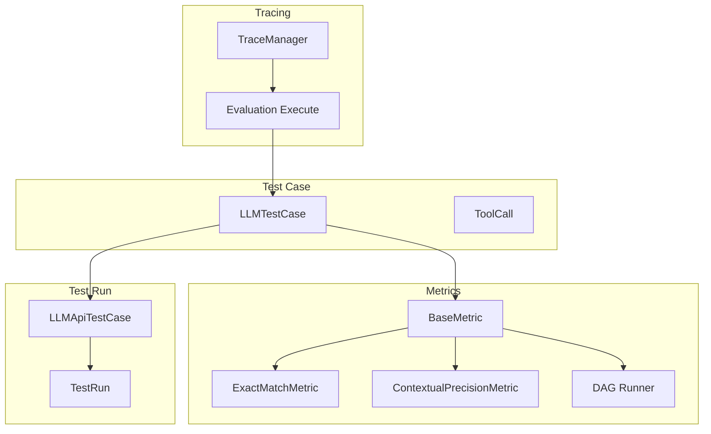
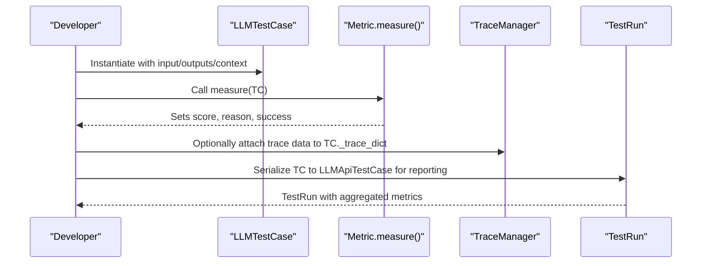
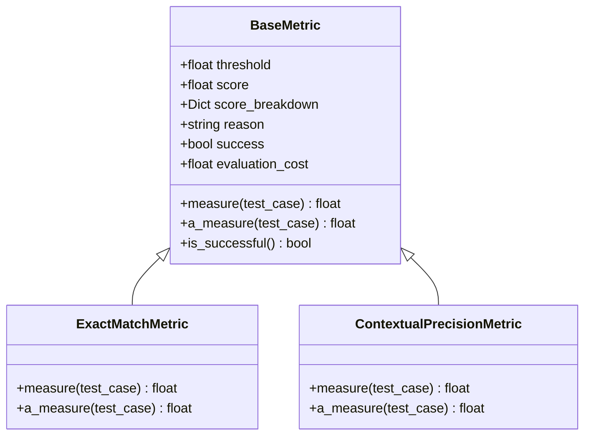
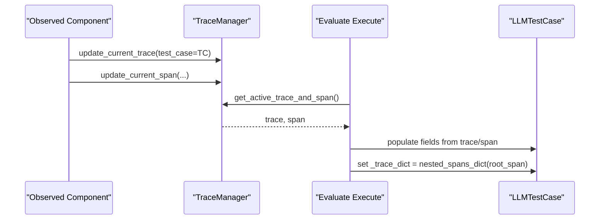
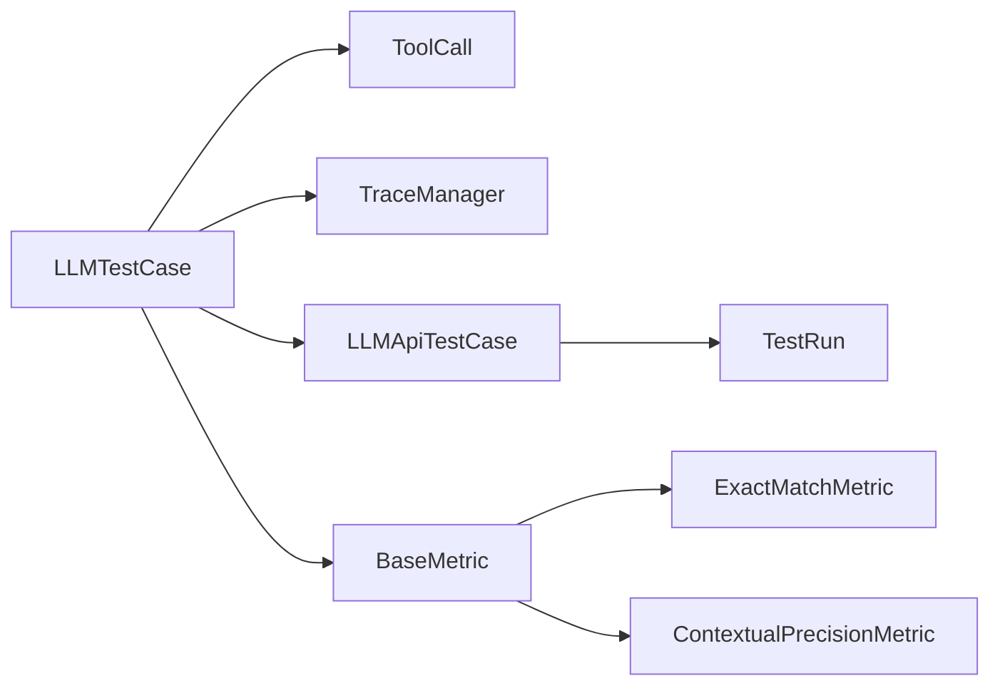
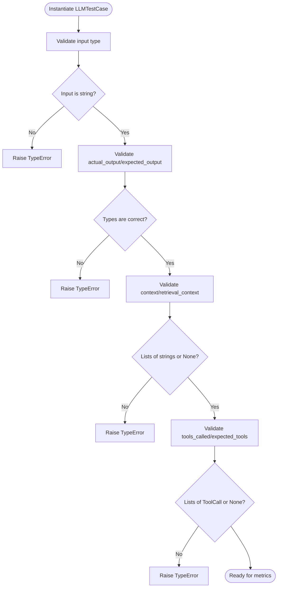

# Single-Turn Test Cases

<cite>
**Referenced Files in This Document**
- [llm_test_case.py](file://deepeval/test_case/llm_test_case.py)
- [__init__.py](file://deepeval/test_case/__init__.py)
- [utils.py](file://deepeval/test_case/utils.py)
- [base_metric.py](file://deepeval/metrics/base_metric.py)
- [exact_match.py](file://deepeval/metrics/exact_match/exact_match.py)
- [contextual_precision.py](file://deepeval/metrics/contextual_precision/contextual_precision.py)
- [dag.py](file://deepeval/metrics/dag/dag.py)
- [test_example.py](file://examples/getting_started/test_example.py)
- [rag_evaluation_with_qdrant.py](file://examples/rag_evaluation/rag_evaluation_with_qdrant.py)
- [guides-rag-evaluation.mdx](file://docs/guides/guides-rag-evaluation.mdx)
- [tracing.py](file://deepeval/tracing/tracing.py)
- [execute.py](file://deepeval/evaluate/execute.py)
- [test_run.py](file://deepeval/test_run/test_run.py)
- [api.py](file://deepeval/test_case/api.py)
- [test_single_turn.py](file://tests/test_core/test_test_case/test_single_turn.py)
- [utils.py](file://deepeval/tracing/utils.py)
- [test_execute_integration.py](file://tests/test_core/test_tracing/test_execute_integration.py)
</cite>

## Table of Contents
1. [Introduction](#introduction)
2. [Project Structure](#project-structure)
3. [Core Components](#core-components)
4. [Architecture Overview](#architecture-overview)
5. [Detailed Component Analysis](#detailed-component-analysis)
6. [Dependency Analysis](#dependency-analysis)
7. [Performance Considerations](#performance-considerations)
8. [Troubleshooting Guide](#troubleshooting-guide)
9. [Conclusion](#conclusion)
10. [Appendices](#appendices)

## Introduction
This document explains how to build and use Single-Turn Test Cases with LLMTestCase in DeepEval. It covers the LLMTestCase class, its core attributes, instantiation patterns, integration with metrics for scoring, and integration with tracing for component-level observability. It also provides practical guidance for RAG evaluation and unit testing LLM outputs, along with best practices and troubleshooting tips.

## Project Structure
The single-turn evaluation workflow centers around:
- Test case definition and validation: LLMTestCase and ToolCall
- Metrics that consume LLMTestCase to produce scores and reasons
- Tracing that attaches LLMTestCase data to spans for component-level evaluation
- Test run serialization and reporting

**Diagram sources**
- [llm_test_case.py](file://deepeval/test_case/llm_test_case.py#L301-L543)
- [base_metric.py](file://deepeval/metrics/base_metric.py#L1-L134)
- [exact_match.py](file://deepeval/metrics/exact_match/exact_match.py#L47-L86)
- [contextual_precision.py](file://deepeval/metrics/contextual_precision/contextual_precision.py#L110-L151)
- [dag.py](file://deepeval/metrics/dag/dag.py#L79-L115)
- [tracing.py](file://deepeval/tracing/tracing.py#L1-L200)
- [execute.py](file://deepeval/evaluate/execute.py#L1228-L1250)
- [api.py](file://deepeval/test_case/api.py#L47-L112)
- [test_run.py](file://deepeval/test_run/test_run.py#L142-L200)

**Section sources**
- [llm_test_case.py](file://deepeval/test_case/llm_test_case.py#L301-L543)
- [__init__.py](file://deepeval/test_case/__init__.py#L1-L38)

## Core Components
- LLMTestCase: The central data structure representing a single turn of an LLM evaluation. It includes input, actual_output, expected_output, context, retrieval_context, and additional metadata. It also supports tool calls, tags, names, and tracing attachments.
- ToolCall: Represents tool invocations with name, input parameters, and output, used for tool-related metrics.
- Metrics: Measure() methods consume LLMTestCase and set score, reason, success, and optionally evaluation cost.
- Tracing: Attaches LLMTestCase data to spans and can populate LLMTestCase._trace_dict for downstream analysis.
- Test Run: Serializes LLMTestCase into LLMApiTestCase for reporting and dashboards.

**Section sources**
- [llm_test_case.py](file://deepeval/test_case/llm_test_case.py#L301-L543)
- [base_metric.py](file://deepeval/metrics/base_metric.py#L1-L134)
- [tracing.py](file://deepeval/tracing/tracing.py#L1-L200)
- [test_run.py](file://deepeval/test_run/test_run.py#L142-L200)

## Architecture Overview
The evaluation lifecycle:
- Define LLMTestCase with input, outputs, and optional context/tool metadata
- Choose metrics that require specific LLMTestCaseParams
- Run metrics (sync or async) to compute scores and reasons
- Optionally attach tracing data to LLMTestCase._trace_dict
- Serialize to LLMApiTestCase for reporting and dashboards

**Diagram sources**
- [llm_test_case.py](file://deepeval/test_case/llm_test_case.py#L301-L543)
- [base_metric.py](file://deepeval/metrics/base_metric.py#L1-L134)
- [tracing.py](file://deepeval/tracing/tracing.py#L1-L200)
- [test_run.py](file://deepeval/test_run/test_run.py#L142-L200)

## Detailed Component Analysis

### LLMTestCase: Attributes and Roles
- input: The user query or prompt text for the single turn.
- actual_output: The LLM’s generated response for this turn.
- expected_output: Ground truth or desired response used by metrics that require it.
- context: Optional list of supporting background texts for the turn.
- retrieval_context: Optional list of retrieved chunks used by the generator (commonly used in RAG).
- additional_metadata: Arbitrary dictionary for dataset-level or experiment metadata.
- tools_called: Optional list of ToolCall objects representing tool invocations.
- expected_tools: Optional list of ToolCall objects representing expected tool invocations.
- token_cost, completion_time: Optional numeric fields for cost and timing.
- name, tags: Optional identifiers for grouping and filtering.
- mcp_* fields: Optional fields for MCP-related tool/resource/prompt calls.
- Private attributes: _trace_dict, _dataset_rank, _dataset_alias, _dataset_id, _identifier.

Validation and normalization:
- Pydantic validators enforce types and shapes (e.g., context and retrieval_context must be None or lists of strings).
- ToolCall enforces hashability and equality semantics for deterministic comparisons.
- Multimodal detection auto-detects image placeholders in input/outputs/context/retrieval_context.

Common initialization patterns:
- Minimal: input only
- Full: include outputs, context, retrieval_context, metadata, tools_called, expected_tools, timing/cost, name/tags
- Mixed-case field names are accepted via aliases for backward compatibility

**Section sources**
- [llm_test_case.py](file://deepeval/test_case/llm_test_case.py#L301-L543)
- [test_single_turn.py](file://tests/test_core/test_test_case/test_single_turn.py#L1-L200)
- [test_single_turn.py](file://tests/test_core/test_test_case/test_single_turn.py#L251-L351)

### ToolCall: Tool Invocation Representation
- Fields: name, description, reasoning, output, input_parameters
- Equality and hashing are computed using normalized representations to handle nested structures
- Used by metrics that evaluate tool usage correctness

**Section sources**
- [llm_test_case.py](file://deepeval/test_case/llm_test_case.py#L214-L300)

### Metrics Integration: Scoring and Tracing
- BaseMetric defines measure() and a_measure(), thresholds, and success flags
- Metrics like ExactMatchMetric and ContextualPrecisionMetric consume LLMTestCase to compute scores
- DAG runner orchestrates metric execution and logs verbose steps
- Metrics can optionally post data to a confident service and track evaluation cost

**Diagram sources**
- [base_metric.py](file://deepeval/metrics/base_metric.py#L1-L134)
- [exact_match.py](file://deepeval/metrics/exact_match/exact_match.py#L47-L86)
- [contextual_precision.py](file://deepeval/metrics/contextual_precision/contextual_precision.py#L110-L151)

**Section sources**
- [base_metric.py](file://deepeval/metrics/base_metric.py#L1-L134)
- [exact_match.py](file://deepeval/metrics/exact_match/exact_match.py#L47-L86)
- [contextual_precision.py](file://deepeval/metrics/contextual_precision/contextual_precision.py#L110-L151)
- [dag.py](file://deepeval/metrics/dag/dag.py#L79-L115)

### Tracing Integration: Component-Level Observability
- TraceManager manages traces and spans, enabling component-level evaluation
- During evaluation loops, LLMTestCase can be populated from trace data and attached with _trace_dict for downstream analysis
- Tests demonstrate precedence of explicit kwargs over test_case fields when updating traces/spans

**Diagram sources**
- [tracing.py](file://deepeval/tracing/tracing.py#L1-L200)
- [execute.py](file://deepeval/evaluate/execute.py#L1228-L1250)
- [execute.py](file://deepeval/evaluate/execute.py#L2319-L2343)
- [test_execute_integration.py](file://tests/test_core/test_tracing/test_execute_integration.py#L115-L155)

**Section sources**
- [tracing.py](file://deepeval/tracing/tracing.py#L1-L200)
- [execute.py](file://deepeval/evaluate/execute.py#L1228-L1250)
- [execute.py](file://deepeval/evaluate/execute.py#L2319-L2343)
- [test_execute_integration.py](file://tests/test_core/test_tracing/test_execute_integration.py#L115-L155)

### Serialization and Reporting
- LLMTestCase is serialized into LLMApiTestCase for reporting and dashboards
- Additional metadata, images mapping, and trace data are included
- TestRun aggregates metrics and evaluation costs

**Section sources**
- [api.py](file://deepeval/test_case/api.py#L47-L112)
- [test_run.py](file://deepeval/test_run/test_run.py#L142-L200)

## Dependency Analysis
- LLMTestCase depends on ToolCall and optional MCP-related types
- Metrics depend on LLMTestCase and BaseMetric
- Tracing depends on LLMTestCase and updates it with _trace_dict
- Test run depends on LLMTestCase serialization to LLMApiTestCase

**Diagram sources**
- [llm_test_case.py](file://deepeval/test_case/llm_test_case.py#L301-L543)
- [base_metric.py](file://deepeval/metrics/base_metric.py#L1-L134)
- [tracing.py](file://deepeval/tracing/tracing.py#L1-L200)
- [api.py](file://deepeval/test_case/api.py#L47-L112)
- [test_run.py](file://deepeval/test_run/test_run.py#L142-L200)

**Section sources**
- [llm_test_case.py](file://deepeval/test_case/llm_test_case.py#L301-L543)
- [base_metric.py](file://deepeval/metrics/base_metric.py#L1-L134)
- [tracing.py](file://deepeval/tracing/tracing.py#L1-L200)
- [api.py](file://deepeval/test_case/api.py#L47-L112)
- [test_run.py](file://deepeval/test_run/test_run.py#L142-L200)

## Performance Considerations
- Prefer minimal LLMTestCase construction when not all fields are needed
- Use async metrics where supported to reduce latency
- Avoid unnecessary deep copies of large context/retrieval_context lists
- Leverage caching and batching in downstream reporting pipelines

[No sources needed since this section provides general guidance]

## Troubleshooting Guide
Common validation errors and resolutions:
- Type errors for input/actual_output: Ensure these are strings; lists or dicts will raise a TypeError
- Context/retrieval_context must be None or a list of strings; mixing types raises a TypeError
- Tools_called and expected_tools must be None or lists of ToolCall; invalid types raise a TypeError
- Missing required fields for metrics: Use evaluation error configuration to skip or ignore missing params
- Tracing precedence: Explicit kwargs override test_case fields when updating traces/spans

**Diagram sources**
- [llm_test_case.py](file://deepeval/test_case/llm_test_case.py#L408-L514)
- [test_single_turn.py](file://tests/test_core/test_test_case/test_single_turn.py#L251-L351)

**Section sources**
- [llm_test_case.py](file://deepeval/test_case/llm_test_case.py#L408-L514)
- [test_single_turn.py](file://tests/test_core/test_test_case/test_single_turn.py#L251-L351)
- [utils.py](file://deepeval/tracing/utils.py#L67-L83)
- [test_execute_integration.py](file://tests/test_core/test_tracing/test_execute_integration.py#L115-L155)

## Conclusion
LLMTestCase is the backbone of single-turn evaluation in DeepEval. By structuring inputs and outputs clearly, providing retrieval context when applicable, and integrating with metrics and tracing, you can build robust evaluation pipelines for RAG systems and unit testing. Use the provided patterns and validations to ensure reliable and reproducible results.

[No sources needed since this section summarizes without analyzing specific files]

## Appendices

### Practical Usage Patterns

- Unit testing LLM outputs:
  - Create LLMTestCase with input and actual_output
  - Apply metrics like ExactMatchMetric
  - Assert success and examine reason

- RAG evaluation:
  - Populate retrieval_context with chunks from your retriever
  - Compare actual_output with expected_output
  - Use ContextualPrecisionMetric and related metrics

- Integration with tracing:
  - Use TraceManager to attach LLMTestCase._trace_dict
  - Populate fields from spans and traces during evaluation

**Section sources**
- [test_example.py](file://examples/getting_started/test_example.py#L1-L40)
- [rag_evaluation_with_qdrant.py](file://examples/rag_evaluation/rag_evaluation_with_qdrant.py#L129-L164)
- [guides-rag-evaluation.mdx](file://docs/guides/guides-rag-evaluation.mdx#L120-L170)
- [execute.py](file://deepeval/evaluate/execute.py#L1228-L1250)

### Best Practices
- Keep input minimal and focused; avoid embedding full prompts
- Use retrieval_context only for RAG scenarios
- Include additional_metadata for dataset-level grouping and filtering
- Use tags and names to organize test cases
- For tool-centric apps, record tools_called and expected_tools
- Enable tracing to capture component-level insights and debug failures

[No sources needed since this section provides general guidance]