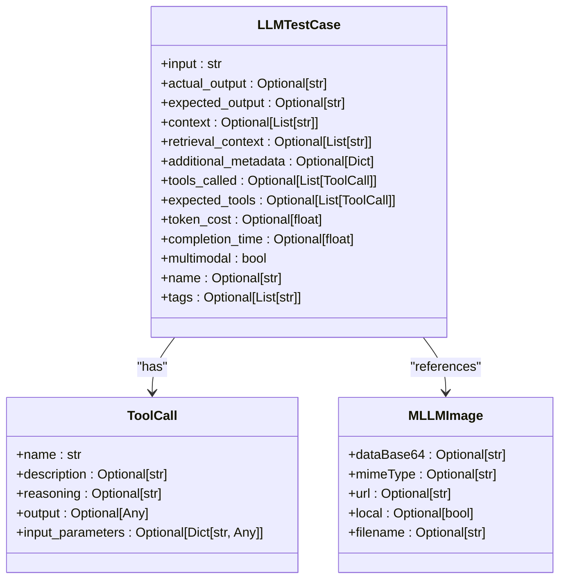
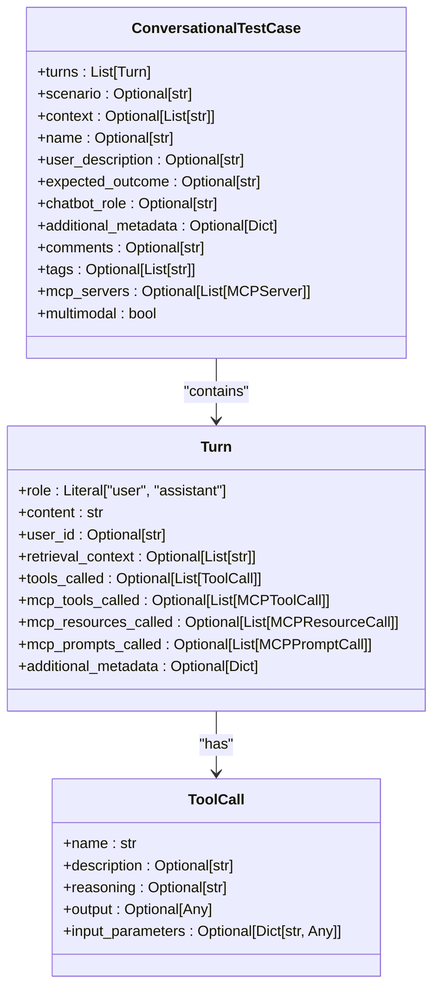
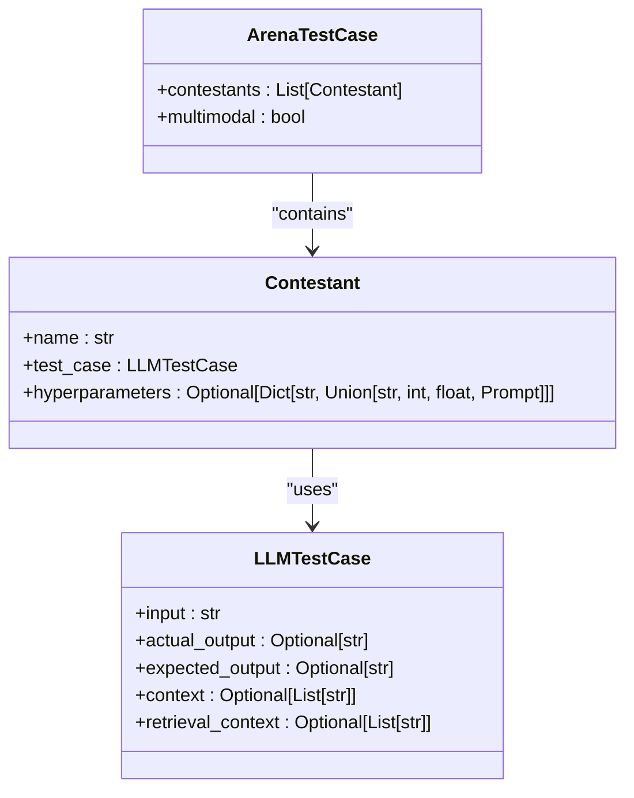
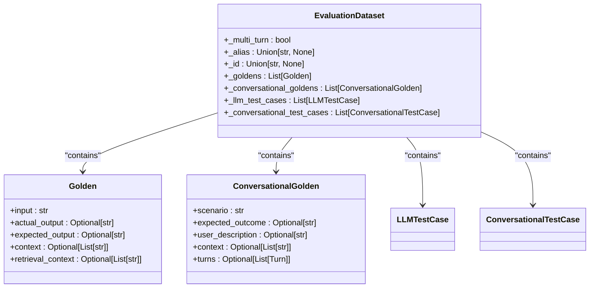
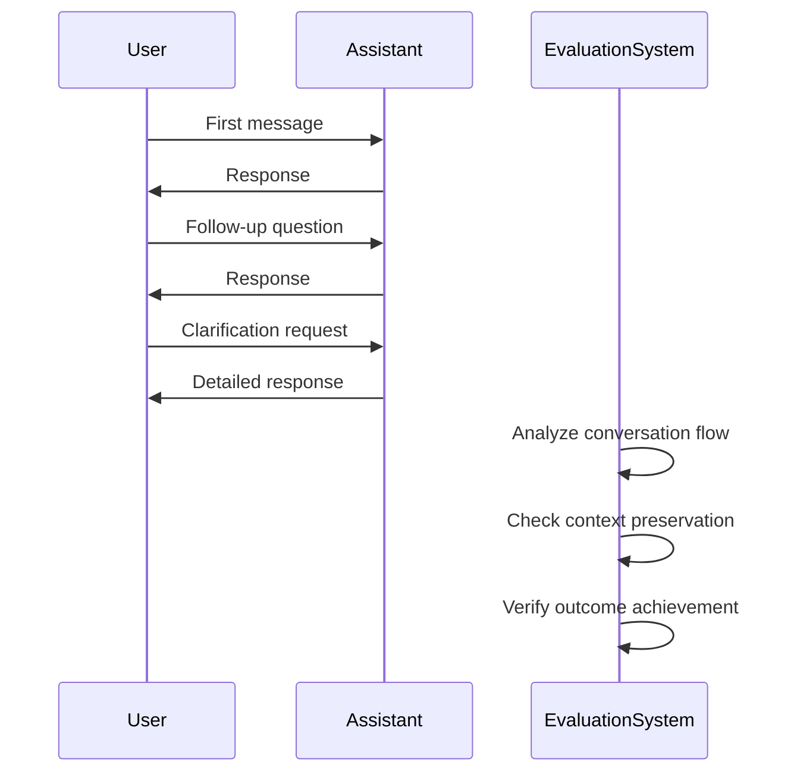

# Test Case Management

<cite>
**Referenced Files in This Document**   
- [llm_test_case.py](file://deepeval/test_case/llm_test_case.py)
- [conversational_test_case.py](file://deepeval/test_case/conversational_test_case.py)
- [arena_test_case.py](file://deepeval/test_case/arena_test_case.py)
- [dataset.py](file://deepeval/dataset/dataset.py)
- [golden.py](file://deepeval/dataset/golden.py)
- [mcp.py](file://deepeval/test_case/mcp.py)
- [utils.py](file://deepeval/test_case/utils.py)
</cite>

## Table of Contents
1. [Introduction](#introduction)
2. [Core Test Case Types](#core-test-case-types)
3. [Domain Model and Key Attributes](#domain-model-and-key-attributes)
4. [Dataset System Integration](#dataset-system-integration)
5. [Programmatic Test Case Creation](#programmatic-test-case-creation)
6. [Relationship with Metrics and Evaluation](#relationship-with-metrics-and-evaluation)
7. [Relationship with Tracing System](#relationship-with-tracing-system)
8. [Handling Multi-Turn Conversations](#handling-multi-turn-conversations)
9. [Advanced Features](#advanced-features)
10. [Best Practices and Common Issues](#best-practices-and-common-issues)

## Introduction

Test Case Management in DeepEval provides a comprehensive framework for creating, organizing, and evaluating LLM interactions across various scenarios. The system supports different test case types to accommodate diverse evaluation needs, from simple single-turn interactions to complex multi-turn conversations and competitive evaluations. This documentation thoroughly explains the implementation of test case types including LLMTestCase, ConversationalTestCase, and ArenaTestCase, their relationships with the dataset system, and their integration with evaluation metrics and tracing components.

**Section sources**
- [llm_test_case.py](file://deepeval/test_case/llm_test_case.py#L1-L543)
- [conversational_test_case.py](file://deepeval/test_case/conversational_test_case.py#L1-L267)
- [arena_test_case.py](file://deepeval/test_case/arena_test_case.py#L1-L49)

## Core Test Case Types

DeepEval implements three primary test case types to support different evaluation scenarios: LLMTestCase for single-turn interactions, ConversationalTestCase for multi-turn conversations, and ArenaTestCase for competitive evaluations.

### LLMTestCase

LLMTestCase represents a single interaction with a language model and serves as the fundamental building block for evaluation. It captures the complete context of an LLM interaction, including input, actual output, expected output, and supporting information like context and retrieval context. This test case type is designed for end-to-end evaluation of LLM responses and supports both simple text-based interactions and multimodal scenarios with image inputs.



**Diagram sources**
- [llm_test_case.py](file://deepeval/test_case/llm_test_case.py#L301-L543)

### ConversationalTestCase

ConversationalTestCase is designed for evaluating multi-turn conversations between users and AI systems. It consists of a sequence of Turn objects, each representing a single exchange in the conversation. This test case type supports complex conversational scenarios with rich metadata, including user descriptions, chatbot roles, and expected outcomes for the entire conversation. The structure enables evaluation of conversation flow, context preservation, and long-term coherence.



**Diagram sources**
- [conversational_test_case.py](file://deepeval/test_case/conversational_test_case.py#L131-L267)

### ArenaTestCase

ArenaTestCase enables competitive evaluation by comparing multiple LLM implementations or configurations on the same input. It contains a list of Contestant objects, each representing a different model or configuration being evaluated. This test case type ensures fair comparison by requiring all contestants to have the same input and expected output, allowing for direct performance comparison across different implementations.



**Diagram sources**
- [arena_test_case.py](file://deepeval/test_case/arena_test_case.py#L19-L49)

**Section sources**
- [llm_test_case.py](file://deepeval/test_case/llm_test_case.py#L301-L543)
- [conversational_test_case.py](file://deepeval/test_case/conversational_test_case.py#L131-L267)
- [arena_test_case.py](file://deepeval/test_case/arena_test_case.py#L19-L49)

## Domain Model and Key Attributes

The test case domain model in DeepEval is designed to capture comprehensive information about LLM interactions for thorough evaluation. Each test case type shares common attributes while also supporting specialized fields for specific evaluation scenarios.

### Core Attributes

The domain model includes several key attributes that provide essential information for evaluation:

- **input**: The prompt or query provided to the LLM
- **actual_output**: The response generated by the LLM
- **expected_output**: The desired or reference response for comparison
- **context**: Supporting information or background context for the interaction
- **retrieval_context**: Retrieved documents or information used by the LLM
- **additional_metadata**: Custom metadata for organizing and filtering test cases
- **name**: Identifier for the test case, useful for labeling and searching
- **tags**: Categorical labels for grouping and filtering test cases

### Specialized Attributes

In addition to core attributes, specialized attributes support advanced evaluation scenarios:

- **tools_called**: List of tools invoked by the LLM during execution
- **expected_tools**: List of tools expected to be called for the task
- **token_cost**: Estimated token consumption for the interaction
- **completion_time**: Time taken to generate the response
- **multimodal**: Flag indicating whether the test case involves multimodal inputs
- **scenario**: Description of the conversational scenario for multi-turn interactions
- **expected_outcome**: Desired outcome for the entire conversation
- **chatbot_role**: Role or persona the chatbot should embody

### Validation and Type Safety

The domain model implements robust validation to ensure data integrity and type safety. Pydantic models with validation decorators enforce correct data types and required fields. The system automatically detects multimodal content by scanning for image placeholders in text fields. Additionally, the model validates relationships between fields, such as ensuring that all contestants in an ArenaTestCase have identical inputs and expected outputs.

**Section sources**
- [llm_test_case.py](file://deepeval/test_case/llm_test_case.py#L301-L543)
- [conversational_test_case.py](file://deepeval/test_case/conversational_test_case.py#L131-L267)
- [golden.py](file://deepeval/dataset/golden.py#L8-L198)

## Dataset System Integration

The test case system integrates seamlessly with DeepEval's dataset management capabilities, enabling efficient organization, storage, and retrieval of test cases.

### Dataset Structure

The EvaluationDataset class serves as the container for test cases and goldens (reference examples). It maintains separate collections for single-turn and multi-turn test cases, preventing mixing of different test case types within the same dataset. The dataset tracks metadata such as alias, ID, and multi-turn status, providing context for the test cases it contains.



**Diagram sources**
- [dataset.py](file://deepeval/dataset/dataset.py#L68-L800)

### Data Loading and Export

The dataset system supports multiple data formats for importing and exporting test cases. It provides methods for loading test cases from CSV and JSON files, with configurable column and key names to accommodate different data structures. When loading from CSV, the system handles delimited lists in text fields by splitting them according to specified delimiters. The push and pull methods enable synchronization with external storage, particularly Confident AI, allowing teams to share and collaborate on test case datasets.

### Golden to Test Case Conversion

The system facilitates conversion between goldens (reference examples) and test cases, supporting the evolution of test data. Goldens can be automatically converted to test cases when pulled from external sources, with the option to enable this conversion during the pull operation. This feature enables teams to maintain a single source of truth for reference examples while automatically generating corresponding test cases for evaluation.

**Section sources**
- [dataset.py](file://deepeval/dataset/dataset.py#L68-L800)
- [golden.py](file://deepeval/dataset/golden.py#L8-L198)

## Programmatic Test Case Creation

DeepEval provides flexible APIs for creating test cases programmatically, supporting both direct instantiation and data-driven approaches.

### Direct Instantiation

Test cases can be created directly by instantiating the appropriate class with the required parameters. The system supports both snake_case and camelCase parameter names, providing flexibility for developers. For example, both `actual_output` and `actualOutput` are accepted as valid parameter names.

```python
from deepeval.test_case import LLMTestCase, ConversationalTestCase, Turn

# Creating a simple LLM test case
test_case = LLMTestCase(
    input="What is the capital of France?",
    actual_output="The capital of France is Paris.",
    expected_output="Paris",
    context=["France is a country in Europe", "Paris is the largest city in France"]
)

# Creating a conversational test case
convo_test_case = ConversationalTestCase(
    turns=[
        Turn(role="user", content="Hello"),
        Turn(role="assistant", content="Hi there! How can I help?"),
        Turn(role="user", content="What's the weather like today?"),
        Turn(role="assistant", content="I'm sorry, I don't have access to real-time weather data.")
    ],
    scenario="Customer service interaction",
    expected_outcome="User receives helpful response"
)
```

### Data-Driven Creation

For large-scale test case creation, DeepEval supports loading test cases from external data sources. The dataset system provides methods for importing test cases from CSV and JSON files, automatically mapping columns or keys to test case attributes. This approach enables teams to leverage existing data assets for evaluation purposes.

```python
from deepeval.dataset import EvaluationDataset

# Create dataset and load test cases from CSV
dataset = EvaluationDataset()
dataset.add_test_cases_from_csv_file(
    file_path="test_cases.csv",
    input_col_name="question",
    actual_output_col_name="response",
    expected_output_col_name="answer",
    context_col_name="retrieved_docs",
    context_col_delimiter="|"
)
```

### Multimodal Test Cases

The system supports multimodal test cases through the MLLMImage class, which encapsulates image data for use in test cases. Images can be referenced by URL or loaded from local files, with automatic Base64 encoding for local images. The system uses placeholder tokens to represent images in text fields, preserving the multimodal nature of the interaction.

```python
from deepeval.test_case import LLMTestCase, MLLMImage

# Create multimodal test case with image
shoes_image = MLLMImage(url='./shoes.png', local=True)
test_case = LLMTestCase(
    input=f"Describe the color and style of these shoes: {shoes_image}",
    expected_output="Blue running shoes with white stripes"
)
```

**Section sources**
- [llm_test_case.py](file://deepeval/test_case/llm_test_case.py#L301-L543)
- [conversational_test_case.py](file://deepeval/test_case/conversational_test_case.py#L131-L267)
- [dataset.py](file://deepeval/dataset/dataset.py#L240-L467)

## Relationship with Metrics and Evaluation

Test cases serve as the foundation for evaluation in DeepEval, providing the data needed for various metrics to assess LLM performance.

### Metric Integration

Each test case type is designed to work with specific metrics that evaluate different aspects of LLM performance. Single-turn test cases are evaluated using metrics like answer relevancy, faithfulness, and hallucination detection, while multi-turn test cases use specialized metrics for conversation completeness and coherence. The system validates that test cases contain the required parameters for each metric, raising errors when necessary data is missing.

### Evaluation Workflow

The evaluation process begins with test cases and applies metrics to generate scores and insights. The system tracks evaluation results, including success status, metric data, and execution duration. For arena evaluations, the system compares results across contestants, providing comparative analysis of different models or configurations.

### Custom Metrics

Developers can create custom metrics that operate on test cases, leveraging the rich attribute set to implement specialized evaluation logic. Custom metrics can access all test case attributes, including context, retrieval context, and tool usage, enabling sophisticated evaluation scenarios that go beyond simple output comparison.

**Section sources**
- [llm_test_case.py](file://deepeval/test_case/llm_test_case.py#L301-L543)
- [conversational_test_case.py](file://deepeval/test_case/conversational_test_case.py#L131-L267)
- [dataset.py](file://deepeval/dataset/dataset.py#L68-L800)

## Relationship with Tracing System

The test case system integrates with DeepEval's tracing capabilities to provide detailed insights into LLM execution.

### Component-Level Analysis

Tracing enables component-level analysis of LLM interactions, capturing information about individual operations within the evaluation process. Test cases are linked to trace data, allowing developers to correlate evaluation results with execution details. This integration supports debugging and optimization by revealing the internal workings of the LLM system.

### Performance Monitoring

The system captures performance metrics such as token cost and completion time, which are stored as attributes of the test case. These metrics provide insights into the efficiency of LLM interactions and can be used to identify performance bottlenecks or optimize cost-effectiveness.

### Debugging and Optimization

Tracing data enhances the debugging capabilities of test cases by providing detailed execution logs and intermediate results. Developers can use this information to understand why a test case failed and identify areas for improvement. The integration also supports optimization by revealing patterns in tool usage, context retrieval, and other operational aspects.

**Section sources**
- [llm_test_case.py](file://deepeval/test_case/llm_test_case.py#L301-L543)
- [dataset.py](file://deepeval/dataset/dataset.py#L68-L800)
- [api.py](file://deepeval/test_case/api.py#L1-L113)

## Handling Multi-Turn Conversations

DeepEval provides comprehensive support for multi-turn conversations through the ConversationalTestCase class and related components.

### Conversation Structure

Multi-turn conversations are represented as a sequence of Turn objects, each capturing a single exchange in the dialogue. The Turn class includes attributes for role (user or assistant), content, and optional metadata such as user ID and additional context. This structure enables evaluation of conversation flow, context preservation, and long-term coherence.

### Context Management

The system supports both conversation-level context and turn-specific retrieval context. Conversation context provides background information applicable to the entire dialogue, while turn-specific context offers supporting information for individual exchanges. This dual-level context model enables realistic simulation of conversational scenarios where information evolves over time.

### Evaluation Challenges and Solutions

Multi-turn conversations present unique evaluation challenges, such as assessing conversation completeness and coherence over multiple exchanges. DeepEval addresses these challenges through specialized metrics and evaluation approaches. The system can evaluate whether the conversation achieves its intended outcome, maintains consistency in tone and style, and appropriately handles context across turns.



**Diagram sources**
- [conversational_test_case.py](file://deepeval/test_case/conversational_test_case.py#L36-L267)

**Section sources**
- [conversational_test_case.py](file://deepeval/test_case/conversational_test_case.py#L36-L267)

## Advanced Features

DeepEval offers several advanced features to support sophisticated test case management and evaluation scenarios.

### MCP Integration

The system supports MCP (Model Control Protocol) integration through specialized test case attributes. MCPServer objects define available tools, resources, and prompts, while MCPToolCall, MCPResourceCall, and MCPPromptCall capture interactions with MCP components. This integration enables evaluation of LLM systems that leverage external tools and resources.

### Golden Generation

The dataset system includes capabilities for generating goldens from documents, supporting automated creation of reference examples. This feature enables teams to scale their test case creation process by leveraging existing content assets. The synthesizer component can generate realistic conversational scenarios and expected outcomes from source documents.

### Test Case Evolution

DeepEval supports the evolution of test cases over time, allowing teams to refine and improve their evaluation suite. The system tracks dataset versions and aliases, enabling comparison of results across different iterations. This capability supports regression testing and continuous improvement of LLM systems.

**Section sources**
- [mcp.py](file://deepeval/test_case/mcp.py#L1-L60)
- [dataset.py](file://deepeval/dataset/dataset.py#L68-L800)
- [golden.py](file://deepeval/dataset/golden.py#L8-L198)

## Best Practices and Common Issues

Effective test case management requires adherence to best practices and awareness of common issues.

### Best Practices

- Use descriptive names and tags to organize test cases
- Include comprehensive context and retrieval context for realistic evaluation
- Balance the test suite with diverse scenarios and edge cases
- Regularly review and update test cases to reflect changing requirements
- Use version control for test case datasets to track changes over time

### Common Issues and Solutions

- **Mixed test case types**: Avoid mixing single-turn and multi-turn test cases in the same dataset
- **Missing required attributes**: Ensure test cases include all attributes required by the evaluation metrics
- **Inconsistent naming**: Use consistent naming conventions for test case attributes
- **Overly complex scenarios**: Break down complex scenarios into smaller, focused test cases
- **Insufficient context**: Provide adequate context to enable meaningful evaluation

The system includes validation mechanisms to detect and prevent many common issues, such as ensuring all contestants in an ArenaTestCase have identical inputs and preventing the addition of incompatible test case types to a dataset.

**Section sources**
- [utils.py](file://deepeval/test_case/utils.py#L6-L21)
- [llm_test_case.py](file://deepeval/test_case/llm_test_case.py#L408-L514)
- [conversational_test_case.py](file://deepeval/test_case/conversational_test_case.py#L200-L235)