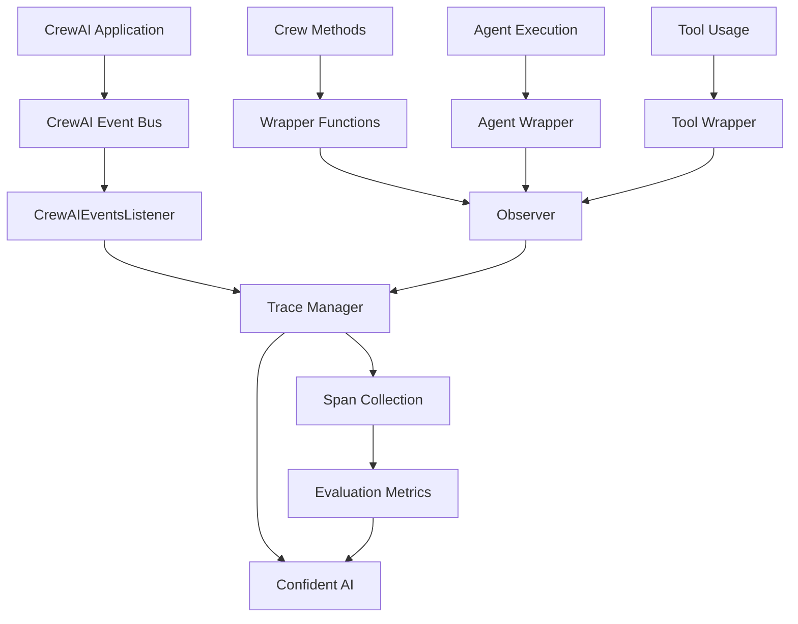

# CrewAI Integration

<cite>
**Referenced Files in This Document**   
- [handler.py](file://deepeval/integrations/crewai/handler.py)
- [wrapper.py](file://deepeval/integrations/crewai/wrapper.py)
- [tool.py](file://deepeval/integrations/crewai/tool.py)
- [subs.py](file://deepeval/integrations/crewai/subs.py)
- [task_completion.py](file://deepeval/metrics/task_completion/task_completion.py)
- [tool_correctness.py](file://deepeval/metrics/tool_correctness/tool_correctness.py)
- [plan_adherence.py](file://deepeval/metrics/plan_adherence/plan_adherence.py)
- [tracing.py](file://deepeval/tracing/tracing.py)
- [crewai.py](file://tests/test_integrations/test_crewai/test_crewai.py)
- [crewai.ipynb](file://examples/notebooks/crewai.ipynb)
- [crewai_tracing.ipynb](file://examples/tracing/crewai_tracing.ipynb)
</cite>

## Table of Contents
1. [Introduction](#introduction)
2. [Architecture Overview](#architecture-overview)
3. [Core Components](#core-components)
4. [CrewAI Callback Handler](#crewai-callback-handler)
5. [Agent Wrapper Implementation](#agent-wrapper-implementation)
6. [Tool Integration](#tool-integration)
7. [DeepEval Metrics Integration](#depeval-metrics-integration)
8. [Configuration and Trace Granularity](#configuration-and-trace-granularity)
9. [Common Issues and Solutions](#common-issues-and-solutions)
10. [Best Practices](#best-practices)
11. [Conclusion](#conclusion)

## Introduction

The CrewAI integration in DeepEval provides comprehensive monitoring and evaluation capabilities for multi-agent workflows. This integration enables detailed tracing of agent interactions, task execution, tool usage, and final outputs, allowing for both component-level and end-to-end assessment of CrewAI-based applications. The system captures the complete execution flow of CrewAI crews, from the initial kickoff to the final output, providing visibility into the decision-making processes of individual agents and the overall collaboration patterns within the crew.

The integration is designed to work seamlessly with DeepEval's evaluation framework, enabling users to apply various metrics to assess agent performance, task completion, tool usage correctness, and adherence to planned workflows. By instrumenting CrewAI applications with DeepEval, developers and researchers can gain valuable insights into agent behavior, identify bottlenecks in multi-agent workflows, and systematically improve the performance of their AI systems.

This document provides a detailed explanation of the CrewAI integration architecture, focusing on the callback handler and agent wrapper that enable comprehensive monitoring. It also covers practical implementation examples, configuration options, and best practices for evaluating complex agent collaborations.

**Section sources**
- [handler.py](file://deepeval/integrations/crewai/handler.py#L1-L233)
- [wrapper.py](file://deepeval/integrations/crewai/wrapper.py#L1-L128)
- [crewai.ipynb](file://examples/notebooks/crewai.ipynb#L1-L262)

## Architecture Overview

The CrewAI integration architecture consists of several interconnected components that work together to capture and analyze multi-agent workflows. At its core, the integration uses a combination of event listeners, wrappers, and specialized classes to instrument CrewAI applications and collect detailed execution data.

The architecture follows a layered approach with three main components: the callback handler that listens to CrewAI events, the wrapper functions that instrument key CrewAI methods, and the specialized classes that extend CrewAI functionality with DeepEval capabilities. These components work in concert to create a comprehensive tracing system that captures the complete execution flow of CrewAI crews.

The integration leverages CrewAI's event system to capture key moments in the agent workflow, including crew kickoff, agent execution, LLM calls, and tool usage. When these events occur, the callback handler processes them and creates corresponding spans in the DeepEval tracing system. Simultaneously, wrapper functions around critical CrewAI methods ensure that high-level operations are properly instrumented and can be associated with evaluation metrics.

**Diagram sources**
- [handler.py](file://deepeval/integrations/crewai/handler.py#L58-L209)
- [wrapper.py](file://deepeval/integrations/crewai/wrapper.py#L9-L123)
- [tracing.py](file://deepeval/tracing/tracing.py#L81-L200)

**Section sources**
- [handler.py](file://deepeval/integrations/crewai/handler.py#L1-L233)
- [wrapper.py](file://deepeval/integrations/crewai/wrapper.py#L1-L128)

## Core Components

The CrewAI integration consists of four main components that work together to provide comprehensive monitoring and evaluation capabilities: the handler module, wrapper module, tool module, and subs module. Each component plays a specific role in the integration architecture, from event handling to method instrumentation and class extension.

The handler module contains the `CrewAIEventsListener` class, which subscribes to CrewAI's event bus and processes events related to crew execution, agent tasks, LLM calls, and tool usage. This component is responsible for capturing the detailed execution flow and mapping it to DeepEval's tracing system. The wrapper module contains functions that wrap key CrewAI methods like `kickoff` and `execute_task`, adding instrumentation and metric collection capabilities.

The tool module provides a wrapper for CrewAI's tool decorator, enabling the collection of tool usage metrics and integration with DeepEval's evaluation framework. Finally, the subs module contains factory functions that create DeepEval-enabled versions of CrewAI classes, allowing users to easily instrument their agents, crews, and LLMs with evaluation capabilities.

These components work together to create a seamless integration experience, where users can instrument their CrewAI applications with minimal code changes while gaining access to comprehensive monitoring and evaluation features.

**Section sources**
- [handler.py](file://deepeval/integrations/crewai/handler.py#L1-L233)
- [wrapper.py](file://deepeval/integrations/crewai/wrapper.py#L1-L128)
- [tool.py](file://deepeval/integrations/crewai/tool.py#L1-L72)
- [subs.py](file://deepeval/integrations/crewai/subs.py#L1-L52)

## CrewAI Callback Handler

The CrewAI callback handler is implemented as the `CrewAIEventsListener` class in the handler.py module. This component is responsible for listening to CrewAI's event bus and processing events related to the execution of crews, agents, and tools. The handler subscribes to various event types, including crew kickoff, agent execution, LLM calls, and tool usage, capturing detailed information about each stage of the workflow.

When a crew is started, the handler captures the input parameters and sets them as the trace input. As the crew executes, the handler processes events for each agent's task execution, recording the task prompt as input. For LLM calls, the handler captures the messages sent to the language model and the model name, providing visibility into the reasoning process of each agent.

The handler also manages tool usage events, creating spans for each tool call and capturing the tool name, arguments, and output. This detailed tracking enables comprehensive analysis of how agents use tools to accomplish their tasks. When a crew completes, the handler captures the final output and associates it with the trace, completing the end-to-end monitoring of the workflow.

The callback handler works in conjunction with DeepEval's tracing system, using the Observer pattern to create spans for each significant operation in the CrewAI workflow. These spans are then used by DeepEval's evaluation metrics to assess various aspects of agent performance and collaboration.

**Diagram sources**
- [handler.py](file://deepeval/integrations/crewai/handler.py#L58-L209)
- [tracing.py](file://deepeval/tracing/tracing.py#L5)

**Section sources**
- [handler.py](file://deepeval/integrations/crewai/handler.py#L1-L233)

## Agent Wrapper Implementation

The agent wrapper implementation in the wrapper.py module provides instrumentation for key CrewAI methods, enabling detailed monitoring and metric collection. The wrapper functions use Python's decorator pattern to wrap original CrewAI methods while preserving their functionality and adding DeepEval-specific features.

The main wrapper functions include `wrap_crew_kickoff`, `wrap_crew_kickoff_for_each`, and `wrap_agent_execute_task`, which instrument the corresponding CrewAI methods. Each wrapper creates an Observer context that captures the execution of the wrapped method, allowing for the collection of timing information and other metrics. The wrappers also extract any metrics or metric collections associated with the object being instrumented, ensuring that evaluation criteria are properly propagated through the workflow.

For the crew kickoff methods, the wrappers create spans with the span type "crew" and capture the function name (e.g., "kickoff", "kickoff_for_each"). Similarly, the agent execution wrapper creates spans with the span type "agent" for the "execute_task" method. These spans serve as containers for the detailed execution data captured by the callback handler.

The wrapper functions are designed to be non-intrusive, preserving the original method signatures and return values while adding instrumentation. This allows users to instrument their CrewAI applications with minimal code changes. The `wrap_all` function in the handler module calls all the individual wrapper functions, ensuring that all relevant CrewAI methods are properly instrumented when the integration is activated.

**Diagram sources**
- [wrapper.py](file://deepeval/integrations/crewai/wrapper.py#L9-L123)
- [handler.py](file://deepeval/integrations/crewai/handler.py#L212-L232)

**Section sources**
- [wrapper.py](file://deepeval/integrations/crewai/wrapper.py#L1-L128)

## Tool Integration

The tool integration component, implemented in the tool.py module, provides a wrapper for CrewAI's tool decorator that enables enhanced monitoring and metric collection for tool usage. This wrapper maintains backward compatibility with CrewAI's original tool decorator while adding DeepEval-specific functionality for evaluation and tracing.

The tool wrapper supports three usage patterns: direct decoration of functions, decoration with a tool name, and decoration with keyword arguments. In each case, the wrapper processes the original function and creates a wrapped version that integrates with DeepEval's tracing system. When a tool is called, the wrapper accesses the current span context and associates any provided metrics or metric collections with the tool execution.

The wrapper extracts the current span from the context and, if it's a ToolSpan, sets the metric_collection and metrics properties. This allows evaluation metrics to be applied specifically to tool usage, enabling detailed assessment of how effectively agents use available tools. The wrapper then calls the original function and returns its result, maintaining the expected behavior while adding instrumentation.

This integration enables the collection of detailed tool usage data, including which tools are called, with what parameters, and what results they produce. This information is crucial for evaluating agent performance, particularly in assessing the correctness and efficiency of tool usage in multi-agent workflows.

**Diagram sources**
- [tool.py](file://deepeval/integrations/crewai/tool.py#L9-L71)

**Section sources**
- [tool.py](file://deepeval/integrations/crewai/tool.py#L1-L72)

## DeepEval Metrics Integration

The CrewAI integration enables the use of several DeepEval metrics for assessing multi-agent workflows, with particular emphasis on TaskCompletion, ToolCorrectness, and PlanAdherence metrics. These metrics leverage the detailed tracing data captured by the integration to provide comprehensive evaluation of agent performance and collaboration.

The TaskCompletion metric evaluates whether a crew successfully completes its assigned task by analyzing the final output in the context of the original goal. It requires trace data to extract the actual task and outcome from the execution flow, allowing for a more accurate assessment than simple output comparison. The metric uses an LLM to generate a verdict on task completion based on the trace data, providing a nuanced evaluation of whether the crew achieved its objectives.

The ToolCorrectness metric assesses how accurately agents use available tools to accomplish their tasks. It compares the tools actually called by agents against the expected tools, evaluating both selection and usage correctness. The metric considers various parameters such as input parameters and output, and can be configured to require exact matches or consider partial correctness. This metric is particularly valuable for identifying cases where agents misuse tools or fail to use appropriate tools for specific tasks.

The PlanAdherence metric evaluates how closely agents follow their planned workflows during execution. It extracts the agent's plan from the trace data and compares it to the actual execution steps, assessing the degree of adherence to the intended workflow. This metric helps identify cases where agents deviate from their plans, either due to unexpected challenges or suboptimal decision-making.

**Diagram sources**
- [task_completion.py](file://deepeval/metrics/task_completion/task_completion.py#L26-L254)
- [tool_correctness.py](file://deepeval/metrics/tool_correctness/tool_correctness.py#L26-L526)
- [plan_adherence.py](file://deepeval/metrics/plan_adherence/plan_adherence.py#L29-L267)

**Section sources**
- [task_completion.py](file://deepeval/metrics/task_completion/task_completion.py#L1-L254)
- [tool_correctness.py](file://deepeval/metrics/tool_correctness/tool_correctness.py#L1-L526)
- [plan_adherence.py](file://deepeval/metrics/plan_adherence/plan_adherence.py#L1-L267)

## Configuration and Trace Granularity

The CrewAI integration provides several configuration options for controlling trace granularity and evaluation behavior. The primary entry point is the `instrument_crewai` function, which initializes the integration and can accept an optional API key for DeepEval authentication.

Users can control trace granularity through environment variables and direct configuration options. The `CONFIDENT_TRACE_SAMPLE_RATE` environment variable allows users to set a sampling rate for traces, enabling them to control how much execution data is collected and sent to Confident AI. This is particularly useful for production environments where collecting traces for every execution might be resource-intensive.

The integration also supports different levels of verbosity through the `DEEPEVAL_VERBOSE_MODE` setting, which controls whether warning messages are displayed when optional dependencies are not installed. This allows users to manage the amount of diagnostic information produced by the integration.

For specific evaluations, users can pass metrics directly to the `kickoff` method of a crew, enabling targeted assessment of particular aspects of agent performance. The metrics parameter accepts a list of DeepEval metric instances, which are then applied to the execution trace. This allows for both component-level evaluation (focusing on specific aspects like tool usage) and end-to-end assessment (evaluating the overall task completion).

The integration also supports asynchronous execution through the `async_mode` parameter in metrics, allowing for non-blocking evaluation in applications that use async/await patterns. This ensures that the evaluation process does not interfere with the responsiveness of the main application.

**Section sources**
- [handler.py](file://deepeval/integrations/crewai/handler.py#L201-L209)
- [tracing.py](file://deepeval/tracing/tracing.py#L151-L179)
- [task_completion.py](file://deepeval/metrics/task_completion/task_completion.py#L33-L57)

## Common Issues and Solutions

The CrewAI integration may encounter several common issues, particularly related to race conditions in multi-threaded agent execution and missing intermediate steps in the trace data. These issues can affect the accuracy and completeness of the evaluation metrics.

One common issue is race conditions when multiple agents execute concurrently, which can lead to interleaved trace data that is difficult to interpret. This can be mitigated by ensuring proper synchronization of trace collection and using unique identifiers for each agent and task. The integration addresses this by using the source ID and event attributes to create unique execution IDs for tool and knowledge retrieval operations.

Another issue is missing intermediate steps in the trace, which can occur when certain events are not properly captured by the callback handler. This can be addressed by ensuring that all relevant CrewAI events are subscribed to and processed by the handler. The integration includes comprehensive event handling for crew kickoff, agent execution, LLM calls, tool usage, and knowledge retrieval, minimizing the risk of missing steps.

A third issue is the potential for incomplete trace data when exceptions occur during agent execution. The integration handles this by using context managers (Observer) that ensure spans are properly closed even if an exception occurs, preserving the integrity of the trace data.

For cases where trace data is incomplete or missing, the metrics implementations include fallback mechanisms. For example, the TaskCompletion metric can extract task and outcome information from the test case inputs and outputs if trace data is not available, although this provides less detailed information than trace-based extraction.

**Section sources**
- [handler.py](file://deepeval/integrations/crewai/handler.py#L151-L198)
- [tracing.py](file://deepeval/tracing/tracing.py#L133-L144)
- [task_completion.py](file://deepeval/metrics/task_completion/task_completion.py#L190-L220)

## Best Practices

To effectively use the CrewAI integration for evaluating complex agent collaborations, several best practices should be followed. First, it's recommended to instrument the application early in the development process using the `instrument_crewai()` function, ensuring that all crew executions are captured for evaluation.

For comprehensive assessment, combine component-level metrics with end-to-end evaluation. Use metrics like ToolCorrectness and PlanAdherence to evaluate specific aspects of agent behavior, while also applying TaskCompletion to assess overall performance. This multi-layered approach provides both detailed insights and holistic assessment.

When configuring trace granularity, balance the need for detailed data with performance considerations. In development environments, use full tracing to gain maximum insights, while in production, consider using sampling to reduce overhead. The `CONFIDENT_TRACE_SAMPLE_RATE` setting can be adjusted based on the specific requirements of the application.

Structure test cases to include expected tools and outcomes, enabling more accurate evaluation with metrics like ToolCorrectness. Provide clear task descriptions and expected outputs to facilitate meaningful assessment of agent performance.

For complex multi-agent workflows, use the trace visualization features to understand collaboration patterns and identify bottlenecks. The detailed execution traces can reveal insights about agent interactions, task handoffs, and decision-making processes that are not apparent from the final output alone.

Finally, regularly review and update evaluation metrics to ensure they align with evolving application requirements. As agent capabilities and workflows change, the evaluation criteria should be updated to reflect current expectations and goals.

**Section sources**
- [crewai.ipynb](file://examples/notebooks/crewai.ipynb#L1-L262)
- [crewai_tracing.ipynb](file://examples/tracing/crewai_tracing.ipynb#L1-L155)
- [test_crewai.py](file://tests/test_integrations/test_crewai/test_crewai.py#L1-L87)

## Conclusion

The CrewAI integration in DeepEval provides a comprehensive framework for monitoring and evaluating multi-agent workflows. By combining event-driven callback handling, method wrapping, and specialized metric implementations, the integration captures detailed execution data that enables both component-level and end-to-end assessment of agent performance.

The architecture effectively leverages CrewAI's event system to capture key moments in the agent workflow, from crew kickoff to final output, while preserving the original functionality of the application. The integration's modular design, with separate components for handling, wrapping, tool integration, and class extension, provides flexibility and maintainability.

Key metrics like TaskCompletion, ToolCorrectness, and PlanAdherence leverage the detailed trace data to provide nuanced evaluation of agent behavior, going beyond simple output comparison to assess the quality of the execution process itself. The integration also addresses common challenges like race conditions and missing intermediate steps, ensuring reliable and comprehensive monitoring.

By following best practices for configuration, trace granularity, and evaluation strategy, users can gain valuable insights into their multi-agent systems, identify areas for improvement, and systematically enhance the performance and reliability of their AI applications.

**Section sources**
- [handler.py](file://deepeval/integrations/crewai/handler.py#L1-L233)
- [wrapper.py](file://deepeval/integrations/crewai/wrapper.py#L1-L128)
- [tool.py](file://deepeval/integrations/crewai/tool.py#L1-L72)
- [subs.py](file://deepeval/integrations/crewai/subs.py#L1-L52)