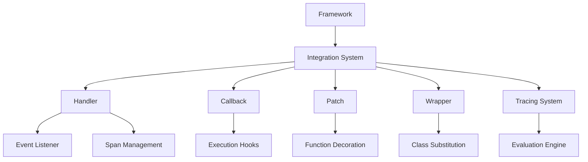
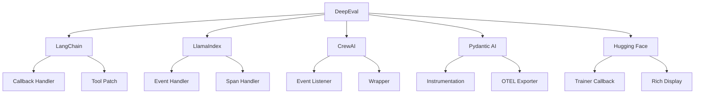
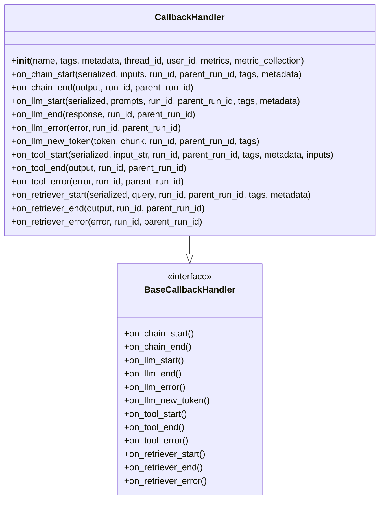
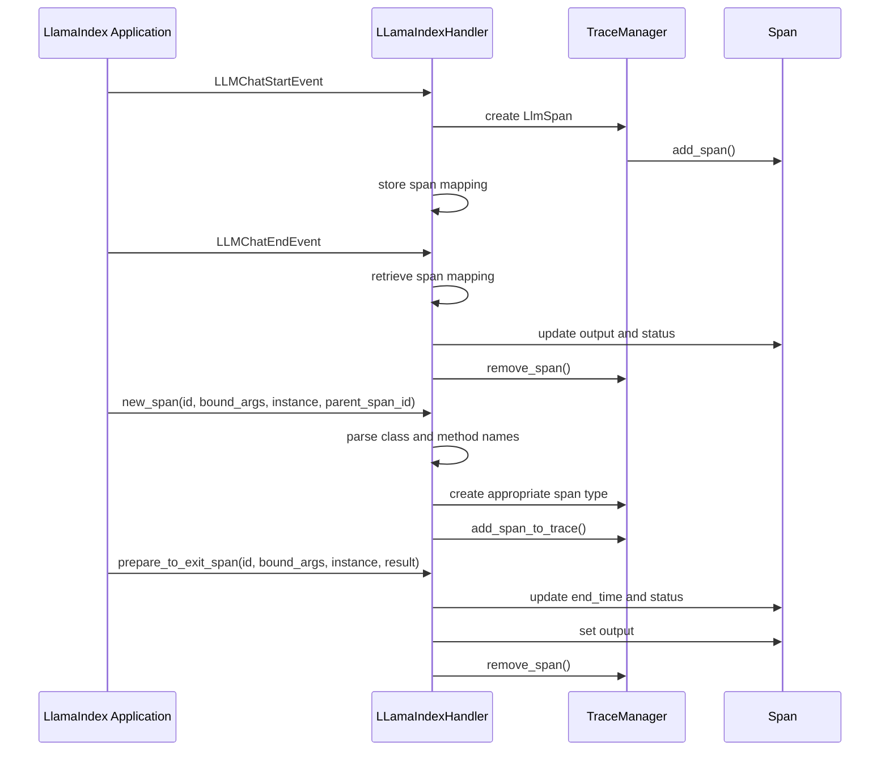
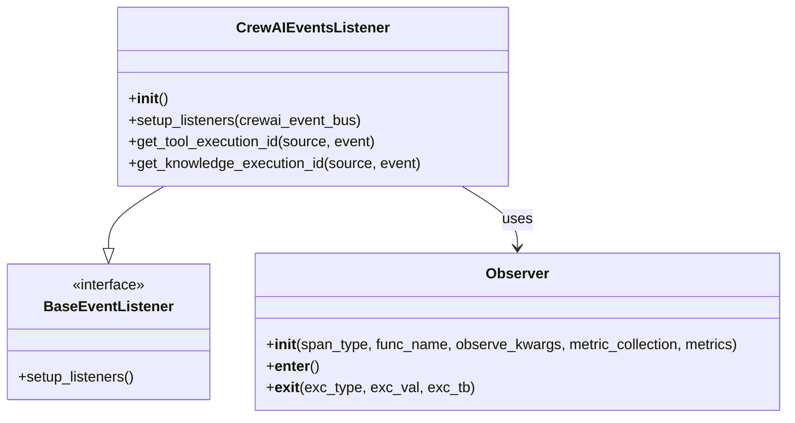
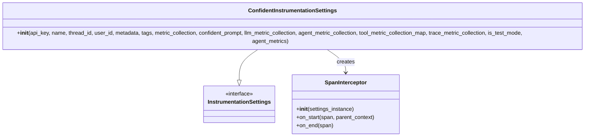
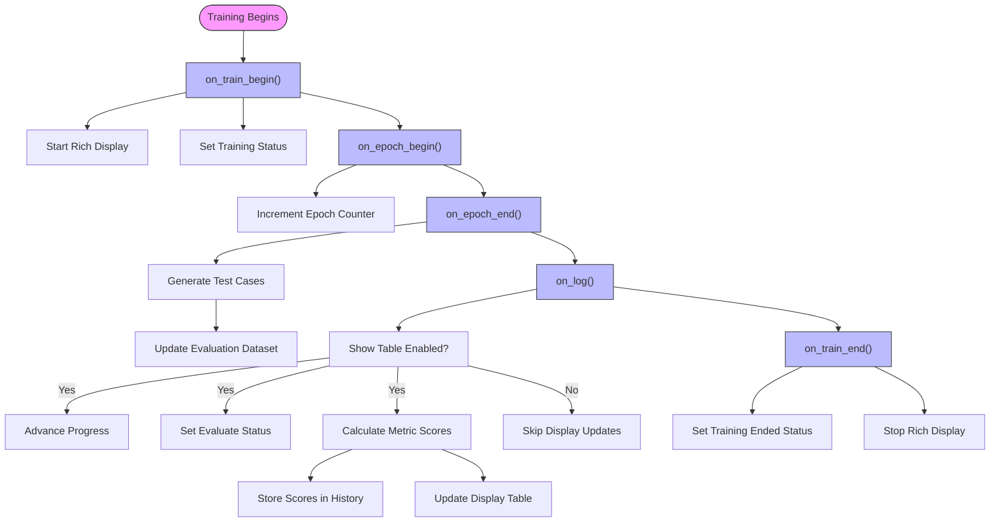
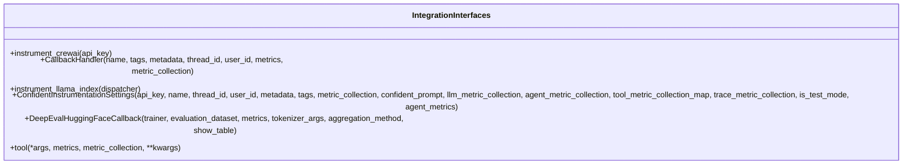
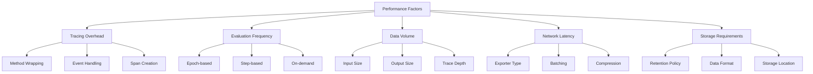

# Framework Integrations

<cite>
**Referenced Files in This Document**   
- [deepeval/integrations/crewai/__init__.py](file://deepeval/integrations/crewai/__init__.py)
- [deepeval/integrations/crewai/handler.py](file://deepeval/integrations/crewai/handler.py)
- [deepeval/integrations/crewai/wrapper.py](file://deepeval/integrations/crewai/wrapper.py)
- [deepeval/integrations/crewai/subs.py](file://deepeval/integrations/crewai/subs.py)
- [deepeval/integrations/langchain/__init__.py](file://deepeval/integrations/langchain/__init__.py)
- [deepeval/integrations/langchain/callback.py](file://deepeval/integrations/langchain/callback.py)
- [deepeval/integrations/langchain/patch.py](file://deepeval/integrations/langchain/patch.py)
- [deepeval/integrations/llama_index/__init__.py](file://deepeval/integrations/llama_index/__init__.py)
- [deepeval/integrations/llama_index/handler.py](file://deepeval/integrations/llama_index/handler.py)
- [deepeval/integrations/pydantic_ai/__init__.py](file://deepeval/integrations/pydantic_ai/__init__.py)
- [deepeval/integrations/pydantic_ai/instrumentator.py](file://deepeval/integrations/pydantic_ai/instrumentator.py)
- [deepeval/integrations/pydantic_ai/otel.py](file://deepeval/integrations/pydantic_ai/otel.py)
- [deepeval/integrations/hugging_face/__init__.py](file://deepeval/integrations/hugging_face/__init__.py)
- [deepeval/integrations/hugging_face/callback.py](file://deepeval/integrations/hugging_face/callback.py)
- [deepeval/integrations/hugging_face/utils.py](file://deepeval/integrations/hugging_face/utils.py)
</cite>

## Table of Contents
1. [Introduction](#introduction)
2. [Integration Architecture](#integration-architecture)
3. [Supported Frameworks](#supported-frameworks)
4. [LangChain Integration](#langchain-integration)
5. [LlamaIndex Integration](#llamaindex-integration)
6. [CrewAI Integration](#crewai-integration)
7. [Pydantic AI Integration](#pydantic-ai-integration)
8. [Hugging Face Integration](#hugging-face-integration)
9. [Public Interfaces](#public-interfaces)
10. [Common Issues and Solutions](#common-issues-and-solutions)
11. [Performance Considerations](#performance-considerations)
12. [Best Practices](#best-practices)

## Introduction

DeepEval provides comprehensive integration capabilities with popular LLM development frameworks, enabling seamless evaluation and monitoring of AI applications. The integration system is designed to connect with various frameworks through specialized adapters that capture execution traces, metrics, and performance data. These integrations allow developers to evaluate their AI systems throughout the development lifecycle, from prototyping to production.

The framework integration system in DeepEval serves as a bridge between AI development frameworks and DeepEval's evaluation capabilities. It enables automatic collection of execution data, including LLM calls, agent workflows, tool usage, and retriever operations. This data is then used to compute various evaluation metrics and generate comprehensive reports on AI system performance.

**Section sources**
- [deepeval/integrations/__init__.py](file://deepeval/integrations/__init__.py)

## Integration Architecture

The DeepEval integration system follows a modular architecture with framework-specific adapters that implement common patterns for data collection and tracing. The architecture is built around several key components: handlers, callbacks, patches, and wrappers that work together to capture execution data without requiring significant changes to existing code.



**Diagram sources**
- [deepeval/integrations/crewai/handler.py](file://deepeval/integrations/crewai/handler.py)
- [deepeval/integrations/langchain/callback.py](file://deepeval/integrations/langchain/callback.py)
- [deepeval/integrations/llama_index/handler.py](file://deepeval/integrations/llama_index/handler.py)

The integration architecture employs several design patterns:

1. **Handler Pattern**: Framework-specific handlers that listen to framework events and translate them into DeepEval tracing spans.
2. **Callback Pattern**: Implementation of framework callback interfaces to hook into execution lifecycles.
3. **Patch Pattern**: Monkey-patching of framework methods to add tracing capabilities.
4. **Wrapper Pattern**: Creating wrapper classes that extend framework components with evaluation features.

Each integration follows a consistent approach of initializing tracing, capturing execution data through framework-specific mechanisms, and forwarding this data to DeepEval's core evaluation engine.

**Section sources**
- [deepeval/integrations/crewai/handler.py](file://deepeval/integrations/crewai/handler.py)
- [deepeval/integrations/langchain/callback.py](file://deepeval/integrations/langchain/callback.py)
- [deepeval/integrations/llama_index/handler.py](file://deepeval/integrations/llama_index/handler.py)

## Supported Frameworks

DeepEval supports integration with several popular LLM development frameworks, each with specialized adapters that leverage the unique features of the target framework. The supported frameworks include LangChain, LlamaIndex, CrewAI, Pydantic AI, and Hugging Face, covering a wide range of AI application development scenarios.



**Diagram sources**
- [deepeval/integrations/__init__.py](file://deepeval/integrations/__init__.py)
- [deepeval/integrations/crewai/__init__.py](file://deepeval/integrations/crewai/__init__.py)
- [deepeval/integrations/langchain/__init__.py](file://deepeval/integrations/langchain/__init__.py)

The integration system is designed to be extensible, allowing for the addition of new framework adapters while maintaining a consistent interface for evaluation. Each framework integration follows the same fundamental principles of execution tracing, data collection, and metric computation, while adapting to the specific architecture and APIs of the target framework.

**Section sources**
- [deepeval/integrations/__init__.py](file://deepeval/integrations/__init__.py)

## LangChain Integration

The LangChain integration in DeepEval provides comprehensive tracing and evaluation capabilities for LangChain applications. It implements a callback handler that integrates with LangChain's callback system to capture execution data from various components including LLMs, chains, tools, and retrievers.



**Diagram sources**
- [deepeval/integrations/langchain/callback.py](file://deepeval/integrations/langchain/callback.py)

The LangChain integration captures detailed information from each component in a LangChain application:

- **LLM Calls**: Input prompts, model information, token usage, and generated responses
- **Chains**: Input parameters, execution flow, and final outputs
- **Tools**: Tool inputs, execution results, and any errors
- **Retrievers**: Query text, retrieved documents, and metadata

The integration also includes a patched version of the `tool` decorator that allows attaching metrics and metric collections to individual tools, enabling granular evaluation of tool performance.

**Section sources**
- [deepeval/integrations/langchain/callback.py](file://deepeval/integrations/langchain/callback.py)
- [deepeval/integrations/langchain/patch.py](file://deepeval/integrations/langchain/patch.py)

## LlamaIndex Integration

The LlamaIndex integration in DeepEval provides comprehensive tracing for LlamaIndex applications through a combined event and span handler. This integration captures execution data from LlamaIndex's instrumentation system, including LLM calls, agent workflows, and tool usage.



**Diagram sources**
- [deepeval/integrations/llama_index/handler.py](file://deepeval/integrations/llama_index/handler.py)

The LlamaIndex integration works by registering a handler with LlamaIndex's instrumentation dispatcher. The handler implements both event handling and span handling interfaces to capture different types of execution data:

- **Event Handling**: Captures high-level events like LLM chat start and end events
- **Span Handling**: Manages the lifecycle of execution spans for various operations

The integration creates different span types based on the operation being performed:
- **LlmSpan**: For LLM calls, capturing input messages, model information, and responses
- **AgentSpan**: For agent workflows, capturing input parameters and execution results
- **ToolSpan**: For tool calls, capturing input arguments and output results
- **BaseSpan**: For other operations, providing general execution tracing

**Section sources**
- [deepeval/integrations/llama_index/handler.py](file://deepeval/integrations/llama_index/handler.py)

## CrewAI Integration

The CrewAI integration in DeepEval provides comprehensive monitoring and evaluation capabilities for multi-agent systems built with CrewAI. The integration uses a combination of event listeners and method wrapping to capture execution data from crews, agents, and tools.



**Diagram sources**
- [deepeval/integrations/crewai/handler.py](file://deepeval/integrations/crewai/handler.py)

The CrewAI integration implements an event listener that subscribes to various CrewAI events:

- **Crew Events**: Crew kickoff start and completion events
- **LLM Events**: LLM call start and completion events
- **Agent Events**: Agent execution start and completion events
- **Tool Events**: Tool usage start and completion events
- **Knowledge Events**: Knowledge retrieval start and completion events

Additionally, the integration provides wrapper functions that monkey-patch CrewAI methods to add tracing capabilities. These wrappers use DeepEval's Observer pattern to create spans for key operations like crew kickoff and agent execution.

The integration also includes a factory function for creating DeepEval-enabled CrewAI classes (Crew, Agent, LLM) that support metrics and metric collection parameters, allowing for granular evaluation configuration at the component level.

**Section sources**
- [deepeval/integrations/crewai/handler.py](file://deepeval/integrations/crewai/handler.py)
- [deepeval/integrations/crewai/wrapper.py](file://deepeval/integrations/crewai/wrapper.py)
- [deepeval/integrations/crewai/subs.py](file://deepeval/integrations/crewai/subs.py)

## Pydantic AI Integration

The Pydantic AI integration in DeepEval provides tracing and evaluation capabilities for applications built with Pydantic AI. The integration uses OpenTelemetry instrumentation to capture execution data from Pydantic AI agents and their components.



**Diagram sources**
- [deepeval/integrations/pydantic_ai/instrumentator.py](file://deepeval/integrations/pydantic_ai/instrumentator.py)

The Pydantic AI integration provides two approaches for instrumentation:

1. **ConfidentInstrumentationSettings**: A modern approach that extends Pydantic AI's InstrumentationSettings to include DeepEval-specific configuration options for metrics, collections, and evaluation settings.

2. **instrument_pydantic_ai**: A legacy function that sets up OpenTelemetry tracing with DeepEval's OTLP exporter, now deprecated in favor of the settings-based approach.

The integration captures data from various components of Pydantic AI applications:
- **Agents**: Agent execution, including inputs, outputs, and state changes
- **LLMs**: Language model calls, including prompts, responses, and token usage
- **Tools**: Tool calls, including input parameters and execution results

The integration also supports test mode execution, where traces are collected in memory rather than being exported to a remote server, facilitating local development and testing.

**Section sources**
- [deepeval/integrations/pydantic_ai/instrumentator.py](file://deepeval/integrations/pydantic_ai/instrumentator.py)
- [deepeval/integrations/pydantic_ai/otel.py](file://deepeval/integrations/pydantic_ai/otel.py)

## Hugging Face Integration

The Hugging Face integration in DeepEval provides evaluation capabilities for models trained with Hugging Face's Transformers library. The integration implements a custom trainer callback that hooks into the training lifecycle to evaluate model performance at various stages.



**Diagram sources**
- [deepeval/integrations/hugging_face/callback.py](file://deepeval/integrations/hugging_face/callback.py)

The Hugging Face integration works by implementing a custom `TrainerCallback` that integrates with Hugging Face's training loop. The callback performs the following operations:

- **Training Monitoring**: Tracks training progress and displays status updates using Rich
- **Test Case Generation**: Generates test cases from the evaluation dataset using the current model
- **Evaluation Execution**: Runs evaluation metrics on generated test cases at the end of each epoch
- **Results Display**: Shows evaluation results in a formatted table alongside training metrics

The integration supports configurable aggregation methods (average, minimum, maximum) for combining metric scores across test cases, and can display results in a rich text interface during training.

**Section sources**
- [deepeval/integrations/hugging_face/callback.py](file://deepeval/integrations/hugging_face/callback.py)
- [deepeval/integrations/hugging_face/utils.py](file://deepeval/integrations/hugging_face/utils.py)

## Public Interfaces

DeepEval provides several public interfaces for configuring and using framework integrations. These interfaces are designed to be intuitive and consistent across different frameworks while accommodating framework-specific requirements.



**Diagram sources**
- [deepeval/integrations/crewai/__init__.py](file://deepeval/integrations/crewai/__init__.py)
- [deepeval/integrations/langchain/__init__.py](file://deepeval/integrations/langchain/__init__.py)
- [deepeval/integrations/llama_index/__init__.py](file://deepeval/integrations/llama_index/__init__.py)
- [deepeval/integrations/pydantic_ai/__init__.py](file://deepeval/integrations/pydantic_ai/__init__.py)
- [deepeval/integrations/hugging_face/__init__.py](file://deepeval/integrations/hugging_face/__init__.py)

The main public interfaces include:

- **Instrumentation Functions**: Top-level functions like `instrument_crewai`, `instrument_llama_index` that set up integration with a framework
- **Handler Classes**: Classes like `CallbackHandler` that implement framework-specific integration logic
- **Settings Classes**: Configuration classes like `ConfidentInstrumentationSettings` that define integration parameters
- **Decorator Functions**: Functions like `tool` that wrap framework components with evaluation capabilities

These interfaces follow a consistent pattern of accepting configuration parameters for tracing, evaluation, and display, while providing sensible defaults for ease of use.

**Section sources**
- [deepeval/integrations/crewai/__init__.py](file://deepeval/integrations/crewai/__init__.py)
- [deepeval/integrations/langchain/__init__.py](file://deepeval/integrations/langchain/__init__.py)
- [deepeval/integrations/llama_index/__init__.py](file://deepeval/integrations/llama_index/__init__.py)
- [deepeval/integrations/pydantic_ai/__init__.py](file://deepeval/integrations/pydantic_ai/__init__.py)
- [deepeval/integrations/hugging_face/__init__.py](file://deepeval/integrations/hugging_face/__init__.py)

## Common Issues and Solutions

When using DeepEval framework integrations, several common issues may arise. Understanding these issues and their solutions can help ensure smooth integration and reliable evaluation results.

**Missing Framework Dependencies**
One common issue is missing framework dependencies. DeepEval uses optional imports to avoid requiring all supported frameworks as dependencies. If a framework is not installed, attempting to use its integration will raise an ImportError.

*Solution*: Install the required framework using pip. For example:
```
pip install crewai
pip install langchain
pip install llama-index
```

**Version Compatibility Issues**
Framework APIs may change between versions, potentially breaking integration functionality.

*Solution*: Check the DeepEval documentation for supported framework versions and ensure compatibility. Use virtual environments to manage framework versions for different projects.

**Configuration Errors**
Incorrect configuration of integration parameters can lead to incomplete or missing evaluation data.

*Solution*: Verify that all required parameters are provided and correctly formatted. Use the framework's documentation to understand parameter requirements and defaults.

**Performance Overhead**
Tracing and evaluation can introduce performance overhead, especially for high-frequency operations.

*Solution*: Use sampling or selective tracing for high-volume operations. Configure evaluation frequency appropriately for your use case.

**Data Privacy Concerns**
Evaluation data may contain sensitive information that should not be transmitted to external services.

*Solution*: Use local evaluation modes when available, or configure data masking and filtering to protect sensitive information.

**Section sources**
- [deepeval/integrations/crewai/handler.py](file://deepeval/integrations/crewai/handler.py)
- [deepeval/integrations/langchain/callback.py](file://deepeval/integrations/langchain/callback.py)
- [deepeval/integrations/llama_index/handler.py](file://deepeval/integrations/llama_index/handler.py)

## Performance Considerations

When integrating DeepEval with various frameworks, several performance considerations should be taken into account to ensure efficient evaluation without significantly impacting application performance.



**Diagram sources**
- [deepeval/integrations/langchain/callback.py](file://deepeval/integrations/langchain/callback.py)
- [deepeval/integrations/llama_index/handler.py](file://deepeval/integrations/llama_index/handler.py)
- [deepeval/integrations/pydantic_ai/instrumentator.py](file://deepeval/integrations/pydantic_ai/instrumentator.py)

Key performance considerations include:

- **Tracing Overhead**: The cost of creating and managing trace spans can impact application performance. This overhead varies by framework and integration method.
- **Evaluation Frequency**: How often evaluation is performed can significantly affect performance. More frequent evaluation provides better insights but increases overhead.
- **Data Volume**: The amount of data collected and transmitted for evaluation affects both performance and storage requirements.
- **Network Latency**: For cloud-based evaluation, network latency can impact the responsiveness of the integration.
- **Storage Requirements**: Evaluation data can accumulate quickly, requiring consideration of storage capacity and retention policies.

To optimize performance, consider using batched exports, sampling strategies, and local evaluation modes when appropriate. Also, be mindful of the depth and breadth of data collection, focusing on the most relevant information for your evaluation goals.

**Section sources**
- [deepeval/integrations/langchain/callback.py](file://deepeval/integrations/langchain/callback.py)
- [deepeval/integrations/llama_index/handler.py](file://deepeval/integrations/llama_index/handler.py)
- [deepeval/integrations/pydantic_ai/instrumentator.py](file://deepeval/integrations/pydantic_ai/instrumentator.py)

## Best Practices

To get the most value from DeepEval framework integrations while maintaining application performance and reliability, follow these best practices:

**1. Selective Integration**
Integrate DeepEval only with components that require evaluation. Avoid instrumenting every component, as this can lead to excessive data collection and performance overhead.

**2. Appropriate Evaluation Frequency**
Configure evaluation frequency based on your needs. For development, more frequent evaluation may be beneficial. For production, less frequent evaluation may be sufficient.

**3. Meaningful Metrics Selection**
Choose metrics that are relevant to your application's goals and user experience. Avoid collecting metrics that don't provide actionable insights.

**4. Data Privacy and Security**
Be mindful of data privacy when collecting evaluation data. Implement data masking or filtering for sensitive information, and comply with relevant data protection regulations.

**5. Performance Monitoring**
Monitor the performance impact of DeepEval integration on your application. Use profiling tools to identify any performance bottlenecks introduced by the integration.

**6. Version Compatibility Management**
Maintain clear documentation of framework and DeepEval version compatibility. Use dependency management tools to ensure consistent versions across development and production environments.

**7. Error Handling and Resilience**
Implement robust error handling for integration failures. Ensure that evaluation system failures do not impact the core functionality of your application.

**8. Regular Review and Optimization**
Regularly review your evaluation setup and optimize it based on usage patterns and changing requirements. Remove unused metrics and adjust collection frequency as needed.

Following these best practices will help ensure that DeepEval integrations provide valuable insights while maintaining application performance and reliability.

**Section sources**
- [deepeval/integrations/crewai/handler.py](file://deepeval/integrations/crewai/handler.py)
- [deepeval/integrations/langchain/callback.py](file://deepeval/integrations/langchain/callback.py)
- [deepeval/integrations/llama_index/handler.py](file://deepeval/integrations/llama_index/handler.py)