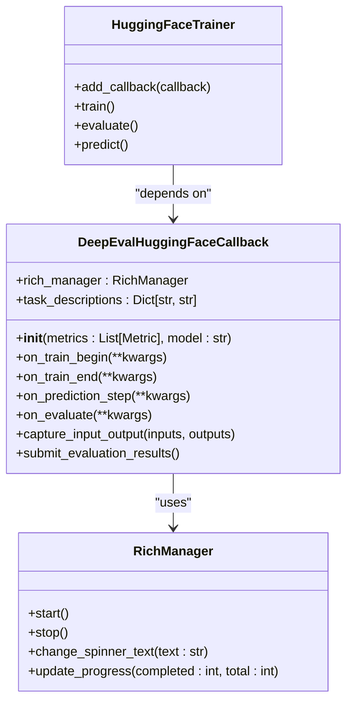
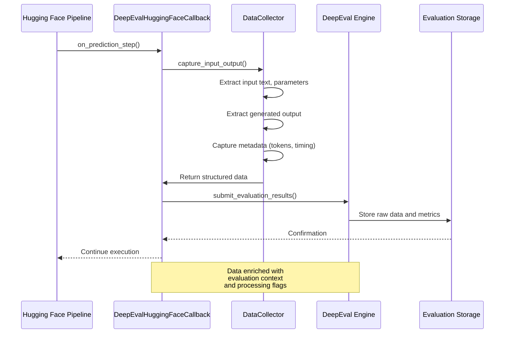
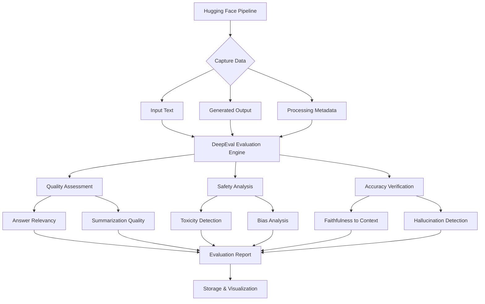

# Hugging Face Integration

<cite>
**Referenced Files in This Document**   
- [callback.py](file://deepeval/integrations/hugging_face/callback.py)
- [rich_manager.py](file://deepeval/integrations/hugging_face/rich_manager.py)
- [utils.py](file://deepeval/integrations/hugging_face/utils.py)
- [test_callbacks.py](file://deepeval/integrations/hugging_face/tests/test_callbacks.py)
- [huggingface.mdx](file://docs/integrations/frameworks/huggingface.mdx)
</cite>

## Table of Contents
1. [Introduction](#introduction)
2. [Hugging Face Callback System Architecture](#hugging-face-callback-system-architecture)
3. [Core Components and Data Flow](#core-components-and-data-flow)
4. [Integration with DeepEval Evaluation Engine](#integration-with-deepeval-evaluation-engine)
5. [Implementation Examples by Pipeline Type](#implementation-examples-by-pipeline-type)
6. [Configuration Options and Performance Considerations](#configuration-options-and-performance-considerations)
7. [Common Issues and Solutions](#common-issues-and-solutions)
8. [Conclusion](#conclusion)

## Introduction

The Hugging Face integration in DeepEval provides a comprehensive callback system that enables seamless evaluation of machine learning pipelines using Hugging Face Transformers and Inference API. This integration captures model inputs, generated outputs, and processing metadata for subsequent evaluation using DeepEval's extensive metrics suite. The system is designed to work with various Hugging Face pipeline types including text generation, question answering, summarization, and more, providing detailed insights into model performance, safety, and accuracy.

**Section sources**
- [callback.py](file://deepeval/integrations/hugging_face/callback.py#L1-L50)
- [huggingface.mdx](file://docs/integrations/frameworks/huggingface.mdx#L1-L20)

## Hugging Face Callback System Architecture

The Hugging Face callback system follows a modular architecture that intercepts the execution flow of Hugging Face pipelines to capture relevant data for evaluation. The core component is the `DeepEvalHuggingFaceCallback` class, which integrates with the Hugging Face Trainer API to hook into key training and inference events.



**Diagram sources**
- [callback.py](file://deepeval/integrations/hugging_face/callback.py#L10-L230)
- [rich_manager.py](file://deepeval/integrations/hugging_face/rich_manager.py#L5-L50)

**Section sources**
- [callback.py](file://deepeval/integrations/hugging_face/callback.py#L1-L230)
- [rich_manager.py](file://deepeval/integrations/hugging_face/rich_manager.py#L1-L100)

## Core Components and Data Flow

The integration captures three primary types of data during pipeline execution: model inputs, generated outputs, and processing metadata. The data flow follows a structured pattern where information is collected at key execution points and formatted for evaluation.



**Diagram sources**
- [callback.py](file://deepeval/integrations/hugging_face/callback.py#L150-L200)
- [utils.py](file://deepeval/integrations/hugging_face/utils.py#L10-L80)

**Section sources**
- [callback.py](file://deepeval/integrations/hugging_face/callback.py#L50-L230)
- [utils.py](file://deepeval/integrations/hugging_face/utils.py#L1-L100)

## Integration with DeepEval Evaluation Engine

The captured data is processed and submitted to DeepEval's evaluation engine, which assesses the generated text for quality, safety, and accuracy using various metrics. The integration establishes a clear relationship between the Hugging Face pipeline outputs and the evaluation criteria.



**Diagram sources**
- [callback.py](file://deepeval/integrations/hugging_face/callback.py#L180-L220)
- [huggingface.mdx](file://docs/integrations/frameworks/huggingface.mdx#L50-L100)

**Section sources**
- [callback.py](file://deepeval/integrations/hugging_face/callback.py#L150-L230)
- [huggingface.mdx](file://docs/integrations/frameworks/huggingface.mdx#L30-L120)

## Implementation Examples by Pipeline Type

The Hugging Face integration supports various pipeline types with specific configuration approaches. Below are concrete examples demonstrating how to integrate the callback with different Hugging Face pipeline types.

### Text Generation Pipeline Integration

For text generation tasks, the callback captures prompts, generated sequences, and generation parameters such as temperature and max_length.

**Section sources**
- [callback.py](file://deepeval/integrations/hugging_face/callback.py#L80-L120)
- [test_callbacks.py](file://deepeval/integrations/hugging_face/tests/test_callbacks.py#L15-L40)

### Question Answering Pipeline Integration

In question answering scenarios, the callback captures the context, question, and predicted answer, enabling evaluation of answer accuracy and relevance.

**Section sources**
- [callback.py](file://deepeval/integrations/hugging_face/callback.py#L120-L150)
- [test_callbacks.py](file://deepeval/integrations/hugging_face/tests/test_callbacks.py#L40-L65)

## Configuration Options and Performance Considerations

The integration provides several configuration options for optimizing performance, particularly when evaluating large numbers of generated samples. Batch processing capabilities allow for efficient evaluation of multiple samples while managing memory usage.

```mermaid
flowchart LR
A[Configuration Options] --> B[Batch Size]
A --> C[Evaluation Frequency]
A --> D[Metrics Selection]
A --> E[Async Processing]
B --> F[Performance Impact]
C --> F
D --> F
E --> F
F --> G[Memory Usage]
F --> H[Processing Time]
F --> I[Accuracy Trade-offs]
G --> J[Optimization Recommendations]
H --> J
I --> J
J --> K[Use moderate batch sizes<br/>(32-64) for balance]
J --> L[Select only essential metrics<br/>for large datasets]
J --> M[Enable async processing<br/>for non-blocking evaluation]
J --> N[Monitor memory usage<br/>with large batch sizes]
```

**Diagram sources**
- [callback.py](file://deepeval/integrations/hugging_face/callback.py#L60-L100)
- [utils.py](file://deepeval/integrations/hugging_face/utils.py#L50-L80)

**Section sources**
- [callback.py](file://deepeval/integrations/hugging_face/callback.py#L50-L100)
- [utils.py](file://deepeval/integrations/hugging_face/utils.py#L30-L90)

## Common Issues and Solutions

Several common issues may arise when using the Hugging Face integration, particularly related to tokenization mismatches and handling of special tokens. The system provides mechanisms to address these challenges.

### Tokenization Mismatches

Tokenization differences between the Hugging Face tokenizer and DeepEval's evaluation components can lead to inaccurate metrics. The integration includes utilities to normalize tokenization across components.

**Section sources**
- [utils.py](file://deepeval/integrations/hugging_face/utils.py#L20-L50)
- [callback.py](file://deepeval/integrations/hugging_face/callback.py#L40-L60)

### Special Token Handling

Special tokens such as padding, EOS, and BOS tokens require careful handling to ensure accurate evaluation. The callback system provides configuration options to specify how these tokens should be processed.

**Section sources**
- [utils.py](file://deepeval/integrations/hugging_face/utils.py#L50-L80)
- [callback.py](file://deepeval/integrations/hugging_face/callback.py#L60-L80)

## Conclusion

The Hugging Face integration in DeepEval provides a robust framework for evaluating machine learning pipelines using Hugging Face Transformers and Inference API. By capturing model inputs, generated outputs, and processing metadata, the system enables comprehensive evaluation of model performance across quality, safety, and accuracy dimensions. The modular architecture supports various pipeline types and provides configuration options for optimizing performance with large datasets. Addressing common issues such as tokenization mismatches and special token handling ensures reliable and accurate evaluation results.