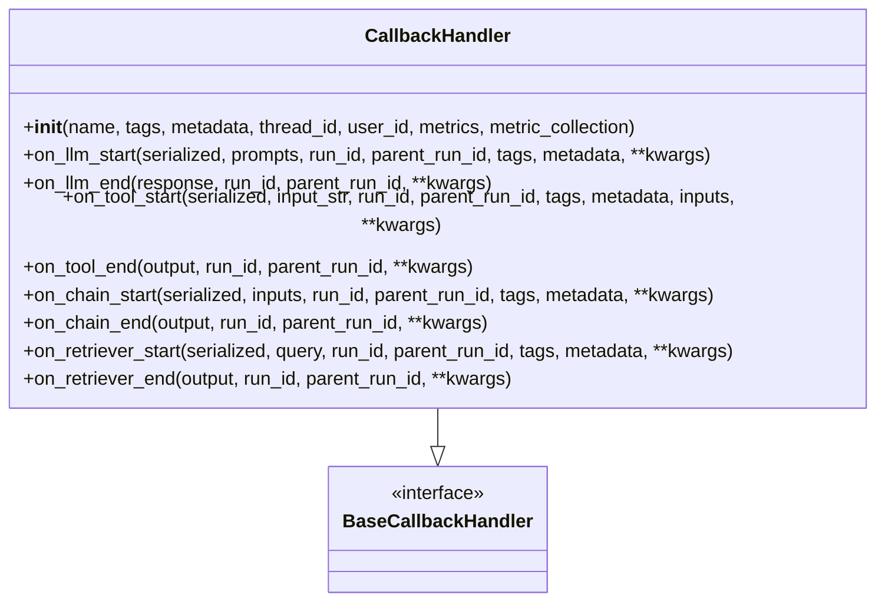
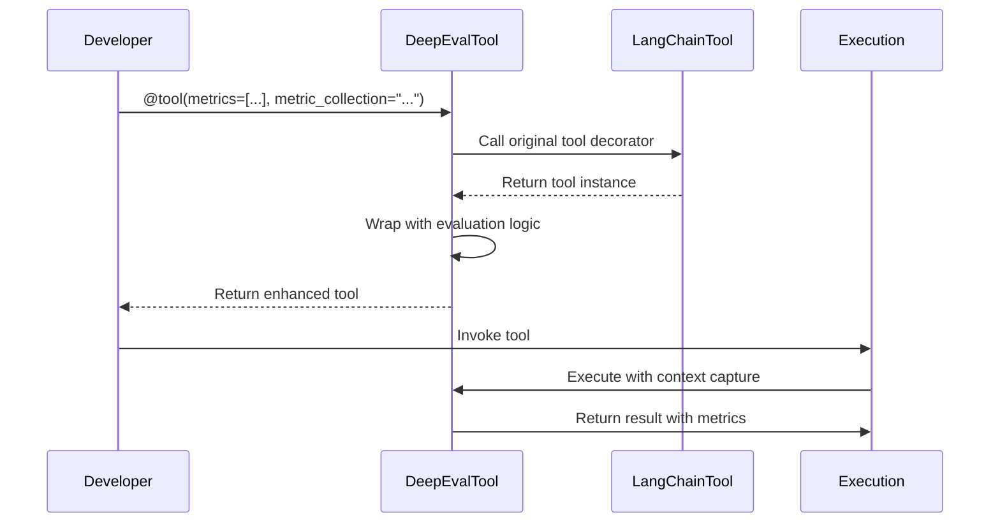
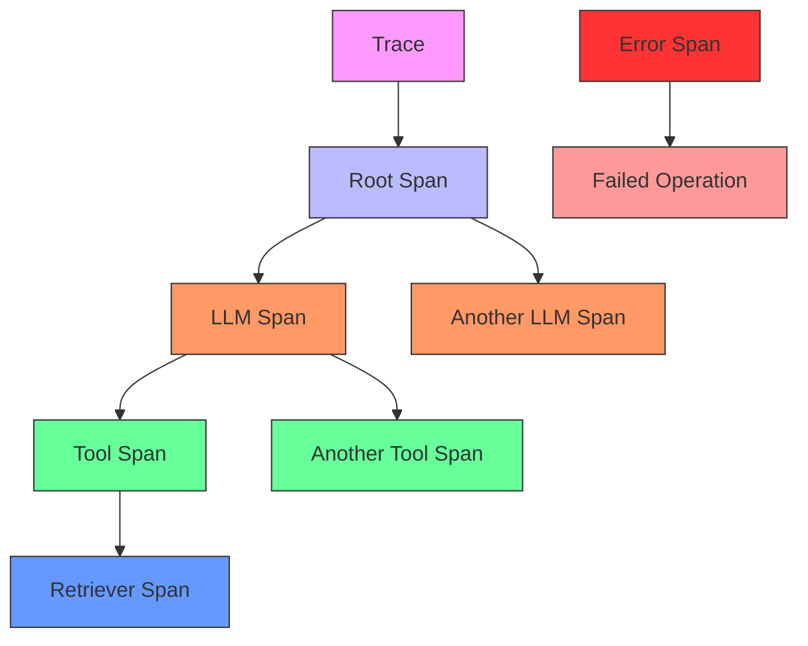
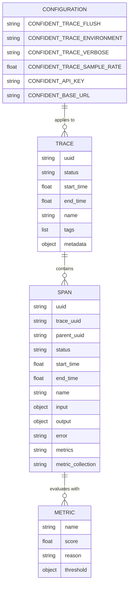
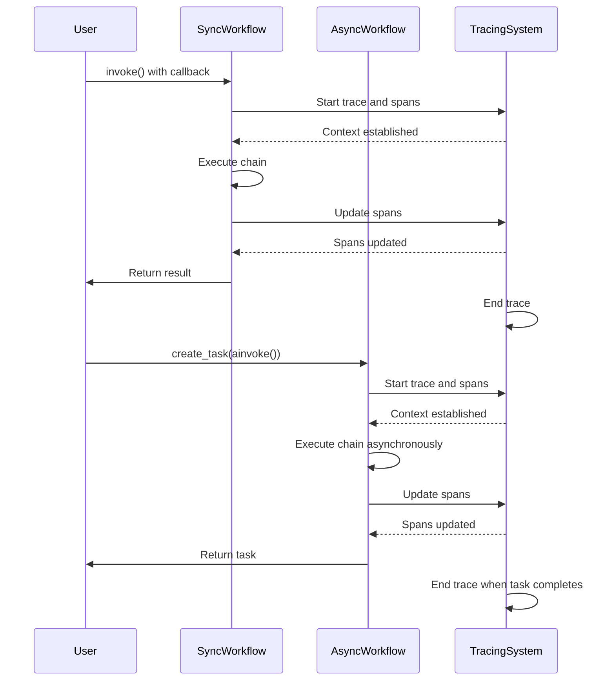
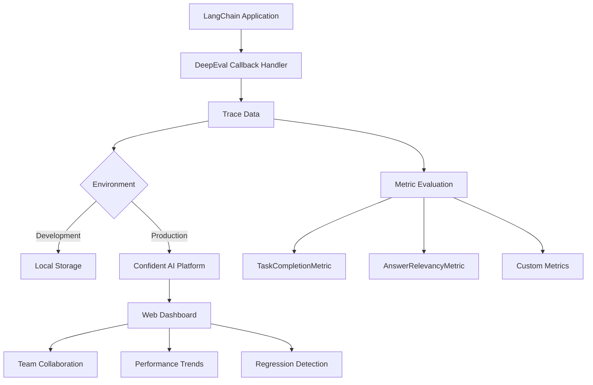
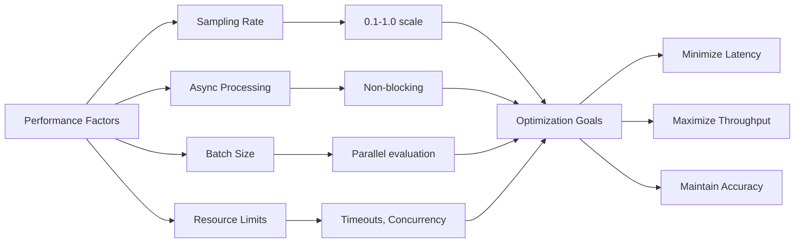
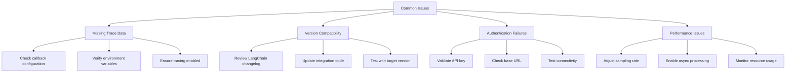
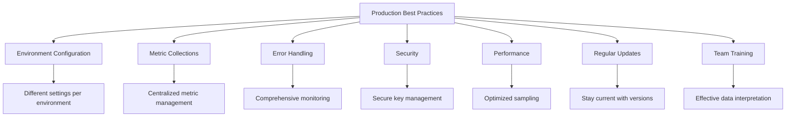

# LangChain Integration

<cite>
**Referenced Files in This Document**   
- [callback.py](file://deepeval/integrations/langchain/callback.py)
- [patch.py](file://deepeval/integrations/langchain/patch.py)
- [utils.py](file://deepeval/integrations/langchain/utils.py)
- [types.py](file://deepeval/tracing/types.py)
- [tracing.py](file://deepeval/tracing/tracing.py)
- [context.py](file://deepeval/tracing/context.py)
- [settings.py](file://deepeval/config/settings.py)
- [langchain.mdx](file://docs/integrations/frameworks/langchain.mdx)
</cite>

## Table of Contents
1. [Introduction](#introduction)
2. [Callback Handler Implementation](#callback-handler-implementation)
3. [Patching Mechanism for Tools](#patching-mechanism-for-tools)
4. [Span and Trace Management](#span-and-trace-management)
5. [Configuration and Environment Settings](#configuration-and-environment-settings)
6. [Synchronous and Asynchronous Workflows](#synchronous-and-asynchronous-workflows)
7. [Integration with Confident AI Platform](#integration-with-confident-ai-platform)
8. [Performance Considerations](#performance-considerations)
9. [Troubleshooting Common Issues](#troubleshooting-common-issues)
10. [Best Practices for Production](#best-practices-for-production)

## Introduction
The LangChain integration in DeepEval enables comprehensive evaluation of LangChain applications by capturing LLM calls, tool usage, and chain execution through a callback handler system. This integration allows developers to trace and evaluate their AI workflows end-to-end, providing insights into model behavior, tool interactions, and overall system performance. The implementation leverages DeepEval's tracing infrastructure to create detailed evaluation traces that can be analyzed and visualized.

**Section sources**
- [langchain.mdx](file://docs/integrations/frameworks/langchain.mdx#L1-L185)

## Callback Handler Implementation

The `DeepEvalCallbackHandler` (implemented as `CallbackHandler` in the codebase) is the core component that enables integration with LangChain applications. This handler captures various events during the execution of LangChain workflows, including LLM calls, tool invocations, and chain operations.

The callback handler is designed to work with LangChain's callback system, implementing the `BaseCallbackHandler` interface. It captures different types of events through specific callback methods:

- `on_llm_start` and `on_llm_end`: Capture LLM invocation details including prompts, models, and responses
- `on_tool_start` and `on_tool_end`: Track tool usage with inputs and outputs
- `on_chain_start` and `on_chain_end`: Monitor chain execution flow
- `on_retriever_start` and `on_retriever_end`: Capture retriever operations

The handler creates spans for each operation, storing relevant metadata such as input prompts, model names, token usage, and tool parameters. These spans are organized hierarchically within a trace, preserving the execution context and relationships between different components of the workflow.



**Diagram sources**
- [callback.py](file://deepeval/integrations/langchain/callback.py#L53-L371)

**Section sources**
- [callback.py](file://deepeval/integrations/langchain/callback.py#L53-L371)

## Patching Mechanism for Tools

The patching mechanism in DeepEval's LangChain integration allows for enhanced tool instrumentation by wrapping LangChain's native tool decorators. This enables the capture of additional metadata and metrics for tool executions.

The `tool` decorator in `patch.py` intercepts the creation of LangChain tools, allowing DeepEval to inject evaluation capabilities. When a function is decorated with `@tool`, DeepEval's wrapper captures metrics and configuration that will be associated with the tool's execution span.

The patching mechanism works by:
1. Intercepting the original `langchain_core.tools.tool` decorator
2. Creating a wrapper function that preserves the original functionality
3. Injecting DeepEval-specific metadata and metrics configuration
4. Returning the enhanced tool instance

This approach allows developers to use familiar LangChain patterns while gaining the benefits of DeepEval's evaluation capabilities. The patched tool decorator supports configuration of metrics and metric collections, enabling targeted evaluation of specific tool behaviors.



**Diagram sources**
- [patch.py](file://deepeval/integrations/langchain/patch.py#L8-L44)
- [callback.py](file://deepeval/integrations/langchain/callback.py#L241-L275)

**Section sources**
- [patch.py](file://deepeval/integrations/langchain/patch.py#L8-L44)
- [callback.py](file://deepeval/integrations/langchain/callback.py#L241-L275)

## Span and Trace Management

DeepEval's tracing infrastructure provides a comprehensive system for managing spans and traces during LangChain execution. The system creates a hierarchical structure that captures the complete execution flow of AI applications.

Spans represent individual operations within the workflow, such as LLM calls, tool executions, or retriever queries. Each span contains metadata about the operation, including:
- Input and output data
- Execution timing
- Status (success or error)
- Associated metrics
- Token usage and costs
- Contextual information

Traces represent the complete execution context, containing a collection of related spans. The trace maintains overall metadata such as:
- Trace UUID and status
- Root spans and their hierarchy
- Global metrics and configurations
- User and session information

The context management system uses Python's `contextvars` to maintain the current span and trace throughout the execution flow. This ensures that child operations are properly nested within their parent contexts, preserving the execution hierarchy.



**Diagram sources**
- [types.py](file://deepeval/tracing/types.py#L34-L194)
- [tracing.py](file://deepeval/tracing/tracing.py#L81-L794)
- [context.py](file://deepeval/tracing/context.py#L1-L159)

**Section sources**
- [types.py](file://deepeval/tracing/types.py#L34-L194)
- [tracing.py](file://deepeval/tracing/tracing.py#L81-L794)
- [context.py](file://deepeval/tracing/context.py#L1-L159)

## Configuration and Environment Settings

The LangChain integration can be configured through environment variables and direct parameters to control tracing behavior, sampling rates, and output destinations. These settings allow fine-tuning of the evaluation process for different environments and use cases.

Key configuration options include:

- `CONFIDENT_TRACE_FLUSH`: Controls whether traces are flushed synchronously (1) or asynchronously (0)
- `CONFIDENT_TRACE_ENVIRONMENT`: Specifies the environment context (development, staging, production)
- `CONFIDENT_TRACE_VERBOSE`: Enables detailed logging of trace operations
- `CONFIDENT_TRACE_SAMPLE_RATE`: Sets the sampling rate for trace collection (0.0 to 1.0)
- `CONFIDENT_API_KEY`: Authentication key for the Confident AI platform

These settings can be configured either through environment variables or programmatically when initializing the callback handler. The configuration system provides flexibility for different deployment scenarios, from development debugging to production monitoring.



**Diagram sources**
- [settings.py](file://deepeval/config/settings.py#L245-L800)
- [constants.py](file://deepeval/constants.py#L1-L49)

**Section sources**
- [settings.py](file://deepeval/config/settings.py#L245-L800)
- [constants.py](file://deepeval/constants.py#L1-L49)

## Synchronous and Asynchronous Workflows

The LangChain integration supports both synchronous and asynchronous execution patterns, allowing developers to evaluate their applications regardless of the execution model.

For synchronous workflows, the callback handler is passed directly to the LangChain executor's `invoke` method:

```python
agent_executor.invoke(
    {"input": golden.input},
    config={"callbacks": [CallbackHandler(metrics=[TaskCompletionMetric()])]}
)
```

For asynchronous workflows, the integration works with `ainvoke` and asyncio task management:

```python
task = asyncio.create_task(
    agent_executor.ainvoke(
        {"input": golden.input},
        config={"callbacks": [CallbackHandler(metrics=[TaskCompletionMetric()])]}
    )
)
dataset.evaluate(task)
```

The tracing system automatically handles the context management for both execution models, ensuring that spans are properly created and linked regardless of whether the operations are synchronous or asynchronous. This allows for consistent evaluation across different implementation patterns.



**Diagram sources**
- [langchain.mdx](file://docs/integrations/frameworks/langchain.mdx#L74-L117)
- [callback.py](file://deepeval/integrations/langchain/callback.py#L53-L371)

**Section sources**
- [langchain.mdx](file://docs/integrations/frameworks/langchain.mdx#L74-L117)

## Integration with Confident AI Platform

The LangChain integration seamlessly connects with the Confident AI platform for trace visualization, analysis, and collaboration. This integration enables teams to share evaluation results, track performance over time, and identify areas for improvement.

To connect with the Confident AI platform, users authenticate with their API key and configure the integration to send traces to the appropriate environment. The platform provides a web interface for exploring traces, viewing metrics, and comparing different model versions or prompt variations.

The integration supports both manual metric specification and metric collections:
- Individual metrics can be passed directly to the callback handler
- Metric collections can be referenced by name, allowing centralized configuration in the Confident AI platform

This flexibility enables different evaluation strategies, from targeted testing of specific behaviors to comprehensive assessment of overall system performance.



**Diagram sources**
- [langchain.mdx](file://docs/integrations/frameworks/langchain.mdx#L171-L184)
- [tracing.py](file://deepeval/tracing/tracing.py#L383-L549)

**Section sources**
- [langchain.mdx](file://docs/integrations/frameworks/langchain.mdx#L171-L184)

## Performance Considerations

When running evaluations at scale, several performance considerations should be addressed to ensure efficient operation and minimal impact on application performance.

Key performance factors include:

- **Sampling rate**: Adjusting `CONFIDENT_TRACE_SAMPLE_RATE` to balance data collection with performance overhead
- **Asynchronous processing**: Using asynchronous workflows to prevent blocking of main application threads
- **Batch processing**: Evaluating multiple inputs in parallel to improve throughput
- **Resource management**: Configuring appropriate timeouts and concurrency limits

The tracing system is designed to minimize performance impact by:
- Using asynchronous queue processing for trace submission
- Implementing configurable sampling to reduce data volume
- Providing options for synchronous vs. asynchronous trace flushing
- Optimizing data serialization and transmission

For high-throughput production environments, it's recommended to use lower sampling rates and asynchronous processing to maintain application responsiveness while still collecting valuable evaluation data.



**Diagram sources**
- [settings.py](file://deepeval/config/settings.py#L464-L468)
- [tracing.py](file://deepeval/tracing/tracing.py#L383-L549)

**Section sources**
- [settings.py](file://deepeval/config/settings.py#L464-L468)

## Troubleshooting Common Issues

Several common issues may arise when implementing the LangChain integration, along with their solutions:

**Missing trace data**: This can occur due to incorrect callback configuration or environment settings. Ensure that:
- The callback handler is properly passed to the LangChain executor
- Required environment variables are set (especially API keys)
- Tracing is enabled in the configuration

**Compatibility with different LangChain versions**: The integration may require updates to work with newer LangChain versions. Check for:
- Changes in callback handler interfaces
- Updates to span and trace data structures
- Modifications to tool and chain execution patterns

**Authentication failures**: When connecting to the Confident AI platform:
- Verify the API key is correctly configured
- Check that the base URL is accessible
- Ensure network connectivity and firewall rules allow the connection

**Performance degradation**: If the integration impacts application performance:
- Adjust the sampling rate to reduce data volume
- Enable asynchronous trace processing
- Monitor resource usage and adjust concurrency settings

These issues can typically be resolved by reviewing the configuration settings, checking the verbose logging output, and consulting the integration documentation for version-specific requirements.



**Diagram sources**
- [langchain.mdx](file://docs/integrations/frameworks/langchain.mdx#L70-L72)
- [settings.py](file://deepeval/config/settings.py#L464-L468)

**Section sources**
- [langchain.mdx](file://docs/integrations/frameworks/langchain.mdx#L70-L72)

## Best Practices for Production

When deploying the LangChain integration in production environments, several best practices should be followed to ensure reliable and effective evaluation:

1. **Environment-specific configuration**: Use different settings for development, staging, and production environments, adjusting sampling rates and verbosity accordingly.

2. **Metric collection management**: Define and maintain metric collections in the Confident AI platform rather than hardcoding individual metrics in the application.

3. **Error handling and monitoring**: Implement comprehensive error handling for the integration and monitor its performance to detect issues early.

4. **Security considerations**: Protect API keys and sensitive data through proper environment variable management and access controls.

5. **Performance optimization**: Configure appropriate sampling rates and asynchronous processing to minimize impact on application performance.

6. **Regular updates**: Keep the integration updated with the latest LangChain and DeepEval versions to ensure compatibility and access to new features.

7. **Documentation and training**: Ensure team members understand how to interpret evaluation results and use the data to improve the AI system.

Following these practices helps ensure that the evaluation system provides valuable insights without compromising application reliability or performance.



**Diagram sources**
- [langchain.mdx](file://docs/integrations/frameworks/langchain.mdx#L171-L184)
- [settings.py](file://deepeval/config/settings.py#L464-L468)

**Section sources**
- [langchain.mdx](file://docs/integrations/frameworks/langchain.mdx#L171-L184)