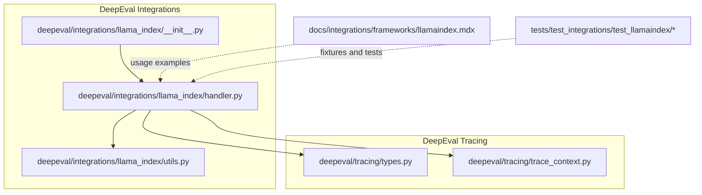
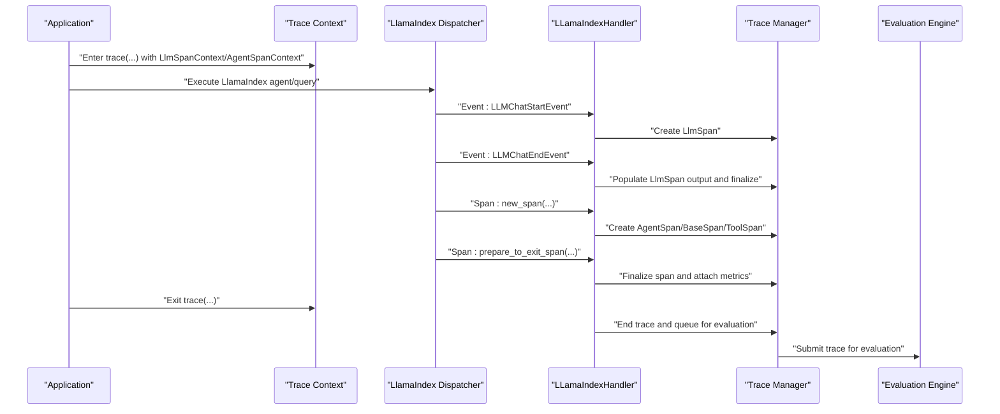
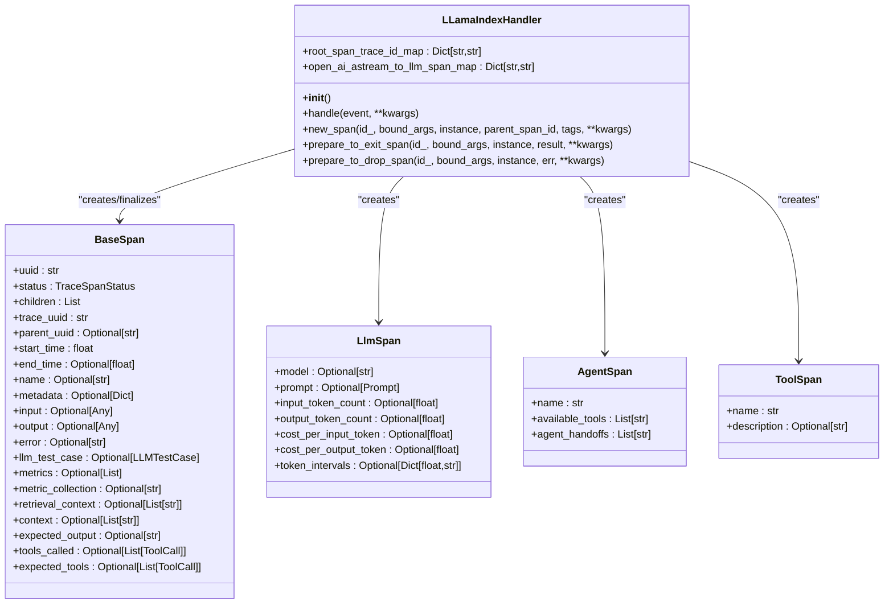
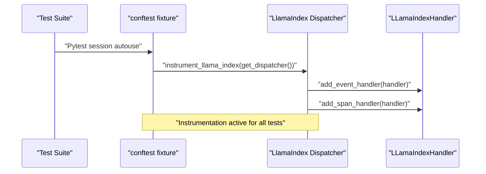
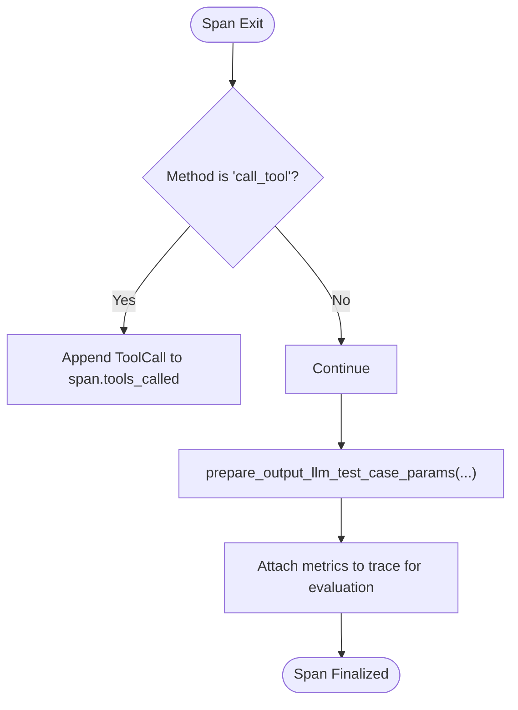
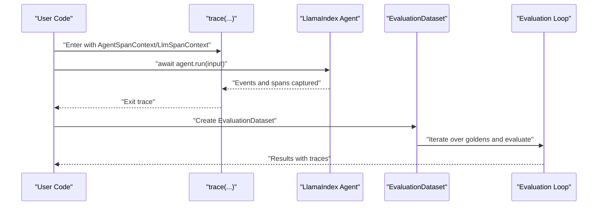
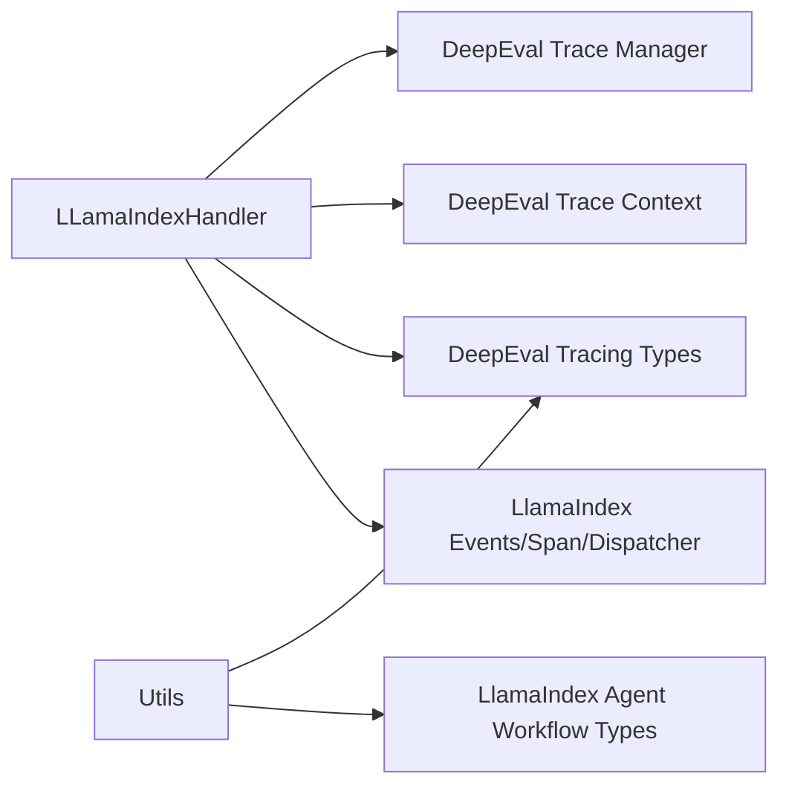

# LlamaIndex Integration

<cite>
**Referenced Files in This Document**
- [handler.py](file://deepeval/integrations/llama_index/handler.py)
- [utils.py](file://deepeval/integrations/llama_index/utils.py)
- [__init__.py](file://deepeval/integrations/llama_index/__init__.py)
- [types.py](file://deepeval/tracing/types.py)
- [trace_context.py](file://deepeval/tracing/trace_context.py)
- [llamaindex.mdx](file://docs/integrations/frameworks/llamaindex.mdx)
- [test_llama_index.py](file://tests/test_integrations/test_llamaindex/test_llama_index.py)
- [conftest.py](file://tests/test_integrations/test_llamaindex/conftest.py)
- [test_tool_call.py](file://tests/test_integrations/test_llamaindex/test_tool_call.py)
- [utils.py](file://tests/test_integrations/utils.py)
</cite>

## Table of Contents
1. [Introduction](#introduction)
2. [Project Structure](#project-structure)
3. [Core Components](#core-components)
4. [Architecture Overview](#architecture-overview)
5. [Detailed Component Analysis](#detailed-component-analysis)
6. [Dependency Analysis](#dependency-analysis)
7. [Performance Considerations](#performance-considerations)
8. [Troubleshooting Guide](#troubleshooting-guide)
9. [Conclusion](#conclusion)
10. [Appendices](#appendices)

## Introduction
This document explains the LlamaIndex integration within DeepEval. It focuses on the LlamaIndexCallbackHandler (implemented as LLamaIndexHandler) and how it captures LlamaIndex events to feed DeepEval’s tracing system. The integration enables component-level evaluation of Retrieval-Augmented Generation (RAG) pipelines built with LlamaIndex, extracting inputs, contexts, and outputs for metric computation. It covers registration patterns for simple queries and multi-step reasoning chains, the data flow from LlamaIndex components to DeepEval’s evaluation engine, and practical guidance for selective tracing and performance optimization.

## Project Structure
The LlamaIndex integration is implemented under the integrations module and leverages DeepEval’s tracing infrastructure. Key files:
- Integration entry and handler: deepeval/integrations/llama_index/
- Tracing types and contexts: deepeval/tracing/
- Documentation and examples: docs/integrations/frameworks/llamaindex.mdx
- Tests and fixtures: tests/test_integrations/test_llamaindex/

**Diagram sources**
- [handler.py](file://deepeval/integrations/llama_index/handler.py#L1-L302)
- [utils.py](file://deepeval/integrations/llama_index/utils.py#L1-L108)
- [__init__.py](file://deepeval/integrations/llama_index/__init__.py#L1-L7)
- [types.py](file://deepeval/tracing/types.py#L1-L194)
- [trace_context.py](file://deepeval/tracing/trace_context.py#L1-L108)
- [llamaindex.mdx](file://docs/integrations/frameworks/llamaindex.mdx#L1-L127)
- [test_llama_index.py](file://tests/test_integrations/test_llamaindex/test_llama_index.py#L1-L62)
- [conftest.py](file://tests/test_integrations/test_llamaindex/conftest.py#L1-L15)
- [test_tool_call.py](file://tests/test_integrations/test_llamaindex/test_tool_call.py#L1-L42)

**Section sources**
- [handler.py](file://deepeval/integrations/llama_index/handler.py#L1-L302)
- [utils.py](file://deepeval/integrations/llama_index/utils.py#L1-L108)
- [__init__.py](file://deepeval/integrations/llama_index/__init__.py#L1-L7)
- [types.py](file://deepeval/tracing/types.py#L1-L194)
- [trace_context.py](file://deepeval/tracing/trace_context.py#L1-L108)
- [llamaindex.mdx](file://docs/integrations/frameworks/llamaindex.mdx#L1-L127)
- [test_llama_index.py](file://tests/test_integrations/test_llamaindex/test_llama_index.py#L1-L62)
- [conftest.py](file://tests/test_integrations/test_llamaindex/conftest.py#L1-L15)
- [test_tool_call.py](file://tests/test_integrations/test_llamaindex/test_tool_call.py#L1-L42)

## Core Components
- LLamaIndexHandler: Implements both event and span handlers to capture LLM chat events and method-level spans. It creates LlmSpan, AgentSpan, ToolSpan, and BaseSpan instances and manages their lifecycle with trace_manager.
- LlamaIndexCallbackHandler: Alias for instrument_llama_index, which registers the LLamaIndexHandler with the LlamaIndex dispatcher.
- Utilities: parse_id, prepare_input_llm_test_case_params, prepare_output_llm_test_case_params, extract_output_from_llm_chat_end_event.
- Tracing Types: BaseSpan, LlmSpan, AgentSpan, ToolSpan, RetrieverSpan, Trace, and related enums/statuses.
- Trace Context: LlmSpanContext and AgentSpanContext define the evaluation context propagated via contextvars during tracing.

Key responsibilities:
- Event handling: Capture LLMChatStartEvent and LLMChatEndEvent to build LlmSpan entries with inputs and outputs.
- Span handling: Track method-level spans for agent runs, tool calls, and workflow roots; attach LLM test case metadata when applicable.
- Integration: Register with LlamaIndex dispatcher so that instrumentation events are captured.

**Section sources**
- [handler.py](file://deepeval/integrations/llama_index/handler.py#L62-L301)
- [utils.py](file://deepeval/integrations/llama_index/utils.py#L1-L108)
- [types.py](file://deepeval/tracing/types.py#L1-L194)
- [trace_context.py](file://deepeval/tracing/trace_context.py#L1-L108)

## Architecture Overview
The integration bridges LlamaIndex instrumentation events to DeepEval’s tracing system. The flow:
- Application code sets up tracing contexts (LlmSpanContext or AgentSpanContext) and executes LlamaIndex components.
- LlamaIndex instrumentation emits events and span lifecycle callbacks.
- LLamaIndexHandler translates these into DeepEval spans and attaches them to traces.
- Metrics configured in contexts are attached to spans and later evaluated.

**Diagram sources**
- [handler.py](file://deepeval/integrations/llama_index/handler.py#L70-L294)
- [trace_context.py](file://deepeval/tracing/trace_context.py#L45-L108)
- [types.py](file://deepeval/tracing/types.py#L59-L142)

## Detailed Component Analysis

### LLamaIndexHandler Class
The handler implements both BaseEventHandler and BaseSpanHandler to capture:
- LLM chat events: LLMChatStartEvent and LLMChatEndEvent to construct and finalize LlmSpan entries.
- Method-level spans: new_span and prepare_to_exit_span to track agent runs, tool calls, and workflow roots.
- Error handling: prepare_to_drop_span to finalize spans even on exceptions.

**Diagram sources**
- [handler.py](file://deepeval/integrations/llama_index/handler.py#L62-L294)
- [types.py](file://deepeval/tracing/types.py#L59-L142)

**Section sources**
- [handler.py](file://deepeval/integrations/llama_index/handler.py#L62-L301)

### LlamaIndexCallbackHandler Registration
The integration exposes instrument_llama_index, which registers LLamaIndexHandler with the LlamaIndex dispatcher. Tests demonstrate:
- Global instrumentation setup via a pytest fixture that installs the handler once per test session.
- Per-call usage with trace context managers to configure metrics and contexts.

**Diagram sources**
- [conftest.py](file://tests/test_integrations/test_llamaindex/conftest.py#L1-L15)
- [handler.py](file://deepeval/integrations/llama_index/handler.py#L296-L301)

**Section sources**
- [conftest.py](file://tests/test_integrations/test_llamaindex/conftest.py#L1-L15)
- [handler.py](file://deepeval/integrations/llama_index/handler.py#L296-L301)

### Data Extraction and Test Case Construction
Utilities prepare LLM test case inputs and outputs for agent workflows:
- parse_id decodes span identifiers into class and method names.
- prepare_input_llm_test_case_params builds an LLMTestCase from AgentWorkflowStartEvent inputs.
- prepare_output_llm_test_case_params extracts AgentOutput content and tool calls for LLMTestCase.
- extract_output_from_llm_chat_end_event converts LLMChatEndEvent messages into structured outputs.

**Diagram sources**
- [utils.py](file://deepeval/integrations/llama_index/utils.py#L45-L108)
- [handler.py](file://deepeval/integrations/llama_index/handler.py#L218-L271)

**Section sources**
- [utils.py](file://deepeval/integrations/llama_index/utils.py#L1-L108)
- [handler.py](file://deepeval/integrations/llama_index/handler.py#L131-L271)

### End-to-End Evaluation with LlamaIndex
Documentation shows how to:
- Configure LlamaIndex instrumentation globally.
- Wrap agent execution in a trace context with LlmSpanContext or AgentSpanContext.
- Run evaluations using EvaluationDataset and async tasks.

**Diagram sources**
- [llamaindex.mdx](file://docs/integrations/frameworks/llamaindex.mdx#L30-L109)
- [test_llama_index.py](file://tests/test_integrations/test_llamaindex/test_llama_index.py#L38-L62)

**Section sources**
- [llamaindex.mdx](file://docs/integrations/frameworks/llamaindex.mdx#L1-L127)
- [test_llama_index.py](file://tests/test_integrations/test_llamaindex/test_llama_index.py#L1-L62)

## Dependency Analysis
- LLamaIndexHandler depends on:
  - LlamaIndex instrumentation types (events, span handlers, dispatcher).
  - DeepEval tracing types (BaseSpan subclasses, TraceSpanStatus).
  - DeepEval tracing context (current_llm_context, current_agent_context).
  - DeepEval tracing manager (trace_manager) for span creation, attachment, and trace lifecycle.
- Utilities depend on LlamaIndex agent workflow types for constructing LLM test cases.
- Tracing types define the schema for spans and traces used across the integration.

**Diagram sources**
- [handler.py](file://deepeval/integrations/llama_index/handler.py#L28-L114)
- [utils.py](file://deepeval/integrations/llama_index/utils.py#L1-L22)
- [types.py](file://deepeval/tracing/types.py#L1-L194)
- [trace_context.py](file://deepeval/tracing/trace_context.py#L1-L43)

**Section sources**
- [handler.py](file://deepeval/integrations/llama_index/handler.py#L28-L114)
- [utils.py](file://deepeval/integrations/llama_index/utils.py#L1-L22)
- [types.py](file://deepeval/tracing/types.py#L1-L194)
- [trace_context.py](file://deepeval/tracing/trace_context.py#L1-L43)

## Performance Considerations
- Prefer global instrumentation via the pytest fixture to avoid repeated setup overhead.
- Use selective tracing by configuring LlmSpanContext or AgentSpanContext with targeted metrics and collections.
- Minimize unnecessary span creation by avoiding overly granular spans in hot paths.
- For large-scale retrieval, ensure retrieval context is efficiently passed to spans and avoid redundant recomputation.
- Batch evaluation tasks when possible to reduce overhead in async loops.

[No sources needed since this section provides general guidance]

## Troubleshooting Guide
Common issues and debugging strategies:
- Incomplete trace capture:
  - Verify that instrument_llama_index is called with the correct dispatcher instance.
  - Ensure trace context managers wrap the agent execution to propagate contexts.
  - Confirm spans are finalized by checking prepare_to_exit_span and prepare_to_drop_span paths.
- Type mismatches:
  - Validate that LLMChatEndEvent messages are parsed correctly using extract_output_from_llm_chat_end_event.
  - Ensure ToolCall structures are serializable and match expected schemas.
- Missing metrics:
  - Confirm that metrics are attached to spans via LlmSpanContext or AgentSpanContext and that trace_manager integration_traces_to_evaluate is populated.
- Async/sync context warnings:
  - The trace context warns when wrapping async methods with a synchronous trace context; prefer async-friendly patterns.

**Section sources**
- [handler.py](file://deepeval/integrations/llama_index/handler.py#L115-L130)
- [handler.py](file://deepeval/integrations/llama_index/handler.py#L218-L271)
- [trace_context.py](file://deepeval/tracing/trace_context.py#L64-L70)
- [utils.py](file://deepeval/integrations/llama_index/utils.py#L87-L108)

## Conclusion
The LlamaIndex integration in DeepEval provides a robust mechanism to capture LlamaIndex events and spans, enabling component-level evaluation of RAG pipelines. By registering LLamaIndexHandler via instrument_llama_index and using trace context managers, developers can extract inputs, contexts, and outputs for metric computation. The integration supports both simple queries and multi-step reasoning chains, and it scales with selective tracing and performance-conscious configurations.

[No sources needed since this section summarizes without analyzing specific files]

## Appendices

### Configuration Options for Selective Tracing
- LlmSpanContext: Configure prompt, metrics, metric_collection, expected_output, expected_tools, context, and retrieval_context.
- AgentSpanContext: Configure metrics, metric_collection, expected_output, expected_tools, context, and retrieval_context.
- Trace context manager: Provide name, tags, metadata, thread_id, user_id, and explicit input/output/context fields.

**Section sources**
- [trace_context.py](file://deepeval/tracing/trace_context.py#L15-L34)
- [trace_context.py](file://deepeval/tracing/trace_context.py#L45-L108)

### Example Workflows
- Simple query with FunctionAgent and metrics attached via AgentSpanContext.
- Tool-enabled ReActAgent with tool calls captured and appended to ToolCall lists.
- Global instrumentation via pytest fixture for end-to-end evaluation with EvaluationDataset.

**Section sources**
- [llamaindex.mdx](file://docs/integrations/frameworks/llamaindex.mdx#L30-L109)
- [test_llama_index.py](file://tests/test_integrations/test_llamaindex/test_llama_index.py#L38-L62)
- [test_tool_call.py](file://tests/test_integrations/test_llamaindex/test_tool_call.py#L1-L42)
- [conftest.py](file://tests/test_integrations/test_llamaindex/conftest.py#L1-L15)

### Data Flow Summary
- Inputs: LLMChatStartEvent messages and bound arguments from method-level spans.
- Contexts: retrieval_context and context fields populated via trace context and LLM test case preparation.
- Outputs: LLMChatEndEvent messages transformed into structured outputs; tool outputs captured as ToolCall entries.
- Evaluation: Spans with metrics are queued for evaluation by the DeepEval evaluation engine.

**Section sources**
- [handler.py](file://deepeval/integrations/llama_index/handler.py#L70-L130)
- [handler.py](file://deepeval/integrations/llama_index/handler.py#L131-L217)
- [utils.py](file://deepeval/integrations/llama_index/utils.py#L45-L108)
- [types.py](file://deepeval/tracing/types.py#L59-L142)