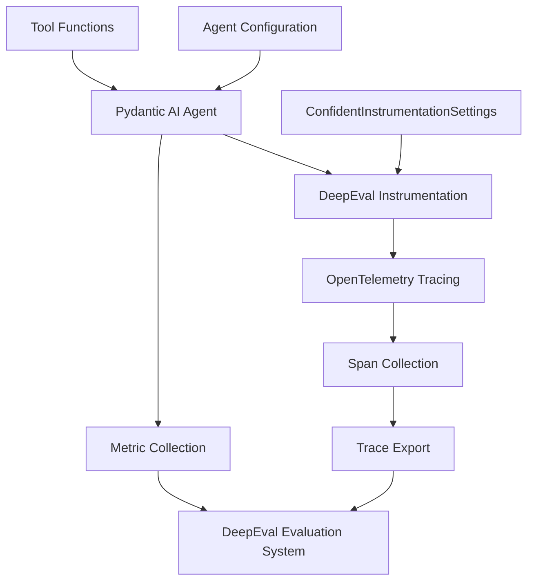
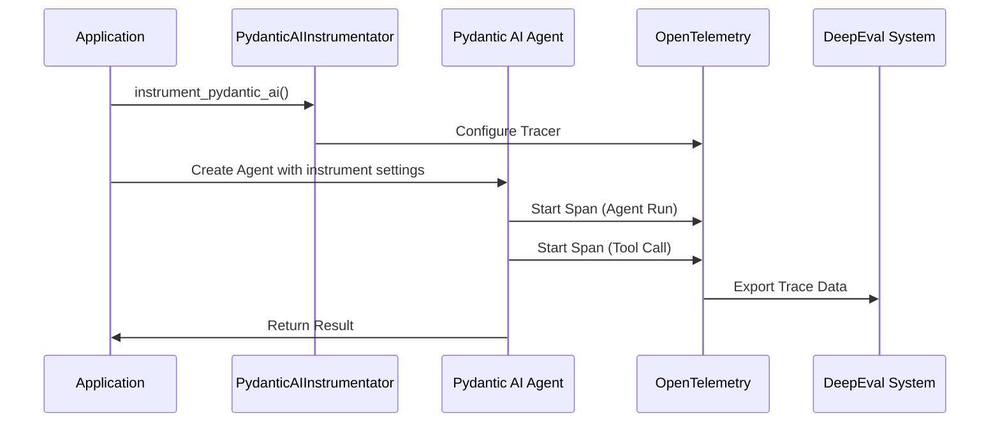
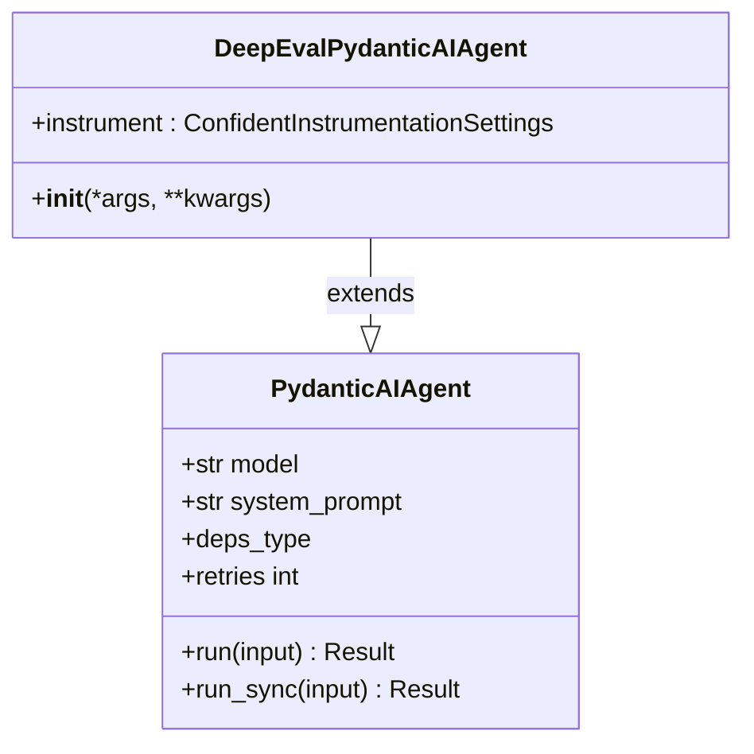
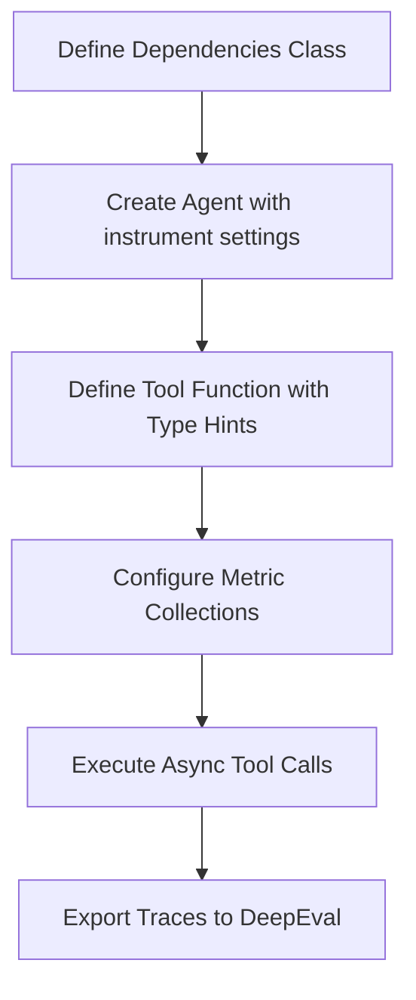

# Pydantic AI Integration

<cite>
**Referenced Files in This Document**  
- [agent.py](file://deepeval/integrations/pydantic_ai/agent.py)
- [instrumentator.py](file://deepeval/integrations/pydantic_ai/instrumentator.py)
- [otel.py](file://deepeval/integrations/pydantic_ai/otel.py)
- [__init__.py](file://deepeval/integrations/pydantic_ai/__init__.py)
- [test_pydanticai_online.py](file://tests/test_docs/test_deepeval/test_ai_agent_evals/test_pydanticai/test_pydanticai_online.py)
- [weather_agent.py](file://tests/test_integrations/test_pydanticai/weather_agent.py)
- [test_pydanticai_setup.py](file://tests/test_docs/test_deeval/test_ai_agent_evals/test_pydanticai/test_pydanticai_setup.py)
</cite>

## Table of Contents
1. [Introduction](#introduction)
2. [Core Components](#core-components)
3. [Architecture Overview](#architecture-overview)
4. [Detailed Component Analysis](#detailed-component-analysis)
5. [Usage Examples](#usage-examples)
6. [Configuration and Customization](#configuration-and-customization)
7. [Troubleshooting Common Issues](#troubleshooting-common-issues)
8. [Best Practices for Agent Evaluation](#best-practices-for-agent-evaluation)
9. [Conclusion](#conclusion)

## Introduction
The Pydantic AI integration within DeepEval enables comprehensive tracing and evaluation of AI agents built using the Pydantic AI framework. This integration leverages OpenTelemetry to capture detailed execution spans, including state transitions, tool calls, and decision points, providing deep observability into agent behavior. The system supports both synchronous and asynchronous execution patterns and integrates seamlessly with DeepEval's evaluation infrastructure for performance and reliability assessment.

**Section sources**
- [__init__.py](file://deepeval/integrations/pydantic_ai/__init__.py#L1-L5)
- [test_pydanticai_setup.py](file://tests/test_docs/test_deepeval/test_ai_agent_evals/test_pydanticai/test_pydanticai_setup.py#L1-L26)

## Core Components
The Pydantic AI integration consists of three primary components: the instrumentator, agent wrapper, and OpenTelemetry integration layer. These components work together to enable tracing, metric collection, and evaluation of Pydantic AI agents. The integration provides both a legacy instrumentation approach and a modern configuration-based system using `ConfidentInstrumentationSettings`.

**Section sources**
- [agent.py](file://deepeval/integrations/pydantic_ai/agent.py#L1-L38)
- [instrumentator.py](file://deepeval/integrations/pydantic_ai/instrumentator.py)
- [otel.py](file://deepeval/integrations/pydantic_ai/otel.py)

## Architecture Overview



**Diagram sources**
- [agent.py](file://deepeval/integrations/pydantic_ai/agent.py#L1-L38)
- [instrumentator.py](file://deepeval/integrations/pydantic_ai/instrumentator.py)
- [otel.py](file://deepeval/integrations/pydantic_ai/otel.py)

## Detailed Component Analysis

### PydanticAIInstrumentator Implementation
The instrumentation system provides two approaches for integrating DeepEval with Pydantic AI agents. The legacy approach uses the `instrument_pydantic_ai()` function, while the modern approach utilizes `ConfidentInstrumentationSettings` directly in the agent configuration. The instrumentator sets up OpenTelemetry tracing to capture agent execution details, including state changes, tool invocations, and LLM interactions.



**Diagram sources**
- [otel.py](file://deepeval/integrations/pydantic_ai/otel.py)
- [instrumentator.py](file://deepeval/integrations/pydantic_ai/instrumentator.py)

**Section sources**
- [otel.py](file://deepeval/integrations/pydantic_ai/otel.py)
- [instrumentator.py](file://deepeval/integrations/pydantic_ai/instrumentator.py)

### Agent Integration Layer
The `DeepEvalPydanticAIAgent` class extends the base Pydantic AI Agent to provide compatibility with DeepEval's instrumentation system. It includes deprecation warnings to guide users toward the modern configuration approach using `ConfidentInstrumentationSettings`. The agent wrapper ensures that all execution traces are properly captured and formatted for DeepEval's evaluation system.



**Diagram sources**
- [agent.py](file://deepeval/integrations/pydantic_ai/agent.py#L1-L38)

**Section sources**
- [agent.py](file://deepeval/integrations/pydantic_ai/agent.py#L1-L38)

## Usage Examples

### Basic Setup
The following example demonstrates how to set up a Pydantic AI agent with DeepEval instrumentation for basic tracing and evaluation:

```mermaid
flowchart TD
A[Import instrument_pydantic_ai] --> B[Call instrument_pydantic_ai()]
B --> C[Create Agent Instance]
C --> D[Run Agent Synchronously]
D --> E[Wait for Trace Export]
```

**Section sources**
- [test_pydanticai_setup.py](file://tests/test_docs/test_deepeval/test_ai_agent_evals/test_pydanticai/test_pydanticai_setup.py#L1-L26)

### Advanced Configuration with Weather Agent
This example shows a more complex agent with dependencies, tool functions, and detailed instrumentation settings:



**Section sources**
- [weather_agent.py](file://tests/test_integrations/test_pydanticai/weather_agent.py#L1-L52)

## Configuration and Customization
The integration supports extensive configuration options for customizing trace export and evaluation behavior. Users can specify different metric collections for agent-level, LLM-level, and tool-specific metrics. The `ConfidentInstrumentationSettings` class allows for fine-grained control over tracing parameters, including thread IDs and prompt configurations. The system supports both synchronous and asynchronous execution patterns, automatically adapting the tracing mechanism to the execution context.

**Section sources**
- [instrumentator.py](file://deepeval/integrations/pydantic_ai/instrumentator.py)
- [weather_agent.py](file://tests/test_integrations/test_pydanticai/weather_agent.py#L28-L35)

## Troubleshooting Common Issues

### Missing Span Data
When span data is not appearing in DeepEval, ensure that:
- The instrumentation is properly initialized before agent creation
- Sufficient delay is added after agent execution to allow trace export
- Network connectivity to the DeepEval endpoint is available
- Required dependencies are properly installed

### OpenTelemetry Configuration Conflicts
To resolve conflicts with existing OpenTelemetry configurations:
- Initialize the Pydantic AI instrumentator before other OpenTelemetry setups
- Use isolated tracer providers when necessary
- Ensure compatible OpenTelemetry SDK versions
- Consider using the `ConfidentInstrumentationSettings` approach for better isolation

**Section sources**
- [test_pydanticai_setup.py](file://tests/test_docs/test_deeval/test_ai_agent_evals/test_pydanticai/test_pydanticai_setup.py#L15)
- [test_pydanticai_online.py](file://tests/test_docs/test_deepeval/test_ai_agent_evals/test_pydanticai/test_pydanticai_online.py#L18)

## Best Practices for Agent Evaluation
For optimal agent evaluation and performance monitoring:
- Use descriptive thread IDs to organize related traces
- Configure appropriate metric collections for different agent components
- Implement consistent delay periods after agent execution to ensure complete trace export
- Leverage both synchronous and asynchronous testing to evaluate different execution patterns
- Monitor tool call frequency and duration to identify performance bottlenecks
- Regularly review trace data for unexpected state transitions or decision patterns

**Section sources**
- [test_pydanticai_online.py](file://tests/test_docs/test_deepeval/test_ai_agent_evals/test_pydanticai/test_pydanticai_online.py)
- [weather_agent.py](file://tests/test_integrations/test_pydanticai/weather_agent.py)

## Conclusion
The Pydantic AI integration in DeepEval provides a robust framework for tracing and evaluating AI agents. By leveraging OpenTelemetry, it captures comprehensive execution data that enables detailed analysis of agent behavior, performance, and reliability. The dual approach of legacy instrumentation and modern configuration settings ensures backward compatibility while promoting best practices. With support for both synchronous and asynchronous patterns, comprehensive error handling, and seamless integration with DeepEval's evaluation system, this integration offers a complete solution for monitoring and improving AI agent performance.