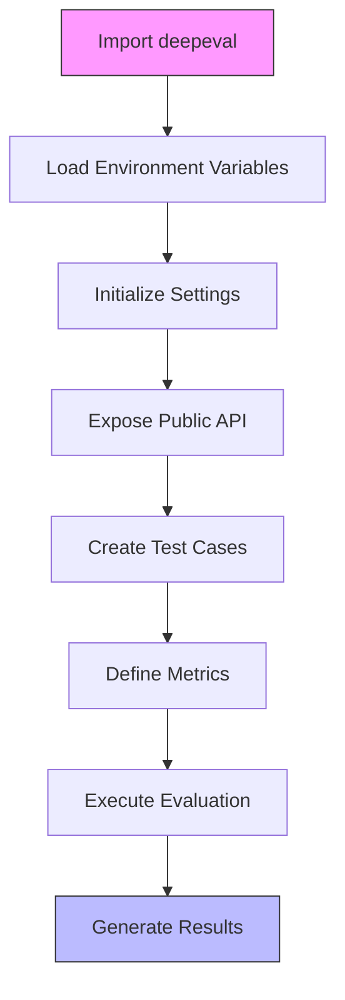

# Getting Started

<cite>
**Referenced Files in This Document**   
- [deepeval/__init__.py](file://deepeval/__init__.py)
- [deepeval/evaluate/__init__.py](file://deepeval/evaluate/__init__.py)
- [deepeval/test_case/__init__.py](file://deepeval/test_case/__init__.py)
- [deepeval/metrics/__init__.py](file://deepeval/metrics/__init__.py)
- [deepeval/config/settings.py](file://deepeval/config/settings.py)
- [deepeval/config/settings_manager.py](file://deepeval/config/settings_manager.py)
- [deepeval/cli/dotenv_handler.py](file://deepeval/cli/dotenv_handler.py)
- [.env.example](file://.env.example)
- [deepeval/evaluate/evaluate.py](file://deepeval/evaluate/evaluate.py)
- [deepeval/test_case/llm_test_case.py](file://deepeval/test_case/llm_test_case.py)
- [deepeval/metrics/base_metric.py](file://deepeval/metrics/base_metric.py)
- [deepeval/cli/main.py](file://deepeval/cli/main.py)
- [examples/getting_started/test_example.py](file://examples/getting_started/test_example.py)
- [pyproject.toml](file://pyproject.toml)
</cite>

## Table of Contents
1. [Installation](#installation)
2. [Configuration and Environment Setup](#configuration-and-environment-setup)
3. [Core Architecture and Setup Flow](#core-architecture-and-setup-flow)
4. [Basic Setup and Evaluation Example](#basic-setup-and-evaluation-example)
5. [Public Interfaces and Configuration Options](#public-interfaces-and-configuration-options)
6. [Common Issues and Solutions](#common-issues-and-solutions)
7. [Performance Considerations and Best Practices](#performance-considerations-and-best-practices)

## Installation

To get started with DeepEval, install the framework using pip. The installation process is straightforward and can be completed with a single command:

```bash
pip install deepeval
```

This command installs the core DeepEval package with all its dependencies as specified in the pyproject.toml file. The framework requires Python 3.9 or higher and includes essential packages such as requests, pytest, rich, pydantic, and various LLM provider SDKs. For development purposes, additional dependencies can be installed using the dev group specified in the pyproject.toml file.

**Section sources**
- [pyproject.toml](file://pyproject.toml#L1-L99)

## Configuration and Environment Setup

DeepEval uses a comprehensive configuration system based on environment variables and dotenv files. The framework automatically loads environment variables from .env files in the following precedence order: .env → .env.{APP_ENV} → .env.local, with process environment variables taking highest precedence.

The primary configuration file is .env.example, which serves as a template for setting up your environment. This file contains all available configuration options grouped by provider (OpenAI, Azure, Google Gemini, etc.) and DeepEval-specific settings. Key configuration aspects include:

- **API Keys**: Set API keys for various LLM providers (OPENAI_API_KEY, ANTHROPIC_API_KEY, etc.)
- **Model Configuration**: Specify model names and endpoints for different providers
- **DeepEval Settings**: Configure framework behavior through variables like DEEPEVAL_RESULTS_FOLDER and DEEPEVAL_TELEMETRY_OPT_OUT
- **Cost Tracking**: Optionally override default cost values for accurate cost reporting

To set up your environment, copy .env.example to .env.local and populate the necessary API keys:

```bash
cp .env.example .env.local
# Edit .env.local to add your API keys
```

The configuration system is implemented in deepeval/config/settings.py using Pydantic's BaseSettings, which provides type validation, computed fields, and automatic environment variable loading. The settings are loaded at import time in deepeval/__init__.py through the autoload_dotenv() function, ensuring configuration is available throughout the application.

**Section sources**
- [.env.example](file://.env.example#L1-L109)
- [deepeval/config/settings.py](file://deepeval/config/settings.py#L1-L800)
- [deepeval/__init__.py](file://deepeval/__init__.py#L8-L12)

## Core Architecture and Setup Flow

The DeepEval framework follows a modular architecture with clear separation of concerns. The setup process begins with configuration loading and progresses through component initialization to evaluation execution.



**Diagram sources**
- [deepeval/__init__.py](file://deepeval/__init__.py#L8-L12)
- [deepeval/evaluate/evaluate.py](file://deepeval/evaluate/evaluate.py#L185-L323)

The architecture centers around three core components: test cases, metrics, and the evaluation engine. Test cases (LLMTestCase) encapsulate the input, actual output, expected output, and context for evaluation. Metrics (BaseMetric) define the criteria for assessing LLM responses. The evaluation engine (evaluate function) orchestrates the assessment process, applying metrics to test cases and generating comprehensive results.

Configuration management is handled through a sophisticated system that merges environment variables, dotenv files, and legacy key storage. The Settings class in settings.py provides a centralized configuration point with type validation and computed fields. The update_settings_and_persist function in settings_manager.py enables dynamic configuration updates with optional persistence to dotenv files.

**Section sources**
- [deepeval/__init__.py](file://deepeval/__init__.py#L15-L44)
- [deepeval/config/settings.py](file://deepeval/config/settings.py#L245-L800)
- [deepeval/config/settings_manager.py](file://deepeval/config/settings_manager.py#L63-L138)

## Basic Setup and Evaluation Example

The minimal setup for running a basic evaluation with DeepEval requires creating a test case, defining metrics, and calling the evaluate function. Here's a complete example:

```python
import deepeval
from deepeval.test_case import LLMTestCase
from deepeval.metrics import AnswerRelevancyMetric, GEval

# Create a test case
test_case = LLMTestCase(
    input="What if these shoes don't fit?",
    actual_output="We offer a 30-day full refund at no extra cost.",
    expected_output="You're eligible for a free full refund within 30 days of purchase."
)

# Define metrics
answer_relevancy_metric = AnswerRelevancyMetric(threshold=0.7)
correctness_metric = GEval(
    name="Correctness",
    criteria="determine if the actual output is correct according to the expected output.",
    evaluation_params=[LLMTestCaseParams.ACTUAL_OUTPUT, LLMTestCaseParams.EXPECTED_OUTPUT],
    strict_mode=True
)

# Execute evaluation
deepeval.assert_test(test_case, [answer_relevancy_metric, correctness_metric])
```

This example demonstrates the core evaluation workflow. The LLMTestCase object contains the essential components for evaluation: input, actual output from your LLM application, and expected output for comparison. Two metrics are applied: AnswerRelevancyMetric assesses how relevant the response is to the input, while GEval uses a custom criterion to evaluate correctness. The assert_test function executes the evaluation and raises an AssertionError if any metric fails.

The example is based on the test_example.py file in the examples directory, which provides a complete pytest-based evaluation framework that can be run with the deepeval test runner.

**Section sources**
- [examples/getting_started/test_example.py](file://examples/getting_started/test_example.py#L1-L40)
- [deepeval/test_case/llm_test_case.py](file://deepeval/test_case/llm_test_case.py#L1-L200)
- [deepeval/metrics/base_metric.py](file://deepeval/metrics/base_metric.py#L1-L134)

## Public Interfaces and Configuration Options

DeepEval exposes a clean public API through its __init__.py file, making key functions easily accessible. The primary interfaces for setup and evaluation are:

- **evaluate()**: Main function for running evaluations on test case collections
- **assert_test()**: Asserts that test cases pass all specified metrics, raising AssertionError on failure
- **login()**: Configures API keys for Confident AI integration
- **log_hyperparameters()**: Records hyperparameters for experiment tracking

The LLMTestCase class provides the following parameters for test case configuration:
- **input**: The prompt or query provided to the LLM
- **actual_output**: The response from your LLM application
- **expected_output**: The ideal or expected response for comparison
- **context**: Additional context provided to the LLM
- **retrieval_context**: Retrieved documents or information used in RAG applications

Metrics are configured with several key options:
- **threshold**: The minimum score required for a metric to pass
- **strict_mode**: Whether to enforce exact matches (for certain metrics)
- **include_reason**: Whether to generate explanation text for scores
- **async_mode**: Whether to execute evaluations asynchronously

Configuration options in the .env file control framework behavior:
- **DEEPEVAL_RESULTS_FOLDER**: Directory for saving evaluation results
- **DEEPEVAL_TELEMETRY_OPT_OUT**: Disable telemetry reporting
- **DEEPEVAL_UPDATE_WARNING_OPT_IN**: Enable version update notifications
- **LOG_LEVEL**: Set logging verbosity

**Section sources**
- [deepeval/__init__.py](file://deepeval/__init__.py#L18-L41)
- [deepeval/evaluate/__init__.py](file://deepeval/evaluate/__init__.py#L1-L15)
- [deepeval/test_case/__init__.py](file://deepeval/test_case/__init__.py#L1-L38)
- [deepeval/metrics/__init__.py](file://deepeval/metrics/__init__.py#L1-L134)
- [.env.example](file://.env.example#L1-L109)

## Common Issues and Solutions

New users may encounter several common issues during setup. Understanding these issues and their solutions can streamline the onboarding process:

**API Key Not Found**: If you receive errors about missing API keys, ensure your .env.local file contains the required keys and is properly formatted. The framework checks for OPENAI_API_KEY by default, so if using OpenAI, this key must be present.

**Permission Errors on .env.local**: The dotenv_handler.py file sets file permissions to 0600 (read/write for owner only) for security. If you encounter permission issues, check file ownership and permissions in your development environment.

**Legacy Key Migration Warning**: If you see warnings about reading secrets from the legacy keyfile, migrate your API keys to environment variables or .env files, as the legacy storage is deprecated.

**Pytest Integration Issues**: When using deepeval with pytest, ensure you're running tests with the deepeval test runner: `deepeval test run test_file.py`. This ensures proper environment setup and result handling.

**Async Execution Problems**: Some metrics may not support async execution. If encountering async-related errors, set async_mode=False when initializing the metric.

**Missing Dependencies**: For integrations with specific frameworks (LangChain, LlamaIndex, etc.), install the optional integrations group: `pip install deepeval[integrations]`.

The framework includes comprehensive error handling through the ErrorConfig class, which allows configuring behavior for missing parameters and errors. The should_skip_on_missing_params() and should_ignore_errors() utilities provide fine-grained control over error handling during evaluation.

**Section sources**
- [deepeval/utils.py](file://deepeval/utils.py#L850-L888)
- [deepeval/cli/dotenv_handler.py](file://deepeval/cli/dotenv_handler.py#L1-L72)
- [deepeval/evaluate/evaluate.py](file://deepeval/evaluate/evaluate.py#L96-L99)
- [deepeval/config/settings.py](file://deepeval/config/settings.py#L109-L168)

## Performance Considerations and Best Practices

When setting up DeepEval, consider these performance and best practices for optimal results:

**Environment Management**: Use separate environment files for different environments (development, staging, production). The framework supports APP_ENV variable to load environment-specific configuration files (.env.{APP_ENV}).

**Configuration Persistence**: Use the --save option with CLI commands to persist configuration changes to dotenv files. This ensures consistent setup across development environments and team members.

**API Key Security**: Never commit API keys to version control. The .env.local file should be git-ignored, and sensitive keys should only exist in local environment files.

**Evaluation Caching**: Enable caching with ENABLE_DEEPEVAL_CACHE=true to avoid re-evaluating identical test cases, significantly improving performance during development.

**Resource Management**: Configure DEEPEVAL_MAX_CONCURRENT_DOC_PROCESSING to control the number of concurrent document processing tasks, preventing resource exhaustion.

**Telemetry and Debugging**: In production environments, consider setting DEEPEVAL_TELEMETRY_OPT_OUT=1 and DEEPEVAL_DEBUG_ASYNC=0 to minimize overhead. Use LOG_LEVEL=DEBUG only during development and troubleshooting.

**Version Management**: Keep DeepEval updated to benefit from performance improvements and new features. The framework checks for updates on startup when DEEPEVAL_UPDATE_WARNING_OPT_IN=1 is set.

**Project Structure**: Organize your evaluation code following the example structure in the examples/ directory, with separate files for different evaluation scenarios and a clear test hierarchy.

These practices ensure efficient, secure, and maintainable evaluation workflows that scale with your project's complexity.

**Section sources**
- [deepeval/config/settings.py](file://deepeval/config/settings.py#L277-L294)
- [deepeval/config/settings_manager.py](file://deepeval/config/settings_manager.py#L63-L138)
- [deepeval/cli/main.py](file://deepeval/cli/main.py#L1-L200)
- [deepeval/__init__.py](file://deepeval/__init__.py#L101-L107)