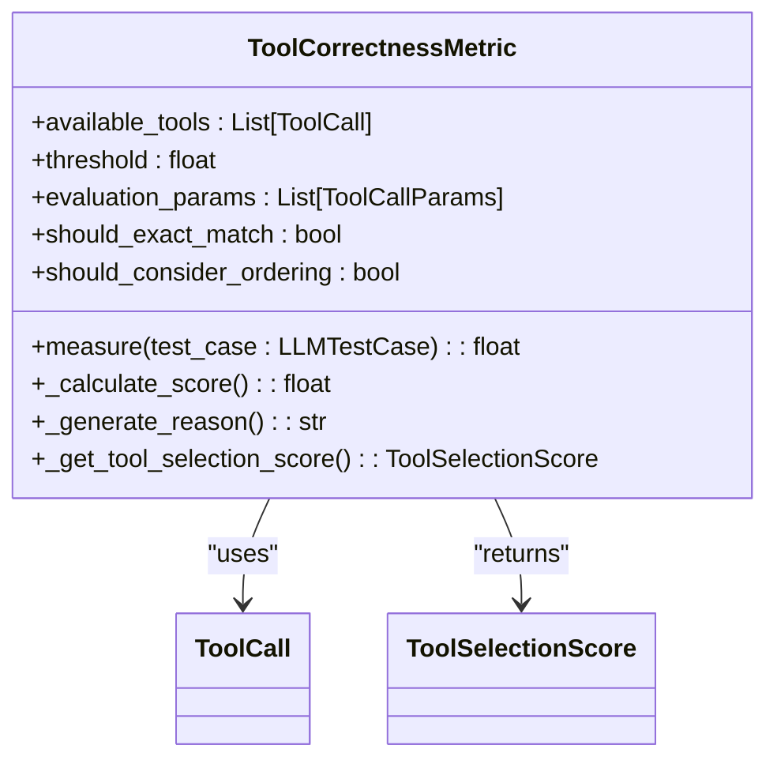
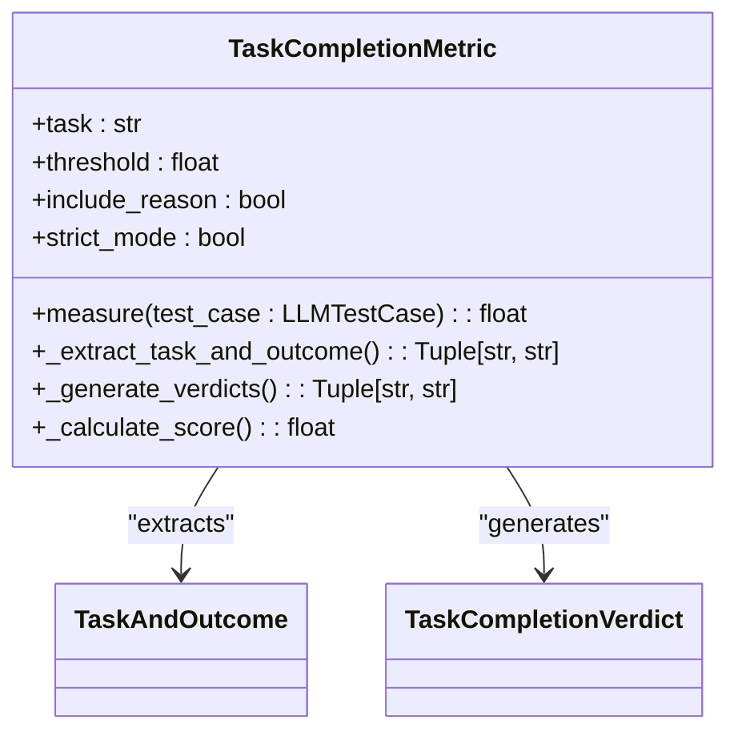
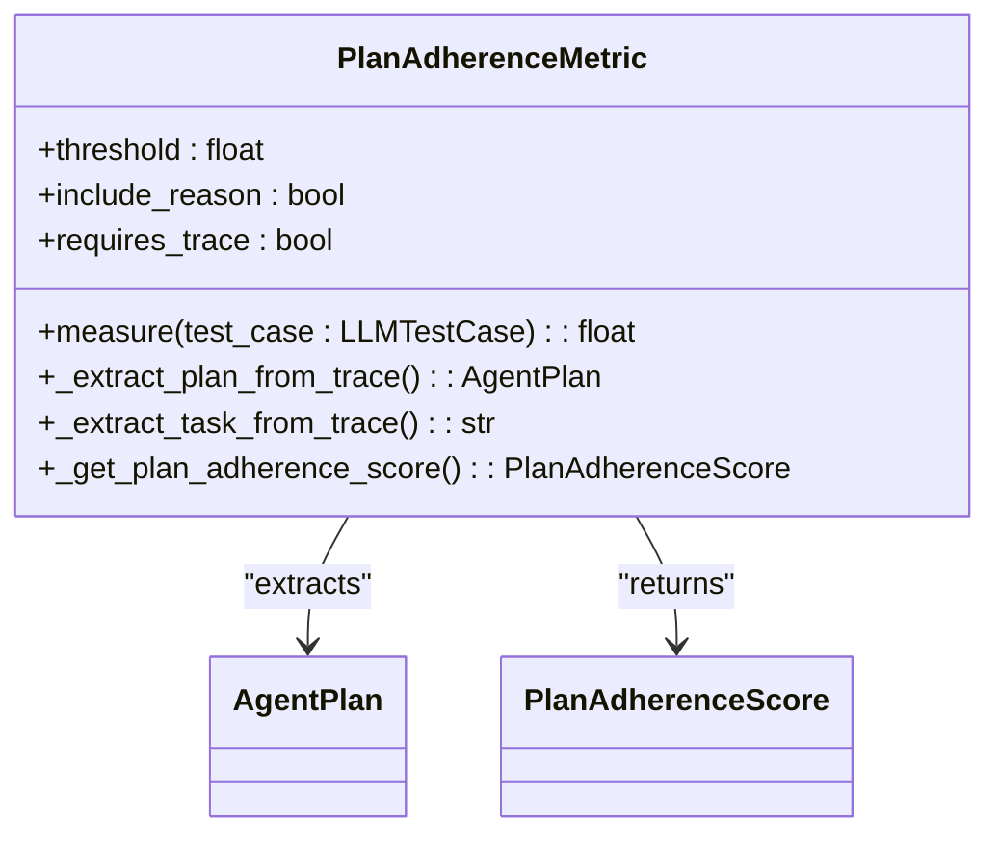
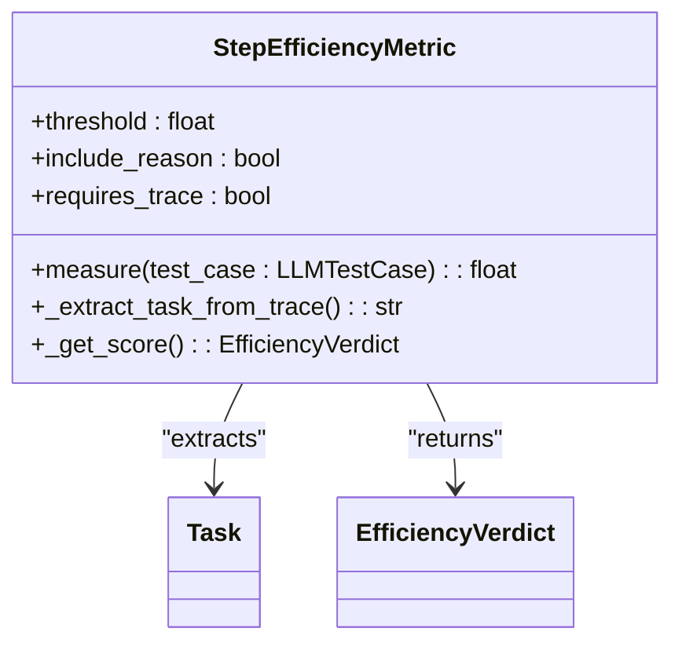
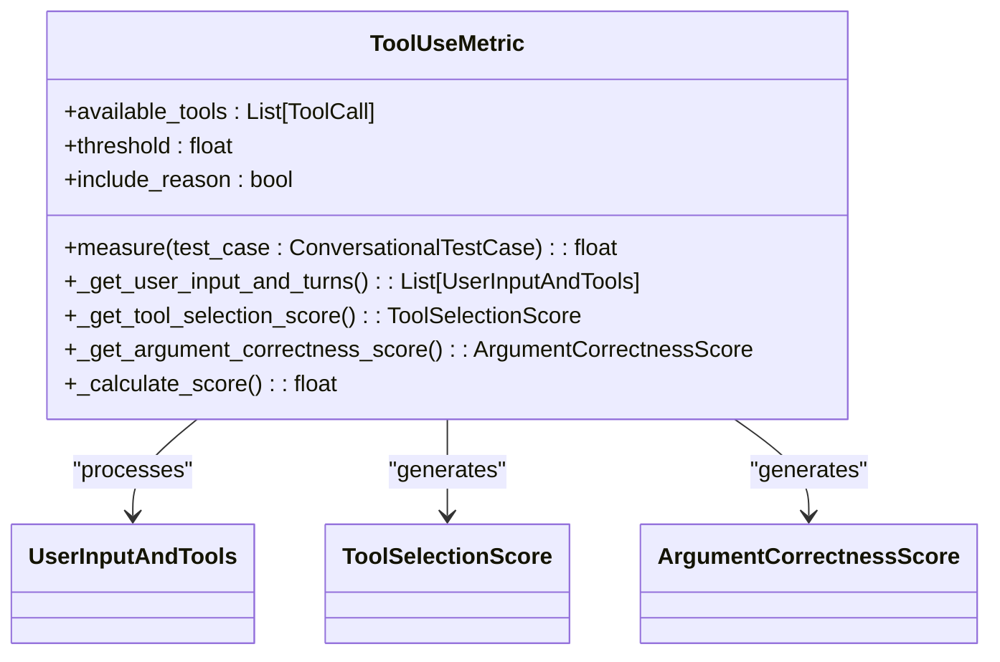
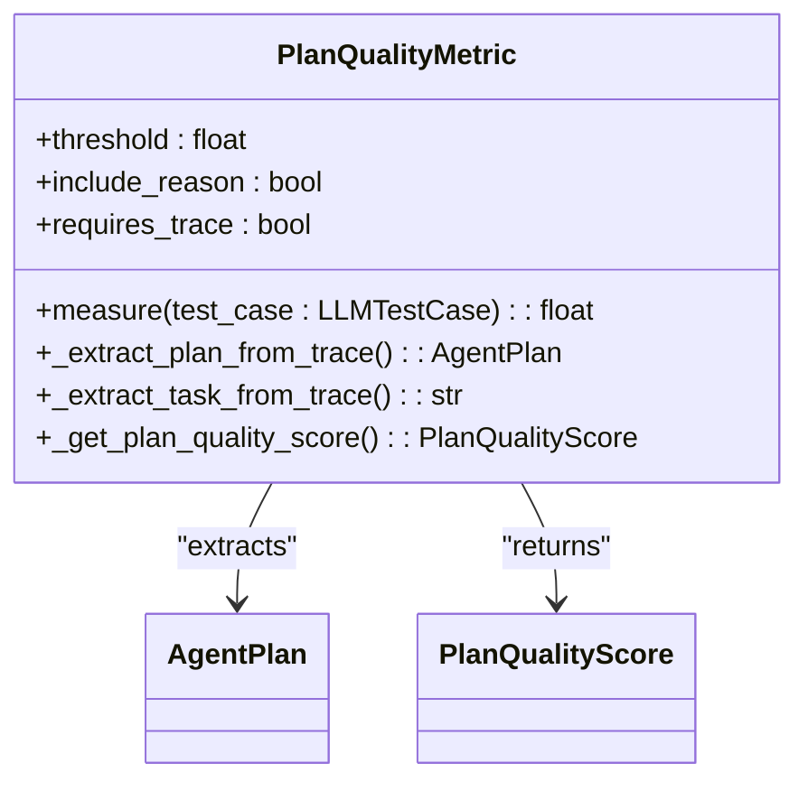
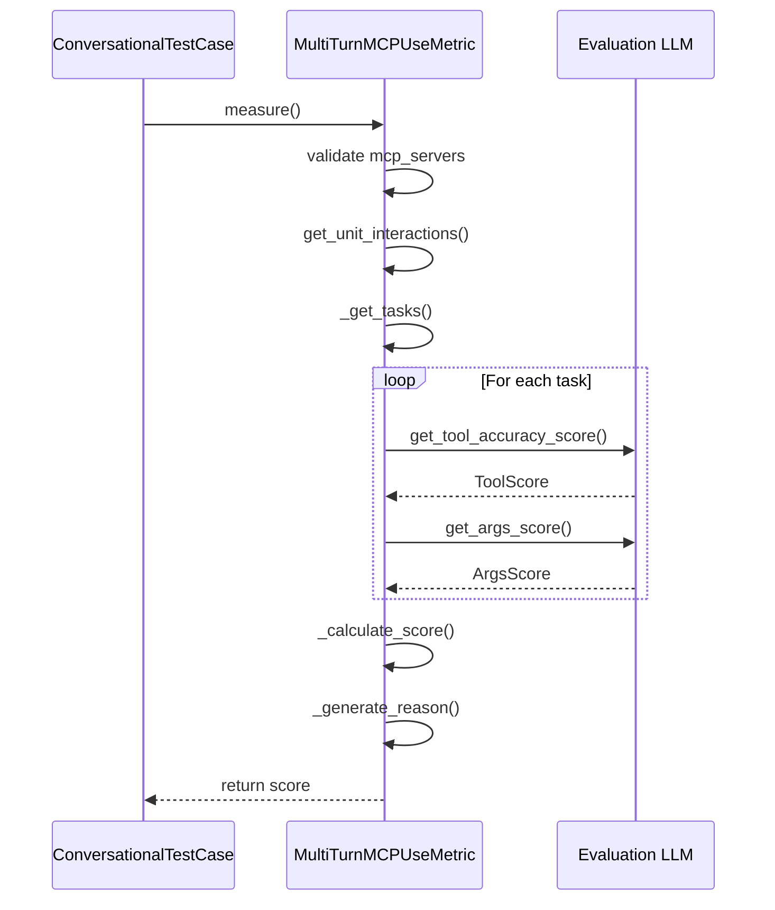
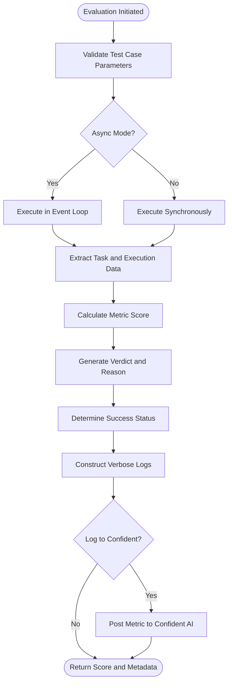

# Agentic Metrics

<cite>
**Referenced Files in This Document**   
- [tool_correctness.py](file://deepeval/metrics/tool_correctness/tool_correctness.py)
- [task_completion.py](file://deepeval/metrics/task_completion/task_completion.py)
- [plan_adherence.py](file://deepeval/metrics/plan_adherence/plan_adherence.py)
- [step_efficiency.py](file://deepeval/metrics/step_efficiency/step_efficiency.py)
- [tool_use.py](file://deepeval/metrics/tool_use/tool_use.py)
- [plan_quality.py](file://deepeval/metrics/plan_quality/plan_quality.py)
- [evaluate.py](file://deepeval/evaluate/evaluate.py)
- [mcp_task_completion.py](file://deepeval/metrics/mcp/mcp_task_completion.py)
- [multi_turn_mcp_use_metric.py](file://deepeval/metrics/mcp/multi_turn_mcp_use_metric.py)
- [mcp.py](file://deepeval/test_case/mcp.py)
- [mcp_eval_single_turn.py](file://examples/mcp_evaluation/mcp_eval_single_turn.py)
- [mcp_eval_multi_turn.py](file://examples/mcp_evaluation/mcp_eval_multi_turn.py)
</cite>

## Table of Contents
1. [Introduction](#introduction)
2. [Domain Model](#domain-model)
3. [Core Agentic Metrics](#core-agentic-metrics)
   - [ToolCorrectness](#toolcorrectness)
   - [TaskCompletion](#taskcompletion)
   - [PlanAdherence](#planadherence)
   - [StepEfficiency](#stepefficiency)
   - [ToolUse](#tooluse)
   - [PlanQuality](#planquality)
4. [MCP Integration](#mcp-integration)
5. [Evaluation Workflow](#evaluation-workflow)
6. [Configuration Options](#configuration-options)
7. [Common Issues and Solutions](#common-issues-and-solutions)
8. [Best Practices](#best-practices)
9. [Performance Considerations](#performance-considerations)
10. [Conclusion](#conclusion)

## Introduction
DeepEval's Agentic Metrics sub-feature provides a comprehensive framework for evaluating AI agent behavior, focusing on key aspects such as tool usage accuracy, task completion, planning quality, and execution efficiency. This documentation details the implementation of specialized metrics designed to assess multi-step agent workflows, particularly in the context of Multi-agent Collaboration Protocol (MCP) test cases. The metrics analyze agent behavior through structured inputs like steps, expected_steps, and actual_output, producing standardized outputs including score, reason, and success indicators. These metrics are invoked through the evaluate() function and are specifically designed to handle complex agent evaluation scenarios, providing granular insights into agent performance across various dimensions.

## Domain Model
The Agentic Metrics framework operates on a well-defined domain model that captures the essential elements of agent evaluation. The core inputs include steps (representing the sequence of actions taken by the agent), expected_steps (defining the ideal or expected sequence of actions), and actual_output (the agent's final response or output). These inputs are processed by the metrics to generate standardized outputs: score (a float between 0 and 1 representing the evaluation result), reason (a textual explanation of the score), and success (a boolean indicating whether the evaluation passed the threshold). The model also incorporates additional parameters such as available_tools (defining the tools accessible to the agent), threshold (the minimum score required for success), and various configuration options that influence the evaluation process. This domain model enables consistent and comparable evaluations across different agent implementations and use cases.

**Section sources**
- [tool_correctness.py](file://deepeval/metrics/tool_correctness/tool_correctness.py#L28-L32)
- [task_completion.py](file://deepeval/metrics/task_completion/task_completion.py#L28-L31)
- [plan_adherence.py](file://deepeval/metrics/plan_adherence/plan_adherence.py#L31-L34)
- [step_efficiency.py](file://deepeval/metrics/step_efficiency/step_efficiency.py#L24-L27)
- [tool_use.py](file://deepeval/metrics/tool_use/tool_use.py#L32-L35)
- [plan_quality.py](file://deepeval/metrics/plan_quality/plan_quality.py#L34-L37)

## Core Agentic Metrics

### ToolCorrectness
The ToolCorrectness metric evaluates the accuracy of an AI agent's tool usage by comparing the tools actually called against the expected tools. It analyzes both the selection of appropriate tools from the available set and the correctness of tool invocation parameters. The metric supports multiple evaluation modes through configuration options like should_exact_match (for strict matching) and should_consider_ordering (for sequence-sensitive evaluation). It calculates scores using algorithms such as exact matching, non-exact matching with parameter comparison, and weighted longest common subsequence for ordered evaluations. The metric also assesses tool selection appropriateness by evaluating whether the agent chose the most suitable tools from the available options for the given task.

**Diagram sources **
- [tool_correctness.py](file://deepeval/metrics/tool_correctness/tool_correctness.py#L26-L526)

**Section sources**
- [tool_correctness.py](file://deepeval/metrics/tool_correctness/tool_correctness.py#L26-L526)

### TaskCompletion
The TaskCompletion metric assesses whether an AI agent has successfully completed its assigned task based on the actual output produced. It extracts the task and outcome from the test case, either from explicit task parameters or by analyzing the input-output trace, and evaluates the completeness and accuracy of task fulfillment. The metric uses a Large Language Model (LLM) to generate a verdict on task completion, considering factors such as whether all required steps were completed and whether the final output satisfies the user's request. It supports both synchronous and asynchronous evaluation modes and can operate in strict mode where scores below the threshold are automatically set to zero.

**Diagram sources **
- [task_completion.py](file://deepeval/metrics/task_completion/task_completion.py#L26-L254)

**Section sources**
- [task_completion.py](file://deepeval/metrics/task_completion/task_completion.py#L26-L254)

### PlanAdherence
The PlanAdherence metric evaluates how closely an AI agent follows its planned execution strategy. It extracts the agent's plan from the execution trace and compares it against the actual steps taken during task execution. The metric assesses adherence by analyzing whether the agent deviated from its intended plan, skipped planned steps, or executed steps out of order. It uses LLM-based evaluation to score plan adherence, considering both the completeness of plan execution and the fidelity to the planned sequence. The metric requires trace data to be available in the test case, as it analyzes the agent's reasoning and planning process captured during execution.

**Diagram sources **
- [plan_adherence.py](file://deepeval/metrics/plan_adherence/plan_adherence.py#L29-L267)

**Section sources**
- [plan_adherence.py](file://deepeval/metrics/plan_adherence/plan_adherence.py#L29-L267)

### StepEfficiency
The StepEfficiency metric evaluates the efficiency of an AI agent's execution by analyzing whether it completed the task using the optimal number of steps. It extracts the task from the execution trace and assesses the agent's step-by-step execution for unnecessary or redundant actions. The metric considers whether the agent took shortcuts, repeated steps, or used inefficient approaches to complete the task. It uses LLM-based evaluation to score efficiency, with higher scores awarded to agents that complete tasks with minimal, purposeful steps. The metric requires trace data to analyze the agent's execution process and decision-making.

**Diagram sources **
- [step_efficiency.py](file://deepeval/metrics/step_efficiency/step_efficiency.py#L22-L225)

**Section sources**
- [step_efficiency.py](file://deepeval/metrics/step_efficiency/step_efficiency.py#L22-L225)

### ToolUse
The ToolUse metric evaluates an AI agent's tool usage in conversational contexts, assessing both tool selection appropriateness and argument correctness. It analyzes multi-turn interactions to evaluate whether the agent selected the right tools for each step and provided correct arguments to those tools. The metric processes unit interactions (user input followed by agent response) and evaluates tool usage across the conversation. It calculates a composite score by combining tool selection scores and argument correctness scores, with the final score representing the minimum of these components to ensure both aspects meet the required standard.

**Diagram sources **
- [tool_use.py](file://deepeval/metrics/tool_use/tool_use.py#L30-L435)

**Section sources**
- [tool_use.py](file://deepeval/metrics/tool_use/tool_use.py#L30-L435)

### PlanQuality
The PlanQuality metric evaluates the quality of an AI agent's planning process by assessing whether the planned steps are logical, comprehensive, and appropriate for the task at hand. It extracts the agent's plan from the execution trace and evaluates it against the task requirements, considering factors such as step completeness, logical flow, and strategic appropriateness. The metric uses LLM-based evaluation to score plan quality, with higher scores awarded to plans that are well-structured, cover all necessary aspects of the task, and demonstrate sound reasoning. Like other trace-dependent metrics, it requires execution trace data to access the agent's planning information.

**Diagram sources **
- [plan_quality.py](file://deepeval/metrics/plan_quality/plan_quality.py#L32-L269)

**Section sources**
- [plan_quality.py](file://deepeval/metrics/plan_quality/plan_quality.py#L32-L269)

## MCP Integration
The Agentic Metrics framework integrates with Multi-agent Collaboration Protocol (MCP) test cases through specialized metrics that evaluate agent behavior in MCP contexts. The MCPTaskCompletionMetric assesses whether an agent successfully completed tasks in an MCP environment by analyzing multi-turn interactions and evaluating task fulfillment based on visible agent responses. The MultiTurnMCPUseMetric evaluates tool usage across multiple turns, assessing both primitive (tool) correctness and argument correctness. These metrics require MCP-specific test case parameters, including mcp_servers (defining available tools, resources, and prompts) and mcp_tools_called (recording actual tool invocations). The integration enables comprehensive evaluation of agent behavior in collaborative multi-agent scenarios, ensuring that agents use MCP primitives appropriately and complete tasks effectively.

**Diagram sources **
- [mcp_task_completion.py](file://deepeval/metrics/mcp/mcp_task_completion.py#L23-L295)
- [multi_turn_mcp_use_metric.py](file://deepeval/metrics/mcp/multi_turn_mcp_use_metric.py#L23-L387)
- [mcp.py](file://deepeval/test_case/mcp.py#L6-L60)

**Section sources**
- [mcp_task_completion.py](file://deepeval/metrics/mcp/mcp_task_completion.py#L23-L295)
- [multi_turn_mcp_use_metric.py](file://deepeval/metrics/mcp/multi_turn_mcp_use_metric.py#L23-L387)
- [mcp.py](file://deepeval/test_case/mcp.py#L6-L60)

## Evaluation Workflow
The evaluation workflow for Agentic Metrics is orchestrated through the evaluate() function in DeepEval's evaluation module. When metrics are invoked, they follow a standardized process: first validating required test case parameters, then executing the measurement logic either synchronously or asynchronously based on configuration, and finally returning a standardized score with supporting metadata. The workflow supports both single-test case evaluation through assert_test() and batch evaluation through evaluate(). For MCP test cases, the workflow processes multi-turn interactions by extracting unit interactions and evaluating each task independently before aggregating results. The evaluation process includes progress indicators, verbose logging, and optional integration with Confident AI for result visualization and analysis.

**Diagram sources **
- [evaluate.py](file://deepeval/evaluate/evaluate.py#L71-L323)

**Section sources**
- [evaluate.py](file://deepeval/evaluate/evaluate.py#L71-L323)

## Configuration Options
The Agentic Metrics framework provides several configuration options to customize evaluation behavior. Key parameters include threshold (defining the minimum acceptable score), model (specifying the LLM used for evaluation), and async_mode (determining whether evaluation runs synchronously or asynchronously). Metrics like ToolCorrectness offer specialized configuration options such as should_exact_match (for strict tool matching) and should_consider_ordering (for sequence-sensitive evaluation). The strict_mode parameter, when enabled, forces scores below the threshold to zero, providing a binary pass/fail outcome. Other common options include include_reason (controlling whether explanatory text is generated) and verbose_mode (enabling detailed logging). These configuration options allow users to tailor the evaluation process to their specific requirements and tolerance levels.

**Section sources**
- [tool_correctness.py](file://deepeval/metrics/tool_correctness/tool_correctness.py#L34-L46)
- [task_completion.py](file://deepeval/metrics/task_completion/task_completion.py#L33-L42)
- [plan_adherence.py](file://deepeval/metrics/plan_adherence/plan_adherence.py#L36-L44)
- [step_efficiency.py](file://deepeval/metrics/step_efficiency/step_efficiency.py#L29-L37)
- [tool_use.py](file://deepeval/metrics/tool_use/tool_use.py#L37-L46)
- [plan_quality.py](file://deepeval/metrics/plan_quality/plan_quality.py#L39-L47)

## Common Issues and Solutions
One common issue in agentic evaluation is partial plan adherence scoring, where agents deviate from their planned execution but still achieve task completion. This can result in conflicting signals between PlanAdherence and TaskCompletion metrics. The solution is to use a balanced evaluation approach that considers both metrics, potentially weighting them according to the specific use case requirements. Another issue is inconsistent tool usage scoring when available tools change between evaluations. This can be addressed by maintaining a consistent tool registry and using the available_tools parameter to ensure fair comparisons. For MCP test cases, a common issue is missing mcp_servers in the test case, which prevents proper evaluation. This is solved by ensuring test cases are properly configured with MCP server information before evaluation. Performance-related issues, such as long evaluation times for complex agent workflows, can be mitigated by using asynchronous evaluation and caching mechanisms.

**Section sources**
- [mcp_task_completion.py](file://deepeval/metrics/mcp/mcp_task_completion.py#L77-L80)
- [multi_turn_mcp_use_metric.py](file://deepeval/metrics/mcp/multi_turn_mcp_use_metric.py#L77-L80)
- [tool_correctness.py](file://deepeval/metrics/tool_correctness/tool_correctness.py#L95-L106)
- [task_completion.py](file://deepeval/metrics/task_completion/task_completion.py#L90-L93)

## Best Practices
When evaluating complex agent workflows, it's recommended to use a combination of complementary metrics rather than relying on a single measure. For example, combining TaskCompletion with StepEfficiency provides insights into both task success and execution quality. It's also best practice to use trace data whenever available, as it enables more comprehensive evaluation of planning and reasoning processes. For MCP evaluations, ensure that test cases include complete mcp_servers information and capture all tool interactions. When configuring thresholds, consider the specific requirements of your use case, with more critical applications warranting stricter thresholds. Use asynchronous evaluation for batch processing to improve performance, and leverage caching to avoid redundant evaluations. Finally, always validate test case inputs before evaluation to prevent runtime errors and ensure consistent results.

## Performance Considerations
Evaluating multi-step agent executions can be computationally intensive, particularly when using LLM-based metrics. The framework addresses this through several performance optimizations, including asynchronous evaluation that allows concurrent processing of multiple test cases, and caching mechanisms that store evaluation results to avoid redundant computations. The async_mode parameter enables non-blocking evaluation, which is particularly beneficial for batch processing. For large-scale evaluations, consider using lower-threshold models for preliminary screening before applying more sophisticated (and expensive) models for detailed analysis. The framework also supports cost tracking through the evaluation_cost attribute, allowing users to monitor and optimize their evaluation expenses. When evaluating long agent workflows, consider breaking them into smaller units or using sampling strategies to maintain reasonable evaluation times.

## Conclusion
DeepEval's Agentic Metrics sub-feature provides a robust framework for evaluating AI agent behavior across multiple dimensions, including tool usage, task completion, planning quality, and execution efficiency. The metrics are designed to work seamlessly with MCP test cases, enabling comprehensive evaluation of multi-agent collaboration scenarios. By leveraging LLM-based evaluation and standardized scoring, the framework provides consistent and interpretable results that help developers understand and improve their agent implementations. The flexible configuration options and support for both synchronous and asynchronous evaluation make it suitable for a wide range of use cases, from rapid development iteration to large-scale production testing. As AI agents become increasingly complex, this evaluation framework provides essential tools for ensuring their reliability, effectiveness, and alignment with intended behaviors.