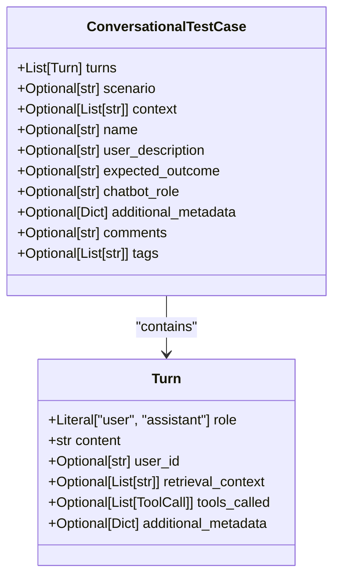
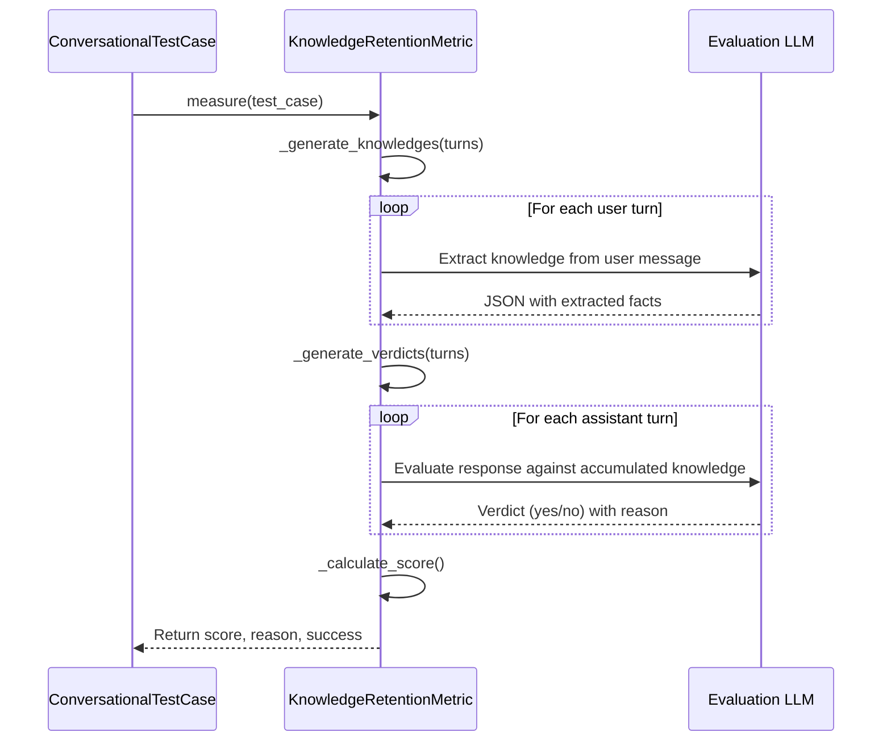
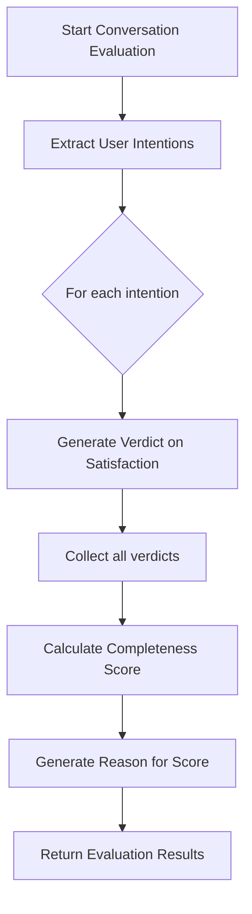
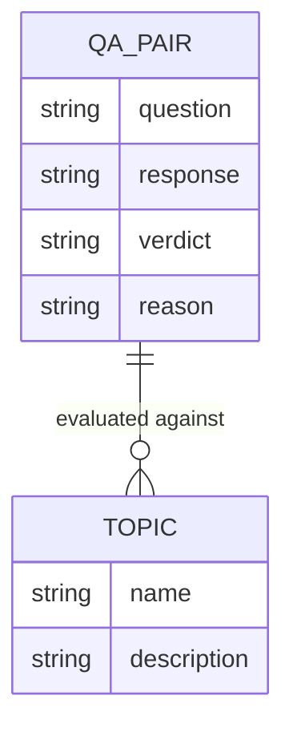
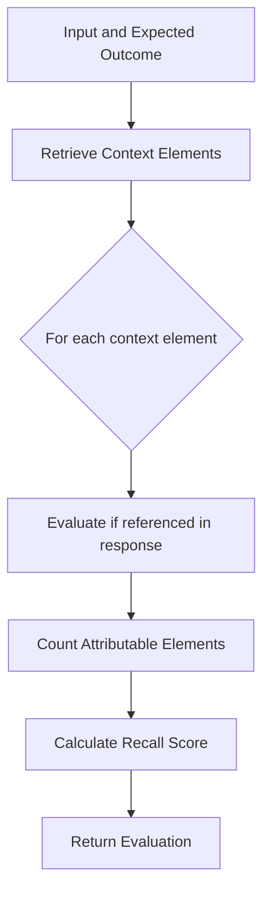
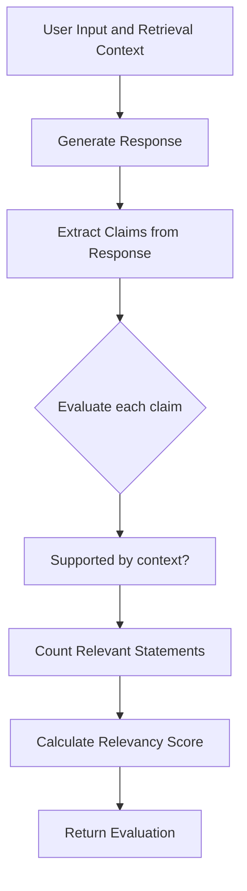
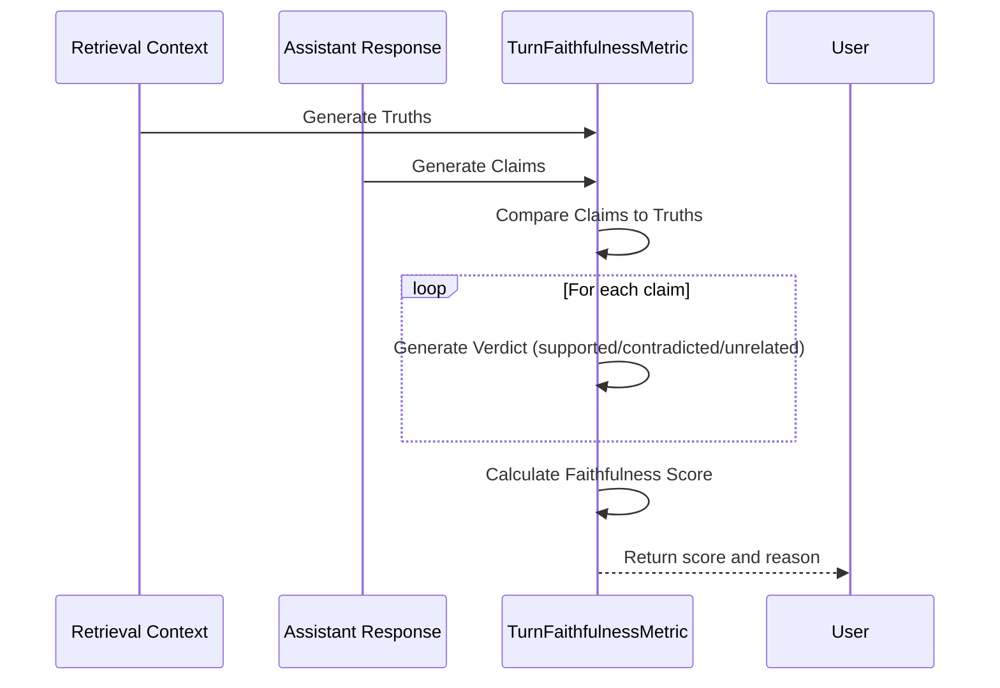

# Conversational Metrics

<cite>
**Referenced Files in This Document**   
- [conversational_test_case.py](file://deepeval/test_case/conversational_test_case.py)
- [knowledge_retention.py](file://deepeval/metrics/knowledge_retention/knowledge_retention.py)
- [conversation_completeness.py](file://deepeval/metrics/conversation_completeness/conversation_completeness.py)
- [topic_adherence.py](file://deepeval/metrics/topic_adherence/topic_adherence.py)
- [turn_contextual_precision.py](file://deepeval/metrics/turn_contextual_precision/turn_contextual_precision.py)
- [turn_contextual_recall.py](file://deepeval/metrics/turn_contextual_recall/turn_contextual_recall.py)
- [turn_contextual_relevancy.py](file://deepeval/metrics/turn_contextual_relevancy/turn_contextual_relevancy.py)
- [turn_faithfulness.py](file://deepeval/metrics/turn_faithfulness/turn_faithfulness.py)
- [turn_relevancy.py](file://deepeval/metrics/turn_relevancy/turn_relevancy.py)
- [base_metric.py](file://deepeval/metrics/base_metric.py)
- [utils.py](file://deepeval/metrics/utils.py)
</cite>

## Table of Contents
1. [Introduction](#introduction)
2. [Domain Model](#domain-model)
3. [Core Metrics](#core-metrics)
   - [Knowledge Retention](#knowledge-retention)
   - [Conversation Completeness](#conversation-completeness)
   - [Topic Adherence](#topic-adherence)
4. [Turn-Level Metrics](#turn-level-metrics)
   - [Turn Contextual Precision](#turn-contextual-precision)
   - [Turn Contextual Recall](#turn-contextual-recall)
   - [Turn Contextual Relevancy](#turn-contextual-relevancy)
   - [Turn Faithfulness](#turn-faithfulness)
   - [Turn Relevancy](#turn-relevancy)
5. [Configuration Options](#configuration-options)
6. [Common Issues and Solutions](#common-issues-and-solutions)
7. [Best Practices](#best-practices)
8. [Performance Considerations](#performance-considerations)
9. [Conclusion](#conclusion)

## Introduction
DeepEval's multi-turn dialogue evaluation capabilities provide a comprehensive framework for assessing chatbot performance across extended conversations. This document details the implementation of key conversational metrics that evaluate dialogue coherence, information retention, and topic consistency. The metrics are designed to work with the `ConversationalTestCase` interface and integrate seamlessly with the evaluation engine. These metrics analyze conversations through multiple dimensions including knowledge retention across turns, completeness of conversation in addressing user intentions, adherence to relevant topics, and various turn-level assessments of contextual precision, recall, relevancy, faithfulness, and relevancy.

**Section sources**
- [conversational_test_case.py](file://deepeval/test_case/conversational_test_case.py#L1-L267)
- [knowledge_retention.py](file://deepeval/metrics/knowledge_retention/knowledge_retention.py#L1-L335)

## Domain Model
The conversational evaluation framework in DeepEval is built around a well-defined domain model that captures the essential elements of multi-turn dialogues. At the core of this model is the `ConversationalTestCase` class, which represents a complete conversation between a user and a chatbot. Each conversation consists of a sequence of `Turn` objects, where each turn captures the role (user or assistant), content, and additional metadata such as retrieval context and tools called.

The domain model includes several key inputs that are essential for comprehensive evaluation:
- `previous_turns`: The history of conversation turns that precede the current turn, providing context for evaluating coherence and information retention
- `current_turn`: The specific turn being evaluated, containing the role, content, and metadata
- `conversation_history`: The complete sequence of turns that make up the conversation, used for holistic assessment of dialogue flow and consistency

The evaluation outputs include standardized metrics such as `score` (a numerical value between 0 and 1 indicating performance), `reason` (an explanation for the score), and `success` (a boolean indicating whether the evaluation threshold was met). These outputs enable both quantitative assessment and qualitative understanding of chatbot performance.



**Diagram sources **
- [conversational_test_case.py](file://deepeval/test_case/conversational_test_case.py#L131-L162)
- [conversational_test_case.py](file://deepeval/test_case/conversational_test_case.py#L36-L60)

**Section sources**
- [conversational_test_case.py](file://deepeval/test_case/conversational_test_case.py#L1-L267)

## Core Metrics

### Knowledge Retention
The Knowledge Retention metric evaluates a chatbot's ability to maintain and utilize information across multiple conversation turns. This metric is crucial for assessing dialogue coherence and preventing information loss in extended interactions. The implementation follows a three-step process: first, it extracts factual information from user messages using the `_generate_knowledges` method; second, it evaluates whether the assistant's responses contradict or forget previously established facts using the `_generate_verdicts` method; and finally, it calculates an overall score based on the proportion of turns where knowledge was properly retained.

The metric uses a specialized template system to generate prompts that extract structured knowledge from user messages and evaluate assistant responses against accumulated knowledge. For example, if a user previously mentioned they are allergic to peanuts, the metric will flag any subsequent assistant response that fails to acknowledge this information or suggests peanut-containing foods. The evaluation considers both explicit contradictions and implicit forgetfulness, such as asking for information that was already provided.



**Diagram sources **
- [knowledge_retention.py](file://deepeval/metrics/knowledge_retention/knowledge_retention.py#L279-L306)
- [knowledge_retention.py](file://deepeval/metrics/knowledge_retention/knowledge_retention.py#L220-L249)

**Section sources**
- [knowledge_retention.py](file://deepeval/metrics/knowledge_retention/knowledge_retention.py#L27-L335)

### Conversation Completeness
The Conversation Completeness metric assesses whether a chatbot adequately addresses all user intentions expressed throughout a conversation. This metric first identifies user intentions using the `_extract_user_intentions` method, which analyzes the complete conversation to extract the primary goals and objectives mentioned by the user. Then, for each identified intention, it evaluates whether the conversation successfully addressed that intention using the `_generate_verdict` method.

The evaluation process considers the entire conversation flow rather than isolated turns, ensuring that the chatbot provides comprehensive responses that fully resolve user queries. For example, if a user asks for restaurant recommendations and then follows up with questions about dietary restrictions and price range, the metric evaluates whether the chatbot addressed all these aspects in its responses. The final score represents the proportion of user intentions that were successfully addressed, with a threshold determining whether the conversation is considered complete.



**Diagram sources **
- [conversation_completeness.py](file://deepeval/metrics/conversation_completeness/conversation_completeness.py#L248-L277)
- [conversation_completeness.py](file://deepeval/metrics/conversation_completeness/conversation_completeness.py#L88-L95)

**Section sources**
- [conversation_completeness.py](file://deepeval/metrics/conversation_completeness/conversation_completeness.py#L30-L305)

### Topic Adherence
The Topic Adherence metric evaluates a chatbot's ability to stay focused on relevant topics throughout a conversation. This metric analyzes the conversation by breaking it into question-answer pairs and assessing whether each response remains on-topic relative to the conversation's relevant topics. The implementation uses the `_get_qa_pairs` method to extract question-answer interactions from the conversation and the `_get_qa_verdict` method to evaluate each pair's relevance.

The metric employs a truth table approach, classifying each question-answer pair as True Positive (relevant response to relevant question), True Negative (appropriate response to irrelevant question), False Positive (irrelevant response to relevant question), or False Negative (relevant response to relevant question that was missed). The final score is calculated as the proportion of correct classifications, providing a comprehensive assessment of the chatbot's topic consistency. This metric is particularly valuable for preventing chatbots from going off-topic or introducing irrelevant information.



**Diagram sources **
- [topic_adherence.py](file://deepeval/metrics/topic_adherence/topic_adherence.py#L283-L304)
- [topic_adherence.py](file://deepeval/metrics/topic_adherence/topic_adherence.py#L259-L270)

**Section sources**
- [topic_adherence.py](file://deepeval/metrics/topic_adherence/topic_adherence.py#L25-L342)

## Turn-Level Metrics

### Turn Contextual Precision
The Turn Contextual Precision metric evaluates whether the information retrieved by a chatbot is precisely relevant to the user's query within each turn. This metric assesses the quality of retrieval by examining whether each retrieved context element directly supports the assistant's response. The implementation uses a sliding window approach with configurable `window_size` to evaluate sequences of turns, ensuring context is considered across multiple interactions.

For each window of turns, the metric generates verdicts on whether retrieved context elements are necessary and relevant to the conversation. It uses a weighted precision calculation that gives higher weight to relevant elements retrieved earlier in the sequence. The evaluation considers both the presence of relevant information and the absence of irrelevant information in the retrieval context. This metric is particularly important for RAG (Retrieval-Augmented Generation) systems where retrieval quality directly impacts response quality.


**Diagram sources **
- [turn_contextual_precision.py](file://deepeval/metrics/turn_contextual_precision/turn_contextual_precision.py#L97-L102)
- [turn_contextual_precision.py](file://deepeval/metrics/turn_contextual_precision/turn_contextual_precision.py#L228-L261)

**Section sources**
- [turn_contextual_precision.py](file://deepeval/metrics/turn_contextual_precision/turn_contextual_precision.py#L32-L593)

### Turn Contextual Recall
The Turn Contextual Recall metric evaluates whether a chatbot retrieves all relevant information necessary to answer a user's query within each turn. While precision focuses on the relevance of retrieved information, recall focuses on the completeness of retrieval. This metric assesses whether the chatbot has missed any important context elements that should have been retrieved to provide a comprehensive response.

The implementation follows a similar sliding window approach to contextual precision but evaluates the opposite aspect of retrieval quality. For each turn, it examines whether all relevant information from the retrieval context was utilized in the assistant's response. The score represents the proportion of relevant context elements that were properly referenced or incorporated into the response. This metric helps identify cases where chatbots provide incomplete answers due to insufficient retrieval, even when the retrieved information is highly relevant.



**Diagram sources **
- [turn_contextual_recall.py](file://deepeval/metrics/turn_contextual_recall/turn_contextual_recall.py#L96-L101)
- [turn_contextual_recall.py](file://deepeval/metrics/turn_contextual_recall/turn_contextual_recall.py#L225-L254)

**Section sources**
- [turn_contextual_recall.py](file://deepeval/metrics/turn_contextual_recall/turn_contextual_recall.py#L32-L564)

### Turn Contextual Relevancy
The Turn Contextual Relevancy metric evaluates whether the information in a chatbot's response is relevant to both the user's query and the retrieved context. This metric combines aspects of precision and recall by assessing whether the response content is supported by the retrieved context and directly addresses the user's needs. The implementation generates verdicts for each context element, determining whether statements in the response are supported by the context.

The evaluation process separates relevant and irrelevant statements in the response, providing detailed feedback on which parts of the response are well-supported and which are not. The final score represents the proportion of response content that is contextually relevant. This metric is particularly valuable for identifying hallucinations or unsupported claims in chatbot responses, ensuring that answers are grounded in the provided context.



**Diagram sources **
- [turn_contextual_relevancy.py](file://deepeval/metrics/turn_contextual_relevancy/turn_contextual_relevancy.py#L96-L101)
- [turn_contextual_relevancy.py](file://deepeval/metrics/turn_contextual_relevancy/turn_contextual_relevancy.py#L251-L258)

**Section sources**
- [turn_contextual_relevancy.py](file://deepeval/metrics/turn_contextual_relevancy/turn_contextual_relevancy.py#L32-L577)

### Turn Faithfulness
The Turn Faithfulness metric evaluates whether a chatbot's responses are factually consistent with the retrieved context and do not introduce unsupported information. This metric is crucial for ensuring the reliability and trustworthiness of chatbot responses. The implementation follows a three-step process: first, it extracts "truths" from the retrieval context using the `_generate_truths` method; second, it identifies "claims" made in the assistant's response using the `_generate_claims` method; and third, it evaluates whether each claim is supported by the truths using the `_generate_verdicts` method.

The evaluation considers both explicit contradictions and unsupported assertions, penalizing responses that introduce information not present in the context. The metric includes a `penalize_ambiguous_claims` configuration option that allows stricter evaluation by penalizing responses that are evasive or non-committal when definitive answers are possible. This metric is essential for preventing hallucinations and ensuring that chatbot responses are grounded in factual information.



**Diagram sources **
- [turn_faithfulness.py](file://deepeval/metrics/turn_faithfulness/turn_faithfulness.py#L268-L288)
- [turn_faithfulness.py](file://deepeval/metrics/turn_faithfulness/turn_faithfulness.py#L313-L318)
- [turn_faithfulness.py](file://deepeval/metrics/turn_faithfulness/turn_faithfulness.py#L360-L365)

**Section sources**
- [turn_faithfulness.py](file://deepeval/metrics/turn_faithfulness/turn_faithfulness.py#L34-L628)

### Turn Relevancy
The Turn Relevancy metric evaluates whether each message in a conversation is relevant to the ongoing dialogue. This metric assesses the coherence and focus of the conversation by examining whether each turn contributes meaningfully to the discussion. The implementation uses a sliding window approach with configurable `window_size` to evaluate sequences of turns, ensuring that relevance is assessed in context.

For each window of turns, the metric generates a verdict on whether the conversation remains on track and each message is appropriate given the preceding context. The evaluation considers conversational flow, topic consistency, and response appropriateness. The final score represents the proportion of turns that were deemed relevant, providing a measure of overall conversation quality. This metric helps identify digressions, irrelevant responses, or conversational dead-ends that degrade user experience.

```mermaid
flowchart LR
A[Sliding Window of Turns] --> B[Analyze Conversation Flow]
B --> C[Generate Relevancy Verdict]
C --> D{Verdict = "no"?}
D --> |Yes| E[Record Reason for Irrelevancy]
D --> |No| F[Continue]
F --> G[Calculate Relevancy Score]
G --> H[Return Evaluation]
```

**Diagram sources **
- [turn_relevancy.py](file://deepeval/metrics/turn_relevancy/turn_relevancy.py#L84-L89)
- [turn_relevancy.py](file://deepeval/metrics/turn_relevancy/turn_relevancy.py#L214-L218)

**Section sources**
- [turn_relevancy.py](file://deepeval/metrics/turn_relevancy/turn_relevancy.py#L30-L271)

## Configuration Options
DeepEval's conversational metrics provide several configuration options to customize evaluation behavior. The `threshold` parameter (default: 0.5) determines the minimum score required for a test to be considered successful. The `model` parameter allows specifying a custom LLM for evaluation, enabling organizations to use their preferred models for assessment. The `include_reason` parameter (default: True) controls whether detailed explanations are generated for evaluation scores.

The `async_mode` parameter (default: True) enables asynchronous evaluation for improved performance when processing multiple test cases. The `strict_mode` parameter (default: False) enforces stricter evaluation criteria, where scores below the threshold are set to 0. The `verbose_mode` parameter (default: False) controls the level of detail in evaluation logs, useful for debugging and analysis.

For turn-level metrics, the `window_size` parameter (default: 10) configures the number of turns considered in each sliding window evaluation, allowing adjustment based on conversation length and complexity. The `evaluation_template` parameter allows customization of the prompt templates used for evaluation, enabling domain-specific adaptations. Additionally, metrics like Turn Faithfulness include specialized parameters such as `penalize_ambiguous_claims` to fine-tune evaluation criteria for specific use cases.

**Section sources**
- [knowledge_retention.py](file://deepeval/metrics/knowledge_retention/knowledge_retention.py#L30-L38)
- [conversation_completeness.py](file://deepeval/metrics/conversation_completeness/conversation_completeness.py#L33-L42)
- [turn_contextual_precision.py](file://deepeval/metrics/turn_contextual_precision/turn_contextual_precision.py#L40-L52)

## Common Issues and Solutions
One common issue in long conversations is context drift, where chatbots gradually deviate from the original topic or lose track of previously established information. This can be addressed by using the Knowledge Retention and Topic Adherence metrics to identify specific points where the conversation diverges. Implementing regular context summarization and explicit topic confirmation can help maintain focus.

Another issue is information overload in retrieval, where chatbots retrieve excessive context that dilutes response quality. This can be mitigated by tuning the Turn Contextual Precision and Recall metrics to find the optimal balance between comprehensive retrieval and focused responses. Implementing query rewriting and retrieval filtering can also improve precision.

Performance degradation in lengthy dialogues often occurs due to increasing context length, which can overwhelm the model's capacity. Solutions include implementing context window management, periodic summarization, and hierarchical context organization. The sliding window approach used in turn-level metrics naturally addresses this by focusing evaluation on relevant context segments.

Hallucinations and factual inconsistencies can be reduced by strengthening the Turn Faithfulness metric and ensuring high-quality retrieval sources. Implementing fact-checking layers and confidence scoring can further improve response reliability. For multimodal conversations, special attention should be paid to proper integration of visual and textual information to prevent misinterpretation.

**Section sources**
- [knowledge_retention.py](file://deepeval/metrics/knowledge_retention/knowledge_retention.py#L251-L278)
- [topic_adherence.py](file://deepeval/metrics/topic_adherence/topic_adherence.py#L283-L304)
- [turn_faithfulness.py](file://deepeval/metrics/turn_faithfulness/turn_faithfulness.py#L268-L288)

## Best Practices
For effective chatbot evaluation, establish a comprehensive test suite that includes diverse conversation scenarios covering various user intents, topics, and complexity levels. Use historical conversations, manually generated dialogues, and simulated interactions to create a robust evaluation dataset. When evaluating multi-turn conversations, ensure consistency by testing different chatbot versions on the same set of scenarios to identify regressions.

Configure evaluation thresholds based on business requirements and risk tolerance, with stricter thresholds for high-stakes applications like healthcare or finance. Combine multiple metrics to get a holistic view of performance, as no single metric captures all aspects of conversational quality. Regularly review evaluation results and update test cases to reflect evolving user needs and chatbot capabilities.

Implement continuous evaluation in development workflows, running assessments with each code change to catch issues early. Use the detailed reasons provided by metrics to guide chatbot improvements, focusing on the most critical failure patterns. For production monitoring, establish baseline performance metrics and set up alerts for significant deviations.

**Section sources**
- [conversation_completeness.py](file://deepeval/metrics/conversation_completeness/conversation_completeness.py#L85-L87)
- [topic_adherence.py](file://deepeval/metrics/topic_adherence/topic_adherence.py#L81-L87)
- [turn_contextual_precision.py](file://deepeval/metrics/turn_contextual_precision/turn_contextual_precision.py#L96-L105)

## Performance Considerations
Evaluating lengthy dialogues can be computationally intensive due to the multiple LLM calls required for comprehensive assessment. The asynchronous mode (`async_mode=True`) significantly improves performance by parallelizing evaluation tasks. For large-scale evaluation, consider implementing batching and distributed processing to handle high volumes of test cases efficiently.

The sliding window approach used in turn-level metrics helps manage computational complexity by focusing evaluation on relevant context segments rather than the entire conversation history. However, larger window sizes increase processing time, so balance evaluation thoroughness with performance requirements. The `window_size` parameter should be tuned based on typical conversation length and available computational resources.

Caching can be leveraged to avoid redundant evaluations when testing similar conversations or iterating on chatbot improvements. The evaluation engine's cost tracking feature helps monitor resource usage and optimize the evaluation process. For real-time applications, consider implementing sampling strategies that evaluate a representative subset of conversations rather than every interaction.

**Section sources**
- [turn_contextual_precision.py](file://deepeval/metrics/turn_contextual_precision/turn_contextual_precision.py#L162-L173)
- [turn_contextual_recall.py](file://deepeval/metrics/turn_contextual_recall/turn_contextual_recall.py#L162-L173)
- [turn_contextual_relevancy.py](file://deepeval/metrics/turn_contextual_relevancy/turn_contextual_relevancy.py#L162-L172)

## Conclusion
DeepEval's multi-turn dialogue evaluation capabilities provide a comprehensive framework for assessing chatbot performance across extended conversations. The suite of metrics—including Knowledge Retention, Conversation Completeness, Topic Adherence, and various turn-level assessments—enables thorough evaluation of dialogue coherence, information retention, and topic consistency. By leveraging the `ConversationalTestCase` interface and integrating with the evaluation engine, these metrics offer a robust solution for ensuring high-quality conversational AI systems.

The domain model with its clear inputs and outputs facilitates consistent evaluation, while configurable parameters allow customization for specific use cases. Addressing common issues like context drift through targeted metrics and implementing best practices for comprehensive testing ensures reliable assessment of chatbot performance. With proper performance optimization, these evaluation capabilities can be effectively deployed in both development and production environments to maintain and improve conversational AI quality.