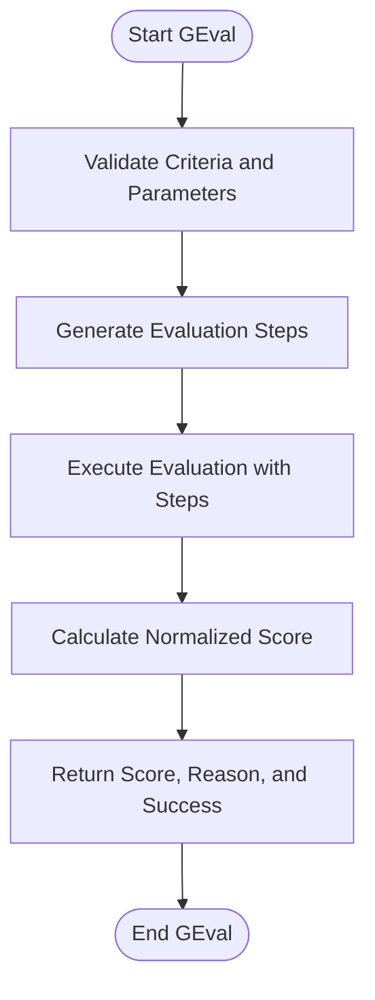

# Custom Metrics

<cite>
**Referenced Files in This Document**   
- [base_metric.py](file://deepeval/metrics/base_metric.py)
- [g_eval.py](file://deepeval/metrics/g_eval/g_eval.py)
- [arena_g_eval.py](file://deepeval/metrics/arena_g_eval/arena_g_eval.py)
- [dag.py](file://deepeval/metrics/dag/dag.py)
- [conversational_g_eval.py](file://deepeval/metrics/conversational_g_eval/conversational_g_eval.py)
- [conversational_dag.py](file://deepeval/metrics/conversational_dag/conversational_dag.py)
- [template.py](file://deepeval/metrics/g_eval/template.py)
- [arena_g_eval/template.py](file://deepeval/metrics/arena_g_eval/template.py)
- [conversational_g_eval/template.py](file://deepeval/metrics/conversational_g_eval/template.py)
- [utils.py](file://deepeval/metrics/g_eval/utils.py)
</cite>

## Table of Contents
1. [Introduction](#introduction)
2. [Domain Model](#domain-model)
3. [GEval Implementation](#geval-implementation)
4. [ArenaGEval Implementation](#arenageval-implementation)
5. [DAG-Based Metrics](#dag-based-metrics)
6. [Configuration Options](#configuration-options)
7. [Common Issues and Solutions](#common-issues-and-solutions)
8. [Best Practices](#best-practices)
9. [Performance Considerations](#performance-considerations)

## Introduction
DeepEval's flexible evaluation framework provides a powerful system for creating custom metrics through various approaches including GEval, ArenaGEval, and DAG-based metrics. These metrics leverage the LLM-as-a-judge paradigm to evaluate AI system outputs based on customizable criteria. The framework allows users to define evaluation logic through natural language criteria, structured evaluation steps, or complex graph-based workflows. This document details the implementation and usage of these custom metrics, focusing on their invocation through the BaseMetric interface and integration with the evaluation engine.

## Domain Model
The custom metrics framework in DeepEval revolves around a consistent domain model that defines the inputs, processing, and outputs of evaluation metrics. Each metric operates on test cases and produces standardized evaluation results.

### Inputs
The framework accepts several key inputs that define the evaluation context:

- **Criteria**: Natural language description of what should be evaluated (e.g., "The response should be concise and directly answer the question")
- **Model**: The LLM judge used for evaluation, which can be specified by name or as a DeepEvalBaseLLM instance
- **Evaluation_params**: Parameters from the test case to include in the evaluation (e.g., input, actual_output, expected_output)
- **Threshold**: The minimum score required for a successful evaluation
- **Evaluation_steps**: Optional pre-defined steps for the evaluation process

### Outputs
Each metric produces a standardized set of outputs:

- **Score**: A float value between 0 and 1 representing the evaluation result
- **Reason**: A textual explanation for the score
- **Success**: Boolean indicating whether the evaluation passed (score >= threshold)
- **Error**: Optional error message if the evaluation failed

**Section sources**
- [base_metric.py](file://deepeval/metrics/base_metric.py#L13-L30)
- [g_eval.py](file://deepeval/metrics/g_eval/g_eval.py#L40-L56)

## GEval Implementation
GEval is a flexible evaluation framework that uses LLMs as judges to assess the quality of AI system outputs based on customizable criteria. It follows the methodology outlined in the GEval research paper and provides both standard and conversational variants.

### Standard GEval
The standard GEval metric evaluates single-turn interactions and follows a two-phase process:

1. **Evaluation Steps Generation**: The LLM judge generates 3-4 concise evaluation steps based on the provided criteria
2. **Evaluation Execution**: The same LLM judge applies these steps to assess the response and generate a score and reason

**Diagram sources**
- [g_eval.py](file://deepeval/metrics/g_eval/g_eval.py#L79-L213)
- [template.py](file://deepeval/metrics/g_eval/template.py#L15-L36)

### Conversational GEval
The conversational variant extends GEval to handle multi-turn dialogues by considering turn-specific parameters such as content, role, tools called, and retrieval context. It evaluates the overall conversation quality rather than individual responses.

**Diagram sources**
- [conversational_g_eval.py](file://deepeval/metrics/conversational_g_eval/conversational_g_eval.py#L87-L145)
- [conversational_g_eval/template.py](file://deepeval/metrics/conversational_g_eval/template.py#L6-L21)

**Section sources**
- [g_eval.py](file://deepeval/metrics/g_eval/g_eval.py#L40-L56)
- [conversational_g_eval.py](file://deepeval/metrics/conversational_g_eval/conversational_g_eval.py#L38-L55)

## ArenaGEval Implementation
ArenaGEval extends the GEval framework to handle competitive evaluations where multiple AI systems (contestants) are compared against each other to determine a winner based on specified criteria.

### Architecture
ArenaGEval follows a three-step process:

1. **Evaluation Steps Generation**: Generate criteria-based evaluation steps (similar to standard GEval)
2. **Winner Selection**: The LLM judge selects the best contestant based on the evaluation steps
3. **Reason Rewriting**: Convert anonymized contestant names back to their real names in the explanation

**Diagram sources**
- [arena_g_eval.py](file://deepeval/metrics/arena_g_eval/arena_g_eval.py#L63-L116)
- [arena_g_eval/template.py](file://deepeval/metrics/arena_g_eval/template.py#L38-L92)

### Key Features
- **Anonymized Evaluation**: Contestants are referred to by dummy names during evaluation to prevent bias
- **Comparative Judging**: The LLM judge must compare all contestants against each other
- **Name Rewriting**: The final reason is processed to replace dummy names with real contestant names
- **Flexible Criteria**: Supports any comparative evaluation criteria (e.g., "Which response is more helpful?")

**Section sources**
- [arena_g_eval.py](file://deepeval/metrics/arena_g_eval/arena_g_eval.py#L36-L62)
- [arena_g_eval/template.py](file://deepeval/metrics/arena_g_eval/template.py#L5-L134)

## DAG-Based Metrics
DAG-based metrics provide a powerful way to create complex evaluation workflows by defining directed acyclic graphs of evaluation nodes. This approach allows for sophisticated evaluation logic that combines multiple metrics and conditional branching.

### Graph Structure
The DAG framework consists of several node types that can be connected to form evaluation workflows:

- **TaskNode**: Executes a specific task or metric
- **VerdictNode**: Makes a binary decision based on conditions
- **BinaryJudgementNode**: Performs a binary evaluation (pass/fail)
- **NonBinaryJudgementNode**: Performs a non-binary evaluation with multiple outcomes

**Diagram sources**
- [dag.py](file://deepeval/metrics/dag/dag.py#L24-L57)
- [dag/nodes.py](file://deepeval/metrics/dag/nodes.py)

### Implementation
The DAGMetric class orchestrates the execution of the graph by:

1. Validating the graph structure to ensure no cycles exist
2. Executing nodes in topological order
3. Propagating results through the graph
4. Calculating the final score based on leaf node outputs

**Diagram sources**
- [dag.py](file://deepeval/metrics/dag/dag.py#L58-L104)
- [dag/graph.py](file://deepeval/metrics/dag/graph.py)

**Section sources**
- [dag.py](file://deepeval/metrics/dag/dag.py#L24-L57)
- [dag/nodes.py](file://deepeval/metrics/dag/nodes.py)

## Configuration Options
The custom metrics framework provides extensive configuration options to tailor the evaluation process to specific needs.

### LLM Judges
Users can specify the LLM judge in several ways:
- By model name (e.g., "gpt-4", "claude-3")
- By providing a DeepEvalBaseLLM instance
- Using the default model configured in the system settings

### Custom Prompts
The framework allows customization of evaluation prompts through:
- Overriding the evaluation_template parameter
- Creating custom template classes that extend the base templates
- Modifying the prompt generation methods

### Graph Structures
For DAG-based metrics, users can define complex graph structures with:
- Multiple root nodes for parallel evaluation
- Conditional branching based on intermediate results
- Custom aggregation logic for combining node outputs

**Section sources**
- [g_eval.py](file://deepeval/metrics/g_eval/g_eval.py#L48-L56)
- [arena_g_eval.py](file://deepeval/metrics/arena_g_eval/arena_g_eval.py#L52-L61)
- [dag.py](file://deepeval/metrics/dag/dag.py#L49-L56)

## Common Issues and Solutions
### Criterion Ambiguity
**Issue**: Vague or ambiguous criteria can lead to inconsistent evaluations.

**Solution**: Use specific, measurable criteria and consider providing evaluation steps explicitly. For example, instead of "The response should be good," use "The response should contain at least three supporting facts and be under 100 words."

### Overfitting to Evaluation Criteria
**Issue**: Models may optimize for the evaluation criteria rather than genuine quality improvement.

**Solution**: Use multiple evaluation metrics with diverse criteria and periodically update the evaluation criteria to prevent gaming the system.

### LLM Judge Inconsistency
**Issue**: LLM judges may produce inconsistent evaluations across similar cases.

**Solution**: 
- Use higher temperature settings for more consistent outputs
- Implement multiple-judge consensus approaches
- Apply post-processing to normalize scores

**Section sources**
- [g_eval.py](file://deepeval/metrics/g_eval/g_eval.py#L57-L58)
- [utils.py](file://deepeval/metrics/g_eval/utils.py#L56-L75)

## Best Practices
### Creating Effective Custom Metrics
1. **Start with Clear Criteria**: Define specific, measurable evaluation criteria in natural language
2. **Use Rubrics for Graded Evaluation**: Implement rubrics with score ranges and expected outcomes for more nuanced assessments
3. **Validate Evaluation Steps**: Review the automatically generated evaluation steps to ensure they align with your intent
4. **Test with Edge Cases**: Evaluate your custom metric with edge cases to ensure robustness

### Performance Optimization
1. **Cache Evaluation Results**: Store results of expensive evaluations to avoid recomputation
2. **Use Appropriate Model Sizes**: Select LLM judge models that balance cost and accuracy requirements
3. **Batch Evaluations**: Process multiple test cases in parallel when possible
4. **Monitor Evaluation Costs**: Track the computational cost of evaluations, especially when using commercial LLM APIs

**Section sources**
- [g_eval.py](file://deepeval/metrics/g_eval/g_eval.py#L61-L63)
- [utils.py](file://deepeval/metrics/g_eval/utils.py#L77-L97)

## Performance Considerations
When using LLM-as-a-judge approaches, several performance factors should be considered:

### Cost Management
- **Native Models**: Using DeepEval's native models can reduce costs compared to commercial APIs
- **Log Probabilities**: Models that support log probabilities enable more sophisticated scoring but may have higher costs
- **Async Execution**: The framework supports async mode for improved throughput when evaluating multiple test cases

### Latency Optimization
- **Pre-generated Steps**: Provide evaluation_steps explicitly to avoid the overhead of step generation
- **Model Selection**: Choose faster models for high-volume evaluation scenarios
- **Parallel Processing**: Leverage the async_mode capability to process multiple evaluations concurrently

### Scalability
The framework is designed to scale with evaluation needs:
- **Modular Design**: Metrics can be composed and reused across different evaluation scenarios
- **Configurable Thresholds**: Adjust thresholds based on the required level of strictness
- **Extensible Architecture**: Custom metrics can extend the base classes to implement specialized evaluation logic

**Section sources**
- [g_eval.py](file://deepeval/metrics/g_eval/g_eval.py#L100-L101)
- [base_metric.py](file://deepeval/metrics/base_metric.py#L21-L22)
- [dag.py](file://deepeval/metrics/dag/dag.py#L76-L77)