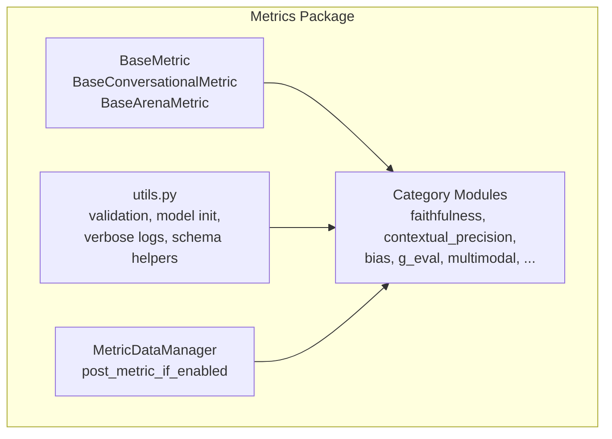
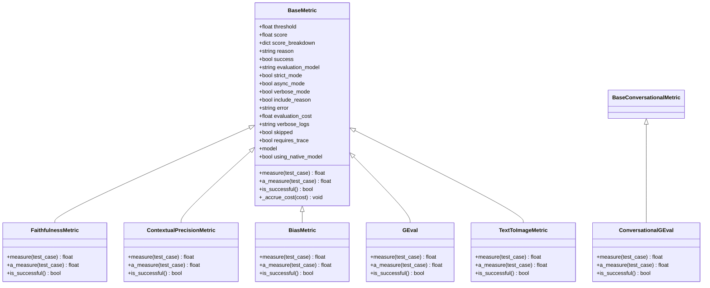
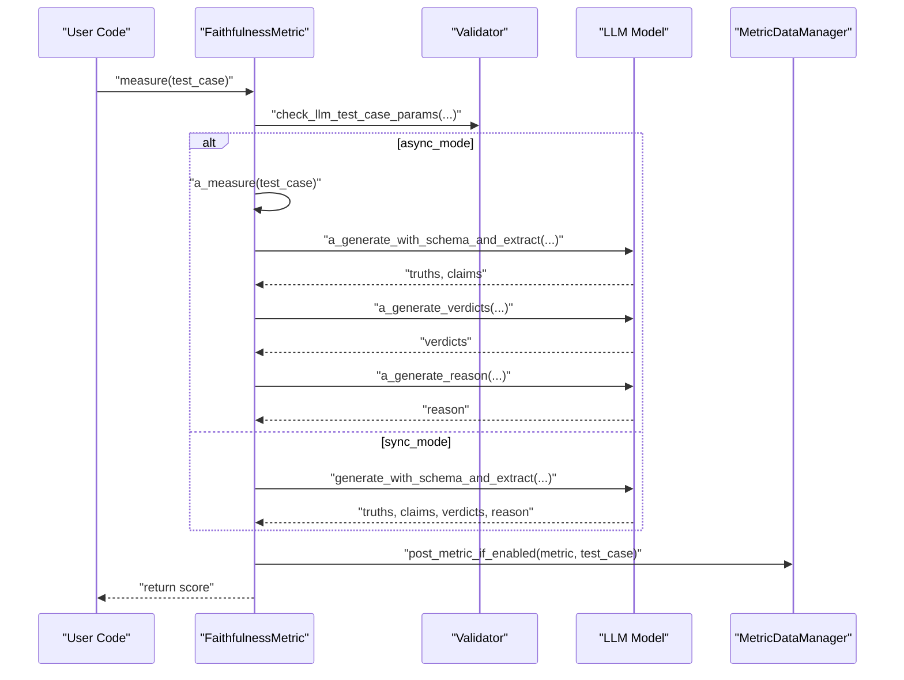
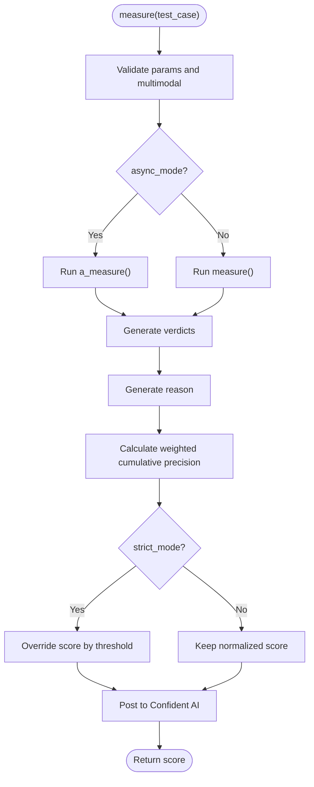
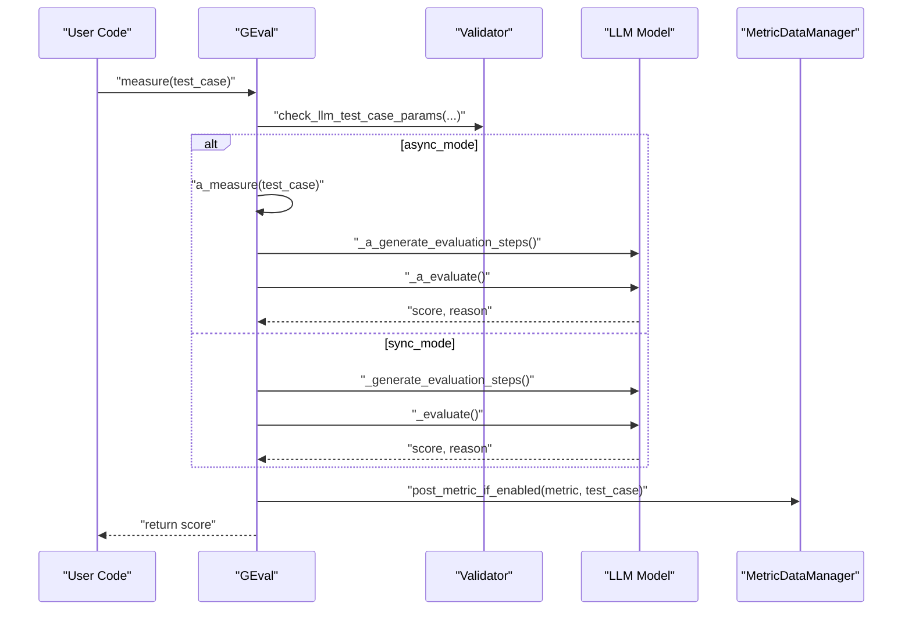
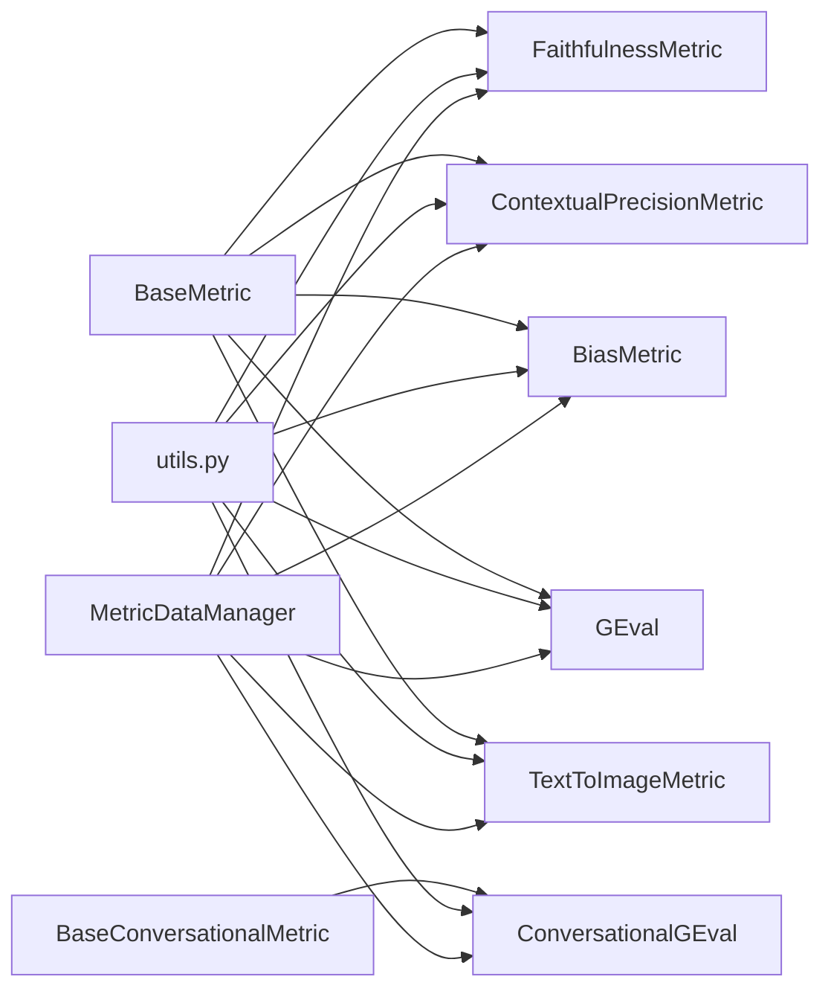

# Metrics System

<cite>
**Referenced Files in This Document**
- [base_metric.py](file://deepeval/metrics/base_metric.py)
- [__init__.py](file://deepeval/metrics/__init__.py)
- [api.py](file://deepeval/metrics/api.py)
- [utils.py](file://deepeval/metrics/utils.py)
- [faithfulness.py](file://deepeval/metrics/faithfulness/faithfulness.py)
- [contextual_precision.py](file://deepeval/metrics/contextual_precision/contextual_precision.py)
- [bias.py](file://deepeval/metrics/bias/bias.py)
- [g_eval.py](file://deepeval/metrics/g_eval/g_eval.py)
- [conversational_g_eval.py](file://deepeval/metrics/conversational_g_eval/conversational_g_eval.py)
- [text_to_image.py](file://deepeval/metrics/multimodal_metrics/text_to_image/text_to_image.py)
- [test_example.py](file://examples/getting_started/test_example.py)
- [test_faithfulness_metric.py](file://tests/test_metrics/test_faithfulness_metric.py)
- [metrics-introduction.mdx](file://docs/docs/metrics-introduction.mdx)
- [metrics-contextual-relevancy.mdx](file://docs/docs/metrics-contextual-relevancy.mdx)
- [metrics-custom.mdx](file://docs/docs/metrics-custom.mdx)
- [DEEPEVAL_METRICS_GUIDE.md](file://ai_docs/DEEPEVAL_METRICS_GUIDE.md)
</cite>

## Table of Contents
1. [Introduction](#introduction)
2. [Project Structure](#project-structure)
3. [Core Components](#core-components)
4. [Architecture Overview](#architecture-overview)
5. [Detailed Component Analysis](#detailed-component-analysis)
6. [Dependency Analysis](#dependency-analysis)
7. [Performance Considerations](#performance-considerations)
8. [Troubleshooting Guide](#troubleshooting-guide)
9. [Conclusion](#conclusion)
10. [Appendices](#appendices)

## Introduction
DeepEval’s metrics system is a comprehensive evaluation framework designed to assess Large Language Model (LLM) applications across diverse scenarios. It provides a modular architecture with 40+ built-in metrics covering Retrieval-Augmented Generation (RAG), safety, agent capabilities, conversational quality, multimodal evaluation, and custom evaluation via GEval. The system emphasizes:
- Modular design with specialized metric categories
- A unified BaseMetric abstraction for consistent behavior
- Public interfaces for configuration, execution, and result interpretation
- Practical examples for common evaluation workflows
- Guidance on metric selection, performance, and custom metric development

## Project Structure
The metrics system is organized by category under the metrics package, with each metric encapsulating its own logic and templates. A central BaseMetric class defines the shared interface and lifecycle. Utilities provide shared helpers for model initialization, parameter validation, and verbose logging. An API module handles asynchronous metric data posting to Confident AI.

**Diagram sources**
- [base_metric.py](file://deepeval/metrics/base_metric.py#L13-L134)
- [__init__.py](file://deepeval/metrics/__init__.py#L1-L134)
- [api.py](file://deepeval/metrics/api.py#L1-L282)
- [utils.py](file://deepeval/metrics/utils.py#L1-L618)

**Section sources**
- [__init__.py](file://deepeval/metrics/__init__.py#L1-L134)
- [base_metric.py](file://deepeval/metrics/base_metric.py#L13-L134)
- [api.py](file://deepeval/metrics/api.py#L1-L282)
- [utils.py](file://deepeval/metrics/utils.py#L1-L618)

## Core Components
- BaseMetric: Defines the core interface for all metrics, including measure(), a_measure(), is_successful(), and shared attributes such as threshold, score, reason, success, evaluation_model, strict_mode, async_mode, verbose_mode, include_reason, error, evaluation_cost, verbose_logs, skipped, requires_trace, model, using_native_model, and cost accrual.
- BaseConversationalMetric: Specialized base for conversational evaluation workflows.
- BaseArenaMetric: Specialized base for arena-style comparisons.
- MetricDataManager: Asynchronous manager for posting metric data to Confident AI, with rate limiting and graceful shutdown handling.
- Shared utilities: Parameter validation, model initialization, verbose logging, and schema extraction helpers.

Key public attributes and behaviors:
- threshold: numeric threshold for pass/fail decisions
- score: computed metric score
- reason: optional explanation for the score
- success: boolean pass/fail outcome
- evaluation_model: name of the evaluation model used
- strict_mode: toggles binary scoring and threshold override
- async_mode: toggles concurrent execution
- verbose_mode: toggles verbose logs
- include_reason: toggles reason generation
- error: stores error messages
- evaluation_cost: accumulates cost when using native models
- verbose_logs: formatted verbose logs
- model and using_native_model: evaluation model configuration

**Section sources**
- [base_metric.py](file://deepeval/metrics/base_metric.py#L13-L134)
- [api.py](file://deepeval/metrics/api.py#L1-L282)
- [utils.py](file://deepeval/metrics/utils.py#L1-L618)

## Architecture Overview
The metrics system follows a layered architecture:
- Abstraction Layer: BaseMetric and derived bases
- Implementation Layer: Category-specific metrics (faithfulness, contextual precision, bias, GEval, multimodal, etc.)
- Utility Layer: Validation, model initialization, schema extraction, and verbose logging
- Integration Layer: MetricDataManager for asynchronous posting to Confident AI

**Diagram sources**
- [base_metric.py](file://deepeval/metrics/base_metric.py#L13-L134)
- [faithfulness.py](file://deepeval/metrics/faithfulness/faithfulness.py#L30-L356)
- [contextual_precision.py](file://deepeval/metrics/contextual_precision/contextual_precision.py#L28-L306)
- [bias.py](file://deepeval/metrics/bias/bias.py#L28-L296)
- [g_eval.py](file://deepeval/metrics/g_eval/g_eval.py#L40-L412)
- [conversational_g_eval.py](file://deepeval/metrics/conversational_g_eval/conversational_g_eval.py#L38-L421)
- [text_to_image.py](file://deepeval/metrics/multimodal_metrics/text_to_image/text_to_image.py#L32-L298)

## Detailed Component Analysis

### FaithfulnessMetric
Purpose: Evaluate faithfulness of answers against retrieved context, with optional penalties for ambiguous claims and configurable thresholds.

Key behaviors:
- Validates required parameters and multimodal constraints
- Supports synchronous and asynchronous measurement
- Generates truths, claims, verdicts, and reasons
- Applies strict_mode threshold override
- Accumulates evaluation cost when using native models
- Posts metric data to Confident AI when enabled

**Diagram sources**
- [faithfulness.py](file://deepeval/metrics/faithfulness/faithfulness.py#L63-L175)
- [utils.py](file://deepeval/metrics/utils.py#L399-L454)
- [api.py](file://deepeval/metrics/api.py#L59-L110)

**Section sources**
- [faithfulness.py](file://deepeval/metrics/faithfulness/faithfulness.py#L30-L356)
- [utils.py](file://deepeval/metrics/utils.py#L399-L454)
- [api.py](file://deepeval/metrics/api.py#L59-L110)

### ContextualPrecisionMetric
Purpose: Measure precision of retrieved context relative to expected output, returning a weighted cumulative precision score.

Key behaviors:
- Validates required parameters and multimodal constraints
- Supports synchronous and asynchronous measurement
- Generates verdicts and reasons
- Applies strict_mode threshold override
- Accumulates evaluation cost when using native models

**Diagram sources**
- [contextual_precision.py](file://deepeval/metrics/contextual_precision/contextual_precision.py#L56-L170)
- [utils.py](file://deepeval/metrics/utils.py#L399-L454)

**Section sources**
- [contextual_precision.py](file://deepeval/metrics/contextual_precision/contextual_precision.py#L28-L306)
- [utils.py](file://deepeval/metrics/utils.py#L399-L454)

### BiasMetric
Purpose: Detect presence of bias in model outputs by extracting opinions and generating verdicts.

Key behaviors:
- Validates required parameters and multimodal constraints
- Supports synchronous and asynchronous measurement
- Generates opinions, verdicts, and reasons
- Applies strict_mode threshold override
- Accumulates evaluation cost when using native models

**Section sources**
- [bias.py](file://deepeval/metrics/bias/bias.py#L28-L296)
- [utils.py](file://deepeval/metrics/utils.py#L399-L454)

### GEval (Custom Evaluation)
Purpose: Provide flexible, custom evaluation criteria with optional rubrics and evaluation steps.

Key behaviors:
- Validates criteria and evaluation steps
- Supports synchronous and asynchronous measurement
- Generates evaluation steps dynamically or uses provided steps
- Computes score using either raw responses or weighted summed scores
- Applies strict_mode threshold override
- Accumulates evaluation cost when using native models

**Diagram sources**
- [g_eval.py](file://deepeval/metrics/g_eval/g_eval.py#L79-L213)
- [utils.py](file://deepeval/metrics/utils.py#L399-L454)
- [api.py](file://deepeval/metrics/api.py#L59-L110)

**Section sources**
- [g_eval.py](file://deepeval/metrics/g_eval/g_eval.py#L40-L412)
- [utils.py](file://deepeval/metrics/utils.py#L399-L454)
- [api.py](file://deepeval/metrics/api.py#L59-L110)

### ConversationalGEval
Purpose: Evaluate conversational turns using GEval principles adapted for multi-turn dialog.

Key behaviors:
- Validates conversational test case parameters and multimodal constraints
- Supports synchronous and asynchronous measurement
- Generates evaluation steps and evaluates turns
- Computes score using either raw responses or weighted summed scores
- Applies strict_mode threshold override
- Accumulates evaluation cost when using native models

**Section sources**
- [conversational_g_eval.py](file://deepeval/metrics/conversational_g_eval/conversational_g_eval.py#L38-L421)
- [utils.py](file://deepeval/metrics/utils.py#L399-L454)

### TextToImageMetric (Multimodal)
Purpose: Evaluate multimodal outputs (e.g., text-to-image) by combining semantic consistency and perceptual quality.

Key behaviors:
- Validates multimodal constraints and image counts
- Supports synchronous and asynchronous measurement
- Separates text and image inputs, evaluates SC and PQ scores
- Combines scores into a composite metric
- Applies strict_mode threshold override

**Section sources**
- [text_to_image.py](file://deepeval/metrics/multimodal_metrics/text_to_image/text_to_image.py#L32-L298)
- [utils.py](file://deepeval/metrics/utils.py#L271-L341)

## Dependency Analysis
The metrics system exhibits strong modularity:
- BaseMetric and derived bases decouple evaluation logic from shared concerns (cost, logging, thresholds).
- Each metric module encapsulates its own templates and schemas.
- Utilities centralize model initialization, parameter validation, and schema extraction.
- MetricDataManager isolates asynchronous posting concerns.

**Diagram sources**
- [base_metric.py](file://deepeval/metrics/base_metric.py#L13-L134)
- [__init__.py](file://deepeval/metrics/__init__.py#L1-L134)
- [utils.py](file://deepeval/metrics/utils.py#L1-L618)
- [api.py](file://deepeval/metrics/api.py#L1-L282)

**Section sources**
- [__init__.py](file://deepeval/metrics/__init__.py#L1-L134)
- [base_metric.py](file://deepeval/metrics/base_metric.py#L13-L134)
- [utils.py](file://deepeval/metrics/utils.py#L1-L618)
- [api.py](file://deepeval/metrics/api.py#L1-L282)

## Performance Considerations
- Concurrency: Many metrics support async_mode to run multiple operations concurrently. Use async_mode=True for improved throughput when evaluating many test cases or metrics.
- Cost Management: Native models track evaluation_cost; ensure using_native_model is configured appropriately to avoid unnecessary overhead.
- Rate Limiting: MetricDataManager posts metric data asynchronously with rate limiting and graceful shutdown handling. Configure environment variables to enable flushing on exit.
- Model Selection: Choose evaluation models aligned with the metric’s requirements (e.g., multimodal support). Some metrics enforce multimodal constraints and will raise errors if unsupported.
- Threshold Tuning: Adjust threshold and strict_mode to balance precision and recall in production environments.

[No sources needed since this section provides general guidance]

## Troubleshooting Guide
Common issues and resolutions:
- Missing or invalid test case parameters: Metrics validate required fields and raise errors if missing. Ensure test cases include required fields (e.g., input, actual_output, retrieval_context for faithfulness).
- Multimodal constraints: Some metrics require specific image counts or multimodal model support. Use supported providers or adjust image counts accordingly.
- Model compatibility: Using a non-multimodal model for multimodal metrics raises an error. Switch to a compatible model or remove images.
- Strict mode behavior: strict_mode overrides threshold to 1 (or 0 for bias-like metrics) and forces binary outcomes.
- Async execution: If async_mode is not supported by a metric, set async_mode=False or handle exceptions raised by a_measure.

Practical examples:
- Running FaithfulnessMetric in sync and async modes, including multimodal scenarios and error handling.
- Using GEval with custom criteria and evaluation_params.

**Section sources**
- [test_faithfulness_metric.py](file://tests/test_metrics/test_faithfulness_metric.py#L1-L172)
- [test_example.py](file://examples/getting_started/test_example.py#L1-L40)
- [utils.py](file://deepeval/metrics/utils.py#L271-L341)

## Conclusion
DeepEval’s metrics system offers a robust, modular framework for comprehensive LLM evaluation. Its BaseMetric abstraction, category-specific implementations, and shared utilities enable scalable, configurable, and extensible evaluation workflows. By leveraging async execution, strict_mode tuning, and careful metric selection, teams can build reliable evaluation pipelines tailored to RAG, safety, agents, conversations, and multimodal use cases.

[No sources needed since this section summarizes without analyzing specific files]

## Appendices

### Public Interfaces and Configuration
- BaseMetric attributes and methods:
  - threshold, score, reason, success, evaluation_model, strict_mode, async_mode, verbose_mode, include_reason, error, evaluation_cost, verbose_logs, skipped, requires_trace, model, using_native_model
  - measure(), a_measure(), is_successful(), _accrue_cost()

- Metric configuration options (common across metrics):
  - threshold: numeric threshold for pass/fail
  - model: evaluation model (string or DeepEvalBaseLLM)
  - include_reason: include textual reason
  - strict_mode: enforce binary scoring
  - async_mode: enable concurrent execution
  - verbose_mode: enable verbose logs

- Example usage patterns:
  - FaithfulnessMetric with async_mode and multimodal inputs
  - GEval with custom criteria and evaluation_params

**Section sources**
- [base_metric.py](file://deepeval/metrics/base_metric.py#L13-L134)
- [metrics-contextual-relevancy.mdx](file://docs/docs/metrics-contextual-relevancy.mdx#L119-L125)
- [metrics-custom.mdx](file://docs/docs/metrics-custom.mdx#L56-L90)
- [test_example.py](file://examples/getting_started/test_example.py#L1-L40)
- [test_faithfulness_metric.py](file://tests/test_metrics/test_faithfulness_metric.py#L1-L172)

### Metric Categories Overview
- RAG Metrics: AnswerRelevancyMetric, FaithfulnessMetric, ContextualPrecisionMetric, ContextualRecallMetric, ContextualRelevancyMetric
- Safety Metrics: HallucinationMetric, BiasMetric, ToxicityMetric, PIILeakageMetric
- Agent Metrics: ToolCorrectnessMetric, TaskCompletionMetric, PlanAdherenceMetric, StepEfficiencyMetric
- Conversational Metrics: KnowledgeRetentionMetric, ConversationCompletenessMetric, RoleAdherenceMetric
- Custom Metrics: GEval, DAGMetric
- Multimodal Metrics: TextToImageMetric, ImageEditingMetric, ImageCoherenceMetric, ImageHelpfulnessMetric, ImageReferenceMetric

**Section sources**
- [DEEPEVAL_METRICS_GUIDE.md](file://ai_docs/DEEPEVAL_METRICS_GUIDE.md#L449-L485)
- [__init__.py](file://deepeval/metrics/__init__.py#L1-L134)