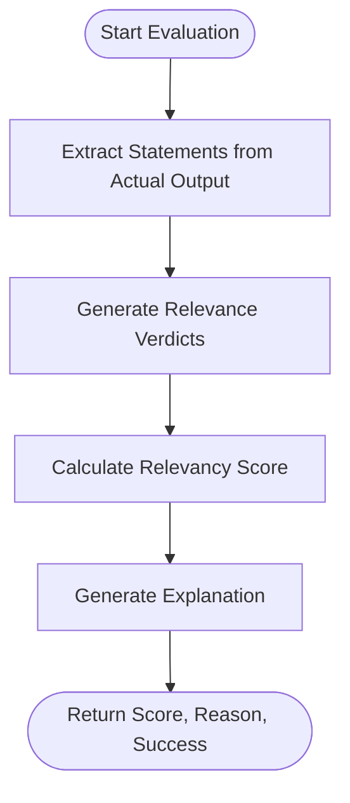
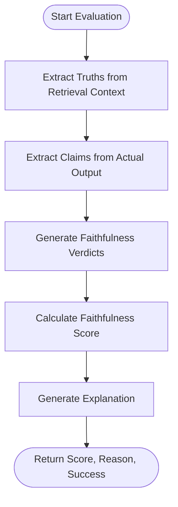
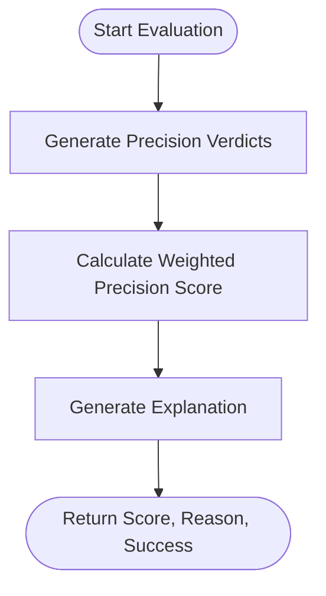
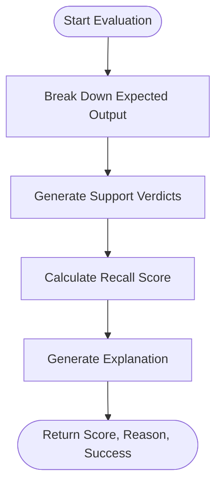
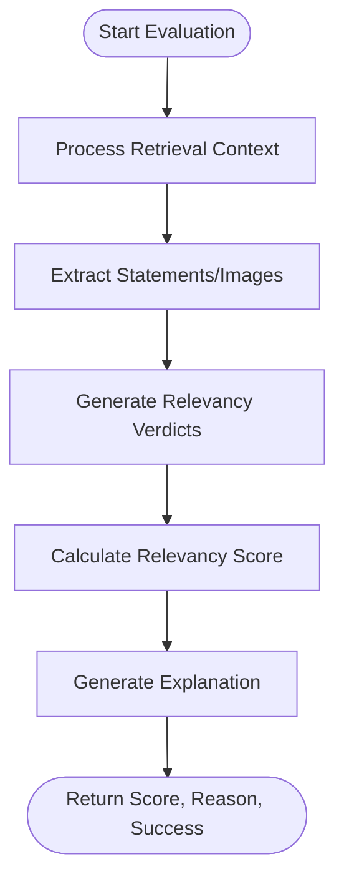
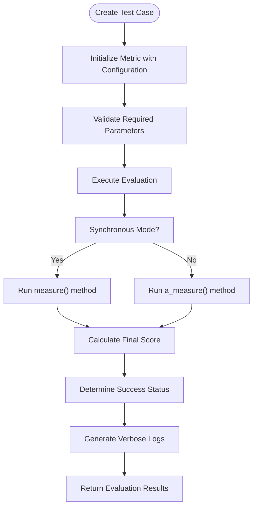

# RAG Metrics

<cite>
**Referenced Files in This Document**   
- [answer_relevancy.py](file://deepeval/metrics/answer_relevancy/answer_relevancy.py)
- [faithfulness.py](file://deepeval/metrics/faithfulness/faithfulness.py)
- [contextual_precision.py](file://deepeval/metrics/contextual_precision/contextual_precision.py)
- [contextual_recall.py](file://deepeval/metrics/contextual_recall/contextual_recall.py)
- [contextual_relevancy.py](file://deepeval/metrics/contextual_relevancy/contextual_relevancy.py)
- [template.py](file://deepeval/metrics/answer_relevancy/template.py)
- [template.py](file://deepeval/metrics/faithfulness/template.py)
- [template.py](file://deepeval/metrics/contextual_precision/template.py)
- [template.py](file://deepeval/metrics/contextual_recall/template.py)
- [template.py](file://deepeval/metrics/contextual_relevancy/template.py)
- [schema.py](file://deepeval/metrics/answer_relevancy/schema.py)
- [schema.py](file://deepeval/metrics/faithfulness/schema.py)
- [schema.py](file://deepeval/metrics/contextual_precision/schema.py)
- [schema.py](file://deepeval/metrics/contextual_recall/schema.py)
- [schema.py](file://deepeval/metrics/contextual_relevancy/schema.py)
- [base_metric.py](file://deepeval/metrics/base_metric.py)
- [evaluate.py](file://deepeval/evaluate/evaluate.py)
- [test_case.py](file://deepeval/test_case/__init__.py)
</cite>

## Table of Contents
1. [Introduction](#introduction)
2. [Domain Model](#domain-model)
3. [Answer Relevancy Metric](#answer-relevancy-metric)
4. [Faithfulness Metric](#faithfulness-metric)
5. [Contextual Precision Metric](#contextual-precision-metric)
6. [Contextual Recall Metric](#contextual-recall-metric)
7. [Contextual Relevancy Metric](#contextual-relevancy-metric)
8. [Evaluation Workflow](#evaluation-workflow)
9. [Configuration Options](#configuration-options)
10. [Common Issues and Solutions](#common-issues-and-solutions)
11. [Best Practices](#best-practices)
12. [Performance Considerations](#performance-considerations)
13. [Conclusion](#conclusion)

## Introduction

DeepEval's Retrieval-Augmented Generation (RAG) evaluation capabilities provide a comprehensive framework for assessing the quality of RAG pipelines through specialized metrics. These metrics leverage the LLM-as-a-judge methodology to evaluate different aspects of RAG performance, including answer quality, factual consistency, and context relevance. The core RAG metrics—AnswerRelevancy, Faithfulness, ContextualPrecision, ContextualRecall, and ContextualRelevancy—work together to provide a multi-dimensional assessment of RAG system effectiveness.

These metrics are designed to be invoked through the evaluate() function and integrated with test cases that contain the necessary inputs for evaluation. Each metric follows a consistent pattern of implementation, using structured prompts and JSON schema validation to ensure reliable and interpretable results. The evaluation process is highly configurable, allowing users to adjust model selection, threshold settings, and other parameters to suit their specific use cases.

**Section sources**
- [answer_relevancy.py](file://deepeval/metrics/answer_relevancy/answer_relevancy.py#L1-L320)
- [faithfulness.py](file://deepeval/metrics/faithfulness/faithfulness.py#L1-L356)

## Domain Model

The RAG evaluation framework in DeepEval operates on a well-defined domain model with specific inputs and outputs. The primary inputs for RAG evaluation are:

- **actual_output**: The response generated by the RAG system that needs to be evaluated
- **retrieval_context**: The context retrieved from the knowledge base that was used to generate the response
- **expected_output**: The ground truth or expected response for comparison
- **input**: The original query or prompt that initiated the RAG process

The evaluation metrics produce standardized outputs that include:

- **score**: A numerical value between 0 and 1 representing the quality assessment
- **reason**: A textual explanation for the score, providing insights into the evaluation
- **success**: A boolean indicating whether the evaluation passed the configured threshold
- **threshold**: The minimum score required for a successful evaluation
- **evaluation_model**: The LLM used as the judge for the evaluation

These inputs and outputs are encapsulated in the LLMTestCase class, which serves as the standard data structure for passing information between the evaluation framework and the metrics. The domain model supports both synchronous and asynchronous evaluation modes, allowing for flexible integration into different testing workflows.

**Section sources**
- [base_metric.py](file://deepeval/metrics/base_metric.py#L1-L134)
- [test_case.py](file://deepeval/test_case/__init__.py#L1-L100)

## Answer Relevancy Metric

The AnswerRelevancy metric evaluates whether the actual output from a RAG system is relevant to the input query. This metric follows a three-step evaluation process: statement extraction, verdict generation, and score calculation.

The evaluation begins by breaking down the actual output into discrete statements using a structured prompt. Each statement is then assessed for relevance to the input query, with verdicts categorized as "yes" (relevant), "no" (irrelevant), or "idk" (ambiguous). The final score is calculated as the ratio of relevant statements to total statements, providing a quantitative measure of answer relevancy.

**Diagram sources**
- [answer_relevancy.py](file://deepeval/metrics/answer_relevancy/answer_relevancy.py#L256-L273)
- [template.py](file://deepeval/metrics/answer_relevancy/template.py#L15-L43)

The metric supports configuration options such as threshold settings, model selection, and the inclusion of explanatory reasons. It also handles multimodal inputs, treating image content as factual evidence while avoiding inference beyond what is explicitly visible.

**Section sources**
- [answer_relevancy.py](file://deepeval/metrics/answer_relevancy/answer_relevancy.py#L28-L320)
- [template.py](file://deepeval/metrics/answer_relevancy/template.py#L1-L130)

## Faithfulness Metric

The Faithfulness metric assesses whether the information in the actual output is supported by the retrieval context, identifying hallucinations or factual inconsistencies. This metric implements a sophisticated evaluation process that extracts claims from the actual output and verifies them against truths extracted from the retrieval context.

The evaluation workflow consists of three main stages: truth extraction from the retrieval context, claim extraction from the actual output, and verdict generation through claim verification. The metric compares each claim against the retrieved truths, producing verdicts of "yes" (supported), "no" (contradicted), or "idk" (not supported but not contradicted). The final faithfulness score represents the proportion of supported claims.

**Diagram sources**
- [faithfulness.py](file://deepeval/metrics/faithfulness/faithfulness.py#L264-L294)
- [template.py](file://deepeval/metrics/faithfulness/template.py#L44-L87)

A key feature of the Faithfulness metric is its ability to penalize ambiguous claims when configured with the `penalize_ambiguous_claims` option. This helps address false negatives by reducing the score when the model makes claims that cannot be verified from the retrieval context.

**Section sources**
- [faithfulness.py](file://deepeval/metrics/faithfulness/faithfulness.py#L30-L356)
- [template.py](file://deepeval/metrics/faithfulness/template.py#L1-L226)

## Contextual Precision Metric

The ContextualPrecision metric evaluates whether the relevant information in the retrieval context is ranked higher than irrelevant information. This metric is particularly important for assessing the effectiveness of retrieval systems in prioritizing useful context.

The evaluation process involves analyzing each node in the retrieval context to determine its usefulness in arriving at the expected output. The metric generates verdicts for each context node, assessing whether it was "yes" (useful) or "no" (not useful) in generating the expected response. The score is calculated using a weighted cumulative precision formula that rewards systems for placing relevant contexts at higher ranks.

**Diagram sources**
- [contextual_precision.py](file://deepeval/metrics/contextual_precision/contextual_precision.py#L217-L240)
- [template.py](file://deepeval/metrics/contextual_precision/template.py#L9-L67)

The metric takes into account the ranking order of the retrieval context, making it sensitive to the position of relevant information. This allows it to differentiate between systems that retrieve the same information but present it in different orders of relevance.

**Section sources**
- [contextual_precision.py](file://deepeval/metrics/contextual_precision/contextual_precision.py#L28-L306)
- [template.py](file://deepeval/metrics/contextual_precision/template.py#L1-L134)

## Contextual Recall Metric

The ContextualRecall metric measures the extent to which the retrieval context contains information necessary to generate the expected output. This metric evaluates whether the retrieved context sufficiently covers the content required to produce a complete and accurate response.

The evaluation process breaks down the expected output into individual sentences or components and assesses whether each can be attributed to information in the retrieval context. For each component of the expected output, the metric generates a verdict of "yes" (supported by context) or "no" (not supported by context). The final score represents the proportion of expected output components that are supported by the retrieval context.

**Diagram sources**
- [contextual_recall.py](file://deepeval/metrics/contextual_recall/contextual_recall.py#L245-L258)
- [template.py](file://deepeval/metrics/contextual_recall/template.py#L52-L102)

This metric is particularly valuable for identifying gaps in retrieval coverage and ensuring that RAG systems retrieve comprehensive context for complex queries.

**Section sources**
- [contextual_recall.py](file://deepeval/metrics/contextual_recall/contextual_recall.py#L30-L294)
- [template.py](file://deepeval/metrics/contextual_recall/template.py#L1-L127)

## Contextual Relevancy Metric

The ContextualRelevancy metric evaluates whether the information in the retrieval context is relevant to the input query. Unlike ContextualPrecision, which considers ranking, this metric focuses solely on the relevance of the retrieved context regardless of its position.

The evaluation process involves analyzing each piece of retrieved context to determine its relevance to the input. For textual context, the metric first extracts statements and then assesses each statement's relevance. For multimodal context, it evaluates both text and images for relevance to the query. The final score represents the proportion of relevant context to total context.

**Diagram sources**
- [contextual_relevancy.py](file://deepeval/metrics/contextual_relevancy/contextual_relevancy.py#L247-L259)
- [template.py](file://deepeval/metrics/contextual_relevancy/template.py#L47-L106)

The metric handles edge cases such as empty contexts and provides detailed reasons for irrelevance, helping users understand why certain context was deemed irrelevant to the query.

**Section sources**
- [contextual_relevancy.py](file://deepeval/metrics/contextual_relevancy/contextual_relevancy.py#L32-L289)
- [template.py](file://deepeval/metrics/contextual_relevancy/template.py#L1-L107)

## Evaluation Workflow

The RAG metrics are invoked through the evaluate() function, which orchestrates the evaluation process and integrates with test cases. The evaluation workflow follows a consistent pattern across all metrics, leveraging the LLM-as-a-judge methodology to produce reliable assessments.

The process begins with the creation of an LLMTestCase containing the necessary inputs (input, actual_output, retrieval_context, and expected_output). When the evaluate() function is called, it initializes the selected metric, validates the required parameters, and executes the evaluation according to the configured mode (synchronous or asynchronous).

**Diagram sources**
- [evaluate.py](file://deepeval/evaluate/evaluate.py#L1-L50)
- [base_metric.py](file://deepeval/metrics/base_metric.py#L33-L41)

The evaluation framework supports both individual metric evaluation and combined evaluation workflows, allowing users to assess multiple aspects of RAG performance simultaneously. The results are standardized across metrics, enabling easy comparison and aggregation.

**Section sources**
- [evaluate.py](file://deepeval/evaluate/evaluate.py#L1-L100)
- [base_metric.py](file://deepeval/metrics/base_metric.py#L33-L45)

## Configuration Options

DeepEval's RAG metrics offer extensive configuration options to tailor the evaluation process to specific requirements. The primary configuration parameters include:

- **threshold**: The minimum score required for a successful evaluation (default: 0.5)
- **model**: The LLM to use as the judge (default: None, uses default model)
- **include_reason**: Whether to generate explanatory reasons for scores (default: True)
- **async_mode**: Whether to execute evaluations asynchronously (default: True)
- **strict_mode**: Whether to enforce strict evaluation criteria (default: False)
- **verbose_mode**: Whether to generate detailed verbose logs (default: False)

Additional metric-specific configurations include:

- **Faithfulness**: `penalize_ambiguous_claims` to reduce scores for unverifiable claims
- **ContextualPrecision**: Custom weighting schemes for ranked contexts
- **AnswerRelevancy**: Custom templates for statement extraction and verdict generation

These configuration options can be set during metric initialization and provide fine-grained control over the evaluation process. The framework also supports environment variables and configuration files for managing settings across multiple evaluations.

**Section sources**
- [answer_relevancy.py](file://deepeval/metrics/answer_relevancy/answer_relevancy.py#L34-L54)
- [faithfulness.py](file://deepeval/metrics/faithfulness/faithfulness.py#L37-L58)

## Common Issues and Solutions

Several common issues can arise when using RAG metrics, particularly with the Faithfulness metric. One frequent problem is false negatives, where valid responses are incorrectly flagged as unfaithful due to minor wording differences between claims and retrieved truths.

To address false negatives in faithfulness scoring, DeepEval provides several solutions:

1. **Adjust the threshold**: Lowering the threshold can accommodate minor discrepancies while maintaining overall quality standards.

2. **Use the `penalize_ambiguous_claims` option**: This helps distinguish between unsupported claims and contradictory information, reducing false negatives.

3. **Improve retrieval context quality**: Ensuring the retrieval context contains comprehensive and well-formatted information can improve faithfulness scores.

4. **Customize evaluation templates**: Modifying the prompt templates can make the evaluation more tolerant of paraphrasing and synonymous expressions.

Another common issue is performance bottlenecks when evaluating large datasets. This can be mitigated by:

1. **Using asynchronous evaluation**: Enabling async_mode allows concurrent processing of multiple evaluations.

2. **Batching evaluations**: Grouping multiple test cases together can reduce overhead.

3. **Caching results**: Storing evaluation results for repeated test cases can eliminate redundant computations.

**Section sources**
- [faithfulness.py](file://deepeval/metrics/faithfulness/faithfulness.py#L57-L58)
- [base_metric.py](file://deepeval/metrics/base_metric.py#L22-L23)

## Best Practices

To maximize the effectiveness of RAG metrics in evaluation workflows, several best practices should be followed:

1. **Combine multiple metrics**: Use a combination of AnswerRelevancy, Faithfulness, ContextualPrecision, ContextualRecall, and ContextualRelevancy to get a comprehensive assessment of RAG performance.

2. **Set appropriate thresholds**: Calibrate thresholds based on your specific use case and quality requirements rather than relying on defaults.

3. **Use representative test cases**: Ensure your test cases cover a diverse range of queries and scenarios that reflect real-world usage.

4. **Monitor evaluation costs**: Track the computational cost of evaluations, especially when using premium LLMs as judges.

5. **Iterate and refine**: Use evaluation results to identify weaknesses in your RAG pipeline and make targeted improvements.

6. **Validate with human review**: Periodically compare automated evaluation results with human judgments to ensure alignment.

7. **Document evaluation criteria**: Maintain clear documentation of your evaluation configuration and rationale for threshold settings.

These practices help ensure that RAG evaluations provide meaningful insights and drive genuine improvements in system quality.

**Section sources**
- [answer_relevancy.py](file://deepeval/metrics/answer_relevancy/answer_relevancy.py#L46-L47)
- [faithfulness.py](file://deepeval/metrics/faithfulness/faithfulness.py#L49-L50)

## Performance Considerations

When running RAG evaluations on large datasets, several performance considerations should be addressed:

1. **Asynchronous processing**: Utilize the async_mode option to enable concurrent evaluation of multiple test cases, significantly reducing total evaluation time.

2. **Model selection**: Choose evaluation models based on the trade-off between accuracy and cost. Smaller models may be sufficient for many evaluation tasks.

3. **Caching**: Implement result caching for repeated evaluations of the same test cases to avoid redundant computations.

4. **Batch processing**: Group multiple test cases together to minimize overhead and improve throughput.

5. **Resource monitoring**: Track memory usage, API rate limits, and other resource constraints during large-scale evaluations.

6. **Progress indicators**: Use the built-in progress indicators to monitor evaluation status and estimate completion time.

7. **Cost management**: Monitor and control evaluation costs, especially when using commercial LLM APIs as judges.

The framework is designed to handle large-scale evaluations efficiently, but careful configuration and monitoring are essential for optimal performance.

**Section sources**
- [base_metric.py](file://deepeval/metrics/base_metric.py#L22-L23)
- [evaluate.py](file://deepeval/evaluate/evaluate.py#L1-L20)

## Conclusion

DeepEval's RAG metrics provide a comprehensive framework for evaluating the quality of Retrieval-Augmented Generation systems. By leveraging the LLM-as-a-judge methodology, these metrics offer sophisticated assessments of answer relevancy, faithfulness, contextual precision, recall, and relevancy. The consistent implementation pattern across metrics, combined with flexible configuration options, enables users to tailor evaluations to their specific needs.

The integration with test cases and the evaluate() function creates a streamlined workflow for assessing RAG performance, while the standardized output format facilitates comparison and aggregation of results. By following best practices and addressing common issues, users can leverage these metrics to identify weaknesses in their RAG pipelines and drive meaningful improvements in system quality.

As RAG systems continue to evolve, these evaluation capabilities will play a crucial role in ensuring their reliability, accuracy, and effectiveness in real-world applications.