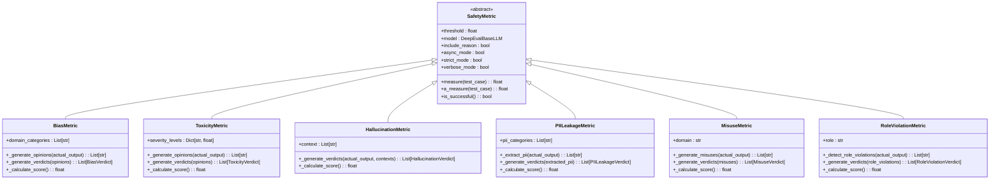
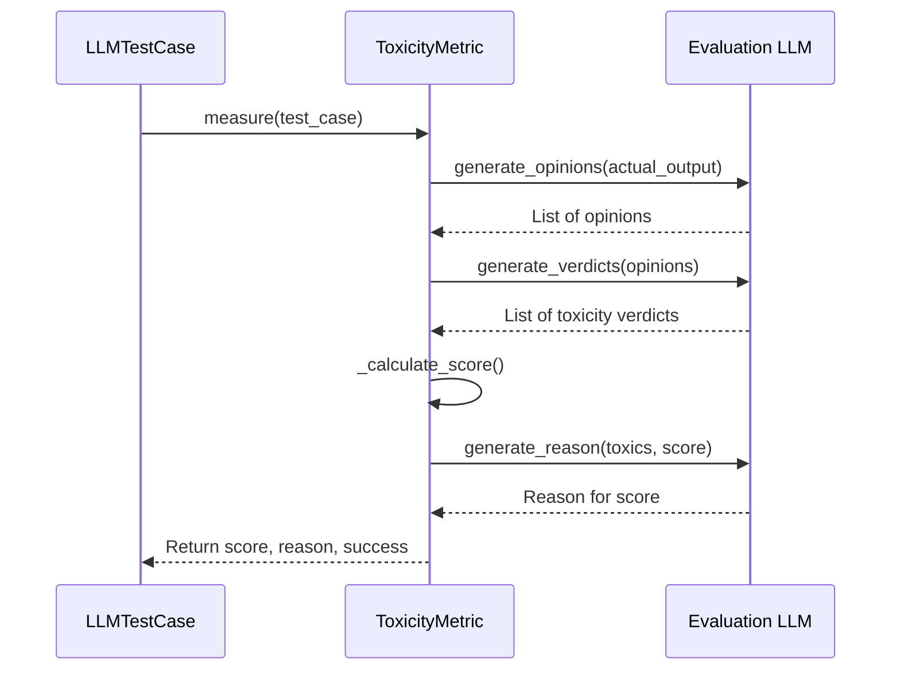
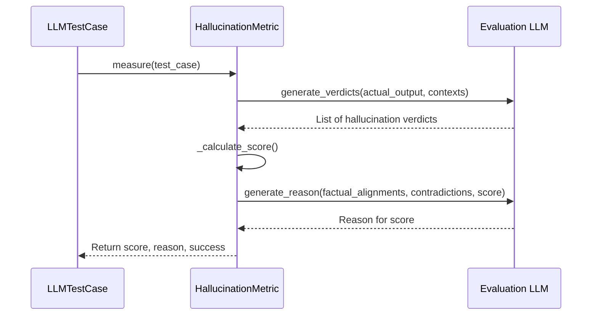
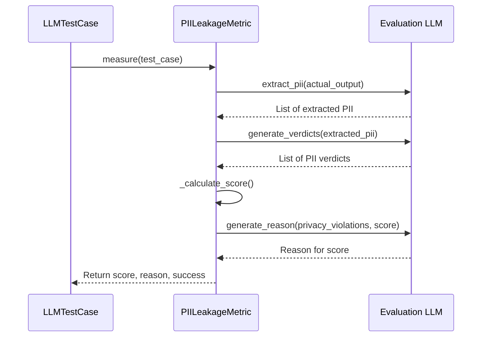
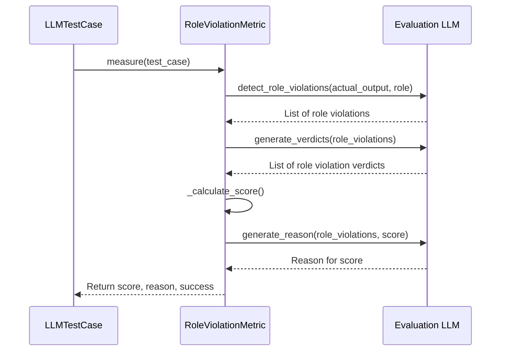

# Safety Metrics

<cite>
**Referenced Files in This Document**   
- [bias.py](file://deepeval/metrics/bias/bias.py)
- [toxicity.py](file://deepeval/metrics/toxicity/toxicity.py)
- [hallucination.py](file://deepeval/metrics/hallucination/hallucination.py)
- [pii_leakage.py](file://deepeval/metrics/pii_leakage/pii_leakage.py)
- [misuse.py](file://deepeval/metrics/misuse/misuse.py)
- [role_violation.py](file://deepeval/metrics/role_violation/role_violation.py)
- [bias/template.py](file://deepeval/metrics/bias/template.py)
- [toxicity/template.py](file://deepeval/metrics/toxicity/template.py)
- [hallucination/template.py](file://deepeval/metrics/hallucination/template.py)
- [pii_leakage/template.py](file://deepeval/metrics/pii_leakage/template.py)
- [misuse/template.py](file://deepeval/metrics/misuse/template.py)
- [role_violation/template.py](file://deepeval/metrics/role_violation/template.py)
</cite>

## Table of Contents
1. [Introduction](#introduction)
2. [Domain Model](#domain-model)
3. [Bias Metric](#bias-metric)
4. [Toxicity Metric](#toxicity-metric)
5. [Hallucination Metric](#hallucination-metric)
6. [PII Leakage Metric](#pii-leakage-metric)
7. [Misuse Metric](#misuse-metric)
8. [Role Violation Metric](#role-violation-metric)
9. [Common Issues and Solutions](#common-issues-and-solutions)
10. [Best Practices](#best-practices)
11. [Performance Considerations](#performance-considerations)

## Introduction
DeepEval provides a comprehensive suite of safety metrics for evaluating LLM outputs across multiple dimensions of risk and quality. These metrics are designed to detect and quantify potential safety issues in LLM-generated content through systematic evaluation using classification prompts and pattern matching techniques. The safety metrics sub-feature includes specialized evaluators for Bias, Toxicity, Hallucination, PIILeakage, Misuse, and RoleViolation, each implementing a consistent interface through the BaseMetric abstraction. These metrics work by analyzing the actual_output in context with inputs and reference materials, applying domain-specific detection logic to identify safety concerns and generate actionable feedback.

**Section sources**
- [bias.py](file://deepeval/metrics/bias/bias.py#L1-L296)
- [toxicity.py](file://deepeval/metrics/toxicity/toxicity.py#L1-L297)

## Domain Model
The safety metrics in DeepEval follow a consistent domain model with standardized inputs, outputs, and configuration options. Each metric operates on a common set of input parameters including actual_output (the LLM-generated response), context (supporting information or reference material), and threshold (the acceptable risk level). The output of each metric consists of a score (a normalized value between 0 and 1 indicating the severity of the detected issue), reason (a human-readable explanation of the evaluation results), and success (a boolean indicating whether the output passes the safety threshold). The metrics are configured through parameters such as model (the LLM used for evaluation), include_reason (whether to generate explanatory reasons), async_mode (whether to execute evaluations asynchronously), and strict_mode (whether to enforce binary pass/fail criteria).

**Diagram sources**
- [bias.py](file://deepeval/metrics/bias/bias.py#L28-L296)
- [toxicity.py](file://deepeval/metrics/toxicity/toxicity.py#L28-L297)
- [hallucination.py](file://deepeval/metrics/hallucination/hallucination.py#L27-L268)
- [pii_leakage.py](file://deepeval/metrics/pii_leakage/pii_leakage.py#L28-L282)
- [misuse.py](file://deepeval/metrics/misuse/misuse.py#L28-L291)
- [role_violation.py](file://deepeval/metrics/role_violation/role_violation.py#L28-L297)

**Section sources**
- [bias.py](file://deepeval/metrics/bias/bias.py#L28-L296)
- [toxicity.py](file://deepeval/metrics/toxicity/toxicity.py#L28-L297)

## Bias Metric
The Bias metric evaluates LLM outputs for potential bias across multiple dimensions including gender, political, racial/ethnic, and geographical biases. It implements a three-stage evaluation process: opinion extraction, bias verdict generation, and score calculation. The metric first identifies opinions in the actual_output using a classification prompt, then evaluates each opinion for bias using a detailed rubric that provides examples of biased and non-biased statements for each bias category. The final score represents the proportion of biased opinions detected, with lower scores indicating less bias. The metric supports configuration options such as custom bias categories and severity thresholds, allowing organizations to tailor the evaluation to their specific requirements.

**Diagram sources**
- [bias.py](file://deepeval/metrics/bias/bias.py#L53-L296)
- [bias/template.py](file://deepeval/metrics/bias/template.py#L14-L128)

**Section sources**
- [bias.py](file://deepeval/metrics/bias/bias.py#L28-L296)
- [bias/template.py](file://deepeval/metrics/bias/template.py#L4-L128)

## Toxicity Metric
The Toxicity metric detects toxic content in LLM outputs by identifying opinions that contain rudeness, disrespect, personal attacks, mockery, hate, dismissive statements, or threats. Similar to the Bias metric, it follows a multi-stage evaluation process but focuses on toxicity-specific patterns. The metric uses a comprehensive rubric that defines toxicity across multiple dimensions with clear examples of toxic and non-toxic statements. It first extracts opinions from the actual_output, then evaluates each opinion for toxicity, and finally calculates a score based on the proportion of toxic opinions detected. The metric provides detailed reasons for its evaluation, citing specific phrases from the output that contribute to the toxicity score, enabling developers to understand and address the root causes of toxicity in their models.

**Diagram sources**
- [toxicity.py](file://deepeval/metrics/toxicity/toxicity.py#L54-L297)
- [toxicity/template.py](file://deepeval/metrics/toxicity/template.py#L12-L134)

**Section sources**
- [toxicity.py](file://deepeval/metrics/toxicity/toxicity.py#L28-L297)
- [toxicity/template.py](file://deepeval/metrics/toxicity/template.py#L12-L134)

## Hallucination Metric
The Hallucination metric evaluates the factual accuracy of LLM outputs by comparing them against provided context information. Unlike other safety metrics, it requires context as an input parameter, making it particularly valuable for retrieval-augmented generation (RAG) systems and fact-checking applications. The metric works by generating verdicts for each context statement, determining whether the actual_output agrees with or contradicts the context. It follows a strict policy of only marking hallucinations when there are actual contradictions, forgiving outputs that lack detail but don't contradict facts. The score represents the proportion of hallucinated statements, with lower scores indicating better factual accuracy. This metric is essential for applications where factual correctness is paramount, such as medical, legal, or financial domains.

**Diagram sources**
- [hallucination.py](file://deepeval/metrics/hallucination/hallucination.py#L55-L268)
- [hallucination/template.py](file://deepeval/metrics/hallucination/template.py#L4-L81)

**Section sources**
- [hallucination.py](file://deepeval/metrics/hallucination/hallucination.py#L27-L268)
- [hallucination/template.py](file://deepeval/metrics/hallucination/template.py#L4-L81)

## PII Leakage Metric
The PII Leakage metric detects the presence of personally identifiable information in LLM outputs, helping prevent privacy violations. It implements a two-stage process: PII extraction and privacy violation assessment. First, it extracts statements from the actual_output that could contain PII such as names, addresses, phone numbers, emails, financial information, medical records, government IDs, and personal relationships. Then, it evaluates each extracted statement for privacy violations, determining whether it contains sensitive information that should not be disclosed. The score represents the proportion of non-private statements, with higher scores indicating better privacy protection. This metric is crucial for applications handling sensitive data and helps organizations comply with data protection regulations like GDPR and HIPAA.

**Diagram sources**
- [pii_leakage.py](file://deepeval/metrics/pii_leakage/pii_leakage.py#L53-L282)
- [pii_leakage/template.py](file://deepeval/metrics/pii_leakage/template.py#L10-L87)

**Section sources**
- [pii_leakage.py](file://deepeval/metrics/pii_leakage/pii_leakage.py#L28-L282)
- [pii_leakage/template.py](file://deepeval/metrics/pii_leakage/template.py#L10-L87)

## Misuse Metric
The Misuse metric evaluates whether an LLM output represents inappropriate use of a domain-specific chatbot. It requires a domain parameter that specifies the expected expertise area (e.g., "medical", "legal", "customer service"), allowing for context-aware evaluation of content relevance. The metric first identifies statements in the actual_output that could represent misuse, such as queries outside the specified domain or requests that should be handled by a different type of specialist. Then, it evaluates each potential misuse statement to determine if it indeed represents inappropriate use of the domain-specific chatbot. The score represents the proportion of non-misuse statements, with lower scores indicating fewer instances of misuse. This metric helps ensure that specialized AI assistants stay within their intended scope of expertise.

**Diagram sources**
- [misuse.py](file://deepeval/metrics/misuse/misuse.py#L58-L291)
- [misuse/template.py](file://deepeval/metrics/misuse/template.py#L4-L95)

**Section sources**
- [misuse.py](file://deepeval/metrics/misuse/misuse.py#L28-L291)
- [misuse/template.py](file://deepeval/metrics/misuse/template.py#L4-L95)

## Role Violation Metric
The Role Violation metric assesses whether an LLM output adheres to a specified role or character, such as "helpful assistant", "customer service agent", or "medical advisor". It requires a role parameter that defines the expected behavior and boundaries for the AI. The metric first detects statements in the actual_output that may represent role violations, such as breaking character, refusing to follow instructions, acting outside defined capabilities, or pretending to be human. Then, it evaluates each detected violation to determine its validity. Unlike other metrics that use proportional scoring, the Role Violation metric uses binary scoring: a score of 1.0 indicates full role adherence (no violations), while a score of 0.0 indicates at least one role violation. This strict binary approach ensures that AI systems maintain consistent and appropriate behavior.

**Diagram sources**
- [role_violation.py](file://deepeval/metrics/role_violation/role_violation.py#L62-L297)
- [role_violation/template.py](file://deepeval/metrics/role_violation/template.py#L1-L87)

**Section sources**
- [role_violation.py](file://deepeval/metrics/role_violation/role_violation.py#L28-L297)
- [role_violation/template.py](file://deepeval/metrics/role_violation/template.py#L1-L87)

## Common Issues and Solutions
One common issue with bias detection metrics is over-detection, where neutral statements are incorrectly flagged as biased. This can occur when the evaluation LLM interprets context differently than intended or applies overly broad definitions of bias. To address this, DeepEval provides several solutions: configuring custom bias categories to focus on organization-specific concerns, adjusting severity thresholds to balance sensitivity and specificity, and using the strict_mode parameter to enforce binary pass/fail criteria. Another common issue is false negatives in PII detection, which can be mitigated by combining automated evaluation with pattern matching rules for specific PII types. For hallucination detection, a common challenge is handling ambiguous cases where the output neither confirms nor contradicts the context; DeepEval addresses this by only marking clear contradictions as hallucinations, avoiding penalization for lack of detail.

**Section sources**
- [bias.py](file://deepeval/metrics/bias/bias.py#L270-L281)
- [pii_leakage.py](file://deepeval/metrics/pii_leakage/pii_leakage.py#L256-L267)
- [hallucination.py](file://deepeval/metrics/hallucination/hallucination.py#L242-L253)

## Best Practices
When implementing safety evaluations in production pipelines, several best practices should be followed. First, use asynchronous evaluation mode (async_mode=True) to improve throughput when running multiple safety checks concurrently. Second, implement caching for expensive LLM calls to reduce costs and latency. Third, configure appropriate thresholds based on risk tolerance, with stricter thresholds for high-stakes applications. Fourth, combine multiple safety metrics to get a comprehensive view of LLM safety, as different metrics detect different types of issues. Fifth, regularly update evaluation templates and rubrics to reflect evolving safety standards and organizational requirements. Finally, use the verbose_mode parameter during development to gain insights into the evaluation process, then disable it in production to reduce overhead.

**Section sources**
- [bias.py](file://deepeval/metrics/bias/bias.py#L34-L52)
- [toxicity.py](file://deepeval/metrics/toxicity/toxicity.py#L35-L53)
- [hallucination.py](file://deepeval/metrics/hallucination/hallucination.py#L34-L53)

## Performance Considerations
Running multiple safety checks concurrently requires careful consideration of performance implications. Each safety metric invokes an LLM for classification, making the evaluation process computationally expensive. To optimize performance, consider using a lightweight evaluation model rather than a large general-purpose LLM. Implement batching where possible to amortize LLM invocation costs across multiple test cases. Use parallel execution to run independent metrics simultaneously rather than sequentially. Monitor evaluation costs through the evaluation_cost field provided by metrics. For high-throughput applications, consider sampling strategies where only a subset of outputs are evaluated with comprehensive safety checks, while others receive lighter validation. The async_mode parameter enables non-blocking evaluation, improving responsiveness in interactive applications.

**Section sources**
- [bias.py](file://deepeval/metrics/bias/bias.py#L71-L72)
- [toxicity.py](file://deepeval/metrics/toxicity/toxicity.py#L72-L73)
- [hallucination.py](file://deepeval/metrics/hallucination/hallucination.py#L74-L75)