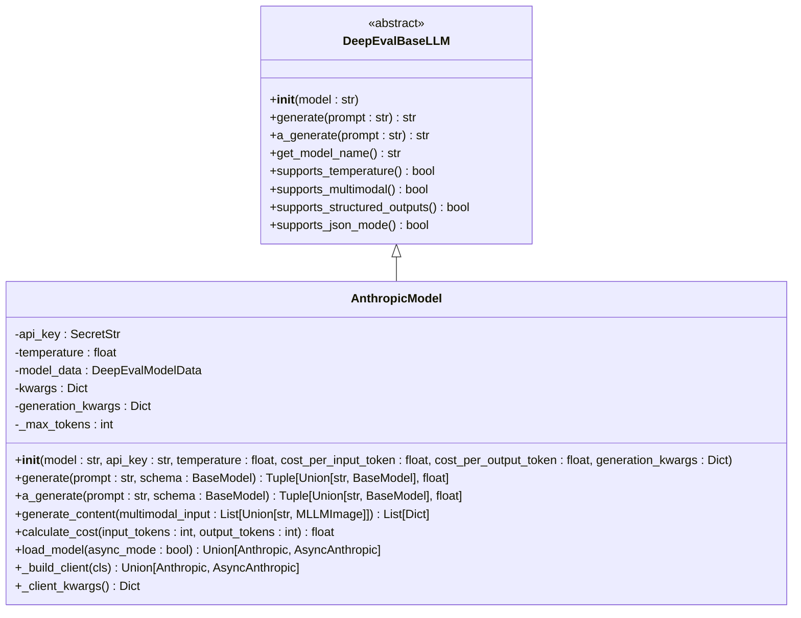
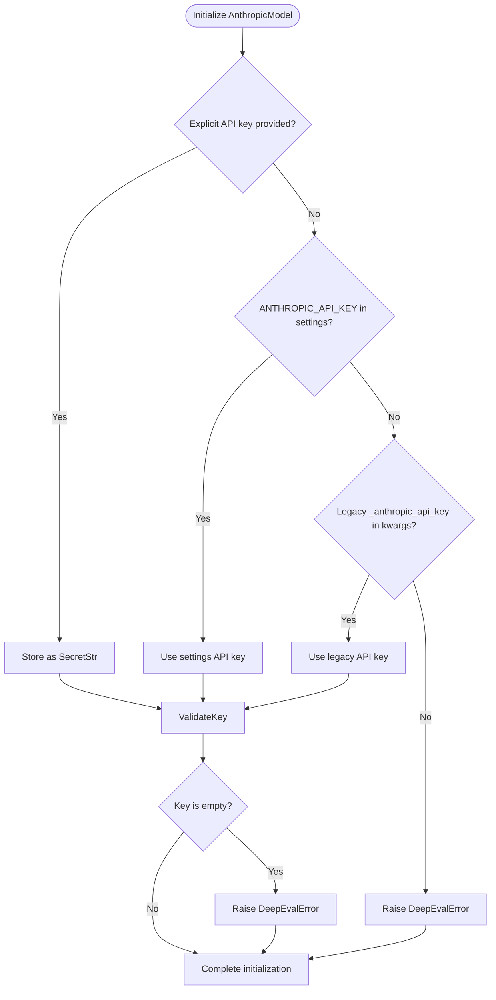
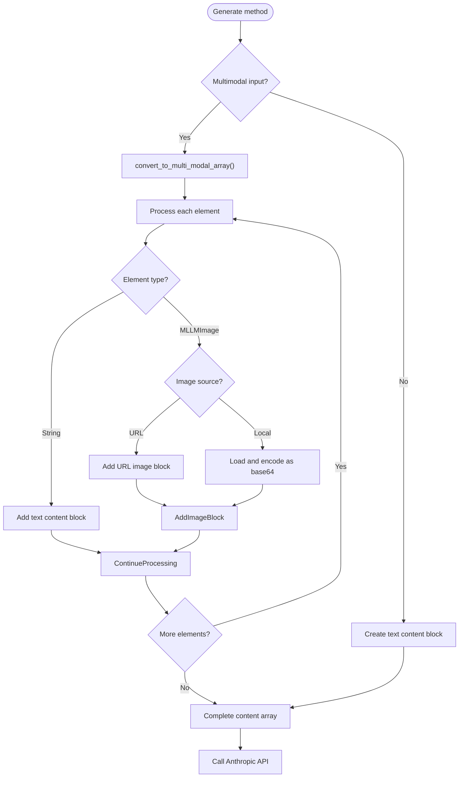
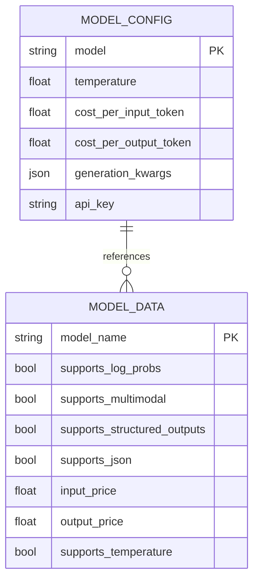
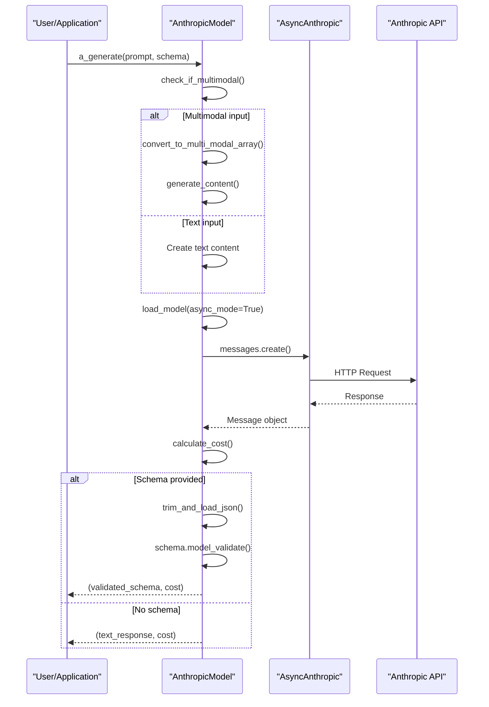
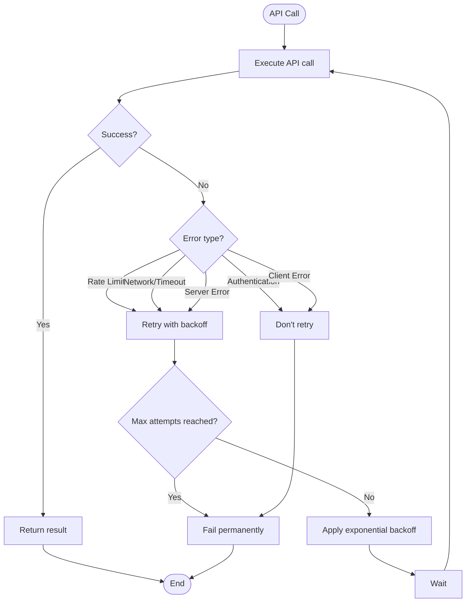
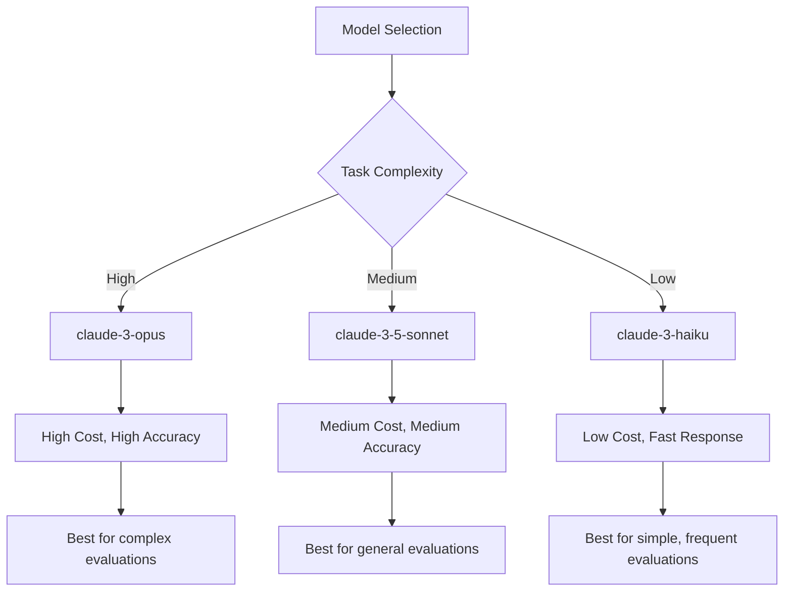
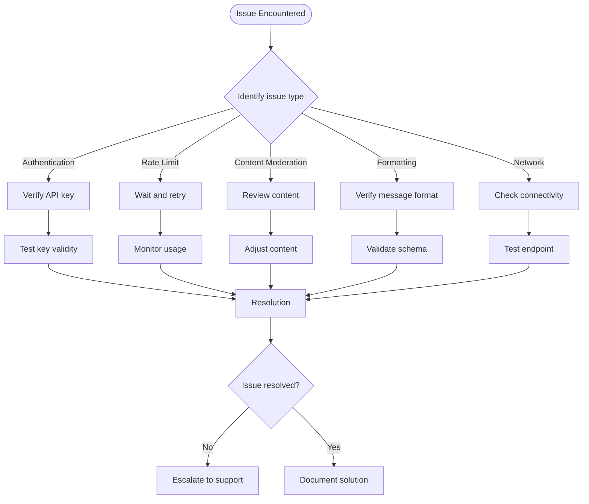

# Anthropic Integration

<cite>
**Referenced Files in This Document**   
- [anthropic_model.py](file://deepeval/models/llms/anthropic_model.py)
- [constants.py](file://deepeval/models/llms/constants.py)
- [patch.py](file://deepeval/anthropic/patch.py)
- [utils.py](file://deepeval/anthropic/utils.py)
- [extractors.py](file://deepeval/anthropic/extractors.py)
- [test_anthropic_model.py](file://tests/test_core/test_models/test_anthropic_model.py)
</cite>

## Table of Contents
1. [Introduction](#introduction)
2. [AnthropicModel Implementation](#anthropicmodel-implementation)
3. [API Key Management](#api-key-management)
4. [Message Formatting](#message-formatting)
5. [Configuration Parameters](#configuration-parameters)
6. [Streaming and Async Execution](#streaming-and-async-execution)
7. [Retry Policy](#retry-policy)
8. [Performance and Cost Considerations](#performance-and-cost-considerations)
9. [Troubleshooting](#troubleshooting)
10. [Best Practices](#best-practices)

## Introduction

The Anthropic integration in DeepEval enables evaluation using Anthropic's Claude models through the `AnthropicModel` class. This integration allows users to leverage Claude's advanced language capabilities for various evaluation tasks within the DeepEval framework. The implementation follows the `DeepEvalBaseLLM` contract, ensuring consistency with other LLM integrations while providing specific functionality for Anthropic's API.

The integration supports both synchronous and asynchronous operations, handles API key management securely, and provides comprehensive error handling and retry mechanisms. It also includes cost tracking capabilities and supports multimodal inputs, making it suitable for a wide range of evaluation scenarios.

**Section sources**
- [anthropic_model.py](file://deepeval/models/llms/anthropic_model.py#L1-L298)

## AnthropicModel Implementation

The `AnthropicModel` class implements the `DeepEvalBaseLLM` interface, providing a standardized way to interact with Anthropic's Claude models. The class handles model initialization, API communication, and response processing while abstracting away the complexities of the underlying API.



**Diagram sources**
- [anthropic_model.py](file://deepeval/models/llms/anthropic_model.py#L33-L298)
- [base_model.py](file://deepeval/models/base_model.py#L45-L177)

**Section sources**
- [anthropic_model.py](file://deepeval/models/llms/anthropic_model.py#L33-L298)

## API Key Management

The Anthropic integration provides flexible API key management with multiple configuration options. The `AnthropicModel` class follows a hierarchical approach to API key resolution:

1. Explicit API key passed to the constructor
2. API key from environment variables or settings
3. Legacy API key parameter for backward compatibility

The implementation uses `SecretStr` from Pydantic to securely handle API keys, preventing accidental exposure in logs or serializations. The key is stripped from the model's kwargs to avoid duplication and potential security issues.



**Diagram sources**
- [anthropic_model.py](file://deepeval/models/llms/anthropic_model.py#L55-L60)
- [test_anthropic_model.py](file://tests/test_core/test_models/test_anthropic_model.py#L71-L246)

**Section sources**
- [anthropic_model.py](file://deepeval/models/llms/anthropic_model.py#L55-L60)
- [test_anthropic_model.py](file://tests/test_core/test_models/test_anthropic_model.py#L71-L246)

## Message Formatting

The integration handles message formatting according to Anthropic's API requirements. The `generate` method processes both text and multimodal inputs, converting them to the appropriate format for the Anthropic API.

For text inputs, the message is formatted as a simple text content block:
```python
content = [{"type": "text", "text": prompt}]
```

For multimodal inputs, the `generate_content` method processes mixed text and image inputs, creating appropriate content blocks for each element. Images are handled differently based on whether they are local files or URLs, with local images being converted to base64 encoding.



**Diagram sources**
- [anthropic_model.py](file://deepeval/models/llms/anthropic_model.py#L132-L137)
- [anthropic_model.py](file://deepeval/models/llms/anthropic_model.py#L197-L223)

**Section sources**
- [anthropic_model.py](file://deepeval/models/llms/anthropic_model.py#L132-L137)
- [anthropic_model.py](file://deepeval/models/llms/anthropic_model.py#L197-L223)

## Configuration Parameters

The `AnthropicModel` class supports various configuration parameters for fine-tuning model behavior:

### Model Selection
The model parameter specifies which Claude model to use. The default model is `claude-3-7-sonnet-latest`, but users can specify other models like `claude-3-opus-20240229` or `claude-3-haiku-20240307`.

### Temperature
The temperature parameter controls the randomness of the model's output. Lower values (closer to 0) produce more deterministic outputs, while higher values produce more creative and varied responses. The temperature must be >= 0.

### Max Tokens
The maximum number of tokens in the generated response can be controlled through the `max_tokens` parameter in `generation_kwargs`. If not specified, it defaults to 1024.

### Cost Tracking
The integration supports cost tracking through `cost_per_input_token` and `cost_per_output_token` parameters. These can be set explicitly or retrieved from settings.

### Generation Keywords
Additional parameters can be passed through `generation_kwargs`, which are sanitized to avoid conflicts with core parameters like temperature and max_tokens.



**Diagram sources**
- [anthropic_model.py](file://deepeval/models/llms/anthropic_model.py#L36-L42)
- [constants.py](file://deepeval/models/llms/constants.py#L373-L560)

**Section sources**
- [anthropic_model.py](file://deepeval/models/llms/anthropic_model.py#L36-L42)
- [constants.py](file://deepeval/models/llms/constants.py#L373-L560)

## Streaming and Async Execution

The integration supports both synchronous and asynchronous execution through the `generate` and `a_generate` methods. Both methods are decorated with `@retry_anthropic` to ensure reliable operation.

The asynchronous implementation uses `AsyncAnthropic` from the Anthropic SDK, allowing non-blocking API calls that can improve performance in I/O-bound applications. The async method follows the same processing flow as the synchronous version but uses `await` for API calls.



**Diagram sources**
- [anthropic_model.py](file://deepeval/models/llms/anthropic_model.py#L163-L196)

**Section sources**
- [anthropic_model.py](file://deepeval/models/llms/anthropic_model.py#L163-L196)

## Retry Policy

The integration implements a robust retry policy to handle transient failures and rate limiting. The `retry_anthropic` decorator is created using `create_retry_decorator` with the Anthropic provider slug.

The retry mechanism is configured through environment variables and settings:
- `DEEPEVAL_RETRY_MAX_ATTEMPTS`: Maximum number of retry attempts
- `DEEPEVAL_RETRY_INITIAL_SECONDS`: Initial delay between retries
- `DEEPEVAL_RETRY_EXP_BASE`: Exponential backoff base
- `DEEPEVAL_RETRY_JITTER`: Jitter factor for randomization
- `DEEPEVAL_RETRY_CAP_SECONDS`: Maximum delay between retries

The retry policy distinguishes between retryable and non-retryable errors:
- Retryable: Network issues, timeouts, rate limits (429), server errors (5xx)
- Non-retryable: Authentication errors, invalid requests, client errors (4xx)



**Diagram sources**
- [anthropic_model.py](file://deepeval/models/llms/anthropic_model.py#L24)
- [retry_policy.py](file://deepeval/models/retry_policy.py#L1-L200)

**Section sources**
- [anthropic_model.py](file://deepeval/models/llms/anthropic_model.py#L24)
- [retry_policy.py](file://deepeval/models/retry_policy.py#L1-L200)

## Performance and Cost Considerations

The integration provides detailed cost tracking for different Claude models. The cost is calculated based on input and output token counts using model-specific pricing.

### Model Comparison

| Model | Input Price ($/M tokens) | Output Price ($/M tokens) | Use Case |
|-------|--------------------------|---------------------------|----------|
| claude-3-opus-20240229 | 15.00 | 75.00 | Complex tasks, high accuracy |
| claude-3-sonnet-20240229 | 3.00 | 15.00 | Balanced performance and cost |
| claude-3-haiku-20240307 | 0.25 | 1.25 | Fast, low-cost tasks |
| claude-3-5-sonnet-20240620 | 3.00 | 15.00 | Improved sonnet with structured outputs |

### Performance Characteristics

- **Opus**: Highest intelligence, best for complex tasks, slowest response time
- **Sonnet**: Balanced intelligence and speed, suitable for most applications
- **Haiku**: Fastest response time, lowest cost, suitable for simple tasks

The integration automatically calculates costs based on token usage, providing transparency into evaluation expenses. Users can override default pricing through configuration parameters or environment variables.



**Diagram sources**
- [constants.py](file://deepeval/models/llms/constants.py#L373-L560)

**Section sources**
- [constants.py](file://deepeval/models/llms/constants.py#L373-L560)

## Troubleshooting

### Common Issues

**API Key Configuration**
- Ensure the API key is properly set in environment variables or passed to the constructor
- Verify the key has the necessary permissions
- Check for empty or malformed keys

**Rate Limits**
- Implement proper retry logic with exponential backoff
- Monitor usage to stay within rate limits
- Consider using lower-frequency models for high-volume tasks

**Content Moderation**
- Review Anthropic's content policies
- Implement pre-processing to filter potentially problematic content
- Handle moderation rejections gracefully

**Prompt Formatting**
- Ensure prompts follow Anthropic's message format requirements
- For multimodal inputs, verify image encoding and formatting
- Check system prompt placement and formatting

### Debugging Tips

1. Enable verbose logging to see API requests and responses
2. Use the `test_anthropic_model.py` file as a reference for proper configuration
3. Verify network connectivity to Anthropic's API endpoints
4. Check for SDK version compatibility issues



**Diagram sources**
- [anthropic_model.py](file://deepeval/models/llms/anthropic_model.py#L55-L60)
- [test_anthropic_model.py](file://tests/test_core/test_models/test_anthropic_model.py#L71-L246)

**Section sources**
- [anthropic_model.py](file://deepeval/models/llms/anthropic_model.py#L55-L60)
- [test_anthropic_model.py](file://tests/test_core/test_models/test_anthropic_model.py#L71-L246)

## Best Practices

### Prompt Design
- Use clear, specific instructions
- Provide examples for complex tasks
- Structure prompts to minimize ambiguity
- Test prompts with different temperature settings

### Temperature Settings
- **0.0-0.3**: Deterministic outputs, code generation, data extraction
- **0.4-0.7**: Balanced outputs, chatbots, Q&A
- **0.8-1.0**: Creative outputs, brainstorming, content generation

### Cost Optimization
- Choose the appropriate model for the task complexity
- Set reasonable `max_tokens` limits to prevent excessive output
- Cache results for repeated evaluations
- Monitor usage and adjust configuration as needed

### Error Handling
- Implement comprehensive error handling for API failures
- Use retry mechanisms with appropriate backoff
- Log errors for debugging and monitoring
- Provide fallback mechanisms for critical applications

### Security
- Store API keys securely using environment variables
- Use `SecretStr` for sensitive data handling
- Limit API key permissions to minimum required
- Regularly rotate API keys

```mermaid
flowchart TD
BestPractices([Best Practices]) --> PromptDesign["Prompt Design"]
BestPractices --> Temperature["Temperature Settings"]
BestPractices --> CostOpt["Cost Optimization"]
BestPractices --> ErrorHandling["Error Handling"]
BestPractices --> Security["Security"]
PromptDesign --> ClearInstructions["Use clear instructions"]
PromptDesign --> Examples["Provide examples"]
PromptDesign --> Structure["Structure prompts"]
PromptDesign --> Test["Test with variations"]
Temperature --> Deterministic["0.0-0.3: Deterministic"]
Temperature --> Balanced["0.4-0.7: Balanced"]
Temperature --> Creative["0.8-1.0: Creative"]
CostOpt --> ModelSelection["Choose appropriate model"]
CostOpt --> TokenLimits["Set token limits"]
CostOpt --> Caching["Cache results"]
CostOpt --> Monitoring["Monitor usage"]
ErrorHandling --> Comprehensive["Comprehensive handling"]
ErrorHandling --> Retry["Implement retry"]
ErrorHandling --> Logging["Log errors"]
ErrorHandling --> Fallback["Provide fallback"]
Security --> SecureStorage["Secure key storage"]
Security --> SecretStr["Use SecretStr"]
Security --> MinimalPermissions["Minimal permissions"]
Security --> Rotation["Regular rotation"]
```



**Diagram sources**
- [anthropic_model.py](file://deepeval/models/llms/anthropic_model.py#L63-L68)
- [DEEPEVAL_PROMPT_GUIDE.md](file://ai_docs/DEEPEVAL_PROMPT_GUIDE.md#L789-L805)

**Section sources**
- [anthropic_model.py](file://deepeval/models/llms/anthropic_model.py#L63-L68)
- [DEEPEVAL_PROMPT_GUIDE.md](file://ai_docs/DEEPEVAL_PROMPT_GUIDE.md#L789-L805)