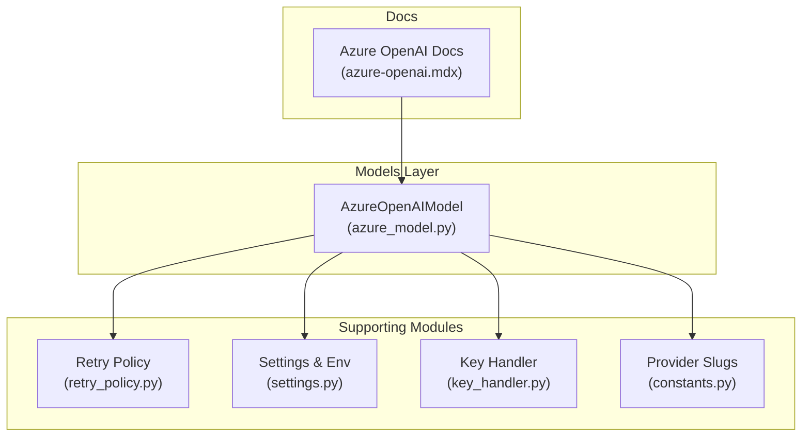
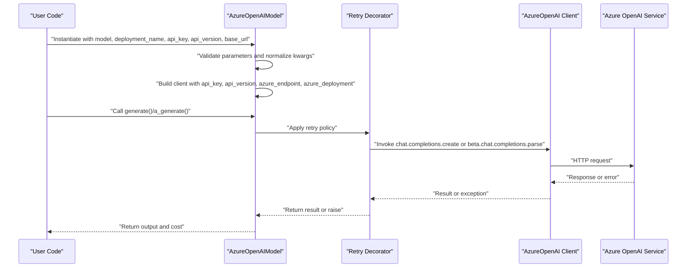
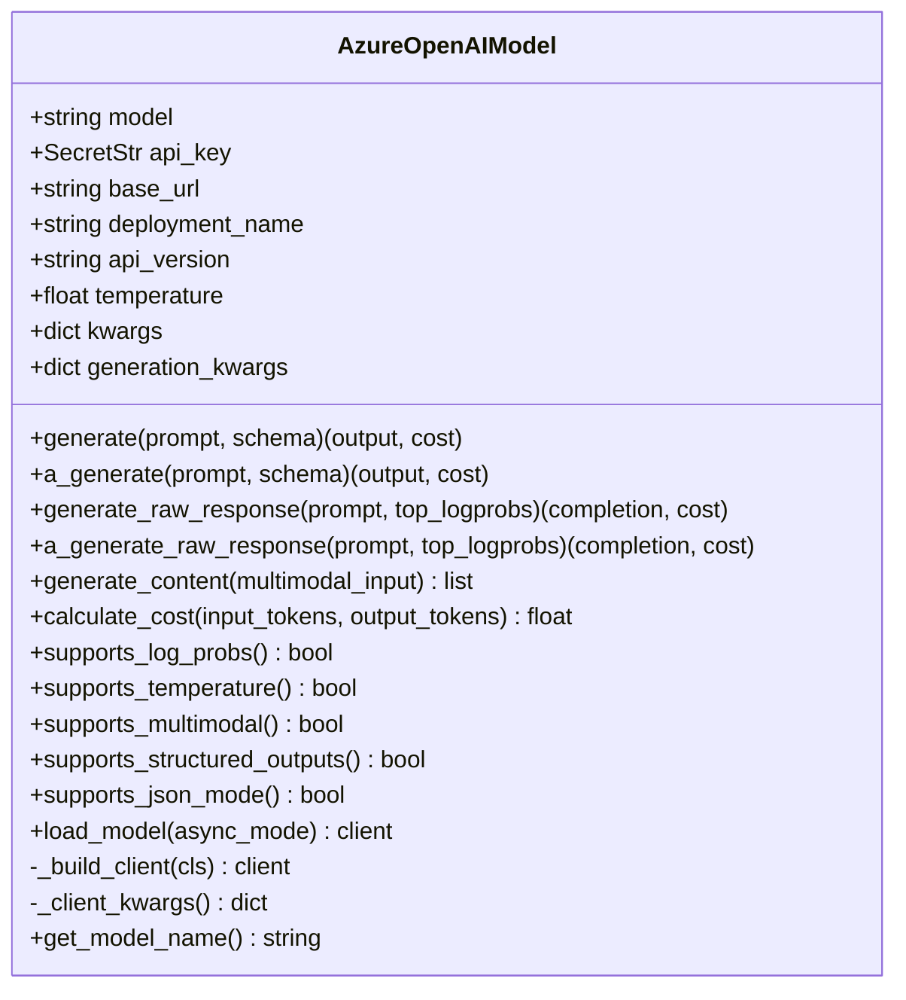
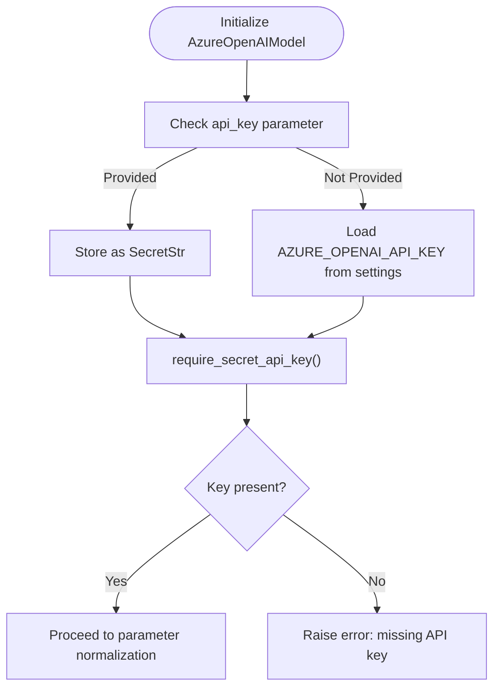
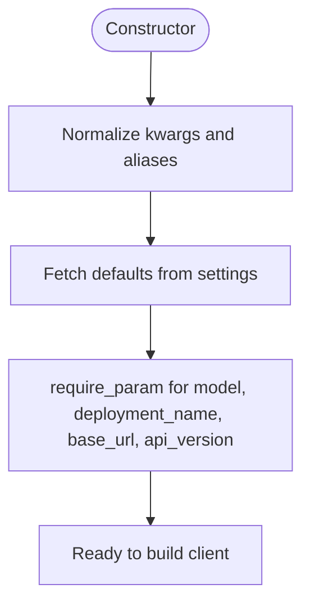
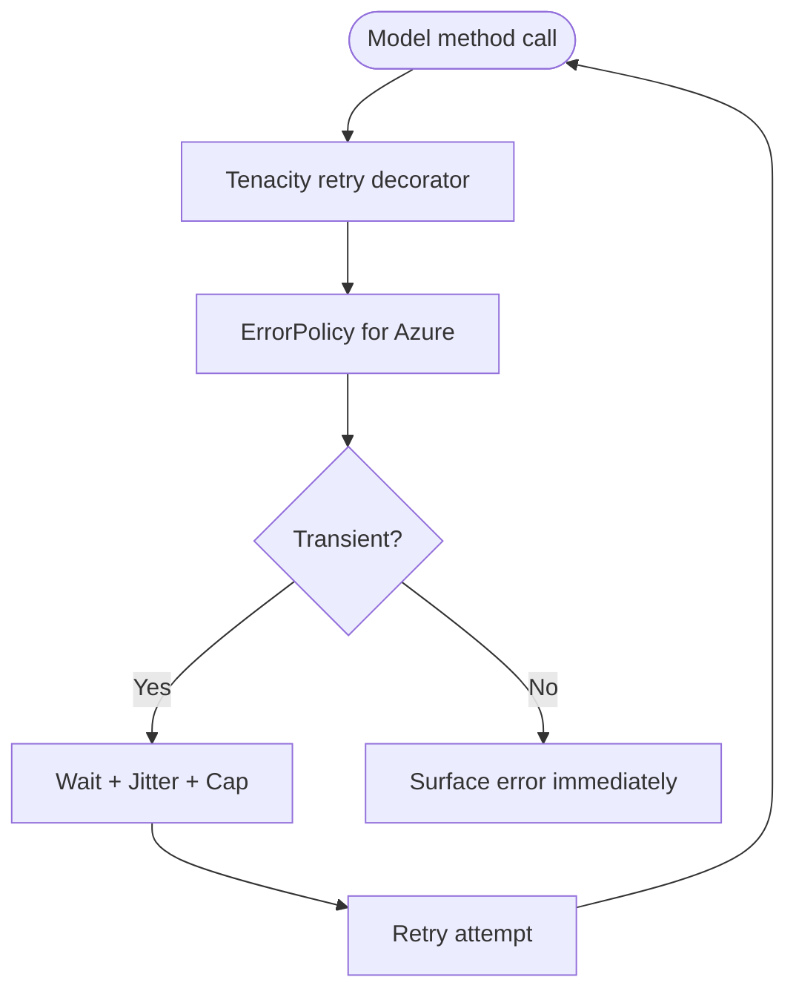
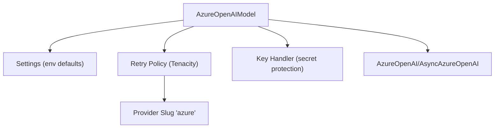
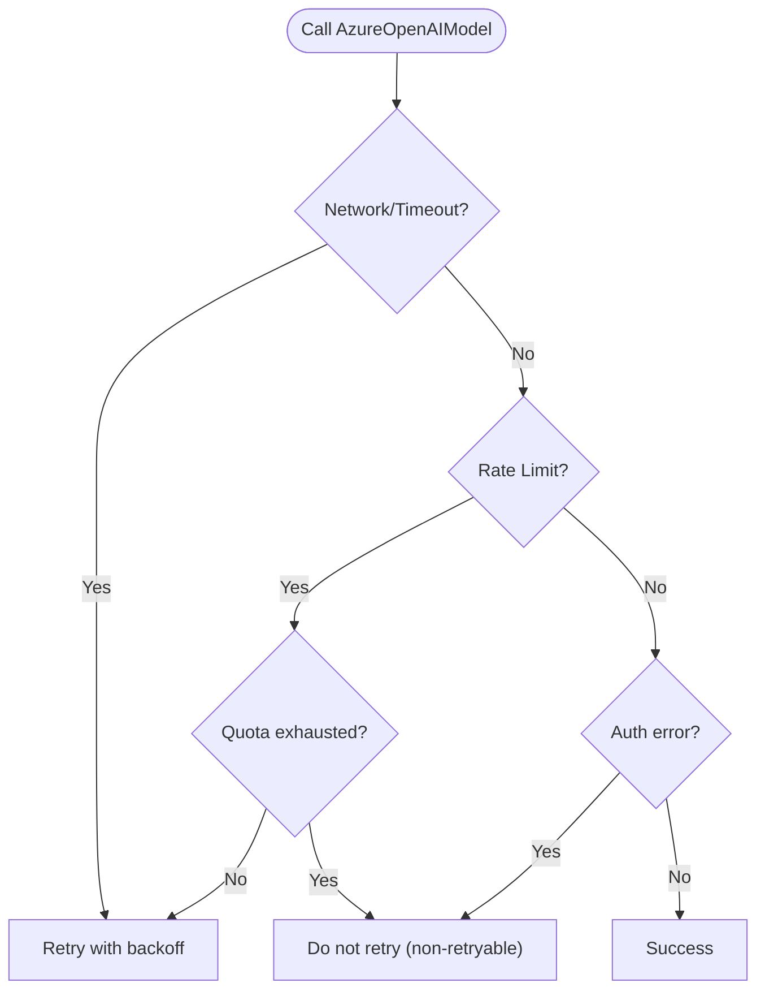

# Azure OpenAI Integration

<cite>
**Referenced Files in This Document**
- [azure_model.py](file://deepeval/models/llms/azure_model.py)
- [retry_policy.py](file://deepeval/models/retry_policy.py)
- [settings.py](file://deepeval/config/settings.py)
- [constants.py](file://deepeval/constants.py)
- [key_handler.py](file://deepeval/key_handler.py)
- [azure-openai.mdx](file://docs/integrations/models/azure-openai.mdx)
- [test_azure_retry_config.py](file://tests/test_core/test_models/test_azure_retry_config.py)
- [test_cli_env_save.py](file://tests/test_core/test_cli/test_cli_env_save.py)
</cite>

## Table of Contents
1. [Introduction](#introduction)
2. [Project Structure](#project-structure)
3. [Core Components](#core-components)
4. [Architecture Overview](#architecture-overview)
5. [Detailed Component Analysis](#detailed-component-analysis)
6. [Dependency Analysis](#dependency-analysis)
7. [Performance Considerations](#performance-considerations)
8. [Troubleshooting Guide](#troubleshooting-guide)
9. [Conclusion](#conclusion)
10. [Appendices](#appendices)

## Introduction
This document explains how DeepEval integrates Azure OpenAI to enable secure, enterprise-grade evaluation using OpenAI-compatible models via Azure. It focuses on the AzureOpenAIModel class, covering endpoint configuration, API key management, deployment name requirements, authentication, retry policies, and compliance with enterprise security standards. It also provides practical guidance for common issues such as deployment not found, API version mismatches, and network connectivity, along with performance considerations and cost management strategies.

## Project Structure
The Azure OpenAI integration lives primarily under the models layer and is supported by configuration, retry policy, and documentation assets. The key files are:
- AzureOpenAIModel implementation
- Retry policy and error classification
- Settings and environment variable handling
- CLI configuration utilities
- Documentation for Azure OpenAI usage

**Diagram sources**
- [azure_model.py](file://deepeval/models/llms/azure_model.py#L1-L120)
- [retry_policy.py](file://deepeval/models/retry_policy.py#L1-L120)
- [settings.py](file://deepeval/config/settings.py#L330-L360)
- [key_handler.py](file://deepeval/key_handler.py#L49-L66)
- [constants.py](file://deepeval/constants.py#L26-L49)
- [azure-openai.mdx](file://docs/integrations/models/azure-openai.mdx#L1-L60)

**Section sources**
- [azure_model.py](file://deepeval/models/llms/azure_model.py#L1-L120)
- [retry_policy.py](file://deepeval/models/retry_policy.py#L1-L120)
- [settings.py](file://deepeval/config/settings.py#L330-L360)
- [key_handler.py](file://deepeval/key_handler.py#L49-L66)
- [constants.py](file://deepeval/constants.py#L26-L49)
- [azure-openai.mdx](file://docs/integrations/models/azure-openai.mdx#L1-L60)

## Core Components
- AzureOpenAIModel: Implements Azure OpenAI integration with support for structured outputs, JSON mode, multimodal content, and cost calculation. It validates required parameters and builds the Azure client with appropriate retry configuration.
- Retry Policy: Provides transient vs non-transient error classification and Tenacity-based retry decorators for Azure calls.
- Settings and Environment Variables: Centralizes Azure OpenAI configuration via environment variables and CLI utilities.
- Key Handler: Manages persisted keys and enforces secret key protection.
- Provider Slugs: Defines the Azure provider slug used by the retry policy.

Key responsibilities:
- Endpoint configuration: base_url (endpoint), api_version, deployment_name
- API key management: SecretStr handling and validation
- Parameter validation: Ensures required parameters are present
- Retry orchestration: Integrates Tenacity with configurable backoff and logging
- Cost accounting: Computes cost from token usage

**Section sources**
- [azure_model.py](file://deepeval/models/llms/azure_model.py#L39-L120)
- [retry_policy.py](file://deepeval/models/retry_policy.py#L150-L210)
- [settings.py](file://deepeval/config/settings.py#L330-L360)
- [key_handler.py](file://deepeval/key_handler.py#L16-L35)
- [constants.py](file://deepeval/constants.py#L26-L49)

## Architecture Overview
The Azure integration follows a layered approach:
- Model layer constructs the Azure client with validated parameters
- Retry policy decorates model methods to handle transient failures
- Settings and environment variables supply defaults and overrides
- CLI utilities persist and manage Azure configuration

**Diagram sources**
- [azure_model.py](file://deepeval/models/llms/azure_model.py#L162-L227)
- [retry_policy.py](file://deepeval/models/retry_policy.py#L626-L686)

**Section sources**
- [azure_model.py](file://deepeval/models/llms/azure_model.py#L162-L227)
- [retry_policy.py](file://deepeval/models/retry_policy.py#L626-L686)

## Detailed Component Analysis

### AzureOpenAIModel Implementation
The AzureOpenAIModel class encapsulates Azure OpenAI integration:
- Constructor parameters include model, deployment_name, api_key, api_version, base_url, temperature, cost_per_input_token, cost_per_output_token, and generation_kwargs.
- Aliasing: api_key maps to AZURE_OPENAI_API_KEY; base_url maps to AZURE_OPENAI_ENDPOINT.
- Validation: Uses require_param to enforce presence of model, deployment_name, base_url, and api_version.
- Client building: Creates AzureOpenAI or AsyncAzureOpenAI clients with api_key, api_version, azure_endpoint, azure_deployment, and controlled max_retries.
- Generation methods: Supports plain text, structured outputs, and JSON mode; computes cost from token usage.

**Diagram sources**
- [azure_model.py](file://deepeval/models/llms/azure_model.py#L39-L458)

**Section sources**
- [azure_model.py](file://deepeval/models/llms/azure_model.py#L39-L120)
- [azure_model.py](file://deepeval/models/llms/azure_model.py#L162-L227)
- [azure_model.py](file://deepeval/models/llms/azure_model.py#L299-L354)
- [azure_model.py](file://deepeval/models/llms/azure_model.py#L355-L411)
- [azure_model.py](file://deepeval/models/llms/azure_model.py#L416-L458)

### Authentication and API Key Management
- API key storage: api_key is stored as a SecretStr to prevent serialization/logging exposure.
- Validation: require_secret_api_key ensures a valid API key is present; raises an error if missing.
- Environment sourcing: Defaults to AZURE_OPENAI_API_KEY from settings if not provided.
- Secret protection: KeyFileHandler prevents persisting secrets to disk.

**Diagram sources**
- [azure_model.py](file://deepeval/models/llms/azure_model.py#L70-L75)
- [azure_model.py](file://deepeval/models/llms/azure_model.py#L433-L438)
- [key_handler.py](file://deepeval/key_handler.py#L16-L35)

**Section sources**
- [azure_model.py](file://deepeval/models/llms/azure_model.py#L70-L75)
- [azure_model.py](file://deepeval/models/llms/azure_model.py#L433-L438)
- [key_handler.py](file://deepeval/key_handler.py#L16-L35)

### Endpoint Configuration and Deployment Name Requirements
- Endpoint normalization: base_url is stripped of trailing slashes; defaults to AZURE_OPENAI_ENDPOINT if not provided.
- API version: api_version defaults to OPENAI_API_VERSION if not provided.
- Deployment name: deployment_name defaults to AZURE_DEPLOYMENT_NAME if not provided.
- Model name: model defaults to AZURE_MODEL_NAME if not provided.
- Validation: require_param ensures all required parameters are present at runtime.

**Diagram sources**
- [azure_model.py](file://deepeval/models/llms/azure_model.py#L54-L120)

**Section sources**
- [azure_model.py](file://deepeval/models/llms/azure_model.py#L54-L120)

### Retry Policies and Error Classification
- Provider slug: Azure uses the "azure" slug for retry policy selection.
- ErrorPolicy: Classifies exceptions into transient (network/timeouts), rate limits, authentication, and HTTP errors; supports non-retryable codes like insufficient_quota.
- Dynamic retry: create_retry_decorator wires Tenacity with dynamic wait/stop/backoff and logging; respects DEEPEVAL_SDK_RETRY_PROVIDERS.
- Azure-specific behavior: When SDK retries are disabled for Azure, max_retries is forced to zero to avoid double retries; when enabled, user-supplied max_retries is respected.

**Diagram sources**
- [retry_policy.py](file://deepeval/models/retry_policy.py#L150-L210)
- [retry_policy.py](file://deepeval/models/retry_policy.py#L279-L333)
- [retry_policy.py](file://deepeval/models/retry_policy.py#L626-L686)
- [constants.py](file://deepeval/constants.py#L26-L49)

**Section sources**
- [retry_policy.py](file://deepeval/models/retry_policy.py#L150-L210)
- [retry_policy.py](file://deepeval/models/retry_policy.py#L279-L333)
- [retry_policy.py](file://deepeval/models/retry_policy.py#L626-L686)
- [test_azure_retry_config.py](file://tests/test_core/test_models/test_azure_retry_config.py#L14-L31)
- [test_azure_retry_config.py](file://tests/test_core/test_models/test_azure_retry_config.py#L33-L45)
- [test_azure_retry_config.py](file://tests/test_core/test_models/test_azure_retry_config.py#L83-L99)

### Cost Calculation and Pricing Metadata
- Pricing metadata: OPENAI_MODELS_DATA supplies model capabilities and pricing; cost_per_input_token and cost_per_output_token are sourced from settings or model metadata.
- Cost computation: calculate_cost multiplies input/output tokens by respective prices.

**Section sources**
- [azure_model.py](file://deepeval/models/llms/azure_model.py#L129-L140)
- [azure_model.py](file://deepeval/models/llms/azure_model.py#L388-L391)

### Multimodal Content and Structured Outputs
- Multimodal: generate_content converts mixed text/image inputs into Azure-compatible content arrays.
- Structured outputs: When supported by the model, beta.chat.completions.parse is used for schema-based parsing; otherwise JSON mode is used.

**Section sources**
- [azure_model.py](file://deepeval/models/llms/azure_model.py#L355-L411)
- [azure_model.py](file://deepeval/models/llms/azure_model.py#L174-L209)
- [azure_model.py](file://deepeval/models/llms/azure_model.py#L240-L275)

### CLI Setup and Environment Variables
- CLI commands: set-azure-openai and unset-azure-openai manage Azure OpenAI settings in .env files.
- Environment variables: AZURE_OPENAI_API_KEY, AZURE_OPENAI_ENDPOINT, OPENAI_API_VERSION, AZURE_DEPLOYMENT_NAME, AZURE_MODEL_NAME.
- Persistence: CLI writes to .env files without overwriting existing process env vars.

**Section sources**
- [azure-openai.mdx](file://docs/integrations/models/azure-openai.mdx#L1-L60)
- [test_cli_env_save.py](file://tests/test_core/test_cli/test_cli_env_save.py#L380-L422)
- [settings.py](file://deepeval/config/settings.py#L330-L360)
- [key_handler.py](file://deepeval/key_handler.py#L49-L66)

## Dependency Analysis
The AzureOpenAIModel depends on:
- Settings for environment-driven defaults
- Retry policy for transient error handling
- Provider slugs for policy routing
- Key handler for secret key protection
- OpenAI SDK for Azure client instantiation

**Diagram sources**
- [azure_model.py](file://deepeval/models/llms/azure_model.py#L39-L120)
- [retry_policy.py](file://deepeval/models/retry_policy.py#L626-L686)
- [constants.py](file://deepeval/constants.py#L26-L49)
- [key_handler.py](file://deepeval/key_handler.py#L16-L35)

**Section sources**
- [azure_model.py](file://deepeval/models/llms/azure_model.py#L39-L120)
- [retry_policy.py](file://deepeval/models/retry_policy.py#L626-L686)
- [constants.py](file://deepeval/constants.py#L26-L49)
- [key_handler.py](file://deepeval/key_handler.py#L16-L35)

## Performance Considerations
- Latency and regional endpoints: Choose an Azure region close to your deployment to minimize latency. Endpoint normalization strips trailing slashes to avoid unnecessary redirects.
- Retry backoff and jitter: Configure DEEPEVAL_RETRY_MAX_ATTEMPTS, DEEPEVAL_RETRY_INITIAL_SECONDS, DEEPEVAL_RETRY_EXP_BASE, DEEPEVAL_RETRY_JITTER, and DEEPEVAL_RETRY_CAP_SECONDS to balance throughput and reliability.
- Per-attempt and per-task timeouts: Tune DEEPEVAL_PER_ATTEMPT_TIMEOUT_SECONDS_OVERRIDE and DEEPEVAL_PER_TASK_TIMEOUT_SECONDS_OVERRIDE to fit your workload budget; the system computes derived budgets when not overridden.
- SDK-managed retries: If DEEPEVAL_SDK_RETRY_PROVIDERS includes "azure", the OpenAI SDK manages retries and ignores Tenacity overrides; otherwise, Tenacity handles retries with dynamic wait/jitter.

[No sources needed since this section provides general guidance]

## Troubleshooting Guide
Common issues and resolutions:
- Deployment not found: Ensure deployment_name matches the Azure OpenAI deployment exactly. Validate base_url and api_version align with the Azure resource and API version.
- API version mismatch: Confirm OPENAI_API_VERSION matches the Azure OpenAI API version used by your deployment.
- Network connectivity: Verify base_url resolves and is reachable from your environment; check firewall and proxy settings.
- Insufficient quota: The retry policy treats "insufficient_quota" as non-retryable; adjust quotas or usage patterns accordingly.
- Double retries: When SDK retries are disabled for Azure, max_retries is forced to zero to prevent double retries; when enabled, user-supplied max_retries is respected.

**Diagram sources**
- [retry_policy.py](file://deepeval/models/retry_policy.py#L279-L333)
- [test_azure_retry_config.py](file://tests/test_core/test_models/test_azure_retry_config.py#L47-L66)

**Section sources**
- [retry_policy.py](file://deepeval/models/retry_policy.py#L279-L333)
- [test_azure_retry_config.py](file://tests/test_core/test_models/test_azure_retry_config.py#L47-L66)
- [test_azure_retry_config.py](file://tests/test_core/test_models/test_azure_retry_config.py#L33-L45)
- [test_azure_retry_config.py](file://tests/test_core/test_models/test_azure_retry_config.py#L83-L99)

## Conclusion
DeepEval’s Azure OpenAI integration provides a secure, configurable, and enterprise-ready pathway to evaluate LLMs using Azure deployments. By centralizing configuration via environment variables, enforcing strict secret handling, and integrating robust retry policies, it meets enterprise requirements for reliability and compliance. Properly setting endpoint, API version, and deployment name, combined with tuned retry and timeout settings, ensures predictable performance and cost control.

[No sources needed since this section summarizes without analyzing specific files]

## Appendices

### Setting Up AzureOpenAIModel with Azure-Specific Parameters
- Required parameters: model, deployment_name, api_key, api_version, base_url
- Optional parameters: temperature, cost_per_input_token, cost_per_output_token, generation_kwargs
- Environment variables: AZURE_OPENAI_API_KEY, AZURE_OPENAI_ENDPOINT, OPENAI_API_VERSION, AZURE_DEPLOYMENT_NAME, AZURE_MODEL_NAME
- CLI utilities: set-azure-openai and unset-azure-openai manage persistent configuration

**Section sources**
- [azure-openai.mdx](file://docs/integrations/models/azure-openai.mdx#L1-L60)
- [azure_model.py](file://deepeval/models/llms/azure_model.py#L39-L120)
- [settings.py](file://deepeval/config/settings.py#L330-L360)
- [test_cli_env_save.py](file://tests/test_core/test_cli/test_cli_env_save.py#L380-L422)