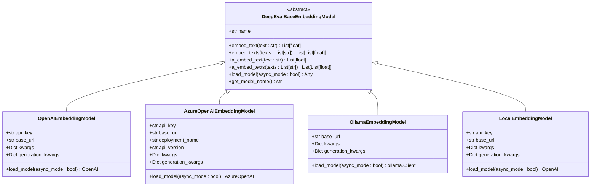
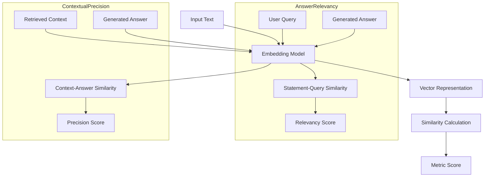

# Embedding Models Integration

<cite>
**Referenced Files in This Document**   
- [openai_embedding_model.py](file://deepeval/models/embedding_models/openai_embedding_model.py)
- [azure_embedding_model.py](file://deepeval/models/embedding_models/azure_embedding_model.py)
- [ollama_embedding_model.py](file://deepeval/models/embedding_models/ollama_embedding_model.py)
- [local_embedding_model.py](file://deepeval/models/embedding_models/local_embedding_model.py)
- [base_model.py](file://deepeval/models/base_model.py)
- [settings.py](file://deepeval/config/settings.py)
- [key_handler.py](file://deepeval/key_handler.py)
- [answer_relevancy.py](file://deepeval/metrics/answer_relevancy/answer_relevancy.py)
- [contextual_precision.py](file://deepeval/metrics/contextual_precision/contextual_precision.py)
- [utils.py](file://deepeval/models/utils.py)
</cite>

## Table of Contents
1. [Introduction](#introduction)
2. [Role of Embedding Models in RAG Evaluation](#role-of-embedding-models-in-rag-evaluation)
3. [Embedding Model Architecture](#embedding-model-architecture)
4. [Configuration of Embedding Models](#configuration-of-embedding-models)
5. [Using Embeddings in Metrics](#using-embeddings-in-metrics)
6. [Customizing Embedding Backend](#customizing-embedding-backend)
7. [Common Issues and Solutions](#common-issues-and-solutions)
8. [Performance Considerations](#performance-considerations)
9. [Best Practices](#best-practices)
10. [Conclusion](#conclusion)

## Introduction
This document provides comprehensive guidance on embedding model integrations in DeepEval, focusing on their critical role in evaluating Retrieval-Augmented Generation (RAG) systems. The document covers the architecture of the embedding model system, configuration options for various providers, and practical considerations for implementation. DeepEval supports multiple embedding model providers including OpenAI, Azure, Ollama, and local models through a unified interface, enabling flexible evaluation of RAG systems across different deployment scenarios.

**Section sources**
- [openai_embedding_model.py](file://deepeval/models/embedding_models/openai_embedding_model.py#L1-L136)
- [azure_embedding_model.py](file://deepeval/models/embedding_models/azure_embedding_model.py#L1-L167)

## Role of Embedding Models in RAG Evaluation
Embedding models play a crucial role in RAG evaluation metrics such as AnswerRelevancy and ContextualPrecision. These models convert text into high-dimensional vector representations that capture semantic meaning, enabling similarity comparisons between different pieces of text. In RAG systems, embedding models are used to evaluate whether retrieved context chunks are relevant to the user query and whether the generated answer is relevant to both the query and the retrieved context.

For AnswerRelevancy, embedding models help determine if the generated answer contains information that is semantically related to the input query. The metric evaluates whether the answer is focused on the relevant aspects of the question by comparing the embedding similarity between the query and answer components. Similarly, ContextualPrecision assesses whether the retrieved context contains information that is actually used in generating the answer, ensuring that the retrieval component is effectively supporting the generation process.

The effectiveness of these metrics depends heavily on the quality of the embedding model, as poor embeddings can lead to inaccurate similarity assessments and misleading evaluation scores. High-quality embedding models can distinguish between semantically similar and dissimilar content, providing more reliable evaluation results.

**Section sources**
- [answer_relevancy.py](file://deepeval/metrics/answer_relevancy/answer_relevancy.py#L1-L320)
- [contextual_precision.py](file://deepeval/metrics/contextual_precision/contextual_precision.py#L1-L306)

## Embedding Model Architecture
DeepEval implements a unified architecture for embedding model integration through a base class hierarchy that supports multiple providers. The core of this architecture is the `DeepEvalBaseEmbeddingModel` abstract base class defined in `base_model.py`, which establishes the interface for all embedding models. This base class defines the essential methods that all embedding models must implement: `embed_text`, `embed_texts`, `a_embed_text`, and `a_embed_texts` for both synchronous and asynchronous operations.

The architecture follows an inheritance model where specific provider implementations extend the base class. The four main embedding model classes are:
- `OpenAIEmbeddingModel` for OpenAI's embedding services
- `AzureOpenAIEmbeddingModel` for Azure OpenAI embedding services
- `OllamaEmbeddingModel` for Ollama local embedding models
- `LocalEmbeddingModel` for generic local embedding models

Each implementation follows the same pattern of inheriting from `DeepEvalBaseEmbeddingModel` and implementing the required methods while adding provider-specific configuration options. The architecture uses dependency injection and configuration management to allow seamless switching between different embedding providers without changing the core evaluation logic.

**Diagram sources **
- [base_model.py](file://deepeval/models/base_model.py#L124-L177)
- [openai_embedding_model.py](file://deepeval/models/embedding_models/openai_embedding_model.py#L34-L136)
- [azure_embedding_model.py](file://deepeval/models/embedding_models/azure_embedding_model.py#L28-L167)
- [ollama_embedding_model.py](file://deepeval/models/embedding_models/ollama_embedding_model.py#L20-L114)
- [local_embedding_model.py](file://deepeval/models/embedding_models/local_embedding_model.py#L21-L133)

## Configuration of Embedding Models
Configuring embedding models in DeepEval can be accomplished through multiple methods, with support for environment variables, direct parameter passing, and configuration files. Each embedding model type has specific configuration requirements that must be met for proper operation.

### OpenAI Embedding Model Configuration
The OpenAI embedding model can be configured using either environment variables or direct parameters. The primary configuration options include:
- `model`: The specific embedding model to use (e.g., "text-embedding-3-small", "text-embedding-3-large", "text-embedding-ada-002")
- `api_key`: OpenAI API key for authentication
- `generation_kwargs`: Additional parameters to pass to the OpenAI API

Configuration can be done through environment variables (`OPENAI_API_KEY`) or by passing the API key directly to the constructor. The default model is "text-embedding-3-small" if no model is specified.

### Azure OpenAI Embedding Model Configuration
The Azure OpenAI embedding model requires additional configuration parameters specific to the Azure platform:
- `model`: The model name
- `api_key`: Azure OpenAI API key
- `base_url`: Azure endpoint URL
- `deployment_name`: Azure deployment name
- `api_version`: API version to use

These can be configured via environment variables (`AZURE_OPENAI_API_KEY`, `AZURE_OPENAI_ENDPOINT`, `AZURE_EMBEDDING_DEPLOYMENT_NAME`, `AZURE_EMBEDDING_MODEL_NAME`, `OPENAI_API_VERSION`) or passed directly to the constructor.

### Ollama Embedding Model Configuration
The Ollama embedding model configuration focuses on local deployment settings:
- `model`: The Ollama model name
- `base_url`: The Ollama server URL (default: http://localhost:11434)
- `generation_kwargs`: Additional parameters for the Ollama API

Configuration can use environment variables (`LOCAL_EMBEDDING_BASE_URL`, `LOCAL_EMBEDDING_MODEL_NAME`) or direct parameter passing.

### Local Embedding Model Configuration
The local embedding model serves as a generic interface for self-hosted embedding services:
- `model`: The model name
- `api_key`: API key for the local service
- `base_url`: Base URL of the local embedding service
- `generation_kwargs`: Additional API parameters

This model uses environment variables (`LOCAL_EMBEDDING_API_KEY`, `LOCAL_EMBEDDING_BASE_URL`, `LOCAL_EMBEDDING_MODEL_NAME`) or direct parameters for configuration.

All embedding models support a unified interface through the `initialize_embedding_model` function, which automatically selects the appropriate model based on configuration settings or explicit model specification.

**Section sources**
- [openai_embedding_model.py](file://deepeval/models/embedding_models/openai_embedding_model.py#L36-L136)
- [azure_embedding_model.py](file://deepeval/models/embedding_models/azure_embedding_model.py#L29-L167)
- [ollama_embedding_model.py](file://deepeval/models/embedding_models/ollama_embedding_model.py#L21-L114)
- [local_embedding_model.py](file://deepeval/models/embedding_models/local_embedding_model.py#L22-L133)
- [settings.py](file://deepeval/config/settings.py#L409-L417)
- [key_handler.py](file://deepeval/key_handler.py#L99-L111)

## Using Embeddings in Metrics
Embeddings are integral to several RAG evaluation metrics in DeepEval, particularly AnswerRelevancy and ContextualPrecision. These metrics leverage embeddings to assess the semantic relationships between different components of the RAG pipeline.

In AnswerRelevancy, embeddings are used to evaluate whether the generated answer is relevant to the input query. The metric typically breaks down the answer into statements and compares the embedding similarity between each statement and the original query. This allows the metric to identify which parts of the answer are directly addressing the question and which parts may be irrelevant or off-topic.

ContextualPrecision uses embeddings to determine whether the retrieved context chunks are actually used in generating the answer. The metric compares the embedding similarity between context chunks and the generated answer, assessing whether the information in each retrieved chunk contributes to the final response. This helps identify cases where the retrieval system may be fetching irrelevant information or where the generation system is not effectively utilizing the retrieved context.

The embedding process follows a consistent pattern across metrics:
1. Text content (query, answer, context) is passed to the embedding model
2. The embedding model converts the text to a vector representation
3. Similarity calculations are performed between vectors
4. Results are used to compute the final metric score

This approach enables quantitative assessment of qualitative aspects of RAG performance, providing insights into the effectiveness of both retrieval and generation components.

**Diagram sources **
- [answer_relevancy.py](file://deepeval/metrics/answer_relevancy/answer_relevancy.py#L256-L273)
- [contextual_precision.py](file://deepeval/metrics/contextual_precision/contextual_precision.py#L242-L265)

## Customizing Embedding Backend
DeepEval provides flexible options for customizing the embedding backend to suit specific requirements and deployment scenarios. Users can customize the embedding backend through configuration settings, environment variables, or direct code implementation.

The primary method for customizing the embedding backend is through the `initialize_embedding_model` function in `utils.py`, which automatically selects the appropriate embedding model based on configuration settings. Users can influence this selection through several mechanisms:

1. **Environment Variables**: Setting specific environment variables enables different embedding providers:
   - `USE_AZURE_OPENAI_EMBEDDING="yes"` for Azure OpenAI
   - `USE_LOCAL_EMBEDDINGS="yes"` for local embeddings
   - `LOCAL_EMBEDDING_API_KEY="ollama"` for Ollama embeddings

2. **Direct Model Specification**: Users can pass a specific embedding model instance directly to metrics or evaluation functions, bypassing the automatic selection process.

3. **Configuration Files**: Settings can be persisted in dotenv files or the DeepEval configuration system for consistent behavior across sessions.

4. **Programmatic Configuration**: Users can create custom embedding model instances with specific parameters and use them throughout their evaluation pipeline.

The customization process follows a hierarchy of precedence: explicitly passed model parameters take precedence over environment variables, which in turn take precedence over default settings. This allows for flexible configuration that can be easily overridden for specific use cases.

When customizing the embedding backend, users should ensure that all required configuration parameters are provided for their chosen provider. For example, Azure OpenAI requires deployment names and API versions, while local models require base URLs and API keys.

**Section sources**
- [utils.py](file://deepeval/models/utils.py#L600-L617)
- [settings.py](file://deepeval/config/settings.py#L409-L417)
- [key_handler.py](file://deepeval/key_handler.py#L99-L111)

## Common Issues and Solutions
Several common issues can arise when working with embedding models in DeepEval, particularly related to configuration, compatibility, and performance. Understanding these issues and their solutions is crucial for effective implementation.

### Dimension Mismatches
Dimension mismatches occur when embedding models produce vectors of different dimensions than expected by downstream components. This can happen when switching between different embedding models or versions. Solutions include:
- Ensuring consistent embedding model selection across the evaluation pipeline
- Validating embedding dimensions before similarity calculations
- Using dimension normalization techniques when necessary

### API Rate Limits
API rate limits can impact evaluation performance, especially when processing large datasets. Mitigation strategies include:
- Implementing retry logic with exponential backoff
- Caching embedding results to avoid redundant API calls
- Using local embedding models for high-volume evaluation
- Monitoring API usage and adjusting evaluation batch sizes

### Offline Model Availability
Offline model availability is a concern for local and self-hosted embedding models. Issues can arise from:
- Model server downtime
- Network connectivity problems
- Resource constraints on the hosting machine

Solutions include:
- Implementing health checks for local embedding servers
- Using fallback mechanisms to alternative embedding providers
- Ensuring adequate hardware resources for local models
- Monitoring server performance and availability

### Configuration Errors
Common configuration errors include:
- Missing API keys or authentication credentials
- Incorrect endpoint URLs
- Invalid model names or deployment names
- Mismatched API versions

Prevention strategies include:
- Validating configuration settings before use
- Providing clear error messages for common configuration issues
- Using configuration validation tools
- Documenting required configuration parameters for each provider

**Section sources**
- [openai_embedding_model.py](file://deepeval/models/embedding_models/openai_embedding_model.py#L53-L63)
- [azure_embedding_model.py](file://deepeval/models/embedding_models/azure_embedding_model.py#L74-L93)
- [ollama_embedding_model.py](file://deepeval/models/embedding_models/ollama_embedding_model.py#L50-L55)
- [local_embedding_model.py](file://deepeval/models/embedding_models/local_embedding_model.py#L45-L57)

## Performance Considerations
When selecting and configuring embedding models for DeepEval, several performance considerations must be balanced to achieve optimal evaluation results.

### Latency
Latency is a critical factor in evaluation performance, particularly for real-time or high-volume evaluation scenarios. Cloud-based embedding services like OpenAI and Azure typically have higher latency due to network round-trip times, while local models can provide lower latency when properly configured. Factors affecting latency include:
- Network connectivity and bandwidth
- Server processing time
- Request queueing and throttling
- Model complexity and size

### Cost
Cost considerations vary significantly between embedding providers:
- OpenAI and Azure charge per token processed
- Local models have upfront infrastructure costs but no per-use fees
- Ollama models are free to use but require local computational resources

Cost optimization strategies include:
- Caching embedding results to avoid redundant calculations
- Using smaller, more efficient models when possible
- Batch processing to reduce API call overhead
- Monitoring usage and adjusting model selection based on cost-performance trade-offs

### Accuracy
Accuracy of embedding models varies by provider and model version. Generally:
- Larger models tend to produce more accurate embeddings but with higher computational costs
- Specialized models may perform better on specific domains or tasks
- Newer model versions often provide improved accuracy over older versions

Accuracy should be evaluated based on the specific use case and domain, as performance can vary significantly across different types of content.

### Trade-offs
The selection of embedding models involves several trade-offs:
- **Cloud vs. Local**: Cloud services offer ease of use and maintenance but with ongoing costs and potential latency, while local models provide more control and potentially lower costs but require infrastructure management.
- **Model Size**: Larger models generally provide better accuracy but with higher computational requirements and costs.
- **Latency vs. Accuracy**: Faster models may sacrifice some accuracy, while more accurate models may have higher latency.

These trade-offs should be evaluated based on the specific requirements of the evaluation use case, including budget constraints, performance requirements, and accuracy needs.

**Section sources**
- [openai_embedding_model.py](file://deepeval/models/embedding_models/openai_embedding_model.py#L21-L25)
- [azure_embedding_model.py](file://deepeval/models/embedding_models/azure_embedding_model.py#L21-L25)
- [ollama_embedding_model.py](file://deepeval/models/embedding_models/ollama_embedding_model.py#L1-L5)
- [local_embedding_model.py](file://deepeval/models/embedding_models/local_embedding_model.py#L1-L5)

## Best Practices
Implementing embedding models in DeepEval effectively requires following several best practices to ensure reliable, efficient, and accurate evaluation results.

### Selection Based on Use Case
Select embedding models based on specific use case requirements:
- For production evaluation with budget constraints, consider local models or cost-effective cloud options
- For maximum accuracy regardless of cost, use the latest large models from major providers
- For low-latency requirements, prioritize local models or edge-optimized services
- For domain-specific content, evaluate specialized models that may perform better on specific types of text

### Integration Complexity Management
Manage integration complexity by:
- Using environment variables for configuration to simplify deployment across different environments
- Implementing configuration validation to catch errors early
- Documenting configuration requirements for each embedding provider
- Using the unified interface to minimize code changes when switching providers

### Performance Optimization
Optimize performance through:
- Implementing result caching to avoid redundant embedding calculations
- Using asynchronous operations when processing multiple evaluations
- Monitoring API usage and adjusting batch sizes to stay within rate limits
- Regularly evaluating model performance and updating to newer versions when beneficial

### Reliability and Error Handling
Ensure reliability by:
- Implementing retry logic for transient failures
- Using fallback mechanisms to alternative embedding providers
- Monitoring model availability and performance
- Implementing comprehensive error handling for configuration and runtime issues

### Security and Privacy
Address security and privacy concerns by:
- Properly managing API keys and credentials
- Using environment variables or secure storage for sensitive information
- Considering data privacy implications when using cloud-based embedding services
- Evaluating local models for sensitive or confidential content

Following these best practices will help ensure successful implementation of embedding models in DeepEval, providing reliable and meaningful evaluation results for RAG systems.

**Section sources**
- [openai_embedding_model.py](file://deepeval/models/embedding_models/openai_embedding_model.py#L1-L136)
- [azure_embedding_model.py](file://deepeval/models/embedding_models/azure_embedding_model.py#L1-L167)
- [ollama_embedding_model.py](file://deepeval/models/embedding_models/ollama_embedding_model.py#L1-L114)
- [local_embedding_model.py](file://deepeval/models/embedding_models/local_embedding_model.py#L1-L133)

## Conclusion
DeepEval's embedding model integration provides a comprehensive and flexible framework for evaluating RAG systems through metrics like AnswerRelevancy and ContextualPrecision. The architecture supports multiple providers including OpenAI, Azure, Ollama, and local models through a unified interface, enabling users to select the most appropriate embedding backend for their specific requirements.

The system's design emphasizes ease of configuration, with support for environment variables, direct parameter passing, and configuration files. This flexibility allows users to customize the embedding backend based on factors such as cost, latency, accuracy, and integration complexity. The implementation follows best practices for error handling, performance optimization, and security, ensuring reliable evaluation results.

By understanding the role of embedding models in RAG evaluation, configuring the appropriate embedding backend, and following recommended best practices, users can effectively leverage DeepEval to assess and improve their RAG systems. The ability to customize and optimize the embedding infrastructure makes DeepEval a powerful tool for comprehensive RAG evaluation across diverse deployment scenarios.

[No sources needed since this section summarizes without analyzing specific files]