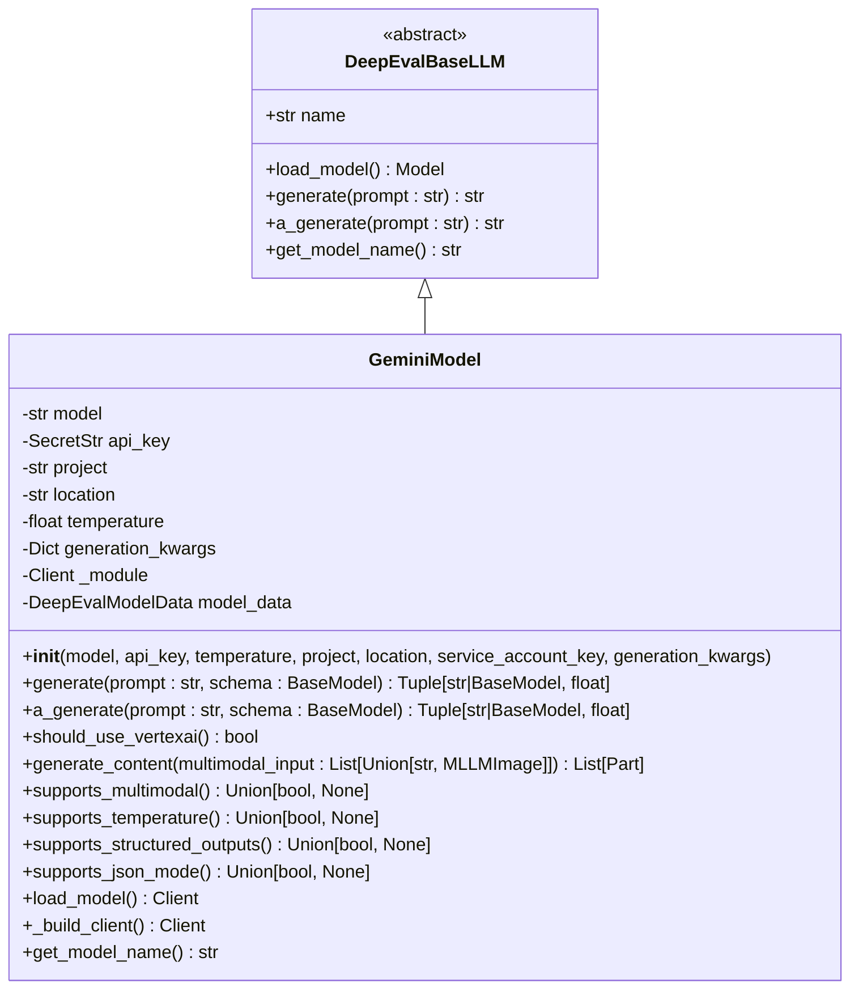
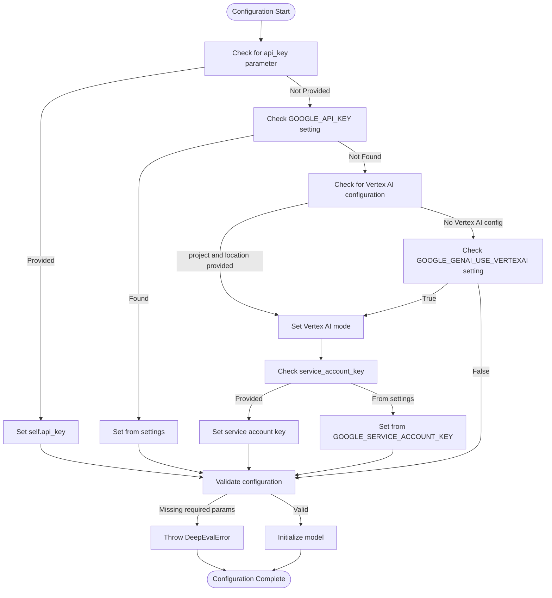
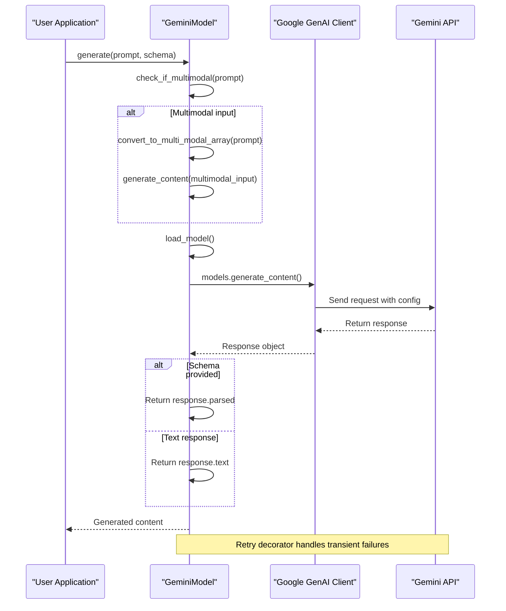
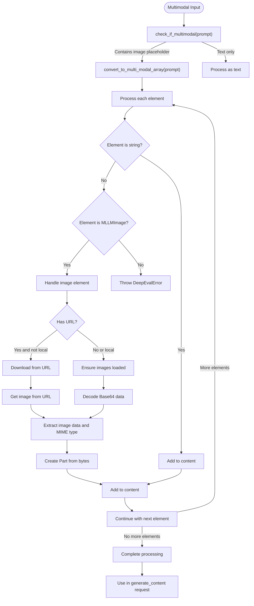
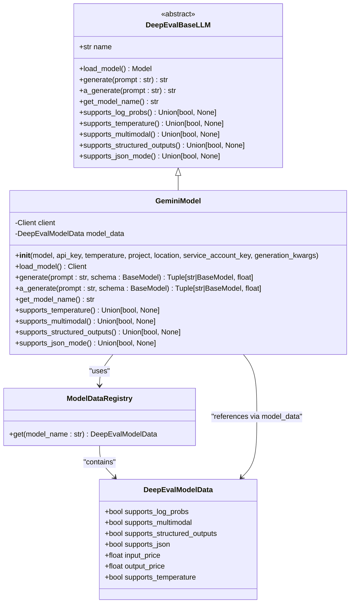
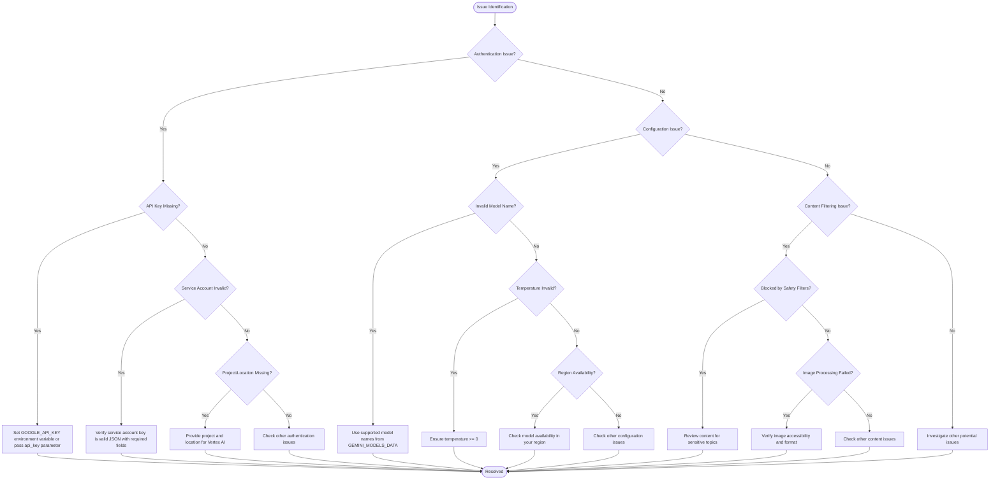
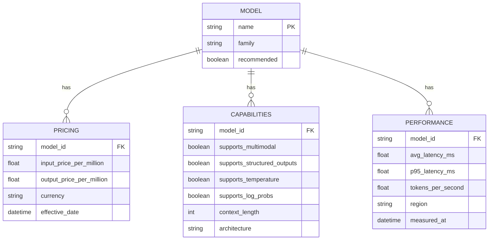

# Google GenAI Integration

<cite>
**Referenced Files in This Document**   
- [gemini_model.py](file://deepeval/models/llms/gemini_model.py)
- [constants.py](file://deepeval/models/llms/constants.py)
- [llm_test_case.py](file://deepeval/test_case/llm_test_case.py)
- [utils.py](file://deepeval/utils.py)
- [settings.py](file://deepeval/config/settings.py)
- [main.py](file://deepeval/cli/main.py)
</cite>

## Table of Contents
1. [Introduction](#introduction)
2. [GeminiModel Implementation](#gemini-model-implementation)
3. [Authentication and Configuration](#authentication-and-configuration)
4. [Request Payload and Response Handling](#request-payload-and-response-handling)
5. [Multimodal Input Support](#multimodal-input-support)
6. [Integration with DeepEvalBaseLLM](#integration-with-deepevalevalbasellm)
7. [Common Issues and Solutions](#common-issues-and-solutions)
8. [Performance and Cost Considerations](#performance-and-cost-considerations)
9. [Best Practices](#best-practices)
10. [Conclusion](#conclusion)

## Introduction
The Google GenAI integration in DeepEval enables evaluation using Google's Gemini models through the Google GenAI SDK. This integration provides a seamless way to leverage Gemini's advanced language capabilities for evaluating LLM applications. The integration supports both API key authentication and Vertex AI authentication, with comprehensive support for various Gemini models including gemini-1.5-pro, gemini-1.5-flash, and other variants.

The integration is designed to work within DeepEval's evaluation framework, allowing users to configure model parameters such as temperature, safety settings, and generation configurations. It supports structured outputs through Pydantic models and handles multimodal inputs by converting images to appropriate formats for Gemini processing.

This documentation provides a comprehensive guide to the Gemini integration, covering implementation details, configuration options, and best practices for effective evaluation.

**Section sources**
- [gemini_model.py](file://deepeval/models/llms/gemini_model.py#L31-L58)

## GeminiModel Implementation
The `GeminiModel` class implements Google Gemini models for text-based evaluation within DeepEval's framework. This class inherits from `DeepEvalBaseLLM` and provides the necessary methods to interface with Google's Gemini models through the Google GenAI SDK.

The implementation supports both text-only and multimodal inputs, with the ability to handle image data through the `MLLMImage` class. The class provides both synchronous and asynchronous generation methods (`generate` and `a_generate`), allowing for flexible integration into evaluation workflows.

Key capabilities of the `GeminiModel` class include:
- Support for structured outputs using Pydantic models
- Configurable temperature settings
- Safety settings configuration
- Multimodal input handling
- Retry policies for robust API interactions

The class also implements capability checking methods such as `supports_multimodal()`, `supports_temperature()`, and `supports_structured_outputs()` that query the model's capabilities based on the configured model name.

**Diagram sources**
- [gemini_model.py](file://deepeval/models/llms/gemini_model.py#L31-L433)
- [base_model.py](file://deepeval/models/base_model.py#L45-L177)

**Section sources**
- [gemini_model.py](file://deepeval/models/llms/gemini_model.py#L31-L433)

## Authentication and Configuration
The Gemini integration supports multiple authentication methods and configuration options to accommodate different deployment scenarios. Authentication can be performed using either an API key or service account credentials for Vertex AI.

For API key authentication, users can provide the API key directly through the `api_key` parameter or set it via the `GOOGLE_API_KEY` environment variable. For Vertex AI authentication, users must provide a service account key along with the Google Cloud project ID and location. The service account key can be provided as a JSON string, a dictionary, or through the `GOOGLE_SERVICE_ACCOUNT_KEY` environment variable.

Configuration parameters include:
- `model`: Name of the Gemini model to use (default: gemini-1.5-pro)
- `api_key`: Google API key for authentication
- `temperature`: Model temperature (default: 0.0)
- `project`: Google Cloud project ID
- `location`: Google Cloud location
- `service_account_key`: Service account key for Vertex AI authentication
- `generation_kwargs`: Additional generation parameters

The integration also supports configuration through environment variables and DeepEval settings, allowing for flexible deployment across different environments.

**Diagram sources**
- [gemini_model.py](file://deepeval/models/llms/gemini_model.py#L60-L119)
- [main.py](file://deepeval/cli/main.py#L1467-L1508)

**Section sources**
- [gemini_model.py](file://deepeval/models/llms/gemini_model.py#L60-L119)
- [main.py](file://deepeval/cli/main.py#L1467-L1508)

## Request Payload and Response Handling
The Gemini integration handles request payload construction and response parsing through the `generate` and `a_generate` methods. These methods create the appropriate request structure for the Gemini API and process the responses accordingly.

When generating content, the integration constructs a request payload that includes:
- The model name
- Input content (text and/or images)
- Generation configuration with safety settings
- Temperature settings
- Any additional generation parameters

For structured outputs, the integration uses Pydantic models to define the expected response schema. When a schema is provided, the request configures the response to be in JSON format with the specified schema, and the response is parsed into the corresponding Pydantic model instance.

The response handling includes:
- Extracting the generated text from successful responses
- Parsing structured outputs into Pydantic model instances
- Handling API errors and exceptions
- Implementing retry logic for transient failures

The integration also configures safety settings to minimize content filtering, setting all safety categories to BLOCK_NONE by default to ensure evaluation responses are not blocked.

**Diagram sources**
- [gemini_model.py](file://deepeval/models/llms/gemini_model.py#L221-L307)
- [utils.py](file://deepeval/utils.py#L541-L557)

**Section sources**
- [gemini_model.py](file://deepeval/models/llms/gemini_model.py#L221-L307)

## Multimodal Input Support
The Gemini integration provides comprehensive support for multimodal inputs through the `MLLMImage` class and related utilities. This allows the evaluation of models that can process both text and image data.

The multimodal input system works by:
1. Using the `MLLMImage` class to represent images in prompts
2. Converting multimodal strings containing image placeholders to structured arrays
3. Handling both local and remote images
4. Converting images to the appropriate format for Gemini API

The `MLLMImage` class supports various image sources:
- Local file paths
- Remote URLs
- Base64-encoded data
- File URLs

When processing multimodal inputs, the integration converts images to bytes and creates `Part` objects using the `from_bytes` method. For remote images, it downloads the image content using HTTP requests with configurable timeouts.

The system uses a placeholder format `[DEEPEVAL:IMAGE:{id}]` to represent images in text prompts, which are then parsed and replaced with actual image data during processing.

**Diagram sources**
- [gemini_model.py](file://deepeval/models/llms/gemini_model.py#L164-L214)
- [llm_test_case.py](file://deepeval/test_case/llm_test_case.py#L31-L200)
- [utils.py](file://deepeval/utils.py#L541-L557)

**Section sources**
- [gemini_model.py](file://deepeval/models/llms/gemini_model.py#L164-L214)
- [llm_test_case.py](file://deepeval/test_case/llm_test_case.py#L31-L200)

## Integration with DeepEvalBaseLLM
The Gemini integration seamlessly integrates with DeepEval's `DeepEvalBaseLLM` interface, adhering to the required contract for LLM evaluation models. This integration allows the Gemini model to be used interchangeably with other LLM providers within DeepEval's evaluation framework.

The `GeminiModel` class implements all required methods from the `DeepEvalBaseLLM` abstract base class:
- `load_model()`: Creates and returns a Google GenAI client
- `generate()`: Synchronously generates text from a prompt
- `a_generate()`: Asynchronously generates text from a prompt
- `get_model_name()`: Returns the model name with provider identifier

Additionally, the class implements capability checking methods that return information about the model's features based on the configured model name. These methods query the `GEMINI_MODELS_DATA` registry to determine support for features like multimodal inputs, temperature settings, structured outputs, and JSON mode.

The integration also handles the conversion of DeepEval's internal data structures to formats compatible with the Google GenAI SDK, ensuring seamless data flow between the evaluation framework and the underlying model API.

**Diagram sources**
- [gemini_model.py](file://deepeval/models/llms/gemini_model.py#L31-L433)
- [base_model.py](file://deepeval/models/base_model.py#L45-L177)
- [constants.py](file://deepeval/models/llms/constants.py#L563-L677)

**Section sources**
- [gemini_model.py](file://deepeval/models/llms/gemini_model.py#L31-L433)
- [base_model.py](file://deepeval/models/base_model.py#L45-L177)

## Common Issues and Solutions
The Gemini integration may encounter several common issues related to authentication, configuration, and content filtering. Understanding these issues and their solutions is crucial for successful implementation.

**Authentication Issues:**
- Missing API key: Ensure either `api_key` parameter is provided or `GOOGLE_API_KEY` environment variable is set
- Invalid service account key: Verify the service account key is valid JSON and contains required fields
- Missing project or location: When using Vertex AI, both project and location must be provided

**Configuration Issues:**
- Incorrect model name: Use supported model names like gemini-1.5-pro, gemini-1.5-flash, etc.
- Temperature out of range: Temperature must be >= 0
- Region-specific availability: Some models may not be available in all regions

**Content Filtering Issues:**
- Responses blocked by safety filters: The integration configures safety settings to BLOCK_NONE by default, but extremely sensitive content may still be filtered
- Image processing failures: Ensure images are accessible and in supported formats

Solutions include:
- Using environment variables for sensitive credentials
- Validating configuration before initialization
- Implementing proper error handling and retry logic
- Monitoring API quotas and rate limits

**Diagram sources**
- [gemini_model.py](file://deepeval/models/llms/gemini_model.py#L77-L112)
- [gemini_model.py](file://deepeval/models/llms/gemini_model.py#L373-L398)
- [settings.py](file://deepeval/config/settings.py#L1-L200)

**Section sources**
- [gemini_model.py](file://deepeval/models/llms/gemini_model.py#L77-L112)
- [gemini_model.py](file://deepeval/models/llms/gemini_model.py#L373-L398)

## Performance and Cost Considerations
The Gemini integration involves several performance and cost considerations that impact evaluation efficiency and budget. Understanding these factors helps optimize the use of Gemini models for evaluation tasks.

**Performance Characteristics:**
- Latency varies by model: gemini-1.5-flash is optimized for speed, while gemini-1.5-pro offers higher quality with potentially longer response times
- Network latency depends on the proximity to Google's API endpoints
- Processing time increases with input/output length and complexity

**Cost Implications:**
- Pricing is based on input and output token usage
- Different models have different pricing tiers
- Costs can be estimated using the model data in `GEMINI_MODELS_DATA`

The integration provides cost data for various models through the `GEMINI_MODELS_DATA` registry, which includes input and output prices per million tokens. This allows users to estimate costs based on expected token usage.

Performance optimization strategies include:
- Using faster models (like gemini-1.5-flash) for less complex evaluations
- Caching results for repeated evaluations
- Batch processing when possible
- Optimizing prompts to minimize token usage

**Diagram sources**
- [constants.py](file://deepeval/models/llms/constants.py#L563-L677)
- [gemini_model.py](file://deepeval/models/llms/gemini_model.py#L75-L76)

**Section sources**
- [constants.py](file://deepeval/models/llms/constants.py#L563-L677)

## Best Practices
Implementing the Gemini integration effectively requires following several best practices for prompt engineering, configuration management, and error handling.

**Prompt Engineering:**
- Use clear, specific prompts for evaluation tasks
- Include sufficient context for accurate evaluation
- Structure prompts to minimize ambiguity
- Test prompts with different models to ensure consistency

**Configuration Management:**
- Use environment variables for sensitive credentials
- Set default configurations in settings files
- Validate configurations before initialization
- Document configuration options for team members

**Error Handling:**
- Implement retry logic for transient failures
- Handle authentication errors gracefully
- Monitor and log API usage and errors
- Set appropriate timeouts for API calls

**Performance Optimization:**
- Choose the appropriate model based on evaluation requirements
- Use faster models for preliminary evaluations
- Cache results for repeated evaluations
- Monitor token usage to control costs

**Security Considerations:**
- Keep API keys and service account credentials secure
- Use secret management for production deployments
- Regularly rotate credentials
- Limit service account permissions to minimum required

```mermaid
flowchart TD
Start([Best Practices]) --> PromptEngineering["Prompt Engineering"]
Start --> ConfigurationManagement["Configuration Management"]
Start --> ErrorHandling["Error Handling"]
Start --> PerformanceOptimization["Performance Optimization"]
Start --> SecurityConsiderations["Security Considerations"]
PromptEngineering --> ClearPrompts["Use clear, specific prompts"]
PromptEngineering --> SufficientContext["Include sufficient context"]
PromptEngineering --> MinimizeAmbiguity["Structure to minimize ambiguity"]
PromptEngineering --> TestConsistency["Test across models"]
ConfigurationManagement --> EnvVariables["Use environment variables"]
ConfigurationManagement --> DefaultSettings["Set default configurations"]
ConfigurationManagement --> ValidateConfig["Validate before use"]
ConfigurationManagement --> DocumentOptions["Document options"]
ErrorHandling --> RetryLogic["Implement retry logic"]
ErrorHandling --> GracefulAuth["Handle auth errors"]
ErrorHandling --> MonitorErrors["Monitor and log"]
ErrorHandling --> SetTimeouts["Set appropriate timeouts"]
PerformanceOptimization --> ChooseModel["Choose appropriate model"]
PerformanceOptimization --> UseFastModels["Use faster models"]
PerformanceOptimization --> CacheResults["Cache results"]
PerformanceOptimization --> MonitorTokens["Monitor token usage"]
SecurityConsiderations --> SecureCredentials["Keep credentials secure"]
SecurityConsiderations --> SecretManagement["Use secret management"]
SecurityConsiderations --> RotateCredentials["Rotate regularly"]
SecurityConsiderations --> LimitPermissions["Limit permissions"]
```

**Diagram sources**
- [gemini_model.py](file://deepeval/models/llms/gemini_model.py#L77-L119)
- [gemini_model.py](file://deepeval/models/llms/gemini_model.py#L420-L428)

**Section sources**
- [gemini_model.py](file://deepeval/models/llms/gemini_model.py#L77-L119)

## Conclusion
The Google GenAI integration in DeepEval provides a robust and flexible way to evaluate LLM applications using Google's Gemini models. The integration supports both API key and Vertex AI authentication methods, with comprehensive configuration options for model selection, temperature settings, and generation parameters.

Key features of the integration include:
- Support for multiple Gemini models with different performance and cost characteristics
- Multimodal input handling through the `MLLMImage` class
- Structured output support using Pydantic models
- Seamless integration with DeepEval's evaluation framework
- Comprehensive error handling and retry logic

The integration is designed to be user-friendly while providing the flexibility needed for various evaluation scenarios. By following the best practices outlined in this documentation, users can effectively leverage Gemini models for accurate and efficient LLM evaluation.

Future enhancements may include additional model support, improved performance monitoring, and enhanced multimodal capabilities, further strengthening the integration's value within the DeepEval ecosystem.

[No sources needed since this section summarizes without analyzing specific files]